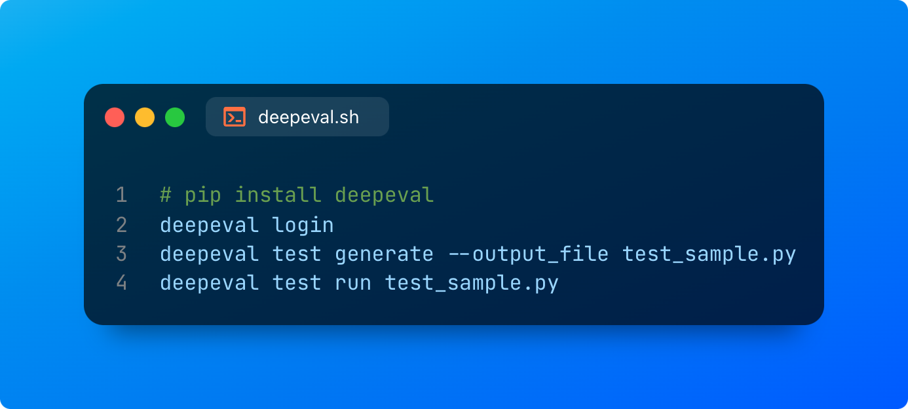
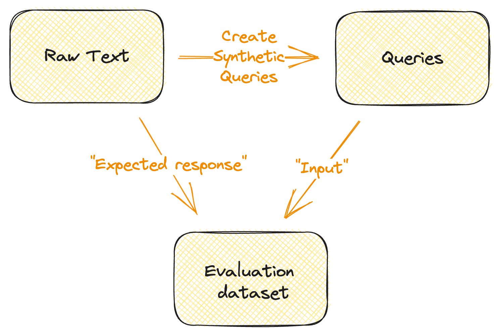

# 👩‍⚖️ DeepEval

[](https://discord.gg/a3K9c8GRGt)

<a target="_blank" href="https://colab.research.google.com/drive/1HxPWwNdNnq6cLkMh4NQ_pAAPgd8vlOly?usp=sharing">
  
</a>

DeepEval provides a Pythonic way to run offline evaluations on your LLM pipelines so you can launch comfortably into production. The guiding philosophy is a "Pytest for LLM" that aims to make productionizing and evaluating LLMs as easy as ensuring all tests pass.

Would you like to be onboarded / would like a demo / want to see about our roadmap? Feel free to book in a time on our calendly here: https://calendly.com/d/z7h-75h-6dz/confident-ai-demo

# Documentation

We highly recommend getting started through our documentation here: https://docs.confident-ai.com/docs/

Join our discord: https://discord.gg/a3K9c8GRGt

## Why DeepEval?

Deepeval aims to make writing tests for LLM applications (such as RAG) as easy as writing Python unit tests.

For any Python developer building production-grade apps, it is common to set up PyTest as the default testing suite as it provides a clean interface to quickly write tests.

However, it is often uncommon for many machine learning engineers as their feedback is often in the form of an evaluation loss.

With the advent of agents, LLMs and AI, there is yet to be a tool that can provide software-like tooling and abstractions for machine learning engineers where the feedback loop of these iterations can be significantly reduced.

It is therefore important then to build a new type of testing framework for LLMs to ensure engineers can keep iterating on their prompts, agents and LLMs while being able to continuously add to their test suite.

Introducing DeepEval.

# Installation

```
pip install deepeval
```

# QuickStart



## Running from a command-line interface

```bash
# Optional - if you want a web UI
deepeval login
# Run a sample test
deepeval login
# Generate a sample test file
deepeval test generate --output-file test_sample.py
# Run this test
deepeval test run test_sample.py
```

```bash
deepeval test run tests/test_sample.py
```

## Individual Test Cases

Grab your API key from [https://app.confident-ai.com](https://app.confident-ai.com) to start logging!

```python
# test_example.py
import os
import openai
from deepeval.metrics.factual_consistency import assert_factual_consistency

openai.api_key = "sk-XXX"

# Write a sample ChatGPT function
def generate_chatgpt_output(query: str):
    response = openai.ChatCompletion.create(
        model="gpt-3.5-turbo",
        messages=[
            {"role": "system", "content": "You are a helpful assistant."},
            {"role": "assistant", "content": "The customer success phone line is 1200-231-231 and the customer success state is in Austin."},
            {"role": "user", "content": query}
        ]
    )
    expected_output = response.choices[0].message.content
    return expected_output

def test_llm_output():
    query = "What is the customer success phone line?"
    expected_output = "Our customer success phone line is 1200-231-231."
    output = generate_chatgpt_output(query)
    assert_factual_consistency(output, expected_output)

test_llm_output()
```

Once you have set that up, you can simply call pytest

```bash
deepeval test run test_example.py

# Output
Running tests ... ✅
```

Once you have ran tests, you should be able to see your dashboard on [https://app.confident-ai.com](https://app.confident-ai.com)

## Setting up metrics

### Setting up custom metrics

To define a custom metric, you simply need to define the `measure` and `is_successful` property.

```python
from deepeval.metrics.metric import Metric

class LengthMetric(Metric):
    """This metric checks if the output is more than 3 letters"""
    def __init__(self, minimum_length: int=3):
        self.minimum_length = minimum_length

    def measure(self, text: str):
        # sends to server
        score = len(text)
        self.success = score > self.minimum_length
        # Optional: Logs it to the server
        self.log(
            query=text,
            score=score/100, # just to have something here - should be between 0 and 1
            success=self.success
        )
        return score

    def is_successful(self):
        return self.success

    @property
    def __name__(self):
        return "Length"

metric = LengthMetric()
score = metric.measure("this is a test")
assert metric.is_successful()
```

## Integrate tightly with LangChain

We integrate DeepEval tightly with common frameworks such as Langchain and lLamaIndex.

# Synthetic Query Generation



Generating synthetic queries allows you to quickly evaluate the queries related to your prompts.
We help developers get up and running with a lot of example queries.

# Dashboard

Set up a simple dashboard in just 1 line of code. You can read more about how to do this [here in our documentation](https://docs.confident-ai.com/docs/quickstart/dashboard-app).


# RoadMap

Our up-coming roadmap:

- [ ] Integration with LlamaIndex
- [ ] Project View To Web UI
- [ ] Integration with HumanEval
- [ ] Integration with Microsoft Guidance
- [ ] Integration

# Authors

Built by the Confident AI Team. For any questions/business enquiries - please contact jacky@twilix.io.
