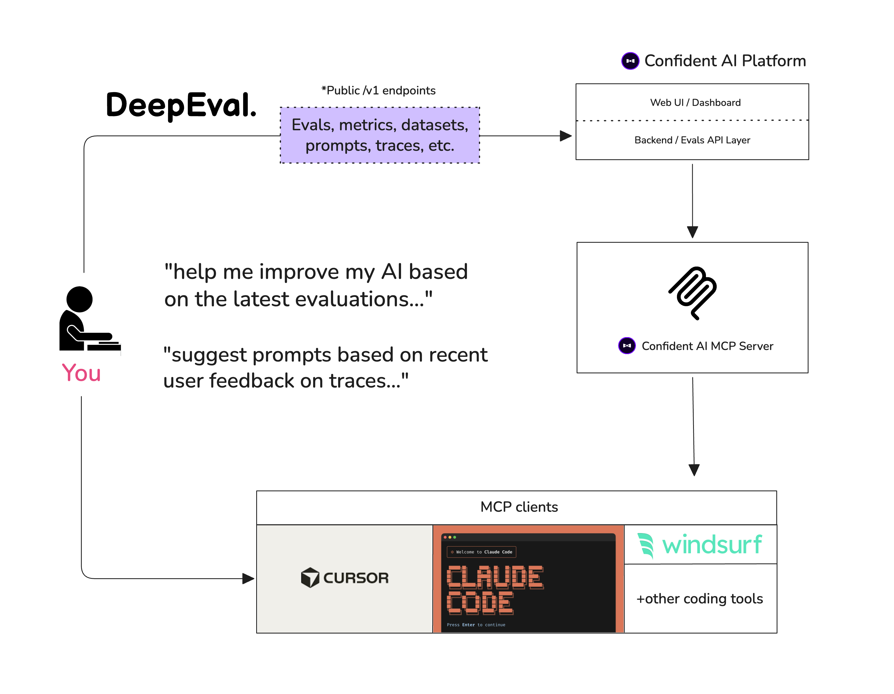

<p align="center">
    <picture>
        <source media="(prefers-color-scheme: dark)" srcset="assets/hero/wordmark-dark.svg">
        
    </picture>
</p>

<p align="center">
    <h1 align="center">大语言模型 (LLM) 评估框架</h1>
</p>

<p align="center">
<a href="https://trendshift.io/repositories/5917" target="_blank"></a>
</p>

<p align="center">
    <a href="https://discord.gg/3SEyvpgu2f">
        
    </a>
    <a href="https://www.reddit.com/r/deepeval/">
        
    </a>
</p>

<h4 align="center">
    <p>
        <a href="https://deepeval.com/docs/getting-started?utm_source=GitHub">官方文档</a> |
        <a href="#-评估指标与核心特性">评估指标与特性</a> |
        <a href="#-快速开始">快速入门</a> |
        <a href="#-框架生态集成">框架集成</a> |
        <a href="https://www.confident-ai.com?utm_source=deepeval&utm_medium=github&utm_content=header_nav&ref_page=github/readme">Confident AI</a>
    <p>
</h4>

<p align="center">
    <a href="https://github.com/confident-ai/deepeval/releases">
        
    </a>
    <a href="https://colab.research.google.com/drive/1PPxYEBa6eu__LquGoFFJZkhYgWVYE6kh?usp=sharing">
        
    </a>
    <a href="https://github.com/confident-ai/deepeval/blob/master/LICENSE.md">
        
    </a>
    <a href="https://x.com/deepeval">
        
    </a>
</p>

<p align="center">
    <strong>简体中文</strong> | <a href="README.md">English</a>
</p>

**DeepEval** 是一个易于上手的开源大语言模型（LLM）评估框架。它类似于 Pytest，但专为 LLM 应用程序的单元测试而打造。DeepEval 融合了学术界前沿研究成果，提供如 G-Eval、任务完成度、答案相关性、幻觉检测等丰富指标，支持 **LLM-as-a-judge（大模型作为裁判）** 以及可在**本地机器上运行**的各类 NLP 评估模型。

无论您是在构建 AI 智能体（Agents）、检索增强生成（RAG）流水线还是对话机器人（无论是基于 LangChain 还是 OpenAI 实现），DeepEval 都能全方位保驾护航。借助它，您可以轻松评估：

- **端到端黑盒评估** LLM 应用程序
- **全轨迹评估** 智能体的每一步决策与行动路径
- **单步组件级评估** 例如单次 LLM 调用、工具使用、文档检索与子智能体交接（Handoffs）

使用这些评测可以帮助您确定最佳的模型选型、提示词与架构设计，提升 AI 质量，防止提示词漂移，甚至让您信心十足地从 OpenAI 无缝迁移至 Claude。

> [!IMPORTANT]
> 想要对比多次迭代结果、共享评估报告并在生产环境中监控您的 AI？[注册体验 Confident AI](https://www.confident-ai.com?utm_source=deepeval&utm_medium=github&utm_content=signup_callout&ref_page=github/readme) —— 企业级 AI 评估与可观测性平台。
>
> 

> 想要探讨 LLM 评估方案、需要指标选型建议或交流反馈？[欢迎加入我们的 Discord 社区。](https://discord.com/invite/3SEyvpgu2f)

<br />

# 🔥 评估指标与核心特性

- 📐 提供丰富开箱即用的 LLM 评测指标（均配有详细解释说明），可由**任意选定**的 LLM、统计学方法或在**本地运行**的 NLP 模型驱动，覆盖全部业务场景：

  - **通用自定义指标：**

    - [G-Eval](https://deepeval.com/docs/metrics-llm-evals) — 经过学术研究验证的 LLM-as-a-judge 指标，能够以类人准确度根据任何自定义标准进行评测
    - [DAG](https://deepeval.com/docs/metrics-dag) — DeepEval 基于有向无环图的确定性 LLM 裁判指标构建器

  - <details>
    <summary><b>🤖 智能体（Agentic）评测指标</b></summary>

    - [Task Completion（任务完成度）](https://deepeval.com/docs/metrics-task-completion) — 评估智能体是否达成了预定目标
    - [Tool Correctness（工具调用正确性）](https://deepeval.com/docs/metrics-tool-correctness) — 校验是否使用了正确的工具及正确的参数
    - [Goal Accuracy（目标准确率）](https://deepeval.com/docs/metrics-goal-accuracy) — 衡量智能体达成预期目标的精准程度
    - [Step Efficiency（步骤执行效率）](https://deepeval.com/docs/metrics-step-efficiency) — 评估智能体是否存在不必要的多余步骤
    - [Plan Adherence（计划依从性）](https://deepeval.com/docs/metrics-plan-adherence) — 检查智能体是否严格遵循了既定计划
    - [Plan Quality（计划质量）](https://deepeval.com/docs/metrics-plan-quality) — 评估智能体所制定计划的合理性
    - [Tool Use（工具使用质量）](https://deepeval.com/docs/metrics-tool-use) — 衡量工具调用的综合质量
    - [Argument Correctness（参数正确性）](https://deepeval.com/docs/metrics-argument-correctness) — 校验工具调用参数的合法性

    </details>

  - <details>
    <summary><b>📚 RAG 检索增强指标</b></summary>

    - [Answer Relevancy（答案相关性）](https://deepeval.com/docs/metrics-answer-relevancy) — 衡量 RAG 管道输出与用户输入的切题程度
    - [Faithfulness（忠实度 / 去幻觉）](https://deepeval.com/docs/metrics-faithfulness) — 评估 RAG 输出是否完全基于检索到的上下文事实
    - [Contextual Recall（上下文召回率）](https://deepeval.com/docs/metrics-contextual-recall) — 衡量检索上下文与期望答案的契合程度
    - [Contextual Precision（上下文精准度）](https://deepeval.com/docs/metrics-contextual-precision) — 评估检索上下文中最相关的节点是否排名靠前
    - [Contextual Relevancy（上下文相关度）](https://deepeval.com/docs/metrics-contextual-relevancy) — 衡量检索上下文整体与输入的关联度
    - [RAGAS 综合评分](https://deepeval.com/docs/metrics-ragas) — 综合相关性、忠实度、精准度与召回率的加权平均值

    </details>

  - <details>
    <summary><b>💬 多轮对话指标</b></summary>

    - [Knowledge Retention（知识保持度）](https://deepeval.com/docs/metrics-knowledge-retention) — 评估机器人在长对话中能否记忆事实信息
    - [Conversation Completeness（对话完整度）](https://deepeval.com/docs/metrics-conversation-completeness) — 衡量机器人是否在全程对话中满足了用户需求
    - [Turn Relevancy（轮次相关性）](https://deepeval.com/docs/metrics-turn-relevancy) — 评估机器人在各轮交互中输出的一致相关性
    - [Turn Faithfulness（轮次忠实度）](https://deepeval.com/docs/metrics-turn-faithfulness) — 跨轮次检验机器人回答是否基于事实检索上下文
    - [Role Adherence（角色遵从度）](https://deepeval.com/docs/metrics-role-adherence) — 评估对话全程中机器人是否始终坚守设定人设

    </details>

  - <details>
    <summary><b>🔌 MCP (模型上下文协议) 指标</b></summary>

    - [MCP Task Completion（MCP 任务完成度）](https://deepeval.com/docs/metrics-mcp-task-completion) — 评估基于 MCP 的智能体完成任务的有效性
    - [MCP Use（MCP 工具使用效率）](https://deepeval.com/docs/metrics-mcp-use) — 衡量智能体利用可用 MCP 服务器的效率
    - [Multi-Turn MCP Use（多轮 MCP 使用）](https://deepeval.com/docs/metrics-multi-turn-mcp-use) — 评估跨对话轮次调用 MCP 服务器的表现

    </details>

  - <details>
    <summary><b>🎨 多模态指标</b></summary>

    - [Text to Image（文生图质量）](https://deepeval.com/docs/multimodal-metrics-text-to-image) — 基于语义一致性与感知质量评估图像生成效果
    - [Image Editing（图像编辑质量）](https://deepeval.com/docs/multimodal-metrics-image-editing) — 基于语义一致性与感知质量评估图像编辑效果
    - [Image Coherence（图文一致性）](https://deepeval.com/docs/multimodal-metrics-image-coherence) — 衡量图像与附带文本的契合度
    - [Image Helpfulness（图像实用性）](https://deepeval.com/docs/multimodal-metrics-image-helpfulness) — 评估图像对辅助用户理解文本的贡献程度
    - [Image Reference（图像引用准确性）](https://deepeval.com/docs/multimodal-metrics-image-reference) — 评估附带文本对图像内容的引用或解释精准度

    </details>

  - <details>
    <summary><b>🛡️ 其他常用指标</b></summary>

    - [Hallucination（幻觉检测）](https://deepeval.com/docs/metrics-hallucination) — 对比提供上下文，检测 LLM 是否生成虚假事实
    - [Summarization（摘要质量）](https://deepeval.com/docs/metrics-summarization) — 评估文本摘要是否事实准确且包含关键细节
    - [Bias（偏见检测）](https://deepeval.com/docs/metrics-bias) — 识别 LLM 输出中是否存在性别、种族或政治偏见
    - [Toxicity（毒性检测）](https://deepeval.com/docs/metrics-toxicity) — 评估模型输出的有害与攻击性语言
    - [JSON Correctness（JSON 正确性）](https://deepeval.com/docs/metrics-json-correctness) — 校验输出是否严格符合预期 JSON Schema
    - [Prompt Alignment（提示词对齐度）](https://deepeval.com/docs/metrics-prompt-alignment) — 衡量输出是否严格遵守提示词模板中的指令

    </details>

- 🎯 同时支持端到端与组件级别的全方位 LLM 评测。
- 🧩 支持构建自定义指标，并自动集成进 DeepEval 生态体系中。
- 🔮 自动生成单轮与多轮合成评测数据集。
- 🔗 与**任何** CI/CD 流水线无缝对接。
- 🧬 基于评测反馈结果自动优化提示词（Prompt Optimization）。
- 🏆 仅需[不足 10 行代码](https://deepeval.com/docs/benchmarks-introduction?utm_source=GitHub)即可在各大主流权威基准（MMLU, HellaSwag, DROP, BIG-Bench Hard, TruthfulQA, HumanEval, GSM8K 等）上对**任何** LLM 进行基准评测。

<br />

# 🔌 框架生态集成

DeepEval 能无缝插入主流 LLM 框架 —— OpenAI Agents、LangChain、CrewAI 等。针对需要跨团队统一评测与可观测性标准的企业团队，**Confident AI** 提供了原生无缝的深度集成。

## 支持的开发框架

- [LangChain](https://www.deepeval.com/integrations/frameworks/langchain?utm_source=GitHub) — 通过回调处理器评估 LangChain 应用程序
- [LangGraph](https://www.deepeval.com/integrations/frameworks/langgraph?utm_source=GitHub) — 通过回调处理器评估 LangGraph 智能体
- [Pydantic AI](https://www.deepeval.com/integrations/frameworks/pydanticai?utm_source=GitHub) — 基于类型安全验证评估 Pydantic AI 智能体
- [CrewAI](https://www.deepeval.com/integrations/frameworks/crewai?utm_source=GitHub) — 评估 CrewAI 多智能体协作系统
- [Anthropic](https://www.deepeval.com/integrations/frameworks/anthropic?utm_source=GitHub) — 通过客户端封装评估并追踪 Claude 应用程序
- [AWS AgentCore](https://www.deepeval.com/integrations/frameworks/agentcore?utm_source=GitHub) — 评估部署在 Amazon AgentCore 上的智能体
- [Google ADK](https://www.deepeval.com/integrations/frameworks/google-adk?utm_source=GitHub) — 评估 Google ADK 智能体及多智能体工作流
- [AI SDK](https://www.deepeval.com/integrations/frameworks/ai-sdk?utm_source=GitHub) — 评估 AI SDK 生成质量与工具循环轨迹
- [Mastra](https://www.deepeval.com/integrations/frameworks/mastra?utm_source=GitHub) — 通过原生追踪评估 Mastra 智能体与工作流
- [OpenAI](https://www.deepeval.com/integrations/frameworks/openai?utm_source=GitHub) — 通过客户端封装评估并追踪 OpenAI 应用程序
- [OpenAI Agents](https://www.deepeval.com/integrations/frameworks/openai-agents?utm_source=GitHub) — 在一分钟内对 OpenAI Agents 完成端到端评估
- [LlamaIndex](https://www.deepeval.com/integrations/frameworks/llamaindex?utm_source=GitHub) — 评估基于 LlamaIndex 构建的 RAG 应用程序

## ☁️ 平台与生态体系

[Confident AI](https://www.confident-ai.com?utm_source=deepeval&utm_medium=github&utm_content=platform_section&ref_page=github/readme) 是专为企业级生产 LLM 系统打造的 AI 评估与可观测性平台。它为组织内各产品团队建立一致的质量标准，原生集成 DeepEval，且对底层模型和开发框架完全解耦。

- **产品团队**：管理评测数据集，在应用发布前进行综合评测，并在生产环境中通过在线评估监控实时调用轨迹。
- **平台团队**：制定统一的企业级质量基线，通过合规治理与原生红队攻防测试（Red Teaming）进行安全护航。
- **无需 UI？** 可将 Confident AI 作为持久化数据层，通过 Confident AI 的 [MCP 服务器](https://github.com/confident-ai/confident-mcp-server) 在 Claude Code 或 Cursor 等编辑器中直接拉取数据集、运行评测并检查调用轨迹。

<p align="center">
  
</p>

<br />

# 🤖 AI 编程助手（Vibe-Coder）快速开始

想让您的 AI 编程智能体自动添加评测并修复用例失败？安装 DeepEval 技能包，将其指向您的智能体、RAG 流水线或对话机器人，即可自动生成数据集、编写评测套件、运行 `deepeval test run` 并迭代修复未达标的指标。

[阅读 5 分钟 AI 辅助编程指南](https://deepeval.com/docs/vibe-coder-quickstart?utm_source=GitHub)。

<br />

# 🚀 快速开始

假设您的 LLM 应用是一个基于 RAG 的智能客服助手，以下是 DeepEval 如何帮助测试您构建的系统：

## 1. 安装

DeepEval 支持 **Python>=3.9+**。

```bash
pip install -U deepeval
```

## 2. 登录平台（强烈推荐）

使用 `deepeval` 平台可以在云端生成可共享的测试分析报告。完全免费且无需额外配置代码：

```bash
deepeval login
```

按照命令行提示创建账户，复制 API 密钥并粘贴到终端中。所有测试用例将自动记录（详情见[数据隐私说明](https://deepeval.com/docs/data-privacy?utm_source=GitHub)）。

## 3. 编写首个测试用例

创建一个测试文件：

```bash
touch test_chatbot.py
```

编辑 `test_chatbot.py`，编写第一个端到端评估用例（将 LLM 应用视为黑盒）：

```python
import pytest
from deepeval import assert_test
from deepeval.metrics import GEval
from deepeval.test_case import LLMTestCase, SingleTurnParams

def test_case():
    correctness_metric = GEval(
        name="Correctness",
        criteria="Determine if the 'actual output' is correct based on the 'expected output'.",
        evaluation_params=[SingleTurnParams.ACTUAL_OUTPUT, SingleTurnParams.EXPECTED_OUTPUT],
        threshold=0.5
    )
    test_case = LLMTestCase(
        input="What if these shoes don't fit?",
        # 将此处替换为您应用生成的实际输出
        actual_output="You have 30 days to get a full refund at no extra cost.",
        expected_output="We offer a 30-day full refund at no extra costs.",
        retrieval_context=["All customers are eligible for a 30 day full refund at no extra costs."]
    )
    assert_test(test_case, [correctness_metric])
```

设置环境变量 `OPENAI_API_KEY`（您也可以使用自己的自定义模型，详见[文档](https://deepeval.com/docs/metrics-introduction#using-a-custom-llm?utm_source=GitHub)）：

```bash
export OPENAI_API_KEY="..."
```

最后在终端中运行测试：

```bash
deepeval test run test_chatbot.py
```

**恭喜！测试用例已顺利通过 ✅** 让我们解析一下具体流程：

- `input` 模拟用户输入，`actual_output` 代表您的应用针对该输入返回的实际内容。
- `expected_output` 代表理想的标准参考答案，[`GEval`](https://deepeval.com/docs/metrics-llm-evals) 是 `deepeval` 提供的学术级 LLM 裁判指标，支持按任意标准以类人精准度进行评测。
- 在本例中，`criteria`（评判标准）为实际输出与期望输出的一致性。
- 指标得分范围在 0 到 1 之间，`threshold=0.5` 决定了用例是否通过判定。

[查阅完整文档](https://deepeval.com/docs/getting-started?utm_source=GitHub)了解更多功能！

<br />

## 具备完整追踪能力的评测 (Traceability)

使用 `evals_iterator()` 可以让同一数据集流经您的应用程序。由于调用链追踪完整捕获了模型决策、工具调用与中间步骤的有序时序，您可以对智能体的完整执行路径运行[轨迹级评估 (Trajectory-based Evals)](https://deepeval.com/docs/evaluation-trajectory-based-llm-evals?utm_source=GitHub)。

手动插桩示例：

```python
from deepeval.tracing import observe, update_current_span
from deepeval.test_case import LLMTestCase
from deepeval.metrics import TaskCompletionMetric

@observe()
def inner_component(input: str):
    output = "result"
    update_current_span(test_case=LLMTestCase(input=input, actual_output=output))
    return output

@observe()
def app(input: str):
    return inner_component(input)

# 此指标将对本次运行捕获的完整轨迹进行评估
for golden in dataset.evals_iterator(metrics=[TaskCompletionMetric()]):
    app(golden.input)
```

<details>
<summary><b>OpenAI 示例</b></summary>

```python
from deepeval.openai import OpenAI
from deepeval.tracing import trace
from deepeval.metrics import TaskCompletionMetric

client = OpenAI()

# 对本次运行捕获的完整轨迹进行评估
for golden in dataset.evals_iterator():
    with trace(metrics=[TaskCompletionMetric()]):
        client.chat.completions.create(
            model="gpt-4o",
            messages=[{"role": "user", "content": golden.input}],
        )
```

</details>

<details>
<summary><b>LangChain 示例</b></summary>

```python
from deepeval.integrations.langchain import CallbackHandler
from deepeval.metrics import TaskCompletionMetric

# 对本次运行捕获的完整轨迹进行评估
for golden in dataset.evals_iterator():
    llm.invoke(
        golden.input,
        config={"callbacks": [CallbackHandler(metrics=[TaskCompletionMetric()])]},
    )
```

</details>

<details>
<summary><b>LangGraph 示例</b></summary>

```python
from deepeval.integrations.langchain import CallbackHandler
from deepeval.metrics import TaskCompletionMetric

# 对本次运行捕获的完整轨迹进行评估
for golden in dataset.evals_iterator():
    agent.invoke(
        {"messages": [{"role": "user", "content": golden.input}]},
        config={"callbacks": [CallbackHandler(metrics=[TaskCompletionMetric()])]},
    )
```

</details>

<details>
<summary><b>CrewAI 示例</b></summary>

```python
from deepeval.integrations.crewai import instrument_crewai
from deepeval.metrics import TaskCompletionMetric

instrument_crewai()

# 对本次运行捕获的完整轨迹进行评估
for golden in dataset.evals_iterator(metrics=[TaskCompletionMetric()]):
    crew.kickoff({"input": golden.input})
```

</details>

[查看更多组件级评测指南 →](https://www.deepeval.com/docs/evaluation-component-level-llm-evals)

<br />

## 无需 Pytest 的独立运行模式

在 Jupyter Notebook 等交互式环境中，可以直接调用 `evaluate` 函数：

```python
from deepeval import evaluate
from deepeval.metrics import AnswerRelevancyMetric
from deepeval.test_case import LLMTestCase

answer_relevancy_metric = AnswerRelevancyMetric(threshold=0.7)
test_case = LLMTestCase(
    input="What if these shoes don't fit?",
    actual_output="We offer a 30-day full refund at no extra costs.",
    retrieval_context=["All customers are eligible for a 30 day full refund at no extra costs."]
)
evaluate([test_case], [answer_relevancy_metric])
```

## 单独使用评估指标 (Standalone Metrics)

DeepEval 高度模块化，每个指标均可独立调用并输出打分与原因解释：

```python
from deepeval.metrics import AnswerRelevancyMetric
from deepeval.test_case import LLMTestCase

answer_relevancy_metric = AnswerRelevancyMetric(threshold=0.7)
test_case = LLMTestCase(
    input="What if these shoes don't fit?",
    actual_output="We offer a 30-day full refund at no extra costs.",
    retrieval_context=["All customers are eligible for a 30 day full refund at no extra costs."]
)

answer_relevancy_metric.measure(test_case)
print("得分:", answer_relevancy_metric.score)
# 所有指标均提供详细的原因解释
print("原因:", answer_relevancy_metric.reason)
```

## 环境变量说明 (.env / .env.local)

DeepEval 在**导入（import）时**会自动从当前工作目录加载 `.env.local`，其次加载 `.env`。
**优先级顺序**：进程环境变量 -> `.env.local` -> `.env`。
如需禁用自动加载，可设置 `DEEPEVAL_DISABLE_DOTENV=1`。

# 与 Confident AI 结合使用

[Confident AI](https://www.confident-ai.com?utm_source=deepeval&utm_medium=github&utm_content=cli_login_section&ref_page=github/readme) 是面向生产级 LLM 系统的可观测性与评估平台。它能追踪智能体执行链路、在生产流量上进行实时在线评估、监控质量回归，并支持产品经理与领域专家无需编写代码直接审查输出。DeepEval 的评测调用链无需修改代码即可自动流式同步至平台。

在 CLI 中登录开始使用：

```bash
deepeval login
```

接着正常运行测试，结果将自动同步至平台：

```bash
deepeval test run test_chatbot.py
```


更习惯在 IDE 中工作？可通过 [Confident AI 的 MCP 服务器](https://github.com/confident-ai/confident-mcp-server) 将 DeepEval 作为持久层，无需离开编辑器即可运行评测、拉取数据集并查看调用轨迹。

<p align="center">
  
</p>

# 参与贡献

欢迎查阅 [CONTRIBUTING.md](https://github.com/confident-ai/deepeval/blob/main/CONTRIBUTING.md) 了解我们的行为准则及 Pull Request 提交规范。

# 路线图 (Roadmap)

功能规划：

- [x] 集成 Confident AI
- [x] 实现 G-Eval 指标
- [x] 实现 RAG 检索评测指标
- [x] 实现多轮对话指标
- [x] 自动化评测数据集生成
- [x] 红队安全测试 (Red-Teaming)
- [ ] DAG 自定义指标构建器
- [ ] Guardrails 安全护栏

# 核心作者

由 Confident AI 创始人团队精心打造。如有商务或合作咨询，请联系 jeffreyip@confident-ai.com。

# 开源许可证

DeepEval 遵循 Apache 2.0 开源许可证 - 详情参阅 [LICENSE.md](https://github.com/confident-ai/deepeval/blob/main/LICENSE.md)。
---

> 💡 **文档维护说明**：本中文文档由社区志愿者（@JasonYeYuhe）翻译维护，最后同步更新于 2026年8月31日。如发现内容与官方英文原版存在差异或新特性滞后，欢迎提交 PR 共同完善！
