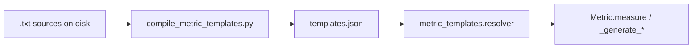

# `deepeval.metrics` — prompt templates

Contributor reference for LLM evaluation prompts used by built-in metrics.

## Why templates work this way

### From `template.py` to a central bundle

Historically, prompts lived in per-metric `template.py` modules — static methods on a template class that built and returned prompt strings, with prompts embedded as multiline Python strings (often via `textwrap.dedent` and f-strings).

That pattern does not scale when you need to have multi-language templates or need support for typescript templates in a mono-repo architecture. The new architecture now allows us to:

- Ship **community translations** per language under `metric_templates/community/`
- Let contributors run **`deepeval translate`** to add keys to those JSON files without forking Python code
- Keep **one standardized shape** for all metrics (`class_name` → `method_name` → template string) for tooling and multi-language layouts

So shipped prompts now live in a single bundled [`templates.json`](../metric_templates/templates.json). Metrics render them by calling `self._get_prompt(...)` (a thin helper on the metric/node base classes that delegates to [`resolve_template`](../metric_templates/resolver.py)) instead of building prompts in Python.

### Why `.txt` files live next to each metric

`templates.json` is still awkward to edit by hand (escaping, huge lines, Jinja inside JSON). Contributors therefore maintain **plain `.txt` sources** beside each metric and compile them into `templates.json` before release.

That gives you:

- Readable, line-level git diffs
- Normal editor UX for long prompts
- Co-location with the metric package you are changing

| Layer                            | Role                                                                 | Example paths                                           |
| -------------------------------- | -------------------------------------------------------------------- | ------------------------------------------------------- |
| **`.txt` on disk**               | Editable prompt sources in this repo                                 | `metrics/.../templates/`, `metric_templates/fragments/` |
| **`templates.json`**             | Compiled English bundle shipped with the package                     | `metric_templates/templates.json`                       |
| **`community/templates.*.json`** | Shipped translations per language (enum value in filename)           | `metric_templates/community/templates.hindi.json`       |

Do not hand-edit `templates.json` for routine prompt changes — edit `.txt`, run the compile script, and commit both.

## Layout

### Per-metric templates

Every template file follows this path:

```
deepeval/metrics/<metric_package>/templates/<MetricClassName>/<method_name>.txt
```

| Part                | Rule                                                                                                      |
| ------------------- | --------------------------------------------------------------------------------------------------------- |
| `<metric_package>`  | Snake-case folder for the metric (e.g. `answer_relevancy`, `tool_correctness`)                            |
| `<MetricClassName>` | **Must match** the rendering class name (usually `self.__class__.__name__`, e.g. `AnswerRelevancyMetric`)   |
| `<method_name>.txt` | **Must match** the method string passed to `self._get_prompt` (e.g. `generate_statements` → `.txt` stem)   |

**Example** (answer relevancy):

```
deepeval/metrics/answer_relevancy/templates/AnswerRelevancyMetric/
  generate_statements.txt
  generate_verdicts.txt
  generate_reason.txt
```

DAG-style metrics that host multiple node types under one package already use the same pattern (class name as a subfolder):

```
deepeval/metrics/dag/templates/VerdictNode/generate_reason.txt
deepeval/metrics/dag/templates/TaskNode/generate_task_output.txt
```

Multimodal metrics:

```
deepeval/metrics/multimodal_metrics/image_coherence/templates/ImageCoherenceMetric/evaluate_image_coherence.txt
```

CLI-only templates (not under `metrics/`):

```
deepeval/cli/translate/templates/TranslateCLI/prompt.txt
```

### Shared fragments

Reusable Jinja snippets (multimodal rules, faithfulness verdict blocks, etc.) live in:

```
deepeval/metric_templates/fragments/<fragment_name>.txt
```

Metric templates include them at render time with:

```jinja
{{ _fragments.multimodal_input_rules }}
```

See [Shared fragments](#shared-fragments) below.

## Updating an existing template

1. Edit the `.txt` file under the metric’s `templates/<MetricClassName>/` folder.
2. From the repo root, compile:

   ```bash
   python scripts/compile_metric_templates.py
   ```

3. Commit **both** the `.txt` change and the updated `deepeval/metric_templates/templates.json`.

The compile script scans all `**/templates/<MetricClassName>/*.txt` files under `deepeval/` plus `metric_templates/fragments/*.txt`, then rewrites `templates.json`. Existing class and method order in JSON is preserved; new classes/methods are appended.

## Adding templates for a new metric

1. Implement the metric class (e.g. `MyNewMetric`). Subclasses of `BaseMetric` / `BaseConversationalMetric` / `BaseArenaMetric` (and DAG nodes) inherit `self._get_prompt(...)`, which renders the template for the current class:

   ```python
   prompt = self._get_prompt(
       "generate_verdicts",
       multimodal=test_case.multimodal,
       input=input,
       ...
   )
   ```

   The template is looked up by `self.__class__.__name__`. To render another class's template (e.g. borrowing `FaithfulnessMetric`), pass `template_class="FaithfulnessMetric"`. The `method` arg is typed as `MetricTemplateMethod`, so editors autocomplete it and flag typos.

2. Create the template directory and files:

   ```
   deepeval/metrics/my_new_metric/templates/MyNewMetric/
     generate_verdicts.txt
     generate_reason.txt
   ```

   Use the exact `ClassName` and method names your code passes to `self._get_prompt(...)` (the class name defaults to `self.__class__.__name__`).

3. Run the compile script (see above) and commit the new `.txt` files and updated `templates.json`.

4. Add or extend tests under `tests/test_templates/` if the template introduces new Jinja variables or fragment usage.

## Compile script

| Field    | Details                                                                                                      |
| -------- | ------------------------------------------------------------------------------------------------------------ |
| Script   | [`scripts/compile_metric_templates.py`](../../scripts/compile_metric_templates.py)                           |
| Input    | All `deepeval/**/templates/<MetricClassName>/*.txt` and `deepeval/metric_templates/fragments/*.txt`          |
| Output   | [`deepeval/metric_templates/templates.json`](../metric_templates/templates.json)                             |

```bash
# From the deepeval repo root
python scripts/compile_metric_templates.py
```

There is no separate “extract from JSON” step. JSON is always produced from the on-disk `.txt` sources.

## Runtime resolution

At evaluation time, metrics do **not** read `.txt` files directly. Flow:



0. **`self._get_prompt(method, *, template_class=None, multimodal=False, strict=True, **kwargs)`** — The call-site entry point on the metric/node base classes. Binds `feature="metrics"` and `class_name = template_class or self.__class__.__name__`, then delegates to `resolve_template`.

1. **`get_raw_template(feature, class_name, method)`** — If `DEEPEVAL_METRIC_TEMPLATE_LANGUAGE` is set to a community language, loads from `metric_templates/community/templates.<lang>.json` when present; otherwise falls back to the English `templates.json` bundle (via `importlib.resources`) and logs a one-time warning per missing class/method.

2. **`resolve_template(feature, class_name, method, *, multimodal=..., strict=..., **kwargs)`** — Parses the string as a Jinja2 template, injects:
   - `multimodal` — toggles `` blocks
   - `_fragments` — dict of shared snippets from the `"_fragments"` key in the bundle
   - Any other kwargs the metric passes (`input`, `actual_output`, `score`, etc.)

3. The rendered string is sent to the evaluation LLM.

Relevant code: [`deepeval/metric_templates/resolver.py`](../metric_templates/resolver.py).

Example (from answer relevancy):

```python
prompt = self._get_prompt(
    "generate_statements",
    multimodal=multimodal,
    actual_output=actual_output,
)
```

### Template syntax

- **Jinja2** — conditionals (``), variable substitution (`{{ input }}`).
- **Fragments** — `{{ _fragments.<name> }}` for shared blocks; do not copy-paste multimodal rules into every metric unless intentional.
- **JSON examples in prompts** — Use literal `{` / `}` in examples; the resolver uses Jinja `from_string`, not Python f-strings. For literal braces in examples, double them as needed (`{{` / `}}` in Jinja).

## Shared fragments

| Fragment                                      | Purpose                                                         |
| --------------------------------------------- | --------------------------------------------------------------- |
| `multimodal_input_rules`                      | Standard image-input guidelines (most multimodal-aware metrics) |
| `multimodal_input_rules_turn_metric`          | Turn-level metrics (extra claim-comparison guidance)            |
| `multimodal_image_generation_eval_context`    | Image-generation evaluation framing                             |
| `faithfulness_verdicts_format_instruction`    | Faithfulness verdict JSON shape                                 |
| `faithfulness_verdicts_example_multimodal`    | Multimodal example block for faithfulness                       |
| `faithfulness_verdicts_guidelines_multimodal` | Multimodal faithfulness scoring rules                           |
| `faithfulness_verdicts_guidelines_text_only`  | Text-only faithfulness scoring rules                            |

Edit files in `deepeval/metric_templates/fragments/`, then run the compile script. Fragments are stored under `"_fragments"` in `templates.json` and passed into every `resolve_template` call.

## Translations and community languages

Centralizing prompts in JSON is what makes translation practical: the CLI can walk the whole catalog by `class_name` / `method_name` without importing every metric’s `template.py`.

- **End users** — Set `DEEPEVAL_METRIC_TEMPLATE_LANGUAGE` to any slug (e.g. `hindi`). Shipped community JSON and `.deepeval/templates.<lang>.json` are merged; missing keys fall back to English with a console warning. Unset or `english` / `en` uses the English bundle only.
- **`deepeval translate`** — Writes **`.deepeval/templates.<lang>.json`** by default (any slug). **`--contribute`** updates `metric_templates/community/` and requires the slug in [`MetricTemplateLanguage`](../metric_templates/community/languages.py). See [`community/README.md`](../metric_templates/community/README.md).
- **Shipped English bundle** — Maintained in this repo via `.txt` sources + [`compile_metric_templates.py`](../../scripts/compile_metric_templates.py).

## Checklist for template changes

- [ ] `.txt` path is `templates/<MetricClassName>/<method>.txt` and names match `self._get_prompt(...)` call sites
- [ ] Ran `python scripts/compile_metric_templates.py`
- [ ] Committed updated `templates.json`
- [ ] New Jinja variables match what the metric passes into `self._get_prompt(...)`
- [ ] Fragment references use names that exist under `metric_templates/fragments/`
- [ ] Tests pass: `pytest tests/test_templates/test_metric_templates.py`

## Related files

| File                                                                                 | Role                                       |
| ------------------------------------------------------------------------------------ | ------------------------------------------ |
| [`scripts/compile_metric_templates.py`](../../scripts/compile_metric_templates.py)   | Build `templates.json` from `.txt` sources |
| [`deepeval/metric_templates/templates.json`](../metric_templates/templates.json)     | Bundled prompts (runtime)                  |
| [`deepeval/metric_templates/resolver.py`](../metric_templates/resolver.py)           | Load community/English bundles and render  |
| [`deepeval/metric_templates/community/`](../metric_templates/community/)             | Per-language translation JSON + enum       |
| [`deepeval/metric_templates/fragments/`](../metric_templates/fragments/)             | Shared snippet sources                     |
