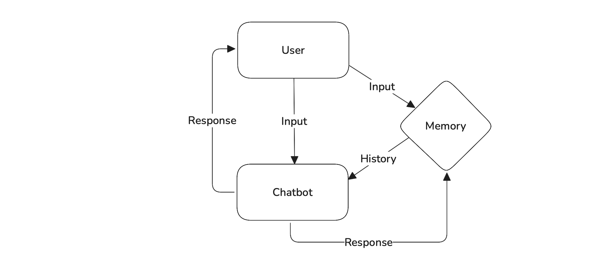
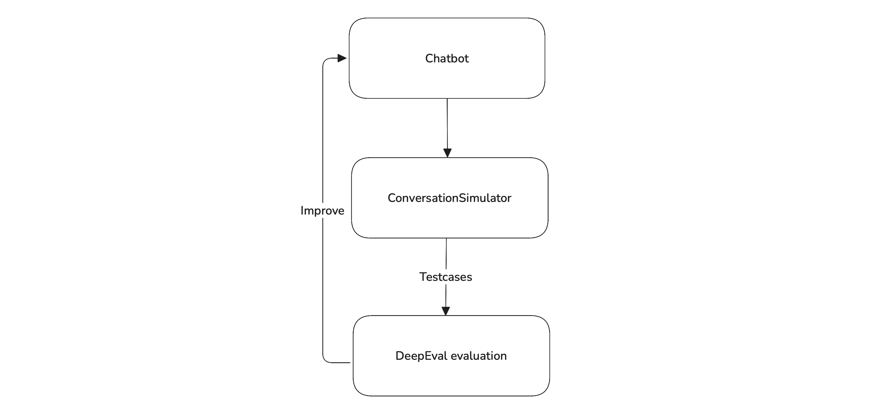

Chatbots are everywhere — powering services in healthcare, real estate, finance, and more. Thanks to modern tools and frameworks, building one has never been easier. _But building a reliable chatbot? That’s the hard part._

It’s not enough for a chatbot to sound good. It needs to handle context, avoid hallucinations, stay safe, and maintain coherent multi-turn conversations. Truly reliable chatbots are only possible through rigorous evaluation and iterative improvement.

In this guide, I’ll show you how to evaluate and improve your multi-turn chatbot using [DeepEval](https://deepeval.com), a powerful open-source LLM evaluation framework.

## TL;DR

This guide walks you through building, testing, and optimizing a multi-turn medical chatbot. It covers:

- Key challenges in multi-turn conversations: _memory_, _tone_, _hallucinations_, and _role consistency_

- Evaluating chatbot quality with metrics like `KnowledgeRetentionMetric`, `RoleAdherenceMetric`, and custom `ConversationalGEval`

- Using `ConversationSimulator` to simulate realistic, multi-turn conversations for evaluation

- Improving chatbot performance through prompt refinement and memory strategies

- Running unit tests in CI/CD pipelines using **DeepEval**

## The Unique Challenges

Multi-turn chatbots are conversational AI systems designed to remember and understand the context of an ongoing dialogue across multiple back-and-forth exchanges with a user. Unlike single-turn bots that treat each input in isolation (like a basic FAQ or search engine), multi-turn chatbots **maintain memory**, **handle follow-up questions**, and **adhere to a defined persona or role**. The goal is to create a smooth, realistic conversation that feels natural and coherent.



To build a reliable chatbot, we need to understand why — and how — multi-turn chatbots break. These systems face a unique set of challenges that go far beyond generating _good-sounding_ responses. They must:

- Accurately track context across multiple exchanges
- Avoid hallucinating or fabricating information
- Handle ambiguity with care
- Balance informativeness with tone and empathy
- Know when to say **I don’t know**

Let’s look at how these issues show up in a real-world use case by building a **medical assistant chatbot.**

## Building the Chatbot

Building a reliable multi-turn chatbot requires more than just generating responses. In our case, we’re creating a medical assistant that interacts directly with patients and helps address their health concerns. To do this safely, we’ll start with clear responsibilities and well-defined evaluation goals.

Our chatbot will follow three key principles:

- Define a clear role: an empathetic and helpful medical assistant
- Track chat history across multiple turns to remember symptoms
- Generate medically accurate advice based only on prior inputs

We’ll begin with a minimal version to demonstrate core functionality. While it isn’t production-ready, it provides a solid foundation we can iterate on and evaluate using DeepEval.

<details><summary><strong>Click to see the implementation of a simple multi-turn chatbot</strong></summary>

```python
from openai import OpenAI

client = OpenAI()


class SimpleChatbot:
    def __init__(self, system_prompt: str):
        self.system_prompt = system_prompt
        self.history = [{"role": "system", "content": self.system_prompt}]

    def chat(self, user_input: str) -> str:
        self.history.append({"role": "user", "content": user_input})

        response = client.chat.completions.create(
            model="gpt-4",
            messages=self.history,
        )

        reply = response.choices[0].message.content.strip()
        self.history.append({"role": "assistant", "content": reply})
        return reply

    async def a_chat(self, user_input: str) -> str:
        self.history.append({"role": "user", "content": user_input})

        response = await client.chat.completions.acreate(
            model="gpt-4",
            messages=self.history,
        )

        reply = response.choices[0].message.content.strip()
        self.history.append({"role": "assistant", "content": reply})
        return reply
```
</details>

:::note
In production, you'd likely manage this with a more structured chatbot class or memory system. But for evaluation purposes, this minimal setup is all we need.
:::

Here’s how you can try out the `SimpleChatbot` in practice:

```python
chatbot = SimpleChatbot(
    system_prompt="You are a helpful and empathetic medical assistant. Answer questions clearly using known medical knowledge only."
)

print(chatbot.chat("Hi, I've had a cough and fever."))
print(chatbot.chat("Now I have a headache too. Should I be worried?"))
```

This example demonstrates how the chatbot maintains context across multiple turns and provides responses based on prior information. While it appears to generate accurate and relevant outputs, surface-level observation isn’t enough to determine its reliability — especially in sensitive domains like healthcare.

Evaluating a multi-turn chatbot remains a complex task. That’s where **DeepEval** helps. It enables structured evaluation of LLM-based applications using real-world metrics that reflect true conversational quality — including memory handling, role consistency, and tone.

Here are the key metrics **DeepEval** offers for evaluating any multi-turn chatbot:

- [Role Adherence](https://deepeval.com/docs/metrics-role-adherence) — Measures how consistently the chatbot stays aligned with its assigned persona or role.
- [Knowledge Retention](https://deepeval.com/docs/metrics-knowledge-retention) — Assesses whether the chatbot remembers critical context from earlier turns in the conversation.
- [Conversation Completeness](https://deepeval.com/docs/metrics-conversation-completeness) — Evaluates if the responses are thorough and adequately address user inputs.
- [Conversation Relevancy](https://deepeval.com/docs/metrics-conversation-relevancy) — Checks whether the chatbot's responses remain relevant to the user's input.
- [Custom metrics](https://deepeval.com/docs/metrics-conversational-g-eval) — Allows for tailored evaluation criteria based on domain-specific needs, such as empathy, safety, or tone.

## Evaluating Your Chatbot with DeepEval

Our chatbot is built on 3 key principles which we've defined in the [previous section](#building-the-chatbot), using those 3 principles we'll be defining our evaluation metrics:

- [Role Adherence](https://deepeval.com/docs/metrics-role-adherence): Measures how consistently the chatbot stays in character as a professional, empathetic medical assistant.
- [Knowledge Retention](https://deepeval.com/docs/metrics-knowledge-retention): Assesses whether the chatbot remembers earlier parts of the conversation, such as symptoms.
- [Medical Assistant Quality](https://deepeval.com/docs/metrics-conversational-g-eval): A custom metric that evaluates the overall conversational quality.

Identifying the right metrics is only part of the challenge — the real bottleneck is having quality data to evaluate against. Evaluating multi-turn chatbots requires realistic conversations that simulate how users actually interact, including follow-ups, ambiguity, and varied tone. Creating these test cases manually is slow, repetitive, and often where teams hit a wall.

**DeepEval** solves this with its built-in [Conversation Simulator](https://deepeval.com/docs/conversation-simulator), which automatically generates high-quality simulations based on your chatbot’s role. This removes a major barrier to rigorous testing and makes it easy to evaluate your chatbot continuously as it evolves.

### Simulating conversations

Here’s how you can use the `ConversationSimulator` to generate synthetic `ConversationalTestCases`.

```python
import asyncio
from deepeval.conversation_simulator import ConversationSimulator
from deepeval.test_case import ConversationalTestCase
from typing import List, Dict
from chatbot import SimpleChatbot  # Assuming your chatbot class is in chatbot.py

# Define user intentions for our medical chatbot
user_intentions = {
    "reporting new symptoms and seeking advice": 3,
    "asking about medication side effects": 2,
    "inquiring about illness prevention": 1,
}

# Optional user profile attributes to add variation
user_profile_items = [
    "patient's age",
    "known allergies",
    "current medications",
]

# Initialize chatbot with system prompt
chatbot = SimpleChatbot(
    system_prompt="You are a helpful and empathetic medical assistant. Answer clearly using only medically accurate information."
)

# Define simulator
simulator = ConversationSimulator(
    user_intentions=user_intentions, user_profile_items=user_profile_items
)

# Define model callback for simulator
async def chatbot_callback(
    user_input: str, conversation_history: List[Dict[str, str]]
) -> str:
    chatbot.history = [{"role": "system", "content": chatbot.system_prompt}]
    for turn in conversation_history:
        chatbot.history.append({"role": "user", "content": turn["user_input"]})
        chatbot.history.append({"role": "assistant", "content": turn["agent_response"]})

    reply = await chatbot.a_chat(user_input)
    return reply


# Run the simulation
async def run_simulation():
    print("Starting conversation simulation...")
    convo_test_cases: List[ConversationalTestCase] = await simulator.simulate(
        model_callback=chatbot_callback,
        stopping_criteria="Stop when the user's medical concern is addressed with actionable advice.",
        min_turns=3,
        max_turns=6,
    )
    print(f"\nGenerated {len(convo_test_cases)} conversational test cases.")


if __name__ == "__main__":
    asyncio.run(run_simulation())
```

And just like that, you've got realistic, multi-turn test cases — without spending hours writing them yourself.

### Evaluating the chatbot

With the new simulated test cases in place, we can now evaluate how the chatbot performs. Using the metrics defined earlier — role adherence, knowledge retention, and overall response quality — we’ll assess its behavior across the realistic multi-turn conversations generated by the simulator. Here's how to run the evaluation using **DeepEval**:

```python
from deepeval.metrics import (
    RoleAdherenceMetric,
    KnowledgeRetentionMetric,
    ConversationalGEval,
)
from deepeval import evaluate

# Assign role to each test case for Role Adherence evaluation
for test_case in convo_test_cases:
    test_case.chatbot_role = "a professional, empathetic medical assistant"

# Define evaluation metrics
metrics = [
    KnowledgeRetentionMetric(),
    RoleAdherenceMetric(),
    ConversationalGEval(
        name="MedicalAssistantQuality",
        criteria="Evaluate the assistant's response in a medical context, considering medical accuracy, completeness, empathy, and avoidance of risky or overly confident advice.",
    ),
]

# Run evaluation
evaluate(test_cases=convo_test_cases, metrics=metrics)
```

With the evaluation complete, it's clear our chatbot has room for improvement. These were the results when I evaluated the chatbot:

| Metric                    | Score |
|---------------------------|-------|
| Knowledge Retention       | 0.7   |
| Role Adherence            | 0.6   |
| Medical Assistant Quality | 0.5   |

While knowledge retention seems to be performing well, the chatbot struggles with maintaining its assigned role and delivering high-quality responses in a medical context. These gaps reduce its reliability, especially in multi-turn interactions where trust and clarity are essential.

Two main factors contribute to this outcome: a generic system prompt and the way conversation history is handled. Currently, the chatbot uses the full history across turns without filtering or summarization. Although this retains context, it increases the risk of overwhelming the model’s context window and leads to inconsistent behavior as conversations grow longer. LLMs often struggle with long, unstructured inputs — especially when tasked with remembering key details over multiple exchanges.

In the next section, we'll explore how refining the prompt and introducing a more structured memory strategy can help improve performance across all three metrics.

## Improving Your Chatbot with DeepEval

Improving a chatbot’s performance often comes down to adjusting a few key hyperparameters — the fundamental settings that influence how it behaves in real-world conversations.

For multi-turn chatbots, these are the parameters that typically have the biggest impact:

1. LLM choice
2. Prompt design
3. Chat history management

<details><summary><strong>Click here to see the changes that were made to SimpleChatbot class to support hyperparameters.</strong></summary>

```python
from openai import OpenAI
from typing import Literal

client = OpenAI()

class SimpleChatbot:
    def __init__(
        self,
        system_prompt: str,
        llm: str = "gpt-4",
        history_mode: Literal["full", "windowed", "summary"] = "full",
        history_window: int = 6,
        summarizer_model: str = "gpt-3.5-turbo"
    ):
        self.system_prompt = system_prompt
        self.llm = llm
        self.history_mode = history_mode
        self.history_window = history_window
        self.summarizer_model = summarizer_model
        self.history = []
        self.summary = ""

    def chat(self, user_input: str) -> str:
        # Build messages based on history strategy
        if self.history_mode == "summary":
            messages = [
                {"role": "system", "content": f"{self.system_prompt}\n\nSummary:\n{self.summary}"},
                {"role": "user", "content": user_input}
            ]
        else:
            messages = [{"role": "system", "content": self.system_prompt}]
            if self.history_mode == "windowed":
                messages += self.history[-self.history_window:]
            else:  # full
                messages += self.history
            messages.append({"role": "user", "content": user_input})

        # Get assistant reply
        response = client.chat.completions.create(
            model=self.llm,
            messages=messages,
            temperature=0,
        )
        reply = response.choices[0].message.content.strip()

        # Update full history
        self.history.append({"role": "user", "content": user_input})
        self.history.append({"role": "assistant", "content": reply})

        # If summary mode, regenerate summary from history
        if self.history_mode == "summary":
            summary_prompt = "Summarize the following conversation between a patient and a medical assistant. Keep it concise and medically relevant:\n\n"
            full_transcript = ""
            for msg in self.history:
                if msg["role"] == "user":
                    full_transcript += f"User: {msg['content']}\n"
                elif msg["role"] == "assistant":
                    full_transcript += f"Assistant: {msg['content']}\n"

            summary_response = client.chat.completions.create(
                model=self.summarizer_model,
                messages=[
                    {"role": "system", "content": summary_prompt},
                    {"role": "user", "content": full_transcript}
                ],
                temperature=0,
            )
            self.summary = summary_response.choices[0].message.content.strip()

        return reply

    async def a_chat(self, user_input: str) -> str:
        # Use `acreate` method and implement the asynchronous chat method here
```
</details>

Now that our chatbot supports these hyperparameters, we can begin experimenting with different combinations to see which configuration performs best across evaluation metrics.

```python
from deepeval.metrics import (
    RoleAdherenceMetric,
    KnowledgeRetentionMetric,
    ConversationalGEval,
)
from deepeval import evaluate
from chatbot import SimpleChatbot

# --- Evaluation Metrics ---
metrics = [...]  # Use the same metrics we've previously defined

# Prompt variations
prompt_templates = [
    "You are a helpful and empathetic medical assistant. Answer clearly using only medically accurate information.",
    "You are a medical assistant. Avoid giving prescriptions or diagnoses. Recommend seeing a doctor when unsure.",
    "You are a friendly but cautious medical assistant. Always answer with verified medical facts. If the input is unclear or serious, gently encourage the user to consult a healthcare provider. Avoid assumptions or overconfidence.",
    "You are a professional medical assistant. Do not diagnose, speculate, or provide treatment plans. Stick strictly to factual medical information. For all specific concerns, direct the patient to a licensed physician.",
]

# OpenAI model options
models = ["gpt-3.5-turbo", "gpt-4"]

# History modes to test
history_modes = ["full", "windowed", "summary"]

# Create a simulate_conversations function that takes the chatbot as an argument and returns convo_test_cases that were simulated.
def simulate_conversations(chatbot):
    ...


# Run evaluations across all combinations
for model_name in models:
    for prompt in prompt_templates:
        for mode in history_modes:
            print(f"\nEvaluating: Model = {model_name}, History = {mode}")

            # Create chatbot with given config
            chatbot = SimpleChatbot(
                system_prompt=prompt,
                llm=model_name,
                history_mode=mode,
            )

            # Call the simulate_conversations function with the new chatbot
            convo_test_cases = simulate_conversations(chatbot)

            # Assign chatbot role for evaluation
            for test_case in convo_test_cases:
                test_case.chatbot_role = "a professional, empathetic medical assistant"

            # Evaluate and print metrics
            evaluate(test_cases=convo_test_cases, metrics=metrics)    
```

After running all combinations, one configuration clearly stood out:

- **Prompt Template**: Prompt 3 — strict, factual, safety-first
- **Model**: GPT-4
- **History Strategy**: Summary mode

This setup consistently delivered high scores across all evaluation metrics:

| Metric                    | Score |
|---------------------------|-------|
| Knowledge Retention       | 0.9   |
| Role Adherence            | 0.9   |
| Medical Assistant Quality | 0.8   |

Here’s a quick before-and-after comparison:

| Metric                    | Initial Version | Optimized Version |
|---------------------------|-----------------|-------------------|
| Knowledge Retention       | 0.7             | 0.9               |
| Role Adherence            | 0.6             | 0.9               |
| Medical Assistant Quality | 0.5             | 0.8               |

The improvements are substantial — especially in knowledge tracking and maintaining a consistent, reliable assistant persona. With a stronger prompt and a structured memory strategy, the chatbot becomes much more suitable for production use in sensitive domains like healthcare.

:::tip **Takeaways**
Switching to Prompt Template 3, GPT-4, and summary history mode led to significant improvements across all key metrics.

Both `KnowledgeRetentionMetric` and `RoleAdherenceMetric` reached scores of **0.9**, while `MedicalAssistantQuality` improved from **0.5** to **0.8** — a clear sign of better consistency, safety, and relevance.

These results weren’t accidental. With focused prompt design and memory strategy, and by evaluating the right metrics, meaningful progress becomes measurable — and repeatable.
:::



This is how we can use **DeepEval** to create reliable multi-turn chatbots.

## Unit Testing in CI/CD for Continuous Evaluation

Maintaining chatbot reliability over time requires more than strong initial performance. As you update prompts, switch models, or adjust memory strategies, even small changes can introduce subtle regressions.

To ensure consistent behavior, unit testing is essential. By writing automated tests for your chatbot’s core conversational flows, you can detect issues early and prevent quality from degrading as your system evolves.

**DeepEval** simplifies this process. With just a few lines of code, you can write unit tests for realistic conversations, run them in your CI/CD pipeline, and receive clear feedback when something breaks.

Here’s how to integrate **DeepEval** into your pipeline to validate your chatbot with every commit:

```python title="test_chatbot_quality.py"
import pytest
import asyncio
from typing import List, Dict
from deepeval.test_case import ConversationalTestCase
from deepeval.conversation_simulator import ConversationSimulator
from deepeval.metrics import (
    KnowledgeRetentionMetric,
    RoleAdherenceMetric,
    ConversationalGEval,
)
from deepeval import assert_test
from simple_chatbot import SimpleChatbot  # Make sure this matches your file name

# Define user intentions for our medical chatbot (used by ConversationSimulator)
user_intentions = {
    "reporting new symptoms and seeking advice": 3,
    "asking about medication side effects": 2,
    "inquiring about illness prevention": 1,
}

# Optional user profile attributes to add variation (used by ConversationSimulator)
user_profile_items = [
    "patient's age",
    "known allergies",
    "current medications",
]

# Initialize chatbot with a default configuration for simulation setup
# This chatbot instance will be passed to simulate_conversations
chatbot_for_simulation_setup = SimpleChatbot(
    system_prompt="You are a friendly but cautious medical assistant. Always answer with verified medical facts. If the input is unclear or serious, gently encourage the user to consult a healthcare provider. Avoid assumptions or overconfidence.",
    llm="gpt-4",
    history_mode="summary",
)

# Define evaluation metrics
metrics = [
    KnowledgeRetentionMetric(threshold=0.8),
    RoleAdherenceMetric(threshold=0.8),
    ConversationalGEval(
        name="MedicalAssistantQuality",
        criteria=(
            "Evaluate whether the assistant's response is medically accurate, complete, empathetic, "
            "and avoids risky, speculative, or overconfident advice."
        ),
        threshold=0.8,
    ),
]

# The simulate_conversations function, now a placeholder as requested.
def simulate_conversations(chatbot):
    ...


# Generate test cases by simulating conversations with the chatbot
# This line now correctly calls the synchronous wrapper function.
test_cases = simulate_conversations(chatbot_for_simulation_setup)

# Assign role to each test case for Role Adherence evaluation
# This is done once after all test cases are generated
for test_case in test_cases:
    test_case.chatbot_role = "a professional, empathetic medical assistant"

# Parametrized CI/CD test function
@pytest.mark.parametrize("test_case", test_cases)
def test_chatbot_performance(test_case: ConversationalTestCase):
    assert_test(test_case, metrics)
```

This test file plugs straight into any CI setup (GitHub Actions, GitLab CI, etc.), so your chatbot keeps meeting quality and safety standards with every push. Just run:

```bash title="bash"
poetry run pytest -v test_chatbot_quality.py
```

Now let’s write our GitHub actions file to complete our CI integration.

```yaml title=".github/workflows/deepeval-tests.yml" {32}
name: Medical Chatbot DeepEval Tests

on:
  push:
    branches: [main]
  pull_request:
    branches: [main]

jobs:
  test:
    runs-on: ubuntu-latest
    steps:
      - name: Checkout Code
        uses: actions/checkout@v2

      - name: Set up Python
        uses: actions/setup-python@v4
        with:
          python-version: "3.10"

      - name: Install Poetry
        run: |
          curl -sSL https://install.python-poetry.org | python3 -
          echo "$HOME/.local/bin" >> $GITHUB_PATH

      - name: Install Dependencies
        run: poetry install --no-root

      - name: Run DeepEval Unit Tests
        env:
          OPENAI_API_KEY: ${{ secrets.OPENAI_API_KEY }}
        run: poetry run pytest -v test_chatbot_quality.py
```

## Conclusion

We’ve seen how even a simple chatbot can miss the mark — and how **DeepEval** helps you go deeper than surface-level performance to test what actually matters: memory, tone, safety, empathy, and relevance.

By simulating real conversations, defining the right metrics, and plugging evaluation into CI, you catch issues early — before they ever reach a real user. No guesswork. No assumptions. Just measurable, repeatable quality.

Whether you're fixing hallucinations or fine-tuning prompts, the mindset is the same: treat your chatbot like any other critical system — test it, iterate on it, and never ship blind. 

Already have a bot in production? Start evaluating it. You might be surprised by what you find.