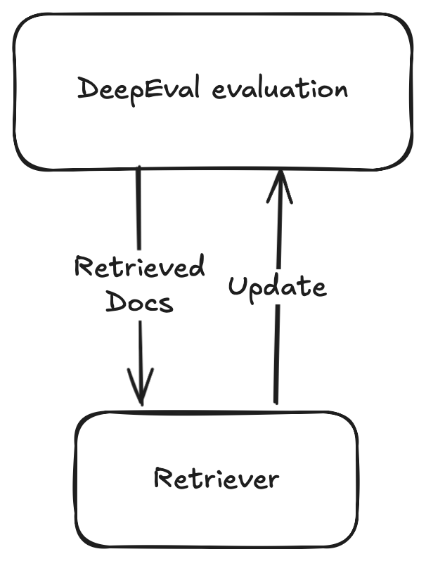
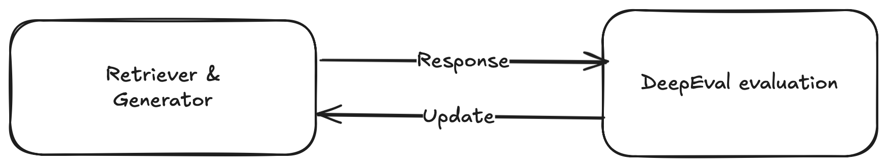
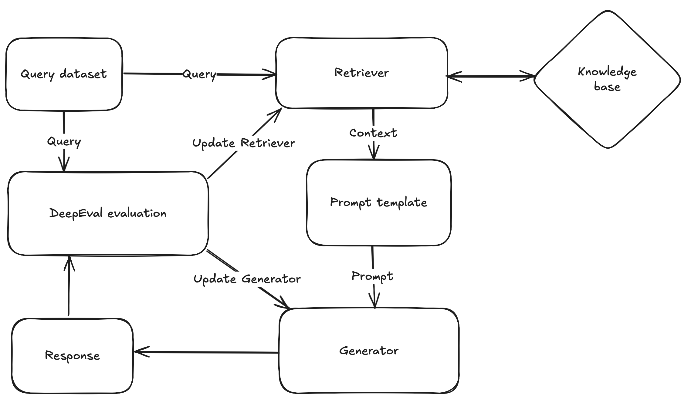

Imagine this — You’re building a contract assistant for a mid-sized law firm with over 300 employees and a repository of more than 10,000 archived contracts and internal policies. 

You need to build a **Retrieval-Augmented Generation (RAG)** system designed to help lawyers, paralegals, and HR personnel quickly find precise answers to complex queries about contracts, policies, and compliance.

In this scenario, the reliability of the RAG system is absolutely critical. There is no room for error. Think of a scenario where the assistant hallucinates contract clauses that don’t exist, cites outdated or superseded policies, or misses key compliance requirements. These failures could lead to costly legal risks, compliance violations, or internal confusion that could jeopardize client trust and company reputation.

This tutorial walks you through how to build a **reliable RAG system** with [DeepEval](https://github.com/confident-ai/deepeval), focusing on:

1. Automatically generating high-quality test data from your own docs  
2. Component-level evaluation for both **retrievers** and **generators**  
3. Integrating CI/CD tests that adapt as your contracts evolve

By the end of this tutorial, you’ll have a deployable RAG app that’s not only smart — it’s battle-tested.

## If the Retriever Fails, Everything Fails: Evaluating with DeepEval

A hallucination doesn’t start in generation — it starts in retrieval. If your retriever surfaces irrelevant or incomplete context, your LLM is doomed before it even starts generating. In high-stakes use cases like contracts or compliance, one bad passage can trigger a cascade of wrong answers — or worse, legal risk.

### Building a Basic Retriever

Let’s say you’re using a standard FAISS \+ OpenAIEmbeddings retriever.

```python
from langchain.vectorstores import Chroma, FAISS  
from langchain.embeddings import OpenAIEmbeddings  
from langchain.text_splitter import RecursiveCharacterTextSplitter  
  
class SimpleRetriever:  
	def __init__(  
		self,  
		document_path: str,  
		embedding_model=None,  
		chunk_size: int = 500,  
		chunk_overlap: int = 50,  
		vector_store_class=FAISS,  
		persist_directory: str = None  
		k: int = 2  
	):  
		self.document_path = document_path  
		self.chunk_size = chunk_size  
		self.chunk_overlap = chunk_overlap  
		self.embedding_model = embedding_model or OpenAIEmbeddings()  
		self.vector_store_class = vector_store_class  
		self.persist_directory = persist_directory  
		self.k = k  
		self.vector_store = self._load_vector_store()  
  
  
	def _load_vector_store(self):  
		with open(self.document_path, "r", encoding="utf-8") as file:  
			raw_text = file.read()  
			
		splitter = RecursiveCharacterTextSplitter(  
			chunk_size=self.chunk_size,  
			chunk_overlap=self.chunk_overlap  
		)  
		documents = splitter.create_documents([raw_text])  
	
		if self.vector_store_class == Chroma:  
			return self.vector_store_class.from_documents(  
				documents, self.embedding_model,  
				persist_directory=self.persist_directory  
			)  
		else:  
			return self.vector_store_class.from_documents(documents, self.embedding_model)  
	
	
	def retrieve(self, query: str):  
		return self.vector_store.similarity_search(query, k=self.k)  
  
  
# Initialize retriever  
retriever = SimpleRetriever("document.txt")  
  
# Query the retriever  
query = "What benefits do part-time employees get?"  
results = retriever.retrieve(query)
```

This retriever *works* — but how well?

Here’s what we need to consider when evaluating retrievers:

1. **[Contextual Relevancy](https://deepeval.com/docs/metrics-contextual-relevancy)** – *Is this the info I’d want if I were answering this question?*  
2. **[Contextual Recall](https://deepeval.com/docs/metrics-contextual-recall)** – *Did I retrieve enough of the good stuff?*  
3. **[Contextual Precision](https://deepeval.com/docs/metrics-contextual-precision)** – *Did I avoid junk I don’t need?*

But knowing what to evaluate isn’t enough, here comes the hardest part of evaluating retrievers. Retrievers cannot be evaluated without a ground-truth to evaluate them against. This means we need question and answer pairs that we can use to evaluate our retriever against from our original documents. But this is a tedious, expensive, and time-consuming step.

DeepEval helps you get around this with its built-in **[synthesizer](https://deepeval.com/docs/synthesizer-introduction)**, which can generate high-quality question–answer pairs from your raw documents — automating a huge part of the process and setting you up for continuous testing down the line.

### Generating Goldens

Here’s how easy it is to generate those golden pairs:

```python
from deepeval.synthesizer import Synthesizer  
synthesizer = Synthesizer()  
goldens = synthesizer.generate_goldens_from_docs(  
	document_paths=['document.txt'],  
	chunk_size=500,  
	chunk_overlap=50  
)
```

Now we can use these generated goldens to evaluate our retriever. Here’s how we can evaluate our retriever using the 3 metrics mentioned before:

```python
from deepeval.metrics import ContextualRelevancyMetric, ContextualRecallMetric, ContextualPrecisionMetric  
  
# Initialize metrics  
relevancy_metric = ContextualRelevancyMetric()  
recall_metric = ContextualRecallMetric()  
precision_metric = ContextualPrecisionMetric()  
  
# Evaluate for each golden pair  
for pair in golden_pairs:  
	retrieved_docs = retriever.retrieve(pair.input)

	context_list = [doc.page_content for doc in retrieved_docs]  
	relevancy_score = relevancy_metric.evaluate(context_list, [pair.expected_output])  
	recall_score = recall_metric.evaluate(context_list, [pair.expected_output])  
	precision_score = precision_metric.evaluate(context_list, [pair.expected_output])  
	  
	print(f"Q: {pair.input}\nA: {pair.expected_output}")  
	print(f"Relevancy: {relevancy_score}, Recall: {recall_score}, Precision: {precision_score}\n")
```

When I did the evaluation using the above retriever, I got an average of 0.52, 0.75 and 0.64 for Relevancy, Recall and Precision scores. These are *passable* to say the least. And hence there is a need to find the best hyperparameters i.e., chunking strategies, different embedding models, different retriever types.

### Improving Your Retriever

Now let’s iterate over different strategies to see which model works best for us. 

```python
from langchain.embeddings import OpenAIEmbeddings, HuggingFaceEmbeddings  
from langchain.vectorstores import Chroma, FAISS  
from deepeval.synthesizer import Synthesizer  
from deepeval.metrics import ContextualRelevancyMetric, ContextualRecallMetric, ContextualPrecisionMetric  
import tempfile  
  
# Example configurations  
chunking_strategies = [500, 1024, 2048]  
embedding_models = [  
	OpenAIEmbeddings(),
	HuggingFaceEmbeddings(model_name="sentence-transformers/all-MiniLM-L6-v2")  
]  
retriever_models = [FAISS, Chroma]  
  
# Initialize metrics  
relevancy_metric = ContextualRelevancyMetric()  
recall_metric = ContextualRecallMetric()  
precision_metric = ContextualPrecisionMetric()  
  
# Generate golden pairs only once unless testing synthesis configs  
synthesizer = Synthesizer()  
golden_pairs = synthesizer.generate_goldens_from_docs(  
	document_paths=['document.txt']  
)  
  
# Iterate over retriever configs  
for chunk_size in chunking_strategies:  
	for embedding_model in embedding_models:  
		for retriever_type in retriever_models:  
			print(f"Evaluating with Chunk Size: {chunk_size}, Embedding: {embedding_model.__class__.__name__}, Retriever: {retriever_type.__name__}")  
			  
			persist_dir = tempfile.mkdtemp() if retriever_type == Chroma else  None  
			  
			retriever = SimpleRetriever(  
				document_path="document.txt",  
				chunk_size=chunk_size,  
				chunk_overlap=50,  
				embedding_model=embedding_model,  
				vector_store_class=retriever_type,  
				persist_directory=persist_dir # Pass only if using Chroma  
			)  
			  
			for pair in golden_pairs:  
				retrieved_docs = retriever.retrieve(pair.input)  
				  
				relevancy_score = relevancy_metric.evaluate(retrieved_docs, [pair.expected_output])  
				recall_score = recall_metric.evaluate(retrieved_docs, [pair.expected_output])  
				precision_score = precision_metric.evaluate(retrieved_docs, [pair.expected_output])  
				  
				print(f"\nQ: {pair.input}\nA: {pair.expected_output}")  
				print(f"Relevancy: {relevancy_score}, Recall: {recall_score}, Precision: {precision_score}")
```

After these iterations I’ve found that using HuggingFaceEmbeddings and FAISS with 1024 chunks gives me an average score of  0.82, 0.92 and 0.89 for Relevancy, Recall and Precision.

**Takeaways**: Swapping to HuggingFace embeddings and increasing chunk size to 1024 improved all key scores — pushing Relevancy to 0.82, Recall to 0.92 and Precision to 0.89. With DeepEval, tuning isn't guesswork — it's measured progress. Ofcourse this is only in my case and you might have better results with different hyperparameters. Feel free to test them out to find the best ones that work for your data.

This is the flow you want to follow if you are trying to create a reliable retriever with DeepEval.



## Where Hallucinations Are Born: Evaluating Your Generator with DeepEval

Most teams think retrieval is the bottleneck. It’s not. In real-world RAG systems, **generation is where trust collapses**. You can have a flawless retriever — and still return confidently wrong answers.

Why? Because **the generator is the system’s voice**. It’s what users read, cite, forward to legal, or base decisions on. If that voice misstates facts or hallucinates clauses, it doesn't matter how good your context was — your product is broken.

### Building a Basic Generator

In most setups, you’re building a prompt using retrieval context and user query, below is an example of how generators are usually made:

```python
from langchain.llms import OpenAI  
from typing import List  
  
class Generator:  
	def __init__(
			self,
			retriever,
			llm=None,
			prompt_template=None
		):  
			self.retriever = retriever  
			self.llm = llm or OpenAI(temperature=0)  
			self.prompt_template = prompt_template or "Answer the question using the context below.\n\nContext:\n{context}\n\nQuestion:\n{question}"  
		  
	def generate(self, question: str) -> str:  
		retrieved_docs = self.retriever.retrieve(question)  
		context = "\n".join([doc.page_content for doc in retrieved_docs])  
		prompt = self.prompt_template.format(context=context, question=question)  
		return self.llm(prompt)
```

This might feel like a solid generator — but is it?

Let’s first try to use our generator:

```python
retriever = SimpleRetriever(  
	document_path="document.txt",  
	chunk_size=1024,  
	chunk_overlap=50,  
	embedding_model=HuggingFaceEmbeddings(model_name="sentence-transformers/all-MiniLM-L6-v2"),  
	vector_store_class=FAISS  
)  
  
generator = Generator(retriever=retriever)  
  
question = "What benefits do part-time employees get?"  
answer = generator.generate(question)  
print(answer)
```

It *looks good* and it *sounds right*. But LLMs are expert improvisers. Without proper grounding, **they invent policies, procedures, and legalese**.

In my testing, the model confidently stated policies that didn’t exist in the context. That’s not a hallucination — it’s a compliance failure.

Just like we did with retrievers, we need to evaluate generators *with real metrics*, not just vibes. DeepEval makes this concrete with out-of-the-box and custom metrics:

1. **[Faithfulness](https://deepeval.com/docs/metrics-faithfulness)** – Does it stick to the retrieved context?  
2. **[Answer Relevancy](https://deepeval.com/docs/metrics-answer-relevancy)** – Is the answer focused on the query?  
3. **[Tone](https://deepeval.com/docs/metrics-llm-evals)** – Is the response professionally framed?  
4. **[Citations](https://deepeval.com/docs/metrics-llm-evals)** – Are document sources properly referenced?

Before testing across your whole dataset, start with a single golden pair. Iterate on prompts, formatting, or context structure. Once it’s reliable — *then* scale.

Here’s how you can evaluate the generator with the above mentioned metrics:

```python
from deepeval.metrics import (  
	FaithfulnessMetric, 
	AnswerRelevancyMetric, 
	GEval  
)  
from deepeval.test_case import LLMTestCase, LLMTestCaseParams  
  
# Hardcoded query and expected answer  
query = "What benefits do part-time employees get?"  
expected_answer = "Part-time employees receive prorated healthcare coverage, flexible PTO, and are eligible for wellness reimbursements."  
  
# Run RAG pipeline  
retrieved_docs = retriever.retrieve(query)  
context = "\n".join([doc.page_content for doc in retrieved_docs])  
generated_answer = generator.generate(query)  
  
# Create test case  
test_case = LLMTestCase(  
	input=query,  
	actual_output=generated_answer,  
	expected_output=expected_answer,  
	retrieval_context=context,  
)  
  
# Initialize metrics  
metrics = [  
	FaithfulnessMetric(),  
	AnswerRelevancyMetric(),  
	GEval(  
		name="Tone",  
		criteria="Is the answer professional?",  
		evaluation_params=[LLMTestCaseParams.ACTUAL_OUTPUT],  
		strict_mode=True  
	),  
	GEval(  
		name="Citations",  
		criteria="Does the answer cite or refer to the source documents?",  
		evaluation_params=[LLMTestCaseParams.ACTUAL_OUTPUT, LLMTestCaseParams.CONTEXT],  
		strict_mode=True  
	)  
]  
  
  
# Evaluate  
for metric in metrics:  
	metric.measure(test_case)  
	print(f"{metric.name}: {metric.score} | {metric.reason}")
```

You now have a structured and repeatable way to measure how well your generator is performing — and which dimensions (e.g. tone, grounding, citations) need improvement.

### Tuning the Generator: What to Experiment With

There are multiple levers you can adjust to improve the generator:

1. LLM choice   
2. Prompt phrasing  
3. Context window length  
4. Citation formatting and instruction

```python
from deepeval.test_case import LLMTestCase, LLMTestCaseParams  
from deepeval.metrics import (  
	FaithfulnessMetric, 
	AnswerRelevancyMetric, 
	GEval  
)  
from langchain.llms import Ollama, OpenAI, HuggingFaceHub  
query = "What benefits do part-time employees get?"  
expected_answer = "Part-time employees receive prorated healthcare coverage, flexible PTO, and are eligible for wellness reimbursements."  
prompts = [  
"You are an HR assistant. Use only the provided documents.\n\n{context}\n\nQuestion: {query}\nAnswer:",  
"Use ONLY the following internal policies to answer.\n\n{context}\n\nQ: {query}\nAnswer (cite sources):",  
"Provide a complete, legally grounded answer sourced from the documentation below.\n\n{context}\n\nClient Q: {query}\nA:"  
]  
  
# Models  
models = [  
	("ollama", Ollama(model="llama3")),  
	("openai", OpenAI(model_name="gpt-4")),  
	("huggingface", HuggingFaceHub(repo_id="google/flan-t5-large"))  
]  
  
metrics = [  
	FaithfulnessMetric(),  
	AnswerRelevancyMetric(),  
	GEval(  
		name="Tone",  
		criteria="Is the answer professional?",  
		evaluation_params=[LLMTestCaseParams.ACTUAL_OUTPUT],  
		strict_mode=True  
	),  
	GEval(  
		name="Citations",  
		criteria="Does the answer cite or refer to the source documents?",  
		evaluation_params=[LLMTestCaseParams.ACTUAL_OUTPUT, LLMTestCaseParams.CONTEXT],  
		strict_mode=True  
	)  
]  
  
retrieved_docs = retriever.retrieve(query)  
context = "\n".join([doc.page_content for doc in retrieved_docs])  
  
for i, prompt_template in enumerate(prompts, 1):  
	for model_name, model in models:  
		print(f"--- Prompt Variant {i} | Model: {model_name} ---")  
		  
		generator = Generator(retriever=retriever, llm=model, prompt_template=prompt_template)  
		generated_answer = generator.generate(query)  
		  
		test_case = LLMTestCase(  
			input=query,  
			actual_output=generated_answer,  
			expected_output=expected_answer,  
			retrieval_context=context  
		)  
		  
		for metric in metrics:  
			metric.measure(test_case)  
			print(f"{metric.name}: {metric.score} | {metric.reason}")  
		print("-" * 80)
```

After testing all prompt–model combinations, I found:

1. **Prompt 2** (explicit grounding \+ citation instructions)  
2. **Model: OpenAI’s GPT-4**

consistently scored **highest on all four metrics** as follows **Faithfulness: 0.91 | Relevancy: 0.88**.

This is the flow you want to follow if you are trying to create a reliable generator.


:::note
Don’t eval in isolation. Retrieval \+ generation must be co-optimized — or you’ll chase ghosts.
:::

To help visualize this robust RAG architecture, here's a diagram illustrating the flow:



## Going Further: End-to-End Evaluation & CI/CD Integration

Building a reliable RAG app is a significant achievement, but for a truly **production-grade system**, you need **continuous validation** of your application's performance. This means integrating your evaluation tests directly into your **CI/CD pipeline** (using tools like GitHub Actions, GitLab CI, or Jenkins).

### Why generate golden data in CI?

Your law firm's contracts and internal policies are **living documents**. They'll inevitably be updated, revised, or new ones added. If your evaluation dataset is static, your tests can quickly become outdated, leading to silent failures or false positives.

By dynamically regenerating your golden question-answer pairs during your CI run, your tests automatically adapt to content changes. This prevents regressions caused by outdated test data and ensures your RAG application remains trustworthy and accurate over time.

### Integrating DeepEval Tests into Your CI/CD

Let's assume your core RAG application logic (retriever and generator) is defined or imported, perhaps in `rag_app.py`, and your tests are in `tests/test_rag_app.py`.

Here’s an example test function you can plug into your CI pipeline to ensure continuous performance monitoring:

```python
from deepeval.synthesizer import Synthesizer
from deepeval.metrics import FaithfulnessMetric, AnswerRelevancyMetric, GEval, ContextualRelevancyMetric
from deepeval.test_case import LLMTestCase, LLMTestCaseParams
from deepeval.dataset import EvaluationDataset
from deepeval import assert_test
from langchain.embeddings import OpenAIEmbeddings, HuggingFaceEmbeddings
from langchain.vectorstores import Chroma, FAISS
from langchain.text_splitter import RecursiveCharacterTextSplitter
from langchain.llms import OpenAI, Ollama, HuggingFaceHub # Assuming these imports are needed based on your original article for Generator

# Assume SimpleRetriever and Generator classes are imported or defined here
# If these classes are in a separate file (e.g., rag_app.py), you would import them like this:
# from rag_app import SimpleRetriever, Generator
# For demonstration, let's instantiate them with the best performing config
retriever_instance = SimpleRetriever(
    document_path="document.txt",
    chunk_size=1024,
    chunk_overlap=50,
    embedding_model=HuggingFaceEmbeddings(model_name="sentence-transformers/all-MiniLM-L6-v2"),
    vector_store_class=FAISS
)

generator_instance = Generator(
    retriever=retriever_instance,
    llm=OpenAI(model_name="gpt-4"), # Use the best performing LLM. Replace with a real LLM if you want actual evaluation.
    prompt_template="Provide a complete, legally grounded answer sourced from the documentation below.\n\n{context}\n\nClient Q: {query}\nA:"
)

# Generate Q&A pairs (goldens) dynamically from your current documents
synthesizer = Synthesizer()
golden_test_cases = synthesizer.generate_goldens_from_docs(
    document_paths=['document.txt'],
    chunk_size=1024, 
    chunk_overlap=50
)

# Create DeepEval test cases from your golden pairs
test_cases = []
for golden in golden_test_cases:
    query = golden.input
    expected_answer = golden.expected_output

    # Retrieve relevant docs
    retrieved_docs = retriever_instance.retrieve(query)
    context_list = [doc.page_content for doc in retrieved_docs] # Ensure list of strings for metrics

    # Generate answer
    generated_answer = generator_instance.generate(query)

    test_cases.append(
        LLMTestCase(
            input=query,
            actual_output=generated_answer,
            expected_output=expected_answer,
            retrieval_context=context_list,
        )
    )

# 3. Create an EvaluationDataset from your LLMTestCase objects 
dataset = EvaluationDataset(test_cases=test_cases)

# Define metrics with thresholds
metrics = [
    FaithfulnessMetric(threshold=0.7),
    AnswerRelevancyMetric(threshold=0.7),
    ContextualRelevancyMetric(threshold=0.7),
    GEval(
        name="Professional Tone Check",
        criteria="Is the answer professionally framed and appropriate for a legal context?",
        evaluation_params=[LLMTestCaseParams.ACTUAL_OUTPUT],
        strict_mode=True,
        threshold=0.8
    )
]

# 5. Use pytest.mark.parametrize to iterate over the dataset and run tests  
@pytest.mark.parametrize( 
	"test_case", 
	dataset
)
def  test_rag_application_performance(test_case: LLMTestCase):  
	# Use assert_test to run all specified metrics on the test_case  
	# If any metric fails its threshold, assert_test will raise an AssertionError 
	assert_test(test_case, metrics)
```

This test ensures your retriever *and* generator keep performing at a high standard every time your documents or code changes.

Now let’s write our GitHub actions file to complete our CI integration.

```yaml
name: RAG  DeepEval  Tests  

on:
  push:
    branches: [main]
  pull_request:
    branches: [main]
jobs:
  test:
    runs-on: ubuntu-latest
    steps:
      - name: Checkout Code
        uses: actions/checkout@v2

      - name: Set up Python
        uses: actions/setup-python@v4
        with:
          python-version: "3.10"

      - name: Install Poetry
        run: |
          curl -sSL https://install.python-poetry.org | python3 -
          echo "$HOME/.local/bin" >> $GITHUB_PATH

      - name: Install Dependencies
        run: poetry install --no-root

      - name: Run DeepEval Unit Tests
        run: poetry run deepeval test run test_rag_app.py
```

## Conclusion

Building a RAG application isn’t just about connecting retrieval to generation — it’s about making sure every step is measurable, reliable, and resilient.

With DeepEval, you're not just running tests — you're embedding evaluation into the DNA of your system. From automatic test case generation to metric-driven tuning and seamless CI/CD integration, you've now seen how to take a RAG pipeline from experimental to production-ready.

As your documents evolve and your models improve, DeepEval ensures your LLM workflows stay grounded, consistent, and trustworthy — no guesswork, just confident AI.