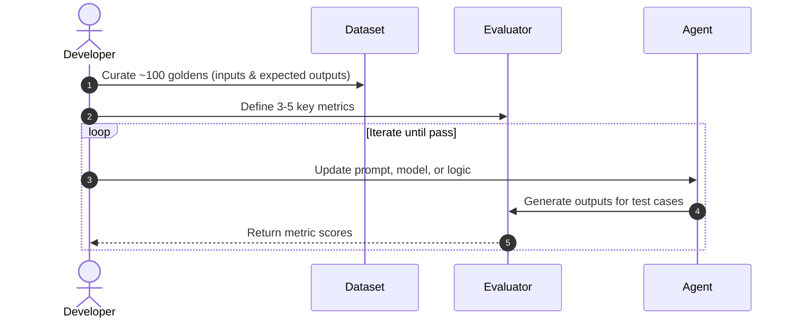
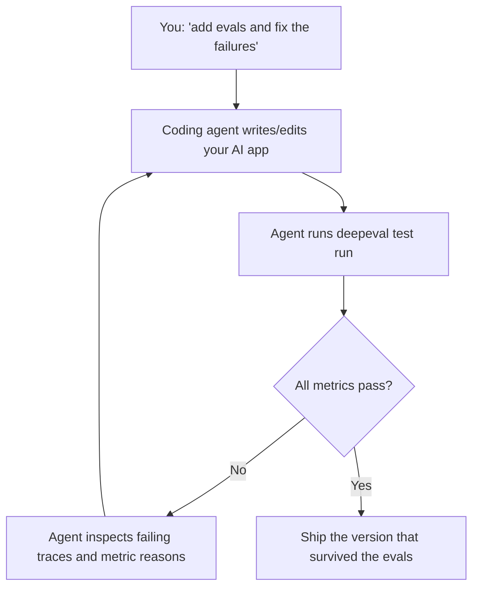

When you set out to build an AI app, there are two ways to go about it. The **bottom-up** approach is the default: start building, wire up the agent, and figure out whether it's any good later. The **top-down** approach flips the order — you first define the standards that separate a good AI app from a great one, then build toward them.

Eval driven development is the top-down approach, and the standards are your evals.

It borrows the spirit of test-driven development, but if you treat it exactly like TDD you'll burn your API budget and learn the wrong lessons.

This post covers what eval driven development is, how to do it right, the mistakes that quietly waste everyone's time, and how it all comes together — whether you're writing the code yourself or letting a coding agent do it for you.

## What is Eval Driven Development?

Eval driven development (EDD) is the process of using evals to iterate on LLM apps and AI agents. It is a 3-step process as follows:

1. Curate a dataset with a reasonable number of goldens (~100), ideally including expected outputs.
2. Define around 3-5 metrics that correlate well to how your AI agent performs.
3. Iterate until all metrics pass on your test cases.

Here's a visual diagram to show what this process looks like:



If you're building AI agents, these metrics might also expand into evaluating sub-agents — something we call [component-level evaluation](/guides/guides-ai-agent-evaluation).

If you come from a traditional software engineering background, this probably sounds like the AI equivalent of **Test-Driven Development (TDD)**. While the core philosophy is similar, treating EDD exactly like TDD—and trying to map their concepts 1\:1—will quickly lead to bottlenecks, high API costs, and frustration.

## How to do eval driven development right

The biggest mistake developers make when adopting EDD is treating it exactly like TDD. Here is why that doesn't work:

| Feature                 | Eval-Driven Development (EDD)                                       | Test-Driven Development (TDD) |
| ----------------------- | ------------------------------------------------------------------- | ----------------------------- |
| **Quantity vs Quality** | High quality, low quantity (~100 goldens)                           | As many tests as possible     |
| **Cost**                | Expensive, LLM API calls                                            | Essentially free              |
| **Speed**               | Takes time (LLM generation and evaluation)                          | Instantaneous                 |
| **Nature**              | Subjective ([LLM-as-a-judge](/blog/llm-as-a-judge), fuzzy matching) | Objective (pass/fail)         |

The good news is, while EDD is inherently harder and more expensive than TDD, it doesn't mean you can't find the same level of success. The key difference is that EDD forces you to focus on things that actually matter, rather than optimizing for vanity metrics or 100% test coverage.

Because eval-driven development is expensive and takes time to run, you must rely on high-quality datasets rather than sheer volume. After working with dozens of [enterprise customers](/enterprise), our recommendation is simple: start with 100 goldens, and scale to 500 at most. The worst mistake you can make is auto-generating so many test cases that your dataset devolves into meaningless AI slop.

In fact, research like the [LIMA: Less Is More for Alignment](https://arxiv.org/abs/2305.11206) paper shows that just 1,000 carefully curated examples can align a 65B parameter model to perform on par with GPT-4. The same principle applies to evals: a small, high-quality dataset of ~100 goldens is far more effective than thousands of low-quality, auto-generated test cases.

## Evals that matter in eval driven development

When you're paying for every test run and waiting for LLMs to evaluate other LLMs, you simply can't afford to test everything.

So the real question becomes: **what does "success" look like for your AI app?**

This is the hardest part, and it's exactly where most people get stuck. By far the most common question I get is some version of:

- "Can you please tell me what metrics other companies in my industry use?"
- "I'm building an agent for [insert use case here], which metrics should I pick?"

I completely understand why these questions come up. When you're early and under pressure to ship, it's natural to look for a checklist someone else has already validated. But the honest answer is that no one outside your team can hand you that list — and that's not a limitation, it's actually good news. Why? Because that's where moats come from, insights into your product that someone can't easily copy.

### Finding what matters

The reason I can't pick your metrics for customers is that I don't know what success looks like for their AI app, and more often than not, I usually haven't ever seen their customers interacting with their AI.

What I do know however, is the [`TaskCompletionMetric`](/docs/metrics-task-completion) works almost everywhere — while the custom [`G-Eval`](/docs/metrics-llm-evals) criteria that truly move the needle have to come from your understanding of what "good" looks like for your users.

This is where human-in-the-loop annotations come in: divide the work across your team, annotate how 100 or so of your AI's outputs actually perform, and then figure out which combination of metrics has the highest alignment rate to those human judgments. But that's a story for another day.

## Types of harnesses for eval driven development

There's really two dimensions to decide on the tests to setup for EDD. The first dimension is about the nature of the concern:

- **Security**: Prompt injection, toxicity, PII leakage, and jailbreaks. These are non-negotiable—if your agent is insecure, nothing else matters.
- **Functionality**: Does the agent actually do what it's supposed to do? This covers task completion, tool calling accuracy, and factual correctness (hallucination).

While the second, is the type of [eval harness to setup](/blog/what-is-an-eval-harness) around your eval driven development workflow:

- **Unit tests**: These evaluate specific components of your agent. For example, if your agent has a retrieval step, you should evaluate context precision and recall independently of the final generation. If it uses a tool, evaluate the tool selection accuracy.
- **Regression tests**: These are end-to-end evaluations run on your curated dataset of goldens. You run these every time you change the prompt, swap the model, or tweak the agent architecture to ensure you haven't degraded overall performance.

Both work, and they're not mutually exclusive. The examples below show how to run unit-tests on different types of AI applications, assuming you have access to the source code of the AI app you're building.

### Example 1: AI agents

Typically this involves the same three steps: **load your dataset**, **instrument your agent**, and **evaluate**. Here's what that looks like across some common AI agent frameworks:

<include cwd>snippets/evaluation/cicd-agent-framework-tabs.mdx</include>

Then run the whole suite with a single command:

```bash
deepeval test run test_llm_app.py
```

That's it. You can get started with the full walkthrough in the [AI agent evaluation quickstart](/docs/getting-started-agents).

### Example 2: RAG pipelines

For RAG, the same three steps apply, except you score the answer against the chunks it retrieved using RAG metrics like answer relevancy and faithfulness. The key is capturing the `retrieval_context` at evaluation time, since that's what metrics like faithfulness check the answer against:

```python title="test_rag.py" showLineNumbers
import pytest
from deepeval import assert_test
from deepeval.dataset import EvaluationDataset, Golden
from deepeval.tracing import observe, update_current_trace
from deepeval.metrics import AnswerRelevancyMetric, FaithfulnessMetric

# 1. Load your dataset of goldens
dataset = EvaluationDataset(goldens=[Golden(input="How do I reset my password?")])

# 2. Instrument your RAG pipeline (capture retrieval_context for grounding)
@observe()
def rag_pipeline(query: str) -> str:
    chunks = retrieve(query)            # your retrieval logic
    answer = generate(query, chunks)    # your LLM call
    update_current_trace(input=query, output=answer, retrieval_context=chunks)
    return answer

# 3. Evaluate end-to-end on each golden
@pytest.mark.parametrize("golden", dataset.goldens)
def test_rag(golden: Golden):
    rag_pipeline(golden.input)
    assert_test(golden=golden, metrics=[AnswerRelevancyMetric(), FaithfulnessMetric()])
```

Then run the whole suite with a single command:

```bash
deepeval test run test_rag.py
```

That's it. You can get started with the full walkthrough in the [RAG evaluation quickstart](/docs/getting-started-rag).

### Example 3: multi-turn chatbots

For chatbots, the unit of evaluation is the whole conversation rather than a single response. Instead of pre-writing turns, you start from a `scenario` and let `ConversationSimulator` drive a multi-turn conversation against your chatbot, then score each simulated conversation with multi-turn metrics like turn relevancy and knowledge retention:

```python title="test_chatbot.py" showLineNumbers
import pytest
from typing import List
from deepeval import assert_test
from deepeval.dataset import EvaluationDataset, ConversationalGolden
from deepeval.test_case import Turn
from deepeval.simulator import ConversationSimulator
from deepeval.metrics import TurnRelevancyMetric, KnowledgeRetentionMetric

# 1. Load your dataset of conversational goldens
dataset = EvaluationDataset(goldens=[
    ConversationalGolden(
        scenario="User wants to buy a VIP ticket to a Coldplay concert.",
        expected_outcome="Successful purchase of a ticket.",
    ),
])

# 2. Simulate conversations by wrapping your chatbot in a callback
async def model_callback(input: str, turns: List[Turn], thread_id: str) -> Turn:
    response = await your_chatbot(input, turns, thread_id)  # your chatbot
    return Turn(role="assistant", content=response)

simulator = ConversationSimulator(model_callback=model_callback)
test_cases = simulator.simulate(conversational_goldens=dataset.goldens, max_user_simulations=10)

# 3. Evaluate each simulated conversation end-to-end
@pytest.mark.parametrize("test_case", test_cases)
def test_chatbot(test_case):
    assert_test(test_case=test_case, metrics=[TurnRelevancyMetric(), KnowledgeRetentionMetric()])
```

Then run the whole suite with a single command:

```bash
deepeval test run test_chatbot.py
```

That's it. You can get started with the full walkthrough in the [chatbot evaluation quickstart](/docs/getting-started-chatbots).

## Evals driven development in Claude Code or any other coding assistant

Everything above assumed you're the one writing the test files. Increasingly, you're not — your coding agent is. Developers don't write as much code by hand anymore; we describe what we want and let Claude Code (or Cursor, Codex, and the rest) do the typing.

That shift is exactly why the eval harness matters more than ever. I wrote a whole article on [what an eval harness is](/blog/what-is-an-eval-harness) and why it's the one piece a coding agent's own harness doesn't ship with: there's no `assertEqual` for "was this response faithful?" A coding agent can write deterministic code and check it with lint and unit tests, but it can't tell whether the _agent it just wrote_ actually behaves — unless you hand it an eval harness to measure against.

DeepEval is that harness. Install the [DeepEval skill](/docs/vibe-coder-quickstart) once:

```bash
npx skills add confident-ai/deepeval --skill "deepeval"
```

Then say something like _"add evals to this repo and fix the failing ones."_ From there your coding agent drives the EDD loop itself — generating datasets, running `deepeval test run`, reading the failures, and iterating until the metrics pass:



The result is subtle but important: you're no longer shipping whatever the model wrote on the first pass. You're shipping the version that survived the evals — a deliberate choice, not a side effect of the model being good. The full loop, including every CLI command the agent shells out to, is documented in [Vibe Coding with DeepEval](/docs/vibe-coding).

## Conclusion: Start small, iterate fast

Eval driven development isn't about building a massive test suite from day one. It's about establishing a baseline of quality that gives you the confidence to iterate on your AI agent. Start with a small, high-quality dataset, pick a few metrics that actually matter, and use them to guide your development.

DeepEval is built specifically for this workflow, providing the metrics, dataset management, and testing infrastructure you need to do EDD right. It's free and 100% [open-source on ⭐ GitHub.](https://github.com/confident-ai/deepeval)

## FAQs

<FAQs
  qas={[
    {
      question: "What is eval driven development (EDD)?",
      answer: (
        <>
          A three-step loop: curate ~100 goldens, define 3-5 metrics that
          correlate with how your app performs, then iterate until those metrics
          pass.
        </>
      ),
    },
    {
      question: "How is EDD different from test-driven development (TDD)?",
      answer: (
        <>
          TDD tests are objective, free, and instant, so you write as many as
          possible. EDD evals are subjective (often{" "}
          <a href="/blog/llm-as-a-judge">LLM-as-a-judge</a>), cost money, and
          take time — so you keep the dataset small and high quality.
        </>
      ),
    },
    {
      question: "How many goldens do I need for EDD?",
      answer: (
        <>
          Start with ~100 high-quality goldens and scale to 500 at most. Quality
          beats quantity — see the{" "}
          <a href="https://arxiv.org/abs/2305.11206">LIMA paper</a> — and
          auto-generating thousands of low-quality cases just turns your dataset
          into AI slop.
        </>
      ),
    },
    {
      question: "What should I actually evaluate?",
      answer: (
        <>
          <strong>Security</strong> (prompt injection, toxicity, PII leakage)
          and <strong>functionality</strong> (task completion, tool-calling
          accuracy, factual correctness). Which specific metrics matter most is
          product-specific — annotate ~100 of your outputs and pick the metrics
          with the highest alignment to those human judgments.
        </>
      ),
    },
    {
      question: "Unit tests or regression tests for EDD?",
      answer: (
        <>
          Both. Unit tests score individual components in isolation (
          <a href="/guides/guides-ai-agent-evaluation">component-level evals</a>
          ), while regression tests run end-to-end over your full dataset whenever
          you change a prompt, model, or the architecture.
        </>
      ),
    },
    {
      question: "Can I do EDD with a coding agent like Claude Code or Cursor?",
      answer: (
        <>
          Yes. Install the DeepEval{" "}
          <a href="/blog/what-is-an-eval-harness">eval harness</a> skill (
          <code>npx skills add confident-ai/deepeval --skill "deepeval"</code>),
          and your agent drives the loop itself. See{" "}
          <a href="/docs/vibe-coding">Vibe Coding with DeepEval</a>.
        </>
      ),
    },
    {
      question: "How does eval driven development work for enterprise teams?",
      answer: (
        <>
          DeepEval runs locally and is{" "}
          <a href="https://github.com/confident-ai/deepeval">open-source</a>,
          but team-scale EDD needs shared datasets, regression tracking, and
          production monitoring. That's what{" "}
          <a href="/enterprise">Confident AI</a> adds on top.
        </>
      ),
    },
  ]}
/>
