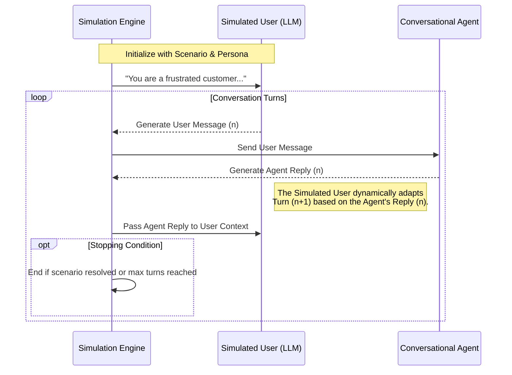

<ImageDisplayer
  alt="How to Evaluate Conversational Agents"
  src="https://deepeval-docs.s3.us-east-1.amazonaws.com/blog:how-to-evaluate-conversational-agent.png"
/>

Over 90% of evals run on DeepEval are still run using single-turn metrics, even when the use case is a conversational agent.

Why is that?

I've realized that multi-turn evals are hard not just because they are difficult to implement (which is partially true), but because getting the conversations in the first place is the challenge itself.

An engineer would either have to:

1. **Sample past production conversations** to run evals on
2. **Hard-code the conversation turns**

Neither of which feels like an attractive solution to me.

In this article, I want to explore what's stopping people from running multi-turn evals properly, what I think we can learn from voice agents, and how I get around the roadblock of not having a conversation to start with.

## The Cold Start Problem of Conversational Evals

I see this constantly: you've just built a shiny new conversational AI agent. It can remember past context, it can use tools, and it knows exactly when to ask clarifying questions. But before you deploy it, you need to know if it actually works.

If it were a simple Q&A bot, you could just feed it a list of questions and use DeepEval's LLM-as-a-judge metrics to see if the answers are accurate. But a multi-turn agent is different. Its behavior depends on the _flow_ of the conversation.

To evaluate it, you need a dataset of _conversations_. And this leads to the two deeply flawed approaches I see most engineers resort to.

### Approach A: Sampling production data

The most common advice for evaluation is to look at real user data. Just sample your production logs, right?

Here is why I've found this breaks down for conversational agents:

- **It's useless for regression testing or experimentation:** I consider this the biggest issue. By definition, if you are sampling production data, your agent is _already in production_. If you want to experiment with a new prompt or catch regressions in a CI pipeline, you need evaluations that you can run on the fly and on demand _before_ deployment.
- **The Cold Start Problem:** If you haven't deployed the agent yet, you don't have any production data to begin with. You can't evaluate the agent to deploy it, but you can't deploy it to get the data to evaluate it.
- **Privacy and Compliance:** Real user conversations often contain PII or sensitive data. Scrubbing this data so it can be safely used in continuous CI/CD pipelines is a massive headache.
- **Bias toward the "Happy Path":** Users in production often follow predictable paths. If you only sample real user data, you might miss edge cases—what happens when a user gets angry? What happens when they completely change the topic halfway through?

### Approach B: Hard-coding conversations

If you can't use real data, you have to create it yourself. This means sitting down and manually writing out both the user's messages and the expected agent responses for dozens or hundreds of test cases.

- **It's unscalable:** Writing a 10-turn conversation by hand takes time. Writing a diverse dataset of 100 such conversations is excruciating.
- **It's unrealistic:** As engineers, we naturally suffer from the curse of knowledge. I know I do. I write the perfect, logical prompts that _I_ know the agent expects. I rarely simulate the chaotic, typo-ridden, and unpredictable nature of real users.
- **The compounding state problem:** A conversation is a state machine. The $n$-th turn is entirely determined by the $(n-1)$-th turn, which is determined by the $(n-2)$-th turn, and so on and so forth. If your agent solves a problem in 3 turns instead of the expected 5, your hard-coded 4th user message will suddenly make zero sense in the context of the conversation. I've seen tests break not because the agent failed, but because the conversation naturally drifted from a static script.

## The Exception in the Industry: Voice Evals

Before we try to reinvent the wheel, I usually walk back and look at another eval vertical where this problem is actually already solved: **voice AI**.

With text-based chatbots, engineers often try to get away with "QA-ing" individual turns by eye—skimming logs, running single-turn metrics, or manually typing out a few responses. But with voice agents, manual QA genuinely doesn't make sense. You can't just skim a 5-minute audio file. You can't easily mock realistic human interruptions, latency, or shifting tones of voice in a spreadsheet.

Because you simply can't get away with single-turn testing in voice, the voice AI industry was forced to capture and evaluate the _entire_ conversation as a cohesive unit. They solved this by building dynamic, real-time user simulators.

When we talk about evaluating text-based conversational agents, we aren't doing anything fundamentally new. We are essentially taking the exact simulation paradigm that voice AI teams have already perfected, and simply stripping away the audio modality.

## The Solution: Simulating Conversations

If sampling production data is impossible, and hard-coding turns is fundamentally broken by the $n$-th turn problem, what is the alternative?

From my experience, the answer is **user simulation**. Instead of providing fixed conversation turns, I define the starting conditions, and let an LLM act as the user, dynamically interacting with my agent in real-time.

I've found this bypasses the compounding state problem completely. When the user is simulated dynamically, they react to whatever the agent actually did in the $(n-1)$-th turn. If the agent solves the problem early, the simulated user can naturally say "Thanks, goodbye!" instead of blindly reading the next line of a hard-coded script.



### The Spectrum of Simulation Complexity

Conversation simulation isn't just about generating text; it's about accurately mimicking human behavior to rigorously test your agent's boundaries. In my experience, as your agent matures, the complexity of your simulations must evolve alongside it.

| Complexity    | Focus                          | Key Capabilities                                                                                                                                                            |
| :------------ | :----------------------------- | :-------------------------------------------------------------------------------------------------------------------------------------------------------------------------- |
| **Basic**     | Goal-oriented interactions     | Scenario-based generation, evaluating if a specific expected outcome was reached.                                                                                           |
| **Simple**    | Character-driven interactions  | Controlling user personas, specific speech patterns, and emotional tones (e.g., angry, confused, elderly).                                                                  |
| **Medium**    | Controlled simulation pathways | Decision trees for simulation flow, granular context injection, and custom stopping conditions (e.g., stop the simulation immediately if the agent asks for a credit card). |
| **Difficult** | Real-world complexities        | Multi-modality (e.g. voice inputs/outputs), processing audio latencies, and handling unpredictable user interruptions.                                                      |

## Moving Beyond Single-Turn Evals

Once I have a reliable way to generate dynamic conversations across these different complexities, I can finally run true multi-turn evaluations.

Instead of asking "Was this specific response polite?", I can ask questions about the entire context of the conversation:

- Did the agent stay on topic?
- Did the agent hallucinate facts across turns?
- Did the agent successfully complete the user's overarching goal?

The roadblock of "getting the conversations" is gone. With simulated interactions, I can stress-test my conversational agents against hundreds of diverse scenarios before they ever see a real user.

I think it's time to move past single-turn metrics and start evaluating conversational agents the way they were meant to be evaluated.

## How to Implement Conversation Simulation

To bring these concepts to life, we built a powerful **Conversation Simulator** into DeepEval. It allows you to orchestrate realistic, multi-turn interactions between your AI agent and a simulated user, completely eliminating the need to hard-code turns.

Here is a look at how I use DeepEval to simulate conversations and evaluate a conversational agent without writing a single manual conversation turn:

<Switch>

<Case id="python">

```python
from deepeval.simulator import ConversationSimulator
from deepeval.dataset import ConversationalGolden
import asyncio

# 1. Define how your agent responds to an input
async def my_agent_callback(input: str, turns: list) -> str:
    # Your actual agent logic goes here
    # For example, calling your LangChain or LlamaIndex agent
    response = await my_custom_agent.chat(input, history=turns)
    return response

# 2. Initialize the simulator
simulator = ConversationSimulator(
    model_callback=my_agent_callback,
    max_concurrent=5
)

# 3. Define the scenarios you want to simulate
goldens = [
    ConversationalGolden(
        scenario="A user trying to cancel their subscription but gets convinced to pause it instead.",
        user_description="A frustrated customer who has been trying to navigate the UI for 20 minutes."
    ),
    ConversationalGolden(
        scenario="A user asking for product recommendations for a camping trip.",
        user_description="An enthusiastic beginner camper who asks a lot of clarifying questions."
    )
]

# 4. Run the simulation
conversations = simulator.simulate(
    conversational_goldens=goldens,
    max_user_simulations=5 # The simulator will chat with your agent for up to 5 turns
)

print(f"Generated {len(conversations)} multi-turn test cases!")
```

</Case>

<Case id="typescript">

<NotImplemented id="typescript" feature="ConversationSimulator">

TypeScript support for the `ConversationSimulator` is actively being worked on. In the meantime, you can define your `ConversationalTestCase` manually or use the Python SDK to generate them.

</NotImplemented>

</Case>

</Switch>

### How it works under the hood

When a simulation runs, a dynamic back-and-forth conversation is orchestrated:

1. A simulator LLM reads the `scenario` and `user_description` and generates the first user message.
2. This message is passed to your actual agent.
3. Your agent processes the message and returns a response.
4. The simulator reads your agent's response, stays in character, and generates the next logical user message based purely on that $(n-1)$-th turn.
5. This repeats until the scenario is naturally resolved or the maximum turn limit is reached.

---

DeepEval is 100% open-source. To get started with the Conversation Simulator, check out our [GitHub repository](https://github.com/confident-ai/deepeval) or read the [documentation](/docs/simulator-introduction).
