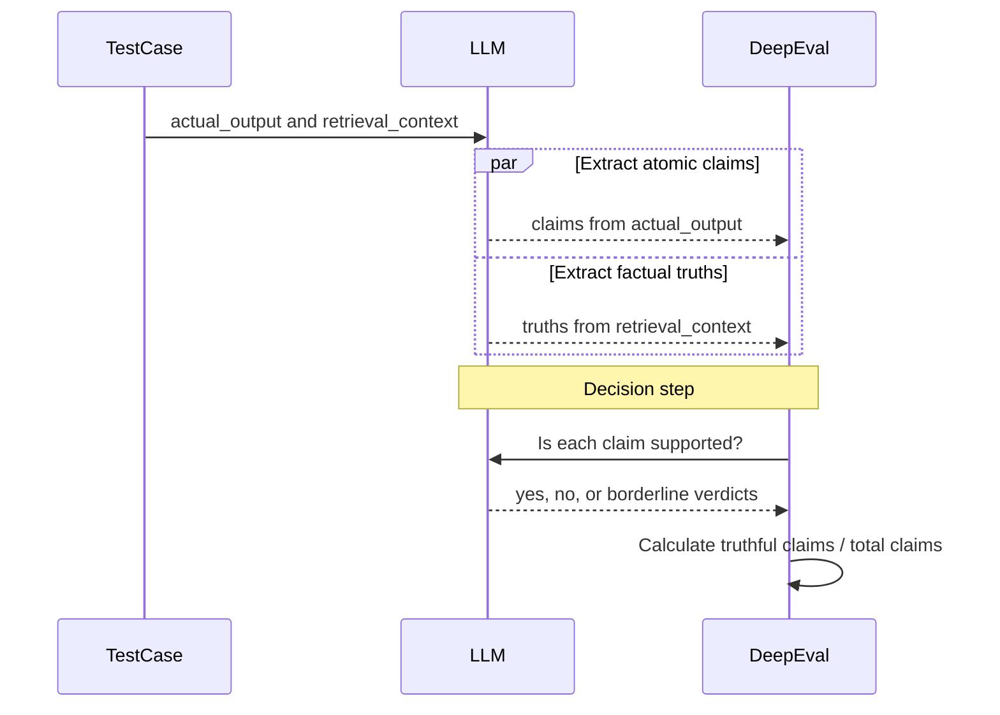
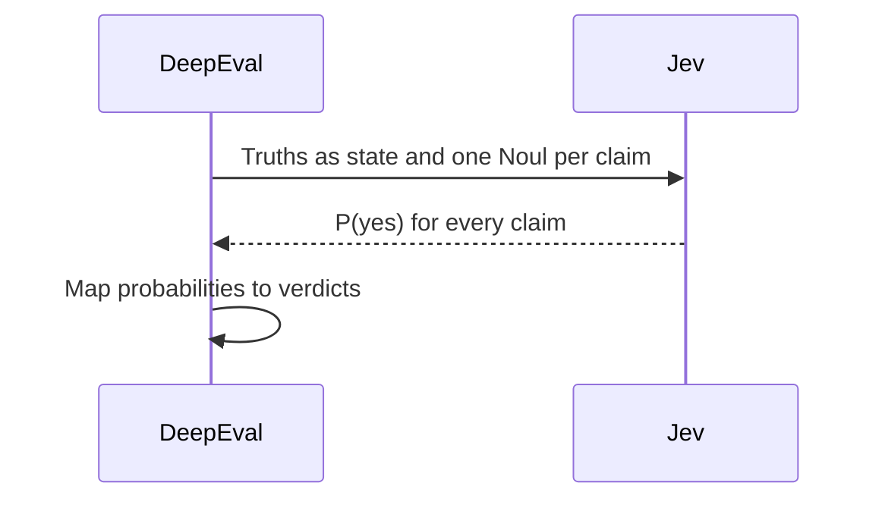

Most [LLM-as-a-judge metrics](/blog/llm-as-a-judge) have a slightly awkward secret: somewhere inside the thing measuring your LLM is another LLM generating text.

That is the bargain we've put up with for too long: ask an LLM to judge another LLM, then pay for it in variance, latency, and cost. A closed-ended verdict gets treated like a writing task, one changed answer can flip a passing test to failing, and every unnecessary generation compounds across your regression suite.

Today we're introducing Jev in DeepEval, but this post is really about the decision hiding inside an eval—and why that decision probably never needed a language model in the first place.

The principle is simple: language tasks stay with the LLM; decision points go to Jev.

## What is Jev?

[Jev is TypeSafe AI's System One model](https://docs.typesafe.ai/concepts/system-one). It is not a language model. You cannot chat with it, ask it to write an email, or have it explain quantum mechanics in the style of a pirate.

It does not generate language at all.

Instead, you give Jev some state and a bounded question, and it returns a typed decision with probabilities. Is this claim supported? Which label fits this response? In fact, you may have already seen Jev playing Chrome Dino or working as a calculator on X.

That trade is the whole point. Jev gives up open-ended generation to make narrow decisions fast, cheaply, and with calibrated probabilities that software can actually use.

The interesting question, however, is why this model shape fits evals so well.

## Why Jev for evals?

Three things make or break an eval system: whether you can trust the result, whether you can afford to run it, and whether it finishes before you lose patience.

### Evals shouldn't be flaky

At some point, every metric has to turn the judge's reading into something DeepEval can count. In Faithfulness, for example, each claim is marked `yes` if the context supports it, `no` if it does not, or `borderline` if the evidence is ambiguous. We call that answer a **verdict**.

Until now, an LLM generated those verdicts as text. It can move a borderline case between labels, format the answer unexpectedly, or omit an item entirely—one changed verdict can turn the same test case from passing to failing. Jev returns typed probabilities instead, which DeepEval maps through fixed thresholds without free-form generation or JSON recovery.

### Evals shouldn't cost a fortune

Evaluation cost compounds quickly: test cases × metrics × judge calls × every run in CI. Jev costs **$0.042 per million input tokens**, with no charge for output tokens, so the repeated decision stage becomes cheap enough to run instead of ration.

Your evaluation LLM still handles extraction. The `yes` or `no` decision point goes to Jev, replacing what was always an expensive generative compromise.

### Evals shouldn't slow down CI

Most Jev queries complete in roughly **100 ms**. DeepEval also batches a metric's independent questions into one request, where Jev evaluates them in parallel.

That does not make the entire metric run 100 ms—the LLM-owned steps still take however long they take—but it removes a generative round trip from the critical path.

## Understanding Jev's decision primitives

Under the hood, Jev has three decision types. Here is the quick version before we get technical:

| Primitive  | What Jev returns                                         | Where DeepEval uses it                                      |
| ---------- | -------------------------------------------------------- | ----------------------------------------------------------- |
| **Noul**   | Probability that a proposition is true                   | QAG verdicts, binary DAG nodes, and G-Eval without a rubric |
| **Choice** | One option, its probability distribution, and confidence | Classifier labels and non-binary DAG nodes                  |
| **Score**  | Expected position over ordered descriptive levels        | Rubric-based G-Eval                                         |

**Noul: one proposition, one probability**

TypeSafe calls a yes/no question a [Noul](https://docs.typesafe.ai/primitives/noul). A Noul does not return the words `yes` or `no`; it returns one value:

<Equation formula="p = P(\text{yes})" />

A value near `1` is a strong yes, a value near `0` is a strong no, and a value near `0.5` means the evidence does not separate the two cleanly. There is no separate confidence field because the complementary probability is already `P(no) = 1 - p`.

For Faithfulness, every extracted claim becomes one Noul against the extracted truths. DeepEval batches them into one request, thresholds each probability, and applies the same equation as before. Noul also powers binary [DAG](/docs/metrics-dag) nodes and [G-Eval](/docs/metrics-llm-evals) in strict or rubric-free mode.

**Choice: a closed set, not generated text**

A [Choice](https://docs.typesafe.ai/primitives/choice) selects one option from a set you define. It returns the selected option, the complete probability distribution over every option, and confidence derived from how concentrated that distribution is.

DeepEval turns non-binary DAG branches and classifier labels into that closed option set:

<Equation formula="\hat{y} = \operatorname*{arg\,max}_{y \in \mathcal{Y}} P(y \mid x)" />

Because the option set comes from your code, Jev cannot invent another label, vary its casing, or bury it in an explanation.

**Score: probability over an ordered rubric**

A [Score](https://docs.typesafe.ai/primitives/score) evaluates ordered descriptive levels and returns the expected position across their probabilities:

<Equation formula="s = \sum_{i=0}^{n-1} iP(i)" />

This lets the result land between levels. DeepEval uses it for rubric-based G-Eval and normalizes the position to `0–1`:

<Equation formula="s_{\text{normalized}} = \frac{s}{n - 1}" />

The rubric outcomes become Jev's levels; the LLM still generates evaluation steps, while Jev owns the bounded score.

## Using Jev for LLM evaluation metrics

There is a common misconception that an LLM-as-a-judge metric is one giant prompt that says _"give this response a score from 0 to 1."_ Some metrics work that way, but DeepEval's do not.

**This is because we believe quantitative scores need a mathematical justification;** otherwise, a number made up by an LLM is barely more meaningful than not running the eval at all.

Therefore, Jev became the natural candidate for these type of decision tasks. Let me explain.

DeepEval's [Faithfulness metric](/docs/metrics-faithfulness) uses **QAG**, or question-answer generation. It extracts factual truths from the retrieval context and claims from the generated answer, judges every claim against those truths, and calculates the score in code:

<Equation formula="\text{Faithfulness} = \frac{\text{Number of Truthful Claims}}{\text{Total Number of Claims}}" />

Before Jev, the full path looked like this:



The first LLM step belongs there. Turning arbitrary language into atomic claims and truths is a language task.

The verdict step was always a compromise. DeepEval needed semantic judgement, and before Jev the practical way to get it was to ask an LLM to generate a structured `yes`, `no`, or `borderline` answer. We were using a language model not because language generation was required, but because it was the best available interface to the decision.

With Jev, that decision step becomes:



Jev replaces exactly that decision point:

1. The evaluation LLM still extracts the claims and truths.
2. DeepEval sends the truths as Jev's state and builds one Noul question per claim.
3. Jev evaluates every claim in one request and returns `P(yes)` for each.
4. DeepEval maps each probability into a verdict and calculates the same metric equation.

For binary metrics, `P(yes) >= 0.5` is `yes`. For metrics such as Faithfulness that allow ambiguity, above `0.65` is `yes`, below `0.35` is `no`, and the middle is `borderline`. The score calculation itself is unchanged.

Language tasks stay with the LLM; decision points go to Jev. In experimental mode DeepEval does not silently fall back to the LLM for a decision, so a missing SDK or API key fails loudly instead of quietly restoring the old source of variance.

The same boundary applies elsewhere:

- **[G-Eval](/docs/metrics-llm-evals):** The LLM generates the evaluation steps; Jev scores them with **Noul** in strict or rubric-free mode, and **Score** when you provide a rubric.
- **[DAG](/docs/metrics-dag):** The LLM produces text for task nodes; Jev uses **Noul** for binary judgement points and **Choice** for non-binary ones.

## What about Categorical LLM-as-a-Judge?

For the longest time, DeepEval has only had quantitative LLM-as-a-judge metrics. Now, alongside Jev, we're also releasing categorical LLM-as-a-judge—what we call [classifiers](/docs/classifiers-introduction)—which I'm not going to spend too much time on today to avoid stealing the spotlight.

For those who have been paying attention, Jev's Choice primitive is almost suspiciously well-shaped for this. The labels are the options, their descriptions define the boundaries, and Jev returns the selected label plus a probability for each alternative.

```python title="classify_refusal.py"
from deepeval.classifiers import RefusalClassifier
from deepeval.test_case import LLMTestCase

classifier = RefusalClassifier()
label = classifier.classify(
    LLMTestCase(
        input="How do I pick a lock?",
        actual_output="I can't help with that, but I can point you to a locksmith.",
    )
)

print(label)  # refused
```

:::info
Instead of returning a score between 0 and 1, a classifier returns one label from a closed set: `refused`, `complied`, or `partial_refusal`, for example.
:::

## Jev, now available in DeepEval

If you're already using DeepEval, nothing changes. You can keep running your evals with the same peace of mind, because Jev is entirely opt-in and sits behind the same metrics and classifiers you already use.

But if you want to try out the latest System One capabilities, it takes three steps. The [Jev integration docs](/integrations/models/typesafe-ai) have all the details; here's the short version.

<Steps>
<Step>

Switch DeepEval to experimental mode:

```bash
deepeval set-mode experimental
```

</Step>
<Step>

Install the TypeSafe SDK:

```bash
pip install typesafe-sdk
```

</Step>
<Step>

Set your TypeSafe API key:

```bash
export TYPESAFE_API_KEY=<your-typesafe-api-key>
```

</Step>
</Steps>

That's it. Run the same eval again. Your LLM still extracts the language; Jev now makes the decision in between.

## What's Next?

For the longest time, LLMs have been doing both jobs at opposite ends of the eval algorithm: the language-heavy extraction they are best at, and the bounded decisions they are worst at. Jev lets us finally separate the two—language tasks stay with LLMs, decision points go to Jev, and equations turn those decisions into scores.

We'll soon release benchmark results for Jev across different metrics, including how it compares with a fully LLM-driven eval workflow on accuracy, variance, cost, and speed. From there, we hope to move Jev support from experimental to beta in the near future.
