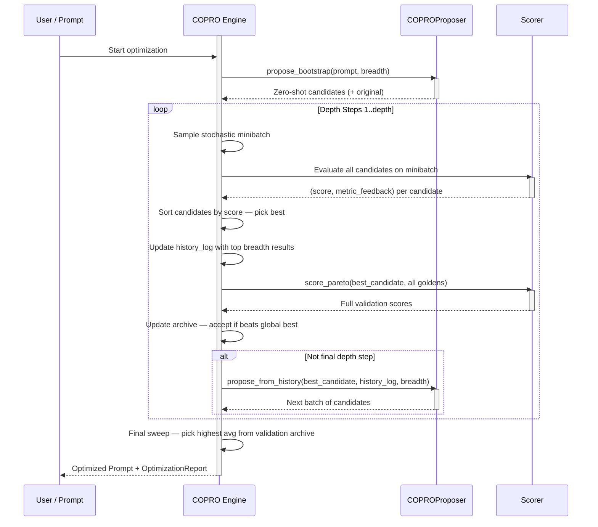
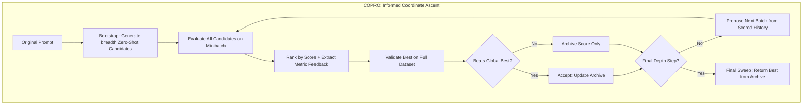

**COPRO (Co-operative Prompt Optimizer)** is a prompt optimization algorithm within `deepeval` adapted from the DSPy optimizer of the same name. It uses **Coordinate Ascent** to iteratively improve a prompt — evaluating a batch of candidates at each depth step, committing the best performer as the new baseline, and using the scored history plus metric feedback to generate an increasingly targeted next batch.

The core insight is that prompt optimization is most efficient when each new generation of candidates is **informed by what failed before** and **why it failed**. Rather than generating variations blindly, COPRO feeds the optimizer LLM a full diagnostic history — every past prompt attempt, its score, and the specific metric feedback explaining where points were lost — so each subsequent batch of candidates directly addresses known weaknesses.

:::info
The term **Coordinate Ascent** comes from mathematical optimization. In classical coordinate ascent you optimize one variable at a time while holding the others fixed, ascending the objective function one dimension at a time. COPRO applies this idea to prompt space: at each depth step, it locks in the best-performing prompt as the new baseline and builds the next generation of candidates on top of that committed improvement — climbing steadily rather than wandering.
:::

## Optimize Prompts With COPRO

To optimize a prompt using COPRO, provide a `COPRO` algorithm instance to the `optimize()` method:

```python
from deepeval.metrics import AnswerRelevancyMetric
from deepeval.prompt import Prompt
from deepeval.optimizer import PromptOptimizer
from deepeval.optimizer.algorithms import COPRO

prompt = Prompt(text_template="You are a helpful assistant - now answer this. {input}")

def model_callback(prompt: Prompt, golden) -> str:
    prompt_to_llm = prompt.interpolate(input=golden.input)
    return your_llm(prompt_to_llm)

optimizer = PromptOptimizer(
    algorithm=COPRO(),
    model_callback=model_callback
)

optimized_prompt = optimizer.optimize(prompt=prompt, goldens=goldens, metrics=[AnswerRelevancyMetric()])
```

Done ✅. You just used `COPRO` to run a prompt optimization.

## Customize COPRO

You can customize COPRO's behavior by passing parameters directly to the `COPRO` constructor:

```python
from deepeval.optimizer.algorithms import COPRO

copro = COPRO(
    depth=4,
    breadth=7,
    minibatch_size=25,
    random_state=42,
)
```

There are **FOUR** optional parameters when creating a `COPRO` instance:

- [Optional] `depth`: number of coordinate ascent steps to run. At each step, a new batch of candidates is evaluated and the best is committed as the baseline for the next step. Defaulted to `4`.
- [Optional] `breadth`: number of prompt candidates generated and evaluated at each depth step. A higher breadth explores more of the prompt space per step but costs more. Defaulted to `7`.
- [Optional] `minibatch_size`: number of goldens sampled per depth step for candidate evaluation. Larger batches give more reliable scores. Full-dataset validation is always run on the best candidate of each step. Defaulted to `25`.
- [Optional] `random_state`: reproducibility control. You can pass either an `int` seed or a `random.Random` instance. This affects minibatch sampling and candidate deduplication. Defaulted to a random value.

## How Does COPRO Work?



COPRO runs for `depth` steps. Each step evaluates a batch of `breadth` candidates, selects the best, validates it on the full dataset, then uses the scored history to propose the next batch. Here is the exact high-level flow:

1. **Bootstrap** — Generate the initial `breadth` candidates from the original prompt using zero-shot variation
2. **Evaluate** — Score all candidates on a stochastic minibatch and extract metric feedback per candidate
3. **Commit** — Pick the best minibatch candidate and run full-dataset validation on it
4. **Propose** — Feed the scored history back to the LLM to generate the next targeted batch
5. **Repeat** — Steps 2–4 run for each of the `depth` steps
6. **Final Selection** — Return the prompt with the highest average true validation score across all steps



### Phase 1: Bootstrap

Before the coordinate ascent loop begins, COPRO generates an initial set of `breadth` candidate prompts from the original prompt using **zero-shot variation**. This is done by the `COPROProposer` in two passes:

**Pass 1 — Guideline Generation:** The proposer asks the optimizer LLM to brainstorm `breadth` distinct "variation guidelines" — high-level strategies for how to meaningfully alter the prompt. Examples:

| Guideline Example                                                              | Effect                                                     |
|--------------------------------------------------------------------------------|------------------------------------------------------------|
| "Reframe the prompt to require step-by-step reasoning before the final answer" | Generates an instruction that enforces chain-of-thought    |
| "Condense instructions into a highly direct, concise format"                   | Produces a shorter, more aggressive instruction style      |
| "Add strict output formatting constraints"                                     | Makes the instruction prescriptive about output structure  |
| "Explicitly call out common mistakes to avoid"                                 | Generates a defensive, error-aware instruction             |

**Pass 2 — Candidate Generation:** For each guideline, the proposer makes a separate LLM call to produce the actual rewritten prompt. These calls run **concurrently in the async path**, making the bootstrap phase significantly faster than sequential generation.

The **original prompt is always inserted as candidate 0** before evaluation begins. This guarantees a baseline that the optimizer can always fall back to, and ensures that the first depth step has a fair reference point.

:::tip
The two-pass guideline approach ensures that candidates are **genuinely diverse** rather than superficially different. By first committing to a high-level strategy (the guideline) before writing the prompt, the LLM is less likely to produce variations that differ only in wording. Duplicate and near-duplicate candidates (≥90% similarity) are automatically filtered out.
:::

### Phase 2: Coordinate Ascent Loop

The loop runs for `depth` steps. Each step has three sub-stages: evaluate, commit, and propose.

#### Step 2a: Evaluate

At the start of each depth step, COPRO draws a random minibatch from your goldens and evaluates **every candidate** in the current batch against it. For each candidate, two things are captured:

1. **Score** — the average metric score across all goldens in the minibatch
2. **Metric feedback** — a diagnostic string describing exactly why points were lost, built from per-metric reasons on the failing examples

The metric feedback is a key enhancement over simpler optimizers. Rather than just recording a score, COPRO captures explanations like:

```
[Input]: Translate "Good morning" to French
[Expected]: Bonjour
[Actual Model Output]: Good morning in French is "Bonjour." Have a nice day!
[Evaluation Reasons]:
- AnswerRelevancyMetric (Score: 0.4): Response contains unnecessary filler beyond the requested translation.
```

This feedback is carried forward into the proposal step so the next generation of candidates is explicitly targeted at the failure modes identified here.

#### Step 2b: Commit

After scoring, candidates are ranked by minibatch score. The **top-scoring candidate** is selected, then evaluated on the **full golden dataset** using `score_pareto`. This full-dataset score is stored in the validation archive.

If the full-dataset average beats the current `global_best_score`, the candidate is accepted as the new best. All depth steps record full-dataset scores, so the final selection can compare every step's committed winner on equal footing.

:::info
COPRO runs full-dataset validation on the best candidate at **every depth step**, not just periodically. This makes COPRO's validation more thorough than SIMBA or MIPROv2, at the cost of more evaluations per step. It is what makes the coordinate ascent reliable — each committed baseline is genuinely validated, not just minibatch-estimated.
:::

#### Step 2c: Propose

Unless this is the final depth step, COPRO generates the next batch of `breadth` candidates. This uses the same two-pass proposer as bootstrap, but now passes the full `history_log` — a bounded, sorted record of the top `breadth` (prompt, score, metric_feedback) triples seen across all prior steps.

**Example: What the history log looks like at depth step 3**

| Attempt | Score | Metric Feedback Summary                                      |
|---------|-------|--------------------------------------------------------------|
| P₃ᵦ     | 0.81  | Minor formatting issues on 1/25 examples                     |
| P₂ₐ     | 0.74  | Consistently missed JSON schema on structured outputs        |
| P₁ᵦ     | 0.71  | Verbose responses triggered conciseness metric failures      |
| P₂ᵦ     | 0.68  | Lacked step-by-step reasoning on multi-hop questions         |
| ...     | ...   | ...                                                          |

The proposer sees this ranked history and generates guidelines that **explicitly fix the failure patterns** (e.g., "previous attempts failed the JSON schema metric — add a strict output format constraint") while **preserving the successful traits** of the highest-scoring attempts. The resulting candidates at each subsequent depth step are therefore more targeted and diagnostic than the zero-shot bootstrap.

### Step 3: Final Selection

After all `depth` steps, COPRO performs a **final sweep** over the full validation archive. It picks the configuration with the highest average full-dataset score across all committed depth-step winners. This is the `_extract_optimized_set` step — it ensures that even if a later depth step produced a worse result than an earlier one (possible with minibatch noise), the globally best validated prompt is always returned.

**Example: Coordinate ascent progression over 4 depth steps**

| Depth | Candidates Evaluated | Best Minibatch Score | Full Dataset Score | Accepted? |
| ----- | -------------------- | -------------------- | ------------------ | --------- |
| 1     | 8 (7 + original)     | 0.68                 | 0.65               | ✅ (root) |
| 2     | 7                    | 0.74                 | 0.71               | ✅        |
| 3     | 7                    | 0.79                 | 0.76               | ✅        |
| 4     | 7                    | 0.77                 | 0.73               | ❌        |

In this example, depth step 4 produces a candidate that looks promising on the minibatch (0.77) but underperforms on the full dataset (0.73) compared to depth step 3's committed baseline (0.76). The final sweep correctly selects the depth step 3 result as the optimized prompt.

## When to Use COPRO

COPRO is particularly effective when:

| Scenario                                           | Why COPRO Helps                                                                    |
|----------------------------------------------------|------------------------------------------------------------------------------------|
| **Instruction quality is the main lever**          | COPRO focuses entirely on refining the instruction text                            |
| **You have clear metric feedback**                 | Diagnostic feedback per candidate makes each generation more targeted              |
| **You want predictable, monotonic improvement**    | Coordinate ascent commits each improvement before building on it                   |
| **Smaller datasets**                               | Full-dataset validation at every step works well when goldens are not too numerous |
| **You need fast convergence**                      | Depth steps are shallow and focused; typically 3-5 steps is enough                 |

## COPRO vs. Other Algorithms

| Aspect                     | COPRO                                   | SIMBA                                      | GEPA                                   | MIPROv2                                      |
|----------------------------|------------------------------------------|--------------------------------------------|----------------------------------------|---------------------------------------------|
| **Search strategy**        | Informed coordinate ascent               | Variance-driven introspective ascent       | Pareto-based evolutionary              | Bayesian Optimization (TPE)                 |
| **Feedback signal**        | Score + metric feedback per candidate    | Score variance across trajectories         | LLM diagnosis of failures/successes    | Minibatch score per trial                   |
| **Optimizes instructions?**| ✅ Yes                                    | ✅ Yes                                     | ✅ Yes                                 | ✅ Yes                                      |
| **Optimizes demos?**       | ❌ No                                     | ✅ Yes                                     | ❌ No                                  | ✅ Yes                                      |
| **Candidate generation**   | Two-pass guideline + rewrite             | Per-iteration from hard examples           | Per-iteration via reflective mutation  | All upfront (proposal phase)                |
| **Full eval frequency**    | Every depth step                         | Every N iterations                         | Per accepted candidate                 | Every N trials                              |
| **Best for**               | Fast, instruction-focused optimization   | Inconsistent model behavior, complex tasks | Diverse problem types, multi-objective | Large search spaces, few-shot-heavy tasks   |

Choose **COPRO** when you want fast, targeted instruction improvement with clear diagnostic feedback guiding each generation — especially when you don't need few-shot demonstrations and want reliable convergence in a small number of steps.

Choose **SIMBA** when your model is inconsistent across runs and you want the optimizer to learn from that inconsistency, or when the task benefits from both instruction improvements and injected demonstrations.

Choose **GEPA** when your task spans diverse problem types and you need to maintain a diverse pool of prompt strategies without converging prematurely on a single approach.

Choose **MIPROv2** when the joint combination of instruction and few-shot demonstrations is the main lever and you want systematic Bayesian search over that space.

## FAQs

<FAQs
  qas={[
    {
      question: "What is COPRO and when should I use it?",
      answer: (
        <>
          <code>COPRO</code> (Co-operative Prompt Optimizer) uses coordinate
          ascent: at each depth step it evaluates a batch of candidates, commits
          the best as the new baseline, and uses the scored history plus metric
          feedback to generate a more targeted next batch. Use it for fast,
          instruction-focused optimization with reliable, monotonic improvement
          in a small number of steps.
        </>
      ),
    },
    {
      question: "What do `depth` and `breadth` control in COPRO?",
      answer: (
        <>
          <code>depth</code> (default <code>4</code>) is the number of coordinate
          ascent steps; each step commits the best candidate as the baseline for
          the next. <code>breadth</code> (default <code>7</code>) is how many
          candidates are generated and evaluated at each step. Higher{" "}
          <code>breadth</code> explores more of the prompt space per step but
          costs more.
        </>
      ),
    },
    {
      question: "Does COPRO optimize few-shot demonstrations?",
      answer: (
        <>
          No. COPRO focuses entirely on refining the instruction text and does
          not inject demos. If few-shot demonstrations are an important lever for
          your task, use{" "}
          <a href="/docs/prompt-optimization-simba">SIMBA</a> or{" "}
          <a href="/docs/prompt-optimization-miprov2">MIPROv2</a>, both of which
          optimize demos.
        </>
      ),
    },
    {
      question: "How does COPRO use metric feedback to improve candidates?",
      answer: (
        <>
          At each depth step COPRO captures both a score and a diagnostic{" "}
          metric feedback string per candidate, built from per-metric reasons on
          failing examples. This ranked <code>history_log</code> is fed back to
          the proposer via <code>propose_from_history</code>, so the next batch
          explicitly targets known failure modes while preserving the traits of
          high-scoring attempts.
        </>
      ),
    },
    {
      question: "How often does COPRO run full-dataset validation?",
      answer: (
        <>
          At every depth step. COPRO runs <code>score_pareto</code> on the best
          minibatch candidate of each step against all goldens, which makes its
          validation more thorough than SIMBA or MIPROv2 at the cost of more
          evaluations. This is what makes each committed baseline genuinely
          validated rather than minibatch-estimated.
        </>
      ),
    },
    {
      question: "How do I make COPRO runs reproducible?",
      answer: (
        <>
          Pass <code>random_state</code> as either an <code>int</code> seed or a{" "}
          <code>random.Random</code> instance. It affects minibatch sampling and
          candidate deduplication; by default it uses a random value, so pin it
          for repeatable runs.
        </>
      ),
    },
  ]}
/>