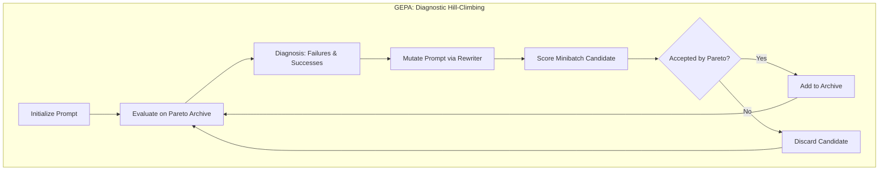
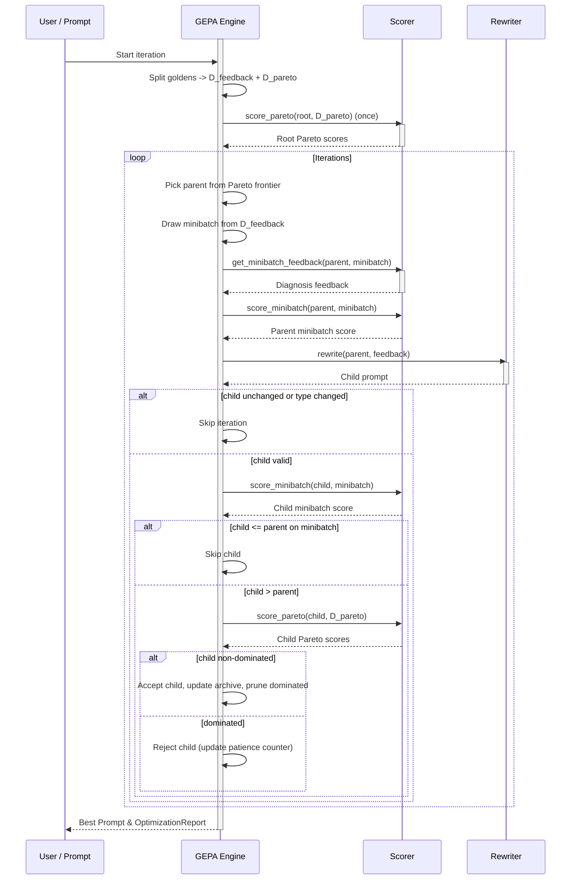

**GEPA (Genetic-Pareto)** is a prompt optimization algorithm within `deepeval` adapted from the DSPy paper [GEPA: Genetic Pareto Optimization of LLM Prompts](https://arxiv.org/pdf/2507.19457). It combines evolutionary optimization with multi-objective Pareto selection to systematically improve prompts while maintaining diversity across different problem types.

The core insight is that different prompts may excel at different types of problems—a prompt optimized for code generation might struggle with creative writing, and vice versa. GEPA addresses this by maintaining a diverse pool of candidate prompts rather than converging on a single "best" one.

:::info
The word **Pareto** comes from economics and multi-objective optimization. Imagine you're comparing prompts across multiple goldens—a prompt is **Pareto optimal** (or "non-dominated") when there's no way to improve its score on one golden without making it worse on another.

Pareto selection in GEPA prevents optimization from converging at a local maximum.
:::

## Optimize Prompts With GEPA

To optimize a prompt using GEPA, simply provide a `GEPA` algorithm instance to the `optimize()` method:

```python
from deepeval.metrics import AnswerRelevancyMetric
from deepeval.prompt import Prompt
from deepeval.optimizer import PromptOptimizer
from deepeval.optimizer.algorithms import GEPA

prompt = Prompt(text_template="You are a helpful assistant - now answer this. {input}")

def model_callback(prompt: Prompt, golden) -> str:
    prompt_to_llm = prompt.interpolate(input=golden.input)
    return your_llm(prompt_to_llm)

optimizer = PromptOptimizer(
    algorithm=GEPA(), # Provide GEPA here as the algorithm
    model_callback=model_callback
)

optimized_prompt = optimizer.optimize(prompt=prompt, goldens=goldens, metrics=[AnswerRelevancyMetric()])
```

Done ✅. You just used `GEPA` to run a prompt optimization.

:::note
Since `GEPA` is already the default for `algorithm`, unless you wish to configure how `GEPA` is ran there's no need to explicitly pass it in as an argument.
:::

## Customize GEPA

You can customize GEPA's behavior by passing arguments directly to the `GEPA` constructor:

```python
from deepeval.optimizer.algorithms import GEPA

gepa = GEPA(
    iterations=10,
    pareto_size=5,
    minibatch_size=4,
    patience=4,
    random_seed=42,
)
```

There are **NINE** optional parameters when creating a `GEPA` instance:

- [Optional] `iterations`: total number of mutation attempts. Defaulted to `5`.
- [Optional] `pareto_size`: number of goldens in the Pareto validation set (`D_pareto`). Defaulted to `3`.
- [Optional] `minibatch_size`: number of goldens drawn for feedback per iteration. Automatically clamped to available data. Defaulted to `8`.
- [Optional] `patience`: stop early after this many consecutive rejected children. Defaulted to `3`.
- [Optional] `random_seed`: seed for reproducibility. Controls golden splitting, minibatch sampling, Pareto parent selection, and tie-breaking. Set a fixed value (e.g., `42`) to get reproducible runs. Defaulted to `time.time_ns()`.
- [Optional] `tie_breaker`: policy for breaking ties (`PREFER_ROOT`, `PREFER_CHILD`, or `RANDOM`). Defaulted to `PREFER_CHILD`.
- [Optional] `aggregate_instances`: function that aggregates a prompt's per-golden Pareto scores into a scalar for ranking/tie handling. Defaulted to `mean_of_all`.
- [Optional] `reflection_model`: LLM used for diagnosis/feedback generation. Defaulted to `"gpt-4o-mini"`.
- [Optional] `mutation_model`: LLM used for rewriting the prompt. Defaulted to `"gpt-4o"`.
- [Optional] `scorer`: custom scorer instance. In most workflows this is injected by `PromptOptimizer`.

## How Does GEPA Work?



Rather than forcing a single "best" prompt, GEPA maintains a **diverse population of candidate prompts** and uses [Pareto selection](#step-2-pareto-selection) to balance exploration of different strategies with exploitation of proven improvements. This prevents the optimization from getting stuck at a local maximum.



The algorithm runs for a configurable number of `iterations`. Each iteration tries to evolve one new prompt variant, then decides whether to keep it. Here's the exact high-level flow:

1. **Golden Splitting** — Split goldens into a fixed validation set (`D_pareto`) and feedback set (`D_feedback`)
2. **Parent Selection** — Sample a parent from the Pareto frontier using frequency-weighted selection
3. **Feedback & Rewrite** — Score a minibatch, collect diagnosis, and generate a child prompt
4. **Filter + Acceptance** — Reject unchanged/weak candidates, then run Pareto acceptance
5. **Final Pick** — Choose the top prompt by aggregate score (with tie-breaker policy)

### Step 1: Golden Splitting

Before optimization begins, GEPA splits your goldens into two disjoint subsets:

- **`D_pareto`** (validation set): A fixed subset of `pareto_size` goldens used to score **every** prompt candidate. By evaluating all prompts on the same goldens, GEPA ensures fair comparison—score differences reflect actual prompt quality, not sampling luck.
- **`D_feedback`** (feedback set): The remaining goldens used for sampling minibatches during mutation. These provide diverse training signals without contaminating the validation set.

This train/validation split is fundamental to avoiding overfitting—prompts are mutated based on feedback goldens but selected based on held-out validation performance.

### Step 2: Pareto Selection

At each iteration, GEPA must choose a **parent prompt** to mutate. Instead of simply picking the prompt with the highest average score (which might be a local optimum), GEPA uses **Pareto-based selection** to maintain diversity. Pareto selection involves two steps:

1. **Finding non-dominated prompts** — Identify all prompts on the Pareto frontier
2. **Sampling from the frontier** — Select a parent using frequency-weighted sampling

:::tip
The **Pareto frontier** is the set of all non-dominated prompts. A prompt is on the frontier if no other prompt beats it on _every_ golden—it might excel at some golden types while being weaker on others. By sampling from this frontier rather than always picking the single "best" prompt, GEPA explores diverse optimization strategies.
:::

#### Finding Non-Dominated Prompts

A prompt **dominates** another if it scores better or equal on all goldens, and strictly better on at least one. A prompt is on the Pareto frontier if it is non-dominated (i.e. if no other prompt dominates it).

In the tables below, scores represent the aggregated metric scores (from the `metrics` you provide) for each prompt–golden pair:

**Example 1: Dominance** — P₁ dominates P₀ because it scores higher on every golden:

| Prompt | Golden 1 | Golden 2 | Golden 3 | Mean | On Frontier?         |
| ------ | -------- | -------- | -------- | ---- | -------------------- |
| P₀     | 0.60     | 0.55     | 0.50     | 0.55 | ❌ (dominated by P₁) |
| P₁     | 0.75     | 0.70     | 0.65     | 0.70 | ✅                   |

**Example 2: No Dominance** — Neither prompt dominates the other because each wins on different goldens:

| Prompt | Golden 1 | Golden 2 | Golden 3 | Mean | On Frontier? |
| ------ | -------- | -------- | -------- | ---- | ------------ |
| P₀     | 0.9      | 0.6      | 0.7      | 0.73 | ✅           |
| P₁     | 0.7      | 0.8      | 0.7      | 0.73 | ✅           |

Other edge cases include:

- Ties on all goldens: Both prompts stay on the frontier (neither dominates)
- One prompt wins some, ties on rest: The winning prompt dominates (e.g., P₀ scores [0.8, 0.7, 0.7] vs P₁'s [0.7, 0.7, 0.7] → P₀ dominates P₁)
- Empty frontier: Impossible—there's always at least one non-dominated prompt

#### Sampling from the Frontier

From the Pareto frontier, GEPA samples a parent with probability proportional to how often each prompt "wins" (achieves the highest score) across `D_pareto` goldens. This balances:

- **Exploration**: All non-dominated prompts have a chance to be selected, preventing premature convergence
- **Exploitation**: Prompts that win more often are more likely to be chosen as parents

#### Example: Pareto Table After 4 Iterations

Here's what the Pareto score table might look like after 4 iterations with `pareto_size=3`:

| Prompt    | Golden 1 | Golden 2 | Golden 3 | Mean | Wins | On Frontier?         |
| --------- | -------- | -------- | -------- | ---- | ---- | -------------------- |
| P₀ (root) | 0.60     | 0.55     | 0.50     | 0.55 | 0    | ❌ (dominated by P₁) |
| P₁        | 0.75     | 0.70     | 0.60     | 0.68 | 0    | ❌ (dominated by P₄) |
| P₂        | 0.65     | **0.85** | 0.55     | 0.68 | 1    | ✅                   |
| P₃        | 0.60     | 0.60     | **0.80** | 0.67 | 1    | ✅                   |
| P₄        | **0.80** | 0.75     | 0.70     | 0.75 | 1    | ✅                   |

In this example:

- **P₀** (the original prompt) is dominated by P₁, which scores better on all goldens
- **P₁** is dominated by P₄, which also scores better on all goldens—so P₁ is off the frontier too
- **P₂** specializes in Golden 2-type problems (e.g., reasoning tasks) but struggles with others
- **P₃** specializes in Golden 3-type problems (e.g., creative tasks) but scores lower elsewhere
- **P₄** has the highest mean but doesn't dominate P₂ or P₃—it loses to P₂ on Golden 2 and to P₃ on Golden 3

The Pareto frontier contains **P₂, P₃, and P₄**. Each wins exactly 1 golden, giving them **equal selection probability** (33% each). Despite P₄ having the highest mean score, GEPA might still select P₂ or P₃ as parents to explore their specialized strategies—this is how GEPA avoids local optima and maintains prompt diversity.

### Step 3: Feedback & Rewrite

Once a parent prompt is selected, GEPA creates a child prompt through **feedback-driven rewriting**:

1. **Sample a minibatch**: Draw up to `minibatch_size` examples from `D_feedback`
2. **Diagnose**: Gather scorer feedback (`get_minibatch_feedback`) on the parent
3. **Baseline score**: Score the parent on that same minibatch
4. **Rewrite**: Use the rewriter to generate a child prompt from the diagnosis
5. **Sanity filter**: Skip the child if it is effectively unchanged or has a different prompt type

This keeps mutations targeted: changes are driven by metric feedback rather than random prompt edits.

### Step 4: Acceptance

GEPA applies acceptance in two gates:

1. **Minibatch gate**: The child must strictly beat the parent on the same minibatch.
2. **Pareto gate**: On `D_pareto`, the child must be non-dominated relative to both:
   - the parent prompt configuration
   - all existing configurations in the archive

When accepted, GEPA:

1. Adds the child to the prompt-configuration graph
2. Inserts the child's Pareto scores into the archive
3. Removes archive entries that are dominated by the new child

If rejected by the Pareto gate, GEPA increments a consecutive-rejection counter and can early-stop once it reaches `patience`.

### Step 5: Final Selection

After all iterations complete, GEPA selects the **final optimized prompt** from the candidate pool:

1. **Aggregate scores**: Each prompt's scores across all `D_pareto` goldens are aggregated (mean by default)
2. **Rank candidates**: Prompts are ranked by their aggregate score
3. **Break ties**: If multiple prompts tie for the highest score, the `tie_breaker` policy determines the winner (`PREFER_CHILD` by default, which favors more recently evolved prompts)

The winning prompt is returned as the optimized result.
