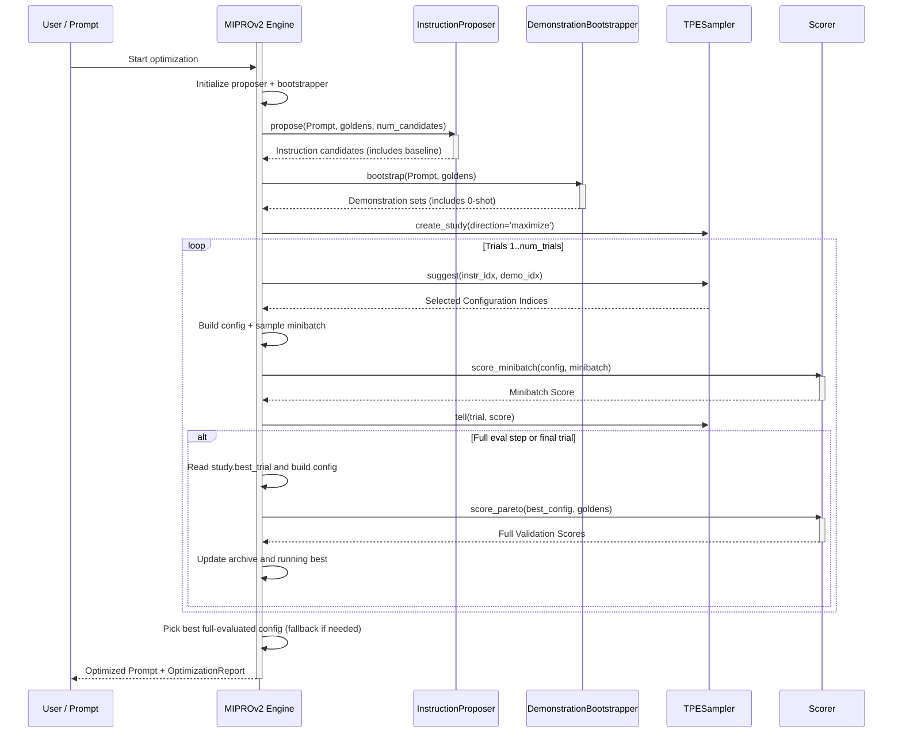
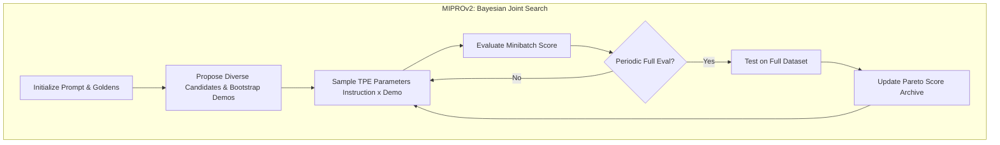

**MIPROv2 (Multiprompt Instruction PRoposal Optimizer Version 2)** is a prompt optimization algorithm within `deepeval` adapted from the DSPy paper [Optimizing Instructions and Demonstrations for Multi-Stage Language Model Programs](https://arxiv.org/pdf/2406.11695). It combines intelligent instruction proposal with few-shot demonstration bootstrapping and uses Bayesian Optimization to find the optimal prompt configuration.

The core insight is that both the **instruction** (what the LLM should do) and the **demonstrations** (few-shot examples) significantly impact performance—and finding the best combination requires systematic search rather than manual tuning.

:::info
MIPROv2 requires the `optuna` package for Bayesian Optimization. Install it with:

```bash
pip install optuna
```

:::

## Optimize Prompts With MIPROv2

To optimize a prompt using MIPROv2, simply provide a `MIPROV2` algorithm instance to the `optimize()` method:

```python
from deepeval.metrics import AnswerRelevancyMetric
from deepeval.prompt import Prompt
from deepeval.optimizer import PromptOptimizer
from deepeval.optimizer.algorithms import MIPROV2

prompt = Prompt(text_template="You are a helpful assistant - now answer this. {input}")

def model_callback(prompt: Prompt, golden) -> str:
    prompt_to_llm = prompt.interpolate(input=golden.input)
    return your_llm(prompt_to_llm)

optimizer = PromptOptimizer(
    algorithm=MIPROV2(), # Provide MIPROv2 here as the algorithm
    model_callback=model_callback
)

optimized_prompt = optimizer.optimize(prompt=prompt, goldens=goldens, metrics=[AnswerRelevancyMetric()])
```

Done ✅. You just used `MIPROv2` to run a prompt optimization.

## Customize MIPROv2

You can customize MIPROv2's behavior by passing parameters directly to the `MIPROV2` constructor:

```python
from deepeval.optimizer.algorithms import MIPROV2

miprov2 = MIPROV2(
    num_candidates=10,
    num_trials=30,
    minibatch_size=25,
    max_bootstrapped_demonstrations=4,
    max_labeled_demonstrations=4,
    num_demonstration_sets=5,
    random_state=42,
)
```

There are **EIGHT** optional parameters when creating a `MIPROV2` instance:

- [Optional] `num_candidates`: number of diverse instruction candidates to generate in the proposal phase. Defaulted to `10`.
- [Optional] `num_trials`: number of Bayesian Optimization trials to run. Each trial evaluates a different (instruction, demo_set) combination. Defaulted to `30`.
- [Optional] `minibatch_size`: number of goldens sampled per trial for evaluation. Larger batches give more reliable scores but cost more. Defaulted to `25`.
- [Optional] `minibatch_full_eval_steps`: run a full evaluation on all goldens every N trials. This provides accurate score estimates periodically. Defaulted to `10`.
- [Optional] `max_bootstrapped_demonstrations`: maximum number of bootstrapped demonstrations (model-generated outputs that passed validation) per demo set. Defaulted to `4`.
- [Optional] `max_labeled_demonstrations`: maximum number of labeled demonstrations (from `expected_output` in your goldens) per demo set. Defaulted to `4`.
- [Optional] `num_demonstration_sets`: number of different demo set configurations to create. More sets provide more variety for the optimizer to explore. Defaulted to `5`.
- [Optional] `random_state`: reproducibility control. You can pass either an `int` seed or a `random.Random` instance. This affects candidate generation, demo bootstrapping, minibatch sampling, and TPE sampling.

## How Does MIPROv2 Work?



MIPROv2 works in **two phases**: a **Proposal Phase** that builds the search space, followed by an **Optimization Phase** that searches that space with Bayesian Optimization.

Unlike GEPA which evolves prompts iteratively through mutations, MIPROv2 generates all instruction candidates at once and then intelligently searches the space of (instruction, demonstration) combinations.



### Phase 1: Proposal

The proposal phase runs once at the start and has two steps:

1. **Instruction Proposal** — Generate diverse instruction candidates (baseline + variants)
2. **Demo Bootstrapping** — Build multiple demonstration sets from your goldens

#### Step 1a: Instruction Proposal

The instruction proposer starts with your original prompt, then asks the optimizer LLM to generate variants with different "tips" to encourage diversity:

| Tip Example                          | Effect                                                 |
| ------------------------------------ | ------------------------------------------------------ |
| "Be concise and direct"              | Generates shorter, focused instructions                |
| "Use step-by-step reasoning"         | Generates instructions that emphasize chain-of-thought |
| "Focus on clarity and precision"     | Generates explicit, unambiguous instructions           |
| "Consider edge cases and exceptions" | Generates robust, defensive instructions               |

The original prompt is always kept as candidate `0` (baseline), so optimization can always fall back to it.

#### Step 1b: Demo Bootstrapping

The bootstrapper creates a set of candidate few-shot demonstration bundles. It:

- Collects **bootstrapped demos** by running the current prompt and keeping only outputs that pass all metrics
- Collects **labeled demos** from `expected_output` / `expected_outcome`
- Builds `num_demonstration_sets` mixed sets from those pools

A **0-shot option** (empty demo set) is always included, so the optimizer can test whether demonstrations help or hurt.

:::tip
Demo bootstrapping is particularly powerful when your task benefits from examples. For complex reasoning or formatting tasks, the right few-shot demos can dramatically improve performance.
:::

### Phase 2: Bayesian Optimization

After proposal, MIPROv2 uses **Optuna TPE** to search over `(instruction_idx, demonstration_set_idx)` combinations.

#### What is Bayesian Optimization?

Bayesian Optimization is a sample-efficient strategy for finding the maximum of expensive-to-evaluate functions. Instead of exhaustively testing every combination:

1. **Build a surrogate model** of the objective function based on observed trials
2. **Use the surrogate** to predict which untried combinations are most promising
3. **Evaluate the most promising combination** and update the surrogate
4. **Repeat** until the budget (`num_trials`) is exhausted

:::info
**TPE (Tree-structured Parzen Estimator)** is Optuna's default sampler. It models the probability of good vs. bad results for each parameter value and samples configurations that are likely to improve on the best seen so far.
:::

#### Trial Evaluation

Each optimization trial:

1. **Samples** instruction and demonstration-set indices (guided by TPE)
2. **Builds** a prompt configuration by combining that instruction + demo set
3. **Scores** it on a stochastic minibatch (`score_minibatch`)
4. **Reports** the trial score back to Optuna (`study.tell`)

Minibatch scoring is fast but noisy. Every `minibatch_full_eval_steps` trials (and always on the final trial), MIPROv2 runs full-dataset scoring (`score_pareto`) on Optuna's current best trial and stores those true validation scores.

#### Example: Trial Progression

Here's what a typical optimization might look like with `num_candidates=5` and `num_demonstration_sets=4`:

| Trial | Instruction  | Demo Set   | Score    | Notes                           |
| ----- | ------------ | ---------- | -------- | ------------------------------- |
| 1     | 0 (original) | 0 (0-shot) | 0.65     | Baseline                        |
| 2     | 2            | 3          | 0.72     | Early exploration               |
| 3     | 4            | 1          | 0.68     | Trying different combo          |
| 4     | 2            | 3          | 0.74     | TPE returns to promising region |
| 5     | 2            | 2          | 0.71     | Exploring nearby                |
| ...   | ...          | ...        | ...      | ...                             |
| 20    | 2            | 3          | **0.78** | Best combination found          |

Notice how TPE tends to revisit promising combinations (instruction 2, demo set 3) while still exploring alternatives.

### Final Selection

After all trials complete:

1. **Scan full-eval archive** (`pareto_score_table`) and pick the highest average full-dataset score
2. **Fallback** to the running best config if needed
3. **Return** the prompt from that winning configuration with demonstrations rendered inline

The returned prompt includes both the best instruction and the best demonstrations, ready to use in production.

## When to Use MIPROv2

MIPROv2 is particularly effective when:

| Scenario                     | Why MIPROv2 Helps                                             |
| ---------------------------- | ------------------------------------------------------------- |
| **Few-shot examples matter** | MIPROv2 jointly optimizes instructions AND demos              |
| **Large search space**       | Bayesian optimization efficiently navigates many combinations |
| **Expensive evaluations**    | Minibatch sampling reduces costs while maintaining signal     |
| **Need reproducibility**     | Fixed random seed gives identical results                     |

## MIPROv2 vs GEPA

| Aspect                   | MIPROv2                           | GEPA                             |
| ------------------------ | --------------------------------- | -------------------------------- |
| **Search strategy**      | Bayesian Optimization (TPE)       | Pareto-based evolutionary        |
| **Candidate generation** | All upfront (proposal phase)      | Iterative mutations              |
| **Few-shot demos**       | Jointly optimized                 | Not included                     |
| **Diversity mechanism**  | Diverse tips + multiple demo sets | Pareto frontier sampling         |
| **Best for**             | Tasks where examples help         | Tasks with diverse problem types |

Choose **MIPROv2** when few-shot demonstrations are important for your task, or when you have a large candidate space to explore efficiently.

Choose **GEPA** when you need to maintain diversity across different problem types, or when the task doesn't benefit from few-shot examples.
