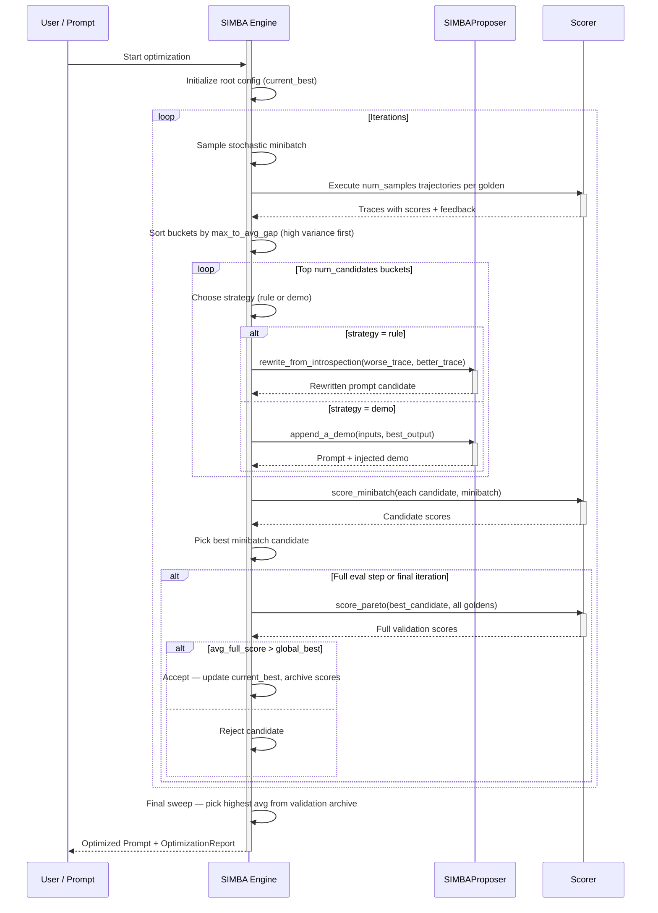
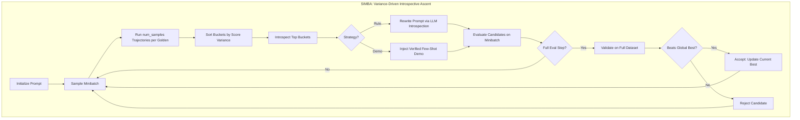

**SIMBA (Stochastic Introspective Mini-Batch Ascent)** is a prompt optimization algorithm within `deepeval` adapted from the DSPy optimizer of the same name. It improves prompts by hunting for high-variance examples—cases where the model sometimes succeeds and sometimes fails on the exact same input—and using that contrast to either rewrite the prompt's instructions or inject a verified few-shot demonstration.

The core insight is that **uncertainty reveals the most about what a prompt is doing wrong**. When a model consistently passes or consistently fails an input, there is little diagnostic signal. But when outcomes vary run-to-run on the same input, the delta between the good and bad execution traces pinpoints exactly what the prompt needs to say differently.

:::info
SIMBA is named for its two defining properties: **Stochastic** (it randomly samples minibatches and selects strategies) and **Introspective** (it uses the LLM to analyze contrasting execution traces and rewrite itself). These two properties together make it particularly effective on complex tasks where simple instruction tweaks are not enough.
:::

## Optimize Prompts With SIMBA

To optimize a prompt using SIMBA, provide a `SIMBA` algorithm instance to the `optimize()` method:

```python
from deepeval.metrics import AnswerRelevancyMetric
from deepeval.prompt import Prompt
from deepeval.optimizer import PromptOptimizer
from deepeval.optimizer.algorithms import SIMBA

prompt = Prompt(text_template="You are a helpful assistant - now answer this. {input}")

def model_callback(prompt: Prompt, golden) -> str:
    prompt_to_llm = prompt.interpolate(input=golden.input)
    return your_llm(prompt_to_llm)

optimizer = PromptOptimizer(
    algorithm=SIMBA(),
    model_callback=model_callback
)

optimized_prompt = optimizer.optimize(prompt=prompt, goldens=goldens, metrics=[AnswerRelevancyMetric()])
```

Done ✅. You just used `SIMBA` to run a prompt optimization.

## Customize SIMBA

You can customize SIMBA's behavior by passing parameters directly to the `SIMBA` constructor:

```python
from deepeval.optimizer.algorithms import SIMBA

simba = SIMBA(
    iterations=8,
    minibatch_size=15,
    num_candidates=4,
    num_samples=3,
    minibatch_full_eval_steps=4,
    random_state=42,
)
```

There are **SIX** optional parameters when creating a `SIMBA` instance:

- [Optional] `iterations`: total number of optimization steps to run. Each step samples a new minibatch, generates candidates, and evaluates them. Defaulted to `8`.
- [Optional] `minibatch_size`: number of goldens sampled per iteration. Larger batches capture more variance signal but cost more. Defaulted to `15`.
- [Optional] `num_candidates`: number of hard examples (top-variance buckets) to introspect and generate a candidate from per iteration. Defaulted to `4`.
- [Optional] `num_samples`: number of independent trajectories to run per golden when measuring variance. More samples = more reliable variance estimates but higher cost. Defaulted to `3`.
- [Optional] `minibatch_full_eval_steps`: run a full-dataset validation every N iterations, and always on the final iteration. Defaulted to `4`.
- [Optional] `random_state`: reproducibility control. You can pass either an `int` seed or a `random.Random` instance. This affects minibatch sampling, strategy selection, and candidate ordering.

## How Does SIMBA Work?



SIMBA runs for a configurable number of `iterations`. Each iteration targets the examples where the model is most uncertain, generates new candidate prompts from that uncertainty, and accepts the best one if it outperforms the current best on the full dataset. Here is the exact high-level flow:

1. **Trajectory Sampling** — Run multiple independent traces per golden and measure score variance
2. **Bucket Sorting** — Rank examples by variability; the most uncertain examples come first
3. **Introspection & Candidate Generation** — For each top-variance example, apply a strategy (rewrite or demo) to produce a new candidate prompt
4. **Minibatch Evaluation** — Score all candidates on the same minibatch and pick the best
5. **Periodic Full Validation** — Every N iterations, validate the best minibatch candidate on the full dataset and accept if it improves
6. **Final Selection** — Return the prompt with the highest average true validation score



### Step 1: Trajectory Sampling

At the start of each iteration, SIMBA draws a random minibatch from your goldens, then runs **`num_samples` independent executions** of the current best prompt on every example in the batch.

Each execution captures:

- The model's actual output
- The composite metric score (averaged across your provided metrics)
- Per-metric reasons explaining why points were lost

These `num_samples` runs form a **bucket** per golden. For each bucket, SIMBA computes:

| Statistic         | Description                                                     |
|-------------------|-----------------------------------------------------------------|
| `max_score`       | The best score across all trajectories for this golden          |
| `min_score`       | The worst score across all trajectories                         |
| `avg_score`       | The mean score across all trajectories                          |
| `max_to_avg_gap`  | `max_score - avg_score` — the primary variance signal           |

### Step 2: Bucket Sorting

Buckets are sorted in **descending order of `max_to_avg_gap`**. This surfaces the examples where the model is most inconsistent — sometimes producing a good answer, sometimes a bad one.

:::tip
Why `max_to_avg_gap` instead of `max_to_min_gap`? The average gap is more robust to a single outlier trajectory. If only one trace happened to score high while all others were poor, the max-to-avg gap correctly reflects that the good outcome was a fluke, not a consistent signal. The DSPy SIMBA paper uses both `max_to_min_gap` and `max_to_avg_gap` as secondary sort keys — SIMBA in deepeval prioritizes `max_to_avg_gap` as the primary signal.
:::

**Example: Bucket ranking with `num_samples=3` and `minibatch_size=4`**

| Golden | Trajectory Scores      | max  | avg  | max_to_avg_gap | Priority |
| ------ | ---------------------- | ---- | ---- | -------------- | -------- |
| G₁     | [1.0, 0.5, 0.5]        | 1.0  | 0.67 | **0.33**       | 🥇 1st   |
| G₂     | [0.8, 0.7, 0.75]       | 0.8  | 0.75 | 0.05           | 🥉 3rd   |
| G₃     | [0.9, 0.3, 0.6]        | 0.9  | 0.6  | **0.30**       | 🥈 2nd   |
| G₄     | [0.2, 0.2, 0.2]        | 0.2  | 0.2  | 0.00           | 4th      |

In this example:

- **G₁** is top priority — the model occasionally gets it fully right (1.0) but usually doesn't (0.5). The prompt is *almost* there for this input; fixing it would be high value.
- **G₃** comes second — high variance between 0.9 and 0.3 shows real inconsistency.
- **G₂** is low priority — the model is consistently good (scores clustered around 0.75). Not much room to learn here.
- **G₄** is lowest priority — the model consistently fails. This is useful long-term, but with no successful trace to learn *from*, it can only feed the deterministic fallback path (see below).

#### Deterministic Fallback

When `max_to_avg_gap == 0` (all trajectories scored identically), SIMBA checks whether the model was already perfect (`max_score >= 0.99`). If so, it skips the bucket. If not, it falls back to using `expected_output` or `expected_outcome` from the golden as a synthetic "perfect" trace to contrast against the model's actual (failing) output. If no ground truth is available, the bucket is skipped entirely.

### Step 3: Introspection & Candidate Generation

For each of the top `num_candidates` buckets, SIMBA randomly picks one of two improvement strategies and applies it to the current best prompt:

#### Strategy 1: Rule (Prompt Rewrite)

SIMBA passes the **worse trace** and **better trace** from the bucket to the `SIMBAProposer`, which calls an LLM to perform a deep introspective rewrite of the entire prompt.

The LLM is shown:

- The original prompt instructions
- The **failing trajectory**: inputs → bad output → score → metric feedback
- The **succeeding trajectory**: inputs → good output → score → metric feedback

It produces a `discussion` field that diagnoses the root cause — identifying the exact delta in logic, formatting, or constraint enforcement that separated the two outcomes — and then a `revised_prompt` that rewrites the prompt from scratch to structurally prevent the failure.

:::info
Unlike simpler approaches that just append a rule at the end, SIMBA's rewrite **holistically restructures** the prompt. The goal is to weave the learned constraint natively into the core instructions rather than tacking on a correction as an afterthought.
:::

#### Strategy 2: Demo (Few-Shot Injection)

SIMBA takes the **best-scoring trajectory** from the bucket and injects it as a formatted few-shot example directly into the prompt:

```
[Example]
Input: <the golden's input>
Output: <the best trajectory's output>
```

This is appended to the system message (for list-format prompts) or to the end of the text template (for text prompts). The injected demo is verified — it comes from a real run that scored highly on your metrics, not from `expected_output`.

#### Strategy Selection

The strategy is chosen **randomly** with equal probability at each bucket. This stochasticity is intentional: it prevents the optimizer from overfitting to one improvement mechanism and ensures both instruction quality and demonstration quality are explored across iterations.

### Step 4: Minibatch Evaluation

After generating up to `num_candidates` new prompt configurations (one per top bucket), SIMBA evaluates all of them on the **same minibatch** that was used for trajectory sampling. Each candidate's average metric score across the minibatch determines the winner of this iteration.

Only the single best-scoring candidate from this step proceeds to full validation.

### Step 5: Periodic Full Validation

Every `minibatch_full_eval_steps` iterations (and always on the final iteration), SIMBA validates the best minibatch candidate against the **full golden dataset**. This true score is stored in the validation archive.

If the full-dataset average beats the current `global_best_score`, the candidate is **accepted** — it becomes the new `current_best` that all future trajectories are sampled from. Otherwise it is rejected.

:::tip
The periodic full evaluation is what separates lucky minibatch wins from genuine prompt improvements. A candidate that scores well on a small sample might just have gotten an easy batch — only a full-dataset score confirms whether the improvement is real.
:::

**Example: Acceptance decisions over 8 iterations with `minibatch_full_eval_steps=4`**

| Iteration | Full Eval? | Full Score | Global Best | Outcome    |
| --------- | ---------- | ---------- | ----------- | ---------- |
| 1         | No         | —          | —           | Buffered   |
| 2         | No         | —          | —           | Buffered   |
| 3         | No         | —          | —           | Buffered   |
| 4         | ✅ Yes     | 0.71       | 0.0 (root)  | ✅ Accepted |
| 5         | No         | —          | 0.71        | Buffered   |
| 6         | No         | —          | 0.71        | Buffered   |
| 7         | No         | —          | 0.71        | Buffered   |
| 8 (final) | ✅ Yes     | 0.68       | 0.71        | ❌ Rejected |

In this example, the iteration 4 candidate is accepted since it beats the root. The iteration 8 candidate is rejected despite a reasonable score because it doesn't improve on the already-accepted result from iteration 4.

### Step 6: Final Selection

After all iterations, SIMBA performs a **final sweep** over the full validation archive (`pareto_score_table`). It picks the configuration with the highest average full-dataset score and returns it as the optimized prompt. If no full evaluation ever ran (e.g., all iterations were skipped), it falls back to the last `current_best` configuration.

## When to Use SIMBA

SIMBA is particularly effective when:

| Scenario                                                           | Why SIMBA Helps                                                       |
|--------------------------------------------------------------------|-----------------------------------------------------------------------|
| **Model is inconsistent on certain inputs**                        | Variance-hunting directly targets the examples causing inconsistency  |
| **Task needs both instruction improvements and few-shot examples** | SIMBA optimizes both simultaneously                                   |
| **You have complex multi-step tasks**                              | Introspective rewrites restructure reasoning paths holistically       |
| **You want fast iteration**                                        | Minibatch-based evaluation keeps per-iteration cost low               |
| **Ground truth labels are available**                              | Enables the deterministic fallback for zero-variance failing examples |

## SIMBA vs. Other Algorithms

| Aspect                     | SIMBA                                      | GEPA                                   | MIPROv2                                       |
|----------------------------|--------------------------------------------|----------------------------------------|-----------------------------------------------|
| **Search strategy**        | Variance-driven introspective ascent       | Pareto-based evolutionary              | Bayesian Optimization (TPE)                   |
| **Feedback signal**        | Score variance across trajectories         | LLM diagnosis of failures/successes    | Minibatch score per (instruction, demo) trial |
| **Optimizes demos?**       | ✅ Yes (demo injection strategy)           | ❌ No                                   | ✅ Yes (bootstrapped demo sets)               |
| **Optimizes instructions?**| ✅ Yes (rule/rewrite strategy)             | ✅ Yes (reflective mutation)            | ✅ Yes (proposal phase)                       |
| **Candidate generation**   | Per-iteration from hard examples           | Per-iteration via reflective rewrite   | All upfront (proposal phase)                  |
| **Best for**               | Inconsistent model behavior, complex tasks | Diverse problem types, multi-objective | Large search spaces, few-shot-heavy tasks     |

Choose **SIMBA** when your model is inconsistent across runs and you want the optimizer to learn from that inconsistency directly.

Choose **GEPA** when your task spans diverse problem types and you need the optimizer to maintain a diverse pool of prompt strategies rather than converging on one.

Choose **MIPROv2** when the combination of instruction and few-shot demonstrations is the main lever, and you want systematic Bayesian search over that joint space.

## FAQs

<FAQs
  qas={[
    {
      question: "What is SIMBA and when should I use it?",
      answer: (
        <>
          <code>SIMBA</code> (Stochastic Introspective Mini-Batch Ascent) hunts
          for high-variance examples—inputs where the model sometimes succeeds
          and sometimes fails—and uses that contrast to rewrite instructions or
          inject a verified few-shot demo. Use it when your model is inconsistent
          across runs or when the task benefits from both instruction
          improvements and demonstrations.
        </>
      ),
    },
    {
      question: "Why does SIMBA run multiple trajectories per golden?",
      answer: (
        <>
          <code>num_samples</code> (default <code>3</code>) sets how many
          independent executions SIMBA runs per golden to measure variance. More
          samples give more reliable variance estimates but cost more. The runs
          form a bucket whose <code>max_to_avg_gap</code> becomes the primary
          signal for picking which examples to learn from.
        </>
      ),
    },
    {
      question: "How does SIMBA pick which examples to learn from?",
      answer: (
        <>
          It sorts buckets in descending order of <code>max_to_avg_gap</code>{" "}
          (<code>max_score - avg_score</code>), surfacing the most inconsistent
          examples first, then introspects the top <code>num_candidates</code>{" "}
          (default <code>4</code>) buckets. The average gap is used instead of
          max-to-min because it is more robust to a single fluke trajectory.
        </>
      ),
    },
    {
      question: "Does SIMBA optimize few-shot demonstrations?",
      answer: (
        <>
          Yes. At each bucket SIMBA randomly chooses between two strategies: a{" "}
          rule strategy that holistically rewrites the prompt from the failing
          and succeeding traces, and a demo strategy that injects the
          best-scoring trajectory as a verified few-shot example. The demo comes
          from a real high-scoring run, not from <code>expected_output</code>.
        </>
      ),
    },
    {
      question: "What happens when all trajectories for a golden score the same?",
      answer: (
        <>
          When <code>max_to_avg_gap == 0</code>, SIMBA checks whether the model
          was already perfect (<code>max_score</code> at least{" "}
          <code>0.99</code>) and skips the
          bucket if so. Otherwise it falls back to using the golden's{" "}
          <code>expected_output</code> or <code>expected_outcome</code> as a
          synthetic perfect trace to contrast against. If no ground truth exists,
          the bucket is skipped.
        </>
      ),
    },
    {
      question: "How often does SIMBA validate candidates on the full dataset?",
      answer: (
        <>
          Every <code>minibatch_full_eval_steps</code> iterations (default{" "}
          <code>4</code>) and always on the final iteration, SIMBA runs{" "}
          <code>score_pareto</code> on the best minibatch candidate against all
          goldens. A candidate is only accepted as the new <code>current_best</code>{" "}
          if its full-dataset average beats the global best, which separates lucky
          minibatch wins from genuine improvements.
        </>
      ),
    },
  ]}
/>