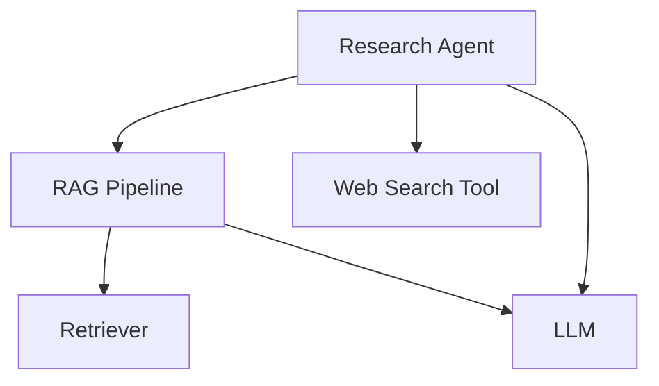
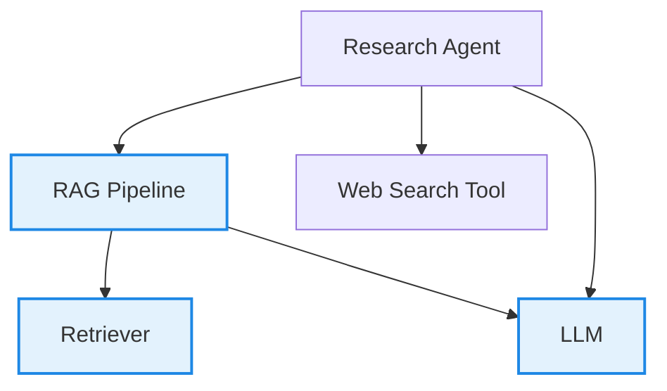
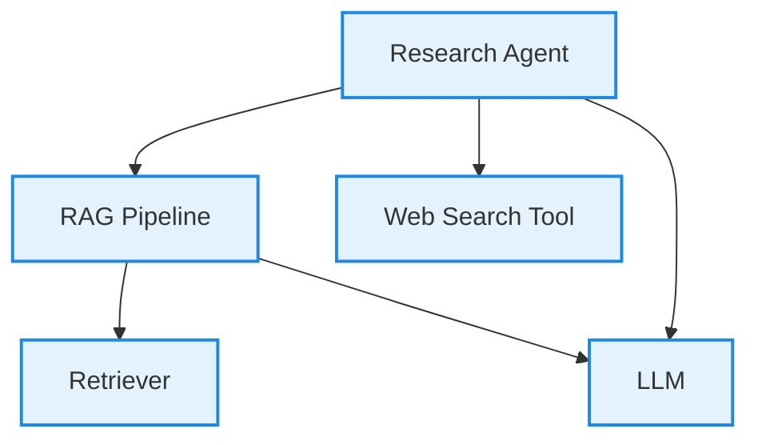

import { ASSETS } from "@site/src/assets";

## Quick Summary

A **single-turn test case** is a blueprint provided by `deepeval` to unit test LLM outputs, and **represents a single, atomic unit of interaction** with your LLM app.

:::caution
Throughout this documentation, you should assume the term 'test case' refers to an `LLMTestCase` instead of `MLLMImage` or `ConversationalTestCase`.
:::

An `LLMTestCase` is the most prominent type of test case in `deepeval`. It has **NINE** parameters:

- `input`
- [Optional] <Term py="actual_output" ts="actualOutput"/>
- [Optional] <Term py="expected_output" ts="expectedOutput"/>
- [Optional] `context`
- [Optional] <Term py="retrieval_context" ts="retrievalContext"/>
- [Optional] <Term py="tools_called" ts="toolsCalled"/>
- [Optional] <Term py="expected_tools" ts="expectedTools"/>
- [Optional] <Term py="token_cost" ts="tokenCost"/>
- [Optional] <Term py="completion_time" ts="completionTime"/>

Here's an example implementation of an `LLMTestCase`:

<Switch>

<Case id="python">

```python title="main.py"
from deepeval.test_case import LLMTestCase, ToolCall

test_case = LLMTestCase(
    input="What if these shoes don't fit?",
    expected_output="You're eligible for a 30 day refund at no extra cost.",
    actual_output="We offer a 30-day full refund at no extra cost.",
    context=["All customers are eligible for a 30 day full refund at no extra cost."],
    retrieval_context=["Only shoes can be refunded."],
    tools_called=[ToolCall(name="WebSearch")]
)
```

</Case>

<Case id="typescript">

```typescript title="main.ts"
import { LLMTestCase, ToolCall } from "deepeval/test-case";

const testCase = new LLMTestCase({
  input: "What if these shoes don't fit?",
  expectedOutput: "You're eligible for a 30 day refund at no extra cost.",
  actualOutput: "We offer a 30-day full refund at no extra cost.",
  context: ["All customers are eligible for a 30 day full refund at no extra cost."],
  retrievalContext: ["Only shoes can be refunded."],
  toolsCalled: [new ToolCall({ name: "WebSearch" })],
});
```

</Case>

</Switch>

:::info
Since `deepeval` is an LLM evaluation framework, the **`input` and <Term py="actual_output" ts="actualOutput"/> are always mandatory.** However, this does not mean they are necessarily used for evaluation, and you can also add additional parameters such as the <Term py="tools_called" ts="toolsCalled"/> for each `LLMTestCase`.

<video width="100%" autoPlay loop muted playsInline>
  <source
    src={ASSETS.testCaseToolsCalled}
    type="video/mp4"
  />
</video>

To get your own sharable testing report with `deepeval`, [sign up to Confident AI](https://app.confident-ai.com), or run `deepeval login` in the CLI:

```bash
deepeval login
```

:::

## What Is An LLM "Interaction"?

An **LLM interaction** is any **discrete exchange** of information between **components of your LLM system** — from a full user request to a single internal step. The scope of interaction is arbitrary and is entirely up to you.

:::note
Since an `LLMTestCase` represents a single, atomic unit of interaction in your LLM app, it is important to understand what this means.
:::

Let’s take this LLM system as an example:

<div style={{textAlign: 'center', margin: "2rem 0"}}>



</div>

There are different ways you scope an interaction:

- **Agent-Level:** The entire process initiated by the agent, including the RAG pipeline and web search tool usage

- **RAG Pipeline:** Just the RAG flow — retriever + LLM
  - **Retriever:** Only test whether relevant documents are being retrieved
  - **LLM:** Focus purely on how well the LLM generates text from the input/context

An interaction is where you want to define your `LLMTestCase`. For example, when using RAG-specific metrics like `AnswerRelevancyMetric`, `FaithfulnessMetric`, or `ContextualRelevancyMetric`, the interaction is best scoped at the RAG pipeline level.

In this case:

- `input` should be the user question or text to embed

- <Term py="retrieval_context" ts="retrievalContext"/> should be the retrieved documents from the retriever

- <Term py="actual_output" ts="actualOutput"/> should be the final response generated by the LLM

<div style={{textAlign: 'center', margin: "2rem 0"}}>



</div>

If you would want to evaluate using the `ToolCorrectnessMetric` however, you'll need to create an `LLMTestCase` at the **Agent-Level**, and supply the <Term py="tools_called" ts="toolsCalled"/> parameter instead:

<div style={{textAlign: 'center', margin: "2rem 0"}}>



</div>

We'll go through the requirements for an `LLMTestCase` before showing how to create an `LLMTestCase` for an interaction.

:::tip
For users starting out, scoping the interaction as the overall LLM application will be the easiest way to run evals.
:::

## LLM Test Case

An `LLMTestCase` in `deepeval` can be used to unit test interactions within your LLM application (which can just be an LLM itself), which includes use cases such as RAG and LLM agents (for individual components, agents within agents, or the agent altogether). It contains the necessary information (<Term py="tools_called" ts="toolsCalled"/> for agents, <Term py="retrieval_context" ts="retrievalContext"/> for RAG, etc.) to evaluate your LLM application for a given `input`.

<ImageDisplayer src={ASSETS.llmTestCase} alt="LLM Test Case" />

An `LLMTestCase` is used for both end-to-end and component-level evaluation:

- [End-to-end:](/docs/evaluation-end-to-end-llm-evals) An `LLMTestCase` represents the inputs and outputs of your "black-box" LLM application

- [Component-level:](/docs/evaluation-component-level-llm-evals) Many `LLMTestCase`s represents many interactions in different components

**Different metrics will require a different combination of `LLMTestCase` parameters, but they all require an `input` and <Term py="actual_output" ts="actualOutput"/>** - regardless of whether they are used for evaluation or not. For example, you won't need <Term py="expected_output" ts="expectedOutput"/>, `context`, <Term py="tools_called" ts="toolsCalled"/>, and <Term py="expected_tools" ts="expectedTools"/> if you're just measuring answer relevancy, but if you're evaluating hallucination you'll have to provide `context` in order for `deepeval` to know what the **ground truth** is.

With the exception of conversational metrics, which are metrics to evaluate conversations instead of individual LLM responses, you can use any LLM evaluation metric `deepeval` offers to evaluate an `LLMTestCase`.

:::note
You cannot use conversational metrics to evaluate an `LLMTestCase`. Conveniently, most metrics in `deepeval` are non-conversational.
:::

Keep reading to learn which parameters in an `LLMTestCase` are required to evaluate different aspects of an LLM applications - ranging from pure LLMs, RAG pipelines, and even LLM agents.

### Input

The `input` mimics a user interacting with your LLM application. The `input` can contain just text or text with images as well, it is the direct input to your prompt template, and so **SHOULD NOT CONTAIN** your prompt template.

<Switch>

<Case id="python">

```python
from deepeval.test_case import LLMTestCase

test_case = LLMTestCase(
    input="Why did the chicken cross the road?",
    # Replace this with your actual LLM application
    actual_output="Quite frankly, I don't want to know..."
)
```

</Case>

<Case id="typescript">

```typescript
import { LLMTestCase } from "deepeval/test-case";

const testCase = new LLMTestCase({
  input: "Why did the chicken cross the road?",
  // Replace this with your actual LLM application
  actualOutput: "Quite frankly, I don't want to know...",
});
```

</Case>

</Switch>

:::tip

Not all `input`s should include your prompt template, as this is determined by the metric you're using. Furthermore, the `input` should **NEVER** be a json version of the list of messages you are passing into your LLM.

If you're logged into Confident AI, you can associate hyperparameters such as prompt templates with each test run to easily figure out which prompt template gives the best <Term py="actual_output" ts="actualOutput"/>s for a given `input`:

```bash
deepeval login
```

```python title="test_file.py"
import deepeval

from deepeval.metrics import AnswerRelevancyMetric
from deepeval.test_case import LLMTestCase
from deepeval import assert_test

def test_llm():
    test_case = LLMTestCase(input="...", actual_output="...")
    answer_relevancy_metric = AnswerRelevancyMetric()
    assert_test(test_case, [answer_relevancy_metric])

# You should aim to make these values dynamic
@deepeval.log_hyperparameters(model="gpt-4.1", prompt_template="...")
def hyperparameters():
    # You can also return an empty dict {} if there's no additional parameters to log
    return {
        "temperature": 1,
        "chunk size": 500
    }
```

```bash
deepeval test run test_file.py
```

:::

### Actual Output

The <Term py="actual_output" ts="actualOutput"/> is an **optional** parameter and represents what your LLM app outputs for a given input. Typically, you would import your LLM application (or parts of it) into your test file, and invoke it at runtime to get the actual output. The <Term py="actual_output" ts="actualOutput"/> can be text or image or both as well depending on what your LLM application outputs.

<Switch>

<Case id="python">

```python
# A hypothetical LLM application example
import chatbot

input = "Why did the chicken cross the road?"

test_case = LLMTestCase(
    input=input,
    actual_output=chatbot.run(input)
)
```

</Case>

<Case id="typescript">

```typescript
// A hypothetical LLM application example
import chatbot from "./chatbot";

const input = "Why did the chicken cross the road?";

const testCase = new LLMTestCase({
  input,
  actualOutput: await chatbot.run(input),
});
```

</Case>

</Switch>

The <Term py="actual_output" ts="actualOutput"/> is an optional parameter because some systems (such as RAG retrievers) does not require an LLM output to be evaluated.

:::note
You may also choose to evaluate with precomputed <Term py="actual_output" ts="actualOutput"/>s, instead of generating <Term py="actual_output" ts="actualOutput"/>s at evaluation time.
:::

### Expected Output

The <Term py="expected_output" ts="expectedOutput"/> is an **optional** parameter and represents you would want the ideal output to be. Note that this parameter is **optional** depending on the metric you want to evaluate.

The expected output doesn't have to exactly match the actual output in order for your test case to pass since `deepeval` uses a variety of methods to evaluate non-deterministic LLM outputs. We'll go into more details [in the metrics section.](/docs/metrics-introduction)

<Switch>

<Case id="python">

```python
# A hypothetical LLM application example
import chatbot

input = "Why did the chicken cross the road?"

test_case = LLMTestCase(
    input=input,
    actual_output=chatbot.run(input),
    expected_output="To get to the other side!"
)
```

</Case>

<Case id="typescript">

```typescript
// A hypothetical LLM application example
import chatbot from "./chatbot";

const input = "Why did the chicken cross the road?";

const testCase = new LLMTestCase({
  input,
  actualOutput: await chatbot.run(input),
  expectedOutput: "To get to the other side!",
});
```

</Case>

</Switch>

### Context

The `context` is an **optional** parameter that represents additional data received by your LLM application as supplementary sources of golden truth. You can view it as the ideal segment of your knowledge base relevant as support information to a specific input. Context is **static** and should not be generated dynamically.

Unlike other parameters, a context accepts a list of strings.

<Switch>

<Case id="python">

```python
# A hypothetical LLM application example
import chatbot

input = "Why did the chicken cross the road?"

test_case = LLMTestCase(
    input=input,
    actual_output=chatbot.run(input),
    expected_output="To get to the other side!",
    context=["The chicken wanted to cross the road."]
)
```

</Case>

<Case id="typescript">

```typescript
// A hypothetical LLM application example
import chatbot from "./chatbot";

const input = "Why did the chicken cross the road?";

const testCase = new LLMTestCase({
  input,
  actualOutput: await chatbot.run(input),
  expectedOutput: "To get to the other side!",
  context: ["The chicken wanted to cross the road."],
});
```

</Case>

</Switch>

:::note
Often times people confuse <Term py="expected_output" ts="expectedOutput"/> with `context` since due to their similar level of factual accuracy. However, while both are (or should be) factually correct, <Term py="expected_output" ts="expectedOutput"/> also takes aspects like tone and linguistic patterns into account, whereas context is strictly factual.
:::

### Retrieval Context

The <Term py="retrieval_context" ts="retrievalContext"/> is an **optional** parameter that represents your RAG pipeline's retrieval results at runtime. By providing <Term py="retrieval_context" ts="retrievalContext"/>, you can determine how well your retriever is performing using `context` as a benchmark.

:::note
The <Term py="retrieval_context" ts="retrievalContext"/> parameter accepts a list of strings or `RetrievedContextData` objects.
:::

```python
class RetrievedContextData(BaseModel):
    context: str
    source: str
```

<Switch>

<Case id="python">

```python
# A hypothetical LLM application example
import chatbot

input = "Why did the chicken cross the road?"

test_case = LLMTestCase(
    input=input,
    actual_output=chatbot.run(input),
    expected_output="To get to the other side!",
    context=["The chicken wanted to cross the road."],
    retrieval_context=["The chicken liked the other side of the road better"]
)
```

</Case>

<Case id="typescript">

```typescript
// A hypothetical LLM application example
import chatbot from "./chatbot";

const input = "Why did the chicken cross the road?";

const testCase = new LLMTestCase({
  input,
  actualOutput: await chatbot.run(input),
  expectedOutput: "To get to the other side!",
  context: ["The chicken wanted to cross the road."],
  retrievalContext: ["The chicken liked the other side of the road better"],
});
```

</Case>

</Switch>

:::note
Remember, `context` is the ideal retrieval results for a given input and typically come from your evaluation dataset, whereas <Term py="retrieval_context" ts="retrievalContext"/> is your LLM application's actual retrieval results. So, while they might look similar at times, they are not the same.
:::

### Tools Called

The <Term py="tools_called" ts="toolsCalled"/> parameter is an **optional** parameter that represents the tools your LLM agent actually invoked during execution. By providing <Term py="tools_called" ts="toolsCalled"/>, you can evaluate how effectively your LLM agent utilized the tools available to it.

:::note
The <Term py="tools_called" ts="toolsCalled"/> parameter accepts a list of `ToolCall` objects.
:::

```python
class ToolCall(BaseModel):
    name: str
    description: Optional[str] = None
    reasoning: Optional[str] = None
    output: Optional[Any] = None
    input_parameters: Optional[Dict[str, Any]] = None
```

A `ToolCall` object accepts 1 mandatory and 4 optional parameters:

- `name`: a string representing the **name** of the tool.
- [Optional] `description`: a string describing the **tool's purpose**.
- [Optional] `reasoning`: A string explaining the **agent's reasoning** to use the tool.
- [Optional] `output`: The tool's **output**, which can be of any data type.
- [Optional] <Term py="input_parameters" ts="inputParameters"/>: A dictionary with string keys representing the **input parameters** (and respective values) passed into the tool function.

<Switch>

<Case id="python">

```python
# A hypothetical LLM application example
import chatbot

test_case = LLMTestCase(
    input="Why did the chicken cross the road?",
    actual_output=chatbot.run(input),
    # Replace this with the tools that were actually used
    tools_called=[
        ToolCall(
            name="Calculator Tool",
            description="A tool that calculates mathematical equations or expressions.",
            input={"user_input": "2+3"},
            output=5
        ),
        ToolCall(
            name="WebSearch Tool",
            reasoning="Knowledge base does not detail why the chicken crossed the road.",
            input={"search_query": "Why did the chicken crossed the road?"},
            output="Because it wanted to, duh."
        )
    ]
)
```

</Case>

<Case id="typescript">

```typescript
// A hypothetical LLM application example
import chatbot from "./chatbot";

const input = "Why did the chicken cross the road?";

const testCase = new LLMTestCase({
  input,
  actualOutput: await chatbot.run(input),
  // Replace this with the tools that were actually used
  toolsCalled: [
    new ToolCall({
      name: "Calculator Tool",
      description: "A tool that calculates mathematical equations or expressions.",
      inputParameters: { user_input: "2+3" },
      output: 5,
    }),
    new ToolCall({
      name: "WebSearch Tool",
      reasoning: "Knowledge base does not detail why the chicken crossed the road.",
      inputParameters: { search_query: "Why did the chicken crossed the road?" },
      output: "Because it wanted to, duh.",
    }),
  ],
});
```

</Case>

</Switch>

:::info
<Term py="tools_called" ts="toolsCalled"/> and <Term py="expected_tools" ts="expectedTools"/> are LLM test case parameters that are utilized only in **agentic evaluation metrics**. These parameters allow you to assess the [tool usage correctness](/docs/metrics-tool-correctness) of your LLM application and ensure that it meets the expected tool usage standards.
:::

### Expected Tools

The <Term py="expected_tools" ts="expectedTools"/> parameter is an **optional** parameter that represents the tools that ideally should have been used to generate the output. By providing <Term py="expected_tools" ts="expectedTools"/>, you can assess whether your LLM application used the tools you anticipated for optimal performance.

<Switch>

<Case id="python">

```python
# A hypothetical LLM application example
import chatbot

input = "Why did the chicken cross the road?"

test_case = LLMTestCase(
    input=input,
    actual_output=chatbot.run(input),
    # Replace this with the tools that were actually used
    tools_called=[
        ToolCall(
            name="Calculator Tool",
            description="A tool that calculates mathematical equations or expressions.",
            input={"user_input": "2+3"},
            output=5
        ),
        ToolCall(
            name="WebSearch Tool",
            reasoning="Knowledge base does not detail why the chicken crossed the road.",
            input={"search_query": "Why did the chicken crossed the road?"},
            output="Because it wanted to, duh."
        )
    ]
    expected_tools=[
        ToolCall(
            name="WebSearch Tool",
            reasoning="Knowledge base does not detail why the chicken crossed the road.",
            input={"search_query": "Why did the chicken crossed the road?"},
            output="Because it needed to escape from the hungry humans."
        )
    ]
)
```

</Case>

<Case id="typescript">

```typescript
// A hypothetical LLM application example
import chatbot from "./chatbot";

const input = "Why did the chicken cross the road?";

const testCase = new LLMTestCase({
  input,
  actualOutput: await chatbot.run(input),
  // Replace this with the tools that were actually used
  toolsCalled: [
    new ToolCall({
      name: "Calculator Tool",
      description: "A tool that calculates mathematical equations or expressions.",
      inputParameters: { user_input: "2+3" },
      output: 5,
    }),
    new ToolCall({
      name: "WebSearch Tool",
      reasoning: "Knowledge base does not detail why the chicken crossed the road.",
      inputParameters: { search_query: "Why did the chicken crossed the road?" },
      output: "Because it wanted to, duh.",
    }),
  ],
  expectedTools: [
    new ToolCall({
      name: "WebSearch Tool",
      reasoning: "Knowledge base does not detail why the chicken crossed the road.",
      inputParameters: { search_query: "Why did the chicken crossed the road?" },
      output: "Because it needed to escape from the hungry humans.",
    }),
  ],
});
```

</Case>

</Switch>

### Token cost

The <Term py="token_cost" ts="tokenCost"/> is an **optional** parameter and is of type float that allows you to log the cost of a particular LLM interaction for a particular `LLMTestCase`. No metrics use this parameter by default, and it is most useful for either:

1. Building custom metrics that relies on <Term py="token_cost" ts="tokenCost"/>
2. Logging <Term py="token_cost" ts="tokenCost"/> on Confident AI

<Switch>

<Case id="python">

```python
from deepeval.test_case import LLMTestCase

test_case = LLMTestCase(token_cost=1.32, ...)
```

</Case>

<Case id="typescript">

```typescript
import { LLMTestCase } from "deepeval/test-case";

const testCase = new LLMTestCase({ input: "...", actualOutput: "...", tokenCost: 1.32 });
```

</Case>

</Switch>

### Completion Time

The <Term py="completion_time" ts="completionTime"/> is an **optional** parameter and is similar to the <Term py="token_cost" ts="tokenCost"/> is of type float that allows you to log the time in **SECONDS** it took for a LLM interaction for a particular `LLMTestCase` to complete. No metrics use this parameter by default, and it is most useful for either:

1. Building custom metrics that relies on <Term py="completion_time" ts="completionTime"/>
2. Logging <Term py="completion_time" ts="completionTime"/> on Confident AI

<Switch>

<Case id="python">

```python
from deepeval.test_case import LLMTestCase

test_case = LLMTestCase(completion_time=7.53, ...)
```

</Case>

<Case id="typescript">

```typescript
import { LLMTestCase } from "deepeval/test-case";

const testCase = new LLMTestCase({ input: "...", actualOutput: "...", completionTime: 7.53 });
```

</Case>

</Switch>

## Including Images

By default `deepeval` supports passing both text and images inside your test cases using the `MLLMImage` object. The `MLLMImage` class in `deepeval` is used to reference multimodal images in your test cases. It allows you to create test cases using local images, remote URLs and `base64` data.

<Switch>

<Case id="python">

```python
from deepeval.test_case import LLMTestCase, MLLMImage

shoes = MLLMImage(url='./shoes.png', local=True)
blue_shoes = MLLMImage(url='https://shoe-images.com/edited-shoes', local=False)

test_case = LLMTestCase(
    input=f"Change the color of these shoes to blue: {shoes}",
    expected_output=f"Here's the blue shoes you asked for: {expected_shoes}"
    retrieval_context=[f"Some reference shoes: {MLLMImage(...)}"]
)
```

</Case>

<Case id="typescript">

```typescript
import { LLMTestCase, MLLMImage } from "deepeval/test-case";

const shoes = new MLLMImage({ url: "./shoes.png", local: true });
const blueShoes = new MLLMImage({ url: "https://shoe-images.com/edited-shoes", local: false });

const testCase = new LLMTestCase({
  input: `Change the color of these shoes to blue: ${shoes}`,
  actualOutput: `Here's the blue shoes you asked for: ${blueShoes}`,
  expectedOutput: `Here's the blue shoes you asked for: ${blueShoes}`,
  retrievalContext: [`Some reference shoes: ${new MLLMImage({ url: "./reference-shoes.png", local: true })}`],
});
```

</Case>

</Switch>

:::info
Multimodal test cases are automatically detected when you include `MLLMImage` objects in your inputs or outputs. You can use them with various multimodal supported metrics like the [RAG metrics](/docs/metrics-answer-relevancy) and [multimodal-specific metrics](/docs/multimodal-metrics-image-coherence).
:::

### `MLLMImage` Data Model

Here's the data model of the `MLLMImage` in `deepeval`:

```python
class MLLMImage:
    dataBase64: Optional[str] = None
    mimeType: Optional[str] = None
    url: Optional[str] = None
    local: Optional[bool] = None
    filename: Optional[str] = None
```

You **MUST** either provide `url` or `dataBase64` and `mimeType` parameters when initializing an `MLLMImage`. The `local` attribute should be set to <Term py="True" ts="true"/> for locally stored images and <Term py="False" ts="false"/> for images hosted online (default is <Term py="False" ts="false"/>).

:::note

All the `MLLMImage` instances are converted to a special `deepeval` slug, (e.g `[DEEPEVAL:IMAGE:uuid]`). This is how your `MLLMImage`s look like in your test cases after you embed them in f-strings:

<Switch>

<Case id="python">

```python
from deepeval.test_case import LLMTestCase, MLLMImage

shoes = MLLMImage(url='./shoes.png', local=True)

test_case = LLMTestCase(
    input=f"Change the color of these shoes to blue: {shoes}",
    expected_output=f"..."
)

print(test_case.input)
```

</Case>

<Case id="typescript">

```typescript
import { LLMTestCase, MLLMImage } from "deepeval/test-case";

const shoes = new MLLMImage({ url: "./shoes.png", local: true });

const testCase = new LLMTestCase({
  input: `Change the color of these shoes to blue: ${shoes}`,
  actualOutput: `...`,
  expectedOutput: `...`,
});

console.log(testCase.input);
```

</Case>

</Switch>

This outputs the following:

```
Change the color of these shoes to blue: [DEEPEVAL:IMAGE:awefv234fvbnhg456]
```

Users who'd like to access their images themselves for any ETL can use the <Term py="convert_to_multi_modal_array" ts="convertToMultiModalArray"/> method to convert your test cases to a list of strings and `MLLMImage` in order. Here's how to use it:

```python
from deepeval.utils import convert_to_multi_modal_array
from deepeval.test_case import LLMTestCase, MLLMImage

shoes = MLLMImage(url='./shoes.png', local=True)

test_case = LLMTestCase(
    input=f"Change the color of these shoes to blue: {shoes}",
    expected_output=f"..."
)

print(convert_to_multi_modal_array(test_case.input))
```

This will output the following:

```
["Change the color of these shoes to blue:",  [DEEPEVAL:IMAGE:awefv234fvbnhg456]]
```

The `[DEEPEVAL:IMAGE:awefv234fvbnhg456]` here is actually the instance of `MLLMImage` you passed inside your test case.

:::

## Mark Test Cases As Flaky

The `flaky` is an **optional** parameter of type boolean (defaulted to <Term py="False" ts="false"/>) that marks an `LLMTestCase` as flaky. A flaky test case's results are still computed, recorded, and reported as normal, but its failures won't block your CI/CD pipeline — when a flaky test case fails, <Switch><Case id="python">`assert_test()` prints a warning instead of raising an `AssertionError`.</Case><Case id="typescript">`expect(testCase).toPass()` prints a warning instead of failing the test.</Case></Switch>

<Switch>

<Case id="python">

```python
from deepeval.test_case import LLMTestCase

test_case = LLMTestCase(flaky=True, ...)
```

</Case>

<Case id="typescript">

```typescript
import { LLMTestCase } from "deepeval/test-case";

const testCase = new LLMTestCase({ input: "...", actualOutput: "...", flaky: true });
```

</Case>

</Switch>

This is most useful for test cases you know are noisy — for example ones with borderline scores that flip between passing and failing across runs — that you still want to keep evaluating and tracking without letting them gate deployments. The `flaky` status is also logged on Confident AI so you can monitor how often flaky test cases actually fail.

:::info
Metrics can also be marked as flaky. A flaky **metric's** failure never decides its test case's pass/fail status, which is why every evaluation requires at least one non-flaky metric with a `threshold`.
:::

## Label Test Cases For Confident AI

If you're using Confident AI, these are some additional parameters to help manage your test cases.

### Name

The optional `name` parameter allows you to provide a string identifier to label `LLMTestCase`s and `ConversationalTestCase`s for you to easily search and filter for on Confident AI. This is particularly useful if you're importing test cases from an external datasource.

<Switch>

<Case id="python">

```python
from deepeval.test_case import LLMTestCase

test_case = LLMTestCase(name="my-external-unique-id", ...)
```

</Case>

<Case id="typescript">

```typescript
import { LLMTestCase } from "deepeval/test-case";

const testCase = new LLMTestCase({ input: "...", actualOutput: "...", name: "my-external-unique-id" });
```

</Case>

</Switch>

### Tags

Alternatively, you can also tag test cases for filtering and searching on Confident AI:

```python
from deepeval.test_case import LLMTestCase

test_case = LLMTestCase(tags=["Topic 1", "Topic 3"], ...)
```

## Using Test Cases For Evals

You can create test cases for three types of evaluation:

- [End-to-end](/docs/evaluation-end-to-end-llm-evals) - Treats your LLM app as a black-box, and evaluates the overall system inputs and outputs. Your test case lives at the **system level** and covers the entire application
- [Component-level](/docs/evaluation-component-level-llm-evals) - Evaluates individual components within your LLM system using the `@observe` decorator. Your test case lives at the **component level** and focuses on specific parts of your system
- One-Off Standalone - Executes individual metrics on single test cases for debugging or custom evaluation pipelines

Click on each of the links to learn how to use test cases for evals.

## FAQs

<FAQs
  qas={[
    {
      question: "Which `LLMTestCase` parameters are required?",
      answer: (
        <>
          Only <code>input</code> and <Term py="actual_output" ts="actualOutput"/>{" "}
          are always mandatory. Every other parameter —{" "}
          <Term py="expected_output" ts="expectedOutput"/>, <code>context</code>,{" "}
          <Term py="retrieval_context" ts="retrievalContext"/>,{" "}
          <Term py="tools_called" ts="toolsCalled"/>, and so on — is optional and
          only needed by the specific metrics you're running.
        </>
      ),
    },
    {
      question: "What's the difference between context and retrieval context?",
      answer: (
        <>
          <code>context</code> is the ideal, static ground truth for an input
          (usually from your dataset), while{" "}
          <Term py="retrieval_context" ts="retrievalContext"/> is what your RAG
          pipeline actually retrieved at runtime. Comparing the two is how you
          measure retriever quality.
        </>
      ),
    },
    {
      question: "When should I use a single-turn test case vs a multi-turn one?",
      answer: (
        <>
          Use an <code>LLMTestCase</code> for a single, atomic interaction (one
          request and response). Use a{" "}
          <a href="/docs/evaluation-multiturn-test-cases">
            <code>ConversationalTestCase</code>
          </a>{" "}
          when you need to evaluate a back-and-forth conversation across
          multiple turns.
        </>
      ),
    },
    {
      question: "Can I evaluate precomputed outputs instead of generating them live?",
      answer: (
        <>
          Yes. You can populate <Term py="actual_output" ts="actualOutput"/> (and{" "}
          <Term py="retrieval_context" ts="retrievalContext"/>,{" "}
          <Term py="tools_called" ts="toolsCalled"/>, etc.) ahead of time and
          evaluate them later, or generate them dynamically at evaluation time
          by invoking your app inside your test file.
        </>
      ),
    },
    {
      question: "Can a test case include images?",
      answer: (
        <>
          Yes. Embed <code>MLLMImage</code> objects (local files, remote URLs,
          or base64) into the <code>input</code> or{" "}
          <Term py="actual_output" ts="actualOutput"/> and <code>deepeval</code>{" "}
          automatically treats it as a multimodal test case for
          multimodal-supported metrics.
        </>
      ),
    },
    {
      question:
        "How do I organize and search test cases across a team or keep them on the cloud?",
      answer: (
        <>
          Locally you can label test cases with <code>name</code> and{" "}
          <code>tags</code> for filtering. If your team wants a shared,
          cloud-hosted view, those same labels carry over to{" "}
          <a href="https://www.confident-ai.com">Confident AI</a>, where you can
          search, filter, and visualize test cases and their results in a UI —
          useful when importing from external data sources or collaborating
          across a team. It's optional and your test cases run identically
          without it.
        </>
      ),
    },
  ]}
/>
