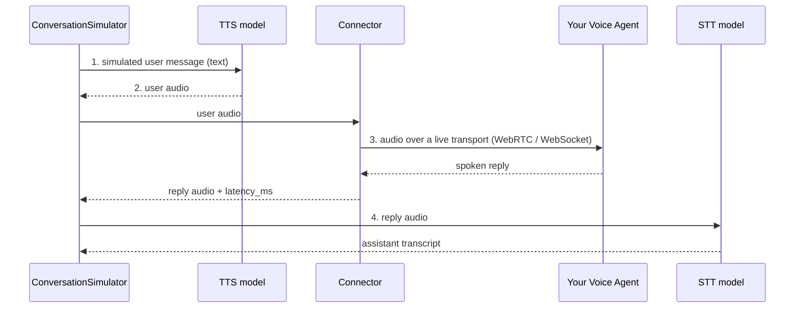
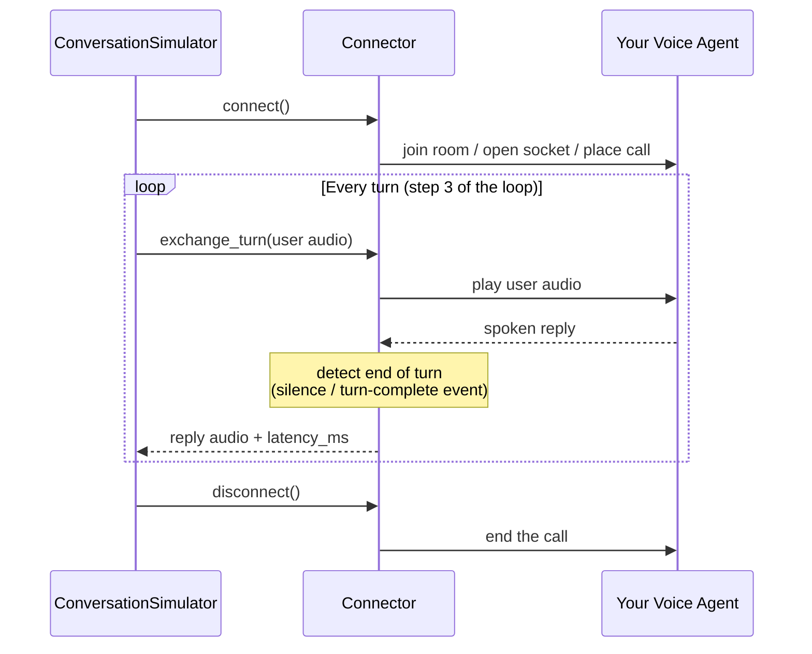

**Voice agents** are conversational AI systems you talk to instead of type at — phone support lines, restaurant booking bots, in-app voice assistants. Evaluating them means evaluating a _spoken_ conversation, which has strictly more to it than a text one:

- **What was said** — the transcript, which regular multi-turn metrics like `TurnRelevancyMetric` can judge.
- **How it sounded** — the actual audio on both sides of the call.
- **When it happened** — response latency and turn-taking behavior.

`deepeval` treats voice as a first-class modality, and it changes **how conversations are produced, not how they are evaluated**: the pipeline you already know — goldens in, test cases out, metrics on top — is untouched. A simulated voice conversation produces a standard `ConversationalTestCase` whose `Turn`s carry audio and timing alongside the transcript, so your existing LLM-as-a-judge metrics keep working while the audio and timing data is preserved for voice-specific analysis.

Three pieces make that possible: a TTS model speaks for the simulated caller, an STT model transcribes the agent's replies, and a connector bridges `deepeval` to your deployed voice agent. This page explains how those pieces fit together, how voice data appears on test cases, and how turn-taking changes when interruptions are enabled. To actually run voice simulations, see [Voice Mode](/docs/conversation-simulator-voice-mode) on the `ConversationSimulator`.

## Why Voice Is Different

A text chatbot is a function: you call it with a message and it returns one. A deployed voice agent is a **live call**: audio streams in both directions over a real transport, the agent runs its own speech recognition and speech synthesis internally, and "when a turn ends" is a judgment call based on silence and timing rather than a return statement.

This has two consequences for evaluation:

1. **You need speech models of your own.** To simulate a user, `deepeval` must _speak_ messages to your agent (text-to-speech) and _listen_ to its replies (speech-to-text). These sit outside your agent — they are the simulated caller's mouth and ears.
2. **You need a bridge to your agent.** There is no universal API for "send this audio to my agent"; agents are reachable over different protocols depending on where they're deployed. A `deepeval` connector opens that live session and carries audio between the simulator and your agent.

## How Voice Evals Work

Evaluating a voice agent follows the same loop as evaluating a text chatbot — a simulated user talks to your application until the conversation ends, and the result is scored. The voice version inserts two speech steps into that loop and swaps the function call for a live connection:

1. **Generate a user message.** The simulator model role-plays the user from the [`ConversationalGolden`](/docs/evaluation-datasets)'s `scenario` and [`persona`](/docs/conversation-simulator-voice-personas) — exactly as in a text simulation.
2. **Speak it** _(voice only)_. The TTS model synthesizes the message into audio: this is the simulated caller's voice.
3. **Play it to your agent and record the reply** _(voice only)_. The connector streams the audio over the live transport, waits for your agent to finish speaking, and captures the reply audio along with `latency_ms`.
4. **Transcribe the reply** _(voice only)_. The STT model turns the agent's audio into the assistant turn's `content`.
5. **Decide whether to continue.** [Stopping logic](/docs/conversation-simulator-stopping-logic) checks the conversation against the golden's `expected_outcome` — exactly as in text.
6. **Score the conversation.** The finished `ConversationalTestCase` — transcript plus audio and timing — is evaluated with the same [multi-turn metrics](/docs/metrics-introduction) you'd use on a text conversation.



:::info
Step 4 is skipped when the platform already provides a transcript: some connectors (like ElevenLabs) receive the agent's own transcript alongside its audio, and `deepeval` uses it directly.
:::

:::warning
Steps 2–4 are where the pipeline can distort what you measure. Know the trade-offs:

- **Half-duplex by default (no interruptions; each side takes a turn)** — the simulated user finishes speaking and waits for the agent, so barge-in isn't exercised. See [Interruptions](#interruptions) for the duplex model.
- **An idealized caller by default** — TTS speech is clean and studio-quality: no background noise, muffled mics, or hesitations. A [persona](/docs/conversation-simulator-voice-personas) can add ambient noise and a different voice, but passing still proves conversational competence more than audio robustness.
- **STT errors look like agent errors** — transcription accuracy is the ceiling on evaluation accuracy, so the STT model is the most quality-critical choice in the pipeline.
- **End-of-turn is a heuristic** — silence thresholds can clip long pauses and pad `latency_ms`, which is why latencies only compare within a protocol.
  :::

## Voice Metrics

Voice metrics follow the same three-part model as the test case:

- **What was said** remains the responsibility of existing conversational metrics such as [`TurnRelevancyMetric`](/docs/metrics-turn-relevancy), [`GoalAccuracyMetric`](/docs/metrics-goal-accuracy), and [`ToolUseMetric`](/docs/metrics-tool-use).
- **How it sounded** is evaluated by [`VoiceNaturalnessMetric`](/docs/metrics-voice-naturalness), [`SpeechIntelligibilityMetric`](/docs/metrics-speech-intelligibility), [`VoiceConsistencyMetric`](/docs/metrics-voice-consistency), and [`AudioIntegrityMetric`](/docs/metrics-audio-integrity).
- **When it happened** is evaluated by [`TurnTakingNaturalnessMetric`](/docs/metrics-turn-taking-naturalness) and [`AgentResponsivenessMetric`](/docs/metrics-agent-responsiveness).

[`VoiceReliabilityMetric`](/docs/metrics-voice-reliability) is the optional operational summary. It combines the responsiveness and audio-integrity checks, but a critical failure such as missing agent audio or a complete failure to respond always forces its score to zero. Minor checks cannot average away a catastrophic failure.

All seven voice metrics return a score from 0 to 1, where higher is better. Measurements such as latency, loudness, clipping rate, pause duration, and speaking rate appear in metric reasons and breakdowns as diagnostic evidence. They are not universal quality scores: whether a pause or response delay sounds natural depends on what was happening in the conversation.

The metrics use different parts of the same `ConversationalTestCase`:

- `VoiceNaturalnessMetric`, `SpeechIntelligibilityMetric`, and `AudioIntegrityMetric` analyze each assistant `Turn.audio`.
- `VoiceConsistencyMetric` compares assistant audio across multiple turns.
- `TurnTakingNaturalnessMetric` reconstructs the call timeline from each `Turn.audio.start_time` and `Audio.duration`, using `Turn.role` to identify the speaker.
- `AgentResponsivenessMetric` examines the ordered transcript and audio turns for missing responses and reprompts.

An audio clip without `start_time` can still be evaluated for how it sounded. It cannot be used to infer silence or overlap honestly, so timing metrics skip test cases whose audio has no call-relative placement.

## Speech Models

Text-to-speech (TTS) and speech-to-text (STT) are separate model families from LLMs, with largely separate providers. Because they are genuinely different model types, `deepeval` gives them their own base classes — `DeepEvalBaseTTS` and `DeepEvalBaseSTT` — rather than bolting `synthesize`/`transcribe` methods onto `DeepEvalBaseLLM`. In a voice simulation the two play opposite roles, and their quality matters asymmetrically.

`deepeval` currently uses OpenAI's TTS and STT models by default. To use another provider, supply custom speech models; see [Voice Mode](/docs/conversation-simulator-voice-mode#tts-and-stt-models) for the required methods.

### Text-to-Speech (TTS)

A TTS model turns text into spoken audio. In a voice simulation, the **TTS model is the simulated user's voice**: every user message the simulator generates is synthesized to speech before it reaches your agent.

Some LLM providers offer TTS (OpenAI, Gemini), while dedicated vendors like ElevenLabs, Cartesia, and Inworld lead on naturalness and voice variety. For simulation purposes the bar is lower than for production voice products — the synthesis needs to be clear enough that your agent's own speech recognition isn't the bottleneck, since unnatural or garbled speech skews the whole simulation.

### Speech-to-Text (STT)

An STT model turns spoken audio into text. In a voice simulation, the **STT model is how `deepeval` hears your agent**: its transcription of each spoken reply becomes the `Turn.content` that your metrics judge.

This makes STT the more quality-critical of the two — transcription accuracy directly bounds evaluation quality, and it decides voice-specific measurements like word error rate (WER).

## Interruptions

A voice simulation starts in **half-duplex (no interruptions; each side takes a turn)**. The simulated caller finishes speaking, then waits until the agent has finished before continuing. This is the simplest way to evaluate the conversation, but it does not test overlap or barge-in.

Enable **duplex** behavior when interruptions are part of what you need to evaluate. In duplex mode, audio can flow in both directions at once: the simulated caller can speak while the agent is still talking, and either side can yield when speech overlaps. This changes how the connector is driven, but it does not require a different connector.

Whether the simulated caller interrupts is configured on its [persona](/docs/conversation-simulator-voice-personas), because interruption frequency and overlap behavior are caller traits. See [Interruptions](/docs/conversation-simulator-voice-interruptions) for configuration and duplex connector requirements.

## Transports and Connectors

A **transport** is how audio moves, such as WebRTC or WebSocket. A **connector** is the `deepeval` integration that uses that transport to reach your agent. You choose a connector based on how your existing agent is deployed; it is not your STT or TTS model.

`deepeval` currently ships these connectors:

| Connector                | Use it when your agent is...                     | What you provide                                                |
| ------------------------ | ------------------------------------------------ | --------------------------------------------------------------- |
| `ElevenLabsConnector`    | an ElevenLabs conversational agent               | Its agent ID and, for a private agent, an API key               |
| `LiveKitConnector`       | running in a LiveKit room                        | A LiveKit URL, API key, API secret, and optional agent dispatch |
| `WebSocketConnector`     | exposed through a compatible raw-audio WebSocket | The URL and your message schema                                 |
| `CallbackVoiceConnector` | callable directly from the same Python process   | A callable that accepts user audio and returns the agent reply  |

The first two are provider integrations. `WebSocketConnector` is configuration-based, so a custom WebSocket agent usually does not require a new wrapper class. `CallbackVoiceConnector` is the in-process option and is useful while building or testing a pipeline. Only agents with a different transport or message lifecycle need a custom `BaseVoiceConnector`.

See [Voice Connectors](/docs/conversation-simulator-voice-connectors) for installation, credentials, message-schema options, and custom connector guidance.

A connector holds one agent session for the entire simulated conversation. In half-duplex mode, it drives that session one full exchange at a time:

| Method            | Responsibility                                                                                                         |
| ----------------- | ---------------------------------------------------------------------------------------------------------------------- |
| `connect()`       | Open and retain a usable agent session: join the room or open the socket, authenticate, and wait until audio can flow. |
| `exchange_turn()` | Play user audio to the agent, wait for the spoken reply, and measure timing.                                           |
| `disconnect()`    | Tear down the session and release its resources.                                                                       |

`exchange_turn()` is step 3 in [How Voice Evals Work](#how-voice-evals-work). `connect()` and `disconnect()` bracket the whole conversation — one live call per conversation:



One live call per connector is also why voice simulations run sequentially — concurrent conversations would interleave audio on the same session. The simulator maps each exchange onto a normal [`Turn`](#voice-data-on-test-cases) on the `ConversationalTestCase` — you only construct the transport reply type yourself when wrapping an in-process agent; see [Callback](/docs/conversation-simulator-voice-connectors#callback). Connector-specific end-of-turn behavior is covered under [Turn Detection](/docs/conversation-simulator-voice-connectors#turn-detection).

## Voice Data on Test Cases

Voice data lives on the same test case classes you already use, so nothing downstream has to change. A voice conversation is still a `ConversationalTestCase` made of `Turn`s — see [multi-turn test cases](/docs/evaluation-multiturn-test-cases#turns) for the full structure of the `Turn` class — with a few voice fields added on top:

```python
class Turn:
    role: Literal["user", "assistant"]
    content: str
    # Voice
    audio: Optional[Audio] = None
    latency_ms: Optional[float] = None
    interrupted: Optional[bool] = None
    ...
```

- **`Turn.audio`** holds an [`Audio`](#audio-data-model) object for that turn: the synthesized user speech on user turns, the agent's reply on assistant turns. Clip length lives on `Audio.duration` (seconds), not on the turn.
- **`Turn.latency_ms`** records how long the agent took to start speaking after the user's audio was sent (assistant turns only). This is wait time, not how long the reply lasted.
- **`Turn.interrupted`** is `True` when a user barge-in cut this assistant reply short; left `None` when interruptions weren't exercised (half-duplex) or the turn finished normally.

Because the transcript still lives in each `Turn.content`, every multi-turn metric works on voice conversations unchanged — the audio and timing fields are additional signal, not a parallel format.

### `Audio` Data Model

Here's the data model of the `Audio` class in `deepeval`:

```python
class Audio:
    dataBase64: Optional[str] = None
    mimeType: Optional[str] = None
    url: Optional[str] = None
    sampleRate: Optional[int] = None
    encoding: Optional[str] = None
    duration: Optional[float] = None
    start_time: Optional[float] = None
```

There are **SEVEN** fields on an `Audio`:

- [Optional] `url`: a string that is a local file path or an `http(s)://` URL. When set, `mimeType`, `filename`, and (for local files) `dataBase64` are derived for you. Defaulted to `None`.
- [Optional] `dataBase64`: a string of base64-encoded audio bytes stored on the object. Set automatically by `Audio.from_bytes(...)` or when loading a local `url`; not something you normally pass in. Defaulted to `None`.
- [Optional] `mimeType`: a string specifying the audio MIME type, such as `"audio/wav"`, `"audio/mpeg"`, `"audio/opus"`, `"audio/aac"`, `"audio/flac"`, or `"audio/pcm"`. Guessed from the file extension when constructing from `url` (falling back to `"audio/wav"`). Required for `Audio.from_bytes(...)`. Defaulted to `None`.
- [Optional] `sampleRate`: an integer sample rate in Hz (e.g. `24000`). Metadata only — set it when you know it. Defaulted to `None`.
- [Optional] `encoding`: a string container/codec label (e.g. `"wav"`). Metadata only. Defaulted to `None`.
- [Optional] `duration`: a number representing the length of this audio clip in seconds. Metadata only — this is how long the speech _is_, not how long the agent took to reply (`Turn.latency_ms`). Defaulted to `None`.
- [Optional] `start_time`: the number of seconds from the beginning of the call to the first frame of this clip. Voice simulations populate it from the live monotonic call clock. Together with `duration`, it lets metrics reconstruct real silence and overlap without duplicating a full-call recording. Defaulted to `None` for manually constructed or legacy audio.

Construct an `Audio` in exactly one of two ways:

```python
from deepeval.test_case import Audio

# From a local or remote file — mimeType, filename, and bytes are handled for you
recording = Audio(url="./agent-reply.wav")

# From raw bytes (e.g. TTS or connector output) — encodes into dataBase64 for you
recording = Audio.from_bytes(wav_bytes, mimeType="audio/wav", sampleRate=24000)
```

`Audio.from_bytes(...)` is the supported in-memory constructor: pass raw `bytes` plus `mimeType`, and it stores them as `dataBase64` under the hood. You generally should not pass `dataBase64=` yourself.

:::info
During a voice simulation you never build `Audio` objects yourself — the TTS model and the connector construct them and attach them to `Turn`s. You'll construct one manually only when assembling test cases by hand, such as from recorded production calls.
:::

## Simulating Voice Conversations

The `ConversationSimulator` puts all of this together: pass a `VoiceConfig` (connector + optional speech models) instead of a `model_callback`, and every simulated conversation becomes a voice call.

In this example, `ElevenLabsConnector` connects to an existing ElevenLabs conversational agent. It is the agent bridge; the TTS and STT models used by the simulated caller remain the `VoiceConfig` defaults.

```python
from deepeval.voice import VoiceConfig, ElevenLabsConnector
from deepeval.simulator import ConversationSimulator

simulator = ConversationSimulator(
    voice_config=VoiceConfig(connector=ElevenLabsConnector(agent_id="your-agent-id")),
)
```

See [Voice Mode](/docs/conversation-simulator-voice-mode) for configuration and custom speech models, [Voice Connectors](/docs/conversation-simulator-voice-connectors) for the connector catalog, [Personas](/docs/conversation-simulator-voice-personas) for who does the calling, and [Interruptions](/docs/conversation-simulator-voice-interruptions) for barge-in.

## FAQs

<FAQs
  qas={[
    {
      question:
        "Why does `deepeval` need its own TTS and STT if my agent already has them?",
      answer: (
        <>
          Your agent's speech stack is <em>inside</em> the system under test.{" "}
          <code>deepeval</code>'s speech models sit on the other side of the
          call — they are the simulated caller's mouth and ears, speaking user
          turns to your agent and transcribing what it says back so metrics can
          judge the conversation.
        </>
      ),
    },
    {
      question: "Which connector should I use to reach my agent?",
      answer: (
        <>
          Use the connector matching how your agent is already deployed:{" "}
          <code>ElevenLabsConnector</code> for ElevenLabs conversational agents,{" "}
          <code>LiveKitConnector</code> for LiveKit rooms, or{" "}
          <code>WebSocketConnector</code> for a compatible raw-audio WebSocket.
          For an agent callable in the same Python process, use{" "}
          <code>CallbackVoiceConnector</code>.
        </>
      ),
    },
    {
      question: "What exactly does `latency_ms` measure?",
      answer: (
        <>
          The time from sending the simulated user's audio to capturing the
          agent's spoken reply. The exact timing boundary depends on the
          connector's transport, so compare latency measurements made through
          the same connector type.
        </>
      ),
    },
    {
      question:
        "Do my existing multi-turn metrics work on voice conversations?",
      answer: (
        <>
          Yes. A voice simulation produces a standard{" "}
          <code>ConversationalTestCase</code> whose transcript lives in each{" "}
          <code>Turn.content</code> — metrics like{" "}
          <code>TurnRelevancyMetric</code> judge it exactly as they would a text
          conversation. The audio and <code>latency_ms</code> fields are
          additional signal on top.
        </>
      ),
    },
    {
      question: "Can one connector serve multiple conversations concurrently?",
      answer: (
        <>
          No — a connector holds a single live call, so the simulator connects
          before each conversation's first turn, disconnects when it ends, and
          runs conversations sequentially. Concurrent conversations would
          interleave audio on the same session.
        </>
      ),
    },
  ]}
/>
