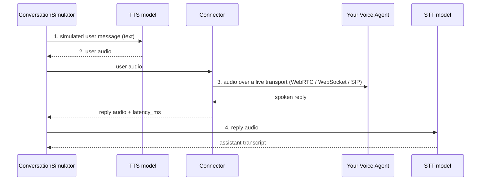
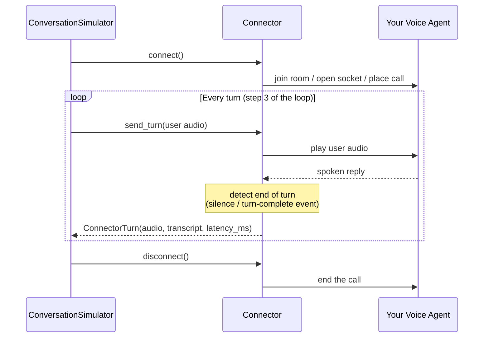

**Voice agents** are conversational AI systems you talk to instead of type at — phone support lines, restaurant booking bots, in-app voice assistants. Evaluating them means evaluating a *spoken* conversation, which has strictly more to it than a text one:

- **What was said** — the transcript, which regular multi-turn metrics like `TurnRelevancyMetric` can judge.
- **How it sounded** — the actual audio on both sides of the call.
- **When it happened** — response latency and turn-taking behavior.

`deepeval` treats voice as a first-class modality, and it changes **how conversations are produced, not how they are evaluated**: the pipeline you already know — goldens in, test cases out, metrics on top — is untouched. A simulated voice conversation produces a standard `ConversationalTestCase` whose `Turn`s carry audio and timing alongside the transcript, so your existing LLM-as-a-judge metrics keep working while the audio and timing data is preserved for voice-specific analysis.

This page explains the concepts behind `deepeval`'s voice support — speech models, transports, protocols, and connectors. To actually run voice simulations, see [Voice Mode](/docs/conversation-simulator-voice-mode) on the `ConversationSimulator`.

## Why Voice Is Different

A text chatbot is a function: you call it with a message and it returns one. A deployed voice agent is a **live call**: audio streams in both directions over a real transport, the agent runs its own speech recognition and speech synthesis internally, and "when a turn ends" is a judgment call based on silence and timing rather than a return statement.

This has two consequences for evaluation:

1. **You need speech models of your own.** To simulate a user, `deepeval` must *speak* messages to your agent (text-to-speech) and *listen* to its replies (speech-to-text). These sit outside your agent — they are the simulated caller's mouth and ears.
2. **You need a transport integration.** There is no universal API for "send this audio to my agent"; agents are reachable over different protocols depending on where they're deployed. `deepeval` abstracts this behind connectors.

## How Voice Evals Work

Evaluating a voice agent follows the same loop as evaluating a text chatbot — a simulated user talks to your application until the conversation ends, and the result is scored. The voice version inserts two speech steps into that loop and swaps the function call for a live connection:

1. **Generate a user message.** The simulator model role-plays the user from the [`ConversationalGolden`](/docs/evaluation-datasets)'s `scenario` and `user_description` — exactly as in a text simulation.
2. **Speak it** *(voice only)*. The TTS model synthesizes the message into audio: this is the simulated caller's voice.
3. **Play it to your agent and record the reply** *(voice only)*. The connector streams the audio over the live transport, waits for your agent to finish speaking, and captures the reply audio along with `latency_ms`.
4. **Transcribe the reply** *(voice only)*. The STT model turns the agent's audio into the assistant turn's `content`.
5. **Decide whether to continue.** [Stopping logic](/docs/conversation-simulator-stopping-logic) checks the conversation against the golden's `expected_outcome` — exactly as in text.
6. **Score the conversation.** The finished `ConversationalTestCase` — transcript plus audio and timing — is evaluated with the same [multi-turn metrics](/docs/metrics-introduction) you'd use on a text conversation.



:::info
Step 4 is skipped when the platform already provides a transcript: some connectors (like ElevenLabs) receive the agent's own transcript alongside its audio, and `deepeval` uses it directly.
:::

:::warning
Steps 2–4 are where the pipeline can distort what you measure. Know the trade-offs:

- **Turn-based, not duplex** — a real caller can talk at any time; the simulator speaks full turns and waits, so barge-in handling isn't exercised (and `Turn.interrupted` stays unset).
- **An idealized caller** — TTS speech is clean and studio-quality: no background noise, muffled mics, accents, or hesitations. Passing proves conversational competence, not audio robustness.
- **STT errors look like agent errors** — transcription accuracy is the ceiling on evaluation accuracy, so the STT model is the most quality-critical choice in the pipeline.
- **End-of-turn is a heuristic** — silence thresholds can clip long pauses and pad `latency_ms`, which is why latencies only compare within a protocol.
:::

## Speech Models

Text-to-speech (TTS) and speech-to-text (STT) are separate model families from LLMs, with largely separate providers. Because they are genuinely different model types, `deepeval` gives them their own base classes — `DeepEvalBaseTTS` and `DeepEvalBaseSTT` — rather than bolting `synthesize`/`transcribe` methods onto `DeepEvalBaseLLM`. In a voice simulation the two play opposite roles, and their quality matters asymmetrically.

### Text-to-Speech (TTS)

A TTS model turns text into spoken audio. In a voice simulation, the **TTS model is the simulated user's voice**: every user message the simulator generates is synthesized to speech before it reaches your agent.

Some LLM providers offer TTS (OpenAI, Gemini), while dedicated vendors like ElevenLabs, Cartesia, and Inworld lead on naturalness and voice variety. For simulation purposes the bar is lower than for production voice products — the synthesis needs to be clear enough that your agent's own speech recognition isn't the bottleneck, since unnatural or garbled speech skews the whole simulation.

### Speech-to-Text (STT)

An STT model turns spoken audio into text. In a voice simulation, the **STT model is how `deepeval` hears your agent**: its transcription of each spoken reply becomes the `Turn.content` that your metrics judge.

This makes STT the more quality-critical of the two — transcription accuracy directly bounds evaluation quality, and it decides voice-specific measurements like word error rate (WER). It's also why supporting industry-standard STT providers (Deepgram, AssemblyAI, OpenAI's Whisper family) matters more than TTS breadth.

## Transports

There is no single way to reach a deployed voice agent. In practice, agents are reachable over a handful of transports:

- **SIP / PSTN (telephony)** — the universal path. Any agent behind a phone number or SIP URI can be called, regardless of vendor: Vapi, Retell, Bland, LiveKit deployments, ElevenLabs agents with phone numbers.
- **WebRTC** — real-time peer-to-peer media. Used by LiveKit rooms, Pipecat, and the web-call modes of Vapi and Retell. Lowest latency, but requires a WebRTC client stack.
- **WebSocket** — raw audio frames over a socket. Used by ElevenLabs conversational agents and many custom in-house agents.
- **REST "create call" APIs** — most managed platforms have one, but it only *initiates* the session; the audio itself still flows over one of the transports above.

`deepeval` makes the transport explicit with the `VoiceProtocol` enum. Every connector class declares which protocol it speaks:

```python
class VoiceProtocol(Enum):
    WEBRTC = "webrtc"        # LiveKit rooms, Pipecat, Vapi/Retell web calls
    WEBSOCKET = "websocket"  # raw-audio WS APIs (ElevenLabs ConvAI, custom agents)
    SIP = "sip"              # PSTN / telephony (Twilio et al.)
    CALLBACK = "callback"    # in-process Python callable, no transport
```

Two design decisions are worth calling out:

- **One protocol maps to many connectors.** LiveKit, Pipecat, and Vapi web calls are all `WEBRTC`; ElevenLabs and a custom in-house agent can both be `WEBSOCKET`. The protocol describes the transport, not the vendor.
- **Timing semantics are defined per protocol, not per connector.** How end-of-turn is detected and what `latency_ms` measures follows from the transport's characteristics, so latencies are comparable across connectors that share a protocol — but not across different protocols.

`CALLBACK` is the exception that proves the rule: it is `deepeval`-specific and carries no network transport at all — the "agent" is an in-process Python callable.

:::tip
Start with `CALLBACK` before going live. It runs the entire simulation pipeline — TTS, turn handling, STT, metrics — against an in-process function, so you can debug your setup without spending call minutes on a deployed agent.
:::

## Connectors

A connector is `deepeval`'s adapter between the turn-based simulator and a live audio session. The abstraction is deliberately small — three async methods:

| Method         | Responsibility                                                                     |
| -------------- | ---------------------------------------------------------------------------------- |
| `connect()`    | Establish the session: join the room, open the socket, place the call.             |
| `send_turn()`  | Play one user turn's audio to the agent, capture the spoken reply, measure timing. |
| `disconnect()` | Tear the session down.                                                              |

These map directly onto the simulation loop from [How Voice Evals Work](#how-voice-evals-work): `send_turn()` **is step 3**, called once per turn, while `connect()` and `disconnect()` bracket the whole conversation — the simulator holds **one live call per conversation**, connecting before the first turn and disconnecting when the conversation ends (or errors):



One live call per connector is also why voice simulations run sequentially — concurrent conversations would interleave audio on the same session.

`send_turn` returns a `ConnectorTurn`, the raw record of one exchange:

| Field        | Meaning                                                                                              |
| ------------ | ---------------------------------------------------------------------------------------------------- |
| `audio`      | The agent's spoken reply.                                                                             |
| `transcript` | The agent's own transcript, if the platform provides one — when present, `deepeval` skips STT for that turn. |
| `latency_ms` | Time from sending the user's audio to capturing the agent's reply.                                    |

### Detecting the end of a turn

The hardest part of a voice connector is knowing when the agent has *finished* speaking — audio streams don't come with return statements. Connectors use a turn engine that combines signals:

- **Silence detection**: a configurable window of quiet (`end_of_turn_silence_ms`, default 800ms) after speech marks the end of the reply.
- **Platform events**: some protocols emit explicit turn-complete messages, which take precedence.
- **Timeouts**: a hard cap (`max_turn_timeout_s`, default 30s) so an unresponsive agent can't hang the simulation.

These thresholds are tunable on each connector, but their *meaning* is fixed per protocol — which is what keeps `latency_ms` comparable within a protocol.

:::tip
If your agent pauses mid-reply (looking up an order, calling a tool), a default 800ms silence window may clip its turn in half. Raise `end_of_turn_silence_ms` to match your agent's longest natural pause.
:::

## Voice Data on Test Cases

Voice data lives on the same test case classes you already use, so nothing downstream has to change. A voice conversation is still a `ConversationalTestCase` made of `Turn`s — see [multi-turn test cases](/docs/evaluation-multiturn-test-cases#turns) for the full structure of the `Turn` class — with a few voice fields added on top:

```python
class Turn:
    role: Literal["user", "assistant"]
    content: str
    # Voice
    audio: Optional[Audio] = None
    latency_ms: Optional[float] = None
    ...
```

- **`Turn.audio`** holds an [`Audio`](#audio-data-model) object for that turn: the synthesized user speech on user turns, the agent's reply on assistant turns.
- **`Turn.latency_ms`** records the agent's response time on assistant turns.
- **`ConversationalTestCase.voice`** is set to `True` automatically whenever any turn carries audio.

Because the transcript still lives in each `Turn.content`, every multi-turn metric works on voice conversations unchanged — the audio and timing fields are additional signal, not a parallel format.

### `Audio` Data Model

Here's the data model of the `Audio` class in `deepeval`:

```python
class Audio:
    dataBase64: Optional[str] = None
    mimeType: Optional[str] = None
    url: Optional[str] = None
    sampleRate: Optional[int] = None
    encoding: Optional[str] = None
    duration: Optional[float] = None
```

You **MUST** either provide `url` or `dataBase64` and `mimeType` parameters when initializing an `Audio`:

| Field        | Who sets it | Accepted values                                                                                                                                  |
| ------------ | ----------- | ------------------------------------------------------------------------------------------------------------------------------------------------ |
| `url`        | You         | A local file path or an `http(s)://` URL.                                                                                                          |
| `dataBase64` | You (or auto) | Base64-encoded audio bytes. Auto-loaded from disk when `url` is a local file; prefer `Audio.from_bytes(...)` over encoding by hand.               |
| `mimeType`   | You (or auto) | A standard audio MIME string: `"audio/wav"`, `"audio/mpeg"`, `"audio/opus"`, `"audio/aac"`, `"audio/flac"`, or `"audio/pcm"`. Guessed from the file extension when constructing from `url` (falling back to `"audio/wav"`). Required with `dataBase64`. |
| `sampleRate` | Optional    | Sample rate in Hz (e.g. `24000`). Metadata only — set it when you know it.                                                                         |
| `encoding`   | Optional    | Container/codec label, e.g. `"wav"`. Metadata only.                                                                                                |
| `duration`   | Optional    | Length in seconds. Metadata only.                                                                                                                  |

When constructing from `url`, two read-only properties are derived for you: `local` (whether the URL points to a local file) and `filename` (the basename of the path). They can't be passed to the constructor.

In practice there are only two ways you'll construct one:

```python
from deepeval.test_case import Audio

# From a local or remote file — mimeType, filename, and bytes are handled for you
recording = Audio(url="./agent-reply.wav")

# From raw bytes (e.g. TTS or connector output)
recording = Audio.from_bytes(wav_bytes, mimeType="audio/wav", sampleRate=24000)
```

To read the raw bytes back out — for example to compute audio measurements or write files to disk — call `recording.get_bytes()`.

:::info
During a voice simulation you never build `Audio` objects yourself — the TTS model and the connector construct them and attach them to `Turn`s. You'll construct one manually only when assembling test cases by hand, such as from recorded production calls.
:::

### `AudioChunk` Data Model

`AudioChunk` is `Audio`'s streaming counterpart: one frame of a live audio stream rather than a complete recording. It appears in the streaming hooks of the speech model base classes (`a_synthesize_stream`, `a_transcribe_stream`), which exist for future duplex — real-time, two-way — simulation:

```python
class AudioChunk:
    dataBase64: str
    mimeType: str
    sampleRate: Optional[int] = None
    encoding: Optional[str] = None
    timestamp: Optional[float] = None
    duration: Optional[float] = None
    final: bool = False
```

Unlike `Audio`, both `dataBase64` and `mimeType` are required (a chunk is always in-memory bytes, never a file or URL), `timestamp` marks where the chunk sits in the stream, and `final` marks the last chunk of an utterance. Today's turn-based simulations only produce complete `Audio` objects — you won't encounter `AudioChunk` unless you implement a streaming speech model.

## Simulating Voice Conversations

The `ConversationSimulator` puts all of this together: pass a `VoiceConfig` (connector + optional speech models) instead of a `model_callback`, and every simulated conversation becomes a voice call.

```python
from deepeval.voice import VoiceConfig, ElevenLabsConnector
from deepeval.simulator import ConversationSimulator

simulator = ConversationSimulator(
    voice_config=VoiceConfig(connector=ElevenLabsConnector(agent_id="your-agent-id")),
)
```

See [Voice Mode](/docs/conversation-simulator-voice-mode) for configuration, the connector catalog, custom speech models, and what a voice simulation produces.

## FAQs

<FAQs
  qas={[
    {
      question: "Why does `deepeval` need its own TTS and STT if my agent already has them?",
      answer: (
        <>
          Your agent's speech stack is <em>inside</em> the system under test.{" "}
          <code>deepeval</code>'s speech models sit on the other side of the call —
          they are the simulated caller's mouth and ears, speaking user turns to
          your agent and transcribing what it says back so metrics can judge the
          conversation.
        </>
      ),
    },
    {
      question: "Which transport should I use to reach my agent?",
      answer: (
        <>
          Whichever your agent is already deployed behind. Agents in LiveKit rooms
          are WebRTC; ElevenLabs conversational agents and most custom in-house
          agents are WebSocket; anything with a phone number is SIP. If you're
          still building the pipeline, start with <code>CALLBACK</code> — no
          transport at all.
        </>
      ),
    },
    {
      question: "What exactly does `latency_ms` measure?",
      answer: (
        <>
          The time from sending the simulated user's audio to capturing the
          agent's spoken reply. End-of-turn detection (silence windows,
          turn-complete events) is defined per <code>VoiceProtocol</code>, so
          latencies are comparable across connectors sharing a protocol but not
          across different protocols.
        </>
      ),
    },
    {
      question: "Do my existing multi-turn metrics work on voice conversations?",
      answer: (
        <>
          Yes. A voice simulation produces a standard{" "}
          <code>ConversationalTestCase</code> whose transcript lives in each{" "}
          <code>Turn.content</code> — metrics like <code>TurnRelevancyMetric</code>{" "}
          judge it exactly as they would a text conversation. The audio and{" "}
          <code>latency_ms</code> fields are additional signal on top.
        </>
      ),
    },
    {
      question: "Can one connector serve multiple conversations concurrently?",
      answer: (
        <>
          No — a connector holds a single live call, so the simulator connects
          before each conversation's first turn, disconnects when it ends, and
          runs conversations sequentially. Concurrent conversations would
          interleave audio on the same session.
        </>
      ),
    },
  ]}
/>
