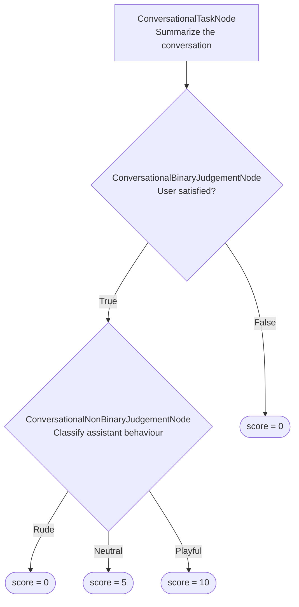

import { ASSETS } from "@site/src/assets";

<MetricTagsDisplayer multiTurn={true} custom={true} />

The conversational deep acyclic graph (DAG) metric in `deepeval` is currently the most versatile custom metric for you to easily build deterministic decision trees for multi-turn evaluation with the help of using LLM-as-a-judge.

The `ConversationalDAGMetric` gives you more deterministic control over scoring than [`ConversationalGEval`](/docs/metrics-conversational-g-eval) by breaking complex criteria into focused decisions and mapping their outcomes to scores you define. You can also use `ConversationalGEval`, or any other multi-turn metric in `deepeval`, within your `ConversationalDAGMetric`.

:::tip
For a complete walkthrough that builds a conversational DAG from start to finish, see the [multi-turn walkthrough in the Building a DAG Metric guide](/guides/guides-dag-metric#multi-turn-walkthrough).
:::

<details>

<summary>Should I use conversational DAG or G-Eval?</summary>

Both metrics use an LLM judge, but they provide different levels of control:

|                                | `ConversationalDAGMetric`                                          | `ConversationalGEval`                               |
| ------------------------------ | ------------------------------------------------------------------ | --------------------------------------------------- |
| **Rubric structure**           | Explicit tasks, branches, and outcomes                             | One holistic criterion or sequence of steps         |
| **Score assignment**           | You assign scores to terminal outcomes                             | The evaluation model generates the score            |
| **Best for**                   | Conditional rules, gates, and known scoring paths                  | Subjective quality that is difficult to enumerate   |
| **Setup**                      | More involved; requires defining and wiring nodes                  | Simpler; requires criteria or evaluation steps      |
| **Evaluation model calls**     | One or more focused calls as the graph executes                    | A single metric workflow                            |
| **Control over score mapping** | High                                                               | Lower                                               |
| **Decision variability**       | Branch decisions remain LLM-based, but score mapping is controlled | Both the qualitative judgement and score are judged |

Use a conversational DAG when you can express your rubric as rules such as "fail immediately if the user was not satisfied; otherwise continue evaluating tone." Use `ConversationalGEval` when one holistic judgement over the conversation is sufficient.

</details>

## Required Arguments

To use a `ConversationalDAGMetric`, create a [`ConversationalTestCase`](/docs/evaluation-multiturn-test-cases) with:

- `turns`

You'll also need to supply any additional arguments such as `retrieval_context` and `tools_called` in your `turns` if your evaluation criteria depends on these parameters.

## Usage

Simply create a direct acyclic graph to define your evaluation trajectory using the nodes available in a top-down fashion, and pass it to `ConversationalDAGMetric`:

```python
from deepeval import evaluate
from deepeval.metrics import ConversationalDAGMetric
from deepeval.metrics.dag import DeepAcyclicGraph
from deepeval.metrics.conversational_dag import ConversationalBinaryJudgementNode
from deepeval.test_case import ConversationalTestCase, Turn, MultiTurnParams

satisfaction = ConversationalBinaryJudgementNode(
    criteria="Do the assistant's replies satisfy the user's questions?",
    evaluation_params=[MultiTurnParams.ROLE, MultiTurnParams.CONTENT],
)
satisfaction.add_verdict(verdict=True, score=10)
satisfaction.add_verdict(verdict=False, score=0)

metric = ConversationalDAGMetric(
    name="User Satisfaction",
    dag=DeepAcyclicGraph(root_nodes=[satisfaction]),
)

test_case = ConversationalTestCase(
    turns=[
        Turn(role="user", content="What's the weather in Paris?"),
        Turn(role="assistant", content="Sunny and 24°C today."),
    ]
)

evaluate(test_cases=[test_case], metrics=[metric])
```

There are **TWO** mandatory and **SIX** optional parameters when creating a `ConversationalDAGMetric`:

- `name`: a string representing the metric's name.
- `dag`: the `DeepAcyclicGraph` to execute.
- [Optional] `threshold`: the minimum passing score, defaulted to `0.5`.
- [Optional] `model`: an OpenAI model name or a [custom evaluation model](/docs/metrics-introduction#using-a-custom-llm) of type `DeepEvalBaseLLM`. Defaulted to <DefaultLLMModel />.
- [Optional] `include_reason`: whether to generate a reason for the final score. Defaulted to `True`.
- [Optional] `strict_mode`: when `True`, sets the threshold to `1`. Defaulted to `False`.
- [Optional] `async_mode`: whether `measure()` executes the graph asynchronously. Defaulted to `True`.
- [Optional] `verbose_mode`: whether to print the nodes and outcomes used to calculate the score. Defaulted to `False`.

### As a standalone

You can also run a `ConversationalDAGMetric` directly against one test case:

```python
metric.measure(test_case)
print(metric.score, metric.reason)
```

:::caution
Standalone execution is useful for debugging, but it does not include the reports, caching, concurrency, and Confident AI integration provided by `evaluate()` or `deepeval test run`.
:::

## DAG Concepts

Before reviewing the available [node types](#dag-node-types), it helps to understand how a conversational DAG starts, scopes turns, and validates its structure.

The diagram below shows how processing and judgement nodes connect to evaluate an entire conversation with branching outcomes, and where each path ends.



### Root Nodes

`root_nodes` contains the nodes where evaluation begins. A root can be a `ConversationalTaskNode`, `ConversationalBinaryJudgementNode`, or `ConversationalNonBinaryJudgementNode`.

You can provide multiple `ConversationalTaskNode` roots. If a binary or non-binary judgement is a root, it must be the only root.

### Turn Windows

Any task or judgement node can focus on a slice of the conversation instead of every turn. Pass a `turn_window` of two inclusive indices to restrict what the node sees:

```python
task = ConversationalTaskNode(
    instructions="Summarize the assistant's replies in one paragraph.",
    output_label="Summary",
    evaluation_params=[MultiTurnParams.ROLE, MultiTurnParams.CONTENT],
    turn_window=(0, 6),
)
```

Use turn windows when a check applies to only part of the dialogue, such as the greeting or the final resolution.

<ImageDisplayer src={ASSETS.dagTurnWindows} alt="DAG with turns window" />

### Shared Nodes and Multiple Parents

A downstream node can be reused by multiple paths. Add the same node instance wherever those paths converge; the graph tracks every incoming dependency and executes the shared node only when the active path reaches it.

### Reaching a Verdict

A DAG has no single exit node. Instead, every path through the graph ends at one of the outcomes you register with `add_verdict()` on a judgement node:

```python
judgement.add_verdict(verdict=False, score=0)          # ends the path with a score
judgement.add_verdict(verdict=True, then=another_node) # continues to another node or metric
```

There is **ONE** mandatory and **TWO** optional arguments when calling `add_verdict()`:

- `verdict`: a boolean for a binary judgement or a unique string for a non-binary judgement.
- [Optional] `score`: an integer from `0` to `10` that ends the path.
- [Optional] `then`: the downstream node, `ConversationalGEval`, or other `BaseConversationalMetric` to execute next.

Each call must define exactly one of `score` or `then`. A `score` terminates evaluation and becomes the metric's result, and so does a `then` that points to a `ConversationalGEval` or another `BaseConversationalMetric` — the child metric's score is adopted as the final score. Only a `then` that points to another task or judgement node keeps the graph going, so every path is guaranteed to end at either a fixed score or a metric.

### Graph Validation

`DeepAcyclicGraph` validates the complete graph when it is constructed. It rejects:

- cycles;
- invalid node connections;
- binary judgements without exactly one `True` and one `False` verdict;
- non-binary judgements without unique string verdicts; and
- verdicts that define both `score` and `then`, or neither.

Construct the graph after every judgement has all of its outcomes.

## DAG Node Types

A multi-turn DAG uses three node types. Define the nodes first, then connect them with `add_node()` and `add_verdict()`.

Each constructor configures only that node; it does not declare children or outcomes. Those connections are added after initialization.

### `ConversationalTaskNode`

A `ConversationalTaskNode` transforms the conversation or outputs from parent task nodes into structured evidence for downstream decisions. It does not assign a score.

```python
from deepeval.metrics.conversational_dag import ConversationalTaskNode
from deepeval.test_case import MultiTurnParams

task = ConversationalTaskNode(
    instructions="Summarize the conversation and explain the assistant's behaviour overall.",
    output_label="Summary",
    evaluation_params=[MultiTurnParams.ROLE, MultiTurnParams.CONTENT],
    label="Conversation summary",
)
```

There are **TWO** mandatory and **THREE** optional parameters when creating a `ConversationalTaskNode`:

- `instructions`: directions for processing the conversation.
- `output_label`: the name used to present this node's output to child nodes.
- [Optional] `evaluation_params`: a list of `MultiTurnParams` available to the node.
- [Optional] `turn_window`: a tuple of two inclusive indices restricting the node to a slice of the conversation.
- [Optional] `label`: a name displayed in verbose logs.

After both nodes are initialized, connect a task to another task or judgement node with `add_node(child)`. This adds an outgoing edge; it does not define an outcome. A `ConversationalTaskNode` cannot end the graph on its own — only judgement nodes define outcomes.

```python
task.add_node(judgement)
```

### `ConversationalBinaryJudgementNode`

A `ConversationalBinaryJudgementNode` evaluates one criterion against the conversation and returns either `True` or `False`.

```python
from deepeval.metrics.conversational_dag import ConversationalBinaryJudgementNode
from deepeval.test_case import MultiTurnParams

judgement = ConversationalBinaryJudgementNode(
    criteria="Do the assistant's replies satisfy the user's questions?",
    evaluation_params=[MultiTurnParams.ROLE, MultiTurnParams.CONTENT],
    label="User satisfaction",
)
```

There is **ONE** mandatory and **THREE** optional parameters when creating a `ConversationalBinaryJudgementNode`:

- `criteria`: the yes-or-no question the evaluation model must answer.
- [Optional] `evaluation_params`: a list of `MultiTurnParams` available to the node.
- [Optional] `turn_window`: a tuple of two inclusive indices restricting the node to a slice of the conversation.
- [Optional] `label`: a name displayed in verbose logs.

The constructor does not define the branches. Add exactly one `True` verdict and one `False` verdict afterward with `add_verdict()`:

```python
judgement.add_verdict(verdict=False, score=0)
judgement.add_verdict(verdict=True, then=behaviour_node)
```

Here, `score` ends the path, while `then` names the node or metric to execute next.

:::caution
There is no need to specify that the output has to be either `True` or `False` in the `criteria`.
:::

### `ConversationalNonBinaryJudgementNode`

A `ConversationalNonBinaryJudgementNode` classifies the conversation into one of several named outcomes.

```python
from deepeval.metrics.conversational_dag import ConversationalNonBinaryJudgementNode
from deepeval.test_case import MultiTurnParams

judgement = ConversationalNonBinaryJudgementNode(
    criteria="How was the assistant's behaviour towards the user?",
    evaluation_params=[MultiTurnParams.ROLE, MultiTurnParams.CONTENT],
    label="Assistant behaviour",
)
```

There is **ONE** mandatory and **THREE** optional parameters when creating a `ConversationalNonBinaryJudgementNode`:

- `criteria`: the classification question the evaluation model must answer.
- [Optional] `evaluation_params`: a list of `MultiTurnParams` available to the node.
- [Optional] `turn_window`: a tuple of two inclusive indices restricting the node to a slice of the conversation.
- [Optional] `label`: a name displayed in verbose logs.

The constructor does not define the possible outcomes. Add at least one unique string verdict afterward with `add_verdict()`:

```python
judgement.add_verdict(verdict="Rude", score=0)
judgement.add_verdict(verdict="Neutral", score=5)
judgement.add_verdict(verdict="Playful", score=10)
```

The possible outputs are constrained to the verdict strings you define.

:::caution
There is no need to specify the options of what to output in the `criteria`.
:::

## How Is It Calculated?

Unlike metrics that derive a score from one holistic evaluation, a `ConversationalDAGMetric` calculates its result by following the structure of the graph you define. The evaluation model makes decisions at judgement nodes, while the selected verdict path determines whether the DAG returns a fixed score or continues into another metric.

### Execution Order

The graph executes in dependency order. Task nodes first produce evidence, judgement nodes evaluate their criteria, and the selected verdict determines whether evaluation ends or continues. Independent branches can execute concurrently when `async_mode=True`.

### Branch Selection

Only the verdict matching a judgement node's output is followed. A binary judgement selects its `True` or `False` verdict, while a non-binary judgement selects one of its configured string verdicts.

### Score Calculation

A terminal verdict's `score` is normalized from the `0`–`10` range to the metric's `0`–`1` range:

<Equation formula="\text{Conversational DAG Score} = \frac{\text{Selected Verdict Score}}{10}" />

For example, `score=10` produces `1.0`, while `score=4` produces `0.4`. The resulting score passes when it meets the metric's `threshold`.

### Child Metric Execution

A verdict can continue into a `ConversationalGEval` or another `BaseConversationalMetric` instead of assigning a score:

```python
from deepeval.metrics import ConversationalGEval
from deepeval.test_case import MultiTurnParams

politeness = ConversationalGEval(
    name="Politeness",
    criteria="Determine whether the assistant remains polite throughout the conversation.",
    evaluation_params=[MultiTurnParams.CONTENT],
)

judgement.add_verdict(verdict=True, then=politeness)
```

The child metric's score and reason become the `ConversationalDAGMetric` result for that path.

:::note
Set `verbose_mode=True` to inspect the nodes, outputs, judgements, and selected verdict used during evaluation.
:::

## Examples

### Binary Gate

Use a binary root when one hard requirement should immediately determine the result:

```python
resolution_check = ConversationalBinaryJudgementNode(
    criteria="Was the user's issue resolved by the end of the conversation?",
    evaluation_params=[MultiTurnParams.ROLE, MultiTurnParams.CONTENT],
)
resolution_check.add_verdict(verdict=False, score=0)
resolution_check.add_verdict(verdict=True, score=10)

dag = DeepAcyclicGraph(root_nodes=[resolution_check])
```

### Multi-Stage DAG with a Summary

Use a task followed by judgements when later decisions depend on the same summarized conversation:

```python
summary.add_node(satisfaction)

satisfaction.add_verdict(verdict=False, score=0)
satisfaction.add_verdict(verdict=True, then=behaviour)

behaviour.add_verdict(verdict="Rude", score=0)
behaviour.add_verdict(verdict="Neutral", score=5)
behaviour.add_verdict(verdict="Playful", score=10)

dag = DeepAcyclicGraph(root_nodes=[summary])
```

For a complete runnable example, see the [multi-turn walkthrough in the Building a DAG Metric guide](/guides/guides-dag-metric#multi-turn-walkthrough).

## FAQs

<FAQs
  qas={[
    {
      question:
        "When is a multi-turn DAG worth it over `ConversationalGEval`?",
      answer: (
        <>
          When a single holistic score hides what matters — e.g. the request was
          satisfied but the assistant was rude. A{" "}
          <a href="/docs/metrics-conversational-g-eval">ConversationalGEval</a>{" "}
          averages that into one fuzzy score; a DAG checks satisfaction and tone
          on separate deterministic branches.
        </>
      ),
    },
    {
      question: "What does `turn_window` do and when should I set it?",
      answer: (
        <>
          An optional tuple of two inclusive turn indices that restricts a node
          to a slice of the conversation (e.g. <code>turn_window=(0, 6)</code>).
          Set it when a check applies to only part of the dialogue, like the
          greeting or final resolution.
        </>
      ),
    },
    {
      question: "How do I make one branch lead to more checks instead of ending?",
      answer: (
        <>
          Pass <code>then</code> instead of <code>score</code> when calling{" "}
          <code>add_verdict()</code> — e.g. point a <code>True</code> verdict's{" "}
          <code>then</code> at a{" "}
          <code>ConversationalNonBinaryJudgementNode</code> to grade further.
          Provide one, never both.
        </>
      ),
    },
    {
      question: "Can I reuse the single-turn DAG nodes here?",
      answer: (
        <>
          No — use the conversational variants:{" "}
          <code>ConversationalTaskNode</code>,{" "}
          <code>ConversationalBinaryJudgementNode</code>, and{" "}
          <code>ConversationalNonBinaryJudgementNode</code>. They take{" "}
          <code>MultiTurnParams</code> and can embed a{" "}
          <code>ConversationalGEval</code> as a leaf.
        </>
      ),
    },
  ]}
/>
