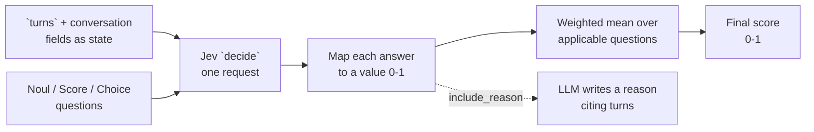

<MetricTagsDisplayer jev={true} multiTurn={true} custom={true} chatbot={true} />

The conversational JevEval is the multi-turn version of [`JevEval`](/docs/metrics-jev-eval): a custom metric whose decisions are made by Jev, a System One model, over an **entire conversation**. You define the decision points as bounded **questions** about the turns, Jev answers each with calibrated probabilities, and `deepeval` turns those probabilities into a score with a fixed equation.

No LLM judges the conversation. The only thing an LLM does in `ConversationalJevEval` is, optionally, write a reason that cites the turns.

:::tip
If you want an LLM to draft the evaluation logic from a one-line `criteria`, use [`ConversationalGEval`](/docs/metrics-conversational-g-eval). `ConversationalJevEval` is for when you already know **what** you want decided about the conversation and want it decided the same way every run.
:::

## Required Arguments

To use `ConversationalJevEval`, you'll have to provide the following arguments when creating a [`ConversationalTestCase`](/docs/evaluation-multiturn-test-cases):

- `turns`

You'll also need to supply any conversation-level fields such as `scenario`, `expected_outcome` or `chatbot_role`, and any per-turn fields such as `retrieval_context` or `tools_called`, if your questions refer to them.

## Usage

First, if you haven't already, install `typesafe-sdk` and save your Jev API key:

```bash
pip install typesafe-sdk
export TYPESAFE_API_KEY=<your-typesafe-api-key>
```

Instantiate a `ConversationalJevEval` with the conversation fields your questions talk about, and the questions themselves:

```python
from deepeval.metrics.jev_eval import Noul, Score, Choice
from deepeval.test_case import Turn, MultiTurnParams, ConversationalTestCase
from deepeval.metrics import ConversationalJevEval
from deepeval import evaluate

refund_handling = ConversationalJevEval(
    name="Refund Handling",
    evaluation_params=[MultiTurnParams.SCENARIO, MultiTurnParams.EXPECTED_OUTCOME],
    questions=[
        Noul("The assistant verifies the order before acting on the refund."),
        Score(
            "How fully is the user's request settled by the end of turns?",
            levels=["Not addressed", "Partly settled", "Fully resolved"],
        ),
        Choice(
            "What did the assistant do about the amount the user asked for?",
            options={"stated_it": 1.0, "deferred_it": 0.5, "ignored_it": 0.0, "never_asked": None},
        ),
    ],
)

convo_test_case = ConversationalTestCase(
    scenario="A customer asks for a refund on a late order.",
    expected_outcome="The refund amount is confirmed.",
    turns=[
        Turn(role="user", content="My order arrived a week late. I want a refund."),
        Turn(role="assistant", content="Sorry about that. What is your order number?"),
        Turn(role="user", content="It's 4471. How much do I get back?"),
        Turn(role="assistant", content="You'll receive a refund within 5-7 days."),
        Turn(role="user", content="ok thanks"),
    ],
)

# To run metric as a standalone
# refund_handling.measure(convo_test_case)
# print(refund_handling.score, refund_handling.reason)
# print(refund_handling.score_breakdown)

evaluate(test_cases=[convo_test_case], metrics=[refund_handling])
```

There are **THREE** mandatory and **EIGHT** optional parameters when creating a `ConversationalJevEval`:

- `name`: name of custom metric.
- `evaluation_params`: a list of type `MultiTurnParams`. These fields are the **state** Jev sees. `MultiTurnParams.CONTENT` and `MultiTurnParams.ROLE` are always included, so every turn's role and content are part of the state whether you list them or not.
- `questions`: a list of [`Noul`](/docs/metrics-jev-eval#noul), [`Score`](/docs/metrics-jev-eval#score) and [`Choice`](/docs/metrics-jev-eval#choice) questions. Each has a `weight` (default `1.0`).
- [Optional] `system_one_model`: a Jev model name such as `"jev-latest"`, **OR** a `TypeSafeModel` instance with your own `api_key`, `model` and `cost_per_input_token`. Defaults to `TypeSafeModel()`, which reads `TYPESAFE_API_KEY` from your environment. Pass `TypeSafeModel(model=..., api_key=...)` to configure it in code instead.
- [Optional] `threshold`: the passing threshold. Can also be set to `None` to run the metric in [score-only mode](/docs/metrics-introduction#metric-thresholds). Defaulted to `0.5`.
- [Optional] `strict_mode`: a boolean which when set to `True`, enforces a binary metric score: 1 if every applicable question is answered in its best possible way, 0 otherwise. It also overrides the current threshold and sets it to 1. See [strict mode](#strict-mode). Defaulted to `False`.
- [Optional] `async_mode`: a boolean which when set to `True`, enables [concurrent execution within the `measure()` method.](/docs/metrics-introduction#measuring-metrics-in-async) Defaulted to `True`.
- [Optional] `verbose_mode`: a boolean which when set to `True`, prints every question's probabilities and value to the console. Defaulted to `False`.
- [Optional] `flaky`: a boolean which when set to `True`, [marks the metric as flaky](/docs/metrics-introduction#flaky-metrics). Defaulted to `False`.
- [Optional] `include_reason`: a boolean which when set to `True`, has your evaluation LLM write a reason that cites specific turns. When `False`, the metric makes **no LLM call at all**. Defaulted to `True`.
- [Optional] `model`: the LLM used only for the reason; a string specifying which of OpenAI's GPT models to use, **OR** [any custom LLM model](/docs/metrics-introduction#using-a-custom-llm) of type `DeepEvalBaseLLM`. Defaulted to <DefaultLLMModel />. Not constructed when `include_reason=False`.

:::danger
Question text refers to the state by field name: `turns` for the conversation, plus conversation-level fields such as `scenario` or `expected_outcome`. A field that is not in `evaluation_params` is invisible to Jev, so every field your questions mention must be listed.
:::

## Question Types

`ConversationalJevEval` has the same three question types as `JevEval`, drawn directly from Jev's decision primitives; see [Noul](/docs/metrics-jev-eval#noul), [Score](/docs/metrics-jev-eval#score) and [Choice](/docs/metrics-jev-eval#choice) for the value each one maps onto. What changes in the conversational metric is **what the questions are about**:

- Write questions about `turns` as a whole ("by the end of turns", "at any point in turns") or about a role ("the assistant", "the user").
- Reference conversation-level fields by name: "the `scenario`", "matches `expected_outcome`", "stays in `chatbot_role`".
- Use a `Choice` with a `None` option for behaviours that may never have come up in this particular conversation, so the question drops out instead of penalising the chatbot for something the user never asked.

## How Is It Calculated?

The `ConversationalJevEval` score is calculated according to the following equation:

<Equation formula="\text{ConversationalJevEval} = \frac{\displaystyle\sum_{i \in \mathcal{A}} w_i \, v_i}{\displaystyle\sum_{i \in \mathcal{A}} w_i}" />

Where $w_i$ is the `weight` of question $i$, $v_i \in [0, 1]$ is the value Jev's answer maps onto, and $\mathcal{A}$ is the set of questions that **applied** to this conversation.

`ConversationalJevEval` first builds a JSON **state** with the conversation as a `turns` list (each turn carrying `role`, `content` and any per-turn field in `evaluation_params`) plus the conversation-level fields you listed, then sends the state and every question to [Jev](/integrations/models/typesafe-ai) in a **single request**. Jev is a [System One model](https://docs.typesafe.ai/concepts/system-one): it answers bounded questions with calibrated probabilities rather than generating language. Jev returns a probability distribution per question; no text is generated. Each distribution becomes a value according to its question type:

<Equation formula="v_{\text{Noul}} = P(\text{true})" />

<Equation formula="v_{\text{Score}} = \frac{1}{n-1}\sum_{k=0}^{n-1} k \, P(k) \qquad \text{for } n \text{ ordered levels, worst first}" />

<Equation formula="v_{\text{Choice}} = \frac{\displaystyle\sum_{o \,:\, c_o \neq \varnothing} P(o)\, c_o}{\displaystyle\sum_{o \,:\, c_o \neq \varnothing} P(o)} \qquad \text{for options } o \text{ with credits } c_o \in [0, 1] \cup \{\varnothing\}" />

**A `Choice` question applies only if its `None`-credited options hold less than half the probability:**

<Equation formula="i \in \mathcal{A} \iff \sum_{o \,:\, c_o = \varnothing} P(o) < 0.5" />

`Noul` and `Score` questions always apply. If $\mathcal{A}$ is empty, the score is `1`: nothing applicable was left to fail. This is how you keep a chatbot from being penalised for behaviour the user never triggered in a given conversation.

:::note
The credits $c_o$ never leave `deepeval`. Jev only sees the option **names**, so it cannot be steered by how much each option is worth.
:::

### Strict mode

With `strict_mode=True`, the weighted mean is replaced by an all-or-nothing check. Every applicable question must be answered in its best possible way, decided from Jev's probabilities alone:

<Equation formula="\text{ConversationalJevEval}_{\text{strict}} = \begin{cases} 1 & \text{if every } i \in \mathcal{A} \text{ passes} \\ 0 & \text{otherwise} \end{cases}" />

Where a question passes when:

- `Noul`: $P(\text{true}) \ge 0.5$
- `Score`: Jev's most probable level is the **top** level
- `Choice`: Jev's most probable applicable option carries a credit of `1.0`

`threshold` is set to `1`, and each entry of `score_breakdown` gains a `passed` flag so you can see which question fell short. Questions that did not apply to this conversation are skipped, as usual.

With `include_reason=True`, the evaluation LLM then writes a `reason` explaining each question's outcome against the conversation. With `include_reason=False`, the metric finishes without any LLM call.

<div style={{textAlign: 'center', margin: "2rem 0"}}>



</div>

## Example

Let's trace the `Refund Handling` metric from [Usage](#usage) on the five-turn conversation above end to end. Every number below is one you can read back from `score_breakdown`.

<Steps>

<Step>

### Build the state

The conversation becomes a `turns` list, each turn carrying the per-turn fields in `evaluation_params` (`role` and `content` always). The conversation-level fields you listed sit alongside in `test_case`:

```json
{
  "turns": [
    {"role": "user", "content": "My order arrived a week late. I want a refund."},
    {"role": "assistant", "content": "Sorry about that. What is your order number?"},
    {"role": "user", "content": "It's 4471. How much do I get back?"},
    {"role": "assistant", "content": "You'll receive a refund within 5-7 days."},
    {"role": "user", "content": "ok thanks"}
  ],
  "test_case": {
    "scenario": "A customer asks for a refund on a late order.",
    "expected_outcome": "The refund amount is confirmed."
  }
}
```

This is why the questions say `turns` and talk about "the assistant": they name keys and roles in this object. Had a question needed `retrieval_context`, you would add `MultiTurnParams.RETRIEVAL_CONTEXT` so each turn carries it.

</Step>

<Step>

### Translate the questions

Each question becomes one entry in a single Jev request, keyed `q_0` to `q_2`:

- `q_0`: a yes/no question on the `Noul` statement.
- `q_1`: a score question over the three `Score` levels.
- `q_2`: a choice question over the four option **names** only. The credits (`1.0`, `0.5`, `0.0`, `None`) are never sent; they are `deepeval`-side bookkeeping for the next step.

One `decide()` call sends the state and all three questions. Jev evaluates them in parallel and returns probabilities, no text.

</Step>

<Step>

### What Jev returns

An illustrative answer for this conversation:

```text
q_0  P(true) = 0.90      # the assistant asked for the order number before promising anything
q_1  score = 1.1, probabilities {0: 0.10, 1: 0.70, 2: 0.20}, confidence 0.7
q_2  choice = ignored_it,
     probabilities {stated_it: 0.05, deferred_it: 0.25, ignored_it: 0.65, never_asked: 0.05},
     confidence 0.65
```

</Step>

<Step>

### Map each answer to a value

**`q_0` (Noul)** is already a value:

<Equation formula="v_0 = 0.90" />

**`q_1` (Score)** has three levels, so $n - 1 = 2$:

<Equation formula="v_1 = \frac{0(0.10) + 1(0.70) + 2(0.20)}{2} = \frac{1.1}{2} = 0.55" />

The conversation lands just past "Partly settled": a refund was promised, its amount was not.

**`q_2` (Choice)** has `never_asked` marked `None`. Its mass is $0.05 < 0.5$, so the question applies; the user did ask "How much do I get back?". Renormalise over the other three and weight by credit:

<Equation formula="v_2 = \frac{0.05 \cdot 1.0 + 0.25 \cdot 0.5 + 0.65 \cdot 0.0}{0.05 + 0.25 + 0.65} = \frac{0.175}{0.95} = 0.184" />

Had the user never asked about the amount and Jev put `0.9` on `never_asked`, `q_2` would drop out entirely and the other two questions would decide the score alone.

</Step>

<Step>

### Weighted mean

All three questions carry the default weight of `1`:

<Equation formula="\text{ConversationalJevEval} = \frac{1 \cdot 0.90 + 1 \cdot 0.55 + 1 \cdot 0.184}{1 + 1 + 1} = \frac{1.634}{3} = 0.545" />

`refund_handling.score` is `0.545` and `success` is `True` against the default threshold of `0.5`, though only just. Giving the `Choice` a `weight=2` would flip it: the ignored amount is exactly the failure `expected_outcome` describes, and weight is how you tell the metric that.

</Step>

<Step>

### Read the breakdown

`score_breakdown` keeps every intermediate so you can see why:

```python
[
  {"question": "The assistant verifies the order before acting on the refund.", "type": "noul", "weight": 1.0, "value": 0.90, "applicable": True, "probabilities": {"true": 0.90, "false": 0.10}, "confidence": None},
  {"question": "How fully is the user's request settled by the end of turns?", "type": "score", "weight": 1.0, "value": 0.55, "applicable": True, "probabilities": {"Not addressed": 0.10, "Partly settled": 0.70, "Fully resolved": 0.20}, "confidence": 0.7},
  {"question": "What did the assistant do about the amount the user asked for?", "type": "choice", "weight": 1.0, "value": 0.184, "applicable": True, "probabilities": {"stated_it": 0.05, "deferred_it": 0.25, "ignored_it": 0.65, "never_asked": 0.05}, "confidence": 0.65},
]
```

</Step>

<Step>

### Reason

With `include_reason=True`, the evaluation LLM writes a `reason` that walks through each question and points at the turns behind it:

> The assistant's first turn asks for the order number before doing anything, which is the verification the scenario requires. In its second turn it promises a refund 'within 5-7 days' but never confirms the amount the user asked about in their second turn, so the request is only partly settled against an expected outcome of the amount being confirmed. The user's final message, 'ok thanks', closes the exchange without the amount ever being stated, which is why the assistant is treated as having ignored rather than deferred it.

With `include_reason=False`, this step is skipped and the whole metric ran with zero LLM tokens.

</Step>

</Steps>

## FAQs

<FAQs
  qas={[
    {
      question: "How is this different from Conversational G-Eval?",
      answer: (
        <>
          <code>ConversationalGEval</code> asks an LLM to draft evaluation
          steps from a <code>criteria</code> and then generate a score for the
          conversation. <code>ConversationalJevEval</code> has no generative
          judge: you write the questions, Jev returns calibrated probabilities
          over the turns, and the score is a fixed weighted mean. Use G-Eval
          when you want the LLM to figure out the logic; use JevEval when you
          know what you want decided and want it decided the same way every run.
        </>
      ),
    },
    {
      question: "Do I have to list CONTENT and ROLE in evaluation params?",
      answer: (
        <>
          No. Every question is about the conversation, so{" "}
          <code>MultiTurnParams.CONTENT</code> and{" "}
          <code>MultiTurnParams.ROLE</code> are added automatically. List only
          the extra fields your questions need, such as{" "}
          <code>SCENARIO</code>, <code>EXPECTED_OUTCOME</code>,{" "}
          <code>CHATBOT_ROLE</code>, <code>RETRIEVAL_CONTEXT</code> or{" "}
          <code>TOOLS_CALLED</code>.
        </>
      ),
    },
    {
      question: "How do I handle behaviour the user never triggered?",
      answer: (
        <>
          Give the <code>Choice</code> an option with credit{" "}
          <code>None</code>, such as <code>never_asked</code>. When Jev puts
          half or more of the probability on it, the question drops out of the
          score for that conversation instead of penalising the chatbot for
          something that never came up.
        </>
      ),
    },
    {
      question: "Can I run it without any LLM?",
      answer: (
        <>
          Yes. Set <code>include_reason=False</code> and no LLM is constructed
          or called; the metric is one Jev request plus arithmetic. You still
          get <code>score</code> and <code>score_breakdown</code>, just no{" "}
          <code>reason</code>.
        </>
      ),
    },
  ]}
/>
