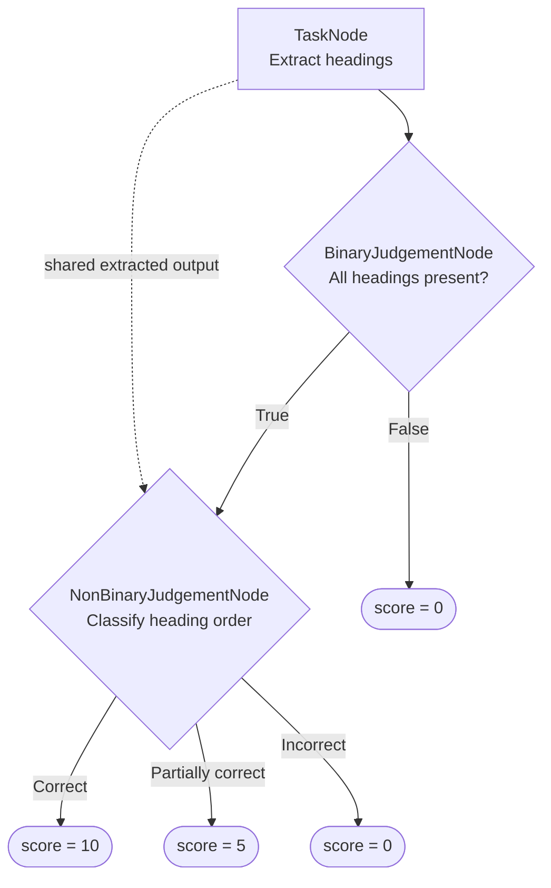

<MetricTagsDisplayer singleTurn={true} custom={true} />

The deep acyclic graph (DAG) metric in `deepeval` is currently the most versatile custom metric for you to easily build deterministic decision trees for evaluation with the help of using LLM-as-a-judge.

The `DAGMetric` gives you more deterministic control over scoring than [`GEval`](/docs/metrics-llm-evals) by breaking complex criteria into focused decisions and mapping their outcomes to scores you define. You can also use `GEval`, or any other default metric in `deepeval`, within your `DAGMetric`.

:::tip
For a complete walkthrough that builds a DAG from start to finish, see the [Building a DAG Metric guide](/guides/guides-dag-metric).
:::

<details>

<summary>Should I use DAG or G-Eval?</summary>

Both metrics use an LLM judge, but they provide different levels of control:

|                                | `DAGMetric`                                                        | `GEval`                                             |
| ------------------------------ | ------------------------------------------------------------------ | --------------------------------------------------- |
| **Rubric structure**           | Explicit tasks, branches, and outcomes                             | One holistic criterion or sequence of steps         |
| **Score assignment**           | You assign scores to terminal outcomes                             | The evaluation model generates the score            |
| **Best for**                   | Conditional rules, gates, and known scoring paths                  | Subjective quality that is difficult to enumerate   |
| **Setup**                      | More involved; requires defining and wiring nodes                  | Simpler; requires criteria or evaluation steps      |
| **Evaluation model calls**     | One or more focused calls as the graph executes                    | A single metric workflow                            |
| **Control over score mapping** | High                                                               | Lower                                               |
| **Decision variability**       | Branch decisions remain LLM-based, but score mapping is controlled | Both the qualitative judgement and score are judged |

Use a DAG when you can express your rubric as rules such as “fail immediately if a requirement is missing; otherwise continue evaluating quality.” Use `GEval` when one holistic judgement is sufficient.

</details>

## Required Arguments

To use a `DAGMetric`, create an [`LLMTestCase`](/docs/evaluation-test-cases#llm-test-case) with:

- `input`

You'll also need to supply any additional arguments such as `expected_output` and `tools_called` if your evaluation criteria depends on these parameters.

## Usage

Simply create a direct acyclic graph to define your evaluation trajectory using the nodes available in a top-down fashion, and pass it to `DAGMetric`:

```python
from deepeval import evaluate
from deepeval.metrics import DAGMetric
from deepeval.metrics.dag import (
    BinaryJudgementNode,
    DeepAcyclicGraph,
)
from deepeval.test_case import LLMTestCase, SingleTurnParams

correctness = BinaryJudgementNode(
    criteria="Is the actual output correct for the input?",
    evaluation_params=[
        SingleTurnParams.INPUT,
        SingleTurnParams.ACTUAL_OUTPUT,
    ],
)
correctness.add_verdict(verdict=True, score=10)
correctness.add_verdict(verdict=False, score=0)

metric = DAGMetric(
    name="Correctness",
    dag=DeepAcyclicGraph(root_nodes=[correctness]),
)

test_case = LLMTestCase(
    input="What is the capital of France?",
    actual_output="Paris.",
)

evaluate(test_cases=[test_case], metrics=[metric])
```

There are **TWO** mandatory and **SIX** optional parameters when creating a `DAGMetric`:

- `name`: a string representing the metric's name.
- `dag`: the `DeepAcyclicGraph` to execute.
- [Optional] `threshold`: the minimum passing score, defaulted to `0.5`.
- [Optional] `model`: an OpenAI model name or a [custom evaluation model](/docs/metrics-introduction#using-a-custom-llm) of type `DeepEvalBaseLLM`. Defaulted to <DefaultLLMModel />.
- [Optional] `include_reason`: whether to generate a reason for the final score. Defaulted to `True`.
- [Optional] `strict_mode`: when `True`, sets the threshold to `1`. Defaulted to `False`.
- [Optional] `async_mode`: whether `measure()` executes the graph asynchronously. Defaulted to `True`.
- [Optional] `verbose_mode`: whether to print the nodes and outcomes used to calculate the score. Defaulted to `False`.

### Within components

You can run a `DAGMetric` within nested components for [component-level evaluation](/docs/evaluation-component-level-llm-evals):

```python
from deepeval.dataset import Golden
from deepeval.tracing import observe, update_current_span

@observe(metrics=[metric])
def inner_component():
    test_case = LLMTestCase(
        input="What is the capital of France?",
        actual_output="Paris.",
    )
    update_current_span(test_case=test_case)

@observe
def llm_app(input: str):
    inner_component()

evaluate(observed_callback=llm_app, goldens=[Golden(input="Hi!")])
```

### As a standalone

You can also run a `DAGMetric` directly against one test case:

```python
metric.measure(test_case)
print(metric.score, metric.reason)
```

:::caution
Standalone execution is useful for debugging, but it does not include the reports, caching, concurrency, and Confident AI integration provided by `evaluate()` or `deepeval test run`.
:::

## DAG Concepts

Before reviewing the available [node types](#dag-node-types), it helps to understand how a DAG starts, shares dependencies, and validates its structure.

:::info
For a more hands-on example, follow the [Building a DAG Metric guide](/guides/guides-dag-metric).
:::

The diagram below shows how processing and judgement nodes connect to form a DAG with branching and shared dependencies, and where each path ends.



### Root Nodes

`root_nodes` contains the nodes where evaluation begins. A root can be a `TaskNode`, `BinaryJudgementNode`, or `NonBinaryJudgementNode`.

You can provide multiple `TaskNode` roots. If a binary or non-binary judgement is a root, it must be the only root.

### Shared Nodes and Multiple Parents

A downstream node can be reused by multiple paths. Add the same node instance wherever those paths converge:

```python
# Define the processing and judgement nodes
extract = TaskNode(
    instructions="Extract every heading.",
    output_label="Extracted headings",
    evaluation_params=[SingleTurnParams.ACTUAL_OUTPUT],
)
headings_present = BinaryJudgementNode(
    criteria="Are all required headings present?"
)
heading_order = NonBinaryJudgementNode(
    criteria="Classify the ordering of the headings."
)

# Give both judgements access to the extracted headings
extract.add_node(headings_present)
extract.add_node(heading_order)

# Only continue to heading_order when all headings are present
headings_present.add_verdict(verdict=False, score=0)
headings_present.add_verdict(verdict=True, then=heading_order)

# Assign scores to the final ordering outcomes
heading_order.add_verdict(verdict="Correct", score=10)
heading_order.add_verdict(verdict="Incorrect", score=0)

# Validate and create the completed DAG
dag = DeepAcyclicGraph(root_nodes=[extract])
```

Here, `heading_order` depends on the extracted headings and the successful `True` branch. The graph tracks both incoming dependencies and executes the shared node only when the active path reaches it.

### Reaching a Verdict

A DAG has no single exit node. Instead, every path through the graph ends at one of the outcomes you register with `add_verdict()` on a judgement node:

```python
judgement.add_verdict(verdict=False, score=0)          # ends the path with a score
judgement.add_verdict(verdict=True, then=another_node) # continues to another node or metric
```

There is **ONE** mandatory and **TWO** optional arguments when calling `add_verdict()`:

- `verdict`: a boolean for a binary judgement or a unique string for a non-binary judgement.
- [Optional] `score`: an integer from `0` to `10` that ends the path.
- [Optional] `then`: the downstream node, `GEval`, or other `BaseMetric` to execute next.

Each call must define exactly one of `score` or `then`. A `score` terminates evaluation and becomes the metric's result, and so does a `then` that points to a `GEval` or another `BaseMetric` — the child metric's score is adopted as the final score. Only a `then` that points to another task or judgement node keeps the graph going, so every path is guaranteed to end at either a fixed score or a metric.

### Graph Validation

`DeepAcyclicGraph` validates the complete graph when it is constructed. It rejects:

- cycles;
- invalid node connections;
- binary judgements without exactly one `True` and one `False` verdict;
- non-binary judgements without unique string verdicts; and
- verdicts that define both `score` and `then`, or neither.

Construct the graph after every judgement has all of its outcomes.

## DAG Node Types

A single-turn DAG uses three node types. Define the nodes first, then connect them with `add_node()` and `add_verdict()`.

Each constructor configures only that node; it does not declare children or outcomes. Those connections are added after initialization.

### `TaskNode`

A `TaskNode` transforms test-case parameters or outputs from parent task nodes into structured evidence for downstream decisions. It does not assign a score.

```python
from deepeval.metrics.dag import TaskNode
from deepeval.test_case import SingleTurnParams

task = TaskNode(
    instructions="Extract every heading from the actual output.",
    output_label="Extracted headings",
    evaluation_params=[SingleTurnParams.ACTUAL_OUTPUT],
    label="Heading extraction",
)
```

There are **TWO** mandatory and **TWO** optional parameters when creating a `TaskNode`:

- `instructions`: directions for processing the available input.
- `output_label`: the name used to present this node's output to child nodes.
- [Optional] `evaluation_params`: test-case parameters available to the node.
- [Optional] `label`: a name displayed in verbose logs.

After both nodes are initialized, connect a task to another task or judgement node with `add_node(child)`. This adds an outgoing edge; it does not define an outcome. A `TaskNode` cannot end the graph on its own — only judgement nodes define outcomes.

```python
task.add_node(judgement)
```

### `BinaryJudgementNode`

A `BinaryJudgementNode` evaluates one criterion and returns either `True` or `False`.

```python
from deepeval.metrics.dag import BinaryJudgementNode
from deepeval.test_case import SingleTurnParams

judgement = BinaryJudgementNode(
    criteria="Are all required headings present?",
    evaluation_params=[SingleTurnParams.ACTUAL_OUTPUT],
    label="Required headings",
)
```

There is **ONE** mandatory and **TWO** optional parameters when creating a `BinaryJudgementNode`:

- `criteria`: the yes-or-no question the evaluation model must answer.
- [Optional] `evaluation_params`: additional test-case parameters available to the node.
- [Optional] `label`: a name displayed in verbose logs.

The constructor does not define the branches. Add exactly one `True` verdict and one `False` verdict afterward with `add_verdict()`:

```python
judgement.add_verdict(verdict=False, score=0)
judgement.add_verdict(verdict=True, then=heading_order)
```

Here, `score` ends the path, while `then` names the node or metric to execute next.

### `NonBinaryJudgementNode`

A `NonBinaryJudgementNode` classifies evidence into one of several named outcomes.

```python
from deepeval.metrics.dag import NonBinaryJudgementNode
from deepeval.test_case import SingleTurnParams

judgement = NonBinaryJudgementNode(
    criteria="Classify the ordering of the headings.",
    evaluation_params=[SingleTurnParams.ACTUAL_OUTPUT],
    label="Heading order",
)
```

There is **ONE** mandatory and **TWO** optional parameters when creating a `NonBinaryJudgementNode`:

- `criteria`: the classification question the evaluation model must answer.
- [Optional] `evaluation_params`: additional test-case parameters available to the node.
- [Optional] `label`: a name displayed in verbose logs.

The constructor does not define the possible outcomes. Add at least one unique string verdict afterward with `add_verdict()`:

```python
judgement.add_verdict(verdict="Correct order", score=10)
judgement.add_verdict(verdict="Partially out of order", score=5)
judgement.add_verdict(verdict="Incorrect order", score=0)
```

The possible outputs are constrained to the verdict strings you define.

## How Is It Calculated?

Unlike metrics that derive a score from one holistic evaluation, a `DAGMetric` calculates its result by following the structure of the graph you define. The evaluation model makes decisions at judgement nodes, while the selected verdict path determines whether the DAG returns a fixed score or continues into another metric.

### Execution Order

The graph executes in dependency order. Task nodes first produce evidence, judgement nodes evaluate their criteria, and the selected verdict determines whether evaluation ends or continues. Independent branches can execute concurrently when `async_mode=True`.

### Branch Selection

Only the verdict matching a judgement node's output is followed. A binary judgement selects its `True` or `False` verdict, while a non-binary judgement selects one of its configured string verdicts.

### Score Calculation

A terminal verdict's `score` is normalized from the `0`–`10` range to the metric's `0`–`1` range:

<Equation formula="\text{DAG Score} = \frac{\text{Selected Verdict Score}}{10}" />

For example, `score=10` produces `1.0`, while `score=4` produces `0.4`. The resulting score passes when it meets the metric's `threshold`.

### Child Metric Execution

A verdict can continue into a `GEval` or another `BaseMetric` instead of assigning a score:

```python
from deepeval.metrics import GEval
from deepeval.test_case import SingleTurnParams

subjective_quality = GEval(
    name="Writing Quality",
    criteria="Determine whether the response is clear and well written.",
    evaluation_params=[SingleTurnParams.ACTUAL_OUTPUT],
)

judgement.add_verdict(verdict=True, then=subjective_quality)
```

The child metric's score and reason become the `DAGMetric` result for that path.

:::note
Set `verbose_mode=True` to inspect the nodes, outputs, judgements, and selected verdict used during evaluation.
:::

## Examples

### Binary Gate

Use a binary root when one hard requirement should immediately determine the result:

```python
policy_check = BinaryJudgementNode(
    criteria="Does the response violate the refund policy?",
    evaluation_params=[SingleTurnParams.ACTUAL_OUTPUT],
)
policy_check.add_verdict(verdict=True, score=0)
policy_check.add_verdict(verdict=False, score=10)

dag = DeepAcyclicGraph(root_nodes=[policy_check])
```

### Multi-Stage DAG with a Shared Node

Use a task followed by multiple judgements when later decisions depend on the same extracted evidence:

```python
extract.add_node(required_fields)
extract.add_node(response_quality)

required_fields.add_verdict(verdict=False, score=0)
required_fields.add_verdict(verdict=True, then=response_quality)

response_quality.add_verdict(verdict="Excellent", score=10)
response_quality.add_verdict(verdict="Acceptable", score=6)
response_quality.add_verdict(verdict="Poor", score=2)

dag = DeepAcyclicGraph(root_nodes=[extract])
```

For a complete runnable example, see the [single-turn walkthrough in the Building a DAG Metric guide](/guides/guides-dag-metric#single-turn-walkthrough).

## FAQs

<FAQs
  qas={[
    {
      question: "When should I use DAG instead of G-Eval?",
      answer: (
        <>
          Use <code>DAGMetric</code> when your rubric contains explicit rules,
          gates, or scoring paths. Use{" "}
          <a href="/docs/metrics-llm-evals">GEval</a> when one holistic,
          subjective judgement is sufficient.
        </>
      ),
    },
    {
      question: "Does a DAG make every evaluation deterministic?",
      answer: (
        <>
          No. Task and judgement nodes still use an LLM, so their outputs can
          vary. A DAG makes the graph structure and the mapping from terminal
          outcomes to scores explicit and controlled.
        </>
      ),
    },
    {
      question: "Can I run G-Eval or another metric inside a DAG?",
      answer: (
        <>
          Yes. Pass a <code>GEval</code> or another <code>BaseMetric</code> to
          the <code>then</code> argument of <code>add_verdict()</code>. It runs
          only when that verdict is selected.
        </>
      ),
    },
    {
      question: "Can multiple paths lead to the same node?",
      answer: (
        <>
          Yes. Reuse the same node instance as the downstream node for each
          path. <code>DeepAcyclicGraph</code> records its parents and schedules
          the shared node according to those dependencies.
        </>
      ),
    },
    {
      question: "Why does my DAG keep returning the same score?",
      answer: (
        <>
          Enable <code>verbose_mode=True</code> and inspect which judgements and
          verdicts are selected. Repeated scores usually mean a criterion
          consistently selects the same branch or several terminal verdicts use
          the same score.
        </>
      ),
    },
  ]}
/>
