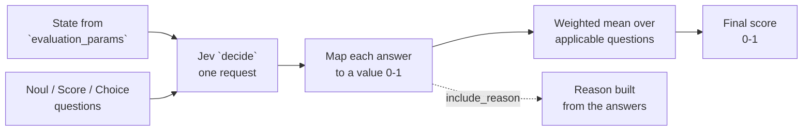

<MetricTagsDisplayer usesLLMs={false} jev={true} singleTurn={true} multiTurn={true} custom={true} />

JevEval is a custom metric that scores an LLM interaction as the **weighted mean** of the answers to bounded **questions** you write about it. Each question is answered by Jev, a System One model, as a calibrated probability rather than generated text; the probability is the question's value, and the metric score is the weighted mean of those values.

There is no chain-of-thought, no "give this a score from 1 to 10", and no JSON to recover. No LLM is involved at any point: even the `reason` is deterministic text built from Jev's answers and their confidence, so the same test case always produces the same reason.

:::tip
If you want a custom metric where an LLM drafts the evaluation logic from a one-line `criteria`, use [`GEval`](/docs/metrics-llm-evals). JevEval is for when you already know **what** you want decided and want it decided the same way every run.

To evaluate entire conversations instead of a single test case, use the **Multi-Turn** tabs below.
:::

## Usage

First, if you haven't already, install TypeSafe AI's SDK and save your Jev API key:

<Switch>

<Case id="python">

```bash
pip install typesafe-sdk
export TYPESAFE_API_KEY=<your-typesafe-api-key>
```

</Case>

<Case id="typescript">

```bash
npm install @typesafe-ai/sdk
export TYPESAFE_API_KEY=<your-typesafe-api-key>
```

</Case>

</Switch>

Instantiate the metric with the test case fields your questions talk about, and the questions themselves:

<Tabs items={["Single-Turn", "Multi-Turn"]}>
<Tab value="Single-Turn">

Here we build a custom **Tool Faithfulness** metric that checks whether the LLM hallucinated on top of what its tools actually returned:

<Switch>

<Case id="python">

```python
from deepeval.metrics.jev_eval import Noul, Score, Choice
from deepeval.test_case import SingleTurnParams
from deepeval.metrics import JevEval

tool_faithfulness = JevEval(
    name="Tool Faithfulness",
    evaluation_params=[SingleTurnParams.INPUT, SingleTurnParams.ACTUAL_OUTPUT, SingleTurnParams.TOOLS_CALLED],
    questions=[
        Noul("Every fact and figure in actual_output appears in the output of a tool in tools_called.", weight=2),
        Noul("actual_output reports every value returned in tools_called accurately."),
        Score(
            "How much of actual_output is grounded in the outputs in tools_called?",
            levels=["Fabricated", "Mostly fabricated", "Mostly grounded", "Fully grounded"],
        ),
        Choice(
            "What did actual_output do with information the tools did not return?",
            options={"left_it_out": 1.0, "flagged_it_as_unknown": 1.0, "hedged_it": 0.5, "stated_it_as_fact": 0.0, "nothing_missing": None},
        ),
    ],
)
```

</Case>

<Case id="typescript">

```typescript
import { JevEval, Noul, Score, Choice } from "deepeval/metrics";
import { SingleTurnParams } from "deepeval/test-case";

const toolFaithfulness = new JevEval({
  name: "Tool Faithfulness",
  evaluationParams: [
    SingleTurnParams.INPUT,
    SingleTurnParams.ACTUAL_OUTPUT,
    SingleTurnParams.TOOLS_CALLED,
  ],
  questions: [
    new Noul({
      statement:
        "Every fact and figure in actual_output appears in the output of a tool in tools_called.",
      weight: 2,
    }),
    new Noul({
      statement:
        "actual_output reports every value returned in tools_called accurately.",
    }),
    new Score({
      question:
        "How much of actual_output is grounded in the outputs in tools_called?",
      levels: ["Fabricated", "Mostly fabricated", "Mostly grounded", "Fully grounded"],
    }),
    new Choice({
      question:
        "What did actual_output do with information the tools did not return?",
      options: {
        left_it_out: 1.0,
        flagged_it_as_unknown: 1.0,
        hedged_it: 0.5,
        stated_it_as_fact: 0.0,
        nothing_missing: null,
      },
    }),
  ],
});
```

</Case>

</Switch>

</Tab>
<Tab value="Multi-Turn">

Here we build a custom **Refund Handling** metric that checks how a support chatbot handled a refund request across a conversation:

<Switch>

<Case id="python">

```python
from deepeval.metrics.jev_eval import Noul, Score, Choice
from deepeval.test_case import MultiTurnParams
from deepeval.metrics import ConversationalJevEval

refund_handling = ConversationalJevEval(
    name="Refund Handling",
    evaluation_params=[MultiTurnParams.SCENARIO, MultiTurnParams.EXPECTED_OUTCOME],
    questions=[
        Noul("The assistant verifies the order before acting on the refund."),
        Score(
            "How fully is the user's request settled by the end of turns?",
            levels=["Not addressed", "Partly settled", "Fully resolved"],
        ),
        Choice(
            "What did the assistant do about the amount the user asked for?",
            options={"stated_it": 1.0, "deferred_it": 0.5, "ignored_it": 0.0, "never_asked": None},
        ),
    ],
)
```

</Case>

<Case id="typescript">

```typescript
import { ConversationalJevEval, Noul, Score, Choice } from "deepeval/metrics";
import { MultiTurnParams } from "deepeval/test-case";

const refundHandling = new ConversationalJevEval({
  name: "Refund Handling",
  evaluationParams: [MultiTurnParams.SCENARIO, MultiTurnParams.EXPECTED_OUTCOME],
  questions: [
    new Noul({
      statement: "The assistant verifies the order before acting on the refund.",
    }),
    new Score({
      question: "How fully is the user's request settled by the end of turns?",
      levels: ["Not addressed", "Partly settled", "Fully resolved"],
    }),
    new Choice({
      question: "What did the assistant do about the amount the user asked for?",
      options: { stated_it: 1.0, deferred_it: 0.5, ignored_it: 0.0, never_asked: null },
    }),
  ],
});
```

</Case>

</Switch>

</Tab>
</Tabs>

There are **THREE** mandatory and <Switch><Case id="python">**SEVEN**</Case><Case id="typescript">**SIX**</Case></Switch> optional parameters when creating a JevEval metric:

- `name`: name of custom metric.
- <Term py="evaluation_params" ts="evaluationParams"/>: a list of type `SingleTurnParams` (or `MultiTurnParams` for multi-turn). These fields are the **state** Jev sees; a question can only refer to fields listed here.
- `questions`: a list of [`Noul`](#noul), [`Score`](#score) and [`Choice`](#choice) questions. Each has a `weight` (default `1.0`).
- [Optional] <Term py="system_one_model" ts="systemOneModel"/>: the Jev model to use, as a string or a `DeepEvalBaseSystemOneModel`. Defaulted to <DefaultSystemOneModel />.
- [Optional] `threshold`: the passing threshold. Can also be set to <Term py="None" ts="null"/> to run the metric in [score-only mode](/docs/metrics-introduction#metric-thresholds). Defaulted to `0.5`.
- [Optional] <Term py="strict_mode" ts="strictMode"/>: a boolean which when set to <Term py="True" ts="true"/>, enforces a binary metric score: 1 if every applicable question is answered in its best possible way, 0 otherwise. It also overrides the current threshold and sets it to 1. See [strict mode](#strict-mode). Defaulted to <Term py="False" ts="false"/>.
- <Only id="python">[Optional] `async_mode`: a boolean which when set to `True`, enables [concurrent execution within the `measure()` method.](/docs/metrics-introduction#measuring-metrics-in-async) Defaulted to `True`.</Only>
- [Optional] <Term py="verbose_mode" ts="verboseMode"/>: a boolean which when set to <Term py="True" ts="true"/>, prints every question's probabilities and value to the console. Defaulted to <Term py="False" ts="false"/>.
- [Optional] `flaky`: a boolean which when set to <Term py="True" ts="true"/>, [marks the metric as flaky](/docs/metrics-introduction#flaky-metrics). Defaulted to <Term py="False" ts="false"/>.
- [Optional] <Term py="include_reason" ts="includeReason"/>: a boolean which when set to <Term py="True" ts="true"/>, attaches a `reason` listing each question's outcome in words, the probability and confidence behind it, and how the score follows. The reason is built in code from Jev's answers, so it costs nothing and never varies between runs. Defaulted to <Term py="True" ts="true"/>.

:::note
JevEval takes no `model` argument. Nothing in it is generated, the reason included, so there is no evaluation LLM to configure and no LLM provider needs to be set up to run it.
:::

:::danger
Question text refers to the state by field name: `input`, `actual_output`, `tools_called`, ... for a single turn, or `turns` plus conversation-level fields such as `scenario` or `expected_outcome` for a conversation. A field that is not in <Term py="evaluation_params" ts="evaluationParams"/> is invisible to Jev, so every field your questions mention must be listed.<Only id="typescript"> The state keys are the same in both SDKs, so write `actual_output` in a question even though the test case field is `actualOutput`.</Only>
:::

As with every `deepeval` metric, JevEval returns a score from 0 - 1 and is successful when that score is equal to or greater than `threshold`. You can access `score`, `reason` and the per-question <Term py="score_breakdown" ts="scoreBreakdown"/>:

<Tabs items={["Single-Turn", "Multi-Turn"]}>
<Tab value="Single-Turn">

<Switch>

<Case id="python">

```python
from deepeval.test_case import LLMTestCase, ToolCall
from deepeval import evaluate
...

test_case = LLMTestCase(
    input="What's the weather in Paris right now?",
    actual_output="It's 18°C and sunny in Paris, with a light breeze and around 40% humidity.",
    tools_called=[
        ToolCall(
            name="get_weather",
            input_parameters={"city": "Paris"},
            output={"temp_c": 18, "condition": "sunny"},
        )
    ],
)

# To run metric as a standalone
# tool_faithfulness.measure(test_case)
# print(tool_faithfulness.score, tool_faithfulness.reason)
# print(tool_faithfulness.score_breakdown)

evaluate(test_cases=[test_case], metrics=[tool_faithfulness])
```

</Case>

<Case id="typescript">

```typescript
import { LLMTestCase, ToolCall } from "deepeval/test-case";
import { evaluate } from "deepeval";
// ...

const testCase = new LLMTestCase({
  input: "What's the weather in Paris right now?",
  actualOutput:
    "It's 18°C and sunny in Paris, with a light breeze and around 40% humidity.",
  toolsCalled: [
    new ToolCall({
      name: "get_weather",
      inputParameters: { city: "Paris" },
      output: { temp_c: 18, condition: "sunny" },
    }),
  ],
});

// To run metric as a standalone
// await toolFaithfulness.measure(testCase);
// console.log(toolFaithfulness.score, toolFaithfulness.reason);
// console.log(toolFaithfulness.scoreBreakdown);

await evaluate([testCase], [toolFaithfulness]);
```

</Case>

</Switch>

</Tab>
<Tab value="Multi-Turn">

<Switch>

<Case id="python">

```python
from deepeval.test_case import ConversationalTestCase, Turn
from deepeval import evaluate
...

convo_test_case = ConversationalTestCase(
    scenario="A customer asks for a refund on a late order.",
    expected_outcome="The refund amount is confirmed.",
    turns=[
        Turn(role="user", content="My order arrived a week late. I want a refund."),
        Turn(role="assistant", content="Sorry about that. What is your order number?"),
        Turn(role="user", content="It's 4471. How much do I get back?"),
        Turn(role="assistant", content="You'll receive a refund within 5-7 days."),
        Turn(role="user", content="ok thanks"),
    ],
)

# To run metric as a standalone
# refund_handling.measure(convo_test_case)
# print(refund_handling.score, refund_handling.reason)
# print(refund_handling.score_breakdown)

evaluate(test_cases=[convo_test_case], metrics=[refund_handling])
```

</Case>

<Case id="typescript">

```typescript
import { ConversationalTestCase, Turn } from "deepeval/test-case";
import { evaluate } from "deepeval";
// ...

const convoTestCase = new ConversationalTestCase({
  scenario: "A customer asks for a refund on a late order.",
  expectedOutcome: "The refund amount is confirmed.",
  turns: [
    new Turn({ role: "user", content: "My order arrived a week late. I want a refund." }),
    new Turn({ role: "assistant", content: "Sorry about that. What is your order number?" }),
    new Turn({ role: "user", content: "It's 4471. How much do I get back?" }),
    new Turn({ role: "assistant", content: "You'll receive a refund within 5-7 days." }),
    new Turn({ role: "user", content: "ok thanks" }),
  ],
});

// To run metric as a standalone
// await refundHandling.measure(convoTestCase);
// console.log(refundHandling.score, refundHandling.reason);
// console.log(refundHandling.scoreBreakdown);

await evaluate([convoTestCase], [refundHandling]);
```

</Case>

</Switch>

</Tab>
</Tabs>

## Question Types

JevEval has three question types, drawn directly from Jev's [decision primitives](/blog/introducing-jev-in-deepeval#understanding-jevs-decision-primitives). Each maps its answer onto a value $v \in [0, 1]$ with a fixed rule.

| Question type | Best for                                                          | Example                                                          |
| ------------- | ----------------------------------------------------------------- | ---------------------------------------------------------------- |
| `Noul`        | A yes/no check: one proposition that is either true or false      | "Every figure in `actual_output` appears in a tool output."      |
| `Score`       | A judgement of degree along an ordered scale, worst to best       | "How much of `actual_output` is grounded?" Fabricated → Fully    |
| `Choice`      | Picking one of several distinct behaviours, some of which may not apply | "What did it do with data the tools never returned?"       |

### Noul

A `Noul` is one proposition about the state. Jev returns $P(\text{true})$, and that probability is the value:

<Equation formula="v_{\text{Noul}} = P(\text{true})" />

<Switch>

<Case id="python">

```python
from deepeval.metrics.jev_eval import Noul

Noul("Every fact and figure in actual_output appears in the output of a tool in tools_called.", weight=2)
```

</Case>

<Case id="typescript">

```typescript
import { Noul } from "deepeval/metrics";

new Noul({
  statement:
    "Every fact and figure in actual_output appears in the output of a tool in tools_called.",
  weight: 2,
});
```

</Case>

</Switch>

Use Nouls for a **checklist**: several independent checks, each calibrated, each weighted by how much you care. `Noul` also accepts optional `true` / `false` descriptions that sharpen what counts as either side.

### Score

A `Score` is one holistic judgement over ordered descriptive levels, **worst first**. Jev returns a probability for every level; the value is the expected level position, normalised so the top level is `1`:

<Equation formula="v_{\text{Score}} = \frac{1}{n-1}\sum_{k=0}^{n-1} k \, P(k) \qquad \text{for } n \text{ ordered levels, worst first}" />

<Switch>

<Case id="python">

```python
from deepeval.metrics.jev_eval import Score

Score(
    "How much of actual_output is grounded in the outputs in tools_called?",
    levels=["Fabricated", "Mostly fabricated", "Mostly grounded", "Fully grounded"],
)
```

</Case>

<Case id="typescript">

```typescript
import { Score } from "deepeval/metrics";

new Score({
  question: "How much of actual_output is grounded in the outputs in tools_called?",
  levels: ["Fabricated", "Mostly fabricated", "Mostly grounded", "Fully grounded"],
});
```

</Case>

</Switch>

Use a Score when "between two levels" is meaningful. Jev accepts between 2 and 10 levels.

:::caution
`levels` must be ordered **worst first**. The first level maps to `0` and the last to `1`, so a list written best first silently inverts the score.
:::

### Choice

A `Choice` is one selection from an **unordered** closed set. You attach a **credit** in `[0, 1]` to every option, or <Term py="None" ts="null"/> to mark an option that means "this question does not apply here". The value is the credit-weighted probability over the applicable options:

<Equation formula="v_{\text{Choice}} = \frac{\displaystyle\sum_{o \,:\, c_o \neq \varnothing} P(o)\, c_o}{\displaystyle\sum_{o \,:\, c_o \neq \varnothing} P(o)} \qquad \text{for options } o \text{ with credits } c_o \in [0, 1] \cup \{\varnothing\}" />

<Switch>

<Case id="python">

```python
from deepeval.metrics.jev_eval import Choice

Choice(
    "What did actual_output do with information the tools did not return?",
    options={"left_it_out": 1.0, "flagged_it_as_unknown": 1.0, "hedged_it": 0.5, "stated_it_as_fact": 0.0, "nothing_missing": None},
)
```

</Case>

<Case id="typescript">

```typescript
import { Choice } from "deepeval/metrics";

new Choice({
  question: "What did actual_output do with information the tools did not return?",
  options: {
    left_it_out: 1.0,
    flagged_it_as_unknown: 1.0,
    hedged_it: 0.5,
    stated_it_as_fact: 0.0,
    nothing_missing: null,
  },
});
```

</Case>

</Switch>

If the <Term py="None" ts="null"/> options collect **half or more** of the probability, the question is dropped from the metric for that test case: it did not apply, so it neither helps nor hurts.

Credits do not have to be monotone, which is what a Score cannot express. Above, `left_it_out` and `flagged_it_as_unknown` are two very different behaviours that deserve the same full credit, and `nothing_missing` means the question should not count at all.

:::info
JevEval outputs a **score**, not a label. If you want the chosen option itself as the result, use a [classifier](/docs/classifiers-introduction) instead.
:::

### Writing questions about a conversation

Multi-turn JevEval uses the same three question types. What changes is **what the questions are about**:

- Write questions about `turns` as a whole ("by the end of turns", "at any point in turns") or about a role ("the assistant", "the user").
- Reference conversation-level fields by name: "the `scenario`", "matches `expected_outcome`", "stays in `chatbot_role`".
- Use a `Choice` with a <Term py="None" ts="null"/> option for behaviours that may never have come up in this particular conversation, so the question drops out instead of penalising the chatbot for something the user never asked.

## How Is It Calculated?

The JevEval score is calculated according to the following equation:

<Equation formula="\text{JevEval} = \frac{\displaystyle\sum_{i \in \mathcal{A}} w_i \, v_i}{\displaystyle\sum_{i \in \mathcal{A}} w_i}" />

Where $w_i$ is the `weight` of question $i$, $v_i \in [0, 1]$ is the value Jev's answer maps onto, and $\mathcal{A}$ is the set of questions that **applied** to this test case.

The metric first builds a JSON **state** from the fields listed in <Term py="evaluation_params" ts="evaluationParams"/>, then sends the state and every question to Jev in a **single request**. For single-turn the state is the listed fields of the test case; for multi-turn it is the entire conversation plus the conversation-level fields you listed. Jev is a [System One model](https://docs.typesafe.ai/concepts/system-one): it answers bounded questions with calibrated probabilities rather than generating language. Jev returns a probability distribution per question; no text is generated. Each distribution becomes a value $v_i$ using the rule for its [question type](#question-types): $v_{\text{Noul}}$, $v_{\text{Score}}$, or $v_{\text{Choice}}$.

**A `Choice` question applies only if its <Term py="None" ts="null"/>-credited options hold less than half the probability:**

<Equation formula="i \in \mathcal{A} \iff \sum_{o \,:\, c_o = \varnothing} P(o) < 0.5" />

`Noul` and `Score` questions always apply. If $\mathcal{A}$ is empty, the score is `1`: nothing applicable was left to fail. For conversations this is how you keep a chatbot from being penalised for behaviour the user never triggered.

### Strict mode

With <Term py="strict_mode=True" ts="strictMode: true"/>, the weighted mean is replaced by an all-or-nothing check. Every applicable question must be answered in its best possible way, decided from Jev's probabilities alone:

<Equation formula="\text{JevEval}_{\text{strict}} = \begin{cases} 1 & \text{if every } i \in \mathcal{A} \text{ passes} \\ 0 & \text{otherwise} \end{cases}" />

Where a question passes when:

- `Noul`: $P(\text{true}) \ge 0.5$
- `Score`: Jev's most probable level is the **top** level
- `Choice`: Jev's most probable applicable option carries a credit of `1.0`

`threshold` is set to `1`, and each entry of <Term py="score_breakdown" ts="scoreBreakdown"/> gains a `passed` flag so you can see which question fell short. Questions that did not apply to this test case are skipped, as usual.

With <Term py="include_reason=True" ts="includeReason: true"/>, a `reason` is then built from the same answers: one line per question with its outcome in words, the probability and confidence behind it, and a closing line showing how the score follows. Nothing is generated, so there is no LLM call at any point.

<div style={{textAlign: 'center', margin: "2rem 0"}}>



</div>

## Example

Let's trace the `Tool Faithfulness` metric from [Usage](#usage) on the Paris weather test case end to end. Every number below is one you can read back from <Term py="score_breakdown" ts="scoreBreakdown"/>. The same trace for the multi-turn `Refund Handling` metric is in the [JevEval examples guide](/guides/guides-jev-eval-examples#worked-example-refund-handling).

<Steps>

<Step>

### Build the state

<Term py="evaluation_params" ts="evaluationParams"/> decides what Jev gets to see. The three fields are pulled off the `LLMTestCase` into one JSON object, with each `ToolCall` serialised as structured data so Jev can read its `output` directly:

```json
{
  "test_case": {
    "input": "What's the weather in Paris right now?",
    "actual_output": "It's 18°C and sunny in Paris, with a light breeze and around 40% humidity.",
    "tools_called": [
      {
        "name": "get_weather",
        "type": "FUNCTION",
        "input_parameters": {"city": "Paris"},
        "output": {"temp_c": 18, "condition": "sunny"}
      }
    ]
  }
}
```

This is why the questions say `actual_output` and `tools_called`: they name keys in this object. Had a question mentioned `retrieval_context`, Jev would simply not have it.

</Step>

<Step>

### Translate the questions

Each question becomes one entry in a single Jev request, keyed `q_0` to `q_3`:

- `q_0`, `q_1`: yes/no questions on the two `Noul` statements.
- `q_2`: a score question over the four `Score` levels.
- `q_3`: a choice question over the five option **names** only. The credits (`1.0`, `1.0`, `0.5`, `0.0`, `None`) are never sent; they are `deepeval`-side bookkeeping for the next step.

One `decide()` call sends the state and all four questions. Jev evaluates them in parallel and returns probabilities, no text.

</Step>

<Step>

### What Jev returns

An illustrative answer for this test case:

```text
q_0  P(true) = 0.30      # "light breeze" and "40% humidity" are in no tool output
q_1  P(true) = 0.90      # 18°C and sunny match temp_c and condition exactly
q_2  score = 1.7, probabilities {0: 0.05, 1: 0.30, 2: 0.55, 3: 0.10}, confidence 0.55
q_3  choice = stated_it_as_fact,
     probabilities {left_it_out: 0.05, flagged_it_as_unknown: 0.05, hedged_it: 0.25, stated_it_as_fact: 0.60, nothing_missing: 0.05},
     confidence 0.6
```

</Step>

<Step>

### Map each answer to a value

This is where the three primitives become comparable.

**`q_0` (Noul, weight 2)** and **`q_1` (Noul, weight 1)** are already values:

<Equation formula="v_0 = 0.30 \qquad v_1 = 0.90" />

**`q_2` (Score)** has four levels, so $n - 1 = 3$:

<Equation formula="v_2 = \frac{0(0.05) + 1(0.30) + 2(0.55) + 3(0.10)}{3} = \frac{1.7}{3} = 0.567" />

Landing between "Mostly fabricated" and "Mostly grounded" is the point: the expected position is already a soft score.

**`q_3` (Choice)** has `nothing_missing` marked `None`. Its mass is $0.05 < 0.5$, so the question applies; the tool never returned wind or humidity. Renormalise over the other four and weight by credit:

<Equation formula="v_3 = \frac{0.05 \cdot 1.0 + 0.05 \cdot 1.0 + 0.25 \cdot 0.5 + 0.60 \cdot 0.0}{0.05 + 0.05 + 0.25 + 0.60} = \frac{0.225}{0.95} = 0.237" />

Had the response stuck to "18°C and sunny" and Jev put `0.9` on `nothing_missing`, `q_3` would drop out entirely and the other three questions would decide the score alone.

</Step>

<Step>

### Weighted mean

<Equation formula="\text{JevEval} = \frac{2 \cdot 0.30 + 1 \cdot 0.90 + 1 \cdot 0.567 + 1 \cdot 0.237}{2 + 1 + 1 + 1} = \frac{2.304}{5} = 0.461" />

<Term py="tool_faithfulness.score" ts="toolFaithfulness.score"/> is `0.461` and `success` is <Term py="False" ts="false"/> against the default threshold of `0.5`. The response got the tool's own values right, but the "every fact appears in a tool output" Noul carried weight 2, so the invented breeze and humidity pulled the score down more than any other single question could. Weight is the only place your "how much do I care" enters the math.

</Step>

<Step>

### Read the breakdown

<Term py="score_breakdown" ts="scoreBreakdown"/> keeps every intermediate so you can see why:

<Switch>

<Case id="python">

```python
[
  {"question": "Every fact and figure in actual_output appears in the output of a tool in tools_called.", "type": "noul", "weight": 2.0, "value": 0.30, "applicable": True, "probabilities": {"true": 0.30, "false": 0.70}, "confidence": 0.40},
  {"question": "actual_output reports every value returned in tools_called accurately.", "type": "noul", "weight": 1.0, "value": 0.90, "applicable": True, "probabilities": {"true": 0.90, "false": 0.10}, "confidence": 0.80},
  {"question": "How much of actual_output is grounded in the outputs in tools_called?", "type": "score", "weight": 1.0, "value": 0.567, "applicable": True, "probabilities": {"Fabricated": 0.05, "Mostly fabricated": 0.30, "Mostly grounded": 0.55, "Fully grounded": 0.10}, "confidence": 0.55},
  {"question": "What did actual_output do with information the tools did not return?", "type": "choice", "weight": 1.0, "value": 0.237, "applicable": True, "probabilities": {"left_it_out": 0.05, "flagged_it_as_unknown": 0.05, "hedged_it": 0.25, "stated_it_as_fact": 0.60, "nothing_missing": 0.05}, "confidence": 0.6},
]
```

</Case>

<Case id="typescript">

```typescript
[
  { question: "Every fact and figure in actual_output appears in the output of a tool in tools_called.", type: "noul", weight: 2, value: 0.3, applicable: true, probabilities: { true: 0.3, false: 0.7 }, confidence: 0.4, passed: null },
  { question: "actual_output reports every value returned in tools_called accurately.", type: "noul", weight: 1, value: 0.9, applicable: true, probabilities: { true: 0.9, false: 0.1 }, confidence: 0.8, passed: null },
  { question: "How much of actual_output is grounded in the outputs in tools_called?", type: "score", weight: 1, value: 0.567, applicable: true, probabilities: { Fabricated: 0.05, "Mostly fabricated": 0.3, "Mostly grounded": 0.55, "Fully grounded": 0.1 }, confidence: 0.55, passed: null },
  { question: "What did actual_output do with information the tools did not return?", type: "choice", weight: 1, value: 0.237, applicable: true, probabilities: { left_it_out: 0.05, flagged_it_as_unknown: 0.05, hedged_it: 0.25, stated_it_as_fact: 0.6, nothing_missing: 0.05 }, confidence: 0.6, passed: null },
]
```

</Case>

</Switch>

</Step>

<Step>

### Reason

With <Term py="include_reason=True" ts="includeReason: true"/>, a `reason` is built from the answers above. It names the judge and the least decisive answer, then walks through each question with its outcome in words and the numbers behind it (a Noul's confidence is `|2p - 1|`, the same statistic Jev reports for Choice and Score):

```
Decided by jev-latest, minimum confidence 0.40.
1. Every fact and figure in actual_output appears in the output of a tool in tools_called. -> likely fails (P(yes)=0.30, confidence=0.40, weight=2)
2. actual_output reports every value returned in tools_called accurately. -> clearly holds (P(yes)=0.90, confidence=0.80)
3. How much of actual_output is grounded in the outputs in tools_called? -> "Mostly grounded" (expected level=0.57 of 1.00, confidence=0.55)
4. What did actual_output do with information the tools did not return? -> "stated_it_as_fact" (P=0.60, confidence=0.60)
Score: 0.46 (weighted mean of 4 applicable questions).
```

Nothing here is generated: the same answers always produce the same reason, and the whole metric ran with zero LLM tokens whether or not <Term py="include_reason" ts="includeReason"/> is set. The `confidence` on the metric (`0.40` here) is the minimum across every question, so you can filter or flag results where Jev was not decisive.

</Step>

</Steps>

For more ready-made question sets, single-turn and multi-turn, see the [JevEval examples guide](/guides/guides-jev-eval-examples).

## FAQs

<FAQs
  qas={[
    {
      question: "How is JevEval different from G-Eval?",
      answer: (
        <>
          <code>GEval</code> asks an LLM to draft evaluation steps from a{" "}
          <code>criteria</code> and then generate a score, and uses token
          probabilities to smooth that number. <code>JevEval</code> has no
          generative judge: you write the questions, Jev returns calibrated
          probabilities, and the score is a fixed weighted mean. Use G-Eval
          when you want the LLM to figure out the logic; use JevEval when you
          know what you want decided and want it decided the same way every run.
        </>
      ),
    },
    {
      question: "When should I use Choice instead of Score?",
      answer: (
        <>
          Use a <code>Score</code> when the outcomes sit on a line from worst
          to best. Use a <code>Choice</code> when they do not: two options can
          share a credit, and an option can mean "this question does not apply"
          by setting its credit to <Term py="None" ts="null"/>.
        </>
      ),
    },
    {
      question: "How is a Choice question turned into a score?",
      answer: (
        <>
          Jev returns a probability per option. The <Term py="None" ts="null"/> options
          are summed first: if they hold half or more of the mass the question
          is dropped. Otherwise the remaining options are renormalised and
          multiplied by their credits. In the worked example that is{" "}
          <code>(0.05·1.0 + 0.05·1.0 + 0.25·0.5 + 0.60·0.0) / 0.95 = 0.237</code>.
        </>
      ),
    },
    {
      question: "Can I run JevEval without any LLM?",
      answer: (
        <>
          JevEval never uses one. The score is one Jev request plus arithmetic,
          and the <code>reason</code> is built in code from Jev's answers and
          their confidence, so no LLM provider has to be configured. Set{" "}
          <Term py="include_reason=False" ts="includeReason: false"/> if you do not want the reason text
          at all.
        </>
      ),
    },
    {
      question: "Can I use JevEval on a conversation?",
      answer: (
        <>
          Yes, with <code>ConversationalJevEval</code>. It takes a{" "}
          <a href="/docs/evaluation-multiturn-test-cases">ConversationalTestCase</a>,
          puts the turns into the state as a <code>turns</code> list, and scores
          with the same three question types and the same equation. Switch to the
          Multi-Turn tab in any code block above.
        </>
      ),
    },
    {
      question: "Do I have to list CONTENT and ROLE in evaluation params for a conversation?",
      answer: (
        <>
          No. Every question is about the conversation, so{" "}
          <code>MultiTurnParams.CONTENT</code> and{" "}
          <code>MultiTurnParams.ROLE</code> are added automatically. List only
          the extra fields your questions need, such as{" "}
          <code>SCENARIO</code>, <code>EXPECTED_OUTCOME</code>,{" "}
          <code>CHATBOT_ROLE</code>, <code>RETRIEVAL_CONTEXT</code> or{" "}
          <code>TOOLS_CALLED</code>.
        </>
      ),
    },
    {
      question: "How do I handle behaviour the user never triggered in a conversation?",
      answer: (
        <>
          Give the <code>Choice</code> an option with credit{" "}
          <Term py="None" ts="null"/>, such as <code>never_asked</code>. When Jev puts
          half or more of the probability on it, the question drops out of the
          score for that conversation instead of penalising the chatbot for
          something that never came up.
        </>
      ),
    },
  ]}
/>
