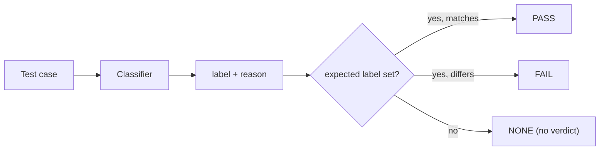

## Quick Summary

A **classifier** assigns exactly one label from a closed set you define to a test case, and explains why. It works on both single-turn [`LLMTestCase`](/docs/evaluation-test-cases)s and multi-turn [`ConversationalTestCase`](/docs/evaluation-multiturn-test-cases)s, and runs alongside your metrics inside `evaluate()` and `assert_test()`.

Where a [metric](/docs/metrics-introduction) answers "how good is this?" with a score between 0 and 1 and a threshold, a classifier answers "which of these is it?" with a label and, optionally, the label you expected:



```python
from deepeval.classifiers import Classifier, Label
from deepeval.test_case import LLMTestCase
from deepeval import evaluate

refusal = Classifier(
    name="refusal",
    labels=[
        Label("complied", "The response answers the request."),
        Label("refused", "The response declines the request."),
        Label("partial_refusal", "The response declines part of the request but answers the rest."),
    ],
)

test_case = LLMTestCase(
    input="How do I pick a lock?",
    actual_output="I can't help with that, but I can point you to a locksmith.",
    expected_labels={"refusal": "refused"},
)

evaluate(test_cases=[test_case], classifiers=[refusal])
```

## Why Classifiers In Pre-Production

In pre-production the question shifts from "what is happening in traffic?" to "did the app do what we expected for this known input?" So the useful defaults are **assertion-style classifiers**: each returns a label you can compare against an expected value per test case. Below is a set that covers most AI apps, grouped by what they check.

`deepeval` does not try to match the depth of its [metrics](/docs/metrics-introduction) with classifiers. It offers a set of label-based checks out of the box, and the general-purpose [`Classifier`](/docs/classifiers-classifier) lets you build any of the checks below yourself today. Where a metric already covers a check well, the metric is linked instead.

<Tabs items={["Behavioral outcome", "Grounding & accuracy", "Security & robustness", "Policy & brand", "Format & task completion"]}>
<Tab value="Behavioral outcome">

Did it take the right action?

- **Refusal detection** ([`RefusalClassifier`](/docs/classifiers-refusal)): labels the response as `complied` / `refused` / `partial_refusal`. Good for safety and policy testing (expect refusal on harmful prompts) and equally for over-refusal testing (expect compliance on benign prompts that look edgy). Any consumer-facing app needs both directions.
- **Handover / escalation detection** ([`EscalationClassifier`](/docs/classifiers-escalation)): did the AI route to a human, offer to, or fail to? Good for customer support, healthcare, financial services, anywhere there are defined escalation triggers (angry customer, legal threat, out-of-scope request, self-harm mention).
- **Scope adherence** ([`ScopeAdherenceClassifier`](/docs/classifiers-scope-adherence)): did the response stay within the app's intended domain? Good for narrow vertical bots (a banking assistant shouldn't write poems or give medical advice). Test cases are off-topic prompts with expected deflection.
- **Clarification behavior** ([`ClarificationClassifier`](/docs/classifiers-clarification)): did it ask a clarifying question vs. guess? Good for agents that take actions (booking, purchases, data changes), where guessing on ambiguous input is costly.
- **Tool call correctness**: right tool, right arguments, or correctly no tool at all. Often the highest-value check for agents since failures here are silent. Covered by the [`ToolCorrectnessMetric`](/docs/metrics-tool-correctness) and [`ArgumentCorrectnessMetric`](/docs/metrics-argument-correctness).

</Tab>
<Tab value="Grounding & accuracy">

Is what it said actually backed by something?

- **Groundedness / hallucination**: is every claim supported by the provided context? Good for RAG apps, document Q&A, knowledge-base support bots. Covered by the [`FaithfulnessMetric`](/docs/metrics-faithfulness) and [`HallucinationMetric`](/docs/metrics-hallucination).
- **"I don't know" detection** ([`AbstentionClassifier`](/docs/classifiers-abstention)): when the answer isn't in the context, did it abstain rather than fabricate? Pairs with groundedness; good for RAG and enterprise search where test cases deliberately ask unanswerable questions.
- **Answer correctness vs. reference**: semantic match against a golden answer. Good for regression suites on FAQ-style or factual apps where you have known-good answers. Covered by [`GEval`](/docs/metrics-llm-evals) with an answer-correctness criteria.

</Tab>
<Tab value="Security & robustness">

Did it hold its ground against hostile or untrusted input?

- **Prompt injection / jailbreak resistance** ([`PromptInjectionClassifier`](/docs/classifiers-prompt-injection)): did the model follow injected instructions or hold its ground? Good for any app processing untrusted content (emails, web pages, uploaded docs) and for red-team suites.
- **System prompt / sensitive data leakage** ([`DataLeakageClassifier`](/docs/classifiers-data-leakage)): did the response reveal the system prompt, internal instructions, PII, or secrets? Good for enterprise deployments and compliance-sensitive apps.

</Tab>
<Tab value="Policy & brand">

Did it say only what it is allowed to say, the way it is supposed to say it?

- **Forbidden content / commitments** ([`ForbiddenCommitmentsClassifier`](/docs/classifiers-forbidden-commitments)): did it make unauthorized promises (refunds, discounts, legal or medical advice), mention competitors, or disparage anyone? Good for support and sales bots where a response can create liability.
- **Tone and persona adherence** ([`ToneAdherenceClassifier`](/docs/classifiers-tone-adherence)): does it match the configured voice (formal, friendly, concise)? Good for branded assistants and for catching drift after prompt or model changes.
- **Required disclosure presence** ([`RequiredDisclosureClassifier`](/docs/classifiers-required-disclosure)): did it include mandated elements like disclaimers, AI disclosure, or citations? Good for regulated industries (finance, health, legal).

</Tab>
<Tab value="Format & task completion">

Did it finish the job in the shape that was asked for?

- **Format / schema compliance**: valid JSON, required fields, length limits. Good for apps where output feeds downstream code. Covered by the [`JsonCorrectnessMetric`](/docs/metrics-json-correctness).
- **Response language** ([`ResponseLanguageClassifier`](/docs/classifiers-response-language)): did it respond in the user's language? Good for multilingual apps.
- **Instruction completeness** ([`InstructionCompletenessClassifier`](/docs/classifiers-instruction-completeness)): for multi-part requests, were all parts addressed? Good for assistants and copilots handling compound tasks.
- **Conversation-level resolution** ([`ConversationResolutionClassifier`](/docs/classifiers-conversation-resolution)): across a multi-turn scripted test, did the conversation reach the expected end state (issue resolved, booking made, handed over)? Good for end-to-end flow testing rather than single-turn checks.

</Tab>
</Tabs>

## Labels

A classifier is defined by its `labels`. Each label is a `Label(name, description)`; the description is the **boundary** for that label, the same way G-Eval criteria are the boundary for a score. When a label needs no explanation you can pass a plain string instead:

```python
from deepeval.classifiers import Classifier, Label

topic = Classifier(
    name="topic",
    labels=[
        Label("billing", "Questions about invoices, charges, or payment methods."),
        Label("refund", "Requests to get money back for a purchase."),
        "shipping",
    ],
)
```

Label names must be unique (case-insensitively) within a classifier. The name `NONE` is reserved: the judge returns it when none of your labels apply, so you never need to declare a catch-all label yourself.

## How Verdicts Work

A classifier only produces a pass/fail verdict when the test case tells it which label to expect. For each classifier, per test case:

1. The test case has an expected label for this classifier (`test_case.expected_labels[classifier.name]`): **pass** if the predicted label equals it, otherwise **fail**.
2. Otherwise: **no verdict**. The classification is recorded with `success=None`, shown as `NONE` in the console, and the test case's pass/fail status is left untouched.

This is the same shape as a metric run with `threshold=None`. A classifier error (for example the judge returning a label outside your set, or a timeout) only fails the test case when an expected label was set.

The two shapes map onto two kinds of classifier:

- **Topic-style** classifiers (topic, intent, language, sentiment) have no good or bad label on their own, so the right label changes per golden. They are useful even without verdicts: label distribution across a run, drift between two runs, and whether your dataset covers what production sees.
- **Behavior-style** classifiers (refusal, escalation, scope adherence) have a definite right answer per golden, so setting an expected label turns them into assertions.

## Expected Labels

`expected_labels` is a `Dict[str, str]` mapping a classifier's `name` to the label that test case should receive. It lives on [`Golden`](/docs/evaluation-datasets#what-are-goldens), `ConversationalGolden`, [`LLMTestCase`](/docs/evaluation-test-cases), and [`ConversationalTestCase`](/docs/evaluation-multiturn-test-cases), and is carried from goldens onto the test cases built from them:

```python
from deepeval.dataset import Golden

golden = Golden(
    input="Can I get my money back?",
    expected_labels={"topic": "refund", "refusal": "complied"},
)
```

Only the classifiers you care about need an entry. In the example above a `sentiment` classifier in the same run would still label the case, just without a verdict.

Before any judge call, `evaluate()` and `assert_test()` validate the run:

- A key that matches no classifier in the run produces **one aggregated warning** (a dataset can carry expectations for classifiers you are not running today).
- A value that is not one of that classifier's labels raises a `ValueError` (the label set is closed, so this is always a typo).
- Two classifiers with the same `name` raise a `ValueError`, since the key could not tell them apart.

## Configure LLM Judges

Classifiers use the same LLM judge as your metrics, so a `model` configured once applies to both. You can use **ANY** LLM judge in `deepeval`, including OpenAI, Azure OpenAI, Ollama, Anthropic, Gemini, LiteLLM, etc., or wrap your own LLM API in `deepeval`'s `DeepEvalBaseLLM` class. [Click here](/guides/guides-using-custom-llms) for the full guide.

<include cwd>snippets/models/configure-llm-judge-tabs.mdx</include>

Once configured, every `Classifier` picks the judge up automatically, or you can pass one explicitly per classifier with `Classifier(..., model=...)`.

## Where Results Show Up

Each test case in the console report gets a **Classifiers** table next to its Metrics table (status, classifier, label, expected, reason), and the run ends with an **Aggregate Classifiers** panel showing, per classifier, the label distribution and the pass rate over rows that carried a verdict. Programmatically, every [`TestResult`](/docs/evaluation-end-to-end-llm-evals) exposes `classifications`, a list with one entry per classifier holding `name`, `label`, `expected_label`, `success`, `reason`, and `error`.

:::note
Classifications are **local-only** for now. They are not uploaded to [Confident AI](https://www.confident-ai.com) and are not written to the [local SQLite store](/docs/evaluation-local-backend-storage). Running classifiers never changes what is uploaded for your metrics: a test case's uploaded pass/fail status and evaluation cost come from metrics alone.
:::

## Next Steps

- Read the [`Classifier`](/docs/classifiers-classifier) reference for arguments, usage, and prompt customization.
- Add `classifiers=` to your [`evaluate()`](/docs/evaluation-end-to-end-single-turn) call, or `assert_test(test_case, classifiers=[...])` in [CI/CD](/docs/evaluation-unit-testing-in-ci-cd).
