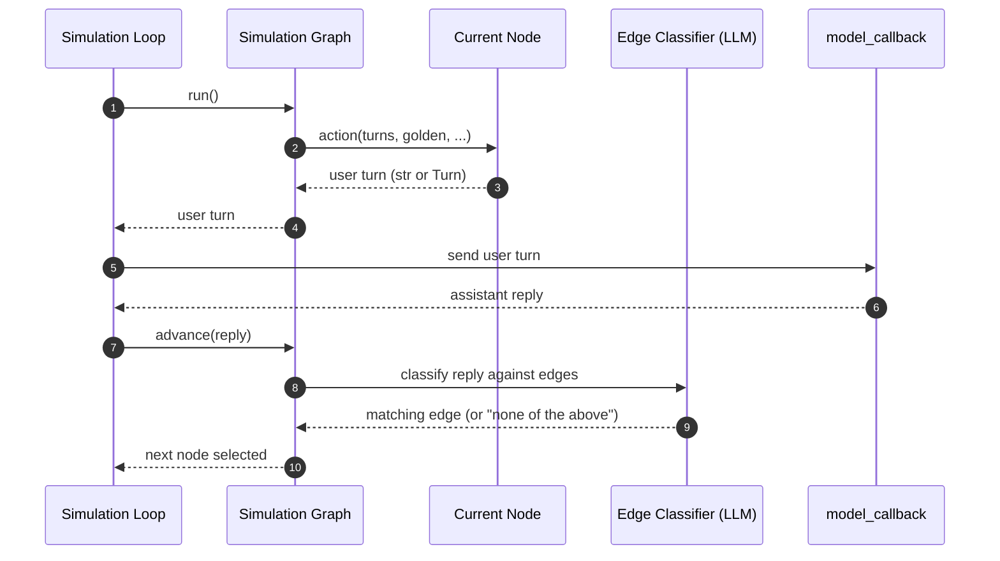

By default, `ConversationSimulator` generates every simulated user turn with a single LLM call against a fixed prompt template. That works for fuzzy exploration but breaks down when you need the simulated user to follow a specific trajectory — e.g., "first ask about pricing, push back if the assistant cites policy, escalate after three pushbacks, accept any compromise".

```python title="main.py"
from deepeval.simulator import ConversationSimulator, SimulationNode

def ask_for_refund(turns, golden):
    return "Hi, I'd like a refund for order #1234. It arrived broken."

def push_back(turns, golden):
    return "That's not acceptable. I paid full price for a broken product."

def accept_compromise(turns, golden):
    return "Okay, that works. Thank you."

def escalate(turns, golden):
    return "I want to speak to a manager."

root = SimulationNode(action=ask_for_refund, name="ask_for_refund")
push = SimulationNode(action=push_back, name="push_back", max_visits=3)
ok   = SimulationNode(action=accept_compromise, name="accept", terminal=True)
esc  = SimulationNode(action=escalate, name="escalate", terminal=True)

root.add_node(ok,   when="The assistant approved the refund")
root.add_node(push, when="The assistant refused or cited a return policy")

push.add_node(ok,   when="The assistant offered a partial refund, credit, or voucher")
push.add_node(push, when="The assistant still refused")  # self-loop allowed

simulator = ConversationSimulator(
    model_callback=model_callback,
    simulator_model="gpt-4o-mini",
    simulation_graph=root,
)
```

Pass a `simulation_graph` (a `SimulationNode`) to encode that trajectory as a state machine. Each node is one state of the simulated user; its `action(...)` returns the user's next message, and its outgoing edges describe — in natural language — when to advance to a different state. An LLM router classifies the assistant's reply against the edge descriptions to decide which child node runs next.

## How Routing Works

Each conversation starts at the `simulation_graph` root. On every iteration, the runner:

1. Invokes the current node's `action(...)` to produce the next user `Turn` (or skips and ends if `max_visits` is exhausted — see below).
2. Calls `model_callback` to get the assistant's reply.
3. Asks `simulator_model` to classify the assistant's reply against the current node's outgoing edges (one LLM call regardless of edge count). A "None of the above" option is appended automatically.
4. Advances to the matching child node, or stays on the current node if no edge matched.



A few side-paths the linear diagram omits for clarity:

- **`max_visits` exhausted on entry** — `Graph` skips calling `action(...)` and returns `end=True`. The simulation stops with no new user turn and no new assistant reply.
- **`terminal=True`** — `Graph` still calls `action(...)` and the user turn + assistant reply are recorded normally; the loop then breaks instead of starting a new iteration.
- **No outgoing edges** — `Graph` skips the classifier and stays on the current node. (This is how `default_simulation_node` loops indefinitely.)

A node with **no outgoing edges** stays on itself indefinitely — the LLM router is not even called. That's how `default_simulation_node` (used when you don't pass a `simulation_graph`) loops until `stopping_controller` ends the conversation.

:::tip
**The `stopping_controller` runs _before_ every user turn — including the very first one.** It can end the simulation earlier than the graph would. See [Stopping Logic](/docs/conversation-simulator-stopping-logic) for its API and the [Stopping Order](/docs/conversation-simulator-stopping-logic#stopping-order) diagram for how all four terminators interleave.
:::

## Node Actions

A node's `action(...)` returns either a `str` (wrapped as `Turn(role="user", content=str)`) or a `Turn` with `role="user"`. Argument names are filtered by `inspect.signature` — declare only what you need. Supported kwargs:

| Kwarg                 | Description                                                                                                                           |
| --------------------- | ------------------------------------------------------------------------------------------------------------------------------------- |
| `turns`               | Full history of `Turn`s in the simulation so far.                                                                                     |
| `golden`              | The `ConversationalGolden` being simulated.                                                                                           |
| `last_assistant_turn` | Latest assistant `Turn`, if any.                                                                                                      |
| `last_user_turn`      | Latest user `Turn`, if any.                                                                                                           |
| `thread_id`           | Unique thread ID for the simulated conversation.                                                                                      |
| `language`            | The simulator's configured language.                                                                                                  |
| `simulator`           | The live `ConversationSimulator` instance (use this to call `simulator.a_generate_first_user_input(golden)` etc. from within a node). |

Actions may be sync or async — `deepeval` detects which.

## Terminal Nodes and `max_visits`

Two ways to end the simulation from inside the graph:

- `terminal=True` — emit one user turn, get the assistant reply, then end immediately.
- `max_visits=N` — the node will be emitted at most `N` times. On the **(N+1)-th entry attempt**, the runner emits nothing and ends the simulation.

Pair `max_visits` with a self-loop to express "complain up to N times, then give up":

```python
push = SimulationNode(action=push_back, max_visits=3)
push.add_node(push, when="The assistant still refused")  # self-loop
# Emits push 3 times. The 4th attempt skips and ends.
```

### Stopping Controller vs Terminal

`terminal=True` and [`stopping_controller`](/docs/conversation-simulator-stopping-logic) are both terminators but they answer different questions and fire at different points in the loop:

|                         | `stopping_controller`                                                                                     | `SimulationNode(terminal=True)`                                                               |
| ----------------------- | --------------------------------------------------------------------------------------------------------- | --------------------------------------------------------------------------------------------- |
| **Scope**               | one global callback on `ConversationSimulator`                                                            | per-node flag inside the `simulation_graph`                                                   |
| **Decides on**          | full conversation state (`turns`, `last_assistant_turn`, `golden`, ...)                                   | reaching a specific graph state                                                               |
| **Fires**               | _before_ the next user turn is generated                                                                  | _after_ the user turn from this node + the matching assistant reply have both been recorded   |
| **Last turns recorded** | end _without_ a new user turn                                                                             | end _with_ a final user/assistant pair                                                        |
| **Use it for**          | cross-cutting predicates ("assistant called `issue_refund`", "expected_outcome met", "repeated failures") | designed happy/sad path leaves in your trajectory ("accepted_refund", "escalated_to_manager") |

They are complementary — both can be active in the same run, and whichever fires first wins. `max_user_simulations` is the hard safety cap above both.

:::info
**For the full ordering across all four terminators** — `max_user_simulations`, `stopping_controller`, `max_visits`, `terminal` — see the sequence diagram in [Stopping Logic → Stopping Order](/docs/conversation-simulator-stopping-logic#stopping-order).
:::

## `default_simulation_node`

`default_simulation_node()` returns a `SimulationNode` whose action delegates to `ConversationSimulator`'s built-in `simulator_model` + `SimulationTemplate` path — i.e., today's LLM-driven exploratory behavior. Use it:

- Implicitly: when you don't pass `simulation_graph`, `deepeval` constructs `default_simulation_node()` for you.
- Explicitly: drop it into a branch of your custom graph to delegate that branch back to the LLM, optionally with a custom prompt template.

```python
from deepeval.simulator import default_simulation_node

default_simulation_node(
    template=None,        # Optional[Type[SimulationTemplate]]
    terminal=False,       # bool
    max_visits=None,      # Optional[int]
    name="default",       # str
)
```

All arguments are optional and keyword-only:

| Argument     | Description                                                                                                                                                                                                                                                                                                 |
| ------------ | ----------------------------------------------------------------------------------------------------------------------------------------------------------------------------------------------------------------------------------------------------------------------------------------------------------- |
| `template`   | Subclass of `SimulationTemplate` used to render the user-turn prompt. When omitted, the built-in template is used. See [Custom Templates](/docs/conversation-simulator-custom-templates) for the override surface. Validated eagerly — bad subclasses or signatures raise `TypeError` at construction time. |
| `terminal`   | If `True`, the simulation ends immediately after this node emits a user turn and the assistant replies. Same semantics as `SimulationNode(terminal=True)`.                                                                                                                                                  |
| `max_visits` | Optional emission cap. The node will be emitted at most `max_visits` times; on the next entry attempt the runner skips emission and ends the simulation. Same semantics as `SimulationNode(max_visits=N)`.                                                                                                  |
| `name`       | Debug name shown in graph traces.                                                                                                                                                                                                                                                                           |

```python
from deepeval.simulator import SimulationNode, default_simulation_node

scripted_root = SimulationNode(
    action=lambda: "I have a quick question.",
    name="opener",
)
scripted_root.add_node(
    default_simulation_node(),
    when="The assistant asked a clarifying question",
)
```

## When To Use a Graph vs a Custom Template

Use a [**custom template**](/docs/conversation-simulator-custom-templates) (`default_simulation_node(template=...)`) when you want the simulated user to keep speaking in a specific _voice_ but the overall trajectory should remain LLM-driven and emergent.

Use a **simulation graph** when the _trajectory_ matters — e.g., you need deterministic ordering, retry budgets, branching on assistant behavior, or terminal success/failure states. Inside a node's `action` you can still call any LLM (including the one in `simulator.simulator_model`) to phrase the user's message, so the two are not mutually exclusive.

## FAQs

<FAQs
  qas={[
    {
      question: "When should I pass a `simulation_graph` instead of using the default LLM-driven user?",
      answer: (
        <>
          When the <em>trajectory</em> matters — deterministic ordering, retry
          budgets, branching on assistant behavior, or terminal success/failure
          states. The default single-prompt user is fine for fuzzy exploration, but
          a <code>simulation_graph</code> lets you encode a specific path like "ask,
          push back, escalate after three pushbacks, accept any compromise".
        </>
      ),
    },
    {
      question: "How do I make the simulation stop from inside the graph?",
      answer: (
        <>
          Use <code>SimulationNode(terminal=True)</code> to emit one final user turn,
          record the assistant reply, then end — or set <code>max_visits=N</code> to
          cap how many times a node fires (the (N+1)-th entry ends the run with no
          new turn). Pair <code>max_visits</code> with a self-loop for "complain up
          to N times, then give up".
        </>
      ),
    },
    {
      question: "How does the graph decide which node runs next?",
      answer: (
        <>
          After each assistant reply, <code>simulator_model</code> classifies it
          against the current node's outgoing <code>when=</code> edge descriptions
          (one LLM call, with a "None of the above" option appended) and advances to
          the matching child, staying put if nothing matches. A node with no edges
          loops on itself.
        </>
      ),
    },
    {
      question: "Can the `stopping_controller` end a graph-driven simulation early?",
      answer: (
        <>
          Yes — the{" "}
          <a href="/docs/conversation-simulator-stopping-logic">stopping_controller</a>{" "}
          runs <em>before</em> every user turn (including the first) and can end the
          run before a <code>terminal</code> node is ever reached. Both terminators
          can be active in the same run, and whichever fires first wins.
        </>
      ),
    },
  ]}
/>

