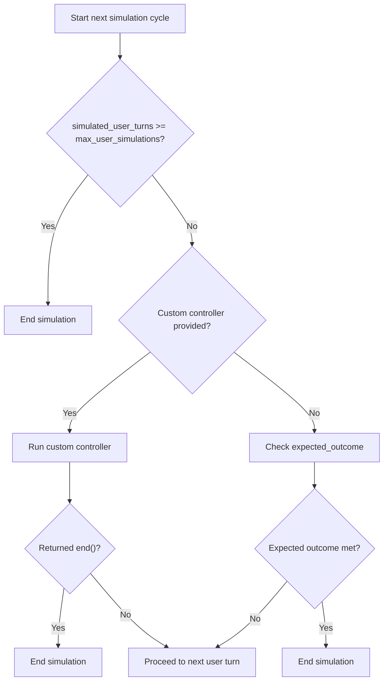

By default, `ConversationSimulator` ends a simulation when the `expected_outcome` in your `ConversationalGolden` has been met. You can replace this behavior with a custom `controller` callback that returns `proceed()` or `end()`.

```python title="main.py"
from deepeval.simulator import ConversationSimulator
from deepeval.simulator.controller import end, proceed

async def controller(last_assistant_turn, simulated_user_turns):
    if last_assistant_turn and "confirmation number" in last_assistant_turn.content.lower():
        return end(reason="User received a confirmation number")

    return proceed()

simulator = ConversationSimulator(
    model_callback=model_callback,
    controller=controller,
)
```

## Stopping Order

The simulator always checks the max-turn cap before running any controller logic.

- If `simulated_user_turns` has reached `max_user_simulations`, the simulation ends immediately.
- If you provide a custom `controller`, `deepeval` runs it after the max-turn check.
- If your custom `controller` returns `end()`, the simulation ends.
- If your custom `controller` returns `proceed()` or anything other than `end()`, the simulation continues.
- If you do not provide a custom `controller`, `deepeval` checks whether the `expected_outcome` has been met.



## Supported Arguments

Only define the arguments your controller needs. `deepeval` will pass supported arguments by name:

- [Optional] `turns`: the current list of `Turn`s in the simulation.
- [Optional] `golden`: the `ConversationalGolden` being simulated.
- [Optional] `index`: the index of the golden being simulated.
- [Optional] `thread_id`: the unique thread ID for the simulated conversation.
- [Optional] `simulated_user_turns`: the number of new simulated user turns generated so far.
- [Optional] `max_user_simulations`: the maximum number of user-assistant message cycles allowed.
- [Optional] `last_user_turn`: the latest user `Turn`, if one exists.
- [Optional] `last_assistant_turn`: the latest assistant `Turn`, if one exists.

## Return Values

If your controller returns anything other than `proceed()` or `end()`, `deepeval` treats it the same as `proceed()`. This is useful when you only want to explicitly handle terminal states:

```python
from deepeval.simulator.controller import end

def controller(last_assistant_turn):
    if last_assistant_turn and "refund processed" in last_assistant_turn.content.lower():
        return end(reason="Refund flow completed")
```

Your controller can return:

- `proceed()`: continue the simulation.
- `end(reason=...)`: end the simulation and optionally record why.
- Anything else, including `None`: continue the simulation.

## Common Use Cases

### Confirmation States

Many task flows should stop as soon as your chatbot confirms the user completed the task.

```python
from deepeval.simulator.controller import end, proceed

def controller(last_assistant_turn):
    if last_assistant_turn and "confirmation number" in last_assistant_turn.content.lower():
        return end(reason="User received confirmation")

    return proceed()
```

### Tool Completion

When your chatbot returns tool call metadata, a specific successful tool call can be the clearest completion signal.

```python
from deepeval.simulator.controller import end, proceed

def controller(last_assistant_turn):
    if last_assistant_turn and any(
        tool.name == "issue_refund"
        for tool in last_assistant_turn.tools_called or []
    ):
        return end(reason="Refund tool was called")

    return proceed()
```

### Repeated Failures

For unhelpful simulations where the assistant repeatedly fails, end early instead of letting them run to the max-turn cap.

```python
from deepeval.simulator.controller import end, proceed

def controller(turns):
    assistant_turns = [turn for turn in turns if turn.role == "assistant"]
    recent = assistant_turns[-2:]

    if len(recent) == 2 and all("I don't know" in turn.content for turn in recent):
        return end(reason="Assistant failed twice in a row")

    return proceed()
```

::::note
`max_user_simulations` is always checked before your controller runs. This means the max-turn limit remains the hard safety cap, even if your controller keeps returning `proceed()`.
::::
