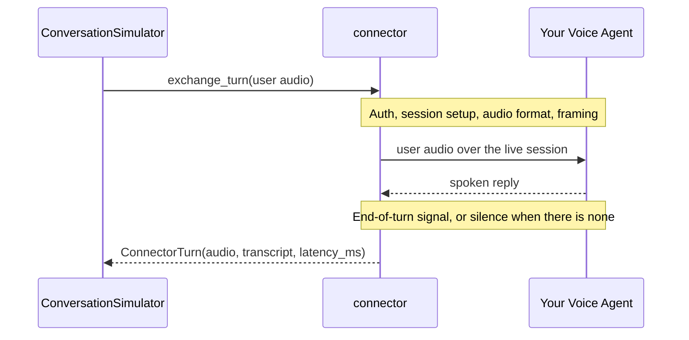

A connector is how `deepeval` reaches your voice agent. In [voice mode](/docs/conversation-simulator-voice-mode) it opens a live session, plays the simulated user's audio, captures the spoken reply, and times how long that reply took to start.

## Why Agent Connectors?

Every voice platform is reached differently — Vapi mints a call over REST before any audio moves, ElevenLabs takes base64 audio in JSON, Pipecat takes protobuf frames, LiveKit is a WebRTC track in a room. A connector holds all of that, so the simulator asks the same thing of every agent:



Switching platforms is therefore a different connector and nothing else — your goldens, metrics, and simulation config don't change.

## Setup Agent Connector

Each connector needs only enough to find your agent — an id, a URL, or credentials — and everything else is shared:

<include cwd>snippets/voice/connector-tabs.mdx</include>

A connector is not a tracing callback: it joins the call from outside and owns the live session — auth, transport, teardown — while `deepeval` layers the turn-taking on top.

Here are the connectors available on `deepeval` so far:

| Connector                | Transport  | Use it for                                                           |
| ------------------------ | ---------- | -------------------------------------------------------------------- |
| `VapiConnector`          | WebSocket  | Vapi assistants, addressed by `assistant_id`.                        |
| `ElevenLabsConnector`    | WebSocket  | ElevenLabs agents, addressed by `agent_id`.                          |
| `LiveKitConnector`       | WebRTC     | Agents dispatched into LiveKit rooms.                                |
| `PipecatConnector`       | WebSocket  | Self-hosted Pipecat pipelines, addressed by URL.                     |
| `WebSocketConnector`     | WebSocket  | Custom agents that speak raw audio over a WebSocket.                 |
| `CallbackVoiceConnector` | In-process | A Python callable, no network — handy for testing your own pipeline. |

:::note
Provider not listed? If your agent exposes a raw-audio WebSocket, `WebSocketConnector` needs only the URL and the message shape. If it's callable in the same Python process, use `CallbackVoiceConnector`. Subclass `BaseVoiceConnector` only for a transport the others can't express.
:::

## Generic WebSocket

For custom agents that accept and emit raw audio over a WebSocket, `WebSocketConnector` lets you describe your agent's message shape — which JSON keys carry audio in and out, whether frames are binary, and what marks the end of a turn.

```python
from deepeval.voice import VoiceConfig, WebSocketConnector

connector = WebSocketConnector(
    url="wss://your-agent.example.com/audio",
    send_key="audio",
    receive_audio_key="audio",
    turn_complete_type="turn_end",
)
voice_config = VoiceConfig(
    connector=connector,
    ...,
)
```

There are **ONE** mandatory and **TWELVE** optional parameters when creating a `WebSocketConnector`:

- `url`: a string WebSocket URL for your agent (e.g. `"wss://your-agent.example.com/audio"`).
- [Optional] `headers`: a dictionary of HTTP headers for the WebSocket handshake. Defaulted to `None`.
- [Optional] `sample_rate`: an integer sample rate in Hz for outbound audio. Defaulted to `24000`.
- [Optional] `send_key`: a string JSON key for outbound audio payloads. Defaulted to `"audio"`.
- [Optional] `binary_outbound`: a boolean which when set to `True`, sends outbound frames as binary instead of JSON. Defaulted to `False`.
- [Optional] `receive_audio_key`: a string JSON key for inbound audio payloads. Defaulted to `"audio"`.
- [Optional] `binary_inbound`: a boolean which when set to `True`, treats inbound frames as binary audio. Defaulted to `False`.
- [Optional] `receive_transcript_key`: a string JSON key for inbound transcripts when the platform provides them. Defaulted to `None`.
- [Optional] `turn_complete_type`: a string message type that marks end-of-turn. Defaulted to `None`.
- [Optional] `type_key`: a string JSON key used to read the message type. Defaulted to `"type"`.
- [Optional] `init_messages`: a list of strings or dicts sent after connect. Defaulted to `[]`.
- [Optional] `ready_on`: when the session is considered ready — `"connect"` by default. Defaulted to `"connect"`.
- [Optional] `turn_detection`: how long to wait before deciding your agent has finished speaking — `"eager"`, `"balanced"`, or `"patient"`. See [Turn Detection](#turn-detection). Defaulted to `"balanced"`.

## Generic WebRTC

For agents reached over a raw peer connection rather than a vendor SDK, `WebRTCConnector` negotiates its own connection with your signaling endpoint, publishes the simulated user's microphone, and listens to the agent's audio track. It only negotiates audio: an agent that also streams video keeps doing so, and `deepeval` never requests or publishes a video track.

```python
from deepeval.voice import VoiceConfig, WebRTCConnector

connector = WebRTCConnector(
    signaling_url="https://your-agent.example.com/offer",
    headers={"Authorization": "Bearer ..."},
)
voice_config = VoiceConfig(
    connector=connector,
    ...,
)
```

There are **ONE** mandatory and **NINE** optional parameters when creating a `WebRTCConnector`:

- `signaling_url`: a string `http(s)://` or `ws(s)://` URL your agent negotiates WebRTC sessions on.
- [Optional] `headers`: a dictionary of HTTP headers sent with the signaling request or the socket handshake, such as an API key. Defaulted to `None`.
- [Optional] `data_channel`: a string label for the data channel opened alongside the audio. Anything the agent sends on it, a plain string or JSON carrying `transcript`, `text`, `content`, or `message`, is used as its transcript for the turn instead of running STT. Pass `None` to open no channel. Defaulted to `"text"`.
- [Optional] `ice_servers`: a list of `stun:` or `turn:` URLs. `None` keeps aiortc's default STUN server; an empty list uses host candidates only, which is what you want for an agent on the same network or machine. Defaulted to `None`.
- [Optional] `turn_detection`: how long to wait before deciding your agent has finished speaking: `"eager"`, `"balanced"`, or `"patient"`. See [Turn Detection](#turn-detection). Defaulted to `"balanced"`.
- [Optional] `connect_timeout_s`: a float number of seconds allowed for signaling, the connection reaching `connected`, and the agent's first audio track to arrive. Defaulted to `15.0`.
- [Optional] `input_sample_rate`: an integer sample rate in Hz for the audio handed to the connector and for the replies it returns. Defaulted to `24000`.
- [Optional] `webrtc_sample_rate`: an integer sample rate in Hz used on the wire. Defaulted to `48000`.
- [Optional] `trailing_silence_ms`: an integer number of milliseconds of silence appended after each full user turn so the agent's VAD hears it end. Defaulted to `1500`.
- [Optional] `transcript_grace_s`: a float number of seconds to wait for a data-channel transcript after the agent's audio ends before falling back to STT. Defaulted to `0.0`.

The URL scheme picks the signaling contract:

- `http://` or `https://`: `deepeval` POSTs its SDP offer with `Content-Type: application/sdp` and reads the answer from the response body, either the raw SDP or JSON with an `sdp` field (`{"type": "answer", "sdp": "..."}` or `{"answer": {"sdp": "..."}}`). This is what OpenAI Realtime, WHIP-style servers, and most custom backends expect.
- `ws://` or `wss://`: `deepeval` sends `{"type": "offer", "sdp": "..."}` over the socket and waits for `{"type": "answer", "sdp": "..."}`. Any `{"type": "candidate", "candidate": ..., "sdpMid": ..., "sdpMLineIndex": ...}` messages are applied whether they arrive before or after the answer, and the socket stays open for the length of the call.

`deepeval` gathers its ICE candidates before sending the offer, so your endpoint receives a complete offer and never has to trickle candidates back over HTTP.

::::note
`WebRTCConnector` needs `aiortc`, which is not installed with `deepeval`. Install it with `pip install aiortc`; the connector raises with the same hint when it is missing.
::::

The connector is full-duplex, so the simulator keeps listening while the caller speaks and a persona's [interruption behavior](/docs/conversation-simulator-voice-interruptions) applies. To type at the agent as well as speak, call `connector.send_text("...")` once connected; whatever your agent sends back on the channel becomes the transcript of its next turn.

## Callback

Wraps an in-process Python callable, so you can exercise the full TTS → agent → STT pipeline without any network transport — useful for testing your simulation setup before pointing it at a deployed agent.

```python
from deepeval.voice import CallbackVoiceConnector, VoiceConfig

connector = CallbackVoiceConnector(my_agent)
voice_config = VoiceConfig(
    connector=connector,
    ...,
)
```

There are **ONE** mandatory and **THREE** optional parameters when creating a `CallbackVoiceConnector`:

- `agent`: a sync or async callable that accepts user `Audio` and returns a `ConnectorTurn` or plain `Audio`.
- [Optional] `sample_rate`: an integer sample rate in Hz. Defaulted to `24000`.
- [Optional] `encoding`: a string container/codec label for audio metadata. Defaulted to `"wav"`.
- [Optional] `turn_detection`: how long to wait before deciding your agent has finished speaking — `"eager"`, `"balanced"`, or `"patient"`. See [Turn Detection](#turn-detection). Defaulted to `"balanced"`.

### Returning a `ConnectorTurn`

::::warning
Do not confuse `ConnectorTurn` with [`Turn`](/docs/evaluation-multiturn-test-cases#turns). `ConnectorTurn` is an intermediate transport type the simulator uses under the hood to move audio (and optional transcript / latency) from your connector into the conversation. It is **not** what metrics evaluate — the simulator maps it onto a normal `Turn` on the `ConversationalTestCase`, and evals only see that.
::::

Your callback is the agent. Return either:

- an [`Audio`](/docs/evaluation-voice#audio-data-model) reply — the connector wraps it and fills `latency_ms` from wall time, or
- a `ConnectorTurn` when you also want to supply a transcript and/or your own latency.

```python
class ConnectorTurn:
    audio: Audio
    transcript: Optional[str] = None
    latency_ms: Optional[float] = None
    interrupted: bool = False
```

There are **ONE** mandatory and **THREE** optional fields on a `ConnectorTurn`:

- `audio`: an `Audio` object with the agent's spoken reply.
- [Optional] `transcript`: a string with the agent's own transcript. When set, `deepeval` uses it as assistant `Turn.content` and skips STT for that turn. Defaulted to `None`.
- [Optional] `latency_ms`: a number measuring time from receiving the user audio to the start of the reply. When omitted, the connector measures wall time around your callback. Defaulted to `None`.
- [Optional] `interrupted`: a boolean set to `True` when this reply was cut short by a barge-in. Defaulted to `False` — leave it alone unless you're simulating interruption behavior yourself.

```python
from deepeval.voice import CallbackVoiceConnector
from deepeval.voice.connectors import ConnectorTurn

# Minimal — return Audio or ConnectorTurn(audio=...)
async def my_agent(user_audio) -> ConnectorTurn:
    reply_audio = await your_voice_agent(user_audio)
    return ConnectorTurn(audio=reply_audio)

# With a known transcript (skips STT) and measured latency
async def my_agent(user_audio) -> ConnectorTurn:
    reply_audio, text, latency_ms = await your_voice_agent(user_audio)
    return ConnectorTurn(
        audio=reply_audio,
        transcript=text,
        latency_ms=latency_ms,
    )

```

## Full-Duplex Custom Connectors

`WebSocketConnector` and `CallbackVoiceConnector` take turns by default. If your transport can carry both voices at once, override `supports_duplex` and the simulator will keep listening while the caller speaks, even without an `interruption_behavior`:

```python
from deepeval.voice import WebSocketConnector

class MyDuplexConnector(WebSocketConnector):
    @property
    def supports_duplex(self) -> bool:
        return True
```

Returning `True` requires `stream_uplink`, `iter_agent_events`, and `stop_uplink` to work on your connector, since the duplex path uses those instead of `exchange_turn`.

Nothing in an audio stream announces that your agent has finished speaking, so the end of its turn is inferred from silence. Every connector takes a `turn_detection` preset controlling how long that silence has to last, along with the hard ceiling that stops an agent which never goes quiet from hanging the simulation:

| `turn_detection` | Waits through pauses of | Gives up after | Use it when                                                                |
| ---------------- | ----------------------- | -------------- | -------------------------------------------------------------------------- |
| `"eager"`        | 500ms                   | 20s            | Your agent answers in one breath and you want the floor back quickly.      |
| `"balanced"`     | 800ms                   | 30s            | Default. Suits most agents.                                                |
| `"patient"`      | 2.5s                    | 120s           | Your agent pauses mid-reply — to think, call a tool, or look something up. |

```python
connector = CallbackVoiceConnector(my_agent, turn_detection="patient")
```

Pick by listening to your agent's longest natural pause. Too eager and its turn ends at that pause, cutting the reply short and discarding the rest of it; too patient and the simulator sits through dead air before responding, which inflates the gaps in the recording and slows the run.

On the duplex path the preset is a ceiling, not the wait: when the running transcript reads as a finished sentence and covers all speech heard so far, the turn ends after 500ms of silence, while a reply that trails off mid-sentence still waits the full window.

When your transport closes each turn explicitly, silence is only the fallback: `ElevenLabsConnector`, `VapiConnector`, `CallbackVoiceConnector`, and a `WebSocketConnector` given a `turn_complete_type` are all believed over a pause, so the reply is heard out in full however long your agent stops for. Only the ceiling still applies.

The preset matters more everywhere else, because silence is the only evidence there is. `LiveKitConnector` and `WebRTCConnector` get a bare audio track with nothing to say when a turn is over, and so does a `WebSocketConnector` whose agent sends no end-of-turn message to point at. `PipecatConnector` falls on either side depending on your pipeline: it's believed over a pause once your pipeline has been seen to announce an end of turn, and reads silence until then.

::::note
The underlying millisecond values are chosen as a coordinated preset rather than exposed individually, for the same reason [interruption timing](/docs/conversation-simulator-voice-interruptions#when-does-it-interrupt) is: they are interdependent, and picking them apart is guesswork without knowing how the turn-taking loop uses them.
::::
