By default [voice mode](/docs/conversation-simulator-voice-mode) is **half-duplex**: the simulated user finishes speaking, then waits for the agent via `exchange_turn`. Give the caller's [persona](/docs/conversation-simulator-voice-personas) an `interruption_behavior` to exercise barge-in — the same connector session, driven with concurrent uplink and downlink instead.

:::tip
For the conceptual model (uplink / downlink, half-duplex vs duplex), see [Voice concepts — Interruptions](/docs/evaluation-voice#interruptions).
:::

## How It Works

With interruptions enabled, the simulator no longer uses `exchange_turn()`. It drives the same connector with concurrent uplink and downlink:

1. **Speak the user turn.** TTS synthesizes the simulated user's message; the connector pushes it with `stream_uplink` (cancelable) without waiting for the agent to finish.
2. **Listen on the downlink.** `iter_agent_events()` streams agent audio and partial transcripts as they arrive.
3. **Judge mid-speech.** As the partial transcript grows, the simulator model decides whether a real caller at this `frequency` would barge in now — and with what utterance.
4. **Barge (optional).** If the judge says yes, TTS speaks that utterance and `stream_uplink` starts overlapping the agent.
5. **Recover from double-talk.** If both sides overlap, the agent gets a grace window to stop; if it doesn't, the user yields, waits through an awkward pause, and may retry. A successful barge marks the assistant `Turn` with `interrupted=True`.
6. **Continue.** Once the floor settles, the simulator records the turns and generates the next user message as usual.

```mermaid
sequenceDiagram
    participant Simulator as ConversationSimulator
    participant TTS as tts_model
    participant Judge as Simulator model
    participant Connector as connector
    participant Agent as Your Voice Agent

    Simulator->>TTS: user message text
    TTS-->>Simulator: user audio
    Simulator->>Connector: stream_uplink user audio
    Connector->>Agent: uplink - user speaking

    loop While agent is speaking
        Agent-->>Connector: downlink audio / partial transcript
        Connector-->>Simulator: iter_agent_events
        Simulator->>Judge: should barge-in given level and partial
        Judge-->>Simulator: should_interrupt and utterance
        opt Judge decides to interrupt
            Simulator->>TTS: barge utterance text
            TTS-->>Simulator: barge audio
            Simulator->>Connector: stream_uplink barge audio
            Connector->>Agent: uplink overlaps downlink
            Note over Simulator,Agent: Overlap - grace, yield, or retry
        end
    end

    Connector-->>Simulator: agent turn ends - interrupted or complete
    Note over Simulator: Record turns - mark interrupted on success
```



## Setup Interruptions

Interrupting is a trait of the caller, not of the run — an impatient customer talks over your agent no matter which scenario they are calling about. So interruptions are enabled whenever a non-`None` `InterruptionBehavior` is supplied to a [`Persona`](/docs/conversation-simulator-voice-personas):

```python
from deepeval.dataset import InterruptionBehavior, Persona

persona = Persona(
    characteristics="You are impatient and finish other people's sentences.",
    interruption_behavior=InterruptionBehavior(
        frequency="normal",
        overlap="adaptive",
    ),
)
```

There are **TWO** optional parameters when creating an `InterruptionBehavior`:

- [Optional] `frequency`: how often the simulated caller considers barging in — `"rare"`, `"normal"`, or `"frequent"`. Defaulted to `"normal"`.
- [Optional] `overlap`: how the caller behaves when the agent keeps talking over an interruption — `"yield"`, `"adaptive"`, or `"insist"`. Defaulted to `"adaptive"`.

Barging in only happens once that persona is driving a conversation, so attach it to the `ConversationalGolden` you simulate:

```python
from deepeval.dataset import ConversationalGolden

golden = ConversationalGolden(
    scenario="Andy Byron wants to purchase a VIP ticket to a Coldplay concert.",
    persona=persona,
)
```

::::tip
A persona carries much more than barge-in — the caller's voice, background noise, whether they speak first, whether they speak at all, and when they hang up. See [Personas](/docs/conversation-simulator-voice-personas) for the full set.
::::

:::caution
`VoiceConfig.interruption_settings` is deprecated. It still works as a run-wide fallback for goldens whose persona has no `interruption_behavior` of its own, but it emits a `DeprecationWarning` and will be removed in a future release.
:::

## When Does It Interrupt?

Interruptions are **not random**. While the agent is speaking, the simulator model acts as a judge: it reads the partial transcript so far (plus the scenario, the caller's persona, and prior turns) and decides whether a real caller at this `frequency` would cut in _now_, and with what utterance.

That decision is content-based — e.g. the agent contradicted itself, asked something already answered, or is rambling — not a coin flip. `frequency` only changes how eager the judge is and how often it is asked:

- `"rare"` — interrupt only on clear errors / contradictions; prefer waiting out the full reply. At most **1** barge per conversation and **1** per agent utterance. The judge is polled less often (needs ~80 more transcript characters and at least 2s between polls).
- `"normal"` — interrupt when a real caller would clarify, redirect, answer early, or cut an obvious digression — not on routine helpful speech. Up to **4** barges per conversation and **2** per agent utterance (~40 chars / 1s between polls).
- `"frequent"` — interrupt aggressively on verbosity, slow pacing, digressions, or chances to cut ahead — still skip nonsense mid-word cuts. Up to **8** per conversation and **3** per agent utterance (~20 chars / 0.5s between polls).

Leave `Persona.interruption_behavior` unset (or set it to `None`) for half-duplex — the simulator uses `exchange_turn`, never barges in, and `Turn.interrupted` stays unset.

The only randomness in the loop is a small delay before retrying after double-talk. That varies _when_ a retry may fire, not _whether_ the judge chose to interrupt in the first place.

## When Both Sides Talk at Once

A barge-in is not instant success. For a moment **both sides may be talking over each other** — the agent still finishing a sentence while the simulated user cuts in. Real phone calls do the same thing: one person starts speaking, the other keeps going for a beat, then someone yields (or both pause awkwardly and try again).

`deepeval` models that recovery path explicitly. After the simulated user starts overlapping the agent:

1. **Brief overlap is allowed.** The user keeps talking for a short window while the agent is still on the downlink. That overlap is the interruption — without it, the user could never talk over the agent.
2. **The agent gets a chance to stop.** If the agent goes quiet, the barge worked: the assistant reply is cut short (`interrupted=True`) and the conversation continues from the user's cut-in.
3. **If the agent keeps talking, `overlap` decides what happens.**
   - `"yield"` backs off quickly and does not retry that interruption.
   - `"adaptive"` allows a brief overlap, then yields and may retry after a natural pause.
   - `"insist"` holds the floor longer and retries sooner if the agent ignores the interruption.
4. **The conversation recovers.** When the caller yields, the simulator leaves a short “no, you go” pause before listening or retrying. The timing is selected automatically by the overlap behavior.

One important detail: the connector only cuts the user's uplink when the agent talks _after_ a barge has started. If that rule were always on, the user could never begin an interruption in the first place.

Use `frequency` to control how readily the caller interrupts and `overlap` to control how they recover from double-talk. The simulator chooses the underlying timing values as a coordinated preset, so users do not need to tune interdependent millisecond values.

## What Gets Recorded

- Assistant turns cut short by a successful barge get `interrupted=True`.
- Frustrated barges (grace miss) surface on user turns via `metadata`: `barge_in`, `frustrated`, and `grace_missed_ms`.

The rest of the conversation is still a normal `ConversationalTestCase` — see [What a voice simulation produces](/docs/conversation-simulator-voice-mode#what-a-voice-simulation-produces).
