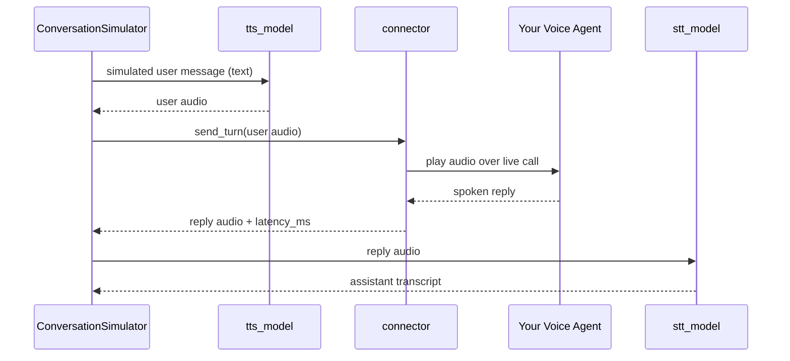

Voice mode lets the `ConversationSimulator` talk to **voice agents** instead of text chatbots. Rather than wrapping your application in a `model_callback`, you pass a `VoiceConfig`: each simulated user turn is spoken aloud (text-to-speech), streamed to your agent over a live connection, and your agent's spoken reply is recorded and transcribed (speech-to-text) back into the conversation.

```python title="main.py" showLineNumbers
from deepeval.voice import VoiceConfig, ElevenLabsConnector
from deepeval.simulator import ConversationSimulator
from deepeval.dataset import ConversationalGolden

conversation_golden = ConversationalGolden(
    scenario="Andy Byron wants to purchase a VIP ticket to a cold play concert.",
    expected_outcome="Successful purchase of a ticket.",
    user_description="Andy Byron is the CEO of Astronomer.",
)

simulator = ConversationSimulator(
    voice_config=VoiceConfig(
        connector=ElevenLabsConnector(agent_id="your-agent-id"),
    ),
)
conversational_test_cases = simulator.simulate(conversational_goldens=[conversation_golden])
print(conversational_test_cases)
```

The result is the same list of `ConversationalTestCase`s you get from a text simulation — ready for `deepeval`'s multi-turn metrics — except every `Turn` also carries the actual audio that was spoken, and every assistant `Turn` records how long your agent took to respond.

::::tip
New to voice evaluation? [Voice](/docs/evaluation-voice) in the concepts section explains the ideas this page builds on — speech models, transports, protocols, and the connector architecture.
::::

## How It Works

In voice mode, the simulator model still role-plays the user and generates each user message as text. The difference is what happens between the simulated user and your agent:

- The user message is synthesized into speech by the `tts_model`.
- The audio is sent to your voice agent through the `connector`, which holds one live call per conversation (connected before the first turn, disconnected when the conversation ends).
- The connector captures your agent's spoken reply and measures its response latency.
- If the connector doesn't surface a transcript itself, the reply audio is transcribed by the `stt_model`.
- Both sides of the exchange are recorded on the conversation's `Turn`s.



Everything else about the simulation — scenario-driven user turns, [stopping logic](/docs/conversation-simulator-stopping-logic), [simulation graphs](/docs/conversation-simulator-simulation-graph), and [lifecycle hooks](/docs/conversation-simulator-lifecycle-hooks) — works exactly as in text mode.

## Configure Voice Mode

`voice_config` and `model_callback` are mutually exclusive: provide exactly one. There are **ONE** mandatory and **FOUR** optional parameters when creating a `VoiceConfig`:

- `connector`: a `BaseVoiceConnector` that carries audio to and from your voice agent. See [protocols and connectors](#protocols) below.
- [Optional] `tts_model`: a `DeepEvalBaseTTS` model that speaks the simulated user's messages. Defaulted to `OpenAITTSModel`. See [TTS and STT models](#tts-and-stt-models).
- [Optional] `stt_model`: a `DeepEvalBaseSTT` model that transcribes your agent's spoken replies. Defaulted to `OpenAISTTModel`. See [TTS and STT models](#tts-and-stt-models).
- [Optional] `output_dir`: the directory to save conversation audio files into, or `None` to skip writing audio to disk. Defaulted to `"voice_simulations"`.
- [Optional] `combine_audio`: a boolean which when set to `True`, also writes a single stitched WAV file of the full conversation. Defaulted to `True`.

```python
from deepeval.voice import VoiceConfig, ElevenLabsConnector
from deepeval.simulator import ConversationSimulator

voice_config = VoiceConfig(
    connector=ElevenLabsConnector(agent_id="your-agent-id"),
    output_dir="voice_simulations",
    combine_audio=True,
)
simulator = ConversationSimulator(voice_config=voice_config)
```

::::note
Voice mode requires `async_mode=True` (the default), and conversations run one at a time regardless of `max_concurrent` — a connector holds a single live call, and concurrent conversations would interleave audio on the same session.
::::

## TTS and STT Models

Voice mode introduces two speech models that sit on opposite sides of the connector (see [Voice concepts](/docs/evaluation-voice#speech-models) for why these are separate model families from LLMs, with their own base classes):

| Config field | Base class        | Role                                                            | Default                                       | Its quality affects                                                                                                             |
| ------------ | ----------------- | --------------------------------------------------------------- | --------------------------------------------- | ------------------------------------------------------------------------------------------------------------------------------ |
| `tts_model`  | `DeepEvalBaseTTS` | Speaks the **simulated user's** messages to your agent          | `OpenAITTSModel` (`gpt-4o-mini-tts`, `alloy`) | What your agent hears. Unclear or unnatural speech degrades your agent's own speech recognition and skews the whole simulation. |
| `stt_model`  | `DeepEvalBaseSTT` | Transcribes **your agent's** spoken replies into `Turn.content` | `OpenAISTTModel` (`gpt-4o-transcribe`)        | Transcript fidelity. Every multi-turn metric judges this transcript, so STT accuracy directly bounds evaluation quality.        |

Two details worth knowing:

- **STT is skipped when the connector already carries a transcript.** Some platforms (like ElevenLabs) send the agent's own transcript alongside its audio; when present, it becomes `Turn.content` directly and your `stt_model` is never called for that turn.
- **Speech costs are tracked separately** from the simulator model's LLM cost: after a run, `simulator.tts_cost` and `simulator.stt_cost` hold the accumulated TTS and STT spend.

### Using Custom Speech Models

The OpenAI defaults are convenient, but dedicated speech providers (Deepgram, AssemblyAI, ElevenLabs, Cartesia, etc.) often matter more here than for LLM evals — especially STT, since transcription accuracy caps how faithfully your metrics see the conversation. To use one, subclass the corresponding base class:

```python
from deepeval.models.base_model import DeepEvalBaseTTS, DeepEvalBaseSTT
from deepeval.test_case import Audio

class MyTTSModel(DeepEvalBaseTTS):
    def synthesize(self, text: str, **kwargs) -> tuple[Audio, float | None]:
        audio_bytes = my_tts_provider.speak(text)
        return Audio.from_bytes(audio_bytes, mimeType="audio/wav"), None

    async def a_synthesize(self, text: str, **kwargs) -> tuple[Audio, float | None]:
        return self.synthesize(text, **kwargs)

    def load_model(self):
        return self

    def get_model_name(self) -> str:
        return "my-tts-model"


class MySTTModel(DeepEvalBaseSTT):
    def transcribe(self, audio: Audio, **kwargs) -> tuple[str, float | None]:
        return my_stt_provider.transcribe(audio.get_bytes()), None

    async def a_transcribe(self, audio: Audio, **kwargs) -> tuple[str, float | None]:
        return self.transcribe(audio, **kwargs)

    def load_model(self):
        return self

    def get_model_name(self) -> str:
        return "my-stt-model"
```

Both `synthesize` and `transcribe` return a tuple of the result and an optional cost, which feeds `tts_cost` / `stt_cost` accounting. Pass instances to `VoiceConfig(tts_model=MyTTSModel(), stt_model=MySTTModel(), ...)`.

## Connectors

A connector manages the live call: it establishes the connection, plays the simulated user's audio to your agent, captures the spoken reply, and measures response latency. Every connector declares the transport it speaks via a `protocol` class variable of type `VoiceProtocol` — see [Voice concepts](/docs/evaluation-voice#transports) for the full transport landscape and how protocols define timing semantics.

Pick the connector that matches where your agent is deployed:

| Connector                | `VoiceProtocol` | Talks to                                                                     |
| ------------------------ | --------------- | ---------------------------------------------------------------------------- |
| `ElevenLabsConnector`    | `WEBSOCKET`     | ElevenLabs conversational agents, by `agent_id`.                              |
| `LiveKitConnector`       | `WEBRTC`        | Agents deployed in LiveKit rooms.                                             |
| `WebSocketConnector`     | `WEBSOCKET`     | Any custom agent that speaks raw audio over a WebSocket.                      |
| `CallbackVoiceConnector` | `CALLBACK`      | An in-process Python callable — no network, ideal for testing your pipeline.  |

### ElevenLabs

Connects to an ElevenLabs conversational agent. Reads `ELEVENLABS_API_KEY` from the environment when `api_key` is not passed.

```python
from deepeval.voice import ElevenLabsConnector

connector = ElevenLabsConnector(agent_id="your-agent-id")
```

### LiveKit

Joins a LiveKit room as a participant and exchanges audio with your agent over WebRTC. Reads `LIVEKIT_URL`, `LIVEKIT_API_KEY`, and `LIVEKIT_API_SECRET` from the environment when not passed. Requires the `livekit` extra:

```bash
pip install "deepeval[livekit]"
```

```python
from deepeval.voice import LiveKitConnector

connector = LiveKitConnector(agent_name="restaurant-agent")
```

### Generic WebSocket

For custom agents that accept and emit raw audio over a WebSocket, `WebSocketConnector` lets you describe your agent's message shape — which JSON keys carry audio in and out, whether frames are binary, and what marks the end of a turn.

```python
from deepeval.voice import WebSocketConnector

connector = WebSocketConnector(
    url="wss://your-agent.example.com/audio",
    send_key="audio",
    receive_audio_key="audio",
    turn_complete_type="turn_end",
)
```

### Callback

Wraps an in-process Python callable, so you can exercise the full TTS → agent → STT pipeline without any network transport — useful for testing your simulation setup before pointing it at a deployed agent.

```python
from deepeval.voice import CallbackVoiceConnector
from deepeval.voice.connectors import ConnectorTurn

async def my_agent(user_audio) -> ConnectorTurn:
    reply_audio = await your_voice_agent(user_audio)
    return ConnectorTurn(audio=reply_audio)

connector = CallbackVoiceConnector(my_agent)
```

## What A Voice Simulation Produces

Each simulated conversation is returned as a regular `ConversationalTestCase`, enriched with voice data:

- `voice` on the test case is set to `True`.
- Every user `Turn` carries the synthesized `audio` that was played to your agent.
- Every assistant `Turn` carries your agent's reply `audio`, the transcript as `content`, and the measured response time in `latency_ms`.

Unless `output_dir` is `None`, the audio is also written to disk — one file per turn, plus a combined recording of the whole conversation when `combine_audio=True`:

```text
voice_simulations/
└── simulation-2026-08-10_12-30-00/
    ├── deepeval-turn-1-user.wav
    ├── deepeval-turn-1-assistant.wav
    ├── deepeval-turn-2-user.wav
    ├── deepeval-turn-2-assistant.wav
    └── deepeval-conversation.wav
```

When simulating multiple goldens in one run, each conversation gets its own sub-folder named after the golden's `name` (or `conversation-<index>` when unnamed).

::::tip
Because the output is a standard `ConversationalTestCase`, you can evaluate simulated voice conversations with the same multi-turn metrics you already use for text — the transcript lives in each `Turn`'s `content`.
::::

## FAQs

<FAQs
  qas={[
    {
      question: "Do I still need a model callback in voice mode?",
      answer: (
        <>
          No — <code>voice_config</code> replaces <code>model_callback</code>, and
          providing both raises an error. In voice mode the simulator talks to your
          agent through the <code>connector</code> instead of a Python callback.
        </>
      ),
    },
    {
      question: "Which TTS and STT models are used by default?",
      answer: (
        <>
          OpenAI's — <code>OpenAITTSModel</code> speaks the simulated user and{" "}
          <code>OpenAISTTModel</code> transcribes your agent's replies, both using
          your <code>OPENAI_API_KEY</code>. Swap in any custom model by subclassing{" "}
          <code>DeepEvalBaseTTS</code> or <code>DeepEvalBaseSTT</code> and passing it
          to <code>VoiceConfig</code>.
        </>
      ),
    },
    {
      question: "How is latency measured?",
      answer: (
        <>
          The connector measures the time from sending the user's audio to
          capturing the end of your agent's spoken reply, and records it as{" "}
          <code>latency_ms</code> on the assistant <code>Turn</code>. How
          end-of-turn is detected (silence thresholds, turn-complete events) is
          defined per <code>VoiceProtocol</code>, so latencies are comparable
          across connectors that share a protocol — but not across different
          protocols.
        </>
      ),
    },
    {
      question: "Why do voice simulations run one conversation at a time?",
      answer: (
        <>
          A connector holds a single live call, so running conversations
          concurrently would interleave audio on the same session. The simulator
          forces sequential execution in voice mode regardless of{" "}
          <code>max_concurrent</code>.
        </>
      ),
    },
    {
      question: "My agent isn't on ElevenLabs or LiveKit — can I still simulate it?",
      answer: (
        <>
          Yes. If it accepts raw audio over a WebSocket, configure the generic{" "}
          <code>WebSocketConnector</code> with your message shape. If it runs
          in-process, wrap it in a <code>CallbackVoiceConnector</code>. For other
          transports, subclass <code>BaseVoiceConnector</code> and declare its{" "}
          <code>protocol</code>.
        </>
      ),
    },
  ]}
/>
