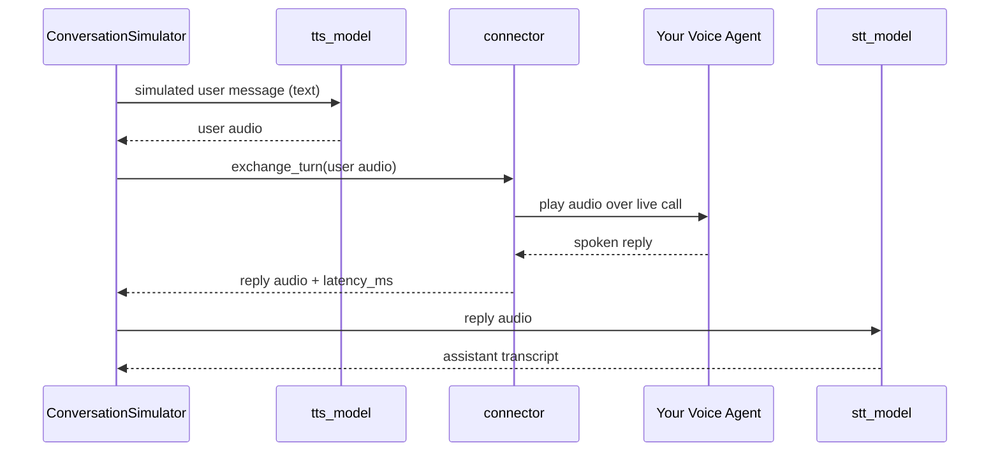

Voice mode lets the `ConversationSimulator` talk to **voice agents** instead of text chatbots. Rather than wrapping your application in a `model_callback`, you pass a `VoiceConfig`: each simulated user turn is spoken aloud (text-to-speech), streamed to your agent over a live connection, and your agent's spoken reply is recorded and transcribed (speech-to-text) back into the conversation.

The result is the same list of `ConversationalTestCase`s you get from a text simulation — ready for `deepeval`'s multi-turn metrics — except every `Turn` also carries the actual audio that was spoken, and every assistant `Turn` records how long your agent took to respond.

::::tip
New to voice evaluation? [Voice](/docs/evaluation-voice) in the concepts section explains the ideas this page builds on — speech models, transports, connectors, voice fields on `ConversationalTestCase`s, and interruptions.
::::

## How It Works

In voice mode, the simulator model still role-plays the user and generates each user message as text. The difference is what happens between the simulated user and your agent:

- The user message is synthesized into speech by the `tts_model`.
- The audio is sent to your voice agent through the `connector`, which holds one live call per conversation (connected before the first turn, disconnected when the conversation ends).
- The connector captures your agent's spoken reply and measures its response latency.
- If the connector doesn't surface a transcript itself, the reply audio is transcribed by the `stt_model`.
- Both sides of the exchange are recorded on the conversation's `Turn`s.



By default this loop is **half-duplex (no interruptions; each side takes a turn)**. To exercise barge-in, see [Interruptions](/docs/conversation-simulator-voice-interruptions).

Who does the talking on the simulated side — their voice, their temperament, the noise around them — comes from the golden's [`Persona`](/docs/conversation-simulator-voice-personas).

Everything else about the simulation — scenario-driven user turns, [stopping logic](/docs/conversation-simulator-stopping-logic), [simulation graphs](/docs/conversation-simulator-simulation-graph), and [lifecycle hooks](/docs/conversation-simulator-lifecycle-hooks) — works exactly as in text mode.

## Setup Voice Mode

In `deepeval`'s `ConversationSimulator`, `voice_config` and `model_callback` are mutually exclusive: provide exactly one.

Start by choosing the connector that matches your deployed voice agent. `deepeval` provides connectors for ElevenLabs conversational agents, LiveKit agents, compatible raw-audio WebSockets, and in-process Python callables. You only need to implement a custom connector when none of these can reach your agent; see [Voice Connectors](/docs/conversation-simulator-voice-connectors).

The example below connects to an existing **ElevenLabs conversational agent**. `ElevenLabsConnector` is the bridge to that agent — it is not the TTS or STT model used by the simulator.

```python
from deepeval.voice import VoiceConfig, ElevenLabsConnector
from deepeval.simulator import ConversationSimulator

voice_config = VoiceConfig(
    connector=ElevenLabsConnector(agent_id="your-agent-id"),
    combine_audio_files=True,
)
simulator = ConversationSimulator(voice_config=voice_config)
```

There are **ONE** mandatory and **FOUR** optional parameters when creating a `VoiceConfig`:

- `connector`: a [`BaseVoiceConnector`](/docs/conversation-simulator-voice-connectors) that carries audio to and from your voice agent.
- [Optional] `tts_model`: a [`DeepEvalBaseTTS`](#tts-and-stt-models) that speaks the simulated user's messages. Defaulted to `OpenAITTSModel`.
- [Optional] `stt_model`: a [`DeepEvalBaseSTT`](#tts-and-stt-models) that transcribes your agent's spoken replies. Defaulted to `OpenAISTTModel`.
- [Optional] `output_dir`: a string directory to save conversation audio files into, or `None` to skip writing audio to disk. Left unset, it falls back to the `DEEPEVAL_VOICE_FOLDER` [environment variable](/docs/environment-variables) and then to `".deepeval-voice-simulations"`.
- [Optional] `combine_audio_files`: a boolean which when set to `True` (and `output_dir` is set), also writes a single stitched WAV of the full conversation alongside the per-turn files. Has no effect when `output_dir` is `None`. Defaulted to `True`.

::::tip
The connector in `VoiceConfig` determines how `deepeval` reaches your agent. The [`Persona`](/docs/conversation-simulator-voice-personas) on each `ConversationalGolden` determines who calls it — their voice, background noise, whether they interrupt, whether they speak first, and when they hang up.
::::

::::note
Voice mode requires `async_mode=True` (the default), and conversations run one at a time regardless of `max_concurrent` — a connector holds a single live call, and concurrent conversations would interleave audio on the same session.
::::

## TTS and STT Models

Voice mode introduces two speech models that sit on opposite sides of the connector (see [Voice concepts](/docs/evaluation-voice#speech-models) for why these are separate model families from LLMs, with their own base classes):

| Config field | Base class        | Role                                                            | Default                                       | Its quality affects                                                                                                             |
| ------------ | ----------------- | --------------------------------------------------------------- | --------------------------------------------- | ------------------------------------------------------------------------------------------------------------------------------- |
| `tts_model`  | `DeepEvalBaseTTS` | Speaks the **simulated user's** messages to your agent          | `OpenAITTSModel` (`gpt-4o-mini-tts`, `alloy`) | What your agent hears. Unclear or unnatural speech degrades your agent's own speech recognition and skews the whole simulation. |
| `stt_model`  | `DeepEvalBaseSTT` | Transcribes **your agent's** spoken replies into `Turn.content` | `OpenAISTTModel` (`gpt-4o-transcribe`)        | Transcript fidelity. Every multi-turn metric judges this transcript, so STT accuracy directly bounds evaluation quality.        |

STT is skipped when the connector already carries a transcript. Some platforms, including ElevenLabs, send the agent's transcript alongside its audio. When present, it becomes `Turn.content` directly and the `stt_model` is not called for that turn.

Speech costs are tracked separately from the simulator model's LLM cost. After a run, `simulator.tts_cost` and `simulator.stt_cost` contain the accumulated TTS and STT spend.

### Using Custom Speech Models

The OpenAI defaults are convenient, but dedicated speech providers (Deepgram, AssemblyAI, ElevenLabs, Cartesia, etc.) often matter more here than for LLM evals — especially STT, since transcription accuracy caps how faithfully your metrics see the conversation. To use one, subclass the corresponding base class:

```python
from deepeval.models.base_model import DeepEvalBaseTTS, DeepEvalBaseSTT
from deepeval.test_case import Audio

class MyTTSModel(DeepEvalBaseTTS):
    def synthesize(self, text: str, **kwargs) -> tuple[Audio, float | None]:
        audio_bytes = my_tts_provider.speak(text)
        return Audio.from_bytes(audio_bytes, mimeType="audio/wav"), None

    async def a_synthesize(self, text: str, **kwargs) -> tuple[Audio, float | None]:
        return self.synthesize(text, **kwargs)

    def load_model(self):
        return self

    def get_model_name(self) -> str:
        return "my-tts-model"


class MySTTModel(DeepEvalBaseSTT):
    def transcribe(self, audio: Audio, **kwargs) -> tuple[str, float | None]:
        return my_stt_provider.transcribe(audio.get_bytes()), None

    async def a_transcribe(self, audio: Audio, **kwargs) -> tuple[str, float | None]:
        return self.transcribe(audio, **kwargs)

    def load_model(self):
        return self

    def get_model_name(self) -> str:
        return "my-stt-model"
```

Both `synthesize` and `transcribe` return a tuple of the result and an optional cost, which feeds `tts_cost` / `stt_cost` accounting. Pass instances to `VoiceConfig(tts_model=MyTTSModel(), stt_model=MySTTModel(), ...)`.

STT models also carry one voice-specific knob, `truncated_audio_pad_seconds`. When an [interruption](/docs/conversation-simulator-voice-interruptions) cuts your agent off mid-word, autoregressive transcribers tend to finish the clipped word and punctuate the sentence — putting speech in `Turn.content` that the caller never heard. Appending a little silence presents the clip as a whole utterance and curbs the guessing:

```python
class MySTTModel(DeepEvalBaseSTT):
    truncated_audio_pad_seconds = 0.3  # 0.0 (the default) transcribes as-is
```

The padding is used only for transcription, never for the audio saved on the turn, so durations and timings stay true to what was spoken. `OpenAISTTModel` sets `0.3`; leave it at `0.0` for transcribers that don't complete words.

## What A Voice Simulation Produces

Each simulated conversation is returned as a regular `ConversationalTestCase`, enriched with voice data:

- `voice` is set to `True`.
- Every user `Turn` carries the synthesized `audio` that was played to your agent.
- Every assistant `Turn` carries your agent's reply `audio`, the transcript as `content`, and the measured response time in `latency_ms`.
- When [interruptions](/docs/conversation-simulator-voice-interruptions) are enabled, an assistant turn cut short by a barge-in gets `interrupted=True`. Frustrated barges can also surface on user turns via `metadata`.

Unless `output_dir` is `None`, the audio is also written to disk — one file per turn, plus a combined recording of the whole conversation when `combine_audio_files=True`:

```text
.deepeval-voice-simulations/
└── simulation-2026-08-10_12-30-00/
    ├── deepeval-turn-1-user.wav
    ├── deepeval-turn-1-assistant.wav
    ├── deepeval-turn-2-user.wav
    ├── deepeval-turn-2-assistant.wav
    └── deepeval-conversation.wav
```

When simulating multiple goldens in one run, each conversation gets its own sub-folder named after the golden's `name` (or `conversation-<index>` when unnamed).

Set `DEEPEVAL_VOICE_FOLDER` to keep recordings somewhere else — a scratch disk, or a path outside the repo — without changing code. An explicit `VoiceConfig(output_dir=...)` overrides it, and `DEEPEVAL_FILE_SYSTEM=READ_ONLY` overrides both, writing nothing at all.

::::tip
Because the output is a standard `ConversationalTestCase`, you can evaluate simulated voice conversations with the same multi-turn metrics you already use for text — the transcript lives in each `Turn`'s `content`.
::::

## FAQs

<FAQs
  qas={[
    {
      question: "Do I still need a model callback in voice mode?",
      answer: (
        <>
          No — <code>voice_config</code> replaces <code>model_callback</code>,
          and providing both raises an error. In voice mode the simulator talks
          to your agent through the <code>connector</code> instead of a Python
          callback.
        </>
      ),
    },
    {
      question: "Which TTS and STT models are used by default?",
      answer: (
        <>
          OpenAI's — <code>OpenAITTSModel</code> speaks the simulated user and{" "}
          <code>OpenAISTTModel</code> transcribes your agent's replies, both
          using your <code>OPENAI_API_KEY</code>. Swap in any custom model by
          subclassing <code>DeepEvalBaseTTS</code> or{" "}
          <code>DeepEvalBaseSTT</code> and passing it to{" "}
          <code>VoiceConfig</code>.
        </>
      ),
    },
    {
      question: "How is latency measured?",
      answer: (
        <>
          The connector measures the time from sending the user's audio to the
          agent's first non-silent audio, and records it as{" "}
          <code>latency_ms</code> on the assistant <code>Turn</code>. How
          end-of-turn is detected (silence thresholds, turn-complete events) is
          defined per <code>VoiceProtocol</code>, so latencies are comparable
          across connectors that share a protocol — but not across different
          protocols.
        </>
      ),
    },
    {
      question: "Why do voice simulations run one conversation at a time?",
      answer: (
        <>
          A connector holds a single live call, so running conversations
          concurrently would interleave audio on the same session. The simulator
          forces sequential execution in voice mode regardless of{" "}
          <code>max_concurrent</code>.
        </>
      ),
    },
    {
      question:
        "My agent isn't on ElevenLabs or LiveKit — can I still simulate it?",
      answer: (
        <>
          Yes. On the Voice Connectors page, use the generic{" "}
          <code>WebSocketConnector</code> for raw-audio agents, wrap an
          in-process callable with <code>CallbackVoiceConnector</code>, or
          subclass <code>BaseVoiceConnector</code> for other transports.
        </>
      ),
    },
  ]}
/>
