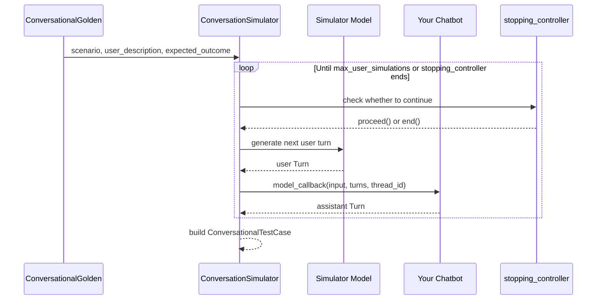

`deepeval`'s `ConversationSimulator` allows you to simulate full conversations between a fake user and your chatbot, unlike the [synthesizer](/docs/golden-synthesizer) which generates regular goldens representing single, atomic LLM interactions.

```python title="main.py" showLineNumbers
from deepeval.test_case import Turn
from deepeval.simulator import ConversationSimulator
from deepeval.dataset import ConversationalGolden

# Create ConversationalGolden
conversation_golden = ConversationalGolden(
    scenario="Andy Byron wants to purchase a VIP ticket to a cold play concert.",
    expected_outcome="Successful purchase of a ticket.",
    user_description="Andy Byron is the CEO of Astronomer.",
)

# Define chatbot callback
async def chatbot_callback(input):
    return Turn(role="assistant", content=f"Chatbot response to: {input}")

# Run Simulation
simulator = ConversationSimulator(model_callback=chatbot_callback)
conversational_test_cases = simulator.simulate(conversational_goldens=[conversation_golden])
print(conversational_test_cases)
```

The `ConversationSimulator` uses the scenario and user description from a `ConversationalGolden` to simulate back-and-forth exchanges with your chatbot. The resulting dialogue is used to create `ConversationalTestCase`s for evaluation using `deepeval`'s multi-turn metrics.

## How It Works

The `ConversationSimulator` repeatedly generates a simulated user turn, sends it to your chatbot, and records the assistant response until the simulation ends.

- Each `ConversationalGolden` defines the scenario, user profile, and expected outcome for a conversation.
- The simulator model role-plays the user and generates each next user message.
- Your `model_callback` sends that message to your chatbot and returns an assistant `Turn`.
- The simulator stops when `max_user_simulations` is reached or the `stopping_controller` decides the conversation should end.
- The final conversation is packaged as a `ConversationalTestCase` for multi-turn evaluation.



## Create Your First Simulator

To create a `ConversationSimulator`, you'll need to define a callback that wraps around your LLM chatbot. See [Model Callback](/docs/conversation-simulator-model-callback) for supported callback arguments.

```python
from deepeval.test_case import Turn
from deepeval.simulator import ConversationSimulator

async def model_callback(input: str) -> Turn:
    return Turn(role="assistant", content=f"I don't know how to answer this: {input}")

simulator = ConversationSimulator(model_callback=model_callback)
```

There are **ONE** mandatory and **FOUR** optional parameters when creating a `ConversationSimulator`:

- `model_callback`: a callback that wraps around your conversational agent.
- [Optional] `simulator_model`: a string specifying which of OpenAI's GPT models to use for generation, **OR** [any custom LLM model](/docs/metrics-introduction#using-a-custom-llm) of type `DeepEvalBaseLLM`. Defaulted to <DefaultLLMModel />.
- [Optional] `async_mode`: a boolean which when set to `True`, enables **concurrent simulation of conversations**. Defaulted to `True`.
- [Optional] `max_concurrent`: an integer that determines the maximum number of conversations that can be generated in parallel at any point in time. You can decrease this value if you're running into rate limit errors. Defaulted to `100`.
- [Optional] `simulation_graph`: the root `SimulationNode` of a simulation graph for the simulated user. When omitted, `deepeval` falls back to an LLM-driven default node. Pass `default_simulation_node(template=MyTemplate)` here to use a [custom prompt template](/docs/conversation-simulator-custom-templates). See [Simulation Graph](/docs/conversation-simulator-simulation-graph).
- [Optional] `stopping_controller`: a callback that controls whether the simulation should continue or end. By default, `deepeval` uses the `expected_outcome` in your `ConversationalGolden` to decide when the conversation is complete. (Previously named `controller`, which is still accepted as a deprecated alias.)

## Simulate A Conversation

To simulate your first conversation, simply pass in a list of `ConversationalGolden`s to the `simulate` method:

```python
from deepeval.dataset import ConversationalGolden
...

conversation_golden = ConversationalGolden(
    scenario="Andy Byron wants to purchase a VIP ticket to a cold play concert.",
    expected_outcome="Successful purchase of a ticket.",
    user_description="Andy Byron is the CEO of Astronomer.",
)
conversational_test_cases = simulator.simulate(conversational_goldens=[conversation_golden])
```

There are **ONE** mandatory and **ONE** optional parameter when calling the `simulate` method:

- `conversational_goldens`: a list of `ConversationalGolden`s that specify the scenario and user description.
- [Optional] `max_user_simulations`: an integer that specifies the maximum number of user-assistant message cycles to simulate per conversation. Defaulted to `10`.

A simulation ends when `max_user_simulations` has been reached, when the `stopping_controller` decides the conversation should end, or when the `simulation_graph` reaches a `terminal=True` node. By default, the simulator checks whether the conversation has achieved the expected outcome outlined in a `ConversationalGolden`.

See [Stopping Logic](/docs/conversation-simulator-stopping-logic) to define your own stopping logic.

::::tip
You can also generate conversations from existing turns. Simply populate your `ConversationalGolden` with a list of initial `Turn`s, and the simulator will continue the conversation.
::::

## Incorporate Existing Turns

If your multi-turn chatbot has one or more predefined turns (for example, a hardcoded assistant message at the beginning of a conversation), you would simply include this as part of the simulation by providing a list of preexisting `turns` to a `ConversationalGolden`:

```python
from deepeval.test_case import ConversationalTestCase, Turn

golden = ConversationalGolden(turns=[Turn(role="assistant", content="Hi! How can I help you today?")])
```

By including a list of non-empty `turns`, `deepeval` will run simulations based on the additional context you've provided.

## Evaluate Simulated Turns

The `simulate` function returns a list of `ConversationalTestCase`s, which can be used to evaluate your LLM chatbot using `deepeval`'s conversational metrics. Use simulated conversations to run [end-to-end](/docs/evaluation-end-to-end-llm-evals) evaluations:

```python
from deepeval import evaluate
from deepeval.metrics import TurnRelevancyMetric
...

evaluate(test_cases=conversational_test_cases, metrics=[TurnRelevancyMetric()])
```

## Advanced Usage

Customize the simulator around your application's conversation state, stopping criteria, and post-processing needs.

- [Model Callback](/docs/conversation-simulator-model-callback): pass conversation history or `thread_id` into your chatbot so simulations exercise the same stateful path as production.
- [Simulation Graph](/docs/conversation-simulator-simulation-graph): drive the simulated user with a programmatic state machine instead of a flat LLM prompt — encode trajectories, retry budgets, and terminal success/failure states.
- [Stopping Logic](/docs/conversation-simulator-stopping-logic): replace expected-outcome stopping with business-specific logic such as tool calls, confirmation messages, or failure states.
- [Custom Templates](/docs/conversation-simulator-custom-templates): change the simulated user's style, domain framing, or pressure level by overriding the user-turn prompts.
- [Lifecycle Hooks](/docs/conversation-simulator-lifecycle-hooks): process each completed conversation immediately instead of waiting for the full simulation batch to finish.

## FAQs

<FAQs
  qas={[
    {
      question: "When should I use the `ConversationSimulator` instead of the `Synthesizer`?",
      answer: (
        <>
          Use <code>ConversationSimulator</code> when you need full multi-turn
          conversations between a fake user and your chatbot. The{" "}
          <a href="/docs/golden-synthesizer">synthesizer</a> generates regular
          goldens representing single, atomic LLM interactions, not back-and-forth
          dialogue.
        </>
      ),
    },
    {
      question: "What does a `ConversationalGolden` actually drive in a simulation?",
      answer: (
        <>
          Its <code>scenario</code>, <code>user_description</code>, and{" "}
          <code>expected_outcome</code> tell the simulator model who to role-play,
          what to attempt, and (by default) when the conversation is complete. The
          simulator generates each user turn from these fields and sends it to your{" "}
          <a href="/docs/conversation-simulator-model-callback">model_callback</a>.
        </>
      ),
    },
    {
      question: "What does `simulate()` return, and how do I seed an existing conversation?",
      answer: (
        <>
          It returns a list of <code>ConversationalTestCase</code>s you can pass
          straight into <code>evaluate</code> with multi-turn metrics. To seed a
          conversation, populate the <code>ConversationalGolden</code> with initial{" "}
          <code>turns</code> (such as a hardcoded opening assistant message) and the
          simulator continues from there.
        </>
      ),
    },
    {
      question: "When does a simulation stop?",
      answer: (
        <>
          When <code>max_user_simulations</code> is reached, when the{" "}
          <a href="/docs/conversation-simulator-stopping-logic">stopping_controller</a>{" "}
          returns <code>end()</code> (by default once the <code>expected_outcome</code>{" "}
          is met), or when a <code>simulation_graph</code> hits a{" "}
          <code>terminal=True</code> node — whichever fires first.
        </>
      ),
    },
    {
      question: "Can I use any model to power the simulated user?",
      answer: (
        <>
          Yes. <code>simulator_model</code> accepts any of OpenAI's GPT models by
          name, or{" "}
          <a href="/docs/metrics-introduction#using-a-custom-llm">any custom LLM</a>{" "}
          of type <code>DeepEvalBaseLLM</code>. Note it only powers the role-played
          user — your actual chatbot still runs through your{" "}
          <a href="/docs/conversation-simulator-model-callback">model_callback</a>.
        </>
      ),
    },
    {
      question: "Can my team run conversation simulations without code?",
      answer: (
        <>
          Yes. On <a href="https://www.confident-ai.com">Confident AI</a> you
          can simulate multi-turn conversations no-code — define scenarios and
          user personas, run simulations against your chatbot, experiment with
          variations, and collaborate on the resulting test cases as a team.
        </>
      ),
    },
  ]}
/>
