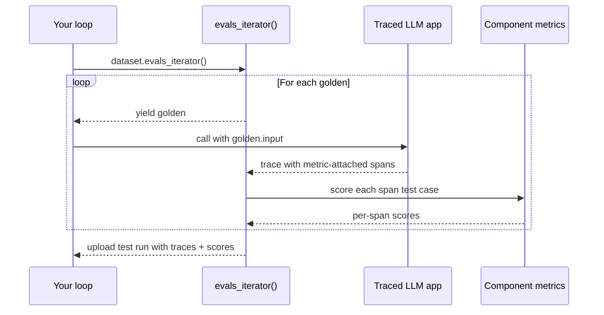

import { ASSETS } from "@site/src/assets";

Component-level evaluation grades **internal components** of your LLM app — retrievers, tool calls, LLM generations, sub-agents — instead of treating the whole system as a black box. The unit of evaluation is still an [`LLMTestCase`](/docs/evaluation-test-cases#llm-test-cases), but it's attached to a span (an `@observe`'d function or a framework-emitted span) rather than the whole trace.

<ImageDisplayer src={ASSETS.componentLevelEvals} alt="component level evals" />

If you haven't already, read the [end-to-end overview](/docs/evaluation-end-to-end-llm-evals) for the concepts and how component-level compares to end-to-end.

:::caution[Single-turn only]
Component-level evaluation is currently single-turn only. Multi-turn component-level evaluation is on the roadmap.
:::

:::info[Already using `evals_iterator()` for end-to-end?]
If you've already wired up [`evals_iterator()` with tracing](/docs/evaluation-end-to-end-single-turn#approach-1-evals_iterator-with-tracing-recommended), the only delta to go component-level is **attaching metrics to the spans you care about** — the integration tabs in [Instrument and evaluate](#instrument-and-evaluate) below show this inline.
:::

## How Component-Level Eval Works

Component-level runs use the exact same iterator + tracing setup as [single-turn end-to-end](/docs/evaluation-end-to-end-single-turn#approach-1-evals_iterator-with-tracing-recommended) — the only difference is **where metrics live**: on individual spans instead of (or in addition to) the trace as a whole.

1. Your traced LLM app emits a trace with multiple spans whenever it runs.
2. You attach metrics to the specific spans you want to grade (e.g. the retriever, a tool call, an inner LLM call).
3. `dataset.evals_iterator()` opens a test run and yields each golden one at a time.
4. Inside the loop, you call your traced app. Each emitted span that has metrics attached gets scored as one test case — many test cases per run of your app.
5. The trace + per-span test cases + metric scores upload together as one test run.



You can mix component-level and end-to-end in the same loop: pass `metrics=[...]` to `evals_iterator()` to score the trace itself, and attach metrics on individual spans to score components. Both flow into the same test run.

## Step-by-Step Guide

<Steps>
<Step>

### Build dataset

[Datasets](/docs/evaluation-datasets) in `deepeval` store [`Golden`s](/docs/evaluation-datasets#what-are-goldens) — precursors to test cases. You loop over goldens at evaluation time, run your LLM app on each, and the framework builds test cases from each emitted span.

<Tabs items={["In Code", "Pull from Confident AI", "Load from CSV", "Load from JSON"]}>
<Tab value="In Code">

```python
from deepeval.dataset import Golden, EvaluationDataset

goldens = [
    Golden(input="What is your name?"),
    Golden(input="Choose a number between 1 and 100"),
    # ...
]

dataset = EvaluationDataset(goldens=goldens)
```

The dataset lives only for this run — no push, no save. Perfect for quickstarts and one-off evaluations.

</Tab>
<Tab value="Pull from Confident AI">

```python
from deepeval.dataset import EvaluationDataset

dataset = EvaluationDataset()
dataset.pull(alias="My dataset")
```

</Tab>
<Tab value="Load from CSV">

```python
from deepeval.dataset import EvaluationDataset

dataset = EvaluationDataset()
dataset.add_goldens_from_csv_file(
    file_path="example.csv",
    input_col_name="query",
)
```

</Tab>
<Tab value="Load from JSON">

```python
from deepeval.dataset import EvaluationDataset

dataset = EvaluationDataset()
dataset.add_goldens_from_json_file(
    file_path="example.json",
    input_key_name="query",
)
```

</Tab>
</Tabs>

:::tip
This page covers **sourcing** goldens for an eval run only. To **persist** a dataset (push to Confident AI, save as CSV/JSON, version it across runs), see [the datasets page](/docs/evaluation-datasets).
:::

</Step>

<Step>

### Instrument/trace and evaluate

Instrument your AI agent based on your tech stack. The loop captures one trace per golden so the component metrics you attach get scored on the spans inside.

Each integration ships **Async** (default — fastest) and **Sync** variants:

- **Async** keeps `evals_iterator()` on its default async dispatch and wraps each invocation in `asyncio.create_task(...)` + `dataset.evaluate(task)` so goldens run concurrently.
- **Sync** passes `AsyncConfig(run_async=False)` and runs the loop body one golden at a time. Useful for debugging, rate-limited providers, or anywhere asyncio gets in the way (e.g. some Jupyter setups).

<Tabs items={["Manual Instrumentation", "LangChain", "LangGraph", "OpenAI", "Pydantic AI", "AgentCore", "Strands", "Anthropic", "LlamaIndex", "OpenAI Agents", "Google ADK", "CrewAI"]}>
<Tab value="Manual Instrumentation">

Wrap the top-level function with `@observe`, set trace-level fields with `update_current_trace(...)`, and wrap inner functions you want to grade with `@observe` too. Attach a component metric by passing `metrics=[...]` to `@observe` and registering its test case with `update_current_span(test_case=...)`:

<Tabs items={["Async", "Sync"]}>
<Tab value="Async">

```python title="main.py" showLineNumbers
import asyncio
from deepeval.tracing import observe, update_current_span, update_current_trace
from deepeval.test_case import LLMTestCase
from deepeval.metrics import AnswerRelevancyMetric
...

@observe()
async def my_ai_agent(query: str) -> str:
    chunks = await retrieve(query)
    answer = await generate(query, chunks)
    update_current_trace(input=query, output=answer)
    return answer

@observe()
async def retrieve(query: str) -> list[str]:
    return ["..."]

@observe(metrics=[AnswerRelevancyMetric()])
async def generate(query: str, chunks: list[str]) -> str:
    response = "..."  # await your LLM call here with `query` and `chunks`
    update_current_span(
        test_case=LLMTestCase(input=query, actual_output=response, retrieval_context=chunks),
    )
    return response

for golden in dataset.evals_iterator():
    task = asyncio.create_task(my_ai_agent(golden.input))
    dataset.evaluate(task)
```

</Tab>
<Tab value="Sync">

```python title="main.py" showLineNumbers
from deepeval.evaluate import AsyncConfig
from deepeval.tracing import observe, update_current_span, update_current_trace
from deepeval.test_case import LLMTestCase
from deepeval.metrics import AnswerRelevancyMetric
...

@observe()
def my_ai_agent(query: str) -> str:
    chunks = retrieve(query)
    answer = generate(query, chunks)
    update_current_trace(input=query, output=answer)
    return answer

@observe()
def retrieve(query: str) -> list[str]:
    return ["..."]

@observe(metrics=[AnswerRelevancyMetric()])
def generate(query: str, chunks: list[str]) -> str:
    response = "..."  # call your LLM here with `query` and `chunks`
    update_current_span(
        test_case=LLMTestCase(input=query, actual_output=response, retrieval_context=chunks),
    )
    return response

for golden in dataset.evals_iterator(async_config=AsyncConfig(run_async=False)):
    my_ai_agent(golden.input)
```

</Tab>
</Tabs>

The same pattern works on any `@observe`'d function — retrievers, tool wrappers, sub-agents. See [tracing](/docs/evaluation-llm-tracing) for the full surface.

</Tab>
<Tab value="LangChain">

Build your agent with `create_agent`, then pass `deepeval`'s `CallbackHandler` to its `invoke` / `ainvoke` method inside the loop. Stage a component metric for the next LLM call with `next_llm_span(...)` — the `CallbackHandler` drains it onto the first LLM span LangChain opens during the agent run:

<Tabs items={["Async", "Sync"]}>
<Tab value="Async">

```python title="langchain_app.py" showLineNumbers
import asyncio
from langchain.agents import create_agent
from deepeval.tracing import next_llm_span
from deepeval.integrations.langchain import CallbackHandler
from deepeval.metrics import AnswerRelevancyMetric
...

def multiply(a: int, b: int) -> int:
    """Multiply two numbers."""
    return a * b

agent = create_agent(
    model="openai:gpt-4o-mini",
    tools=[multiply],
    system_prompt="Be concise.",
)

async def run_agent(prompt: str):
    with next_llm_span(metrics=[AnswerRelevancyMetric()]):
        return await agent.ainvoke(
            {"messages": [{"role": "user", "content": prompt}]},
            config={"callbacks": [CallbackHandler()]},
        )

for golden in dataset.evals_iterator():
    task = asyncio.create_task(run_agent(golden.input))
    dataset.evaluate(task)
```

</Tab>
<Tab value="Sync">

```python title="langchain_app.py" showLineNumbers
from langchain.agents import create_agent
from deepeval.tracing import next_llm_span
from deepeval.evaluate import AsyncConfig
from deepeval.integrations.langchain import CallbackHandler
from deepeval.metrics import AnswerRelevancyMetric
...

def multiply(a: int, b: int) -> int:
    """Multiply two numbers."""
    return a * b

agent = create_agent(
    model="openai:gpt-4o-mini",
    tools=[multiply],
    system_prompt="Be concise.",
)

for golden in dataset.evals_iterator(async_config=AsyncConfig(run_async=False)):
    with next_llm_span(metrics=[AnswerRelevancyMetric()]):
        agent.invoke(
            {"messages": [{"role": "user", "content": golden.input}]},
            config={"callbacks": [CallbackHandler()]},
        )
```

</Tab>
</Tabs>

`next_llm_span` is one-shot — only the first LLM span in the agent run picks up the metric, so later turns inside `create_agent`'s loop won't be scored. To score every LLM call, drive the loop yourself (`next_llm_span` per `agent.invoke(...)`) or score end-to-end with trace-level metrics on `CallbackHandler(metrics=[...])`. For retrievers, use `next_retriever_span(...)` the same way; for deterministic tool calls, prefer `next_tool_span(...)` + `update_current_span(...)`. See the [LangChain integration](/integrations/frameworks/langchain) for the full surface.

</Tab>
<Tab value="LangGraph">

Wire your `StateGraph`, then pass `deepeval`'s `CallbackHandler` to its `invoke` / `ainvoke` method inside the loop. Stage a component metric for the next LLM call with `next_llm_span(...)` — the `CallbackHandler` drains it onto the first LLM span LangGraph opens during the graph run:

<Tabs items={["Async", "Sync"]}>
<Tab value="Async">

```python title="langgraph_app.py" showLineNumbers
import asyncio
from langchain.chat_models import init_chat_model
from langgraph.graph import StateGraph, MessagesState, START, END
from deepeval.tracing import next_llm_span
from deepeval.integrations.langchain import CallbackHandler
from deepeval.metrics import AnswerRelevancyMetric
...

llm = init_chat_model("openai:gpt-4o-mini")

async def chatbot(state: MessagesState):
    return {"messages": [await llm.ainvoke(state["messages"])]}

graph = (
    StateGraph(MessagesState)
    .add_node(chatbot)
    .add_edge(START, "chatbot")
    .add_edge("chatbot", END)
    .compile()
)

async def run_graph(prompt: str):
    with next_llm_span(metrics=[AnswerRelevancyMetric()]):
        return await graph.ainvoke(
            {"messages": [{"role": "user", "content": prompt}]},
            config={"callbacks": [CallbackHandler()]},
        )

for golden in dataset.evals_iterator():
    task = asyncio.create_task(run_graph(golden.input))
    dataset.evaluate(task)
```

</Tab>
<Tab value="Sync">

```python title="langgraph_app.py" showLineNumbers
from langchain.chat_models import init_chat_model
from langgraph.graph import StateGraph, MessagesState, START, END
from deepeval.tracing import next_llm_span
from deepeval.evaluate import AsyncConfig
from deepeval.integrations.langchain import CallbackHandler
from deepeval.metrics import AnswerRelevancyMetric
...

llm = init_chat_model("openai:gpt-4o-mini")

def chatbot(state: MessagesState):
    return {"messages": [llm.invoke(state["messages"])]}

graph = (
    StateGraph(MessagesState)
    .add_node(chatbot)
    .add_edge(START, "chatbot")
    .add_edge("chatbot", END)
    .compile()
)

for golden in dataset.evals_iterator(async_config=AsyncConfig(run_async=False)):
    with next_llm_span(metrics=[AnswerRelevancyMetric()]):
        graph.invoke(
            {"messages": [{"role": "user", "content": golden.input}]},
            config={"callbacks": [CallbackHandler()]},
        )
```

</Tab>
</Tabs>

`next_llm_span` is one-shot — only the first LLM span the graph emits picks up the metric, so later loop turns through the `chatbot` node won't be scored. To score every LLM call, drive the loop yourself (`next_llm_span` per `graph.invoke(...)`) or score end-to-end with trace-level metrics on `CallbackHandler(metrics=[...])`. See the [LangGraph integration](/integrations/frameworks/langgraph) for the full surface.

</Tab>
<Tab value="OpenAI">

Drop-in replace `from openai import OpenAI` with `from deepeval.openai import OpenAI` (or `AsyncOpenAI`). Every `chat.completions.create(...)`, `chat.completions.parse(...)`, and `responses.create(...)` call becomes an LLM span. Wrap a call in `with trace(llm_span_context=LlmSpanContext(metrics=[...])):` to stage a component metric for it:

<Tabs items={["Async", "Sync"]}>
<Tab value="Async">

```python title="openai_app.py" showLineNumbers
import asyncio
from deepeval.openai import AsyncOpenAI
from deepeval.tracing import trace, LlmSpanContext
from deepeval.metrics import AnswerRelevancyMetric
...

client = AsyncOpenAI()

async def call_openai(prompt: str):
    with trace(llm_span_context=LlmSpanContext(metrics=[AnswerRelevancyMetric()])):
        return await client.chat.completions.create(
            model="gpt-4o",
            messages=[{"role": "user", "content": prompt}],
        )

for golden in dataset.evals_iterator():
    task = asyncio.create_task(call_openai(golden.input))
    dataset.evaluate(task)
```

</Tab>
<Tab value="Sync">

```python title="openai_app.py" showLineNumbers
from deepeval.openai import OpenAI
from deepeval.tracing import trace, LlmSpanContext
from deepeval.evaluate import AsyncConfig
from deepeval.metrics import AnswerRelevancyMetric
...

client = OpenAI()

for golden in dataset.evals_iterator(async_config=AsyncConfig(run_async=False)):
    with trace(llm_span_context=LlmSpanContext(metrics=[AnswerRelevancyMetric()])):
        client.chat.completions.create(
            model="gpt-4o",
            messages=[{"role": "user", "content": golden.input}],
        )
```

</Tab>
</Tabs>

See the [OpenAI integration](/integrations/frameworks/openai) for streaming and tool-calling.

</Tab>
<Tab value="Pydantic AI">

Pass `DeepEvalInstrumentationSettings()` to your `Agent`'s `instrument` keyword. Stage a component metric for the next Pydantic-emitted span with `next_llm_span(...)` (LLM call) or `next_agent_span(...)` (agent span):

<Tabs items={["Async", "Sync"]}>
<Tab value="Async">

```python title="pydanticai_agent.py" showLineNumbers
import asyncio
from pydantic_ai import Agent
from deepeval.tracing import next_llm_span
from deepeval.integrations.pydantic_ai import DeepEvalInstrumentationSettings
from deepeval.metrics import AnswerRelevancyMetric
...

agent = Agent(
    "openai:gpt-4.1",
    system_prompt="Be concise.",
    instrument=DeepEvalInstrumentationSettings(),
)

async def run_agent(prompt: str):
    with next_llm_span(metrics=[AnswerRelevancyMetric()]):
        return await agent.run(prompt)

for golden in dataset.evals_iterator():
    task = asyncio.create_task(run_agent(golden.input))
    dataset.evaluate(task)
```

</Tab>
<Tab value="Sync">

```python title="pydanticai_agent.py" showLineNumbers
from pydantic_ai import Agent
from deepeval.tracing import next_llm_span
from deepeval.evaluate import AsyncConfig
from deepeval.integrations.pydantic_ai import DeepEvalInstrumentationSettings
from deepeval.metrics import AnswerRelevancyMetric
...

agent = Agent(
    "openai:gpt-4.1",
    system_prompt="Be concise.",
    instrument=DeepEvalInstrumentationSettings(),
)

for golden in dataset.evals_iterator(async_config=AsyncConfig(run_async=False)):
    with next_llm_span(metrics=[AnswerRelevancyMetric()]):
        agent.run_sync(golden.input)
```

</Tab>
</Tabs>

See the [Pydantic AI integration](/integrations/frameworks/pydanticai) for the full surface.

</Tab>
<Tab value="AgentCore">

Call `instrument_agentcore()` before creating your agent. The same call also instruments [Strands](https://strandsagents.com/) agents running inside AgentCore. Stage a component metric for the next AgentCore-emitted span with `next_agent_span(...)` or `next_llm_span(...)`:

<Tabs items={["Async", "Sync"]}>
<Tab value="Async">

```python title="agentcore_agent.py" showLineNumbers
import asyncio
from strands import Agent
from deepeval.tracing import next_agent_span
from deepeval.integrations.agentcore import instrument_agentcore
from deepeval.metrics import TaskCompletionMetric
...

instrument_agentcore()

agent = Agent(model="amazon.nova-lite-v1:0")

async def run_agent(prompt: str):
    with next_agent_span(metrics=[TaskCompletionMetric()]):
        return await agent.invoke_async(prompt)

for golden in dataset.evals_iterator():
    task = asyncio.create_task(run_agent(golden.input))
    dataset.evaluate(task)
```

</Tab>
<Tab value="Sync">

```python title="agentcore_agent.py" showLineNumbers
from strands import Agent
from deepeval.tracing import next_agent_span
from deepeval.evaluate import AsyncConfig
from deepeval.integrations.agentcore import instrument_agentcore
from deepeval.metrics import TaskCompletionMetric
...

instrument_agentcore()

agent = Agent(model="amazon.nova-lite-v1:0")

for golden in dataset.evals_iterator(async_config=AsyncConfig(run_async=False)):
    with next_agent_span(metrics=[TaskCompletionMetric()]):
        agent(golden.input)
```

</Tab>
</Tabs>

See the [AgentCore integration](/integrations/frameworks/agentcore) for the full surface (including the `BedrockAgentCoreApp` entrypoint pattern).

</Tab>
<Tab value="Strands">

Call `instrument_strands()` before invoking your Strands agent (for AgentCore-hosted Strands, use the AgentCore tab instead). Stage a component metric for the next Strands-emitted span with `next_agent_span(...)` or `next_llm_span(...)`:

<Tabs items={["Async", "Sync"]}>
<Tab value="Async">

```python title="strands_agent.py" showLineNumbers
import asyncio
from strands import Agent
from strands.models.openai import OpenAIModel
from deepeval.tracing import next_agent_span
from deepeval.integrations.strands import instrument_strands
from deepeval.metrics import TaskCompletionMetric
...

instrument_strands()

agent = Agent(
    model=OpenAIModel(model_id="gpt-4o-mini"),
    system_prompt="You are a helpful assistant.",
)

async def run_agent(prompt: str):
    with next_agent_span(metrics=[TaskCompletionMetric()]):
        return await agent.invoke_async(prompt)

for golden in dataset.evals_iterator():
    task = asyncio.create_task(run_agent(golden.input))
    dataset.evaluate(task)
```

</Tab>
<Tab value="Sync">

```python title="strands_agent.py" showLineNumbers
from strands import Agent
from strands.models.openai import OpenAIModel
from deepeval.tracing import next_agent_span
from deepeval.evaluate import AsyncConfig
from deepeval.integrations.strands import instrument_strands
from deepeval.metrics import TaskCompletionMetric
...

instrument_strands()

agent = Agent(
    model=OpenAIModel(model_id="gpt-4o-mini"),
    system_prompt="You are a helpful assistant.",
)

for golden in dataset.evals_iterator(async_config=AsyncConfig(run_async=False)):
    with next_agent_span(metrics=[TaskCompletionMetric()]):
        agent(golden.input)
```

</Tab>
</Tabs>

See the [Strands integration](/integrations/frameworks/strands) for the full surface.

</Tab>
<Tab value="Anthropic">

Drop-in replace `from anthropic import Anthropic` with `from deepeval.anthropic import Anthropic` (or `AsyncAnthropic`). Wrap a call in `with trace(llm_span_context=LlmSpanContext(metrics=[...])):` to stage a component metric for its LLM span:

<Tabs items={["Async", "Sync"]}>
<Tab value="Async">

```python title="anthropic_app.py" showLineNumbers
import asyncio
from deepeval.anthropic import AsyncAnthropic
from deepeval.tracing import trace, LlmSpanContext
from deepeval.metrics import AnswerRelevancyMetric
...

client = AsyncAnthropic()

async def call_claude(prompt: str):
    with trace(llm_span_context=LlmSpanContext(metrics=[AnswerRelevancyMetric()])):
        return await client.messages.create(
            model="claude-sonnet-4-5",
            max_tokens=1024,
            messages=[{"role": "user", "content": prompt}],
        )

for golden in dataset.evals_iterator():
    task = asyncio.create_task(call_claude(golden.input))
    dataset.evaluate(task)
```

</Tab>
<Tab value="Sync">

```python title="anthropic_app.py" showLineNumbers
from deepeval.anthropic import Anthropic
from deepeval.tracing import trace, LlmSpanContext
from deepeval.evaluate import AsyncConfig
from deepeval.metrics import AnswerRelevancyMetric
...

client = Anthropic()

for golden in dataset.evals_iterator(async_config=AsyncConfig(run_async=False)):
    with trace(llm_span_context=LlmSpanContext(metrics=[AnswerRelevancyMetric()])):
        client.messages.create(
            model="claude-sonnet-4-5",
            max_tokens=1024,
            messages=[{"role": "user", "content": golden.input}],
        )
```

</Tab>
</Tabs>

See the [Anthropic integration](/integrations/frameworks/anthropic) for streaming and tool-use.

</Tab>
<Tab value="LlamaIndex">

Register `deepeval`'s event handler against LlamaIndex's instrumentation dispatcher. Stage a component metric for the agent span with `AgentSpanContext` (or the next LLM span with `LlmSpanContext`) inside `with trace(...)`. `agent.run(...)` is async-only, so the sync variant uses `asyncio.run(...)`:

<Tabs items={["Async", "Sync"]}>
<Tab value="Async">

```python title="llamaindex_agent.py" showLineNumbers
import asyncio
from llama_index.llms.openai import OpenAI
from llama_index.core.agent import FunctionAgent
import llama_index.core.instrumentation as instrument
from deepeval.tracing import trace, AgentSpanContext
from deepeval.integrations.llama_index import instrument_llama_index
from deepeval.metrics import TaskCompletionMetric
...

instrument_llama_index(instrument.get_dispatcher())

def multiply(a: float, b: float) -> float:
    return a * b

agent = FunctionAgent(
    tools=[multiply],
    llm=OpenAI(model="gpt-4o-mini"),
    system_prompt="You are a helpful calculator.",
)

async def run_agent(prompt: str):
    with trace(agent_span_context=AgentSpanContext(metrics=[TaskCompletionMetric()])):
        return await agent.run(prompt)

for golden in dataset.evals_iterator():
    task = asyncio.create_task(run_agent(golden.input))
    dataset.evaluate(task)
```

</Tab>
<Tab value="Sync">

```python title="llamaindex_agent.py" showLineNumbers
import asyncio
from llama_index.llms.openai import OpenAI
from llama_index.core.agent import FunctionAgent
import llama_index.core.instrumentation as instrument
from deepeval.tracing import trace, AgentSpanContext
from deepeval.evaluate import AsyncConfig
from deepeval.integrations.llama_index import instrument_llama_index
from deepeval.metrics import TaskCompletionMetric
...

instrument_llama_index(instrument.get_dispatcher())

def multiply(a: float, b: float) -> float:
    return a * b

agent = FunctionAgent(
    tools=[multiply],
    llm=OpenAI(model="gpt-4o-mini"),
    system_prompt="You are a helpful calculator.",
)

async def run_agent(prompt: str):
    with trace(agent_span_context=AgentSpanContext(metrics=[TaskCompletionMetric()])):
        return await agent.run(prompt)

for golden in dataset.evals_iterator(async_config=AsyncConfig(run_async=False)):
    asyncio.run(run_agent(golden.input))
```

</Tab>
</Tabs>

See the [LlamaIndex integration](/integrations/frameworks/llamaindex) for the full surface.

</Tab>
<Tab value="OpenAI Agents">

Register `DeepEvalTracingProcessor` once, then build your agent with `deepeval`'s `Agent` and `function_tool` shims. Attach component metrics directly on the `Agent` (`agent_metrics` for the agent span, `llm_metrics` for the LLM span) and on `@function_tool` (for the tool span):

<Tabs items={["Async", "Sync"]}>
<Tab value="Async">

```python title="openai_agents_app.py" showLineNumbers
import asyncio
from agents import Runner, add_trace_processor
from deepeval.openai_agents import Agent, DeepEvalTracingProcessor, function_tool
from deepeval.metrics import TaskCompletionMetric, AnswerRelevancyMetric, GEval
from deepeval.test_case import LLMTestCaseParams
...

add_trace_processor(DeepEvalTracingProcessor())

@function_tool(metrics=[GEval(
    name="Helpful Weather Lookup",
    criteria="Output must be a clear weather summary for the requested city.",
    evaluation_params=[LLMTestCaseParams.INPUT, LLMTestCaseParams.ACTUAL_OUTPUT],
)])
def get_weather(city: str) -> str:
    return f"It's always sunny in {city}!"

agent = Agent(
    name="weather_agent",
    instructions="Answer weather questions concisely.",
    tools=[get_weather],
    agent_metrics=[TaskCompletionMetric()],
    llm_metrics=[AnswerRelevancyMetric()],
)

for golden in dataset.evals_iterator():
    task = asyncio.create_task(Runner.run(agent, golden.input))
    dataset.evaluate(task)
```

</Tab>
<Tab value="Sync">

```python title="openai_agents_app.py" showLineNumbers
from agents import Runner, add_trace_processor
from deepeval.evaluate import AsyncConfig
from deepeval.openai_agents import Agent, DeepEvalTracingProcessor, function_tool
from deepeval.metrics import TaskCompletionMetric, AnswerRelevancyMetric, GEval
from deepeval.test_case import LLMTestCaseParams
...

add_trace_processor(DeepEvalTracingProcessor())

@function_tool(metrics=[GEval(
    name="Helpful Weather Lookup",
    criteria="Output must be a clear weather summary for the requested city.",
    evaluation_params=[LLMTestCaseParams.INPUT, LLMTestCaseParams.ACTUAL_OUTPUT],
)])
def get_weather(city: str) -> str:
    return f"It's always sunny in {city}!"

agent = Agent(
    name="weather_agent",
    instructions="Answer weather questions concisely.",
    tools=[get_weather],
    agent_metrics=[TaskCompletionMetric()],
    llm_metrics=[AnswerRelevancyMetric()],
)

for golden in dataset.evals_iterator(async_config=AsyncConfig(run_async=False)):
    Runner.run_sync(agent, golden.input)
```

</Tab>
</Tabs>

`agent_metrics` apply on every run (including handoffs to sub-agents). See the [OpenAI Agents integration](/integrations/frameworks/openai-agents) for the full surface.

</Tab>
<Tab value="Google ADK">

Call `instrument_google_adk()` once before building your `LlmAgent`. Stage a component metric for the next Google-ADK-emitted span with `next_agent_span(...)` or `next_llm_span(...)`. ADK's `runner.run_async(...)` is async-only, so the sync variant uses `asyncio.run(...)`:

<Tabs items={["Async", "Sync"]}>
<Tab value="Async">

```python title="google_adk_agent.py" showLineNumbers
import asyncio
from google.adk.agents import LlmAgent
from google.adk.runners import InMemoryRunner
from google.genai import types
from deepeval.tracing import next_agent_span
from deepeval.integrations.google_adk import instrument_google_adk
from deepeval.metrics import TaskCompletionMetric
...

instrument_google_adk()

agent = LlmAgent(model="gemini-2.0-flash", name="assistant", instruction="Be concise.")
runner = InMemoryRunner(agent=agent, app_name="deepeval-quickstart")

async def run_agent(prompt: str) -> str:
    session = await runner.session_service.create_session(
        app_name="deepeval-quickstart", user_id="demo-user",
    )
    message = types.Content(role="user", parts=[types.Part(text=prompt)])
    async for event in runner.run_async(
        user_id="demo-user", session_id=session.id, new_message=message,
    ):
        if event.is_final_response() and event.content:
            return "".join(part.text for part in event.content.parts if getattr(part, "text", None))
    return ""

async def run_with_metric(prompt: str) -> str:
    with next_agent_span(metrics=[TaskCompletionMetric()]):
        return await run_agent(prompt)

for golden in dataset.evals_iterator():
    task = asyncio.create_task(run_with_metric(golden.input))
    dataset.evaluate(task)
```

</Tab>
<Tab value="Sync">

```python title="google_adk_agent.py" showLineNumbers
import asyncio
from google.adk.agents import LlmAgent
from google.adk.runners import InMemoryRunner
from google.genai import types
from deepeval.tracing import next_agent_span
from deepeval.evaluate import AsyncConfig
from deepeval.integrations.google_adk import instrument_google_adk
from deepeval.metrics import TaskCompletionMetric
...

instrument_google_adk()

agent = LlmAgent(model="gemini-2.0-flash", name="assistant", instruction="Be concise.")
runner = InMemoryRunner(agent=agent, app_name="deepeval-quickstart")

async def run_agent(prompt: str) -> str:
    session = await runner.session_service.create_session(
        app_name="deepeval-quickstart", user_id="demo-user",
    )
    message = types.Content(role="user", parts=[types.Part(text=prompt)])
    async for event in runner.run_async(
        user_id="demo-user", session_id=session.id, new_message=message,
    ):
        if event.is_final_response() and event.content:
            return "".join(part.text for part in event.content.parts if getattr(part, "text", None))
    return ""

for golden in dataset.evals_iterator(async_config=AsyncConfig(run_async=False)):
    with next_agent_span(metrics=[TaskCompletionMetric()]):
        asyncio.run(run_agent(golden.input))
```

</Tab>
</Tabs>

See the [Google ADK integration](/integrations/frameworks/google-adk) for the full surface.

</Tab>
<Tab value="CrewAI">

Call `instrument_crewai()` once, then build your crew with `deepeval`'s `Crew`, `Agent`, `LLM`, and `@tool` shims. Attach component metrics directly on `Agent` (agent span), `LLM` (LLM span), or `@tool` (tool span):

<Tabs items={["Async", "Sync"]}>
<Tab value="Async">

```python title="crewai_app.py" showLineNumbers
import asyncio
from crewai import Task
from deepeval.integrations.crewai import instrument_crewai, Crew, Agent
from deepeval.metrics import TaskCompletionMetric
...

instrument_crewai()

tutor = Agent(
    role="Math Tutor",
    goal="Answer math questions accurately and concisely.",
    backstory="An experienced tutor who explains simple math clearly.",
    metrics=[TaskCompletionMetric()],
)
answer_task = Task(
    description="{question}",
    expected_output="An accurate, concise answer.",
    agent=tutor,
)
crew = Crew(agents=[tutor], tasks=[answer_task])

for golden in dataset.evals_iterator():
    task = asyncio.create_task(crew.kickoff_async({"question": golden.input}))
    dataset.evaluate(task)
```

</Tab>
<Tab value="Sync">

```python title="crewai_app.py" showLineNumbers
from crewai import Task
from deepeval.evaluate import AsyncConfig
from deepeval.integrations.crewai import instrument_crewai, Crew, Agent
from deepeval.metrics import TaskCompletionMetric
...

instrument_crewai()

tutor = Agent(
    role="Math Tutor",
    goal="Answer math questions accurately and concisely.",
    backstory="An experienced tutor who explains simple math clearly.",
    metrics=[TaskCompletionMetric()],
)
task = Task(
    description="{question}",
    expected_output="An accurate, concise answer.",
    agent=tutor,
)
crew = Crew(agents=[tutor], tasks=[task])

for golden in dataset.evals_iterator(async_config=AsyncConfig(run_async=False)):
    crew.kickoff({"question": golden.input})
```

</Tab>
</Tabs>

See the [CrewAI integration](/integrations/frameworks/crewai) for the full surface (including `LLM` and `@tool` metric attachment).

</Tab>
</Tabs>

There are **SIX** optional parameters on `evals_iterator()`:

- [Optional] `metrics`: a list of `BaseMetric`s applied at the **trace** level. Leave empty for pure component-level runs — your component metrics already live on the spans. Pass trace-level metrics here to score end-to-end _and_ component-level in the same run.
- [Optional] `identifier`: a string label for this test run on Confident AI.
- [Optional] `async_config`: an `AsyncConfig` controlling concurrency. See [async configs](/docs/evaluation-flags-and-configs#async-configs).
- [Optional] `display_config`: a `DisplayConfig` controlling console output. See [display configs](/docs/evaluation-flags-and-configs#display-configs).
- [Optional] `error_config`: an `ErrorConfig` controlling error handling. See [error configs](/docs/evaluation-flags-and-configs#error-configs).
- [Optional] `cache_config`: a `CacheConfig` controlling caching. See [cache configs](/docs/evaluation-flags-and-configs#cache-configs).

Every `evals_iterator()` run is snapshotted to disk, so you can open it in a trace-tree TUI — with per-span scores and metric reasons — by running bare `deepeval inspect`. See the [`deepeval inspect` reference](/docs/command-line-interface#inspect) for full details.

</Step>
</Steps>

Logging into Confident AI via the CLI also gives you testing reports with traces on the platform to annotate, share, and persist:

```python
deepeval login
```

<VideoDisplayer
  src={ASSETS.tracingSpans}
  confidentUrl="/docs/llm-tracing/introduction"
  label="Span-level evals on Confident AI"
  description="Inspect component-level scores on every span in your traces."
/>

:::tip[Go further]

- **Trace-level scoring too?** Component metrics live on **spans**. Pass `metrics=[...]` to `evals_iterator()` to _also_ grade the whole trace end-to-end — both kinds of scores coexist in the same test run.
- **Deeper integration API.** Each integration exposes more (sub-agent handoffs, retriever scoring, span context customization). Read the [integration docs](/integrations/frameworks/openai) for your stack to see what else is available.
  :::

## Evaluate Sub-Agents

In multi-agent systems, every sub-agent invocation — a delegation, handoff, or nested call — emits its own **agent span** inside the trace. To evaluate a sub-agent in isolation, attach metrics to its agent span instead of the trace.

:::note
Only integrations that emit agent spans are shown below. The OpenAI and Anthropic clients don't — they produce LLM spans only, which you can target with `LlmSpanContext` instead.
:::

<Tabs items={["Manual Instrumentation", "LangChain", "LangGraph", "Pydantic AI", "AgentCore", "Strands", "LlamaIndex", "OpenAI Agents", "Google ADK", "CrewAI"]}>
<Tab value="Manual Instrumentation">

Mark your sub-agent with `@observe(type="agent")` and pass `metrics=[...]` to it:

```python title="main.py" showLineNumbers
from deepeval.tracing import observe, update_current_trace
from deepeval.metrics import TaskCompletionMetric
...

@observe()
def supervisor_agent(query: str) -> str:
    research = research_agent(query)
    answer = "..."  # synthesize final answer here
    update_current_trace(input=query, output=answer)
    return answer

@observe(type="agent", metrics=[TaskCompletionMetric()])
def research_agent(query: str) -> str:
    return "..."  # your sub-agent implementation
```

</Tab>
<Tab value="LangChain">

Stage a metric for the next agent span with `next_agent_span(...)` — the `CallbackHandler` drains it onto the next agent span opened during the run:

```python title="langchain_app.py" showLineNumbers
from deepeval.tracing import next_agent_span
from deepeval.integrations.langchain import CallbackHandler
from deepeval.metrics import TaskCompletionMetric
...

def run_agent(prompt: str):
    with next_agent_span(metrics=[TaskCompletionMetric()]):
        return agent.invoke(
            {"messages": [{"role": "user", "content": prompt}]},
            config={"callbacks": [CallbackHandler()]},
        )
```

Like `next_llm_span`, this is one-shot — only the first agent span in the run picks up the metric.

</Tab>
<Tab value="LangGraph">

Stage a metric for the next agent span with `next_agent_span(...)` — the `CallbackHandler` drains it onto the next agent span opened during the graph run (e.g. a sub-agent node or subgraph):

```python title="langgraph_app.py" showLineNumbers
from deepeval.tracing import next_agent_span
from deepeval.integrations.langchain import CallbackHandler
from deepeval.metrics import TaskCompletionMetric
...

def run_graph(prompt: str):
    with next_agent_span(metrics=[TaskCompletionMetric()]):
        return graph.invoke(
            {"messages": [{"role": "user", "content": prompt}]},
            config={"callbacks": [CallbackHandler()]},
        )
```

Like `next_llm_span`, this is one-shot — only the first agent span in the graph run picks up the metric.

</Tab>
<Tab value="Pydantic AI">

Stage a metric for the next agent span with `next_agent_span(...)` — delegations and handoffs nest as their own agent spans:

```python title="pydanticai_agent.py" showLineNumbers
from deepeval.tracing import next_agent_span
from deepeval.metrics import TaskCompletionMetric
...

async def run_agent(prompt: str):
    with next_agent_span(metrics=[TaskCompletionMetric()]):
        return await agent.run(prompt)
```

</Tab>
<Tab value="AgentCore">

Stage a metric for the next agent span with `next_agent_span(...)`:

```python title="agentcore_agent.py" showLineNumbers
from deepeval.tracing import next_agent_span
from deepeval.metrics import TaskCompletionMetric
...

def run_agent(prompt: str):
    with next_agent_span(metrics=[TaskCompletionMetric()]):
        return invoke({"prompt": prompt})
```

</Tab>
<Tab value="Strands">

Stage a metric for the next agent span with `next_agent_span(...)`:

```python title="strands_agent.py" showLineNumbers
from deepeval.metrics import TaskCompletionMetric
from deepeval.tracing import next_agent_span
...

def run_agent(prompt: str):
    with next_agent_span(metrics=[TaskCompletionMetric()]):
        return agent(prompt)
```

</Tab>
<Tab value="LlamaIndex">

Stage a metric for the agent span with `AgentSpanContext(metrics=[...])` inside `with trace(...)`:

```python title="llamaindex_agent.py" showLineNumbers
from deepeval.tracing import trace, AgentSpanContext
from deepeval.metrics import TaskCompletionMetric
...

async def run_agent(prompt: str):
    with trace(agent_span_context=AgentSpanContext(metrics=[TaskCompletionMetric()])):
        return await agent.run(prompt)
```

</Tab>
<Tab value="OpenAI Agents">

Attach `agent_metrics=[...]` to the sub-agent's `Agent` shim — it scores that agent's span on every run, including when it's reached through a handoff:

```python title="openai_agents_app.py" showLineNumbers
from deepeval.openai_agents import Agent
from deepeval.metrics import TaskCompletionMetric, AnswerRelevancyMetric
...

triage_agent = Agent(
    name="triage",
    instructions="Route the question to the right specialist.",
    handoffs=[
        Agent(
            name="weather_specialist",
            instructions="Answer weather questions.",
            tools=[get_weather],
            agent_metrics=[TaskCompletionMetric()],
        ),
    ],
    agent_metrics=[AnswerRelevancyMetric()],
)
```

</Tab>
<Tab value="Google ADK">

Stage a metric for the next agent span with `next_agent_span(...)`:

```python title="google_adk_agent.py" showLineNumbers
from deepeval.tracing import next_agent_span
from deepeval.metrics import TaskCompletionMetric
...

async def run_agent_with_metric(prompt: str):
    with next_agent_span(metrics=[TaskCompletionMetric()]):
        return await run_agent(prompt)
```

</Tab>
<Tab value="CrewAI">

Attach `metrics=[...]` to the specific `Agent` shim — it scores that agent's span on every execution, independent of the rest of the crew:

```python title="crewai_app.py" showLineNumbers
from deepeval.integrations.crewai import Agent
from deepeval.metrics import TaskCompletionMetric
...

reporter = Agent(
    role="Weather Reporter",
    goal="Provide accurate weather information.",
    backstory="An experienced meteorologist.",
    tools=[get_weather],
    metrics=[TaskCompletionMetric()],
)
```

</Tab>
</Tabs>

Then run your evals exactly as before — `evals_iterator()` in scripts, or `assert_test(golden=golden)` [in CI/CD](#in-cicd). Trace-level metrics are optional here since the metrics already live on the sub-agent spans.

## Hyperparameters

Log the model, prompt, and other configuration values with each test run so you can compare runs side-by-side on Confident AI and identify the best combination. Values must be `str | int | float` or a [`Prompt`](/docs/evaluation-prompts).

```python
import deepeval

@deepeval.log_hyperparameters
def hyperparameters():
    return {"model": "gpt-4.1", "system_prompt": "Be concise."}

for golden in dataset.evals_iterator():
    my_ai_agent(golden.input)
```

On Confident AI, the logged values become filterable axes for comparing test runs and surfacing the configuration that performs best.

## In CI/CD

To run component-level evaluations on every PR, swap `evals_iterator()` for `assert_test()` inside a `pytest` parametrized test. Metrics stay attached to the spans — `assert_test()` only needs the active golden:

```python title="test_my_ai_agent.py"
import pytest
from deepeval import assert_test
from deepeval.dataset import Golden
from your_app import my_ai_agent  # traced; spans carry metrics

@pytest.mark.parametrize("golden", dataset.goldens)
def test_my_ai_agent(golden: Golden):
    my_ai_agent(golden.input)
    assert_test(golden=golden)
```

```bash
deepeval test run test_my_ai_agent.py
```

See [unit testing in CI/CD](/docs/evaluation-unit-testing-in-ci-cd) for `assert_test()` parameters, YAML pipeline examples, and `deepeval test run` flags.

## FAQs

<FAQs
  qas={[
    {
      question: "What is component-level evaluation?",
      answer: (
        <>
          Instead of scoring only the final output, it scores individual
          components of your app — retrievers, tools, agents, and LLM calls — by
          attaching metrics to traced spans with the <code>@observe</code>{" "}
          decorator.
        </>
      ),
    },
    {
      question: "When should I use component-level over end-to-end evaluation?",
      answer: (
        <>
          Use it when a single end-to-end score isn't enough to tell you{" "}
          <em>where</em> things went wrong — for example, to check the retriever
          and the generator separately, or to run different metrics on different
          components in one pass.
        </>
      ),
    },
    {
      question:
        "Do I have to manually instrument my app, or does `deepeval` integrate with my framework?",
      answer: (
        <>
          You can manually instrument with the <code>@observe</code> decorator,
          but <code>deepeval</code> also ships native{" "}
          <a href="/integrations">integrations</a> for LangChain, LangGraph,
          LlamaIndex, Pydantic AI, CrewAI, and more. These attach component
          metrics to the spans your framework already emits — no manual tracing
          required.
        </>
      ),
    },
    {
      question: "Do I have to rewrite my app to run component-level evals?",
      answer: (
        <>
          No. You add an <code>@observe</code> decorator to the components you
          care about (or use a{" "}
          <a href="/integrations">native framework integration</a>) and set a
          test case with <code>update_current_span()</code>. You don't need to
          refactor your code to bubble up intermediate values.
        </>
      ),
    },
    {
      question: "How does `assert_test()` work with traced components in CI/CD?",
      answer: (
        <>
          Because metrics stay attached to the spans, <code>assert_test()</code>{" "}
          only needs the active golden — run your traced app on the golden's
          input, then call <code>assert_test(golden=golden)</code> inside a{" "}
          <code>pytest</code> test.
        </>
      ),
    },
    {
      question:
        "Can my team see a visual breakdown of component scores on the cloud?",
      answer: (
        <>
          Component-level evals run locally, but the per-span scores are much
          easier to read visually. Logging into{" "}
          <a href="https://www.confident-ai.com">Confident AI</a> (the official
          platform for <code>deepeval</code>) renders the same traces and
          component scores
          into a shared cloud UI, so a team can drill into which span failed and
          track it over time — optional, with zero additional code.
        </>
      ),
    },
  ]}
/>
