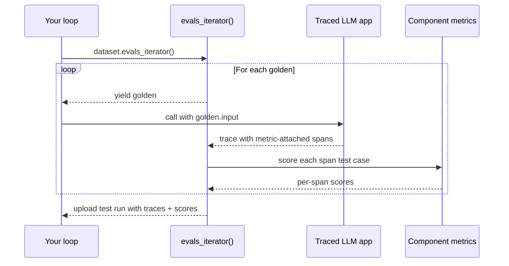

import { ASSETS } from "@site/src/assets";

Component-level evaluation grades **internal components** of your LLM app — retrievers, tool calls, LLM generations, sub-agents — instead of treating the whole system as a black box. The unit of evaluation is still an [`LLMTestCase`](/docs/evaluation-test-cases#llm-test-cases), but it's attached to a span (an `@observe`'d function or a framework-emitted span) rather than the whole trace.

<ImageDisplayer src={ASSETS.componentLevelEvals} alt="component level evals" />

If you haven't already, read the [end-to-end overview](/docs/evaluation-end-to-end-llm-evals) for the concepts and how component-level compares to end-to-end.

:::caution[Single-turn only]
Component-level evaluation is currently single-turn only. Multi-turn component-level evaluation is on the roadmap.
:::

:::info[Already using `evals_iterator()` for end-to-end?]
If you've already wired up [`evals_iterator()` with tracing](/docs/evaluation-end-to-end-single-turn#approach-1-evals_iterator-with-tracing-recommended), the only delta to go component-level is **attaching metrics to the spans you care about**. Skip the basics and jump straight to [Apply metrics to components](#apply-metrics-to-components) below.
:::

## How Component-Level Eval Works

Component-level runs use the exact same iterator + tracing setup as [single-turn end-to-end](/docs/evaluation-end-to-end-single-turn#approach-1-evals_iterator-with-tracing-recommended) — the only difference is **where metrics live**: on individual spans instead of (or in addition to) the trace as a whole.

1. Your traced LLM app emits a trace with multiple spans whenever it runs.
2. You attach metrics to the specific spans you want to grade (e.g. the retriever, a tool call, an inner LLM call).
3. `dataset.evals_iterator()` opens a test run and yields each golden one at a time.
4. Inside the loop, you call your traced app. Each emitted span that has metrics attached gets scored as one test case — many test cases per run of your app.
5. The trace + per-span test cases + metric scores upload together as one test run.



You can mix component-level and end-to-end in the same loop: pass `metrics=[...]` to `evals_iterator()` to score the trace itself, and attach metrics on individual spans to score components. Both flow into the same test run.

## Step-by-Step Guide

<Steps>
<Step>

### Instrument/trace your AI

Tracing captures your LLM app's inputs, outputs, and internal spans so `deepeval` can build per-span test cases automatically.

<Tabs items={["Manual Instrumentation", "LangChain", "LangGraph", "OpenAI", "Pydantic AI", "AgentCore", "Strands", "Anthropic", "LlamaIndex", "OpenAI Agents", "Google ADK", "CrewAI"]}>
<Tab value="Manual Instrumentation">

Wrap the top-level function of your LLM app with `@observe`, and call `update_current_trace(...)` to set the trace-level test case fields. Wrap inner functions you want to grade individually with `@observe` too:

```python title="main.py" showLineNumbers {1,3,9}
from deepeval.tracing import observe, update_current_trace

@observe()
def my_ai_agent(query: str) -> str:
    chunks = retrieve(query)
    answer = generate(query, chunks)
    update_current_trace(input=query, output=answer)
    return answer

@observe()
def retrieve(query: str) -> list[str]:
    return ["..."]
```

See [tracing](/docs/evaluation-llm-tracing) for the full `@observe` and `update_current_trace` surface.

</Tab>
<Tab value="LangChain">

Pass `deepeval`'s `CallbackHandler` to your chain's invoke method.

```python title="langchain.py" showLineNumbers {2,12}
from langchain.chat_models import init_chat_model
from deepeval.integrations.langchain import CallbackHandler

def multiply(a: int, b: int) -> int:
    return a * b

llm = init_chat_model("gpt-4.1", model_provider="openai")
llm_with_tools = llm.bind_tools([multiply])

llm_with_tools.invoke(
    "What is 3 * 12?",
    config={"callbacks": [CallbackHandler()]},
)
```

See the [LangChain integration](/integrations/frameworks/langchain) for the full surface.

</Tab>
<Tab value="LangGraph">

Pass `deepeval`'s `CallbackHandler` to your agent's invoke method.

```python title="langgraph.py" showLineNumbers {2,15}
from langgraph.prebuilt import create_react_agent
from deepeval.integrations.langchain import CallbackHandler

def get_weather(city: str) -> str:
    return f"It's always sunny in {city}!"

agent = create_react_agent(
    model="openai:gpt-4.1",
    tools=[get_weather],
    prompt="You are a helpful assistant",
)

agent.invoke(
    input={"messages": [{"role": "user", "content": "what is the weather in sf"}]},
    config={"callbacks": [CallbackHandler()]},
)
```

See the [LangGraph integration](/integrations/frameworks/langgraph) for the full surface.

</Tab>
<Tab value="OpenAI">

Drop-in replace `from openai import OpenAI` with `from deepeval.openai import OpenAI`. Every `chat.completions.create(...)`, `chat.completions.parse(...)`, and `responses.create(...)` call becomes an LLM span automatically.

```python title="openai_app.py" showLineNumbers {1}
from deepeval.openai import OpenAI

client = OpenAI()
client.chat.completions.create(
    model="gpt-4o",
    messages=[{"role": "user", "content": "Hello"}],
)
```

See the [OpenAI integration](/integrations/frameworks/openai) for the full surface (including async, streaming, and tool-calling).

</Tab>
<Tab value="Pydantic AI">

Pass `DeepEvalInstrumentationSettings()` to your `Agent`'s `instrument` keyword.

```python title="pydanticai.py" showLineNumbers {2,7}
from pydantic_ai import Agent
from deepeval.integrations.pydantic_ai import DeepEvalInstrumentationSettings

agent = Agent(
    "openai:gpt-4.1",
    system_prompt="Be concise.",
    instrument=DeepEvalInstrumentationSettings(),
)

agent.run_sync("Greetings, AI Agent.")
```

See the [Pydantic AI integration](/integrations/frameworks/pydanticai) for the full surface.

</Tab>
<Tab value="AgentCore">

Call `instrument_agentcore()` before creating your AgentCore app. The same call also instruments [Strands](https://strandsagents.com/) agents running inside AgentCore.

```python title="agentcore_agent.py" showLineNumbers {3,5}
from bedrock_agentcore import BedrockAgentCoreApp
from strands import Agent
from deepeval.integrations.agentcore import instrument_agentcore

instrument_agentcore()

app = BedrockAgentCoreApp()
agent = Agent(model="amazon.nova-lite-v1:0")

@app.entrypoint
def invoke(payload, context):
    return {"result": str(agent(payload.get("prompt")))}
```

See the [AgentCore integration](/integrations/frameworks/agentcore) for the full surface (including Strands-specific spans).

</Tab>
<Tab value="Strands">

Call `instrument_strands()` before creating or invoking your Strands agent. Use this when you run Strands directly (scripts, services, notebooks); if your outer boundary is the AgentCore app entrypoint, use the AgentCore tab instead.

```python title="strands_agent.py" showLineNumbers {4,6}
from strands import Agent
from strands.models.openai import OpenAIModel

from deepeval.integrations.strands import instrument_strands

instrument_strands()

agent = Agent(
    model=OpenAIModel(model_id="gpt-4o-mini"),
    system_prompt="You are a helpful assistant.",
)

agent("Help me return my order.")
```

See the [Strands integration](/integrations/frameworks/strands) for the full surface.

</Tab>
<Tab value="Anthropic">

Drop-in replace `from anthropic import Anthropic` with `from deepeval.anthropic import Anthropic`. Every `messages.create(...)` call becomes an LLM span automatically.

```python title="anthropic_app.py" showLineNumbers {1}
from deepeval.anthropic import Anthropic

client = Anthropic()
client.messages.create(
    model="claude-sonnet-4-5",
    max_tokens=1024,
    messages=[{"role": "user", "content": "Hello"}],
)
```

See the [Anthropic integration](/integrations/frameworks/anthropic) for the full surface (including async, streaming, and tool-use).

</Tab>
<Tab value="LlamaIndex">

Register `deepeval`'s event handler against LlamaIndex's instrumentation dispatcher.

```python title="llamaindex.py" showLineNumbers {6,8}
import asyncio
from llama_index.llms.openai import OpenAI
from llama_index.core.agent import FunctionAgent
import llama_index.core.instrumentation as instrument

from deepeval.integrations.llama_index import instrument_llama_index

instrument_llama_index(instrument.get_dispatcher())

def multiply(a: float, b: float) -> float:
    return a * b

agent = FunctionAgent(
    tools=[multiply],
    llm=OpenAI(model="gpt-4o-mini"),
    system_prompt="You are a helpful calculator.",
)

asyncio.run(agent.run("What is 8 multiplied by 6?"))
```

See the [LlamaIndex integration](/integrations/frameworks/llamaindex) for the full surface.

</Tab>
<Tab value="OpenAI Agents">

Register `DeepEvalTracingProcessor` once, then build your agent with `deepeval`'s `Agent` and `function_tool` shims.

```python title="openai_agents.py" showLineNumbers {2,4}
from agents import Runner, add_trace_processor
from deepeval.openai_agents import Agent, DeepEvalTracingProcessor, function_tool

add_trace_processor(DeepEvalTracingProcessor())

@function_tool
def get_weather(city: str) -> str:
    return f"It's always sunny in {city}!"

agent = Agent(
    name="weather_agent",
    instructions="Answer weather questions concisely.",
    tools=[get_weather],
)

Runner.run_sync(agent, "What's the weather in Paris?")
```

See the [OpenAI Agents integration](/integrations/frameworks/openai-agents) for the full surface.

</Tab>
<Tab value="Google ADK">

Call `instrument_google_adk()` once before building your `LlmAgent`.

```python title="google_adk.py" showLineNumbers {6,8}
import asyncio
from google.adk.agents import LlmAgent
from google.adk.runners import InMemoryRunner
from google.genai import types

from deepeval.integrations.google_adk import instrument_google_adk

instrument_google_adk()

agent = LlmAgent(model="gemini-2.0-flash", name="assistant", instruction="Be concise.")
runner = InMemoryRunner(agent=agent, app_name="deepeval-quickstart")
```

See the [Google ADK integration](/integrations/frameworks/google-adk) for the full surface.

</Tab>
<Tab value="CrewAI">

Call `instrument_crewai()` once, then build your crew with `deepeval`'s `Crew`, `Agent`, and `@tool` shims.

```python title="crewai.py" showLineNumbers {2,4}
from crewai import Task
from deepeval.integrations.crewai import instrument_crewai, Crew, Agent

instrument_crewai()

coder = Agent(
    role="Consultant",
    goal="Write a clear, concise explanation.",
    backstory="An expert consultant with a keen eye for software trends.",
)

task = Task(
    description="Explain the latest trends in AI.",
    agent=coder,
    expected_output="A clear and concise explanation.",
)

crew = Crew(agents=[coder], tasks=[task])
crew.kickoff()
```

See the [CrewAI integration](/integrations/frameworks/crewai) for the full surface.

</Tab>
</Tabs>

:::tip
Setting up tracing is the same as for [single-turn end-to-end](/docs/evaluation-end-to-end-single-turn#approach-1-evals_iterator-with-tracing-recommended) — the only thing that changes for component-level is **attaching metrics to spans**, covered in [Apply metrics to components](#apply-metrics-to-components) below.
:::

</Step>

<Step>
### Build dataset

[Datasets](/docs/evaluation-datasets) in `deepeval` store [`Golden`s](/docs/evaluation-datasets#what-are-goldens) — precursors to test cases. You loop over goldens at evaluation time, run your LLM app on each, and the framework builds test cases from each emitted span.

<Tabs items={["In Code", "Pull from Confident AI", "Load from CSV", "Load from JSON"]}>
<Tab value="In Code">

```python
from deepeval.dataset import Golden, EvaluationDataset

goldens = [
    Golden(input="What is your name?"),
    Golden(input="Choose a number between 1 and 100"),
    # ...
]

dataset = EvaluationDataset(goldens=goldens)
```

The dataset lives only for this run — no push, no save. Perfect for quickstarts and one-off evaluations.

</Tab>
<Tab value="Pull from Confident AI">

```python
from deepeval.dataset import EvaluationDataset

dataset = EvaluationDataset()
dataset.pull(alias="My dataset")
```

</Tab>
<Tab value="Load from CSV">

```python
from deepeval.dataset import EvaluationDataset

dataset = EvaluationDataset()
dataset.add_goldens_from_csv_file(
    file_path="example.csv",
    input_col_name="query",
)
```

</Tab>
<Tab value="Load from JSON">

```python
from deepeval.dataset import EvaluationDataset

dataset = EvaluationDataset()
dataset.add_goldens_from_json_file(
    file_path="example.json",
    input_key_name="query",
)
```

</Tab>
</Tabs>

:::tip
This page covers **sourcing** goldens for an eval run only. To **persist** a dataset (push to Confident AI, save as CSV/JSON, version it across runs), see [the datasets page](/docs/evaluation-datasets).
:::

</Step>

<Step>
### Loop with `evals_iterator()`

Call your traced LLM app inside `evals_iterator()`. Each iteration captures a trace, but component-level metrics score the **spans inside that trace** — not the whole trace unless you also pass trace-level metrics to `evals_iterator()`:

<Tabs items={["Async", "Sync"]}>
<Tab value="Async">

Default. Metrics dispatch concurrently across spans for the fastest run.

```python
import asyncio
from deepeval.dataset import EvaluationDataset
...

dataset = EvaluationDataset()
dataset.pull(alias="YOUR-DATASET-ALIAS")

for golden in dataset.evals_iterator():
    # Component metrics live on spans, so we don't need to pass
    # `metrics=[...]` here. deepeval captures the trace and scores
    # each instrumented span.
    task = asyncio.create_task(my_ai_agent(golden.input))
    dataset.evaluate(task)
```

This requires `my_ai_agent` to be an `async def` (or otherwise return a coroutine).

</Tab>
<Tab value="Sync">

Pass `AsyncConfig(run_async=False)` to score components one at a time. Useful for debugging, rate-limited providers, or anywhere asyncio gets in the way (e.g. some Jupyter setups).

```python
from deepeval.evaluate import AsyncConfig
from deepeval.dataset import EvaluationDataset
...

dataset = EvaluationDataset()
dataset.pull(alias="YOUR-DATASET-ALIAS")

for golden in dataset.evals_iterator(
    async_config=AsyncConfig(run_async=False),
):
    my_ai_agent(golden.input)  # captures trace, deepeval scores spans
```

</Tab>
</Tabs>

There are **SIX** optional parameters on `evals_iterator()`:

- [Optional] `metrics`: a list of `BaseMetric`s applied at the trace (end-to-end) level. Leave empty for pure component-level runs — your component metrics live on the spans themselves. Pass trace-level metrics here to score end-to-end _and_ component-level in the same run.
- [Optional] `identifier`: a string label for this test run on Confident AI.
- [Optional] `async_config`: an `AsyncConfig` controlling concurrency. See [async configs](/docs/evaluation-flags-and-configs#async-configs).
- [Optional] `display_config`: a `DisplayConfig` controlling console output. See [display configs](/docs/evaluation-flags-and-configs#display-configs).
- [Optional] `error_config`: an `ErrorConfig` controlling error handling. See [error configs](/docs/evaluation-flags-and-configs#error-configs).
- [Optional] `cache_config`: a `CacheConfig` controlling caching. See [cache configs](/docs/evaluation-flags-and-configs#cache-configs).

:::info
Passing `metrics=[...]` to `evals_iterator()` attaches them at the **trace** level — they grade the whole run end-to-end. Component-level metrics live on individual spans (covered next), and the two coexist in the same test run.
:::

</Step>
</Steps>

<VideoDisplayer
  src={ASSETS.tracingSpans}
  confidentUrl="/docs/llm-tracing/introduction"
  label="Span-Level Evals on Confident AI"
/>

## Apply metrics to components

Each integration exposes its own API for attaching a metric to a span. Pick the tab matching your stack — the rest of the loop (`evals_iterator()`, dataset, etc.) stays exactly the same.

<Tabs items={["Manual Instrumentation", "LangChain", "LangGraph", "OpenAI", "Pydantic AI", "AgentCore", "Strands", "Anthropic", "LlamaIndex", "OpenAI Agents", "Google ADK", "CrewAI"]}>
<Tab value="Manual Instrumentation">

Pass `metrics=[...]` directly to the `@observe` decorator and build the test case at runtime with `update_current_span(test_case=...)`:

```python title="main.py" showLineNumbers {6,11}
from typing import List
from deepeval.tracing import observe, update_current_span
from deepeval.test_case import LLMTestCase
from deepeval.metrics import AnswerRelevancyMetric

@observe(metrics=[AnswerRelevancyMetric()])
def generator(query: str, chunks: List[str]) -> str:
    response = call_llm(query, chunks)
    update_current_span(
        test_case=LLMTestCase(input=query, actual_output=response, retrieval_context=chunks),
    )
    return response
```

The same pattern works on any `@observe`'d function — retrievers, tool wrappers, sub-agents. See [tracing](/docs/evaluation-llm-tracing) for the full surface.

</Tab>
<Tab value="LangChain">

Set `metrics` in the chat model's metadata via `with_config(...)`. The `CallbackHandler` reads it when LangChain opens the LLM span:

```python title="langchain.py" showLineNumbers {5}
from langchain.chat_models import init_chat_model
from deepeval.metrics import AnswerRelevancyMetric

llm = init_chat_model("openai:gpt-4o-mini").with_config(
    metadata={"metrics": [AnswerRelevancyMetric()]},
)
```

For retrievers, set `metric_collection` on the retriever's metadata. For deterministic tool calls, prefer span metadata + `update_current_span(...)` over attaching metrics. See the [LangChain integration](/integrations/frameworks/langchain#applying-metrics-to-components) for the full surface.

</Tab>
<Tab value="LangGraph">

Pass a configured chat model into `create_react_agent(...)`. The same `with_config(metadata={"metrics": [...]})` trick attaches metrics to the LLM span LangGraph opens during the graph run:

```python title="langgraph.py" showLineNumbers {5,8}
from langchain.chat_models import init_chat_model
from langgraph.prebuilt import create_react_agent
from deepeval.metrics import AnswerRelevancyMetric

model = init_chat_model("openai:gpt-4o-mini").with_config(
    metadata={"metrics": [AnswerRelevancyMetric()]},
)
agent = create_react_agent(model=model, tools=[...], prompt="Be concise.")
```

See the [LangGraph integration](/integrations/frameworks/langgraph#applying-metrics-to-components) for the full surface.

</Tab>
<Tab value="OpenAI">

Wrap each call you want to score in `with trace(llm_span_context=LlmSpanContext(metrics=[...])):`. The `deepeval.openai` shim emits one LLM span per call, and `LlmSpanContext` stages the metric for it:

```python title="openai_app.py" showLineNumbers {2,7}
from deepeval.openai import OpenAI
from deepeval.tracing import trace, LlmSpanContext
from deepeval.metrics import AnswerRelevancyMetric

client = OpenAI()

with trace(llm_span_context=LlmSpanContext(metrics=[AnswerRelevancyMetric()])):
    client.chat.completions.create(
        model="gpt-4o",
        messages=[{"role": "user", "content": "Hello"}],
    )
```

See the [OpenAI integration](/integrations/frameworks/openai) for async/streaming/tool-call variants.

</Tab>
<Tab value="Pydantic AI">

Stage the metric with `next_agent_span(...)` or `next_llm_span(...)` before calling the agent. The next matching Pydantic-emitted span picks up the metric:

```python title="pydanticai.py" showLineNumbers {1,5}
from deepeval.tracing import next_llm_span
from deepeval.metrics import AnswerRelevancyMetric

async def run_agent(prompt: str):
    with next_llm_span(metrics=[AnswerRelevancyMetric()]):
        return await agent.run(prompt)
```

Use `next_agent_span(...)` to score the agent span itself instead of the LLM call. See the [Pydantic AI integration](/integrations/frameworks/pydanticai#applying-metrics-to-components) for the full surface.

</Tab>
<Tab value="AgentCore">

Same `next_*_span(...)` pattern — stage the metric for the next AgentCore-emitted span before invoking the app:

```python title="agentcore_agent.py" showLineNumbers {1,5}
from deepeval.tracing import next_agent_span
from deepeval.metrics import TaskCompletionMetric

def run_agentcore(prompt: str):
    with next_agent_span(metrics=[TaskCompletionMetric()]):
        return invoke({"prompt": prompt})
```

Use `next_llm_span(...)` for an inner LLM call. See the [AgentCore integration](/integrations/frameworks/agentcore#applying-metrics-to-components) for Strands-specific spans and more.

</Tab>
<Tab value="Strands">

Same `next_*_span(...)` pattern — stage the metric for the next Strands-emitted span before invoking the agent:

```python title="strands_agent.py" showLineNumbers {1,5}
from deepeval.tracing import next_agent_span
from deepeval.metrics import TaskCompletionMetric

def run_strands(prompt: str):
    with next_agent_span(metrics=[TaskCompletionMetric()]):
        return agent(prompt)
```

Use `next_llm_span(...)` for an inner LLM call instead. See the [Strands integration](/integrations/frameworks/strands#applying-metrics-to-components) for the full surface.

</Tab>
<Tab value="Anthropic">

Same shape as OpenAI — wrap the call in `with trace(llm_span_context=LlmSpanContext(metrics=[...])):`:

```python title="anthropic_app.py" showLineNumbers {2,7}
from deepeval.anthropic import Anthropic
from deepeval.tracing import trace, LlmSpanContext
from deepeval.metrics import AnswerRelevancyMetric

client = Anthropic()

with trace(llm_span_context=LlmSpanContext(metrics=[AnswerRelevancyMetric()])):
    client.messages.create(
        model="claude-sonnet-4-5",
        max_tokens=1024,
        messages=[{"role": "user", "content": "Hello"}],
    )
```

See the [Anthropic integration](/integrations/frameworks/anthropic) for async/streaming/tool-use variants.

</Tab>
<Tab value="LlamaIndex">

Stage the metric with `AgentSpanContext` (for the agent span) or `LlmSpanContext` (for the next LLM span) inside `with trace(...)`:

```python title="llamaindex.py" showLineNumbers {1,5}
from deepeval.tracing import trace, AgentSpanContext
from deepeval.metrics import TaskCompletionMetric

async def run_agent(prompt: str):
    with trace(agent_span_context=AgentSpanContext(metrics=[TaskCompletionMetric()])):
        return await agent.run(prompt)
```

Use `LlmSpanContext` to score the next LLM call instead. See the [LlamaIndex integration](/integrations/frameworks/llamaindex#applying-metrics-to-components) for the full surface.

</Tab>
<Tab value="OpenAI Agents">

Attach metrics directly on `deepeval.openai_agents.Agent` (`agent_metrics`, `llm_metrics`) and on `@function_tool`:

```python title="openai_agents.py" showLineNumbers {6,7,11}
from deepeval.openai_agents import Agent, function_tool
from deepeval.metrics import TaskCompletionMetric, AnswerRelevancyMetric, GEval
from deepeval.test_case import LLMTestCaseParams

agent = Agent(
    name="weather_agent",
    instructions="Answer weather questions concisely.",
    tools=[get_weather],
    agent_metrics=[TaskCompletionMetric()],
    llm_metrics=[AnswerRelevancyMetric()],
)

@function_tool(metrics=[GEval(
    name="Helpful Weather Lookup",
    criteria="Output must be a clear weather summary for the requested city.",
    evaluation_params=[LLMTestCaseParams.INPUT, LLMTestCaseParams.ACTUAL_OUTPUT],
)])
def get_weather(city: str) -> str:
    return f"It's always sunny in {city}!"
```

`agent_metrics` apply on every run (including handoffs to sub-agents). See the [OpenAI Agents integration](/integrations/frameworks/openai-agents#applying-metrics-to-components) for the full surface.

</Tab>
<Tab value="Google ADK">

Same `next_*_span(...)` pattern as Pydantic AI / AgentCore:

```python title="google_adk.py" showLineNumbers {1,5}
from deepeval.tracing import next_agent_span
from deepeval.metrics import TaskCompletionMetric

async def run_agent_with_metric(prompt: str):
    with next_agent_span(metrics=[TaskCompletionMetric()]):
        return await run_agent(prompt)
```

Use `next_llm_span(...)` for an inner LLM call. See the [Google ADK integration](/integrations/frameworks/google-adk#applying-metrics-to-components) for the full surface.

</Tab>
<Tab value="CrewAI">

Attach metrics on `deepeval.integrations.crewai.Agent` / `LLM` / `@tool`:

```python title="crewai.py" showLineNumbers {5,7,15}
from deepeval.integrations.crewai import Agent, LLM, tool
from deepeval.metrics import TaskCompletionMetric, AnswerRelevancyMetric, GEval
from deepeval.test_case import LLMTestCaseParams

llm = LLM(model="gpt-4o", metrics=[AnswerRelevancyMetric()])

reporter = Agent(
    role="Weather Reporter",
    goal="Provide accurate weather information.",
    backstory="An experienced meteorologist.",
    tools=[get_weather],
    llm=llm,
    metrics=[TaskCompletionMetric()],
)

@tool(metric=[GEval(
    name="Helpful Weather Lookup",
    criteria="Output must be a clear weather summary.",
    evaluation_params=[LLMTestCaseParams.INPUT, LLMTestCaseParams.ACTUAL_OUTPUT],
)])
def get_weather(city: str) -> str:
    return f"It's always sunny in {city}!"
```

See the [CrewAI integration](/integrations/frameworks/crewai#applying-metrics-to-components) for the full surface.

</Tab>
</Tabs>

:::tip
Each integration has its own deeper component-level surface (sub-agent handoffs, retriever scoring, span context customization). Read the [integration docs](/integrations/frameworks/openai) for your stack to see what else is available.
:::

## Hyperparameters

Log the model, prompt, and other configuration values with each test run so you can compare runs side-by-side on Confident AI and identify the best combination. Values must be `str | int | float` or a [`Prompt`](/docs/evaluation-prompts).

```python
import deepeval

@deepeval.log_hyperparameters
def hyperparameters():
    return {"model": "gpt-4.1", "system_prompt": "Be concise."}

for golden in dataset.evals_iterator():
    my_ai_agent(golden.input)
```

On Confident AI, the logged values become filterable axes for comparing test runs and surfacing the configuration that performs best.

## In CI/CD

To run component-level evaluations on every PR, swap `evals_iterator()` for `assert_test()` inside a `pytest` parametrized test. Metrics stay attached to the spans — `assert_test()` only needs the active golden:

```python title="test_my_ai_agent.py"
import pytest
from deepeval import assert_test
from deepeval.dataset import Golden
from your_app import my_ai_agent  # traced; spans carry metrics

@pytest.mark.parametrize("golden", dataset.goldens)
def test_my_ai_agent(golden: Golden):
    my_ai_agent(golden.input)
    assert_test(golden=golden)
```

```bash
deepeval test run test_my_ai_agent.py
```

See [unit testing in CI/CD](/docs/evaluation-unit-testing-in-ci-cd) for `assert_test()` parameters, YAML pipeline examples, and `deepeval test run` flags.
