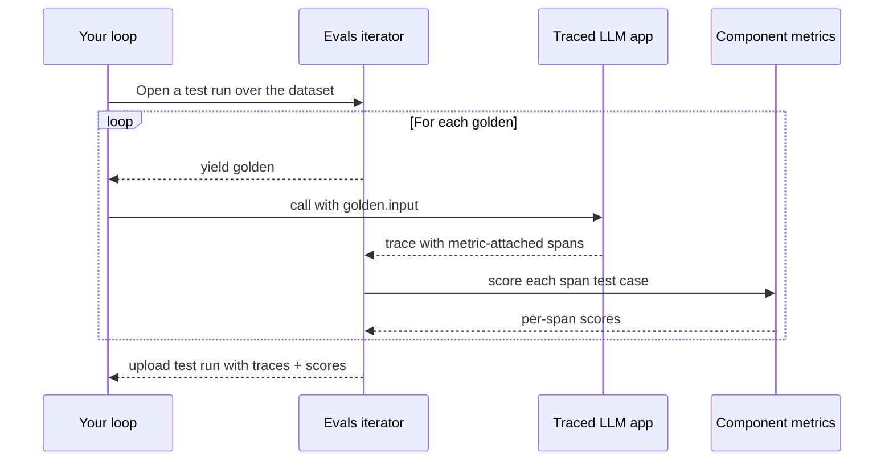

import { ASSETS } from "@site/src/assets";

Component-level evaluation (sometimes also known as **step-wise evals**) grades **internal components** of your LLM app — retrievers, tool calls, LLM generations, sub-agents — instead of treating the whole system as a black box. The unit of evaluation is still an [`LLMTestCase`](/docs/evaluation-test-cases#llm-test-cases), but it's attached to a span (an <Term py="@observe" ts="observe()"/>'d function or a framework-emitted span) rather than the whole trace.

<ImageDisplayer src={ASSETS.componentLevelEvals} alt="component level evals" />

If you haven't already, read the [end-to-end overview](/docs/evaluation-end-to-end-llm-evals) for black-box evaluation and [trajectory-based evaluation](/docs/evaluation-trajectory-based-llm-evals) for scoring an agent's complete chain of steps.

:::caution[Single-turn only]
Component-level evaluation is currently single-turn only. Multi-turn component-level evaluation is on the roadmap.
:::

:::info[Already evaluating in a loop for end-to-end?]
If you've already wired up [the evals iterator with tracing](/docs/evaluation-end-to-end-single-turn#approach-1-evals_iterator-with-tracing-recommended), the only delta to go component-level is **attaching metrics to the spans you care about** — the integration tabs in [Instrument and evaluate](#instrument-and-evaluate) below show this inline.
:::

## How Component-Level Eval Works

Component-level runs use the exact same iterator + tracing setup as [single-turn end-to-end](/docs/evaluation-end-to-end-single-turn#approach-1-evals_iterator-with-tracing-recommended) — the only difference is **where metrics live**: on individual spans instead of (or in addition to) the trace as a whole.

1. Your traced LLM app emits a trace with multiple spans whenever it runs.
2. You attach metrics to the specific spans you want to grade (e.g. the retriever, a tool call, an inner LLM call).
3. <Term py="dataset.evals_iterator()" ts="dataset.evalsIterator()"/> opens a test run and yields each golden one at a time.
4. Inside the loop, you call your traced app. Each emitted span that has metrics attached gets scored as one test case — many test cases per run of your app.
5. The trace + per-span test cases + metric scores upload together as one test run.


```mermaid
sequenceDiagram
    participant You as Your loop
    participant Eval as Evals iterator
    participant App as Traced LLM app
    participant Metrics as Component metrics

    You->>Eval: Open a test run over the dataset
    loop For each golden
        Eval-->>You: yield golden
        You->>App: call with golden.input
        App-->>Eval: trace with metric-attached spans
        Eval->>Metrics: score each span test case
        Metrics-->>Eval: per-span scores
    end
    Eval-->>You: upload test run with traces + scores
```

You can mix scopes in the same loop: pass [trajectory metrics](/docs/evaluation-trajectory-based-llm-evals) to <Term py="metrics=[...]" ts="metrics: [...]"/> to score the complete agent path, and attach metrics to individual spans to score components. Both flow into the same test run.

## Step-by-Step Guide

<Steps>
<Step>

### Build dataset

[Datasets](/docs/evaluation-datasets) in `deepeval` store [`Golden`s](/docs/evaluation-datasets#what-are-goldens) — precursors to test cases. You loop over goldens at evaluation time, run your LLM app on each, and the framework builds test cases from each emitted span.

<include cwd>snippets/datasets/load-dataset.mdx#single-turn</include>

:::tip
This page covers **sourcing** goldens for an eval run only. To **persist** a dataset (push to Confident AI, save as CSV/JSON, version it across runs), see [the datasets page](/docs/evaluation-datasets).
:::

</Step>

<Step>

### Instrument/trace and evaluate

Instrument your AI agent based on your tech stack. The loop captures one trace per golden so the component metrics you attach get scored on the spans inside.

<Only id="python">

Each integration ships **Async** (default — fastest) and **Sync** variants:

- **Async** keeps `evals_iterator()` on its default async dispatch and wraps each invocation in `asyncio.create_task(...)` + `dataset.evaluate(task)` so goldens run concurrently.
- **Sync** passes `AsyncConfig(run_async=False)` and runs the loop body one golden at a time. Useful for debugging, rate-limited providers, or anywhere asyncio gets in the way (e.g. some Jupyter setups).

</Only>

<include cwd>snippets/evaluation/component-level-agent-framework-tabs.mdx</include>

<Switch>

<Case id="python">

There are **SIX** optional parameters on `evals_iterator()`:

- [Optional] `metrics`: a list of `BaseMetric`s applied at the **trace** level. Leave empty for pure component-level runs — your component metrics already live on the spans. Pass [trajectory metrics](/docs/evaluation-trajectory-based-llm-evals) here to also score the complete agent path.
- [Optional] `identifier`: a string label for this test run on Confident AI.
- [Optional] `async_config`: an `AsyncConfig` controlling concurrency. See [async configs](/docs/evaluation-flags-and-configs#async-configs).
- [Optional] `display_config`: a `DisplayConfig` controlling console output. See [display configs](/docs/evaluation-flags-and-configs#display-configs).
- [Optional] `error_config`: an `ErrorConfig` controlling error handling. See [error configs](/docs/evaluation-flags-and-configs#error-configs).
- [Optional] `cache_config`: a `CacheConfig` controlling caching. See [cache configs](/docs/evaluation-flags-and-configs#cache-configs).

</Case>

<Case id="typescript">

There are **FIVE** optional parameters on `evalsIterator()`, all passed in a single options object:

- [Optional] `metrics`: an array of `BaseMetric`s applied at the **trace** level. Leave empty for pure component-level runs — your component metrics already live on the spans. Pass [trajectory metrics](/docs/evaluation-trajectory-based-llm-evals) here to also score the complete agent path.
- [Optional] `identifier`: a string label for this test run on Confident AI.
- [Optional] `hyperparameters`: the model, prompt, and settings that produced these outputs. See [hyperparameters](#hyperparameters).
- [Optional] `displayConfig`: a `DisplayConfig` controlling console output. See [display configs](/docs/evaluation-flags-and-configs#display-configs).
- [Optional] `errorConfig`: an `ErrorConfig` controlling error handling. See [error configs](/docs/evaluation-flags-and-configs#error-configs).

`evalsIterator()` is an async generator, so it always runs concurrently — there's no sync variant or `asyncConfig` to configure.

</Case>

</Switch>

Every run of the iterator is snapshotted to disk, so you can open it in a trace-tree TUI — with per-span scores and metric reasons — by running bare <Term py="deepeval inspect" ts="npx deepeval inspect"/>. See the [inspect reference](/docs/command-line-interface#inspect) for full details.

</Step>
</Steps>

Logging into Confident AI via the CLI also gives you testing reports with traces on the platform to annotate, share, and persist:

<Switch>

<Case id="python">

```bash
deepeval login
```

</Case>

<Case id="typescript">

```bash
npx deepeval login
```

</Case>

</Switch>

<VideoDisplayer
  src={ASSETS.tracingSpans}
  confidentUrl="/docs/llm-tracing/introduction"
  label="Span-level evals on Confident AI"
  description="Inspect component-level scores on every span in your traces."
/>

:::tip[Go further]

- **Score the complete trajectory too?** Component metrics live on **spans**. Pass [trajectory metrics](/docs/evaluation-trajectory-based-llm-evals) to <Term py="metrics=[...]" ts="metrics: [...]"/> to also grade the full chain — both scopes coexist in the same test run.
- **Deeper integration API.** Each integration exposes more (sub-agent handoffs, retriever scoring, span context customization). Read the [integration docs](/integrations/frameworks/openai) for your stack to see what else is available.
  :::

## Evaluate Sub-Agents

In multi-agent systems, every sub-agent invocation — a delegation, handoff, or nested call — emits its own **agent span** inside the trace. To evaluate a sub-agent in isolation, attach metrics to its agent span instead of the trace.

<Only id="python">

:::note
Only integrations that emit agent spans are shown below. The OpenAI and Anthropic clients don't — they produce LLM spans only, which you can target with `LlmSpanContext` instead.
:::

</Only>

<include cwd>snippets/evaluation/sub-agent-framework-tabs.mdx</include>

Then run your evals exactly as before — <Term py="evals_iterator()" ts="evalsIterator()"/> in scripts, or <Term py="assert_test(golden=golden)" ts="expect(golden).toPass()"/> [in CI/CD](#in-cicd). Trace-level metrics are optional here since the metrics already live on the sub-agent spans.

## Hyperparameters

Log the model, prompt, and other configuration values with each test run so you can compare runs side-by-side on Confident AI and identify the best combination. Values must be `str | int | float` or a [`Prompt`](/docs/evaluation-prompts).

<Switch>

<Case id="python">

```python
import deepeval

@deepeval.log_hyperparameters
def hyperparameters():
    return {"model": "gpt-4.1", "system_prompt": "Be concise."}

for golden in dataset.evals_iterator():
    my_ai_agent(golden.input)
```

</Case>

<Case id="typescript">

```typescript
const hyperparameters = { model: "gpt-4.1", systemPrompt: "Be concise." };

for await (const golden of dataset.evalsIterator({ hyperparameters })) {
  await myAiAgent(golden.input);
}
```

</Case>

</Switch>

On Confident AI, the logged values become filterable axes for comparing test runs and surfacing the configuration that performs best.

## In CI/CD

To run component-level evaluations on every PR, swap <Term py="evals_iterator()" ts="evalsIterator()"/> for an assertion inside a <Term py="pytest" ts="vitest"/> test. Metrics stay attached to the spans, so the assertion only needs the active golden:

<Switch>

<Case id="python">

```python title="test_my_ai_agent.py"
import pytest
from deepeval import assert_test
from deepeval.dataset import Golden
from your_app import my_ai_agent  # traced; spans carry metrics

@pytest.mark.parametrize("golden", dataset.goldens)
def test_my_ai_agent(golden: Golden):
    my_ai_agent(golden.input)
    assert_test(golden=golden)
```

```bash
deepeval test run test_my_ai_agent.py
```

</Case>

<Case id="typescript">

```typescript title="my_ai_agent.test.ts"
import { it, expect } from "vitest";
import { Golden } from "deepeval/dataset";
import { myAiAgent } from "./your-app"; // traced; spans carry metrics
import "deepeval/vitest";

it.each(dataset.goldens as Golden[])(
  "completes the task #%$",
  async (golden) => {
    await expect(golden).toPass([], {
      task: (g) => myAiAgent(g.input),
    });
  },
);
```

```bash
npx deepeval test run my_ai_agent.test.ts
```

</Case>

</Switch>

See [unit testing in CI/CD](/docs/evaluation-unit-testing-in-ci-cd) for assertion parameters, YAML pipeline examples, and <Term py="deepeval test run" ts="npx deepeval test run"/> flags.

## FAQs

<FAQs
  qas={[
    {
      question: "What is component-level evaluation?",
      answer: (
        <>
          Instead of scoring only the final output, it scores individual
          components of your app — retrievers, tools, agents, and LLM calls — by
          attaching metrics to the spans your traced app emits.
        </>
      ),
    },
    {
      question: "When should I use component-level over end-to-end evaluation?",
      answer: (
        <>
          Use it when a single end-to-end score isn't enough to tell you{" "}
          <em>where</em> things went wrong — for example, to check the retriever
          and the generator separately, or to run different metrics on different
          components in one pass.
        </>
      ),
    },
    {
      question:
        "Do I have to manually instrument my app, or does `deepeval` integrate with my framework?",
      answer: (
        <>
          You can instrument your app manually, but <code>deepeval</code> also
          ships native{" "}
          <a href="/integrations">integrations</a> for LangChain, LangGraph,
          LlamaIndex, Pydantic AI, CrewAI, and more. These attach component
          metrics to the spans your framework already emits — no manual tracing
          required.
        </>
      ),
    },
    {
      question: "Do I have to rewrite my app to run component-level evals?",
      answer: (
        <>
          No. You wrap the components you care about in an observer (or use a{" "}
          <a href="/integrations">native framework integration</a>) and report
          the input and output on the current span from inside them. You don't
          need to refactor your code to bubble up intermediate values.
        </>
      ),
    },
    {
      question: "How does unit testing work with traced components in CI/CD?",
      answer: (
        <>
          Because metrics stay attached to the spans, the assertion only needs
          the active golden — run your traced app on the golden's input, then
          assert on that golden inside a test in your language's test runner.
        </>
      ),
    },
    {
      question:
        "Can my team see a visual breakdown of component scores on the cloud?",
      answer: (
        <>
          Component-level evals run locally, but the per-span scores are much
          easier to read visually. Logging into{" "}
          <a href="https://www.confident-ai.com">Confident AI</a> (the official
          platform for <code>deepeval</code>) renders the same traces and
          component scores
          into a shared cloud UI, so a team can drill into which span failed and
          track it over time — optional, with zero additional code.
        </>
      ),
    },
  ]}
/>
