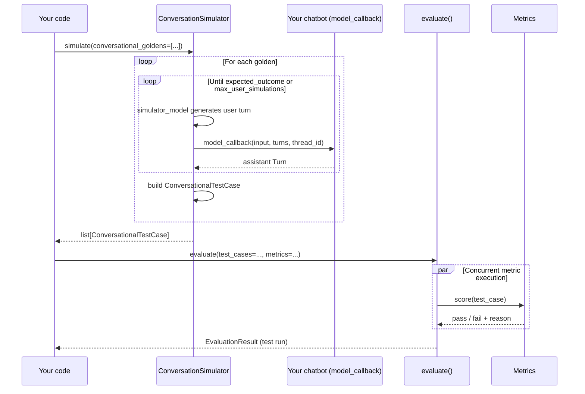

import { ASSETS } from "@site/src/assets";

Multi-turn end-to-end evaluation grades **whole conversations**, not single exchanges. Each test case is a [`ConversationalTestCase`](/docs/evaluation-multiturn-test-cases) and each golden is a [`ConversationalGolden`](/docs/evaluation-datasets#what-are-goldens) describing a _scenario_, an _expected outcome_, and _who the user is_.

If you haven't already, read the [end-to-end overview](/docs/evaluation-end-to-end-llm-evals) for the concepts and how multi-turn compares to single-turn.

:::note
Unlike [single-turn end-to-end evaluation](/docs/evaluation-end-to-end-single-turn), multi-turn doesn't support tracing yet.
:::

## How Multi-Turn E2E Eval Works

A multi-turn test run is built in two phases: **simulation** (synthetic user vs. your chatbot) and **evaluation** (metrics applied to the resulting conversations).

1. You wrap your chatbot in a `model_callback` (sync or async) that returns the next assistant `Turn`.
2. You build a dataset of `ConversationalGolden`s — each describes the scenario, expected outcome, and persona of the simulated user.
3. You hand the goldens + callback to a [`ConversationSimulator`](/docs/conversation-simulator). It plays a synthetic user against your chatbot until the scenario plays out, producing one `ConversationalTestCase` per golden.
4. You pass the test cases + multi-turn metrics to `evaluate()`, which scores them and rolls the results into a test run.



## Step-by-Step Guide

<Steps>
<Step>

### Wrap your chatbot in a callback

The `ConversationSimulator` needs a way to ask your chatbot for its next reply, given the conversation so far. You provide that as a `model_callback` — either a regular function or an `async` one; the simulator detects which and dispatches accordingly. The examples below use `async def` because most modern chat clients are async, but plain `def` works just as well:

<Tabs items={["Python", "OpenAI", "LangChain", "LlamaIndex", "OpenAI Agents", "Pydantic"]}>
<Tab value="Python">

```python title="main.py" showLineNumbers={true}
from typing import List
from deepeval.test_case import Turn

async def model_callback(input: str, turns: List[Turn], thread_id: str) -> Turn:
    response = await your_chatbot(input, turns, thread_id)
    return Turn(role="assistant", content=response)
```

</Tab>
<Tab value="OpenAI">

```python title="main.py" showLineNumbers={true} {6}
from typing import List
from deepeval.test_case import Turn
from openai import OpenAI

client = OpenAI()

async def model_callback(input: str, turns: List[Turn]) -> Turn:
    messages = [
        {"role": "system", "content": "You are a ticket purchasing assistant"},
        *[{"role": t.role, "content": t.content} for t in turns],
        {"role": "user", "content": input},
    ]
    response = await client.chat.completions.create(model="gpt-4.1", messages=messages)
    return Turn(role="assistant", content=response.choices[0].message.content)
```

</Tab>
<Tab value="LangChain">

```python title="main.py" showLineNumbers={true} {10,13}
from langchain.agents import create_agent
from langgraph.checkpoint.memory import InMemorySaver
from deepeval.test_case import Turn

agent = create_agent(
    model="openai:gpt-4o-mini",
    system_prompt="You are a ticket purchasing assistant.",
    checkpointer=InMemorySaver(),
)

async def model_callback(input: str, thread_id: str) -> Turn:
    result = agent.invoke(
        {"messages": [{"role": "user", "content": input}]},
        config={"configurable": {"thread_id": thread_id}},
    )
    return Turn(role="assistant", content=result["messages"][-1].content)
```

</Tab>
<Tab value="LlamaIndex">

```python title="main.py" showLineNumbers={true} {9}
from llama_index.core.storage.chat_store import SimpleChatStore
from llama_index.llms.openai import OpenAI
from llama_index.core.chat_engine import SimpleChatEngine
from llama_index.core.memory import ChatMemoryBuffer
from deepeval.test_case import Turn

chat_store = SimpleChatStore()
llm = OpenAI(model="gpt-4")

async def model_callback(input: str, thread_id: str) -> Turn:
    memory = ChatMemoryBuffer.from_defaults(chat_store=chat_store, chat_store_key=thread_id)
    chat_engine = SimpleChatEngine.from_defaults(llm=llm, memory=memory)
    response = chat_engine.chat(input)
    return Turn(role="assistant", content=response.response)
```

</Tab>
<Tab value="OpenAI Agents">

```python title="main.py" showLineNumbers={true} {6}
from agents import Agent, Runner, SQLiteSession
from deepeval.test_case import Turn

sessions = {}
agent = Agent(name="Test Assistant", instructions="You are a helpful assistant that answers questions concisely.")

async def model_callback(input: str, thread_id: str) -> Turn:
    if thread_id not in sessions:
        sessions[thread_id] = SQLiteSession(thread_id)
    session = sessions[thread_id]
    result = await Runner.run(agent, input, session=session)
    return Turn(role="assistant", content=result.final_output)
```

</Tab>
<Tab value="Pydantic">

```python title="main.py" showLineNumbers={true} {9}
from typing import List
from datetime import datetime
from pydantic_ai import Agent
from pydantic_ai.messages import ModelRequest, ModelResponse, UserPromptPart, TextPart
from deepeval.test_case import Turn

agent = Agent('openai:gpt-4', system_prompt="You are a helpful assistant that answers questions concisely.")

async def model_callback(input: str, turns: List[Turn]) -> Turn:
    message_history = []
    for turn in turns:
        if turn.role == "user":
            message_history.append(ModelRequest(parts=[UserPromptPart(content=turn.content, timestamp=datetime.now())], kind='request'))
        elif turn.role == "assistant":
            message_history.append(ModelResponse(parts=[TextPart(content=turn.content)], model_name='gpt-4', timestamp=datetime.now(), kind='response'))
    result = await agent.run(input, message_history=message_history)
    return Turn(role="assistant", content=result.output)
```

</Tab>
</Tabs>

:::info
Your `model_callback` should accept an `input` (the simulated user's next message) and may optionally accept `turns` (the history so far) and `thread_id` (a stable session id). It must return a `Turn(role="assistant", content=...)`.
:::

See [Conversation Simulator → Model Callback](/docs/conversation-simulator-model-callback) for the full callback contract, including custom argument injection.

</Step>

<Step>

### Build dataset

A `ConversationalGolden` describes the situation the simulated user is in, what success looks like, and who they are. Wrap a list of them in an `EvaluationDataset` so the simulator can iterate. Pick whichever source fits where your goldens live today:

<Tabs items={["In Code", "Pull from Confident AI", "Load from CSV", "Load from JSON"]}>
<Tab value="In Code">

```python
from deepeval.dataset import ConversationalGolden, EvaluationDataset

goldens = [
    ConversationalGolden(
        scenario="Andy Byron wants to purchase a VIP ticket to a Coldplay concert.",
        expected_outcome="Successful purchase of a ticket.",
        user_description="Andy Byron is the CEO of Astronomer.",
    ),
    # ...
]

dataset = EvaluationDataset(goldens=goldens)
```

The dataset lives only for this run — no push, no save. Perfect for quickstarts and one-off evaluations.

</Tab>
<Tab value="Pull from Confident AI">

```python
from deepeval.dataset import EvaluationDataset

dataset = EvaluationDataset()
dataset.pull(alias="My multi-turn dataset")
```

</Tab>
<Tab value="Load from CSV">

```python
from deepeval.dataset import EvaluationDataset

dataset = EvaluationDataset()
dataset.add_goldens_from_csv_file(
    file_path="conversations.csv",
    scenario_col_name="scenario",
    expected_outcome_col_name="expected_outcome",
    user_description_col_name="user_description",
)
```

</Tab>
<Tab value="Load from JSON">

```python
from deepeval.dataset import EvaluationDataset

dataset = EvaluationDataset()
dataset.add_goldens_from_json_file(
    file_path="conversations.json",
    scenario_key_name="scenario",
    expected_outcome_key_name="expected_outcome",
    user_description_key_name="user_description",
)
```

</Tab>
</Tabs>

:::tip
This page covers **sourcing** goldens for an eval run only. To **persist** a dataset (push to Confident AI, save as CSV/JSON, version it across runs), see [the datasets page](/docs/evaluation-datasets) for the full storage and lifecycle story.
:::

</Step>

<Step>

### Simulate turns

Hand the goldens and the callback to a `ConversationSimulator` to produce a list of `ConversationalTestCase`s:

```python title="main.py"
from deepeval.conversation_simulator import ConversationSimulator

simulator = ConversationSimulator(model_callback=model_callback)
conversational_test_cases = simulator.simulate(
    conversational_goldens=dataset.goldens,
    max_user_simulations=10,
)
```

The simulator exposes additional configuration beyond what fits here — see [stopping logic](/docs/conversation-simulator-stopping-logic), [custom templates](/docs/conversation-simulator-custom-templates), and [lifecycle hooks](/docs/conversation-simulator-lifecycle-hooks) for the full surface.

<details>
<summary>Click to view an example simulated test case</summary>

The simulator carries `scenario`, `expected_outcome`, and `user_description` over from the golden, and fills in `turns`:

```python
ConversationalTestCase(
    scenario="Andy Byron wants to purchase a VIP ticket to a Coldplay concert.",
    expected_outcome="Successful purchase of a ticket.",
    user_description="Andy Byron is the CEO of Astronomer.",
    turns=[
        Turn(role="user", content="Hi, I'd like to buy a VIP ticket for the Coldplay show."),
        Turn(role="assistant", content="Sure — which date and city are you looking for?"),
        Turn(role="user", content="The November 12 show in NYC."),
        Turn(role="assistant", content="Got it. That'll be $850. Shall I proceed?"),
        # ...
    ],
)
```

</details>

</Step>

<Step>
### Run `evaluate()`

Pass the simulated test cases and your multi-turn metrics to `evaluate()`:

<Tabs items={["Async", "Sync"]}>
<Tab value="Async">

Default. Metrics dispatch concurrently across conversations for the fastest run.

```python title="main.py"
from deepeval import evaluate
from deepeval.metrics import TurnRelevancyMetric

evaluate(
    test_cases=conversational_test_cases,
    metrics=[TurnRelevancyMetric()],
)
```

</Tab>
<Tab value="Sync">

Pass `AsyncConfig(run_async=False)` to score conversations one at a time. Useful for debugging, rate-limited providers, or anywhere asyncio gets in the way (e.g. some Jupyter setups).

```python title="main.py"
from deepeval import evaluate
from deepeval.evaluate import AsyncConfig
from deepeval.metrics import TurnRelevancyMetric

evaluate(
    test_cases=conversational_test_cases,
    metrics=[TurnRelevancyMetric()],
    async_config=AsyncConfig(run_async=False),
)
```

</Tab>
</Tabs>

There are **TWO** mandatory and **FIVE** optional parameters when calling `evaluate()` for multi-turn end-to-end evaluation:

- `test_cases`: a list of `ConversationalTestCase`s (or an `EvaluationDataset`). You cannot mix `LLMTestCase`s and `ConversationalTestCase`s in the same test run.
- `metrics`: a list of metrics of type `BaseConversationalMetric`. See the [multi-turn metrics](/docs/metrics-introduction#multi-turn-metrics) for the full list (e.g. `TurnRelevancyMetric`, `KnowledgeRetentionMetric`, `RoleAdherenceMetric`, `ConversationCompletenessMetric`).
- [Optional] `identifier`: a string label for this test run.
- [Optional] `async_config`: an `AsyncConfig` controlling concurrency. See [async configs](/docs/evaluation-flags-and-configs#async-configs).
- [Optional] `display_config`: a `DisplayConfig` controlling console output. See [display configs](/docs/evaluation-flags-and-configs#display-configs).
- [Optional] `error_config`: an `ErrorConfig` controlling error handling. See [error configs](/docs/evaluation-flags-and-configs#error-configs).
- [Optional] `cache_config`: a `CacheConfig` controlling caching. See [cache configs](/docs/evaluation-flags-and-configs#cache-configs).

</Step>
</Steps>

Note that **simulation** and **evaluation** have separate concurrency controls — `ConversationSimulator(max_concurrent=...)` decides how many conversations are simulated in parallel; `AsyncConfig` only affects how those finished conversations are scored.

We highly recommend setting up [Confident AI](https://app.confident-ai.com) with your `deepeval` evaluations to get professional test reports and observe your application's performance over time:

<VideoDisplayer
  src={ASSETS.evaluationMultiTurnE2eReport}
  confidentUrl="https://www.confident-ai.com/docs/llm-evaluation/dashboards/testing-reports"
  label="Test reports after running evals on Confident AI"
  description="Review full conversations alongside their metric scores and reasons."
/>

## Hyperparameters

Log the model, prompt, and other configuration values with each test run so you can compare runs side-by-side on Confident AI and identify the best combination. Values must be `str | int | float` or a [`Prompt`](/docs/evaluation-prompts). Pass them directly to `evaluate()`:

```python
evaluate(
    test_cases=conversational_test_cases,
    metrics=[TurnRelevancyMetric()],
    hyperparameters={"model": "gpt-4.1", "system_prompt": "Be concise."},
)
```

On Confident AI, the logged values become filterable axes for comparing test runs and surfacing the configuration that performs best.

## In CI/CD

To run multi-turn end-to-end evaluations on every PR, simulate conversations once at module load, then `assert_test()` each one inside a `pytest` parametrized test:

```python title="test_chatbot.py"
import pytest
from deepeval import assert_test
from deepeval.test_case import ConversationalTestCase
from deepeval.metrics import TurnRelevancyMetric
from deepeval.conversation_simulator import ConversationSimulator
from your_app import model_callback

simulator = ConversationSimulator(model_callback=model_callback)
test_cases = simulator.simulate(goldens=dataset.goldens, max_turns=10)

@pytest.mark.parametrize("test_case", test_cases)
def test_chatbot(test_case: ConversationalTestCase):
    assert_test(test_case=test_case, metrics=[TurnRelevancyMetric()])
```

```bash
deepeval test run test_chatbot.py
```

See [unit testing in CI/CD](/docs/evaluation-unit-testing-in-ci-cd) for `assert_test()` parameters, YAML pipeline examples, and `deepeval test run` flags.

## FAQs

<FAQs
  qas={[
    {
      question: "What is multi-turn end-to-end evaluation?",
      answer: (
        <>
          It evaluates an entire conversation between a user and your chatbot or
          assistant, scoring the back-and-forth as a whole instead of a single
          response. It's the right approach for any app where context carries
          across turns.
        </>
      ),
    },
    {
      question: "Why do I need to wrap my chatbot in a callback?",
      answer: (
        <>
          The <code>model_callback</code> tells <code>deepeval</code> how to
          call your
          chatbot for the next turn given the conversation so far. This lets the{" "}
          <a href="/docs/conversation-simulator">conversation simulator</a>{" "}
          drive realistic multi-turn dialogues automatically.
        </>
      ),
    },
    {
      question: "Do I have to script every conversation by hand?",
      answer: (
        <>
          No. You define <code>ConversationalGolden</code>s with a scenario and
          user description, then let <code>ConversationSimulator.simulate()</code>{" "}
          generate the turns up to a <code>max_turns</code> limit.
        </>
      ),
    },
    {
      question: "Is there component-level evaluation for multi-turn apps?",
      answer:
        "No. Component-level evaluation only applies to single-turn use cases. Multi-turn apps are evaluated end-to-end across the full conversation.",
    },
    {
      question: "How do I run multi-turn evals in CI/CD?",
      answer: (
        <>
          Simulate the conversations once at module load, then{" "}
          <code>assert_test()</code> each <code>ConversationalTestCase</code>{" "}
          inside a <code>pytest</code> parametrized test and run it with{" "}
          <code>deepeval test run</code>.
        </>
      ),
    },
    {
      question:
        "Can my team review long conversations on the cloud in a shared UI?",
      answer: (
        <>
          Multi-turn runs work locally, but inspecting long transcripts in a
          terminal is painful. When logged into{" "}
          <a href="https://www.confident-ai.com">Confident AI</a> (the platform
          from the <code>deepeval</code> team), the same run produces a cloud
          testing report
          where your team can read each conversation, see per-turn scores, and
          track trends over time — optional and requiring no code changes.
        </>
      ),
    },
  ]}
/>
