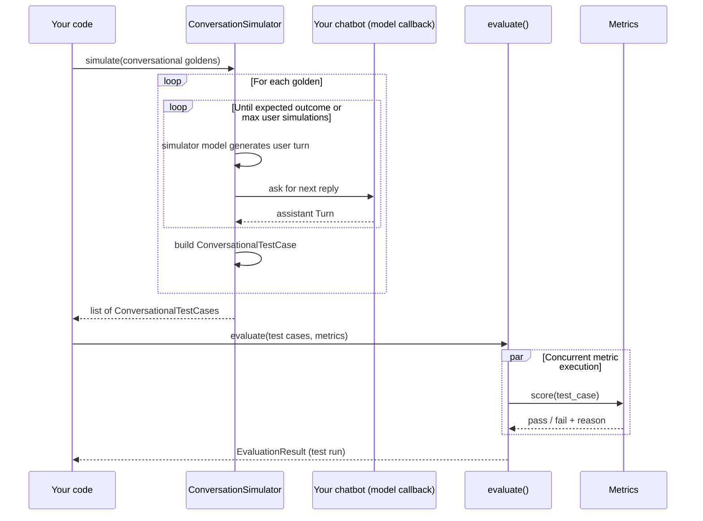

import { ASSETS } from "@site/src/assets";

Multi-turn end-to-end evaluation grades **whole conversations**, not single exchanges. Each test case is a [`ConversationalTestCase`](/docs/evaluation-multiturn-test-cases) and each golden is a [`ConversationalGolden`](/docs/evaluation-datasets#what-are-goldens) describing a _scenario_, an _expected outcome_, and _who the user is_.

If you haven't already, read the [end-to-end overview](/docs/evaluation-end-to-end-llm-evals) for the concepts and how multi-turn compares to single-turn.

:::note
Unlike [single-turn end-to-end evaluation](/docs/evaluation-end-to-end-single-turn), multi-turn doesn't support tracing yet.
:::

## How Multi-Turn E2E Eval Works

A multi-turn test run is built in two phases: **simulation** (synthetic user vs. your chatbot) and **evaluation** (metrics applied to the resulting conversations).

1. You wrap your chatbot in a <Term py="model_callback" ts="modelCallback"/> that returns the next assistant `Turn`.
2. You build a dataset of `ConversationalGolden`s — each describes the scenario, expected outcome, and persona of the simulated user.
3. You hand the goldens + callback to a [`ConversationSimulator`](/docs/conversation-simulator). It plays a synthetic user against your chatbot until the scenario plays out, producing one `ConversationalTestCase` per golden.
4. You pass the test cases + multi-turn metrics to `evaluate()`, which scores them and rolls the results into a test run.


```mermaid
sequenceDiagram
    participant User as Your code
    participant Sim as ConversationSimulator
    participant Bot as Your chatbot (model callback)
    participant Eval as evaluate()
    participant M as Metrics

    User->>Sim: simulate(conversational goldens)
    loop For each golden
        loop Until expected outcome or max user simulations
            Sim->>Sim: simulator model generates user turn
            Sim->>Bot: ask for next reply
            Bot-->>Sim: assistant Turn
        end
        Sim->>Sim: build ConversationalTestCase
    end
    Sim-->>User: list of ConversationalTestCases
    User->>Eval: evaluate(test cases, metrics)
    par Concurrent metric execution
        Eval->>M: score(test_case)
        M-->>Eval: pass / fail + reason
    end
    Eval-->>User: EvaluationResult (test run)
```

## Step-by-Step Guide

<Steps>
<Step>

### Wrap your chatbot in a callback

The `ConversationSimulator` needs a way to ask your chatbot for its next reply, given the conversation so far. You provide that as a <Term py="model_callback" ts="modelCallback"/>.

<Only id="python">

It can be either a regular function or an `async` one; the simulator detects which and dispatches accordingly. The examples below use `async def` because most modern chat clients are async, but plain `def` works just as well:

</Only>

<include cwd>snippets/evaluation/model-callback-tabs.mdx</include>

<Switch>

<Case id="python">

:::info
Your `model_callback` should accept an `input` (the simulated user's next message) and may optionally accept `turns` (the history so far) and `thread_id` (a stable session id). It must return a `Turn(role="assistant", content=...)`.
:::

</Case>

<Case id="typescript">

:::info
Your `modelCallback` receives a single object with `input` (the simulated user's next message), `turns` (the history so far), and `threadId` (a stable session id). Destructure only the ones you need. It must resolve to a `Turn` with `role: "assistant"`.
:::

</Case>

</Switch>

See [Conversation Simulator → Model Callback](/docs/conversation-simulator-model-callback) for the full callback contract, including custom argument injection.

</Step>

<Step>

### Build dataset

A `ConversationalGolden` describes the situation the simulated user is in, what success looks like, and who they are. Wrap a list of them in an `EvaluationDataset` so the simulator can iterate. Pick whichever source fits where your goldens live today:

<include cwd>snippets/datasets/load-dataset.mdx#multi-turn</include>

:::tip
This page covers **sourcing** goldens for an eval run only. To **persist** a dataset (push to Confident AI, save as CSV/JSON, version it across runs), see [the datasets page](/docs/evaluation-datasets) for the full storage and lifecycle story.
:::

</Step>

<Step>

### Simulate turns

Hand the goldens and the callback to a `ConversationSimulator` to produce a list of `ConversationalTestCase`s:

<Switch>

<Case id="python">

```python title="main.py"
from deepeval.simulator import ConversationSimulator

simulator = ConversationSimulator(model_callback=model_callback)
conversational_test_cases = simulator.simulate(
    conversational_goldens=dataset.goldens,
    max_user_simulations=10,
)
```

</Case>

<Case id="typescript">

```typescript title="main.ts"
import { ConversationSimulator } from "deepeval";
import { ConversationalGolden } from "deepeval/dataset";

const simulator = new ConversationSimulator({ modelCallback });
const conversationalTestCases = await simulator.simulate({
  conversationalGoldens: dataset.goldens as ConversationalGolden[],
  maxUserSimulations: 10,
});
```

</Case>

</Switch>

The simulator exposes additional configuration beyond what fits here — see [stopping logic](/docs/conversation-simulator-stopping-logic), [custom templates](/docs/conversation-simulator-custom-templates), and [lifecycle hooks](/docs/conversation-simulator-lifecycle-hooks) for the full surface.

<details>
<summary>Click to view an example simulated test case</summary>

The simulator carries `scenario`, <Term py="expected_outcome" ts="expectedOutcome"/>, and <Term py="user_description" ts="userDescription"/> over from the golden, and fills in `turns`:

<Switch>

<Case id="python">

```python
ConversationalTestCase(
    scenario="Andy Byron wants to purchase a VIP ticket to a Coldplay concert.",
    expected_outcome="Successful purchase of a ticket.",
    user_description="Andy Byron is the CEO of Astronomer.",
    turns=[
        Turn(role="user", content="Hi, I'd like to buy a VIP ticket for the Coldplay show."),
        Turn(role="assistant", content="Sure — which date and city are you looking for?"),
        Turn(role="user", content="The November 12 show in NYC."),
        Turn(role="assistant", content="Got it. That'll be $850. Shall I proceed?"),
        # ...
    ],
)
```

</Case>

<Case id="typescript">

```typescript
new ConversationalTestCase({
  scenario: "Andy Byron wants to purchase a VIP ticket to a Coldplay concert.",
  expectedOutcome: "Successful purchase of a ticket.",
  userDescription: "Andy Byron is the CEO of Astronomer.",
  turns: [
    new Turn({ role: "user", content: "Hi, I'd like to buy a VIP ticket for the Coldplay show." }),
    new Turn({ role: "assistant", content: "Sure — which date and city are you looking for?" }),
    new Turn({ role: "user", content: "The November 12 show in NYC." }),
    new Turn({ role: "assistant", content: "Got it. That'll be $850. Shall I proceed?" }),
  ],
});
```

</Case>

</Switch>

</details>

</Step>

<Step>
### Run `evaluate()`

Pass the simulated test cases and your multi-turn metrics to `evaluate()`:

<Switch>

<Case id="python">

<Tabs items={["Async", "Sync"]}>
<Tab value="Async">

Default. Metrics dispatch concurrently across conversations for the fastest run.

```python title="main.py"
from deepeval import evaluate
from deepeval.metrics import TurnRelevancyMetric

evaluate(
    test_cases=conversational_test_cases,
    metrics=[TurnRelevancyMetric()],
)
```

</Tab>
<Tab value="Sync">

Pass `AsyncConfig(run_async=False)` to score conversations one at a time. Useful for debugging, rate-limited providers, or anywhere asyncio gets in the way (e.g. some Jupyter setups).

```python title="main.py"
from deepeval import evaluate
from deepeval.evaluate import AsyncConfig
from deepeval.metrics import TurnRelevancyMetric

evaluate(
    test_cases=conversational_test_cases,
    metrics=[TurnRelevancyMetric()],
    async_config=AsyncConfig(run_async=False),
)
```

</Tab>
</Tabs>

There are **TWO** mandatory and **FIVE** optional parameters when calling `evaluate()` for multi-turn end-to-end evaluation:

- `test_cases`: a list of `ConversationalTestCase`s (or an `EvaluationDataset`). You cannot mix `LLMTestCase`s and `ConversationalTestCase`s in the same test run.
- `metrics`: a list of metrics of type `BaseConversationalMetric`. See the [multi-turn metrics](/docs/metrics-introduction#multi-turn-metrics) for the full list (e.g. `TurnRelevancyMetric`, `KnowledgeRetentionMetric`, `RoleAdherenceMetric`, `ConversationCompletenessMetric`).
- [Optional] `identifier`: a string label for this test run.
- [Optional] `async_config`: an `AsyncConfig` controlling concurrency. See [async configs](/docs/evaluation-flags-and-configs#async-configs).
- [Optional] `display_config`: a `DisplayConfig` controlling console output. See [display configs](/docs/evaluation-flags-and-configs#display-configs).
- [Optional] `error_config`: an `ErrorConfig` controlling error handling. See [error configs](/docs/evaluation-flags-and-configs#error-configs).
- [Optional] `cache_config`: a `CacheConfig` controlling caching. See [cache configs](/docs/evaluation-flags-and-configs#cache-configs).

</Case>

<Case id="typescript">

Metrics dispatch concurrently across conversations, so `evaluate()` is always awaited.

```typescript title="main.ts"
import { evaluate } from "deepeval";
import { TurnRelevancyMetric } from "deepeval/metrics";

await evaluate(conversationalTestCases, [new TurnRelevancyMetric()]);
```

There are **TWO** mandatory and **FIVE** optional parameters when calling `evaluate()` for multi-turn end-to-end evaluation. The two mandatory ones are positional; the optional ones go in a third options object:

- `testCases`: an array of `ConversationalTestCase`s. You cannot mix `LLMTestCase`s and `ConversationalTestCase`s in the same test run.
- `metrics`: an array of metrics of type `BaseConversationalMetric`. See the [multi-turn metrics](/docs/metrics-introduction#multi-turn-metrics) for the full list (e.g. `TurnRelevancyMetric`, `KnowledgeRetentionMetric`, `RoleAdherenceMetric`, `ConversationCompletenessMetric`).
- [Optional] `identifier`: a string label for this test run.
- [Optional] `hyperparameters`: the model, prompt, and settings that produced these outputs. See [hyperparameters](#hyperparameters).
- [Optional] `displayConfig`: a `DisplayConfig` controlling console output. See [display configs](/docs/evaluation-flags-and-configs#display-configs).
- [Optional] `errorConfig`: an `ErrorConfig` controlling error handling. See [error configs](/docs/evaluation-flags-and-configs#error-configs).
- [Optional] `cacheConfig`: a `CacheConfig` controlling caching. See [cache configs](/docs/evaluation-flags-and-configs#cache-configs).

</Case>

</Switch>

</Step>
</Steps>

<Switch>

<Case id="python">

Note that **simulation** and **evaluation** have separate concurrency controls — `ConversationSimulator(max_concurrent=...)` decides how many conversations are simulated in parallel; `AsyncConfig` only affects how those finished conversations are scored.

</Case>

<Case id="typescript">

Note that **simulation** and **evaluation** are separate phases: the simulator runs every golden concurrently and resolves once all conversations are complete, and only then are those finished conversations scored.

</Case>

</Switch>

We highly recommend setting up [Confident AI](https://app.confident-ai.com) with your `deepeval` evaluations to get professional test reports and observe your application's performance over time:

<VideoDisplayer
  src={ASSETS.evaluationMultiTurnE2eReport}
  confidentUrl="https://www.confident-ai.com/docs/llm-evaluation/dashboards/testing-reports"
  label="Test reports after running evals on Confident AI"
  description="Review full conversations alongside their metric scores and reasons."
/>

## Hyperparameters

Log the model, prompt, and other configuration values with each test run so you can compare runs side-by-side on Confident AI and identify the best combination. Values must be `str | int | float` or a [`Prompt`](/docs/evaluation-prompts). Pass them directly to `evaluate()`:

<Switch>

<Case id="python">

```python
evaluate(
    test_cases=conversational_test_cases,
    metrics=[TurnRelevancyMetric()],
    hyperparameters={"model": "gpt-4.1", "system_prompt": "Be concise."},
)
```

</Case>

<Case id="typescript">

```typescript
await evaluate(conversationalTestCases, [new TurnRelevancyMetric()], {
  hyperparameters: { model: "gpt-4.1", systemPrompt: "Be concise." },
});
```

</Case>

</Switch>

On Confident AI, the logged values become filterable axes for comparing test runs and surfacing the configuration that performs best.

## In CI/CD

To run multi-turn end-to-end evaluations on every PR, simulate conversations once at module load, then assert on each one inside a <Term py="pytest" ts="vitest"/> test:

<Switch>

<Case id="python">

```python title="test_chatbot.py"
import pytest
from deepeval import assert_test
from deepeval.test_case import ConversationalTestCase
from deepeval.metrics import TurnRelevancyMetric
from deepeval.simulator import ConversationSimulator
from your_app import model_callback

simulator = ConversationSimulator(model_callback=model_callback)
test_cases = simulator.simulate(
    conversational_goldens=dataset.goldens,
    max_user_simulations=10,
)

@pytest.mark.parametrize("test_case", test_cases)
def test_chatbot(test_case: ConversationalTestCase):
    assert_test(test_case=test_case, metrics=[TurnRelevancyMetric()])
```

```bash
deepeval test run test_chatbot.py
```

</Case>

<Case id="typescript">

```typescript title="chatbot.test.ts"
import { it, expect } from "vitest";
import { ConversationalGolden } from "deepeval/dataset";
import { TurnRelevancyMetric } from "deepeval/metrics";
import { ConversationSimulator } from "deepeval";
import { modelCallback } from "./your-app";
import "deepeval/vitest";

const simulator = new ConversationSimulator({ modelCallback });
const testCases = await simulator.simulate({
  conversationalGoldens: dataset.goldens as ConversationalGolden[],
  maxUserSimulations: 10,
});

it.each(testCases)(
  "stays relevant across the conversation #%$",
  async (testCase) => {
    await expect(testCase).toPass([new TurnRelevancyMetric()]);
  },
);
```

```bash
npx deepeval test run chatbot.test.ts
```

</Case>

</Switch>

See [unit testing in CI/CD](/docs/evaluation-unit-testing-in-ci-cd) for assertion parameters, YAML pipeline examples, and <Term py="deepeval test run" ts="npx deepeval test run"/> flags.

## FAQs

<FAQs
  qas={[
    {
      question: "What is multi-turn end-to-end evaluation?",
      answer: (
        <>
          It evaluates an entire conversation between a user and your chatbot or
          assistant, scoring the back-and-forth as a whole instead of a single
          response. It's the right approach for any app where context carries
          across turns.
        </>
      ),
    },
    {
      question: "Why do I need to wrap my chatbot in a callback?",
      answer: (
        <>
          The model callback tells <code>deepeval</code> how to call your
          chatbot for the next turn given the conversation so far. This lets the{" "}
          <a href="/docs/conversation-simulator">conversation simulator</a>{" "}
          drive realistic multi-turn dialogues automatically.
        </>
      ),
    },
    {
      question: "Do I have to script every conversation by hand?",
      answer: (
        <>
          No. You define <code>ConversationalGolden</code>s with a scenario and
          user description, then let <code>ConversationSimulator.simulate()</code>{" "}
          generate the turns, up to a limit you set on the number of simulated
          user turns.
        </>
      ),
    },
    {
      question: "Is there component-level evaluation for multi-turn apps?",
      answer:
        "No. Component-level evaluation only applies to single-turn use cases. Multi-turn apps are evaluated end-to-end across the full conversation.",
    },
    {
      question: "How do I run multi-turn evals in CI/CD?",
      answer: (
        <>
          Simulate the conversations once at module load, then assert on each{" "}
          <code>ConversationalTestCase</code> inside a test in your language's
          test runner and run it with <code>deepeval test run</code>.
        </>
      ),
    },
    {
      question:
        "Can my team review long conversations on the cloud in a shared UI?",
      answer: (
        <>
          Multi-turn runs work locally, but inspecting long transcripts in a
          terminal is painful. When logged into{" "}
          <a href="https://www.confident-ai.com">Confident AI</a> (the platform
          from the <code>deepeval</code> team), the same run produces a cloud
          testing report
          where your team can read each conversation, see per-turn scores, and
          track trends over time — optional and requiring no code changes.
        </>
      ),
    },
  ]}
/>
