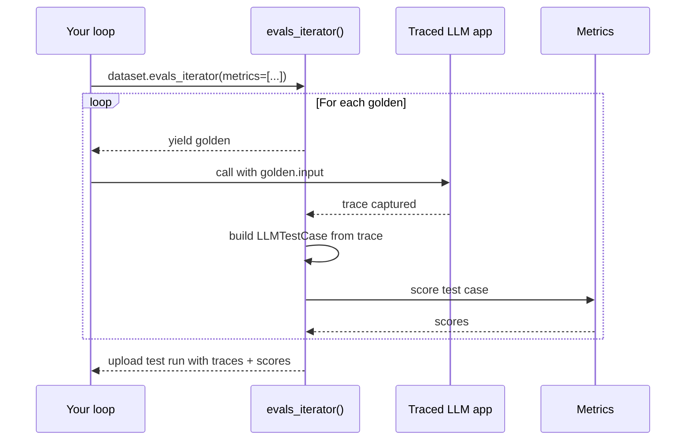
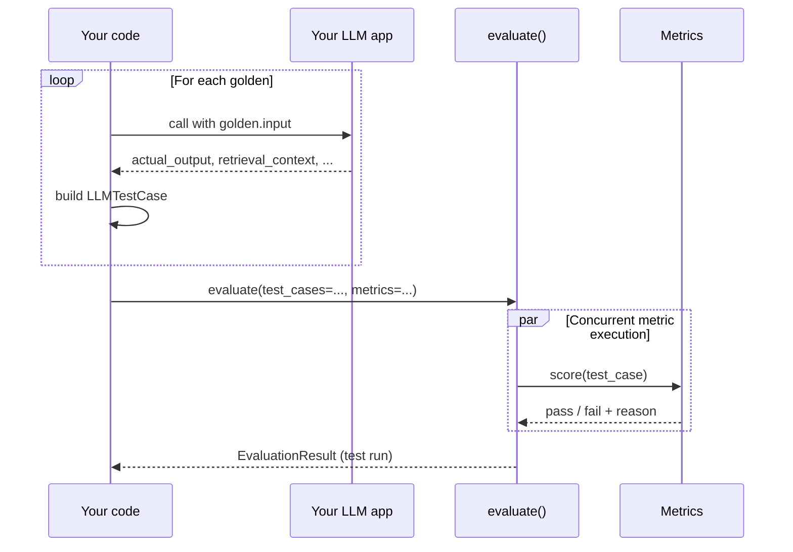

import { ASSETS } from "@site/src/assets";

A single-turn end-to-end test scores **one input → one output** per LLM interaction, captured as an [`LLMTestCase`](/docs/evaluation-test-cases#llm-test-cases). This is the right flavor for any LLM application with a "flat" shape — agents treated as a black box, RAG / QA, summarization, classifiers, writing assistants, and so on.

If you haven't already, read the [end-to-end overview](/docs/evaluation-end-to-end-llm-evals) for the concepts and how single-turn compares to multi-turn.

There are two ways to run a single-turn E2E test:

| Approach                                                                 | When to choose it                                                                                                                                                                             |
| ------------------------------------------------------------------------ | --------------------------------------------------------------------------------------------------------------------------------------------------------------------------------------------- |
| **`dataset.evals_iterator()` with `@observe` tracing** **— recommended** | Your app is (or can be) instrumented with [tracing](/docs/evaluation-llm-tracing). Test cases are built from traces automatically, and you get per-test-case traces on Confident AI for free. |
| **`evaluate(test_cases=...)`**                                           | You can't (or don't want to) instrument your app — e.g. a QA engineer evaluating a deployed system. You build `LLMTestCase`s up front and hand them to `evaluate()`.                          |

For projects you own, prefer `evals_iterator()` — same code, plus traces, plus a clean upgrade path to [component-level evaluation](/docs/evaluation-component-level-llm-evals).

## Approach 1: `evals_iterator()` with tracing (recommended)

If your LLM app is (or will be) instrumented with [tracing](/docs/evaluation-llm-tracing), you don't need to manually build test cases — `deepeval` will build them from the trace and you get full trace visibility on Confident AI as a bonus. **This is the recommended path**: it's the same amount of code as [Approach 2](#approach-2-evaluate), you also get traces on every test case, and the same setup is what you'd use for [component-level evaluation](/docs/evaluation-component-level-llm-evals).

:::caution[Don't have access to your app's code?]
This approach requires instrumenting your app with `@observe` or a framework integration. If you can't modify the app — for example you're a QA engineer evaluating a deployed black-box system, or you're testing someone else's API — skip ahead to **[Approach 2: `evaluate()`](#approach-2-evaluate)**. It only needs the inputs and outputs you've already collected, no tracing required.
:::

**How it works:**

1. Your traced LLM app emits a trace whenever it runs (via `@observe` or a framework integration).
2. `dataset.evals_iterator()` opens a test run and yields each golden one at a time.
3. Inside the loop, you call your traced app with `golden.input`. `deepeval` captures the resulting trace.
4. After each iteration, `deepeval` builds an `LLMTestCase` from the trace, applies your metrics, and attaches the scored test case to the trace.
5. When the loop finishes, the trace + test case + metric scores upload together as one test run.



This same setup also clicks into [component-level evaluation](/docs/evaluation-component-level-llm-evals) for free — once your app is traced, you can attach metrics to individual `@observe`'d spans in the same loop, and they'll be scored alongside the trace-level metrics.

<Steps>
<Step>

### Instrument/trace your AI

Tracing captures your LLM app's inputs, outputs, and internal spans so `deepeval` can build test cases from the trace automatically.

<Tabs items={["Manual Instrumentation", "LangChain", "LangGraph", "OpenAI", "Pydantic AI", "AgentCore", "Anthropic", "LlamaIndex", "OpenAI Agents", "Google ADK", "CrewAI"]}>
<Tab value="Manual Instrumentation">

Wrap the top-level function of your LLM app with `@observe`, and call `update_current_trace(...)` to set the trace-level test case fields:

```python title="main.py" showLineNumbers {1,3,6}
from deepeval.tracing import observe, update_current_trace

@observe()
def my_ai_agent(query: str) -> str:
    answer = "..." # call your LLM here

    # explicitly set test case parameters on trace
    update_current_trace(input=query, output=answer)
    return answer
```

See [tracing](/docs/evaluation-llm-tracing) for the full `@observe` and `update_current_trace` surface.

</Tab>
<Tab value="LangChain">

Pass `deepeval`'s `CallbackHandler` to your chain's invoke method.

```python title="langchain.py" showLineNumbers {2,12}
from langchain.chat_models import init_chat_model
from deepeval.integrations.langchain import CallbackHandler

def multiply(a: int, b: int) -> int:
    return a * b

llm = init_chat_model("gpt-4.1", model_provider="openai")
llm_with_tools = llm.bind_tools([multiply])

llm_with_tools.invoke(
    "What is 3 * 12?",
    config={"callbacks": [CallbackHandler()]},
)
```

See the [LangChain integration](/integrations/frameworks/langchain) for the full surface.

</Tab>
<Tab value="LangGraph">

Pass `deepeval`'s `CallbackHandler` to your agent's invoke method.

```python title="langgraph.py" showLineNumbers {2,15}
from langgraph.prebuilt import create_react_agent
from deepeval.integrations.langchain import CallbackHandler

def get_weather(city: str) -> str:
    return f"It's always sunny in {city}!"

agent = create_react_agent(
    model="openai:gpt-4.1",
    tools=[get_weather],
    prompt="You are a helpful assistant",
)

agent.invoke(
    input={"messages": [{"role": "user", "content": "what is the weather in sf"}]},
    config={"callbacks": [CallbackHandler()]},
)
```

See the [LangGraph integration](/integrations/frameworks/langgraph) for the full surface.

</Tab>
<Tab value="OpenAI">

Drop-in replace `from openai import OpenAI` with `from deepeval.openai import OpenAI`. Every `chat.completions.create(...)`, `chat.completions.parse(...)`, and `responses.create(...)` call becomes an LLM span automatically.

```python title="openai_app.py" showLineNumbers {1}
from deepeval.openai import OpenAI

client = OpenAI()
client.chat.completions.create(
    model="gpt-4o",
    messages=[{"role": "user", "content": "Hello"}],
)
```

See the [OpenAI integration](/integrations/frameworks/openai) for the full surface (including async, streaming, and tool-calling).

</Tab>
<Tab value="Pydantic AI">

Pass `DeepEvalInstrumentationSettings()` to your `Agent`'s `instrument` keyword.

```python title="pydanticai.py" showLineNumbers {2,7}
from pydantic_ai import Agent
from deepeval.integrations.pydantic_ai import DeepEvalInstrumentationSettings

agent = Agent(
    "openai:gpt-4.1",
    system_prompt="Be concise.",
    instrument=DeepEvalInstrumentationSettings(),
)

agent.run_sync("Greetings, AI Agent.")
```

See the [Pydantic AI integration](/integrations/frameworks/pydanticai) for the full surface.

</Tab>
<Tab value="AgentCore">

Call `instrument_agentcore()` before creating your AgentCore app. The same call also instruments [Strands](https://strandsagents.com/) agents running inside AgentCore.

```python title="agentcore_agent.py" showLineNumbers {3,5}
from bedrock_agentcore import BedrockAgentCoreApp
from strands import Agent
from deepeval.integrations.agentcore import instrument_agentcore

instrument_agentcore()

app = BedrockAgentCoreApp()
agent = Agent(model="amazon.nova-lite-v1:0")

@app.entrypoint
def invoke(payload, context):
    return {"result": str(agent(payload.get("prompt")))}
```

See the [AgentCore integration](/integrations/frameworks/agentcore) for the full surface (including Strands-specific spans).

</Tab>
<Tab value="Anthropic">

Drop-in replace `from anthropic import Anthropic` with `from deepeval.anthropic import Anthropic`. Every `messages.create(...)` call becomes an LLM span automatically.

```python title="anthropic_app.py" showLineNumbers {1}
from deepeval.anthropic import Anthropic

client = Anthropic()
client.messages.create(
    model="claude-sonnet-4-5",
    max_tokens=1024,
    messages=[{"role": "user", "content": "Hello"}],
)
```

See the [Anthropic integration](/integrations/frameworks/anthropic) for the full surface (including async, streaming, and tool-use).

</Tab>
<Tab value="LlamaIndex">

Register `deepeval`'s event handler against LlamaIndex's instrumentation dispatcher.

```python title="llamaindex.py" showLineNumbers {6,8}
import asyncio
from llama_index.llms.openai import OpenAI
from llama_index.core.agent import FunctionAgent
import llama_index.core.instrumentation as instrument

from deepeval.integrations.llama_index import instrument_llama_index

instrument_llama_index(instrument.get_dispatcher())

def multiply(a: float, b: float) -> float:
    return a * b

agent = FunctionAgent(
    tools=[multiply],
    llm=OpenAI(model="gpt-4o-mini"),
    system_prompt="You are a helpful calculator.",
)

asyncio.run(agent.run("What is 8 multiplied by 6?"))
```

See the [LlamaIndex integration](/integrations/frameworks/llamaindex) for the full surface.

</Tab>
<Tab value="OpenAI Agents">

Register `DeepEvalTracingProcessor` once, then build your agent with `deepeval`'s `Agent` and `function_tool` shims.

```python title="openai_agents.py" showLineNumbers {2,4}
from agents import Runner, add_trace_processor
from deepeval.openai_agents import Agent, DeepEvalTracingProcessor, function_tool

add_trace_processor(DeepEvalTracingProcessor())

@function_tool
def get_weather(city: str) -> str:
    return f"It's always sunny in {city}!"

agent = Agent(
    name="weather_agent",
    instructions="Answer weather questions concisely.",
    tools=[get_weather],
)

Runner.run_sync(agent, "What's the weather in Paris?")
```

See the [OpenAI Agents integration](/integrations/frameworks/openai-agents) for the full surface.

</Tab>
<Tab value="Google ADK">

Call `instrument_google_adk()` once before building your `LlmAgent`.

```python title="google_adk.py" showLineNumbers {6,8}
import asyncio
from google.adk.agents import LlmAgent
from google.adk.runners import InMemoryRunner
from google.genai import types

from deepeval.integrations.google_adk import instrument_google_adk

instrument_google_adk()

agent = LlmAgent(model="gemini-2.0-flash", name="assistant", instruction="Be concise.")
runner = InMemoryRunner(agent=agent, app_name="deepeval-quickstart")
```

See the [Google ADK integration](/integrations/frameworks/google-adk) for the full surface.

</Tab>
<Tab value="CrewAI">

Call `instrument_crewai()` once, then build your crew with `deepeval`'s `Crew`, `Agent`, and `@tool` shims.

```python title="crewai.py" showLineNumbers {2,4}
from crewai import Task
from deepeval.integrations.crewai import instrument_crewai, Crew, Agent

instrument_crewai()

coder = Agent(
    role="Consultant",
    goal="Write a clear, concise explanation.",
    backstory="An expert consultant with a keen eye for software trends.",
)

task = Task(
    description="Explain the latest trends in AI.",
    agent=coder,
    expected_output="A clear and concise explanation.",
)

crew = Crew(agents=[coder], tasks=[task])
crew.kickoff()
```

See the [CrewAI integration](/integrations/frameworks/crewai) for the full surface.

</Tab>
</Tabs>

:::tip
Each integration exposes its own configuration options. Check the [integration docs](/integrations/frameworks/openai) for your stack.
:::

</Step>

<Step>
### Build dataset

[Datasets](/docs/evaluation-datasets) in `deepeval` store [`Golden`s](/docs/evaluation-datasets#what-are-goldens), which act as precursors to test cases. You loop over goldens at evaluation time, run your LLM app on each, and turn the result into a test case — that way the dataset stays decoupled from any specific app version.

<Tabs items={["In Code", "Pull from Confident AI", "Load from CSV", "Load from JSON"]}>
<Tab value="In Code">

```python
from deepeval.dataset import Golden, EvaluationDataset

goldens = [
    Golden(input="What is your name?"),
    Golden(input="Choose a number between 1 and 100"),
    # ...
]

dataset = EvaluationDataset(goldens=goldens)
```

</Tab>
<Tab value="Pull from Confident AI">

```python
from deepeval.dataset import EvaluationDataset

dataset = EvaluationDataset()
dataset.pull(alias="My dataset")
```

</Tab>
<Tab value="Load from CSV">

```python
from deepeval.dataset import EvaluationDataset

dataset = EvaluationDataset()
dataset.add_goldens_from_csv_file(
    file_path="example.csv",
    input_col_name="query",
)
```

</Tab>
<Tab value="Load from JSON">

```python
from deepeval.dataset import EvaluationDataset

dataset = EvaluationDataset()
dataset.add_goldens_from_json_file(
    file_path="example.json",
    input_key_name="query",
)
```

</Tab>
</Tabs>

You can also generate goldens automatically with the [`Synthesizer`](/docs/golden-synthesizer).

:::tip
This page covers **sourcing** goldens for an eval run only. To **persist** a dataset (push to Confident AI, save as CSV/JSON, version it across runs), see [the datasets page](/docs/evaluation-datasets) for the full storage and lifecycle story.
:::

</Step>

<Step>
### Loop with `evals_iterator()`

Pass your `metrics` to `evals_iterator()` and call your traced LLM app inside the loop. Each iteration captures one app run as a trace, then scores that **whole trace** as one end-to-end test case:

<Tabs items={["Async", "Sync"]}>
<Tab value="Async">

The loop runs asynchronous by default. Wrap each agent call in `asyncio.create_task(...)` and hand the task to `dataset.evaluate(...)` so goldens run concurrently:

```python
import asyncio
from deepeval.metrics import TaskCompletionMetric
from deepeval.dataset import EvaluationDataset
...

for golden in dataset.evals_iterator(metrics=[TaskCompletionMetric()]):
    # Create async task to run agent, deepeval
    # captures and evaluates entire trace
    task = asyncio.create_task(a_my_ai_agent(golden.input))
    dataset.evaluate(task)
```

This requires `a_my_ai_agent` to be an `async def` (or otherwise return a coroutine).

</Tab>
<Tab value="Sync">

Pass `AsyncConfig(run_async=False)` to score metrics one at a time. Useful for debugging, rate-limited providers, or anywhere asyncio gets in the way (e.g. some Jupyter setups).

```python
from deepeval.evaluate import AsyncConfig
from deepeval.metrics import TaskCompletionMetric
from deepeval.dataset import EvaluationDataset
...

for golden in dataset.evals_iterator(
    metrics=[TaskCompletionMetric()],
    async_config=AsyncConfig(run_async=False),
):
    my_ai_agent(golden.input)
```

</Tab>
</Tabs>

There are **SIX** optional parameters on `evals_iterator()`:

- [Optional] `metrics`: a list of `BaseMetric`s applied at the trace (end-to-end) level.
- [Optional] `identifier`: a string label for this test run on Confident AI.
- [Optional] `async_config`: an `AsyncConfig` controlling concurrency. See [async configs](/docs/evaluation-flags-and-configs#async-configs).
- [Optional] `display_config`: a `DisplayConfig` controlling console output. See [display configs](/docs/evaluation-flags-and-configs#display-configs).
- [Optional] `error_config`: an `ErrorConfig` controlling error handling. See [error configs](/docs/evaluation-flags-and-configs#error-configs).
- [Optional] `cache_config`: a `CacheConfig` controlling caching. See [cache configs](/docs/evaluation-flags-and-configs#cache-configs).

:::info
The [`TaskCompletionMetric`](/docs/metrics-task-completion) in this example runs on the captured trace by default to find any issues in your AI app.
:::

</Step>
</Steps>

Note that passing `metrics=[...]` to `evals_iterator()` attaches them at the **trace** level — i.e. end-to-end. To grade **individual components** (the retriever, a tool call, an inner LLM call), attach metrics on the `@observe(metrics=[...])` decorator of that span instead — that's [component-level evaluation](/docs/evaluation-component-level-llm-evals), not end-to-end.

If you're logged in to Confident AI via `deepeval login`, you'll also get to see full traces in testing reports on the platform:

<VideoDisplayer
  src={ASSETS.evaluationSingleTurnE2eReportTracing}
  confidentUrl="https://www.confident-ai.com/docs/llm-evaluation/dashboards/testing-reports"
  label="Test Reports For Evals and Traces on Confident AI"
/>

## Approach 2: `evaluate()`

Use this when you can't (or don't want to) instrument your app — for example a QA engineer testing a deployed system, or a quick one-off eval where adding tracing is overkill. You build a list of `LLMTestCase`s up front from inputs and outputs you've already collected, pick metrics, and call `evaluate()`.

**How it works:**

1. You build a list of `LLMTestCase`s yourself by looping over goldens and calling your LLM app.
2. You hand the test cases and metrics to `evaluate()` in a single call.
3. `deepeval` runs every metric on every test case (concurrently by default) and rolls the results into a test run.



Your LLM app and `deepeval` stay completely decoupled — `evaluate()` only sees the data you pass to it. That's why this approach has no tracing dependency.

:::caution[Don't preload `actual_output` on your goldens]
Because `evaluate()` only reads what you pass in, nothing stops you from skipping the app call entirely and preloading a dataset where `actual_output` is already filled in (e.g. outputs you collected last week). **We don't recommend this** — a test run should reflect the _current_ version of your LLM app, so you should re-run the app on every golden inside your loop. Treat goldens as inputs only; let `actual_output` be produced fresh each run.
:::

<Steps>
<Step>
### Build dataset

Same as [Approach 1](#approach-1-evals_iterator-with-tracing-recommended) — wrap your goldens in an `EvaluationDataset`. Pick whichever source fits where your goldens live today:

<Tabs items={["In Code", "Pull from Confident AI", "Load from CSV", "Load from JSON"]}>
<Tab value="In Code">

```python
from deepeval.dataset import Golden, EvaluationDataset

goldens = [
    Golden(input="What is your name?"),
    Golden(input="Choose a number between 1 and 100"),
    # ...
]

dataset = EvaluationDataset(goldens=goldens)
```

</Tab>
<Tab value="Pull from Confident AI">

```python
from deepeval.dataset import EvaluationDataset

dataset = EvaluationDataset()
dataset.pull(alias="My Evals Dataset")
```

</Tab>
<Tab value="Load from CSV">

```python
from deepeval.dataset import EvaluationDataset

dataset = EvaluationDataset()
dataset.add_goldens_from_csv_file(
    file_path="example.csv",
    input_col_name="query",
)
```

</Tab>
<Tab value="Load from JSON">

```python
from deepeval.dataset import EvaluationDataset

dataset = EvaluationDataset()
dataset.add_goldens_from_json_file(
    file_path="example.json",
    input_key_name="query",
)
```

</Tab>
</Tabs>

To persist a dataset (push to Confident AI, save as CSV/JSON, version across runs), see [the datasets page](/docs/evaluation-datasets).

</Step>

<Step>
### Construct test cases

Loop over your goldens, call your LLM app, and wrap each result in an `LLMTestCase`:

```python title="main.py"
from your_app import your_llm_app  # replace with your LLM app
from deepeval.test_case import LLMTestCase
...

for golden in dataset.goldens:
    answer, retrieved_chunks = your_llm_app(golden.input)
    dataset.add_test_case(
        LLMTestCase(
            input=golden.input,
            actual_output=answer,
            retrieval_context=retrieved_chunks,
        )
    )
```

:::info
The fields you populate on `LLMTestCase` must match what your metrics need. For example, `FaithfulnessMetric` requires `retrieval_context`. See [test cases](/docs/evaluation-test-cases#llm-test-cases) for the full parameter list.
:::

</Step>

<Step>
### Run `evaluate()`

Now pick the metrics you want to grade your application on, and pass both `test_cases` and `metrics` to `evaluate()`.

:::tip[Recommended metrics mix]
Keep your metrics tight — **no more than 5 per run**, made up of:

- **2–3 generic metrics** for your application type (agentic, RAG, chatbot, etc.)
- **1–2 custom metrics** for the specific things you care about ([`GEval`](/docs/metrics-llm-evals) or a [custom metric](/docs/metrics-custom))

See [the metrics section](/docs/metrics-introduction) for the 50+ built-in metrics, or ask for tailored recommendations on [Discord](https://discord.com/invite/a3K9c8GRGt).
:::

```python title="main.py"
from deepeval import evaluate
from deepeval.metrics import AnswerRelevancyMetric, FaithfulnessMetric
...

evaluate(
    test_cases=test_cases,
    metrics=[AnswerRelevancyMetric(), FaithfulnessMetric()],
)
```

There are **TWO** mandatory and **FIVE** optional parameters when calling `evaluate()` for end-to-end evaluation:

- `test_cases`: a list of `LLMTestCase`s **OR** `ConversationalTestCase`s, or an `EvaluationDataset`. You cannot mix `LLMTestCase`s and `ConversationalTestCase`s in the same test run.
- `metrics`: a list of metrics of type `BaseMetric`.
- [Optional] `identifier`: a string label for this test run on Confident AI.
- [Optional] `async_config`: an `AsyncConfig` controlling concurrency. See [async configs](/docs/evaluation-flags-and-configs#async-configs).
- [Optional] `display_config`: a `DisplayConfig` controlling console output. See [display configs](/docs/evaluation-flags-and-configs#display-configs).
- [Optional] `error_config`: an `ErrorConfig` controlling how errors are handled. See [error configs](/docs/evaluation-flags-and-configs#error-configs).
- [Optional] `cache_config`: a `CacheConfig` controlling caching behavior. See [cache configs](/docs/evaluation-flags-and-configs#cache-configs).

This is the same as `assert_test()` in `deepeval test run`, exposed as a function call instead.

:::info[Sync vs async metric execution]
By default, `evaluate()` runs metrics **concurrently** using `asyncio` under the hood — every metric for every test case is dispatched in parallel, with concurrency capped by `AsyncConfig.max_concurrent`. Set `run_async=False` to execute metrics sequentially instead:

```python
from deepeval.evaluate import AsyncConfig

evaluate(
    test_cases=test_cases,
    metrics=[AnswerRelevancyMetric()],
    async_config=AsyncConfig(
        run_async=False,     # run metrics one at a time
        max_concurrent=20,   # only used when run_async=True
        throttle_value=0,    # delay (in seconds) between dispatches
    ),
)
```

[TODO: when should you choose sync vs async? trade-offs, common pitfalls (e.g. Jupyter event loops, rate-limiting providers), recommended defaults]
:::

</Step>
</Steps>

## Hyperparameters

Log the model, prompt, and other configuration values with each test run so you can compare runs side-by-side on Confident AI and identify the best combination. Values must be `str | int | float` or a [`Prompt`](/docs/evaluation-prompts):

```python
import deepeval
from deepeval.metrics import TaskCompletionMetric

@deepeval.log_hyperparameters
def hyperparameters():
    return {"model": "gpt-4.1", "system_prompt": "Be concise."}

for golden in dataset.evals_iterator(metrics=[TaskCompletionMetric()]):
    my_ai_agent(golden.input)
```

On Confident AI, the logged values become filterable axes for comparing test runs and surfacing the model/prompt configuration that performs best:

<VideoDisplayer
  src={ASSETS.evaluationParameterInsights}
  confidentUrl="https://www.confident-ai.com/docs/llm-evaluation/dashboards/model-and-prompt-insights"
  label="Parameter Insights To Find Best Model"
/>

## In CI/CD

To run single-turn end-to-end evaluations on every PR, swap `evaluate()` / `evals_iterator()` for `assert_test()` inside a `pytest` parametrized test, then run it with `deepeval test run`.

<Tabs items={["With tracing", "Without tracing"]}>
<Tab value="With tracing">

```python title="test_llm_app.py"
import pytest
from deepeval import assert_test
from deepeval.dataset import Golden
from deepeval.metrics import TaskCompletionMetric
from your_app import my_ai_agent  # @observe-instrumented

@pytest.mark.parametrize("golden", dataset.goldens)
def test_llm_app(golden: Golden):
    my_ai_agent(golden.input)
    assert_test(golden=golden, metrics=[TaskCompletionMetric()])
```

</Tab>
<Tab value="Without tracing">

```python title="test_llm_app.py"
import pytest
from deepeval import assert_test
from deepeval.dataset import Golden
from deepeval.test_case import LLMTestCase
from deepeval.metrics import AnswerRelevancyMetric
from your_app import my_ai_agent

@pytest.mark.parametrize("golden", dataset.goldens)
def test_llm_app(golden: Golden):
    output = my_ai_agent(golden.input)
    test_case = LLMTestCase(input=golden.input, actual_output=output)
    assert_test(test_case=test_case, metrics=[AnswerRelevancyMetric()])
```

</Tab>
</Tabs>

```bash
deepeval test run test_llm_app.py
```

See [unit testing in CI/CD](/docs/evaluation-unit-testing-in-ci-cd) for `assert_test()` parameters, YAML pipeline examples, and `deepeval test run` flags.
