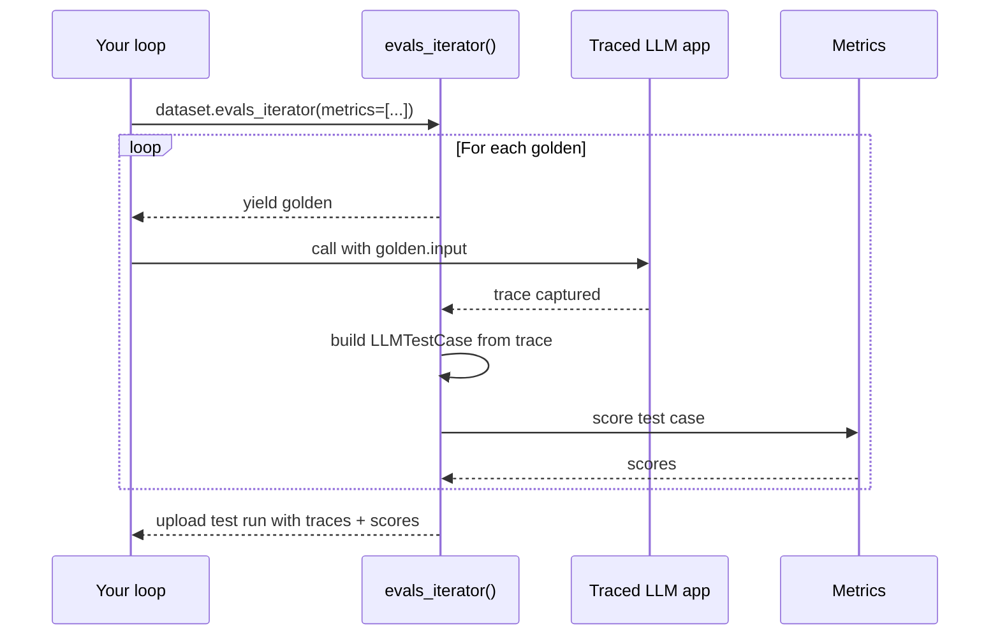
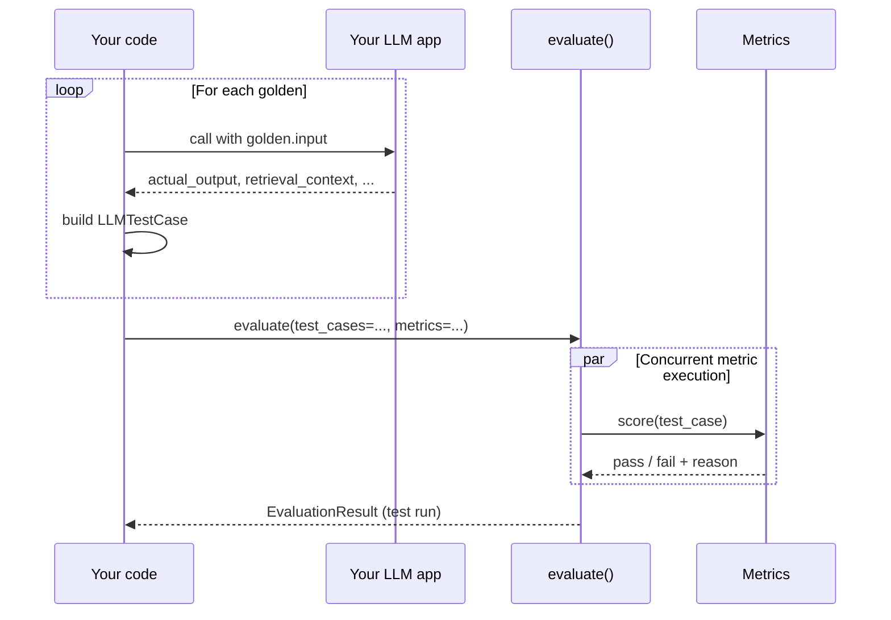

import { ASSETS } from "@site/src/assets";

A single-turn end-to-end test scores **one input → one output** per LLM interaction, captured as an [`LLMTestCase`](/docs/evaluation-test-cases#llm-test-cases). This is the right flavor for any LLM application with a "flat" shape — agents treated as a black box, RAG / QA, summarization, classifiers, writing assistants, and so on.

If you haven't already, read the [end-to-end overview](/docs/evaluation-end-to-end-llm-evals) for the concepts and how single-turn compares to multi-turn.

There are two ways to run a single-turn E2E test:

| Approach                                                                 | When to choose it                                                                                                                                                                             |
| ------------------------------------------------------------------------ | --------------------------------------------------------------------------------------------------------------------------------------------------------------------------------------------- |
| **`dataset.evals_iterator()` with `@observe` tracing** **— recommended** | Your app is (or can be) instrumented with [tracing](/docs/evaluation-llm-tracing). Test cases are built from traces automatically, and you get per-test-case traces on Confident AI for free. |
| **`evaluate(test_cases=...)`**                                           | You can't (or don't want to) instrument your app — e.g. a QA engineer evaluating a deployed system. You build `LLMTestCase`s up front and hand them to `evaluate()`.                          |

For projects you own, prefer `evals_iterator()` — same code, plus traces, plus a clean upgrade path to [component-level evaluation](/docs/evaluation-component-level-llm-evals).

## Approach 1: `evals_iterator()` with tracing (recommended)

`evals_iterator()` opens a test run, yields each golden, builds an `LLMTestCase` from the captured trace, scores your metrics against it, and uploads the trace + scores together — all in one loop.

:::caution[Don't have access to your app's code?]
This approach requires instrumenting your app with `@observe` or a framework integration. If you can't modify the app — e.g. you're testing someone else's API — skip ahead to **[Approach 2: `evaluate()`](#approach-2-evaluate)**.
:::



<Steps>
<Step>

### Build dataset

[Datasets](/docs/evaluation-datasets) in `deepeval` store [`Golden`s](/docs/evaluation-datasets#what-are-goldens) — precursors to test cases. You loop over goldens at evaluation time, run your traced LLM app on each, and `deepeval` builds an `LLMTestCase` from the resulting trace.

<Tabs items={["In Code", "Pull from Confident AI", "Load from CSV", "Load from JSON"]}>
<Tab value="In Code">

```python
from deepeval.dataset import Golden, EvaluationDataset

goldens = [
    Golden(input="What is your name?"),
    Golden(input="Choose a number between 1 and 100"),
    # ...
]

dataset = EvaluationDataset(goldens=goldens)
```

The dataset lives only for this run — no push, no save. Perfect for quickstarts and one-off evaluations.

</Tab>
<Tab value="Pull from Confident AI">

```python
from deepeval.dataset import EvaluationDataset

dataset = EvaluationDataset()
dataset.pull(alias="My dataset")
```

</Tab>
<Tab value="Load from CSV">

```python
from deepeval.dataset import EvaluationDataset

dataset = EvaluationDataset()
dataset.add_goldens_from_csv_file(
    file_path="example.csv",
    input_col_name="query",
)
```

</Tab>
<Tab value="Load from JSON">

```python
from deepeval.dataset import EvaluationDataset

dataset = EvaluationDataset()
dataset.add_goldens_from_json_file(
    file_path="example.json",
    input_key_name="query",
)
```

</Tab>
</Tabs>

:::tip
This page covers **sourcing** goldens for an eval run only. To **persist** a dataset (push to Confident AI, save as CSV/JSON, version it across runs), see [the datasets page](/docs/evaluation-datasets).
:::

</Step>

<Step>

### Instrument/trace and evaluate

Instrument your AI agent based on your tech stack, then loop with `evals_iterator(metrics=[...])` to score each captured trace as one end-to-end test case.

Each integration ships **Async** (default — fastest) and **Sync** variants:

- **Async** keeps `evals_iterator()` on its default async dispatch and wraps each invocation in `asyncio.create_task(...)` + `dataset.evaluate(task)` so goldens run concurrently.
- **Sync** passes `AsyncConfig(run_async=False)` and runs the loop body one golden at a time. Useful for debugging, rate-limited providers, or anywhere asyncio gets in the way (e.g. some Jupyter setups).

<include cwd>snippets/evaluation/end-to-end-agent-framework-tabs.mdx</include>

There are **SIX** optional parameters on `evals_iterator()`:

- [Optional] `metrics`: a list of `BaseMetric`s applied at the **trace** level — these are the end-to-end metrics that score the whole trace.
- [Optional] `identifier`: a string label for this test run on Confident AI.
- [Optional] `async_config`: an `AsyncConfig` controlling concurrency. See [async configs](/docs/evaluation-flags-and-configs#async-configs).
- [Optional] `display_config`: a `DisplayConfig` controlling console output. See [display configs](/docs/evaluation-flags-and-configs#display-configs).
- [Optional] `error_config`: an `ErrorConfig` controlling error handling. See [error configs](/docs/evaluation-flags-and-configs#error-configs).
- [Optional] `cache_config`: a `CacheConfig` controlling caching. See [cache configs](/docs/evaluation-flags-and-configs#cache-configs).

Every `evals_iterator()` run is snapshotted to disk, so you can open it in a trace-tree TUI with bare `deepeval inspect`. See the [`deepeval inspect` reference](/docs/command-line-interface#inspect) for full details.

To grade **individual components** (the retriever, a tool call, an inner LLM call) instead of (or in addition to) the trace, see [component-level evaluation](/docs/evaluation-component-level-llm-evals).

</Step>
</Steps>

If you're logged in to Confident AI via `deepeval login`, you'll also get to storage, share, view, and annotate full traces in testing reports on the platform:

<VideoDisplayer
  src={ASSETS.evaluationSingleTurnE2eReportTracing}
  confidentUrl="https://www.confident-ai.com/docs/llm-evaluation/dashboards/testing-reports"
  label="Test reports for evals and traces on Confident AI"
  description="Drill into each test case's scores, reasons, and the trace behind it."
/>

## Approach 2: `evaluate()`

Use this when you can't (or don't want to) instrument your app — for example a QA engineer testing a deployed system, or a quick one-off eval where adding tracing is overkill. You build a list of `LLMTestCase`s up front from inputs and outputs you've already collected, pick metrics, and call `evaluate()`.

**How it works:**

1. You build a list of `LLMTestCase`s yourself by looping over goldens and calling your LLM app.
2. You hand the test cases and metrics to `evaluate()` in a single call.
3. `deepeval` runs every metric on every test case (concurrently by default) and rolls the results into a test run.



Your LLM app and `deepeval` stay completely decoupled — `evaluate()` only sees the data you pass to it. That's why this approach has no tracing dependency.

:::caution[Don't preload `actual_output` on your goldens]
Because `evaluate()` only reads what you pass in, nothing stops you from skipping the app call entirely and preloading a dataset where `actual_output` is already filled in (e.g. outputs you collected last week). **We don't recommend this** — a test run should reflect the _current_ version of your LLM app, so you should re-run the app on every golden inside your loop. Treat goldens as inputs only; let `actual_output` be produced fresh each run.
:::

<Steps>
<Step>
### Build dataset

Same as [Approach 1](#approach-1-evals_iterator-with-tracing-recommended) — wrap your goldens in an `EvaluationDataset`. Pick whichever source fits where your goldens live today:

<Tabs items={["In Code", "Pull from Confident AI", "Load from CSV", "Load from JSON"]}>
<Tab value="In Code">

```python
from deepeval.dataset import Golden, EvaluationDataset

goldens = [
    Golden(input="What is your name?"),
    Golden(input="Choose a number between 1 and 100"),
    # ...
]

dataset = EvaluationDataset(goldens=goldens)
```

</Tab>
<Tab value="Pull from Confident AI">

```python
from deepeval.dataset import EvaluationDataset

dataset = EvaluationDataset()
dataset.pull(alias="My Evals Dataset")
```

</Tab>
<Tab value="Load from CSV">

```python
from deepeval.dataset import EvaluationDataset

dataset = EvaluationDataset()
dataset.add_goldens_from_csv_file(
    file_path="example.csv",
    input_col_name="query",
)
```

</Tab>
<Tab value="Load from JSON">

```python
from deepeval.dataset import EvaluationDataset

dataset = EvaluationDataset()
dataset.add_goldens_from_json_file(
    file_path="example.json",
    input_key_name="query",
)
```

</Tab>
</Tabs>

To persist a dataset (push to Confident AI, save as CSV/JSON, version across runs), see [the datasets page](/docs/evaluation-datasets).

</Step>

<Step>
### Construct test cases

Loop over your goldens, call your LLM app, and wrap each result in an `LLMTestCase`:

```python title="main.py"
from your_app import your_llm_app  # replace with your LLM app
from deepeval.test_case import LLMTestCase
...

for golden in dataset.goldens:
    answer, retrieved_chunks = your_llm_app(golden.input)
    dataset.add_test_case(
        LLMTestCase(
            input=golden.input,
            actual_output=answer,
            retrieval_context=retrieved_chunks,
        )
    )
```

:::info
The fields you populate on `LLMTestCase` must match what your metrics need. For example, `FaithfulnessMetric` requires `retrieval_context`. See [test cases](/docs/evaluation-test-cases#llm-test-cases) for the full parameter list.
:::

</Step>

<Step>
### Run `evaluate()`

Now pick the metrics you want to grade your application on, and pass both `test_cases` and `metrics` to `evaluate()`.

:::tip[Recommended metrics mix]
Keep your metrics tight — **no more than 5 per run**, made up of:

- **2–3 generic metrics** for your application type (agentic, RAG, chatbot, etc.)
- **1–2 custom metrics** for the specific things you care about ([`GEval`](/docs/metrics-llm-evals) or a [custom metric](/docs/metrics-custom))

See [the metrics section](/docs/metrics-introduction) for the 50+ built-in metrics, or ask for tailored recommendations on [Discord](https://discord.com/invite/a3K9c8GRGt).
:::

```python title="main.py"
from deepeval import evaluate
from deepeval.metrics import AnswerRelevancyMetric, FaithfulnessMetric
...

evaluate(
    test_cases=test_cases,
    metrics=[AnswerRelevancyMetric(), FaithfulnessMetric()],
)
```

There are **TWO** mandatory and **FIVE** optional parameters when calling `evaluate()` for end-to-end evaluation:

- `test_cases`: a list of `LLMTestCase`s **OR** `ConversationalTestCase`s, or an `EvaluationDataset`. You cannot mix `LLMTestCase`s and `ConversationalTestCase`s in the same test run.
- `metrics`: a list of metrics of type `BaseMetric`.
- [Optional] `identifier`: a string label for this test run on Confident AI.
- [Optional] `async_config`: an `AsyncConfig` controlling concurrency. See [async configs](/docs/evaluation-flags-and-configs#async-configs).
- [Optional] `display_config`: a `DisplayConfig` controlling console output. See [display configs](/docs/evaluation-flags-and-configs#display-configs).
- [Optional] `error_config`: an `ErrorConfig` controlling how errors are handled. See [error configs](/docs/evaluation-flags-and-configs#error-configs).
- [Optional] `cache_config`: a `CacheConfig` controlling caching behavior. See [cache configs](/docs/evaluation-flags-and-configs#cache-configs).

This is the same as `assert_test()` in `deepeval test run`, exposed as a function call instead.

:::info[Sync vs async metric execution]
By default, `evaluate()` runs metrics **concurrently** using `asyncio` under the hood — every metric for every test case is dispatched in parallel, with concurrency capped by `AsyncConfig.max_concurrent`. Set `run_async=False` to execute metrics sequentially instead:

```python
from deepeval.evaluate import AsyncConfig

evaluate(
    test_cases=test_cases,
    metrics=[AnswerRelevancyMetric()],
    async_config=AsyncConfig(
        run_async=False,     # run metrics one at a time
        max_concurrent=20,   # only used when run_async=True
        throttle_value=0,    # delay (in seconds) between dispatches
    ),
)
```

[TODO: when should you choose sync vs async? trade-offs, common pitfalls (e.g. Jupyter event loops, rate-limiting providers), recommended defaults]
:::

</Step>
</Steps>

## Hyperparameters

Log the model, prompt, and other configuration values with each test run so you can compare runs side-by-side on Confident AI and identify the best combination. Values must be `str | int | float` or a [`Prompt`](/docs/evaluation-prompts):

```python
import deepeval
from deepeval.metrics import TaskCompletionMetric

@deepeval.log_hyperparameters
def hyperparameters():
    return {"model": "gpt-4.1", "system_prompt": "Be concise."}

for golden in dataset.evals_iterator(metrics=[TaskCompletionMetric()]):
    my_ai_agent(golden.input)
```

On Confident AI, the logged values become filterable axes for comparing test runs and surfacing the model/prompt configuration that performs best:

<VideoDisplayer
  src={ASSETS.evaluationParameterInsights}
  confidentUrl="https://www.confident-ai.com/docs/llm-evaluation/dashboards/model-and-prompt-insights"
  label="Parameter insights to find the best model"
  description="Compare metric scores across models and prompts to pick a winner."
/>

## In CI/CD

To run single-turn end-to-end evaluations on every PR, swap `evaluate()` / `evals_iterator()` for `assert_test()` inside a `pytest` parametrized test, then run it with `deepeval test run`.

<Tabs items={["With tracing", "Without tracing"]}>
<Tab value="With tracing">

```python title="test_llm_app.py"
import pytest
from deepeval import assert_test
from deepeval.dataset import Golden
from deepeval.metrics import TaskCompletionMetric
from your_app import my_ai_agent  # @observe-instrumented

@pytest.mark.parametrize("golden", dataset.goldens)
def test_llm_app(golden: Golden):
    my_ai_agent(golden.input)
    assert_test(golden=golden, metrics=[TaskCompletionMetric()])
```

</Tab>
<Tab value="Without tracing">

```python title="test_llm_app.py"
import pytest
from deepeval import assert_test
from deepeval.dataset import Golden
from deepeval.test_case import LLMTestCase
from deepeval.metrics import AnswerRelevancyMetric
from your_app import my_ai_agent

@pytest.mark.parametrize("golden", dataset.goldens)
def test_llm_app(golden: Golden):
    output = my_ai_agent(golden.input)
    test_case = LLMTestCase(input=golden.input, actual_output=output)
    assert_test(test_case=test_case, metrics=[AnswerRelevancyMetric()])
```

</Tab>
</Tabs>

```bash
deepeval test run test_llm_app.py
```

See [unit testing in CI/CD](/docs/evaluation-unit-testing-in-ci-cd) for `assert_test()` parameters, YAML pipeline examples, and `deepeval test run` flags.

## FAQs

<FAQs
  qas={[
    {
      question: "What is single-turn end-to-end evaluation?",
      answer: (
        <>
          It treats your LLM app as a black box and scores its overall input and
          output for one atomic interaction, rather than scoring individual
          internal components. It's the simplest way to get started with evals.
        </>
      ),
    },
    {
      question:
        "Should I use `evals_iterator()` with tracing or plain `evaluate()`?",
      answer: (
        <>
          The recommended approach is <code>evals_iterator()</code> with tracing
          since it captures rich execution data and scales to nested components
          later. Use plain <code>evaluate()</code> if you just want to score a
          list of test cases without instrumenting your app.
        </>
      ),
    },
    {
      question: "Do I need to instrument my app with tracing to run end-to-end evals?",
      answer: (
        <>
          No. You can construct <code>LLMTestCase</code>s directly and pass them
          to <code>evaluate()</code>. Tracing is optional and mainly helps when
          you want to graduate to component-level evals.
        </>
      ),
    },
    {
      question: "Does `deepeval` integrate with my agent framework?",
      answer: (
        <>
          Yes. The traced approach works with native{" "}
          <a href="/integrations">integrations</a> for LangChain, LangGraph,
          LlamaIndex, Pydantic AI, CrewAI, and more, so you can run evals
          against the framework you already use instead of instrumenting
          everything by hand.
        </>
      ),
    },
    {
      question: "How do I run these same evals in CI/CD?",
      answer: (
        <>
          Swap <code>evaluate()</code> / <code>evals_iterator()</code> for{" "}
          <code>assert_test()</code> inside a <code>pytest</code> parametrized
          test and run it with <code>deepeval test run</code> so failing metrics
          fail the build.
        </>
      ),
    },
    {
      question: "What are hyperparameters used for?",
      answer:
        "They let you log arbitrary settings like model name, prompt template, and temperature alongside a test run, so you can compare which configuration produced the best scores.",
    },
    {
      question:
        "Can my team keep these test runs on the cloud and review results in a UI?",
      answer: (
        <>
          End-to-end runs are local-first. When you're logged into{" "}
          <a href="https://www.confident-ai.com">Confident AI</a> (the platform
          built by the <code>deepeval</code> team), the same run produces a
          sharable cloud{" "}
          <a href="https://www.confident-ai.com/docs/llm-evaluation/dashboards/testing-reports">
            testing report
          </a>{" "}
          your team can review together, with hyperparameter comparisons and
          regression tracking over time — no code changes required, and fully
          optional.
        </>
      ),
    },
  ]}
/>
