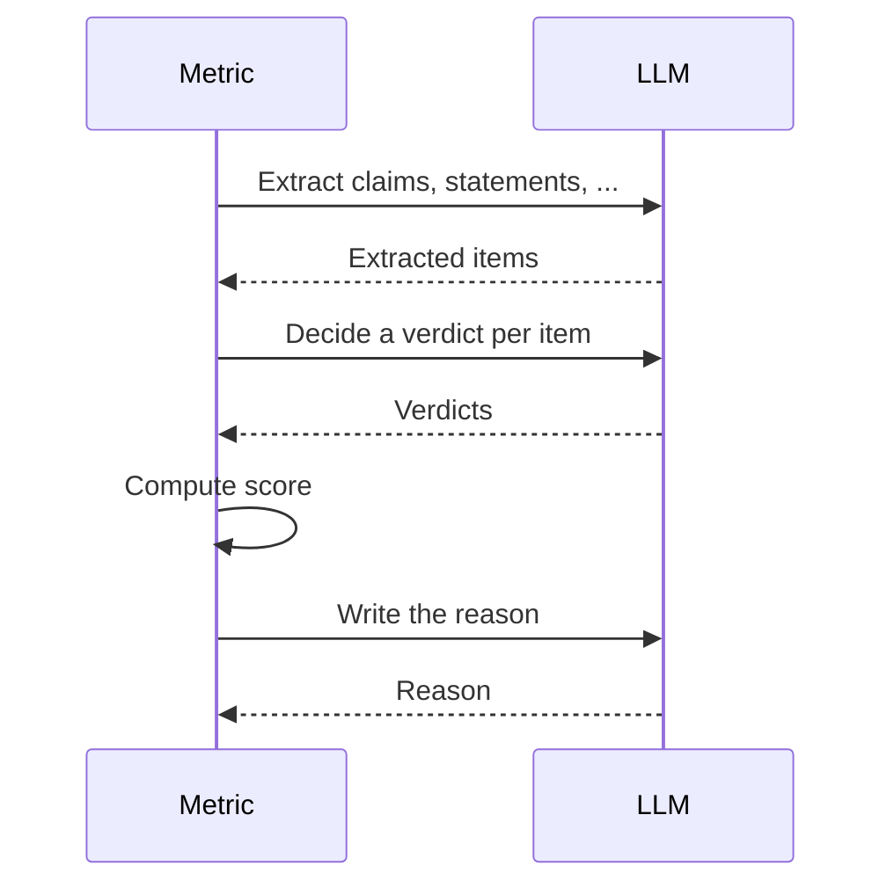
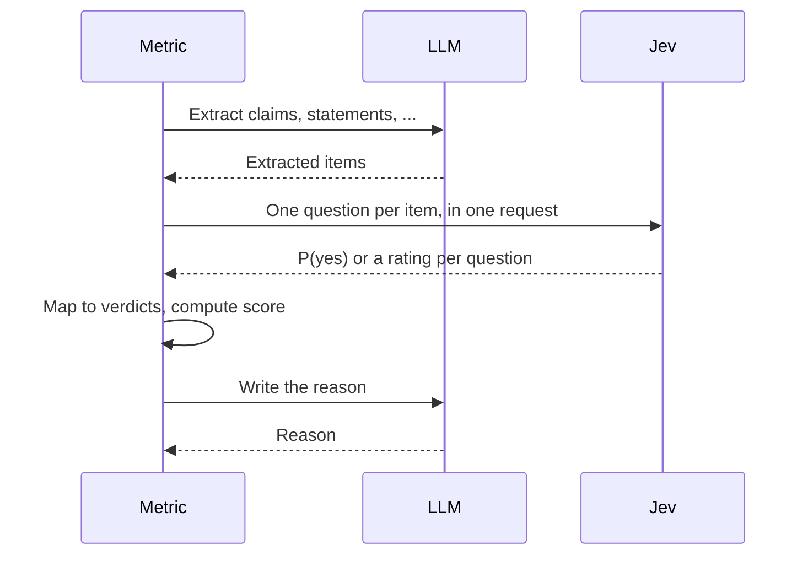
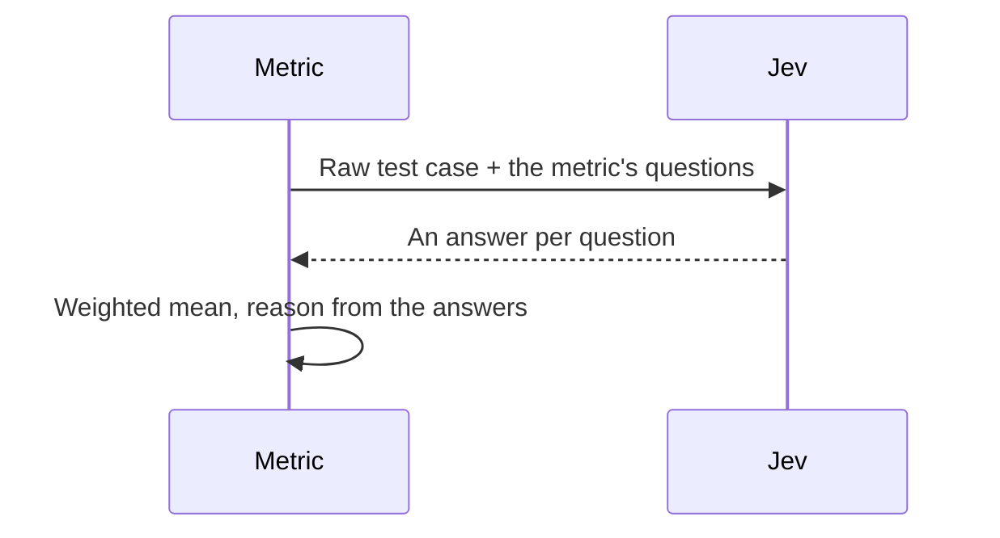

In `deepeval`, the **eval mode** decides who judges your LLM-as-a-judge metrics and classifiers: an LLM alone, an LLM and Jev together, or Jev alone. Jev is TypeSafe AI's System One model. Instead of generating text, it answers bounded questions (yes/no, a rating on a scale, one option from a set) with calibrated probabilities.

## Quick Summary

Every LLM-as-a-judge metric works in steps. It **extracts** the pieces of your test case it needs to judge (the statements in an answer, the claims it makes, the task an agent was given), **decides** about each piece, turns those decisions into a **score**, and writes a **reason**. The eval mode sets who does each step:

| Eval mode       | Extract | Decide | Reason                   | Needs              |
| --------------- | ------- | ------ | ------------------------ | ------------------ |
| `llm` (default) | LLM     | LLM    | LLM                      | An LLM key         |
| `hybrid`        | LLM     | Jev    | LLM                      | An LLM key and Jev |
| `system_one`    | None    | Jev    | Built from Jev's answers | Jev only           |


Under `llm`, each box is an LLM call (except the score, which is an equation). Under `hybrid`, the decide box goes to Jev. Under `system_one`, the whole chain collapses into **one Jev request** over your raw test case.

## Setting The Eval Mode

The eval mode is resolved per metric, in this order:

1. The `eval_mode` argument on the metric.
2. The `DEEPEVAL_EVAL_MODE` setting, set with the CLI or your environment.
3. The default fallback (`llm`).

Set it for every metric with the CLI (add `--save=dotenv` to persist it in `.env.local`):

```bash
deepeval set-eval-mode hybrid
deepeval set-eval-mode system_one
deepeval set-eval-mode llm  # back to the default
```

Or override it for a single metric, which lets you mix modes in one run:

```python
from deepeval.metrics import AnswerRelevancyMetric, FaithfulnessMetric

metrics = [
    FaithfulnessMetric(eval_mode="system_one"),
    AnswerRelevancyMetric(eval_mode="llm"),
]
```

:::caution
[Classifiers](/docs/classifiers-introduction) have no `hybrid` mode. Under `deepeval set-eval-mode hybrid` they run as `llm`.
:::

`hybrid` and `system_one` need a TypeSafe AI key: see [setting up Jev](/integrations/models/typesafe-ai#setting-up-your-api-key). Every metric that supports Jev also takes a `system_one_model` argument to choose the Jev model; it defaults to <DefaultSystemOneModel />.

### LLM-as-a-judge

Under `llm`, the default, **your [LLM judge](/docs/metrics-introduction#configure-llm-judges) runs every step**. Jev is never called, and `system_one_model` is ignored.



### Hybrid

Under `hybrid`, the LLM extracts and writes the reason, and **Jev makes every decision in between**. The metric's equation then turns Jev's decisions into a score, the same way it does under `llm`, so both modes score on the same scale.



A decision takes one of three shapes:

- **A verdict per item** (claim, statement, opinion, ...): one yes/no question per item.
- **A single verdict** (per turn, per conversation window, ...): one yes/no question.
- **A graded score** (Task Completion, Step Efficiency, ...): one rating question on the LLM rubric's levels, mapped onto `0` to `1`. When the metric writes its score and reason in the same step, the reason reports Jev's score and confidence.

Yes/no answers become verdicts by thresholding $P(\text{yes})$:

| Verdict options             | `yes`           | `borderline`     | `no`            |
| --------------------------- | --------------- | ---------------- | --------------- |
| `yes` / `no`                | `P(yes) >= 0.5` | Not used         | `P(yes) < 0.5`  |
| `yes` / `borderline` / `no` | `P(yes) > 0.65` | `0.35` to `0.65` | `P(yes) < 0.35` |

:::tip
If a Jev call fails mid-run (rate limit, test case too large, network error), the LLM makes that decision instead. A failure that won't improve on retry, such as a rejected key, keeps the rest of that measure on the LLM. Check what fell back and why:

```python
metric.measure(test_case)
print(metric.system_one_fallback_reason)  # None when Jev made every decision
```

A missing TypeSafe AI key or SDK fails when the metric is created.
:::

### Jev-as-a-judge

Under `system_one`, **Jev runs the whole metric in one request**. No LLM is built or called, so no LLM API key is needed.



There is no extract step: each metric is defined as a few bounded questions over the raw test case. For `FaithfulnessMetric`:

- Is every claim in `actual_output` supported by `retrieval_context`?
- Does no claim contradict it?
- How grounded is the output overall?

Agentic metrics also send the trace, keeping each span's name, type, inputs, outputs and tool calls. Each metric's page lists its questions under **"Jev-as-a-judge"** in "How Is It Calculated?".

Each answer becomes a value $v_i$ in $[0, 1]$:

- **Yes/no:** $P(\text{yes})$.
- **Rating:** the expected level divided by the top level.
- **Choice:** the value credited to the option Jev picks. An option with no value, such as "not applicable", drops the question.

The score is their weighted mean:

<Equation formula="\text{score} = \frac{\displaystyle\sum_i w_i \, v_i}{\displaystyle\sum_i w_i}" />

The reason is built from the same answers:

```text
Decided by jev-latest, minimum confidence 0.82.
1. Every factual claim in `actual_output` is supported by the facts in `retrieval_context`. -> clearly holds (P(yes)=0.91, confidence=0.82, weight=2)
2. No claim in `actual_output` contradicts the facts in `retrieval_context`. -> clearly holds (P(yes)=0.95, confidence=0.90)
3. How much of `actual_output` is grounded in the facts in `retrieval_context`? -> "Fully grounded" (expected level=0.94 of 1.00, confidence=0.88)
Score: 0.93 (weighted mean of 3 applicable questions).
```

:::caution
Nothing falls back to the LLM in this mode:

- **Test case too large** (over 32k tokens of test case plus question, or 64k for the whole request): caught before sending, and raises an error telling you to use `eval_mode="llm"`.
- **Any other Jev error** (rate limit after retries, rejected key, network error): raised as-is.
- **Multimodal test cases**: raise up front, since Jev evaluates text.
  :::

:::info
Scores from different eval modes are not the same number: a `system_one` score comes from Jev's answers, not the LLM chain's equation. Keep a metric on one eval mode when comparing runs.
:::

## Confidence Scores

Every metric that Jev judged, in `hybrid` or `system_one`, reports `metric.confidence`: the **least decisive** of Jev's answers for that measure, from `0` (a coin flip) to `1` (certain). One question on the fence is enough to make the score worth a second look, so the minimum is reported rather than an average.

```python
metric.measure(test_case)
if metric.confidence is not None and metric.confidence < 0.5:
    print("Jev was unsure:", metric.reason)
```

Ratings and choices carry the confidence Jev reports. A yes/no answer's confidence is $|2p - 1|$, which is what Jev's formula reduces to for two outcomes. Confidence measures how decisive Jev was, not whether it was right, and it never changes the score. It is `None` under `llm`.

## Which Metrics Support Which Mode

Each metric's page states which eval modes it supports and how it behaves under each. For example:

- [`GEval`](/docs/metrics-llm-evals): always runs as `llm`.
- [`JevEval`](/docs/metrics-jev-eval): always judged by Jev, whatever the eval mode.
- [`DAGMetric`](/docs/metrics-dag): Jev decides judgement nodes, and `system_one` runs as `hybrid` since task nodes need the LLM.
- [`FaithfulnessMetric`](/docs/metrics-faithfulness): supports all three modes.
- [`TaskCompletionMetric`](/docs/metrics-task-completion): supports all three modes, with Jev giving a graded score under `hybrid`.

:::info
Not all metrics use an LLM or Jev as the judge, so the eval mode doesn't apply to them. Voice metrics such as [Audio Integrity](/docs/metrics-audio-integrity) are one example.
:::

## Cost

A metric's `evaluation_cost` is the sum of what its judges charge, so it depends on the eval mode:

| Eval mode    | `evaluation_cost` includes                                                                  |
| ------------ | ------------------------------------------------------------------------------------------- |
| `llm`        | LLM tokens for extracting, deciding and writing the reason                                  |
| `hybrid`     | LLM tokens for extracting and writing the reason, plus Jev's input tokens for the decisions |
| `system_one` | Jev's input tokens only                                                                     |

Jev charges for input tokens only, not output tokens. If your LLM's pricing is unknown, as with a [custom model](/guides/guides-using-custom-llms), `evaluation_cost` is `None` under `llm` and `hybrid`.
