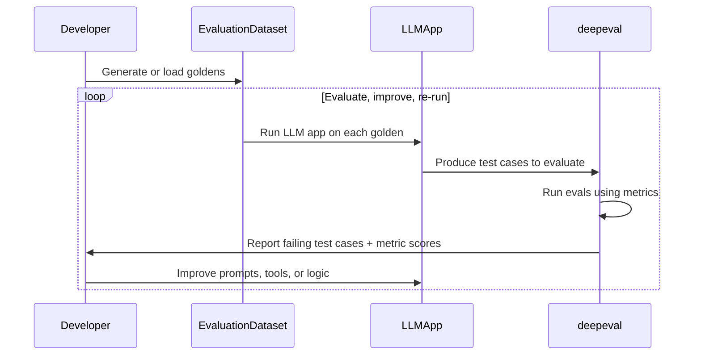
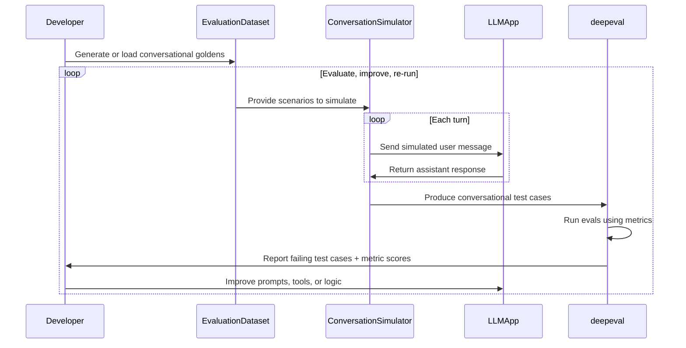

## Quick Summary

Evaluation refers to the process of testing your LLM application outputs. At the top level, there are **TWO** types of LLM apps:

- **Single-turn**: Each interaction is one input and one output, such as a RAG QA app or a one-shot agent.
- **Multi-turn**: Each interaction is a back-and-forth conversation, such as a chatbot or a customer support agent.

Either type can also vary in:

- **Modality**: Inputs and outputs can be text, images, voice, or video.
- **Data access**: Your LLM app can pull in external data through tool calls, RAG, or MCP.

Here's what an ideal evaluation workflow looks like using `deepeval`, and the components it requires, for each type. Multi-turn LLM apps have an extra simulation step that generates conversations for you to evaluate:

<Tabs items={["Single-Turn", "Multi-Turn"]}>
<Tab value="Single-Turn">

- Test cases (`LLMTestCase`s)
- Metrics
- Evaluation dataset of `Golden`s
- <Only id="python">[Optional] [Classifiers](/docs/classifiers-introduction), which label each test case from a closed set instead of scoring it</Only>



</Tab>
<Tab value="Multi-Turn">

- Test cases (`ConversationalTestCase`s)
- Multi-turn metrics
- Evaluation dataset of `ConversationalGolden`s
- Conversation simulator, which turns each `ConversationalGolden` into a conversation
- <Only id="python">[Optional] [Classifiers](/docs/classifiers-introduction), which label each test case from a closed set instead of scoring it</Only>



</Tab>
</Tabs>

There are **THREE** types of LLM evaluations in `deepeval`:

- [End-to-end evaluation](/docs/evaluation-end-to-end-llm-evals): The overall input and outputs of your LLM system.

- [Trajectory-based evaluation](/docs/evaluation-trajectory-based-llm-evals): The complete chain of decisions and actions your agent takes, evaluated as one unit.

- [Component-level evaluation](/docs/evaluation-component-level-llm-evals): The individual inner workings of your LLM system.

All three can be done using either <Term py="deepeval test run" ts="npx deepeval test run"/> in CI/CD pipelines, or via the `evaluate()` function in your scripts.

:::note
Your test cases will typically be in a single <Term py="test_example.py" ts="example.test.ts"/> file, and executing them will be as easy as running one command:

<Switch>

<Case id="python">

```bash
deepeval test run test_example.py
```

</Case>

<Case id="typescript">

```bash
npx deepeval test run example.test.ts
```

</Case>

</Switch>

:::

## Evals

Evals are what score your LLM application in `deepeval`. There are two kinds:

- [Metrics](/docs/metrics-introduction), which are **quantitative** evals that score each test case.
- <Only id="python">[Classifiers](/docs/classifiers-introduction), which are **categorical** evals that label each test case from a closed set.</Only>

### Metrics

Metrics are quantitative evals: each one returns a score between 0 and 1 along with a reason, and passes or fails against a `threshold`. `deepeval` offers 30+ metrics, most of which are evaluated using LLMs (visit the [metrics section](/docs/metrics-introduction#types-of-metrics) to learn why).

<Switch>

<Case id="python">

```python
from deepeval.metrics import AnswerRelevancyMetric

answer_relevancy_metric = AnswerRelevancyMetric()
```

</Case>

<Case id="typescript">

```typescript
import { AnswerRelevancyMetric } from "deepeval/metrics";

const answerRelevancyMetric = new AnswerRelevancyMetric();
```

</Case>

</Switch>

<Only id="python">

### Classifiers

Classifiers are categorical evals: instead of a score, they label each test case with one option from a closed set, such as whether your LLM app `refused` a request. Visit the [classifiers section](/docs/classifiers-introduction) to learn when to use them over metrics.

```python
from deepeval.classifiers import RefusalClassifier

refusal_classifier = RefusalClassifier()
```

:::tip
Both metrics and classifiers are judged by an LLM by default. Set the [eval mode](/docs/evaluation-eval-modes) to choose between using an LLM as a judge, Jev as a judge, or both together.
:::

</Only>

You'll need to create a test case to run `deepeval`'s evals.

## Test Run

Running an LLM evaluation creates a **test run** — a collection of test cases that benchmarks your LLM application at a specific point in time. If you're logged into Confident AI, you'll also receive a fully sharable [LLM testing report](https://www.confident-ai.com/docs/llm-evaluation/dashboards/testing-reports) on the cloud.

### Test Cases

In `deepeval`, a test case represents an [LLM interaction](/docs/evaluation-test-cases#what-is-an-llm-interaction) and allows you to use the evals you have defined to unit test LLM applications. Single-turn LLM apps are evaluated with an `LLMTestCase`, while multi-turn LLM apps, such as chatbots, are evaluated with a `ConversationalTestCase`:

<Tabs items={["Single-Turn", "Multi-Turn"]}>
<Tab value="Single-Turn">

<Switch>

<Case id="python">

```python
from deepeval.metrics import AnswerRelevancyMetric
from deepeval.test_case import LLMTestCase

answer_relevancy_metric = AnswerRelevancyMetric()
test_case = LLMTestCase(
  input="Who is the current president of the United States of America?",
  actual_output="Joe Biden",
  retrieval_context=["Joe Biden serves as the current president of America."]
)

answer_relevancy_metric.measure(test_case)
print(answer_relevancy_metric.score)
```

</Case>

<Case id="typescript">

```typescript
import { AnswerRelevancyMetric } from "deepeval/metrics";
import { LLMTestCase } from "deepeval/test-case";

const answerRelevancyMetric = new AnswerRelevancyMetric();
const testCase = new LLMTestCase({
  input: "Who is the current president of the United States of America?",
  actualOutput: "Joe Biden",
  retrievalContext: ["Joe Biden serves as the current president of America."],
});

await answerRelevancyMetric.measure(testCase);
console.log(answerRelevancyMetric.score);
```

</Case>

</Switch>

In this example, `input` mimics an user interaction with a RAG-based LLM application, where <Term py="actual_output" ts="actualOutput"/> is the output of your LLM application and <Term py="retrieval_context" ts="retrievalContext"/> is the retrieved nodes in your RAG pipeline.

</Tab>
<Tab value="Multi-Turn">

<Switch>

<Case id="python">

```python
from deepeval.metrics import ConversationCompletenessMetric
from deepeval.test_case import ConversationalTestCase, Turn

conversation_completeness_metric = ConversationCompletenessMetric()
test_case = ConversationalTestCase(
  scenario="User wants to cancel their subscription.",
  turns=[
    Turn(role="user", content="I want to cancel my plan."),
    Turn(role="assistant", content="Done. Your plan is cancelled effective today."),
  ]
)

conversation_completeness_metric.measure(test_case)
print(conversation_completeness_metric.score)
```

</Case>

<Case id="typescript">

```typescript
import { ConversationCompletenessMetric } from "deepeval/metrics";
import { ConversationalTestCase, Turn } from "deepeval/test-case";

const conversationCompletenessMetric = new ConversationCompletenessMetric();
const testCase = new ConversationalTestCase({
  scenario: "User wants to cancel their subscription.",
  turns: [
    new Turn({ role: "user", content: "I want to cancel my plan." }),
    new Turn({
      role: "assistant",
      content: "Done. Your plan is cancelled effective today.",
    }),
  ],
});

await conversationCompletenessMetric.measure(testCase);
console.log(conversationCompletenessMetric.score);
```

</Case>

</Switch>

In this example, `turns` is the conversation between a user and your chatbot, and `scenario` describes what the user is trying to achieve.

</Tab>
</Tabs>

A test case **passes** only if every metric that carries a verdict succeeds. Two flags let you control which verdicts count:

- **Metrics with <Term py="threshold=None" ts="threshold: null"/>** still compute scores and reasons, but have no pass/fail opinion and never decide a test case's status. Because every test case must end up passing or failing, each evaluation requires at least one non-flaky metric with a `threshold`.
- **Flaky test cases and metrics** (<Term py="flaky=True" ts="flaky: true"/>) have their results recorded and reported as normal, but their failures don't block anything: a flaky metric's failure never fails its test case, and a failing flaky test case makes <Term py="assert_test()" ts="expect(testCase).toPass()"/> print a warning instead of raising.

## Datasets

Datasets in `deepeval` is a collection of goldens. It provides a centralized interface for you to evaluate a collection of test cases using one or multiple metrics.

<Switch>

<Case id="python">

```python
from deepeval.test_case import LLMTestCase
from deepeval.dataset import EvaluationDataset, Golden
from deepeval.metrics import AnswerRelevancyMetric
from deepeval import evaluate

answer_relevancy_metric = AnswerRelevancyMetric()
dataset = EvaluationDataset(goldens=[Golden(input="Who is the current president of the United States of America?")])

for golden in dataset.goldens:
  dataset.add_test_case(
    LLMTestCase(
      input=golden.input,
      actual_output=you_llm_app(golden.input)
    )
  )

evaluate(test_cases=dataset.test_cases, metrics=[answer_relevancy_metric])
```

</Case>

<Case id="typescript">

```typescript
import { EvaluationDataset, Golden } from "deepeval/dataset";
import { AnswerRelevancyMetric } from "deepeval/metrics";
import { LLMTestCase } from "deepeval/test-case";
import { evaluate } from "deepeval";

const answerRelevancyMetric = new AnswerRelevancyMetric();
const dataset = new EvaluationDataset({
  goldens: [
    new Golden({
      input: "Who is the current president of the United States of America?",
    }),
  ],
});

for (const golden of dataset.goldens as Golden[]) {
  dataset.addTestCase(
    new LLMTestCase({
      input: golden.input,
      actualOutput: await yourLlmApp(golden.input),
    }),
  );
}

await evaluate(dataset.testCases, [answerRelevancyMetric]);
```

</Case>

</Switch>

:::note
You don't need to create an evaluation dataset to evaluate individual test cases. Visit the [test cases section](/docs/evaluation-test-cases#assert-a-test-case) to learn how to assert individual test cases.
:::

### Goldens

A golden is a test case that hasn't been run through your LLM application yet. It holds the input and the expected results, and becomes a test case once your LLM app produces an output for it. Single-turn LLM apps use a `Golden`, while multi-turn LLM apps use a `ConversationalGolden`, which the [simulator](#simulator) turns into a full conversation:

<Tabs items={["Single-Turn", "Multi-Turn"]}>
<Tab value="Single-Turn">

<Switch>

<Case id="python">

```python
from deepeval.dataset import Golden

golden = Golden(
  input="Who is the current president of the United States of America?",
  expected_output="Joe Biden"
)
```

</Case>

<Case id="typescript">

```typescript
import { Golden } from "deepeval/dataset";

const golden = new Golden({
  input: "Who is the current president of the United States of America?",
  expectedOutput: "Joe Biden",
});
```

</Case>

</Switch>

</Tab>
<Tab value="Multi-Turn">

<Switch>

<Case id="python">

```python
from deepeval.dataset import ConversationalGolden

golden = ConversationalGolden(
  scenario="User wants to cancel their subscription.",
  expected_outcome="The plan is cancelled and the user receives a confirmation."
)
```

</Case>

<Case id="typescript">

```typescript
import { ConversationalGolden } from "deepeval/dataset";

const golden = new ConversationalGolden({
  scenario: "User wants to cancel their subscription.",
  expectedOutcome: "The plan is cancelled and the user receives a confirmation.",
});
```

</Case>

</Switch>

</Tab>
</Tabs>

## Synthetic Data

`deepeval` can generate the data you evaluate with, so you don't have to write every golden or conversation by hand.

### Synthesizer

<Switch>

<Case id="python">

In `deepeval`, the `Synthesizer` allows you to generate synthetic datasets. This is especially helpful if you don't have production data or you don't have a golden dataset to evaluate with.

```python
from deepeval.synthesizer import Synthesizer
from deepeval.dataset import EvaluationDataset

synthesizer = Synthesizer()
goldens = synthesizer.generate_goldens_from_docs(
  document_paths=['example.txt', 'example.docx', 'example.pdf']
)

dataset = EvaluationDataset(goldens=goldens)
```

:::info
`deepeval`'s `Synthesizer` is highly customizable, and you can learn more about it [here.](/docs/golden-synthesizer)
:::

</Case>

<Case id="typescript">

<NotImplemented id="typescript" feature="Synthesizer">

It generates synthetic goldens for you when you have neither production data nor a golden dataset. Until it lands, build your `EvaluationDataset` from goldens you write by hand or [pull one from Confident AI](/docs/evaluation-datasets) — everything else on this page works the same.

</NotImplemented>

</Case>

</Switch>

### Simulator

The simulator is only relevant if you're evaluating a multi-turn LLM app, such as a chatbot. It takes your `ConversationalGolden`s, role-plays a user in each scenario, and records your chatbot's responses turn by turn, producing `ConversationalTestCase`s for you to evaluate.

<Switch>

<Case id="python">

```python
from deepeval.dataset import ConversationalGolden
from deepeval.simulator import ConversationSimulator
from deepeval.test_case import Turn

async def model_callback(input: str) -> Turn:
  return Turn(role="assistant", content=your_chatbot(input))

simulator = ConversationSimulator(model_callback=model_callback)
test_cases = simulator.simulate(
  conversational_goldens=[
    ConversationalGolden(
      scenario="User wants to cancel their subscription.",
      expected_outcome="The plan is cancelled and the user receives a confirmation."
    )
  ]
)
```

:::info
The `ConversationSimulator` supports personas, custom stopping logic, and voice agents. You can learn more about it [here.](/docs/conversation-simulator)
:::

</Case>

<Case id="typescript">

```typescript
import { ConversationalGolden } from "deepeval/dataset";
import { ConversationSimulator } from "deepeval";
import { Turn } from "deepeval/test-case";

const simulator = new ConversationSimulator({
  modelCallback: async ({ input }) =>
    new Turn({ role: "assistant", content: await yourChatbot(input) }),
});

const testCases = await simulator.simulate({
  conversationalGoldens: [
    new ConversationalGolden({
      scenario: "User wants to cancel their subscription.",
      expectedOutcome:
        "The plan is cancelled and the user receives a confirmation.",
    }),
  ],
});
```

</Case>

</Switch>

## Unit Testing in CI/CD

<Switch>

<Case id="python">

:::caution
Although `deepeval` integrates with Pytest, we highly recommend you to **AVOID** executing `LLMTestCase`s directly via the `pytest` command to avoid any unexpected errors.
:::

`deepeval` allows you to run evaluations as if you're using Pytest via our Pytest integration. Simply create a test file:

```python title="test_example.py"
from deepeval import assert_test
from deepeval.dataset import EvaluationDataset, Golden
from deepeval.test_case import LLMTestCase
from deepeval.metrics import AnswerRelevancyMetric

dataset = EvaluationDataset(goldens=[...])

for golden in dataset.goldens:
  dataset.add_test_case(...) # convert golden to test case

@pytest.mark.parametrize(
    "test_case",
    dataset.test_cases,
)
def test_customer_chatbot(test_case: LLMTestCase):
    assert_test(test_case, [AnswerRelevancyMetric()])
```

And run the test file in the CLI using `deepeval test run`:

```bash
deepeval test run test_example.py
```

There are **TWO** mandatory and **ONE** optional parameter when calling the `assert_test()` function:

- `test_case`: an `LLMTestCase`
- `metrics`: a list of metrics of type `BaseMetric`
- [Optional] `run_async`: a boolean which when set to `True`, enables concurrent evaluation of all metrics. Defaulted to `True`.

:::info
`@pytest.mark.parametrize` is a decorator offered by Pytest. It simply loops through your `EvaluationDataset` to evaluate each test case individually.
:::

</Case>

<Case id="typescript">

`deepeval` runs evaluations as Vitest tests through the `toPass()` matcher. Simply create a test file:

```typescript title="example.test.ts"
import { it, expect } from "vitest";
import { EvaluationDataset, Golden } from "deepeval/dataset";
import { AnswerRelevancyMetric } from "deepeval/metrics";
import { LLMTestCase } from "deepeval/test-case";
import "deepeval/vitest";

const dataset = new EvaluationDataset({
  goldens: [new Golden({ input: "..." })],
});

for (const golden of dataset.goldens as Golden[]) {
  // convert golden to test case
  dataset.addTestCase(
    new LLMTestCase({ input: golden.input, actualOutput: "..." }),
  );
}

it.each(dataset.testCases)("AI app stays relevant #%$", async (testCase) => {
  await expect(testCase).toPass([new AnswerRelevancyMetric()]);
});
```

And run the test file in the CLI using `npx deepeval test run`:

```bash
npx deepeval test run example.test.ts
```

The test case goes to `expect()`, and `toPass()` takes one argument:

- `metrics`: an array of metrics of type `BaseMetric`, run concurrently against the test case

:::info
`it.each` is offered by Vitest. It loops through your `EvaluationDataset` to register one test per test case, and `%$` in the title interpolates that case's position in the dataset so each test is named uniquely.
:::

:::info
Importing `deepeval/vitest` registers the `toPass()` matcher. `npx deepeval test run` injects it for you, so the import only matters when you run the same file with `vitest` directly.
:::

</Case>

</Switch>

You can find the full documentation on running evals in CI/CD, for [end-to-end](/docs/evaluation-end-to-end-llm-evals#use-deepeval-test-run-in-cicd-pipelines), [trajectory-based](/docs/evaluation-trajectory-based-llm-evals#in-cicd), and [component-level](/docs/evaluation-component-level-llm-evals#use-deepeval-test-run-in-cicd-pipelines) evaluation by clicking on their respective links.

You can include the command as a step in a `.yaml` file in your CI/CD workflows to run pre-deployment checks on your LLM application.

## Evaluating In Scripts

<Switch>

<Case id="python">

Alternately, you can use `deepeval`'s `evaluate` function. This approach avoids the CLI (if you're in a notebook environment), and allows for parallel test execution as well.

```python
from deepeval import evaluate
from deepeval.metrics import AnswerRelevancyMetric
from deepeval.dataset import EvaluationDataset

dataset = EvaluationDataset(goldens=[...])
for golden in dataset.goldens:
  dataset.add_test_case(...) # convert golden to test case

evaluate(dataset, [AnswerRelevancyMetric()])
```

There are **TWO** mandatory and **SIX** optional parameters when calling the `evaluate()` function:

- `test_cases`: a list of `LLMTestCase`s **OR** `ConversationalTestCase`s, or an `EvaluationDataset`. You cannot evaluate `LLMTestCase`s and `ConversationalTestCase`s in the same test run.
- `metrics`: a list of metrics of type `BaseMetric`.
- [Optional] `hyperparameters`: a dict of type `dict[str, Union[str, int, float]]`. You can log any arbitrary hyperparameter associated with this test run to pick the best hyperparameters for your LLM application on Confident AI.
- [Optional] `identifier`: a string that allows you to better identify your test run on Confident AI.
- [Optional] `async_config`: an instance of type `AsyncConfig` that allows you to [customize the degree concurrency](/docs/evaluation-flags-and-configs#async-configs) during evaluation. Defaulted to the default `AsyncConfig` values.
- [Optional] `display_config`:an instance of type `DisplayConfig` that allows you to [customize what is displayed](/docs/evaluation-flags-and-configs#display-configs) to the console during evaluation. Defaulted to the default `DisplayConfig` values.
- [Optional] `error_config`: an instance of type `ErrorConfig` that allows you to [customize how to handle errors](/docs/evaluation-flags-and-configs#error-configs) during evaluation. Defaulted to the default `ErrorConfig` values.
- [Optional] `cache_config`: an instance of type `CacheConfig` that allows you to [customize the caching behavior](/docs/evaluation-flags-and-configs#cache-configs) during evaluation. Defaulted to the default `CacheConfig` values.

</Case>

<Case id="typescript">

Alternately, you can use `deepeval`'s `evaluate` function. This approach avoids the CLI, and still runs your metrics concurrently.

```typescript
import { EvaluationDataset, Golden } from "deepeval/dataset";
import { AnswerRelevancyMetric } from "deepeval/metrics";
import { LLMTestCase } from "deepeval/test-case";
import { evaluate } from "deepeval";

const dataset = new EvaluationDataset({
  goldens: [new Golden({ input: "..." })],
});

for (const golden of dataset.goldens as Golden[]) {
  // convert golden to test case
  dataset.addTestCase(
    new LLMTestCase({ input: golden.input, actualOutput: "..." }),
  );
}

await evaluate(dataset.testCases, [new AnswerRelevancyMetric()]);
```

There are **TWO** mandatory arguments and **FIVE** optional options when calling the `evaluate()` function:

- `testCases`: an array of `LLMTestCase`s **OR** `ConversationalTestCase`s. You cannot evaluate `LLMTestCase`s and `ConversationalTestCase`s in the same test run.
- `metrics`: an array of metrics of type `BaseMetric`.
- [Optional] `asyncConfig`: an object that lets you cap concurrency through `maxConcurrent`. Defaulted to `20`.
- [Optional] `displayConfig`: an object that controls what is displayed to the console during evaluation, and whether the report is also written to a file.
- [Optional] `errorConfig`: an object that controls how errors are handled, through `ignoreErrors` and `skipOnMissingParams`.
- [Optional] `cacheConfig`: an object that controls caching, through `writeCache` and `useCache`.
- [Optional] `official`: a boolean which when set to `true`, marks this as the official test run for the dataset on Confident AI.

</Case>

</Switch>

You can find the full documentation on `evaluate()`, for both [end-to-end](/docs/evaluation-end-to-end-llm-evals#use-evaluate-in-python-scripts) and [component-level](/docs/evaluation-component-level-llm-evals#use-evaluate-in-python-scripts) evaluation by clicking on their respective links.

:::tip
You can also replace `dataset` with a list of test cases, as shown in the [test cases section.](/docs/evaluation-test-cases#evaluate-test-cases-in-bulk)
:::

## Evaluating Nested Components

You can also run metrics on nested components by setting up tracing in `deepeval`, and requires under 10 lines of code:

<Switch>

<Case id="python">

```python showLineNumbers {8}
from deepeval.test_case import LLMTestCase
from deepeval.metrics import AnswerRelevancyMetric
from deepeval.tracing import observe, update_current_span
from openai import OpenAI

client = OpenAI()

@observe(metrics=[AnswerRelevancyMetric()])
def complete(query: str):
  response = client.chat.completions.create(model="gpt-4o", messages=[{"role": "user", "content": query}]).choices[0].message.content

  update_current_span(
    test_case=LLMTestCase(input=query, actual_output=response)
  )
  return response
```

</Case>

<Case id="typescript">

```typescript showLineNumbers {8}
import { observe, updateCurrentSpan } from "deepeval/tracing";
import { AnswerRelevancyMetric } from "deepeval/metrics";
import { LLMTestCase } from "deepeval/test-case";
import OpenAI from "openai";

const client = new OpenAI();

const complete = observe({
  metrics: [new AnswerRelevancyMetric()],
  fn: async (query: string) => {
    const completion = await client.chat.completions.create({
      model: "gpt-4o",
      messages: [{ role: "user", content: query }],
    });
    const response = completion.choices[0].message.content ?? "";

    updateCurrentSpan({
      testCase: new LLMTestCase({ input: query, actualOutput: response }),
    });
    return response;
  },
});
```

</Case>

</Switch>

This is very useful especially if you:

- Want to run a different set of metrics on different components
- Wish to evaluate multiple components at once
- Don't want to rewrite your codebase just to bubble up returned variables to create an `LLMTestCase`

By default, `deepeval` will not run any metrics when you're running your LLM application outside of `evaluate()` or <Term py="assert_test()" ts="expect(testCase).toPass()"/>. For the full guide on evaluating with tracing, visit [this page.](/docs/evaluation-component-level-llm-evals)

## Framework Integrations

Framework integrations capture your application's traces and spans so `deepeval` metrics can evaluate complete agent trajectories or individual components without you recreating the execution structure manually.

Here are a few examples available for your selected SDK:

<include cwd>snippets/integrations/framework-integration-card-examples.mdx</include>

[Browse all framework integrations →](/integrations)

## FAQs

<FAQs
  qas={[
    {
      question: "What are the three components an LLM evaluation needs?",
      answer: (
        <>
          A <a href="/docs/evaluation-test-cases">test case</a> (the{" "}
          <code>input</code> and{" "}
          <Term py="actual_output" ts="actualOutput" /> to score), one or
          more <a href="/docs/metrics-introduction">metrics</a>, and optionally
          an <a href="/docs/evaluation-datasets">evaluation dataset</a> to run
          those metrics across many test cases at once.
        </>
      ),
    },
    {
      question:
        "When should I run end-to-end vs component-level evals in `deepeval`?",
      answer: (
        <>
          Use{" "}
          <a href="/docs/evaluation-end-to-end-llm-evals">end-to-end</a> when
          you only care about your system's final input and output. Use{" "}
          <a href="/docs/evaluation-component-level-llm-evals">
            component-level
          </a>{" "}
          (via <code>observe</code>) when you need to score individual
          retrievers, tools, or agents to see exactly where things break.
        </>
      ),
    },
    {
      question:
        "Do I need a `deepeval` account or API key to run evals?",
      answer: (
        <>
          No. <code>deepeval</code> runs entirely locally. The only key you
          typically need is an LLM provider key such as{" "}
          <code>OPENAI_API_KEY</code> for metrics that use an LLM judge. A
          Confident AI account is optional and only needed to push results to
          the cloud.
        </>
      ),
    },
    {
      question:
        "Should I run evals in CI/CD or with the `evaluate()` function?",
      answer: (
        <>
          Use{" "}
          <Term py="deepeval test run" ts="npx deepeval test run" /> when you
          want evals gated in CI/CD, and <code>evaluate()</code> for scripts
          where you want parallel execution without the CLI. Both run the same
          metrics on the same test cases.
        </>
      ),
    },
    {
      question:
        "How does `deepeval` score outputs without an exact match to the expected output?",
      answer: (
        <>
          Most of <code>deepeval</code>'s 30+ metrics use an LLM judge with
          techniques like G-Eval, DAG, and QAG rather than string matching, so
          a correct answer phrased differently from the{" "}
          <Term py="expected_output" ts="expectedOutput" /> can still pass.
        </>
      ),
    },
    {
      question:
        "Can my team keep `deepeval` results on the cloud and review them in a shared UI?",
      answer: (
        <>
          Every test run is local-first, but when you're logged into{" "}
          <a href="https://www.confident-ai.com">Confident AI</a> (the platform
          built by the <code>deepeval</code> team) the same run produces a
          sharable{" "}
          <a href="https://www.confident-ai.com/docs/llm-evaluation/dashboards/testing-reports">
            testing report
          </a>{" "}
          on the cloud. That gives a team a shared UI to compare runs, track
          regressions over time, and inspect failing cases — without changing
          any of your evaluation code. It's optional; local runs work exactly
          the same with or without it.
        </>
      ),
    },
  ]}
/>
