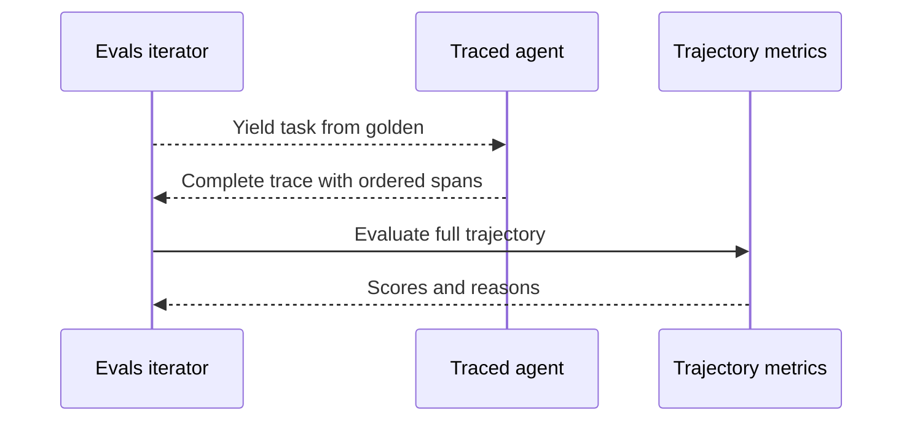

Trajectory-based evaluation assesses the **entire chain of decisions and actions** an AI agent takes to complete a task. It is designed for agents and long-horizon agents whose quality depends not only on the final answer, but also on the plans, tool calls, handoffs, and intermediate steps that produced it.

## What Are Trajectory-Based Evals?

An agent trajectory is the ordered sequence of steps between receiving a task and producing a result. A trajectory may contain planning, LLM generations, tool calls, retries, sub-agent handoffs, and other intermediate operations.

<Switch>

<Case id="python">

<AgentTraceTerminal
  title="travel_agent · trajectory eval"
  ariaLabel="Agent trajectory with metrics applied to the entire trace"
  lines={[
    { kind: "cmd", name: "python evaluate_agent.py" },
    { kind: "blank" },
    {
      kind: "root",
      prefix: "●",
      name: "Plan a three-day trip to Paris",
      metric: "Task Completion",
      score: "0.96",
      pass: true,
    },
    { kind: "blank" },
    {
      kind: "agent",
      prefix: "└─",
      name: "travel_agent",
      duration: "6.4s",
      scope: "start",
    },
    {
      kind: "llm",
      prefix: "   ├─",
      name: "create_plan",
      duration: "820ms",
      scope: "middle",
    },
    {
      kind: "agent",
      prefix: "   ├─",
      name: "research_agent",
      duration: "2.8s",
      scope: "middle",
    },
    {
      kind: "agent",
      prefix: "   │  ├─",
      name: "flight_agent",
      duration: "1.4s",
      scope: "middle",
    },
    {
      kind: "tool",
      prefix: "   │  │  └─",
      name: "search_flights(destination='Paris')",
      duration: "1.1s",
      scope: "middle",
    },
    {
      kind: "agent",
      prefix: "   │  └─",
      name: "stay_agent",
      duration: "1.3s",
      scope: "middle",
    },
    {
      kind: "tool",
      prefix: "   │     └─",
      name: "find_hotels(city='Paris')",
      duration: "940ms",
      scope: "middle",
    },
    {
      kind: "agent",
      prefix: "   ├─",
      name: "itinerary_agent",
      duration: "1.5s",
      scope: "middle",
    },
    {
      kind: "tool",
      prefix: "   │  ├─",
      name: "search_attractions(city='Paris')",
      duration: "610ms",
      scope: "middle",
    },
    {
      kind: "llm",
      prefix: "   │  └─",
      name: "build_itinerary",
      duration: "890ms",
      scope: "middle",
    },
    {
      kind: "llm",
      prefix: "   └─",
      name: "final_response",
      duration: "1.3s",
      scope: "end",
    },
    { kind: "blank" },
    {
      kind: "summary",
      name: "Trajectory score  0.96  ·  entire trace evaluated",
      pass: true,
    },
  ]}
/>

</Case>

<Case id="typescript">

<AgentTraceTerminal
  title="travelAgent · trajectory eval"
  ariaLabel="Agent trajectory with metrics applied to the entire trace"
  lines={[
    { kind: "cmd", name: "npx tsx evaluate-agent.ts" },
    { kind: "blank" },
    {
      kind: "root",
      prefix: "●",
      name: "Plan a three-day trip to Paris",
      metric: "Task Completion",
      score: "0.96",
      pass: true,
    },
    { kind: "blank" },
    {
      kind: "agent",
      prefix: "└─",
      name: "travelAgent",
      duration: "6.4s",
      scope: "start",
    },
    {
      kind: "llm",
      prefix: "   ├─",
      name: "createPlan",
      duration: "820ms",
      scope: "middle",
    },
    {
      kind: "agent",
      prefix: "   ├─",
      name: "researchAgent",
      duration: "2.8s",
      scope: "middle",
    },
    {
      kind: "agent",
      prefix: "   │  ├─",
      name: "flightAgent",
      duration: "1.4s",
      scope: "middle",
    },
    {
      kind: "tool",
      prefix: "   │  │  └─",
      name: "searchFlights(destination='Paris')",
      duration: "1.1s",
      scope: "middle",
    },
    {
      kind: "agent",
      prefix: "   │  └─",
      name: "stayAgent",
      duration: "1.3s",
      scope: "middle",
    },
    {
      kind: "tool",
      prefix: "   │     └─",
      name: "findHotels(city='Paris')",
      duration: "940ms",
      scope: "middle",
    },
    {
      kind: "agent",
      prefix: "   ├─",
      name: "itineraryAgent",
      duration: "1.5s",
      scope: "middle",
    },
    {
      kind: "tool",
      prefix: "   │  ├─",
      name: "searchAttractions(city='Paris')",
      duration: "610ms",
      scope: "middle",
    },
    {
      kind: "llm",
      prefix: "   │  └─",
      name: "buildItinerary",
      duration: "890ms",
      scope: "middle",
    },
    {
      kind: "llm",
      prefix: "   └─",
      name: "finalResponse",
      duration: "1.3s",
      scope: "end",
    },
    { kind: "blank" },
    {
      kind: "summary",
      name: "Trajectory score  0.96  ·  entire trace evaluated",
      pass: true,
    },
  ]}
/>

</Case>

</Switch>

Trajectory-based evals score this sequence as a whole. They can determine whether an agent completed its task, followed its plan, and avoided unnecessary steps by analyzing the full trace produced during execution.

This makes trajectory-based evaluation especially useful for:

- **Tool-using agents** that make multiple decisions before responding.
- **Long-horizon agents** that plan, act, observe, and revise over many steps.
- **Multi-agent systems** where work is delegated between agents.
- **Agent workflows** where two runs can produce the same final answer through very different paths.

## Trajectory-Based vs Other Evals

The difference is the scope visible to the metric:

- **[End-to-end evaluation](/docs/evaluation-end-to-end-llm-evals)** treats your application as a black box and evaluates its observable input and output.
- **Trajectory-based evaluation** looks inside an agent but evaluates the complete ordered chain of steps as one unit.
- **[Component-level evaluation](/docs/evaluation-component-level-llm-evals)** evaluates one internal span, such as a single retriever, LLM, tool, or sub-agent invocation.

Use trajectory-based evals when the path itself affects quality. You can combine all three approaches in one evaluation strategy: score the final result end-to-end, the complete agent trajectory, and selected critical components.

## How Trajectory-Based Evals Work

Each evaluation task produces one trace containing the agent's complete execution tree. The trace's ordered spans—such as plans, LLM calls, tool calls, and sub-agent handoffs—form the trajectory that the metrics evaluate.

1. <Term py="evals_iterator()" ts="evalsIterator()" /> yields a golden containing
   the agent's task.
2. Your instrumented agent runs the task and emits a trace of its internal steps.
3. `deepeval` associates the completed trace with that golden.
4. Trajectory metrics analyze the full trace and return a score and reason.
5. The trajectory and its metric results are stored together in the test run.



Unlike component-level evaluation, the metric is not attached to one span. It receives the complete trace so it can judge relationships between steps and the agent's overall execution.

## Evaluate an Agent Trajectory

Trajectory-based evaluation requires [tracing](/docs/evaluation-llm-tracing), because the metrics need access to the agent's internal execution steps. The <Term py="evals_iterator()" ts="evalsIterator()"/> method associates each dataset golden with its captured trace and evaluates that trajectory.

<Steps>
<Step>

### Build Dataset

Create an [`EvaluationDataset`](/docs/evaluation-datasets) containing representative tasks for your agent. Each [`Golden`](/docs/evaluation-datasets#what-are-goldens) supplies the input for one agent trajectory.

<include cwd>snippets/datasets/load-dataset.mdx#single-turn</include>

</Step>
<Step>

### Instrument Agent

Instrument your agent using `deepeval`'s native tracing or the integration for your framework. Every decision, tool call, and nested operation captured as a span becomes part of the trajectory available to the metrics.

<include cwd>snippets/evaluation/end-to-end-agent-framework-tabs.mdx</include>

</Step>
<Step>

### Evaluate Trajectory

Pass trajectory metrics to <Term py="evals_iterator()" ts="evalsIterator()"/>, then invoke your traced agent once for each golden. This guide uses only `TaskCompletionMetric`, `StepEfficiencyMetric`, and `PlanAdherenceMetric`; see the [metrics introduction](/docs/metrics-introduction) for guidance on metrics and their behavior.

<Switch>

<Case id="python">

```python title="evaluate_agent.py" showLineNumbers
from deepeval.metrics import (
    TaskCompletionMetric,
    StepEfficiencyMetric,
    PlanAdherenceMetric,
)

metrics = [
    TaskCompletionMetric(),
    StepEfficiencyMetric(),
    PlanAdherenceMetric(),
]

for golden in dataset.evals_iterator(metrics=metrics):
    my_ai_agent(golden.input)
```

</Case>

<Case id="typescript">

```typescript title="evaluate-agent.ts" showLineNumbers
import {
  TaskCompletionMetric,
  StepEfficiencyMetric,
  PlanAdherenceMetric,
} from "deepeval/metrics";

const metrics = [
  new TaskCompletionMetric(),
  new StepEfficiencyMetric(),
  new PlanAdherenceMetric(),
];

for await (const golden of dataset.evalsIterator({ metrics })) {
  await myAiAgent((golden as Golden).input);
}
```

</Case>

</Switch>

The iterator captures one trace per golden and evaluates the complete trajectory after the agent finishes. Each metric score and reason is stored alongside the trace, allowing you to connect a failure to the exact execution path that produced it.

</Step>
</Steps>

## In CI/CD

Run trajectory-based evals on every pull request by moving the same dataset, traced agent, and metrics into a <Term py="pytest" ts="vitest"/> test. A test fails when any trajectory metric falls below its threshold, allowing the eval to block a regression from shipping.

<Switch>

<Case id="python">

```python title="test_agent_trajectory.py" showLineNumbers
from deepeval.metrics import (
    TaskCompletionMetric,
    StepEfficiencyMetric,
    PlanAdherenceMetric,
)
from deepeval.dataset import EvaluationDataset, Golden
from deepeval import assert_test
from app import my_ai_agent
import pytest

dataset = EvaluationDataset(
    goldens=[Golden(input="Plan a three-day trip to Paris")]
)
metrics = [
    TaskCompletionMetric(),
    StepEfficiencyMetric(),
    PlanAdherenceMetric(),
]

@pytest.mark.parametrize("golden", dataset.goldens)
def test_agent_trajectory(golden: Golden):
    my_ai_agent(golden.input)
    assert_test(golden=golden, metrics=metrics)
```

```bash
deepeval test run test_agent_trajectory.py
```

</Case>

<Case id="typescript">

```typescript title="agent-trajectory.test.ts" showLineNumbers
import {
  TaskCompletionMetric,
  StepEfficiencyMetric,
  PlanAdherenceMetric,
} from "deepeval/metrics";
import { EvaluationDataset, Golden } from "deepeval/dataset";
import { myAiAgent } from "./app";
import { expect, it } from "vitest";
import "deepeval/vitest";

const dataset = new EvaluationDataset({
  goldens: [new Golden({ input: "Plan a three-day trip to Paris" })],
});
const metrics = [
  new TaskCompletionMetric(),
  new StepEfficiencyMetric(),
  new PlanAdherenceMetric(),
];

it.each(dataset.goldens as Golden[])(
  "evaluates the complete trajectory #%$",
  async (golden) => {
    await expect(golden).toPass(metrics, {
      task: (g) => myAiAgent(g.input),
    });
  },
);
```

```bash
npx deepeval test run agent-trajectory.test.ts
```

</Case>

</Switch>

Your agent must remain instrumented in CI so the assertion can capture and evaluate its complete trace. See [unit testing in CI/CD](/docs/evaluation-unit-testing-in-ci-cd) for pipeline configuration and command options.

## FAQs

<FAQs
  qas={[
    {
      question: "What is trajectory-based evaluation?",
      answer: (
        <>
          Trajectory-based evaluation scores the complete ordered path an AI
          agent takes through planning, model calls, tools, handoffs, and other
          intermediate steps while completing one task.
        </>
      ),
    },
    {
      question:
        "How is trajectory-based evaluation different from end-to-end and component-level evaluation?",
      answer: (
        <>
          End-to-end evaluation treats the application as a black box and
          scores its observable result. Component-level evaluation scores one
          internal span. Trajectory-based evaluation looks inside the agent but
          scores the entire chain of spans as one execution.
        </>
      ),
    },
    {
      question: "Why does trajectory-based evaluation require tracing?",
      answer: (
        <>
          The metrics need the agent's internal execution steps, not only its
          final output. Tracing captures those steps as an ordered tree and
          associates the resulting trajectory with the current golden.
        </>
      ),
    },
    {
      question: "Can trajectory-based evals run in CI/CD?",
      answer: (
        <>
          Yes. Run your traced agent inside a <code>pytest</code> or{" "}
          <code>vitest</code> test and pass trajectory metrics to the
          assertion. The test fails when a metric misses its configured
          threshold.
        </>
      ),
    },
    {
      question: "Which metrics does this guide use?",
      answer: (
        <>
          This guide uses <code>TaskCompletionMetric</code>,{" "}
          <code>StepEfficiencyMetric</code>, and{" "}
          <code>PlanAdherenceMetric</code>. See the{" "}
          <a href="/docs/metrics-introduction">metrics introduction</a> for
          metric guidance and configuration.
        </>
      ),
    },
    {
      question:
        "Can I combine trajectory-based and component-level evaluation?",
      answer: (
        <>
          Yes. Pass trajectory metrics to the iterator or test assertion, then
          attach component metrics to the individual spans you also want to
          inspect. Both scopes can be evaluated during the same traced run.
        </>
      ),
    },
  ]}
/>
