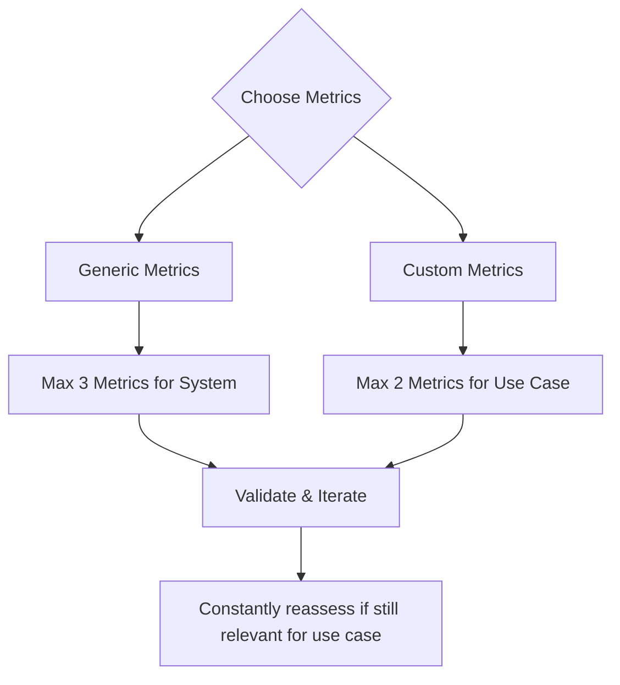

import { ASSETS } from "@site/src/assets";

`deepeval` offers 50+ SOTA, ready-to-use metrics for you to quickly get started with. Essentially, while a test case represents the thing you're trying to measure, the metric acts as the ruler for specific criteria of interest.

## Quick Summary

Almost all predefined metrics on `deepeval` use **LLM-as-a-judge**, with techniques such as **QAG** (question-answer-generation), **DAG** (deep acyclic graphs), and **G-Eval**. Most score [test cases](/docs/evaluation-test-cases) representing atomic interactions, while [trajectory metrics](/docs/evaluation-trajectory-based-llm-evals) score the complete ordered trace produced by an AI agent.

All of `deepeval`'s metrics output a **score between 0-1** based on its corresponding equation, as well as score **reasoning**. A metric is only successful if the evaluation score is equal to or greater than `threshold`, which is defaulted to `0.5` for all metrics.

<Tabs items={["Custom metrics", "AI Agents", "RAG", "Chatbots (multi-turn)", "Safety", "Image", "Others"]}>
<Tab value="Custom metrics">

Custom metrics allow you to define your **custom criteria** using SOTA implementations of LLM-as-a-Judge metrics in everyday language:

- G-Eval
- DAG (Deep Acyclic Graph)
- Conversational G-Eval
- Conversational DAG
- Arena G-Eval
- Do it yourself, 100% self-coded metrics (e.g. if you want to use BLEU, ROUGE)

You should aim to have **at least one** custom metric in your LLM evals pipeline.

</Tab>
<Tab value="AI Agents">

Agentic metrics evaluate AI agents at two different scopes:

**Trajectory metrics** analyze the complete ordered chain of decisions and actions captured through [LLM tracing](/docs/evaluation-llm-tracing):

- Task Completion — whether the agent successfully accomplished its task.
- Step Efficiency — whether the agent avoided unnecessary or redundant steps.
- Plan Adherence — whether the agent followed its generated plan.
- Plan Quality — whether the generated plan was logical, complete, and efficient.

**Component-level action metrics** evaluate one LLM decision about tool selection and arguments inside that trajectory:

- Tool Correctness — whether the agent selected the correct tools.
- Argument Correctness — whether it supplied the correct arguments to those tools.

Use [trajectory-based evaluation](/docs/evaluation-trajectory-based-llm-evals) for overall execution quality and [component-level evaluation](/docs/evaluation-component-level-llm-evals) to diagnose individual actions.

</Tab>
<Tab value="RAG">

RAG (retrieval augmented generation) metrics focus on the **retriever and generator components** independently.

- Retriever:

  - Contextual Relevancy
  - Contextual Precision
  - Contextual Recall

- Generator:
  - Answer Relevancy
  - Faithfulness

</Tab>
<Tab value="Chatbots (multi-turn)">

Multi-turn metrics' main use case are for evaluating chatbots and uses a `ConversationalTestCase` instead. They include:

- Knowledge Retention
- Role Adherence
- Conversation Completeness
- Conversation Relevancy

Multi-turn metrics evaluates conversations as a whole and takes prior context into consideration when doing so.

</Tab>
<Tab value="Safety">

Safety metrics concerns more on LLM security. They include:

- Bias
- Toxicity
- Non-Advice
- Misuse
- PIILeakage
- Role Violation

For those looking for a full-blown LLM red teaming orchestration frameowork, checkout [DeepTeam](https://www.trydeepteam.com/). DeepTeam is `deepeval` but for red teaming LLMs specifically.

</Tab>
<Tab value="Image">

Metrics in `deepeval` are multi-modal by default, metrics targeting images are metrics that definitely expects an image in the test case. They include:

- Image Coherence
- Image Helpfulness
- Image Reference
- Text-to-Image
- Image-Editing

Note that multi-modal metrics requires [`MLLMImage`s](/docs/evaluation-test-cases#mllmimage-data-model) in `LLMTestCase`s.

</Tab>
<Tab value="Others">

Not use case specific, but still useful for some use cases:

- Hallucination
- Json Correctness
- Summarization
- Ragas

</Tab>
</Tabs>

:::info
**Most metrics only require 1-2 parameters** in a test case, so it's important that you visit each metric's documentation pages to learn what's required.
:::

Metrics can score your app's black-box result, an agent's complete trajectory, or an individual component. This first example runs an **end-to-end** evaluation by providing metrics and test cases:

<Switch>

<Case id="python">

```python title="main.py"
from deepeval.metrics import AnswerRelevancyMetric
from deepeval.test_case import LLMTestCase
from deepeval import evaluate

evaluate(
    metrics=[AnswerRelevancyMetric()],
    test_cases=[LLMTestCase(input="What's `deepeval`?", actual_output="Your favorite eval framework's favorite evals framework.")]
)
```

</Case>

<Case id="typescript">

```typescript title="main.ts"
import { AnswerRelevancyMetric } from "deepeval/metrics";
import { LLMTestCase } from "deepeval/test-case";
import { evaluate } from "deepeval";

await evaluate(
  [
    new LLMTestCase({
      input: "What's `deepeval`?",
      actualOutput: "Your favorite eval framework's favorite evals framework.",
    }),
  ],
  [new AnswerRelevancyMetric()]
);
```

</Case>

</Switch>

If you're logged into [Confident AI](https://confident-ai.com) before running an evaluation (`deepeval login` or `deepeval view` in the CLI), you'll also get entire testing reports on the platform:

<VideoDisplayer
  src={ASSETS.evaluationSingleTurnE2eReport}
  confidentUrl="/docs/llm-evaluation/dashboards/testing-reports"
  label="Run evaluations on Confident AI"
  description="Get sharable test reports for every metric you run with deepeval."
/>

More information on everything can be found on the [Confident AI evaluation docs.](https://www.confident-ai.com/docs/llm-evaluation/quickstart)

## Why `deepeval` Metrics?

Apart from the variety of metrics offered, `deepeval`'s metrics are a step up to other implementations because they:

- Are research-backed LLM-as-as-Judge (`GEval`)
- One of the most used in the world (20 million+ daily evaluations)
- Make deterministic metric scores possible (when using `DAGMetric`)
- Are extra reliable as LLMs are only used for extremely confined tasks during evaluation to greatly reduce stochasticity and flakiness in scores
- Provide a comprehensive reason for the scores computed
- Integrated 100% with Confident AI

## Create Your First Metric

### Custom Metrics

`deepeval` provides G-Eval, a state-of-the-art LLM evaluation framework for anyone to create a custom LLM-evaluated metric using natural language. G-Eval is available for all single-turn, multi-turn, and multimodal evals.

<Tabs items={["G-Eval", "Conversational G-Eval"]}>
<Tab value="G-Eval">

<Switch>

<Case id="python">

```python
from deepeval.test_case import LLMTestCase, SingleTurnParams
from deepeval.metrics import GEval

test_case = LLMTestCase(input="...", actual_output="...", expected_output="...")
correctness = GEval(
    name="Correctness",
    criteria="Correctness - determine if the actual output is correct according to the expected output.",
    evaluation_params=[SingleTurnParams.ACTUAL_OUTPUT, SingleTurnParams.EXPECTED_OUTPUT],
    strict_mode=True
)

correctness.measure(test_case)
print(correctness.score, correctness.reason)
```

</Case>

<Case id="typescript">

```typescript
import { LLMTestCase, SingleTurnParams } from "deepeval/test-case";
import { GEval } from "deepeval/metrics";

const testCase = new LLMTestCase({
  input: "...",
  actualOutput: "...",
  expectedOutput: "...",
});
const correctness = new GEval({
  name: "Correctness",
  criteria:
    "Correctness - determine if the actual output is correct according to the expected output.",
  evaluationParams: [
    SingleTurnParams.ACTUAL_OUTPUT,
    SingleTurnParams.EXPECTED_OUTPUT,
  ],
  strictMode: true,
});

await correctness.measure(testCase);
console.log(correctness.score, correctness.reason);
```

</Case>

</Switch>

</Tab>
<Tab value="Conversational G-Eval">

<Switch>

<Case id="python">

```python
from deepeval.test_case import Turn, MultiTurnParams, ConversationalTestCase
from deepeval.metrics import ConversationalGEval

convo_test_case = ConversationalTestCase(turns=[Turn(role="...", content="..."), Turn(role="...", content="...")])
professionalism_metric = ConversationalGEval(
    name="Professionalism",
    criteria="Determine whether the assistant has acted professionally based on the content."
    evaluation_params=[MultiTurnParams.CONTENT],
    strict_mode=True
)

professionalism_metric.measure(convo_test_case)
print(professionalism_metric.score, professionalism_metric.reason)
```

</Case>

<Case id="typescript">

```typescript
import {
  Turn,
  MultiTurnParams,
  ConversationalTestCase,
} from "deepeval/test-case";
import { ConversationalGEval } from "deepeval/metrics";

const convoTestCase = new ConversationalTestCase({
  turns: [
    new Turn({ role: "user", content: "..." }),
    new Turn({ role: "assistant", content: "..." }),
  ],
});
const professionalismMetric = new ConversationalGEval({
  name: "Professionalism",
  criteria:
    "Determine whether the assistant has acted professionally based on the content.",
  evaluationParams: [MultiTurnParams.CONTENT],
  strictMode: true,
});

await professionalismMetric.measure(convoTestCase);
console.log(professionalismMetric.score, professionalismMetric.reason);
```

</Case>

</Switch>

</Tab>
</Tabs>

Under the hood, `deepeval` first generates a series of evaluation steps, before using these steps in conjunction with information in an `LLMTestCase` for evaluation. For more information, visit the [G-Eval documentation page.](/docs/metrics-llm-evals)

:::tip

If you're looking for decision-tree based LLM-as-a-Judge, checkout the [Deep Acyclic Graph (DAG)](/docs/metrics-dag) metric.

:::

### Default Metrics

<Tabs items={["AI Agents", "RAG", "Chatbots", "Images", "Safety"]}>
<Tab value="AI Agents">

`deepeval` includes six metrics for evaluating AI agents. Choose them based on the scope you need:

**Trajectory metrics** evaluate how the full execution works together:

- **Task Completion:** Assesses whether the agent successfully completed its task.
- **Step Efficiency:** Assesses whether the agent completed the task without unnecessary or redundant steps.
- **Plan Adherence:** Assesses whether the agent followed its generated plan during execution.
- **Plan Quality:** Assesses whether the generated plan was logical, complete, and efficient.

**Component-level action metrics** evaluate individual LLM tool-calling decisions:

- **Tool Correctness:** Assesses whether the agent selected the correct tools.
- **Argument Correctness:** Assesses whether the agent supplied the correct arguments to those tools.

Trajectory metrics require [tracing](/docs/evaluation-llm-tracing) because they analyze the complete ordered trace. Pass them to <Term py="evals_iterator()" ts="evalsIterator()"/> when running the agent:

<Switch>

<Case id="python">

```python title="main.py" {16}
from deepeval.dataset import EvaluationDataset, Golden
from deepeval.metrics import TaskCompletionMetric
from deepeval.tracing import observe

@observe()
def trip_planner_agent(input):

    @observe()
    def itinerary_generator(destination, days):
        return ["Eiffel Tower", "Louvre Museum", "Montmartre"][:days]

    return itinerary_generator("Paris", 2)

dataset = EvaluationDataset(goldens=[Golden(input="Plan a two-day trip to Paris")])

for golden in dataset.evals_iterator(metrics=[TaskCompletionMetric(threshold=0.5)]):
    trip_planner_agent(golden.input)
```

</Case>

<Case id="typescript">

```typescript title="main.ts" {18}
import { EvaluationDataset, Golden } from "deepeval/dataset";
import { TaskCompletionMetric } from "deepeval/metrics";
import { observe } from "deepeval/tracing";

const itineraryGenerator = observe({
  fn: async (destination: string, days: number) =>
    ["Eiffel Tower", "Louvre Museum", "Montmartre"].slice(0, days),
});

const tripPlannerAgent = observe({
  fn: async (input: string) => await itineraryGenerator("Paris", 2),
});

const dataset = new EvaluationDataset({
  goldens: [new Golden({ input: "Plan a two-day trip to Paris" })],
});

for await (const golden of dataset.evalsIterator({
  metrics: [new TaskCompletionMetric({ threshold: 0.5 })],
})) {
  await tripPlannerAgent((golden as Golden).input);
}
```

</Case>

</Switch>

</Tab>
<Tab value="RAG">

The most used RAG metrics include:

- **Answer Relevancy:** Evaluates if the generated answer is relevant to the user query
- **Faithfulness:** Measures if the generated answer is factually consistent with the provided context
- **Contextual Relevancy:** Assesses if the retrieved context is relevant to the user query
- **Contextual Recall:** Evaluates if the retrieved context contains all relevant information
- **Contextual Precision:** Measures if the retrieved context is precise and focused

Which can be simply imported from the `deepeval.metrics` module:

<Switch>

<Case id="python">

```python title="main.py"
from deepeval.metrics import AnswerRelevancyMetric
from deepeval.test_case import LLMTestCase

test_case = LLMTestCase(input="...", actual_output="...")
relevancy = AnswerRelevancyMetric(threshold=0.5)

relevancy.measure(test_case)
print(relevancy.score, relevancy.reason)
```

</Case>

<Case id="typescript">

```typescript title="main.ts"
import { AnswerRelevancyMetric } from "deepeval/metrics";
import { LLMTestCase } from "deepeval/test-case";

const testCase = new LLMTestCase({ input: "...", actualOutput: "..." });
const relevancy = new AnswerRelevancyMetric({ threshold: 0.5 });

await relevancy.measure(testCase);
console.log(relevancy.score, relevancy.reason);
```

</Case>

</Switch>

</Tab>
<Tab value="Chatbots">

Chatbots require "conversational" (or multi-turn) metrics and they include:

- **Conversation Completeness:** Evaluates if conversation satisfy user needs.
- **Conversation Relevancy:** Measures if the generated outputs are relevant to user inputs.
- **Role Adherence:** Assesses if the chatbot stays in character throughout a conversation.
- **Knowledge Retention:** Evaluates if the chatbot is able to retain knowledge learnt throughout a conversation.

You'll need to also use [`ConversationalTestCase`](/docs/evaluation-multiturn-test-cases#conversational-test-case)s instead of regular `LLMTestCase` for conversational metrics:

<Switch>

<Case id="python">

```python title="main.py"
from deepeval.test_case import Turn, ConversationalTestCase
from deepeval.metrics import ConversationalGEval

convo_test_case = ConversationalTestCase(turns=[Turn(role="...", content="..."), Turn(role="...", content="...")])
role_adherence = RoleAdherenceMetric(threshold=0.5)

role_adherence.measure(convo_test_case)
print(role_adherence.score, role_adherence.reason)
```

</Case>

<Case id="typescript">

```typescript title="main.ts"
import { Turn, ConversationalTestCase } from "deepeval/test-case";
import { RoleAdherenceMetric } from "deepeval/metrics";

const convoTestCase = new ConversationalTestCase({
  turns: [
    new Turn({ role: "user", content: "..." }),
    new Turn({ role: "assistant", content: "..." }),
  ],
});
const roleAdherence = new RoleAdherenceMetric({ threshold: 0.5 });

await roleAdherence.measure(convoTestCase);
console.log(roleAdherence.score, roleAdherence.reason);
```

</Case>

</Switch>

</Tab>
<Tab value="Images">

<Switch>

<Case id="python">

```python
from deepeval.test_case import LLMTestCase, MLLMImage
from deepeval.metrics import ImageCoherenceMetric

test_case = LLMTestCase(input=f"What does this image say? {MLLMImage(...)}", actual_output="No idea!")
image_coherence = ImageCoherenceMetric(threshold=0.5)

image_coherence.measure(test_case)
print(image_coherence.score, image_coherence.reason)
```

</Case>

<Case id="typescript">

```typescript
import { LLMTestCase, MLLMImage } from "deepeval/test-case";
import { ImageCoherenceMetric } from "deepeval/metrics";

const testCase = new LLMTestCase({
  input: `What does this image say? ${new MLLMImage({ url: "..." })}`,
  actualOutput: "No idea!",
});
const imageCoherence = new ImageCoherenceMetric({ threshold: 0.5 });

await imageCoherence.measure(testCase);
console.log(imageCoherence.score, imageCoherence.reason);
```

</Case>

</Switch>

</Tab>
<Tab value="Safety">

<Switch>

<Case id="python">

```python
from deepeval.test_case import LLMTestCase
from deepeval.metrics import BiasMetric

test_case = LLMTestCase(input="...", actual_output="...")
bias = BiasMetric(threshold=0.5)

bias.measure(test_case)
print(bias.score, bias.reason)
```

</Case>

<Case id="typescript">

```typescript
import { LLMTestCase } from "deepeval/test-case";
import { BiasMetric } from "deepeval/metrics";

const testCase = new LLMTestCase({ input: "...", actualOutput: "..." });
const bias = new BiasMetric({ threshold: 0.5 });

await bias.measure(testCase);
console.log(bias.score, bias.reason);
```

</Case>

</Switch>

</Tab>
</Tabs>

## Choosing Your Metrics

These are the metric categories to consider when choosing your metrics:

- **Custom metrics** are use case specific and architecture agnostic:
  - G-Eval – best for **subjective** criteria like correctness, coherence, or tone; easy to set up.
  - DAG – **decision-tree** metric for **objective or mixed** criteria (e.g., verify format before tone).
  - Start with G-Eval for simplicity; use DAG for more control. You can also subclass `BaseMetric` to create your own.
- **Generic metrics** are system specific and use case agnostic:
  - Agent trajectory metrics: evaluate task completion, execution efficiency, planning, and plan adherence across the complete trace
  - Agent component metrics: evaluate tool selection and argument generation at individual action steps
  - RAG metrics: measures retriever and generator separately
  - Multi-turn metrics: measure overall dialogue quality
  - Combine these for multi-component LLM systems.
- **Reference vs. Referenceless**:
  - Reference-based metrics need **ground truth** (e.g., contextual recall or tool correctness).
  - Referenceless metrics work **without labeled data**, ideal for online or production evaluation.
  - Check each metric’s docs for required parameters.

:::info
If you're running metrics in production, you _must_ choose a referenceless metric since no labelled data will exist.
:::

When deciding on metrics, no matter how tempting, try to limit yourself to **no more than 5 metrics**, with this breakdown:

- **2-3** generic, system-specific metrics (e.g. task completion for agents, contextual precision for RAG)
- **1-2** custom, use case-specific metrics (e.g. helpfulness for a medical chatbot, format correctness for summarization)

The goal is to force yourself to prioritize and clearly define your evaluation criteria. This will not only help you use `deepeval`, but also help you understand what you care most about in your LLM application.

<div style={{textAlign: 'center', margin: "1rem 0"}}>



</div>

Here are some additional ideas if you're not sure:

- **AI agents**: Start with `TaskCompletionMetric` for overall trajectory quality, add `StepEfficiencyMetric`, `PlanAdherenceMetric`, or `PlanQualityMetric` when the execution path matters, and use `ToolCorrectnessMetric` or `ArgumentCorrectnessMetric` to diagnose individual LLM tool-calling decisions
- **RAG**: Focus on the `AnswerRelevancyMetric` (evaluates <Term py="actual_output" ts="actualOutput"/> alignment with the `input`) and `FaithfulnessMetric` (checks for hallucinations against <Term py="retrieval_context" ts="retrievalContext"/>)
- **Chatbots**: Implement a `ConversationCompletenessMetric` to assess overall conversation quality
- **Custom Requirements**: When standard metrics don't fit your needs, create custom evaluations with `G-Eval` or `DAG` frameworks

In some cases, where your LLM model is doing most of the heavy lifting, it is not uncommon to have more use case specific metrics.

## Configure LLM Judges

You can use **ANY** LLM judge in `deepeval`, including OpenAI, Azure OpenAI, Ollama, Anthropic, Gemini, LiteLLM, etc. You can also wrap your own LLM API in `deepeval`'s `DeepEvalBaseLLM` class to use ANY model of your choice. [Click here](/guides/guides-using-custom-llms) for full guide.

<include cwd>snippets/models/configure-llm-judge-tabs.mdx</include>

## Using Metrics

There are four ways you can use metrics:

1. [End-to-end](/docs/evaluation-end-to-end-llm-evals) evals, treating your LLM system as a black-box and evaluating the system inputs and outputs.
2. [Trajectory-based](/docs/evaluation-trajectory-based-llm-evals) evals, evaluating the complete ordered chain of steps taken by an AI agent.
3. [Component-level](/docs/evaluation-component-level-llm-evals) evals, placing metrics on individual components in your LLM app instead.
4. One-off (or standalone) evals, where you would use a metric to execute it individually.

### For End-to-End Evals

To run end-to-end evaluations of your LLM system, provide black-box metrics with a list of [test cases](/docs/evaluation-test-cases):

<Switch>

<Case id="python">

```python
from deepeval.metrics import AnswerRelevancyMetric
from deepeval.test_case import LLMTestCase
from deepeval import evaluate

test_case = LLMTestCase(input="...", actual_output="...")

evaluate(test_cases=[test_case], metrics=[AnswerRelevancyMetric()])
```

</Case>

<Case id="typescript">

```typescript
import { AnswerRelevancyMetric } from "deepeval/metrics";
import { LLMTestCase } from "deepeval/test-case";
import { evaluate } from "deepeval";

const testCase = new LLMTestCase({ input: "...", actualOutput: "..." });

await evaluate([testCase], [new AnswerRelevancyMetric()]);
```

</Case>

</Switch>

The [`evaluate()` function](/docs/evaluation-introduction#evaluating-without-pytest) or `deepeval test run` **is the best way to run evaluations**. They offer tons of features out of the box, including caching, parallelization, cost tracking, error handling, and integration with [Confident AI.](https://confident-ai.com)

:::tip
[`deepeval test run`](/docs/evaluation-introduction#evaluating-with-pytest) is `deepeval`'s native Pytest integration, which allows you to run evals in CI/CD pipelines.
:::

### For Trajectory-Based Evals

Trajectory metrics analyze relationships between the plans, model calls, tools, handoffs, and intermediate steps in an agent's complete trace. Metrics carrying the **Trajectory** tag—Task Completion, Step Efficiency, Plan Adherence, and Plan Quality—require [LLM tracing](/docs/evaluation-llm-tracing).

Pass trajectory metrics to <Term py="evals_iterator()" ts="evalsIterator()"/>, then invoke your traced agent once for each golden:

<Switch>

<Case id="python">

```python
from deepeval.dataset import EvaluationDataset, Golden
from deepeval.metrics import TaskCompletionMetric
from app import my_agent

dataset = EvaluationDataset(
    goldens=[Golden(input="Plan a three-day trip to Paris")]
)

for golden in dataset.evals_iterator(metrics=[TaskCompletionMetric()]):
    my_agent(golden.input)
```

</Case>

<Case id="typescript">

```typescript
import { EvaluationDataset, Golden } from "deepeval/dataset";
import { TaskCompletionMetric } from "deepeval/metrics";
import { myAgent } from "./app";

const dataset = new EvaluationDataset({
  goldens: [new Golden({ input: "Plan a three-day trip to Paris" })],
});

for await (const golden of dataset.evalsIterator({
  metrics: [new TaskCompletionMetric()],
})) {
  await myAgent((golden as Golden).input);
}
```

</Case>

</Switch>

Each metric receives the complete ordered trace after the agent finishes. See [trajectory-based evaluation](/docs/evaluation-trajectory-based-llm-evals) for instrumentation examples, CI/CD usage, and guidance on combining trajectory and component metrics.

### For Component-Level Evals

To run component-level evaluations of your LLM system using any metric of your choice, simply decorate your components with `@observe` and create [test cases](/docs/evaluation-test-cases) at runtime:

<Switch>

<Case id="python">

```python
from deepeval.tracing import observe, update_current_span
from deepeval.dataset import EvaluationDataset, Golden
from deepeval.metrics import AnswerRelevancyMetric

# 1. observe() decorator traces LLM components
@observe()
def llm_app(input: str):
    # 2. Supply metric at any component
    @observe(metrics=[AnswerRelevancyMetric()])
    def nested_component():
        # 3. Create test case at runtime
        update_current_span(test_case=LLMTestCase(...))
        pass

    nested_component()

# 4. Create dataset
dataset = EvaluationDataset(goldens=[Golden(input="Test input")])

# 5. Loop through dataset
for goldens in dataset.evals_iterator():
    # Call LLM app
    llm_app(golden.input)
```

</Case>

<Case id="typescript">

```typescript
import { observe, updateCurrentSpan } from "deepeval/tracing";
import { EvaluationDataset, Golden } from "deepeval/dataset";
import { AnswerRelevancyMetric } from "deepeval/metrics";
import { LLMTestCase } from "deepeval/test-case";

// 2. Supply metric at any component
const nestedComponent = observe({
  metrics: [new AnswerRelevancyMetric()],
  fn: async () => {
    // 3. Create test case at runtime
    updateCurrentSpan({
      testCase: new LLMTestCase({ input: "...", actualOutput: "..." }),
    });
  },
});

// 1. observe() traces LLM components
const llmApp = observe({
  fn: async (input: string) => {
    await nestedComponent();
  },
});

// 4. Create dataset
const dataset = new EvaluationDataset({
  goldens: [new Golden({ input: "Test input" })],
});

// 5. Loop through dataset
for await (const golden of dataset.evalsIterator()) {
  // Call LLM app
  await llmApp((golden as Golden).input);
}
```

</Case>

</Switch>

### Use Metrics with Integrations

`deepeval`'s framework integrations capture the traces and spans that metrics evaluate, so you can score complete agent trajectories or individual framework-emitted components without recreating the execution structure yourself.

Here are a few examples available for your selected SDK:

<include cwd>snippets/integrations/framework-integration-card-examples.mdx</include>

Pass metrics to <Term py="evals_iterator()" ts="evalsIterator()"/> for end-to-end or trajectory-based evaluation. Attach or stage metrics on framework-emitted spans for component-level evaluation. Each integration guide shows the supported patterns for that framework.

[Browse all framework integrations →](/integrations)

### For One-Off Evals

You can also execute each metric individually. All metrics in `deepeval`, including [custom metrics that you create](/docs/metrics-custom):

- can be executed via the `metric.measure()` method
- can have its score accessed via `metric.score`, which ranges from 0 - 1
- can have its score reason accessed via `metric.reason`
- can have its status accessed via <Term py="metric.is_successful()" ts="metric.isSuccessful()"/>
- can be used to evaluate test cases or entire datasets, with or without Pytest
- has a [`threshold`](/docs/metrics-introduction#metric-thresholds) that acts as the threshold for success. <Term py="metric.is_successful()" ts="metric.isSuccessful()"/> is only true if `metric.score` is above/below `threshold`
- has a [`flaky`](/docs/metrics-introduction#flaky-metrics) property, which when turned on stops the metric's verdict from deciding a test case's pass/fail status
- has a <Term py="strict_mode" ts="strictMode"/> property, which when turned on enforces `metric.score` to a binary one
- has a <Term py="verbose_mode" ts="verboseMode"/> property, which when turned on prints metric logs whenever a metric is executed

In addition, all metrics in `deepeval` execute asynchronously by default.

<Only id="python">

You can configure this behavior using the `async_mode` parameter when instantiating a metric.

</Only>

:::tip
Visit an individual metric page to learn how they are calculated, and what is required when creating an `LLMTestCase` in order to execute it.
:::

Here's a quick example:

<Switch>

<Case id="python">

```python
from deepeval.metrics import AnswerRelevancyMetric
from deepeval.test_case import LLMTestCase

# Initialize a test case
test_case = LLMTestCase(...)

# Initialize metric with threshold
metric = AnswerRelevancyMetric(threshold=0.5)
metric.measure(test_case)

print(metric.score, metric.reason)
```

</Case>

<Case id="typescript">

```typescript
import { AnswerRelevancyMetric } from "deepeval/metrics";
import { LLMTestCase } from "deepeval/test-case";

// Initialize a test case
const testCase = new LLMTestCase({ input: "...", actualOutput: "..." });

// Initialize metric with threshold
const metric = new AnswerRelevancyMetric({ threshold: 0.5 });
await metric.measure(testCase);

console.log(metric.score, metric.reason);
```

</Case>

</Switch>

All of `deepeval`'s metrics give a `reason` alongside its score.

## Using Metrics Async

<Switch>

<Case id="python">

When a metric's `async_mode=True` (which is the default for all metrics), invocations of `metric.measure()` will execute internal algorithms concurrently. However, it's important to note that while operations **INSIDE** `measure()` execute concurrently, the `metric.measure()` call itself still blocks the main thread.

</Case>

<Case id="typescript">

Every metric in `deepeval` is already asynchronous, and there is nothing to switch on. A metric's algorithm is made up of several LLM calls, and `measure()` fires the ones that don't depend on each other at the same time rather than one after the other.

:::info
Take the [`FaithfulnessMetric` algorithm](/docs/metrics-faithfulness#how-is-it-calculated) for example:

1. **Extract all factual claims** made in the `actualOutput`
2. **Extract all factual truths** found in the `retrievalContext`
3. **Compare extracted claims and truths** to generate a final score and reason

Steps 1 and 2 are independent, so they run concurrently, and only step 3 waits on both. The `await` you write is a single call, but underneath it is as parallel as the algorithm allows.
:::

</Case>

</Switch>

<Only id="python">

:::info
Let's take the [`FaithfulnessMetric` algorithm](/docs/metrics-faithfulness#how-is-it-calculated) for example:

1. **Extract all factual claims** made in the `actual_output`
2. **Extract all factual truths** found in the `retrieval_context`
3. **Compare extracted claims and truths** to generate a final score and reason.

```python
from deepeval.metrics import FaithfulnessMetric
...

metric = FaithfulnessMetric(async_mode=True)
metric.measure(test_case)
print("Metric finished!")
```

When `async_mode=True`, steps 1 and 2 execute concurrently (i.e., at the same time) since they are independent of each other, while `async_mode=False` causes steps 1 and 2 to execute sequentially instead (i.e., one after the other).

In both cases, "Metric finished!" will wait for `metric.measure()` to finish running before printing, but setting `async_mode` to `True` would make the print statement appear earlier, as `async_mode=True` allows `metric.measure()` to run faster.

:::

</Only>

<Switch>

<Case id="python">

To measure multiple metrics at once and **NOT** block the main thread, use the asynchronous `a_measure()` method instead.

</Case>

<Case id="typescript">

This means the thing to control is not whether metrics run concurrently, but how many run at once. Awaiting a large `Promise.all()` of `measure()` calls sends every request to your evaluation model simultaneously, which is the fastest route to a rate limit error. Throttle instead, by capping how many metrics are in flight at a time:

</Case>

</Switch>

<Switch>

<Case id="python">

```python
import asyncio

...

# Remember to use async
async def long_running_function():
    # These will all run at the same time
    await asyncio.gather(
        metric1.a_measure(test_case),
        metric2.a_measure(test_case),
        metric3.a_measure(test_case),
        metric4.a_measure(test_case)
    )
    print("Metrics finished!")

asyncio.run(long_running_function())
```

</Case>

<Case id="typescript">

```typescript
// ...

const metrics = [metric1, metric2, metric3, metric4];
const maxConcurrent = 2;

// Run at most `maxConcurrent` metrics at the same time
for (let i = 0; i < metrics.length; i += maxConcurrent) {
  const batch = metrics.slice(i, i + maxConcurrent);
  await Promise.all(batch.map((metric) => metric.measure(testCase)));
}
console.log("Metrics finished!");
```

If you're running metrics through [`evaluate()`](/docs/evaluation-end-to-end-llm-evals) instead of calling `measure()` yourself, set the same limit through its `asyncConfig`:

```typescript
await evaluate([testCase], metrics, {
  asyncConfig: { maxConcurrent: 2 },
});
```

</Case>

</Switch>

## Debug A Metric Judgement

You can turn on <Term py="verbose_mode" ts="verboseMode"/> for **ANY** `deepeval` metric at metric initialization to debug a metric whenever <Switch><Case id="python">the `measure()` or `a_measure()` method</Case><Case id="typescript">`measure()`</Case></Switch> is called:

<Switch>

<Case id="python">

```python
...

metric = AnswerRelevancyMetric(verbose_mode=True)
metric.measure(test_case)
```

</Case>

<Case id="typescript">

```typescript
// ...

const metric = new AnswerRelevancyMetric({ verboseMode: true });
await metric.measure(testCase);
```

</Case>

</Switch>

:::note
Turning <Term py="verbose_mode" ts="verboseMode"/> on will print the inner workings of a metric whenever <Switch><Case id="python">`measure()` or `a_measure()`</Case><Case id="typescript">`measure()`</Case></Switch> is called.
:::

## Customize Metric Prompts

All of `deepeval`'s metrics use LLM-as-a-judge evaluation with unique default prompt templates for each metric. While `deepeval` has well-designed algorithms for each metric, you can customize these prompt templates to improve evaluation accuracy and stability. Simply provide a custom template class as the <Term py="evaluation_template" ts="evaluationTemplate"/> parameter to your metric of choice (example below).

:::info
For example, in the `AnswerRelevancyMetric`, you might disagree with what we consider something to be "relevant", but with this capability you can now override any opinions `deepeval` has in its default evaluation prompts.
:::

You'll find this particularly valuable when [using a custom LLM](/guides/guides-using-custom-llms), as `deepeval`'s default metrics are optimized for OpenAI's models, which are generally more powerful than most custom LLMs.

:::note
This means you can better handle invalid JSON outputs (along with [JSON confinement](/guides/guides-using-custom-llms#json-confinement-for-custom-llms)) which comes with weaker models, and provide better examples for in-context learning for your custom LLM judges for better metric accuracy.
:::

Here's a quick example of how you can define a custom `AnswerRelevancyTemplate` and inject it into the `AnswerRelevancyMetric` through the <Term py="evaluation_params" ts="evaluationParams"/> parameter:

<Switch>

<Case id="python">

```python
from deepeval.metrics.answer_relevancy import AnswerRelevancyTemplate
from deepeval.metrics import AnswerRelevancyMetric

# Define custom template
class CustomTemplate(AnswerRelevancyTemplate):
    @staticmethod
    def generate_statements(actual_output: str):
        return f"""Given the text, breakdown and generate a list of statements presented.

Example:
Our new laptop model features a high-resolution Retina display for crystal-clear visuals.

{{
    "statements": [
        "The new laptop model has a high-resolution Retina display."
    ]
}}
===== END OF EXAMPLE ======

Text:
{actual_output}

JSON:
"""

# Inject custom template to metric
metric = AnswerRelevancyMetric(evaluation_template=CustomTemplate)
metric.measure(...)
```

</Case>

<Case id="typescript">

```typescript
import { AnswerRelevancyMetric } from "deepeval/metrics";

// Inject custom template to metric
const metric = new AnswerRelevancyMetric({
  evaluationTemplate: {
    generateStatements: ({ actualOutput }) =>
      `Given the text, breakdown and generate a list of statements presented.

Example:
Our new laptop model features a high-resolution Retina display for crystal-clear visuals.

{
    "statements": [
        "The new laptop model has a high-resolution Retina display."
    ]
}
===== END OF EXAMPLE ======

Text:
${actualOutput}

JSON:
`,
  },
});
await metric.measure(testCase);
```

</Case>

</Switch>

:::tip
You can find examples of how this can be done in more detail on the **Customize Your Template** section of each individual metric page, which shows code examples, and a link to `deepeval`'s GitHub showing the default templates currently used.
:::

## Metric Thresholds

Every metric accepts a `threshold` parameter (defaulted to `0.5`) that decides whether it passes or fails: <Term py="metric.is_successful()" ts="metric.isSuccessful()"/> is only <Term py="True" ts="true"/> if `metric.score` reaches the `threshold` (or stays below it, for "lower is better" metrics such as `BiasMetric`).

<Switch>

<Case id="python">

```python
from deepeval.metrics import AnswerRelevancyMetric

metric = AnswerRelevancyMetric(threshold=0.7)
```

</Case>

<Case id="typescript">

```typescript
import { AnswerRelevancyMetric } from "deepeval/metrics";

const metric = new AnswerRelevancyMetric({ threshold: 0.7 });
```

</Case>

</Switch>

You can also set <Term py="threshold=None" ts="threshold: null"/> to run a metric in **score-only mode**. The score and reason are still computed, recorded, and reported, but the metric has no pass/fail opinion — <Term py="metric.is_successful()" ts="metric.isSuccessful()"/> returns <Switch><Case id="python">`None`</Case><Case id="typescript">`undefined`</Case></Switch>, and the metric never contributes to its test case's pass/fail status.

<Switch>

<Case id="python">

```python
metric = AnswerRelevancyMetric(threshold=None)
```

</Case>

<Case id="typescript">

```typescript
const metric = new AnswerRelevancyMetric({ threshold: null });
```

</Case>

</Switch>

:::caution
Because every test case must be able to pass or fail, each `evaluate()` or <Term py="assert_test()" ts="expect(testCase).toPass()"/> call requires **at least one non-flaky metric with a `threshold`**.
:::

## Flaky Metrics

Every metric also accepts a `flaky` parameter (defaulted to <Term py="False" ts="false"/>). A flaky metric behaves exactly like a normal one — its score, reason, and verdict are all computed and reported — but its failure **never decides its test case's pass/fail status**.

<Switch>

<Case id="python">

```python
from deepeval.metrics import AnswerRelevancyMetric

metric = AnswerRelevancyMetric(threshold=0.7, flaky=True)
```

</Case>

<Case id="typescript">

```typescript
import { AnswerRelevancyMetric } from "deepeval/metrics";

const metric = new AnswerRelevancyMetric({ threshold: 0.7, flaky: true });
```

</Case>

</Switch>

This is useful for metrics you know are noisy — for example ones with borderline scores that flip between passing and failing across runs — that you still want to keep measuring and tracking without letting them gate deployments. Flaky pass/fail counts are shown separately in test run results, and the `flaky` status is also logged on Confident AI.

:::info
Test cases can also be [marked as flaky](/docs/evaluation-test-cases#mark-test-cases-as-flaky) — a failing flaky test case <Switch><Case id="python">makes `assert_test()` print a warning instead of raising an `AssertionError`.</Case><Case id="typescript">makes `expect(testCase).toPass()` print a warning instead of failing the test.</Case></Switch>
:::

## What About Non-LLM-as-a-judge Metrics?

If you're looking to use something like **ROUGE**, **BLEU**, or **BLEURT**, etc. you can create a custom metric and use the `scorer` module available in `deepeval` for scoring by following [this guide](/docs/metrics-custom).

The [`scorer` module](https://github.com/confident-ai/deepeval/blob/main/deepeval/scorer/scorer.py) is available but not documented because our experience tells us these scorers are not useful as LLM metrics where outputs require a high level of reasoning to evaluate.

## FAQs

<FAQs
  qas={[
    {
      question: "How many metrics should I use?",
      answer: (
        <>
          No more than 5: roughly <strong>2-3</strong> generic system metrics
          (e.g. agent or RAG metrics) and <strong>1-2</strong> custom use-case
          metrics. Capping forces you to prioritize what you actually care
          about.
        </>
      ),
    },
    {
      question: "Do all of deepeval's metrics use an LLM?",
      answer: (
        <>
          Most do — they're <strong>LLM-as-a-judge</strong> (QAG, G-Eval). The{" "}
          <a href="/docs/metrics-dag">DAGMetric</a> can be fully deterministic,
          and for statistical scorers like ROUGE/BLEU you build a{" "}
          <a href="/docs/metrics-custom">custom metric</a> with the{" "}
          <code>scorer</code> module.
        </>
      ),
    },
    {
      question: "Which metrics can I use in production?",
      answer: (
        <>
          Only <strong>referenceless</strong> ones, since no labeled data exists
          live. Reference-based metrics (e.g.{" "}
          <a href="/docs/metrics-contextual-recall">Contextual Recall</a>,{" "}
          <a href="/docs/metrics-tool-correctness">Tool Correctness</a>) need a
          ground truth and are for development.
        </>
      ),
    },
    {
      question: "Should I use G-Eval or DAG for a custom metric?",
      answer: (
        <>
          <a href="/docs/metrics-llm-evals">G-Eval</a> for subjective criteria
          (correctness, tone) — easy to set up.{" "}
          <a href="/docs/metrics-dag">DAG</a> is a decision-tree for
          objective/mixed criteria and gives deterministic scores. Start with
          G-Eval, move to DAG for more control.
        </>
      ),
    },
    {
      question: "Can I use my own LLM as the judge?",
      answer: (
        <>
          Yes. Pass any model via the <code>model</code> param — OpenAI, Azure,
          Ollama, Gemini, LiteLLM — or wrap your own by subclassing{" "}
          <code>DeepEvalBaseLLM</code>. See the{" "}
          <a href="/guides/guides-using-custom-llms">custom LLM guide</a>.
        </>
      ),
    },
    {
      question: "How do I run metrics in production for monitoring?",
      answer: (
        <>
          In production you run <strong>referenceless</strong> metrics on your
          live LLM <a href="/docs/evaluation-llm-tracing">traces</a> and spans
          rather than prebuilt test cases. Trajectory metrics can score the
          complete agent path, while component metrics can score selected spans.
          For continuous online evals, dashboards, and alerts on live traffic,
          run them on{" "}
          <a href="https://confident-ai.com">Confident AI</a>, the enterprise
          platform for all-in-one evals, observability, and red teaming.
        </>
      ),
    },
    {
      question: "Can I run metrics on traces for monitoring?",
      answer: (
        <>
          Yes. Once you{" "}
          <a href="/docs/evaluation-llm-tracing">set up tracing</a>, metrics can
          score spans and traces automatically. Metrics on the complete ordered
          trace are <a href="/docs/evaluation-trajectory-based-llm-evals">
            trajectory-based
          </a>, while metrics on individual spans are{" "}
          <a href="/docs/evaluation-component-level-llm-evals">
            component-level
          </a>. Wire them up on{" "}
          <a href="https://confident-ai.com">Confident AI</a> to track metric
          scores on production traffic over time.
        </>
      ),
    },
    {
      question: "Which metrics evaluate a complete agent trajectory?",
      answer: (
        <>
          Metrics carrying the <strong>Trajectory</strong> tag evaluate the
          complete ordered trace. These are <code>TaskCompletionMetric</code>,{" "}
          <code>StepEfficiencyMetric</code>,{" "}
          <code>PlanAdherenceMetric</code>, and <code>PlanQualityMetric</code>.
          They require tracing and are passed to the evals iterator or test
          assertion rather than measured against one isolated component.
        </>
      ),
    },
  ]}
/>
