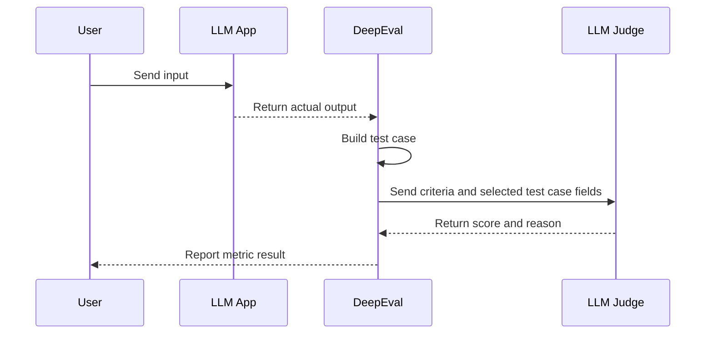
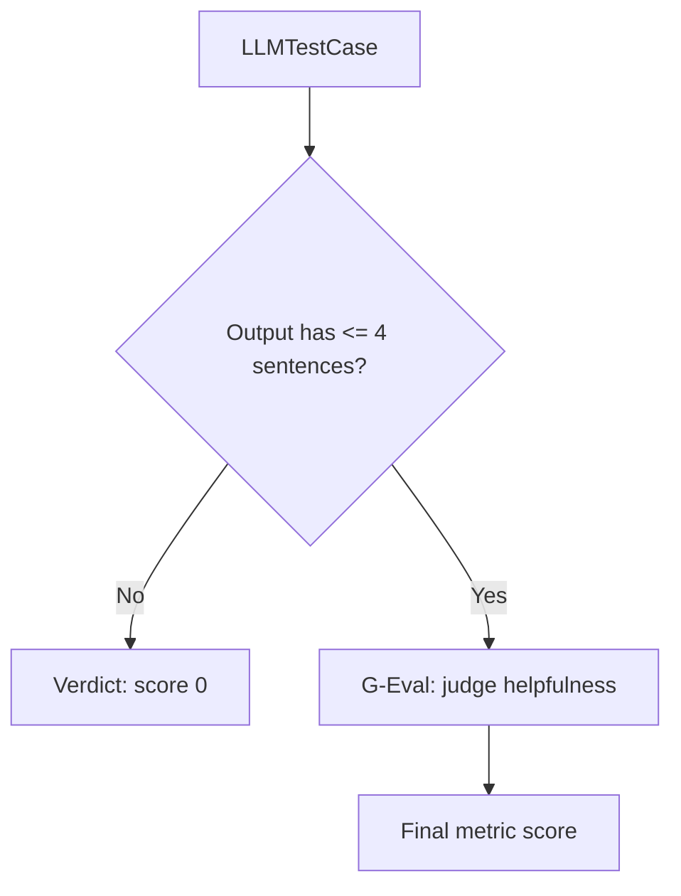

LLM-as-a-Judge evaluation is the process of using an LLM to score, classify, or compare the outputs of another LLM system. In `deepeval`, LLM judges power many evaluation metrics, but the important part is not just "use an LLM to judge." The important part is choosing the right judging technique for the shape of your evaluation.

This guide explains how to use LLM-as-a-Judge in DeepEval through three main techniques:

| Technique         | Best for                                                            | DeepEval API                                                                                                                   |
| ----------------- | ------------------------------------------------------------------- | ------------------------------------------------------------------------------------------------------------------------------ |
| G-Eval            | Custom, subjective, single-output criteria                          | [`GEval`](/docs/metrics-llm-evals)                                                                                             |
| DAG               | Deterministic, branching, multi-condition criteria                  | [`DAGMetric`](/docs/metrics-dag)                                                                                               |
| QAG-style metrics | Built-in metrics that decompose evaluation into closed-ended checks | [RAG metrics](/guides/guides-rag-evaluation), [agent metrics](/guides/guides-ai-agent-evaluation-metrics), and other built-ins |

If you need to compare two or more versions of an LLM app instead of scoring one output in isolation, use [`ArenaGEval`](/docs/metrics-arena-g-eval), DeepEval's pairwise LLM judge.

## What is LLM-as-a-Judge Evaluation?

LLM-as-a-Judge evaluation uses a language model as the evaluator for another language model's output. Instead of relying only on exact string matching, BLEU, ROUGE, or manual review, you give an LLM judge the interaction you want to evaluate and ask it to score the output against a specific criterion.

An LLM judge can answer questions that are difficult to capture with exact matching alone:

- Did the answer address the user's request? This is usually measured as answer relevancy.
- Is the response grounded in the provided context? This is usually measured as faithfulness.
- Did the model follow the expected format? This is usually measured as format correctness.
- Is the tone appropriate for the use case? This can cover professionalism, empathy, or brand voice.
- Did the agent complete the task? This is usually measured as task completion.
- Which prompt or model version performed better? This is usually measured with pairwise preference.

This makes LLM-as-a-Judge especially useful for evaluating LLM applications where quality is semantic, subjective, or context-dependent. A customer support answer can be factually correct but too vague. A RAG answer can sound fluent while hallucinating. An AI agent can call tools successfully but still fail the user task. These are the kinds of failures that traditional exact-match metrics usually miss.

In DeepEval, an LLM judge takes the data in a test case, applies a judging criterion, and returns a score, reason, verdict, or winner.

For a standard single-turn interaction, this data lives in an [`LLMTestCase`](/docs/evaluation-test-cases):

```python
from deepeval.test_case import LLMTestCase

test_case = LLMTestCase(
    input="What if these shoes don't fit?",
    actual_output="We offer a 30-day full refund at no extra cost.",
    expected_output="You're eligible for a 30 day refund at no extra cost.",
    retrieval_context=["Only shoes can be refunded."],
)
```

The judge does not need to use every field. A metric is only as reference-based or referenceless as the parameters it uses.

Here is the basic LLM-as-a-Judge flow in DeepEval:



## Why Use LLM-as-a-Judge?

LLM-as-a-Judge is useful because most LLM application failures are not binary. The output is rarely just "right" or "wrong." It might be partially correct, insufficiently grounded, too verbose, off-brand, unsafe, or missing one part of a multi-step instruction.

Manual review can catch these issues, but it does not scale to hundreds or thousands of test cases. Traditional NLP metrics are fast, but they usually require a reference answer and struggle with open-ended generation. LLM judges sit in the middle: they are scalable enough for automated evaluation, but flexible enough to evaluate meaning, reasoning, grounding, and style.

| Evaluation approach      | Best for                                | Limitation                                         |
| ------------------------ | --------------------------------------- | -------------------------------------------------- |
| Human review             | Nuanced judgement and final QA          | Slow, expensive, inconsistent at scale             |
| Exact match              | Deterministic outputs                   | Too strict for natural language                    |
| BLEU/ROUGE-style metrics | Similarity to a reference text          | Weak for semantic correctness and open-ended tasks |
| LLM-as-a-Judge           | Semantic, criteria-based LLM evaluation | Needs clear criteria and reliable judge setup      |

This is why LLM-as-a-Judge is common in LLM evaluation workflows for RAG systems, AI agents, chatbots, summarization, code generation, and prompt regression testing. You can define what "good" means for your application, then run that judgement repeatedly across datasets, CI/CD pipelines, and production traces.

DeepEval makes this practical by giving you reusable LLM judge implementations instead of forcing you to write prompts and scoring logic from scratch:

- Use `GEval` for custom quality criteria.
- Use `DAGMetric` for strict multi-step scoring logic.
- Use built-in RAG metrics for grounding and retrieval quality.
- Use built-in agentic metrics for task completion and tool use.
- Use `ArenaGEval` for prompt or model comparisons.

## Single-Output vs Pairwise LLM Judges

The first design choice is whether you want to score one output or compare multiple outputs.

| Judge type    | What it evaluates                               | DeepEval test case shape                             | Best for                                                      | DeepEval API                               |
| ------------- | ----------------------------------------------- | ---------------------------------------------------- | ------------------------------------------------------------- | ------------------------------------------ |
| Single-output | One `actual_output` for one `input`             | [`LLMTestCase`](/docs/evaluation-test-cases)         | Quality scoring, regression tests, production monitoring      | `GEval`, `DAGMetric`, built-in metrics     |
| Pairwise      | Two or more candidate outputs for the same task | [`ArenaTestCase`](/docs/evaluation-arena-test-cases) | Prompt comparisons, model comparisons, A/B regression testing | [`ArenaGEval`](/docs/metrics-arena-g-eval) |

**Most DeepEval metrics are single-output judges.** They score one interaction at a time and return a score between 0 and 1. Pairwise judges instead choose which contestant performed better.

```python
from deepeval import compare
from deepeval.metrics import ArenaGEval
from deepeval.test_case import ArenaTestCase, Contestant, LLMTestCase, SingleTurnParams

arena_test_case = ArenaTestCase(
    contestants=[
        Contestant(
            name="prompt-v1",
            test_case=LLMTestCase(
                input="Explain evaluation datasets.",
                actual_output="Evaluation datasets are examples used to test an LLM app.",
            ),
        ),
        Contestant(
            name="prompt-v2",
            test_case=LLMTestCase(
                input="Explain evaluation datasets.",
                actual_output="Evaluation datasets are fixed examples used to compare LLM app versions reliably.",
            ),
        ),
    ]
)

metric = ArenaGEval(
    name="Better Explanation",
    criteria="Choose the contestant that gives the clearer and more complete explanation.",
    evaluation_params=[SingleTurnParams.INPUT, SingleTurnParams.ACTUAL_OUTPUT],
)

compare(test_cases=[arena_test_case], metric=metric)
```

Use pairwise judging when relative quality matters more than an absolute score.

## Reference-Based vs Referenceless Judges

A reference-based judge uses a ground truth, ideal answer, or expected behavior. A referenceless judge evaluates the output without an ideal answer.

In DeepEval, references are not abstract. They live on test case parameters.

| DeepEval parameter  | Meaning                                               | When it makes a metric reference-based                                                    | Example metrics                                                                                                       |
| ------------------- | ----------------------------------------------------- | ----------------------------------------------------------------------------------------- | --------------------------------------------------------------------------------------------------------------------- |
| `expected_output`   | Ideal or labelled answer                              | When the judge compares `actual_output` to a gold answer                                  | Reference-based `GEval`, answer correctness                                                                           |
| `context`           | Ground-truth context known independently of retrieval | When the judge checks output against source-of-truth context                              | Hallucination-style custom metrics                                                                                    |
| `retrieval_context` | Chunks retrieved by a RAG retriever                   | When the judge checks grounding, relevancy, or retrieval quality against retrieved chunks | [`FaithfulnessMetric`](/docs/metrics-faithfulness), [`ContextualRelevancyMetric`](/docs/metrics-contextual-relevancy) |
| `expected_tools`    | Expected tool calls                                   | When the judge compares actual tool calls against expected tool calls                     | [`ToolCorrectnessMetric`](/docs/metrics-tool-correctness)                                                             |

This means `GEval`, `DAGMetric`, and QAG-style metrics can all be reference-based or referenceless.

For each technique:

- `GEval` is reference-based when `evaluation_params` includes `EXPECTED_OUTPUT`, `CONTEXT`, `RETRIEVAL_CONTEXT`, or expected tool data. It is referenceless when the judge only uses `INPUT` and/or `ACTUAL_OUTPUT`.
- `DAGMetric` is reference-based when any node asks the judge to compare against a reference field. It is referenceless when nodes judge only the input, output, structure, tone, format, or other non-labelled properties.
- QAG-style metrics are reference-based when generated questions are answered against `expected_output`, `context`, `retrieval_context`, or `expected_tools`. They are referenceless when generated questions are answered from `input` and `actual_output` only.
- `ArenaGEval` is reference-based when contestant test cases include reference fields used by the pairwise criteria. It is referenceless when the pairwise criteria only uses each contestant's input/output.

For example, this is a reference-based `GEval` because it compares the output against `expected_output`:

```python
from deepeval.metrics import GEval
from deepeval.test_case import SingleTurnParams

correctness = GEval(
    name="Correctness",
    criteria="Determine whether the actual output is correct based on the expected output.",
    evaluation_params=[
        SingleTurnParams.ACTUAL_OUTPUT,
        SingleTurnParams.EXPECTED_OUTPUT,
    ],
)
```

This is referenceless because it only judges whether the output is helpful for the input:

```python
from deepeval.metrics import GEval
from deepeval.test_case import SingleTurnParams

helpfulness = GEval(
    name="Helpfulness",
    criteria="Determine whether the actual output is helpful for answering the input.",
    evaluation_params=[
        SingleTurnParams.INPUT,
        SingleTurnParams.ACTUAL_OUTPUT,
    ],
)
```

::::info
If you are running online or production evaluation, you usually need referenceless metrics because labelled answers are rarely available at runtime.
::::

## The Three Main LLM Judge Techniques

DeepEval gives you multiple ways to turn LLM-as-a-Judge from a broad idea into a repeatable evaluation metric.

| Technique           | Best for                                                                  | Strength                              | Tradeoff                                                    |
| ------------------- | ------------------------------------------------------------------------- | ------------------------------------- | ----------------------------------------------------------- |
| `GEval`             | Custom subjective criteria like correctness, tone, coherence, helpfulness | Fastest custom judge to define        | Can be too broad if the criteria has many hard requirements |
| `DAGMetric`         | Objective or mixed criteria with decision paths                           | More deterministic and traceable      | Requires more upfront design                                |
| QAG-style built-ins | Common eval patterns where DeepEval already has an algorithm              | Less prompt design; stronger defaults | Less flexible than custom metrics                           |

Start with built-in metrics when DeepEval already has your use case. Use `GEval` when the evaluation is custom and subjective. Use `DAGMetric` when the judge needs to follow strict logic.

### Technique 1: G-Eval for Custom LLM Judges

[`GEval`](/docs/metrics-llm-evals) is DeepEval's most flexible custom LLM judge. You define the quality dimension in natural language, choose the test case fields the judge should inspect, and run it like any other metric.

```python
from deepeval import evaluate
from deepeval.metrics import GEval
from deepeval.test_case import LLMTestCase, SingleTurnParams

test_case = LLMTestCase(
    input="Summarize our refund policy.",
    actual_output="Customers can return shoes within 30 days for a full refund.",
    expected_output="Customers can return eligible shoes within 30 days for a full refund.",
)

correctness = GEval(
    name="Correctness",
    evaluation_steps=[
        "Check whether the actual output contradicts the expected output.",
        "Penalize missing eligibility conditions that change the meaning.",
        "Do not penalize harmless wording differences.",
    ],
    evaluation_params=[
        SingleTurnParams.ACTUAL_OUTPUT,
        SingleTurnParams.EXPECTED_OUTPUT,
    ],
)

evaluate(test_cases=[test_case], metrics=[correctness])
```

#### Criteria vs Evaluation Steps

You can define a `GEval` metric with either `criteria` or `evaluation_steps`.

Use `criteria` when you want to quickly prototype a judge in plain English. It is the fastest option, and DeepEval generates the evaluation steps from your criteria.

Use `evaluation_steps` when you know exactly how the judge should reason. It takes more effort to define, but it gives you more stable and controllable evaluations.

In practice, start with `criteria` when exploring a new metric. Move to `evaluation_steps` when the metric becomes important for CI/CD or production monitoring.

#### Reference-Based vs Referenceless G-Eval

`GEval` becomes reference-based when its `evaluation_params` include reference fields.

| G-Eval type     | Typical `evaluation_params`          | Example                                              |
| --------------- | ------------------------------------ | ---------------------------------------------------- |
| Reference-based | `ACTUAL_OUTPUT`, `EXPECTED_OUTPUT`   | Answer correctness                                   |
| Reference-based | `ACTUAL_OUTPUT`, `RETRIEVAL_CONTEXT` | Custom faithfulness                                  |
| Referenceless   | `INPUT`, `ACTUAL_OUTPUT`             | Helpfulness, answer relevancy, instruction following |
| Referenceless   | `ACTUAL_OUTPUT`                      | Coherence, tone, safety style checks                 |

The rule is simple: if your judge needs a labelled answer or source-of-truth field, it is reference-based. If it only needs the input and generated output, it is referenceless.

### Technique 2: DAG for More Deterministic LLM Judges

[`DAGMetric`](/docs/metrics-dag) lets you break one broad LLM judge into a decision tree. Each node handles a smaller judgement, and each path produces a controlled score.

Use DAG when your criteria has hard gates:

- If the output must be valid JSON before you judge quality, DAG can gate invalid structure before subjective scoring.
- If a response missing required sections should fail, DAG can assign deterministic scores for missing sections.
- If different mistakes should receive different penalties, DAG can encode explicit scoring branches.
- If you need traceable evaluation logic, DAG lets you inspect the exact path taken through the graph.

Here is a compact DAG that first checks whether a response is concise, then uses `GEval` only if the gate passes.



```python
from deepeval.metrics import DAGMetric, GEval
from deepeval.metrics.dag import DeepAcyclicGraph, BinaryJudgementNode, VerdictNode
from deepeval.test_case import LLMTestCase, SingleTurnParams

helpfulness = GEval(
    name="Helpfulness",
    criteria="Determine how helpful the actual output is for the input.",
    evaluation_params=[SingleTurnParams.INPUT, SingleTurnParams.ACTUAL_OUTPUT],
)

concise_node = BinaryJudgementNode(
    criteria="Does the actual output contain less than or equal to 4 sentences?",
    children=[
        VerdictNode(verdict=False, score=0),
        VerdictNode(verdict=True, child=helpfulness),
    ],
)

dag = DeepAcyclicGraph(root_nodes=[concise_node])
metric = DAGMetric(name="Concise Helpfulness", dag=dag)

test_case = LLMTestCase(input="Explain our refund policy.", actual_output="...")
metric.measure(test_case)
print(metric.score, metric.reason)
```

#### G-Eval vs DAG

| Question                                      | Use G-Eval | Use DAG   |
| --------------------------------------------- | ---------- | --------- |
| Is the quality dimension mostly subjective?   | Yes        | Sometimes |
| Do you need strict branches or hard failures? | Sometimes  | Yes       |
| Do you need to inspect each decision path?    | Limited    | Yes       |
| Do you want the fastest custom metric?        | Yes        | No        |
| Do you need deterministic control?            | Limited    | Yes       |

DAG is not inherently reference-based or referenceless. A DAG becomes reference-based only when one of its nodes depends on `expected_output`, `context`, `retrieval_context`, or `expected_tools`.

### Technique 3: QAG for Built-In LLM Judge Metrics

QAG stands for question-answer generation. In LLM evaluation, QAG-style metrics decompose a broad judgment into smaller closed-ended questions, then compute a score from the answers.

You usually do not need to implement QAG yourself. DeepEval uses QAG-style algorithms in many built-in metrics so you can evaluate common LLM app patterns without designing every judge prompt from scratch.

| Metric                                                            | What the judge checks                                          | Reference-based?    | Required reference-like field          |
| ----------------------------------------------------------------- | -------------------------------------------------------------- | ------------------- | -------------------------------------- |
| [`AnswerRelevancyMetric`](/docs/metrics-answer-relevancy)         | Whether `actual_output` answers the `input`                    | Referenceless       | None                                   |
| [`FaithfulnessMetric`](/docs/metrics-faithfulness)                | Whether `actual_output` is grounded in retrieved context       | Reference-based     | `retrieval_context`                    |
| [`ContextualRelevancyMetric`](/docs/metrics-contextual-relevancy) | Whether retrieved chunks are relevant to the input             | Reference-based     | `retrieval_context`                    |
| [`ContextualRecallMetric`](/docs/metrics-contextual-recall)       | Whether retrieval captured facts needed by the expected answer | Reference-based     | `expected_output`, `retrieval_context` |
| [`ToolCorrectnessMetric`](/docs/metrics-tool-correctness)         | Whether the right tools were called                            | Reference-based     | `expected_tools`                       |
| [`TaskCompletionMetric`](/docs/metrics-task-completion)           | Whether an agent completed the task                            | Often referenceless | Depends on metric setup                |

For example, answer relevancy is referenceless:

```python
from deepeval import evaluate
from deepeval.metrics import AnswerRelevancyMetric
from deepeval.test_case import LLMTestCase

test_case = LLMTestCase(
    input="What if these shoes don't fit?",
    actual_output="We offer a 30-day full refund at no extra cost.",
)

metric = AnswerRelevancyMetric(threshold=0.7)
evaluate(test_cases=[test_case], metrics=[metric])
```

Faithfulness is reference-based because the judge checks the output against the retrieved context:

```python
from deepeval import evaluate
from deepeval.metrics import FaithfulnessMetric
from deepeval.test_case import LLMTestCase

test_case = LLMTestCase(
    input="What if these shoes don't fit?",
    actual_output="We offer a 30-day full refund at no extra cost.",
    retrieval_context=["All customers are eligible for a 30 day full refund at no extra cost."],
)

metric = FaithfulnessMetric(threshold=0.7)
evaluate(test_cases=[test_case], metrics=[metric])
```

Use built-in QAG-style metrics when your evaluation target is already covered by DeepEval. They give you stronger defaults than a one-sentence custom judge.

## Choosing Between G-Eval, DAG, and QAG

| You need to...                                           | Use                             | Why                                                                    |
| -------------------------------------------------------- | ------------------------------- | ---------------------------------------------------------------------- |
| Create a custom subjective metric quickly                | `GEval`                         | Natural-language criteria are enough to start                          |
| Turn a subjective metric into a stable production metric | `GEval` with `evaluation_steps` | Explicit steps reduce ambiguity                                        |
| Enforce hard requirements before subjective scoring      | `DAGMetric`                     | Branches make failures deterministic                                   |
| Evaluate standard RAG quality                            | Built-in RAG metrics            | DeepEval already implements the QAG-style algorithm                    |
| Evaluate agent tool use                                  | Built-in agent metrics          | Tool-specific metrics understand `tools_called` and `expected_tools`   |
| Compare prompt or model versions                         | `ArenaGEval`                    | Pairwise judging chooses a winner instead of assigning isolated scores |

In practice, most projects use a small mix: two or three built-in metrics for system-specific quality, plus one or two custom `GEval` or `DAGMetric` metrics for product-specific expectations.

## Make LLM Judges More Reliable

LLM judges are useful because they understand semantics, but they can still be noisy if your metric is vague. Use these patterns to make them more reliable.

- Write explicit `evaluation_steps` when criteria are interpreted inconsistently.
- Set `strict_mode=True` when only perfect outputs should pass.
- Break criteria into branches with `DAGMetric` when the judge must enforce hard rules.
- Use built-in metrics when the evaluation task is common, such as RAG, agentic, multi-turn, safety, or image evaluation.
- Use [custom LLMs](/guides/guides-using-custom-llms) when you need a specific provider, fine-tuned model, or local model.
- Inspect judge reasoning with `verbose_mode=True` and `metric.reason` when you need to debug scores.

## Validate LLM Judges with Human Annotations

You should also cross-check your LLM judge with human labels. You do not need a complex labeling system to start. A simple pass/fail annotation from a domain expert is enough to tell whether your metric agrees with human judgement.

You do not need a dedicated platform to start. However, if you do want shared annotation queues, reviewer workflows, and metric alignment across a team, you can use [Confident AI](https://www.confident-ai.com/) to collect human annotations and compare them against DeepEval metric scores.

<ImageDisplayer
  src="/img/confident-human-annotation.png"
  alt="Human annotation workflow for cross-checking LLM judge scores"
/>

Once you have human labels, compare them against your metric results:

- **True positive:** the metric passed the output, and the human also accepted it.
- **True negative:** the metric failed the output, and the human also rejected it.
- **False positive:** the metric passed the output, but the human rejected it. This is dangerous because it creates false confidence.
- **False negative:** the metric failed the output, but the human accepted it. This is noisy because it blocks or flags acceptable outputs.

The false positive and false negative balance depends on your use case. For safety, compliance, healthcare, and other high-risk workflows, false positives are usually worse because a bad output can slip through. For lower-risk style or tone checks, false negatives may be more annoying because they slow down iteration.

If you see too many false positives or false negatives, adjust the metric before trusting it at scale. You can tighten the `criteria`, write more explicit `evaluation_steps`, change the `threshold`, use `strict_mode`, or split the metric into a more deterministic `DAGMetric`.

## Common LLM-as-a-Judge Workflows

LLM-as-a-Judge can be used anywhere you need repeatable quality checks. The most common workflows are regression testing before deployment, component-level evaluation on traces, and production monitoring after release.

### Regression Testing in CI/CD

LLM judges become most useful when they run continuously. In DeepEval, you can use `assert_test()` to make evaluation behave like a Pytest assertion.

```python
from deepeval import assert_test
from deepeval.metrics import GEval
from deepeval.test_case import LLMTestCase, SingleTurnParams

def test_refund_answer():
    test_case = LLMTestCase(
        input="What if these shoes don't fit?",
        actual_output="We offer a 30-day full refund at no extra cost.",
        expected_output="You're eligible for a 30 day refund at no extra cost.",
    )
    metric = GEval(
        name="Correctness",
        criteria="Determine whether the actual output is correct based on the expected output.",
        evaluation_params=[
            SingleTurnParams.ACTUAL_OUTPUT,
            SingleTurnParams.EXPECTED_OUTPUT,
        ],
        threshold=0.7,
    )
    assert_test(test_case, [metric])
```

Run the test file with:

```bash
deepeval test run test_refund_answer.py
```

For a full workflow, see the [CI/CD regression testing guide](/guides/guides-regression-testing-in-cicd).

### Trace and Component-Level Evaluation

You can also run LLM judges on components inside your application. This is useful when you want to evaluate a retriever, generator, agent, or tool-calling step separately.

```python
from deepeval.metrics import AnswerRelevancyMetric
from deepeval.test_case import LLMTestCase
from deepeval.tracing import observe, update_current_span

metric = AnswerRelevancyMetric(threshold=0.7)

@observe(metrics=[metric])
def generator(query: str):
    output = "We offer a 30-day full refund at no extra cost."
    update_current_span(
        test_case=LLMTestCase(
            input=query,
            actual_output=output,
        )
    )
    return output
```

For deeper examples, see [LLM tracing](/docs/evaluation-llm-tracing) and the tracing guides for [AI agents](/guides/guides-tracing-ai-agents), [RAG](/guides/guides-tracing-rag), and [multi-turn apps](/guides/guides-tracing-multi-turn).

<ImageDisplayer
  src="/img/confident-tracing-observability.png"
  alt="Confident AI tracing and observability workflow for evaluating LLM application components"
/>

### Production Monitoring

You can also use LLM judges after deployment to monitor quality over real production traffic. DeepEval defines and runs the evaluation metrics, while [Confident AI](https://www.confident-ai.com/) gives you the production monitoring layer for tracking those scores over time. This is most useful for referenceless metrics, since production requests usually do not come with labelled `expected_output`s.

Common production monitoring use cases include:

- Tracking answer relevancy, faithfulness, task completion, or safety over time.
- Detecting regressions after model, prompt, retriever, or tool changes.
- Sampling low-scoring traces into datasets for future regression tests.
- Routing suspicious outputs to human annotation queues for review.
- Comparing online metric trends against offline benchmark results.

For production monitoring, start with a small number of high-signal metrics. Too many LLM judges can make your monitoring noisy, expensive, and hard to interpret.

## Debug Judge Scores

Every DeepEval metric returns the fields you need to debug a judge:

```python
metric.measure(test_case)
print(metric.score)
print(metric.reason)
```

For `GEval`, `DAGMetric`, and many built-in metrics, you can also enable `verbose_mode`:

```python
metric = GEval(
    name="Helpfulness",
    criteria="Determine whether the actual output is helpful for the input.",
    evaluation_params=[SingleTurnParams.INPUT, SingleTurnParams.ACTUAL_OUTPUT],
    verbose_mode=True,
)
```

If the score looks wrong, check three things first:

- Did the judge see the right fields? Check `evaluation_params` and the `LLMTestCase`.
- Is the metric accidentally reference-based? Check whether it depends on `expected_output`, `context`, `retrieval_context`, or `expected_tools`.
- Is the criterion too broad? Move from `criteria` to explicit `evaluation_steps`, or use `DAGMetric`.

## FAQs

<FAQs
  qas={[
    {
      question: "What is LLM-as-a-Judge evaluation?",
      answer:
        "LLM-as-a-Judge evaluation uses a language model to score, classify, or compare another LLM application's output. In DeepEval, LLM judges power metrics that evaluate correctness, relevancy, faithfulness, task completion, safety, tone, and other semantic quality criteria.",
    },
    {
      question: "How do I use LLM-as-a-Judge in DeepEval?",
      answer: (
        <>
          Use <code>GEval</code> for custom LLM judge metrics,{" "}
          <code>DAGMetric</code> for deterministic decision-tree evaluation,
          built-in metrics for common RAG or agent workflows, and{" "}
          <code>ArenaGEval</code> for pairwise prompt or model comparisons.
        </>
      ),
    },
    {
      question: "What is the difference between G-Eval, DAG, and QAG?",
      answer:
        "G-Eval is best for custom subjective criteria written in natural language. DAG is best when the judge needs deterministic branches, hard gates, or multi-step scoring logic. QAG-style metrics break evaluation into closed-ended checks and are used by many built-in DeepEval metrics.",
    },
    {
      question: "Is LLM-as-a-Judge reference-based or referenceless?",
      answer:
        "It can be either. A judge is reference-based when it uses fields such as expected_output, context, retrieval_context, or expected_tools. It is referenceless when it evaluates only the input and actual_output without a labelled answer.",
    },
    {
      question: "When should I use a pairwise LLM judge?",
      answer: (
        <>
          Use a pairwise LLM judge when you want to compare two or more outputs
          and choose a winner, such as when testing prompt versions, model
          versions, or regression candidates. In DeepEval, this is done with{" "}
          <code>ArenaGEval</code> and <code>ArenaTestCase</code>.
        </>
      ),
    },
    {
      question: "How do I make LLM judges more reliable?",
      answer:
        "Make LLM judges more reliable by writing explicit evaluation steps, using strict mode for binary pass/fail checks, splitting complex logic into a DAG, validating judge scores against human annotations, and inspecting score reasons during debugging.",
    },
    {
      question: "Can I run LLM-as-a-Judge in CI/CD or production monitoring?",
      answer: (
        <>
          Yes. DeepEval can run LLM judges in CI/CD with{" "}
          <code>assert_test</code> and <code>deepeval test run</code>, and on
          traces with <code>@observe</code>. For production monitoring over
          live traffic, use{" "}
          <a href="https://confident-ai.com">Confident AI</a> with DeepEval
          metrics to track referenceless scores such as answer relevancy, task
          completion, faithfulness, safety, or custom G-Eval metrics over
          time.
        </>
      ),
    },
  ]}
/>

## Next Steps

- Use [`GEval`](/docs/metrics-llm-evals) to build custom LLM judges.
- Use [`DAGMetric`](/docs/metrics-dag) for deterministic LLM judge workflows.
- Use [`ArenaGEval`](/docs/metrics-arena-g-eval) for pairwise prompt or model comparisons.
- Use the [metrics introduction](/docs/metrics-introduction) to choose built-in metrics.
- Use [custom LLMs](/guides/guides-using-custom-llms) to configure your judge model.
- Use [CI/CD regression testing](/guides/guides-regression-testing-in-cicd) to run judges before deployment.
