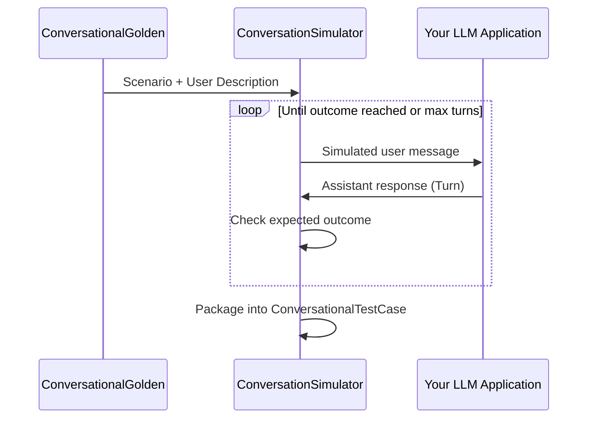

**Multi-turn simulation** is the process of automatically generating realistic conversations between a simulated user and your LLM application. It is the foundation of multi-turn evaluation—without simulation, you'd need to manually chat with your application for every scenario you want to test.

But why simulate at all? Consider the alternative: you write out a fixed list of user messages and expected assistant responses. This works for single-turn evaluation, where one input produces one output. In multi-turn evaluation, **the user's next message depends on what the assistant just said**. You can't predict the conversation ahead of time because each turn branches the dialogue in a different direction.

Simulation solves this by having an LLM role-play as the user—generating contextually appropriate messages in real time—while your actual application responds. The result is a natural, dynamic conversation that closely mirrors real-world usage.

:::info
For the full evaluation workflow including how simulations fit into development and production pipelines, see the [Multi-Turn Evaluation guide](/guides/guides-multi-turn-evaluation).
:::

## Why Simulation Matters

Without simulation, teams typically fall back to one of two approaches—both of which are flawed:

### Manual Testing

Someone on the team chats with the application, tries a few scenarios, and eyeballs the results. This fails because:

- It's **slow** — a thorough test of 50 scenarios across multiple turns takes hours
- It's **non-reproducible** — different testers send different messages, making before/after comparisons meaningless
- It's **biased** — humans unconsciously steer conversations toward expected paths, missing the edge cases real users trigger

### Historical Replay

Export past conversations from production and evaluate them offline. This sounds appealing but has a fundamental flaw: **those conversations were generated by your current system**. They can't tell you how a new prompt would handle the same scenarios, because the user's messages were shaped by the old responses.

For example, if your current system always asks "What's your order number?" as the first response, every historical conversation will have the user providing an order number in the second turn. If you change your system to ask "What can I help you with?" instead, those historical conversations are now irrelevant—the user would have said something completely different.

### What Simulation Gives You

Simulation addresses both problems:

- **Reproducible** — Same scenario + same application version = same (or statistically similar) conversation every time
- **Scalable** — Generate 100 conversations in parallel in minutes, not hours
- **Forward-looking** — Every simulation runs against your _current_ application, so you catch regressions in real time
- **Diverse** — The simulated user introduces natural variation, surfacing edge cases you wouldn't think to test manually

## Core Concepts

Before diving into code, let's understand the key objects that make simulation work.

### ConversationalGolden

A [`ConversationalGolden`](/docs/conversation-simulator#simulate-a-conversation) defines _what_ a conversation should be about, without prescribing the exact messages. It has three key fields:

| Field              | Purpose                                                                                        |
| ------------------ | ---------------------------------------------------------------------------------------------- |
| `scenario`         | The situation being tested (e.g., "Frustrated customer requesting a refund")                   |
| `expected_outcome` | What success looks like (e.g., "Customer receives refund confirmation and apology")            |
| `user_description` | Personality and context of the simulated user (e.g., "Impatient, has contacted support twice") |

```python
from deepeval.dataset import ConversationalGolden

golden = ConversationalGolden(
    scenario="Frustrated customer requesting a refund for a defective product",
    expected_outcome="Customer receives refund confirmation and apology",
    user_description="Impatient customer who has already contacted support twice"
)
```

The simulator uses all three fields to generate realistic user messages. The `scenario` sets the topic, the `user_description` shapes the tone and behavior, and the `expected_outcome` tells the simulator when the conversation has reached a natural conclusion.

:::tip
The more specific your `user_description`, the more realistic the simulation. Compare "A customer" (vague) with "A non-technical user who gets confused by jargon and tends to repeat questions when they don't understand" (specific, produces more interesting and challenging conversations).
:::

### ConversationSimulator

The `ConversationSimulator` orchestrates the back-and-forth. It:

1. Reads the `scenario` and `user_description` from a `ConversationalGolden`
2. Generates a user message based on the scenario and conversation history
3. Passes that message to your application via the `model_callback`
4. Receives the assistant's response
5. Checks whether the `expected_outcome` has been reached
6. Repeats steps 2–5 until the outcome is reached or the maximum number of turns is hit



The result is a `ConversationalTestCase`—a complete conversation with all turns recorded—ready for evaluation with any of `deepeval`'s [multi-turn metrics](/guides/guides-multi-turn-evaluation-metrics).

### ConversationalTestCase

The output of a simulation. It contains the full list of [`Turn`s](/docs/evaluation-multiturn-test-cases) that occurred during the conversation, along with the original scenario and expected outcome from the golden. This is the object you pass to `evaluate()`.

```python
from deepeval.test_case import ConversationalTestCase, Turn

test_case = ConversationalTestCase(
    turns=[
        Turn(role="user", content="I want a refund for order #1234."),
        Turn(role="assistant", content="I'd be happy to help with that. Let me look up order #1234."),
        Turn(role="user", content="It's been defective since day one."),
        Turn(role="assistant", content="I'm sorry to hear that. I've processed a full refund to your original payment method."),
    ]
)
```

## The Model Callback

The `model_callback` is the bridge between the simulator and your application. It's an async function that receives a user message and returns your application's response as a `Turn`.

### Minimal Callback

The simplest callback only needs the `input` parameter:

```python
from deepeval.test_case import Turn

async def model_callback(input: str) -> Turn:
    response = await your_llm_app(input)
    return Turn(role="assistant", content=response)
```

This works for stateless applications where the conversation history is managed internally (e.g., via an API that tracks sessions). The simulator sends a user message string, and your application returns a response.

### Callback with Conversation History

Most applications need access to the full conversation history to generate contextually appropriate responses. Add the `turns` parameter:

```python
from typing import List
from deepeval.test_case import Turn

async def model_callback(input: str, turns: List[Turn]) -> Turn:
    messages = [{"role": t.role, "content": t.content} for t in turns]
    messages.append({"role": "user", "content": input})

    response = await your_llm_app(messages)
    return Turn(role="assistant", content=response)
```

The `turns` parameter contains all preceding turns in the conversation (both user and assistant). This is essential for applications where you manage the conversation history yourself rather than relying on an external session store.

### Callback with Thread ID

For applications that maintain server-side state—API calls, database lookups, session management—use the `thread_id` parameter:

```python
from typing import List
from deepeval.test_case import Turn

async def model_callback(input: str, turns: List[Turn], thread_id: str) -> Turn:
    response = await your_api.chat(
        thread_id=thread_id,
        message=input
    )
    return Turn(role="assistant", content=response)
```

Each simulated conversation gets a unique `thread_id`. This allows your application to persist state across turns—for example, fetching a user's order history from a database on the first turn and referencing it in subsequent turns.

:::tip
Use `thread_id` when your application relies on external state like database sessions, API contexts, or memory stores. If your application only needs the conversation text, `turns` is sufficient.
:::

### Returning Rich Turns

The `Turn` object can carry more than just text content. If your application uses a RAG pipeline or calls tools, include those details in the returned turn so that specialized metrics can evaluate them:

```python
from deepeval.test_case import Turn, ToolCall

async def model_callback(input: str, turns: List[Turn], thread_id: str) -> Turn:
    result = await your_llm_app(input, turns, thread_id)

    return Turn(
        role="assistant",
        content=result["response"],
        retrieval_context=result.get("retrieved_docs"),
        tools_called=[
            ToolCall(
                name=tc["name"],
                description=tc["description"],
                input_parameters=tc.get("args"),
                output=tc.get("result"),
            )
            for tc in result.get("tool_calls", [])
        ] or None,
    )
```

Here's what each field on `Turn` unlocks:

| Field                 | Type             | What It Enables                                                                                                                                                                                                                                              |
| --------------------- | ---------------- | ------------------------------------------------------------------------------------------------------------------------------------------------------------------------------------------------------------------------------------------------------------ |
| `content`             | `str`            | Required by all metrics                                                                                                                                                                                                                                      |
| `retrieval_context`   | `List[str]`      | Required by [`TurnFaithfulnessMetric`](/docs/metrics-turn-faithfulness), [`TurnContextualRelevancyMetric`](/docs/metrics-turn-contextual-relevancy), and other [multi-turn RAG metrics](/guides/guides-multi-turn-evaluation-metrics#rag-multi-turn-metrics) |
| `tools_called`        | `List[ToolCall]` | Required by [`ToolUseMetric`](/docs/metrics-tool-use), [`GoalAccuracyMetric`](/docs/metrics-goal-accuracy)                                                                                                                                                   |
| `additional_metadata` | `Dict`           | Custom key-value pairs for logging and debugging                                                                                                                                                                                                             |

If you only need conversation-level metrics like [`ConversationCompletenessMetric`](/docs/metrics-conversation-completeness) or [`TurnRelevancyMetric`](/docs/metrics-turn-relevancy), returning just `content` is enough. Add the extra fields when you want to evaluate retrieval or tool-use quality. See the [Multi-Turn Evaluation Metrics guide](/guides/guides-multi-turn-evaluation-metrics) for which fields each metric requires.

## Running Simulations

### Basic Simulation

With a callback and goldens defined, running a simulation is straightforward:

```python
from deepeval.test_case import Turn
from deepeval.simulator import ConversationSimulator
from deepeval.dataset import ConversationalGolden

golden = ConversationalGolden(
    scenario="Customer wants to track a delayed package",
    expected_outcome="Customer receives tracking info and estimated delivery date",
    user_description="Polite but anxious, checking for the third time this week"
)

async def model_callback(input: str, turns: list, thread_id: str) -> Turn:
    response = await your_llm_app(input, turns, thread_id)
    return Turn(role="assistant", content=response)

simulator = ConversationSimulator(model_callback=model_callback)
test_cases = simulator.simulate(conversational_goldens=[golden])
```

The `simulate` method returns a list of `ConversationalTestCase`s—one per golden.

### Controlling Conversation Length

By default, simulations run for up to 10 user-assistant cycles. You can adjust this with `max_user_simulations`:

```python
test_cases = simulator.simulate(
    conversational_goldens=[golden],
    max_user_simulations=5
)
```

A simulation ends when **either** condition is met:

- The simulated user's expected outcome is achieved
- The maximum number of turns is reached

Short limits (3–5) are good for quick smoke tests. Longer limits (10–20) are better for stress-testing context retention and conversation flow over extended exchanges.

### Parallel Simulation

By default, `async_mode=True` and the simulator runs conversations concurrently. This is critical for large-scale benchmarking:

```python
simulator = ConversationSimulator(
    model_callback=model_callback,
    async_mode=True,
    max_concurrent=50
)

test_cases = simulator.simulate(conversational_goldens=goldens)
```

If you're hitting rate limits from your LLM provider, reduce `max_concurrent`:

```python
simulator = ConversationSimulator(
    model_callback=model_callback,
    max_concurrent=10
)
```

### Custom Simulator Model

The simulated user is powered by an LLM (defaulting to `gpt-4.1`). You can change this model or use a custom one:

```python
simulator = ConversationSimulator(
    model_callback=model_callback,
    simulator_model="gpt-4o"
)
```

Or use any custom LLM that extends `DeepEvalBaseLLM`:

```python
from deepeval.models import DeepEvalBaseLLM

class MyCustomModel(DeepEvalBaseLLM):
    ...

simulator = ConversationSimulator(
    model_callback=model_callback,
    simulator_model=MyCustomModel()
)
```

## Advanced Patterns

### Starting from Existing Turns

Some applications have hardcoded opening messages (e.g., a greeting or disclaimer). You can provide initial turns on the golden, and the simulator will continue from there:

```python
from deepeval.dataset import ConversationalGolden
from deepeval.test_case import Turn

golden = ConversationalGolden(
    scenario="Customer asking about return policies",
    expected_outcome="Customer understands the return process",
    user_description="First-time buyer, unfamiliar with the store",
    turns=[
        Turn(role="assistant", content="Welcome to ShopCo! How can I help you today?"),
    ]
)
```

The simulator sees the existing assistant turn and generates a user response that continues naturally from it. This is useful when:

- Your application always starts with a greeting
- You want to test how the application handles a mid-conversation hand-off
- You have a partially completed conversation you want to extend

### Lifecycle Hooks

For large-scale simulations, you may want to process results as they complete rather than waiting for all conversations to finish. Use the `on_simulation_complete` hook:

```python
from deepeval.test_case import ConversationalTestCase

def handle_complete(test_case: ConversationalTestCase, index: int):
    print(f"Conversation {index}: {len(test_case.turns)} turns")
    if len(test_case.turns) >= 20:
        print(f"  ⚠ Long conversation — may indicate a resolution failure")

test_cases = simulator.simulate(
    conversational_goldens=goldens,
    on_simulation_complete=handle_complete
)
```

The hook receives:

- `test_case` — the completed `ConversationalTestCase`
- `index` — the index of the corresponding golden (ordering is preserved)

:::tip
When `async_mode=True`, conversations may complete in any order. Use `index` to track which golden each test case corresponds to.
:::

### Designing Effective Scenarios

The quality of your simulations depends heavily on how well you design your [`ConversationalGolden`s](/docs/conversation-simulator#simulate-a-conversation). You can manage and version golden datasets on [Confident AI](/docs/evaluation-datasets) or define them in code. Here are patterns that produce realistic, useful conversations:

**Cover the full spectrum of user behavior:**

```python
goldens = [
    ConversationalGolden(
        scenario="Customer requesting a refund",
        expected_outcome="Refund is processed",
        user_description="Calm and cooperative customer"
    ),
    ConversationalGolden(
        scenario="Customer requesting a refund",
        expected_outcome="Refund is processed despite user frustration",
        user_description="Angry customer who threatens to leave a bad review"
    ),
    ConversationalGolden(
        scenario="Customer requesting a refund",
        expected_outcome="Customer is redirected to the right department",
        user_description="Confused customer who doesn't know the refund policy"
    ),
]
```

Same scenario, three very different conversations. The `user_description` drives the variation.

**Test edge cases explicitly:**

```python
ConversationalGolden(
    scenario="User asks the assistant to do something outside its capabilities",
    expected_outcome="Assistant politely declines and suggests alternatives",
    user_description="Persistent user who keeps rephrasing the same off-topic request"
)
```

**Test multi-topic conversations:**

```python
ConversationalGolden(
    scenario="User starts with a billing question, then pivots to a technical issue, then asks about account deletion",
    expected_outcome="All three topics are addressed correctly",
    user_description="Busy user who jumps between topics quickly"
)
```

## From Simulation to Evaluation

Once you have simulated conversations, pass them directly to `evaluate()` with your chosen metrics:

```python
from deepeval import evaluate
from deepeval.metrics import (
    ConversationCompletenessMetric,
    TurnRelevancyMetric,
    KnowledgeRetentionMetric,
)

evaluate(
    test_cases=test_cases,
    metrics=[
        ConversationCompletenessMetric(),
        TurnRelevancyMetric(),
        KnowledgeRetentionMetric(),
    ]
)
```

This creates a test run—a snapshot of your application's conversational performance. For details on which metrics to choose, see the [Multi-Turn Evaluation Metrics guide](/guides/guides-multi-turn-evaluation-metrics).

:::tip
Simulation + evaluation is most powerful as a CI/CD step. Run the same set of goldens against every code change to catch regressions before they reach production.
:::

## Next Steps

- [Multi-Turn Evaluation](/guides/guides-multi-turn-evaluation) — The full evaluation workflow, including production monitoring
- [Multi-Turn Evaluation Metrics](/guides/guides-multi-turn-evaluation-metrics) — Detailed breakdown of every available metric
- [Conversation Simulator Reference](/docs/conversation-simulator) — API reference for all simulator parameters
- [Multi-Turn Test Cases](/docs/evaluation-multiturn-test-cases) — How `ConversationalTestCase` and `Turn` work under the hood
- [Evaluation Datasets](/docs/evaluation-datasets) — Manage and version `ConversationalGolden` datasets
- [RAG Evaluation](/guides/guides-rag-evaluation#multi-turn-rag-evaluation) — Multi-turn RAG evaluation with retrieval metrics
