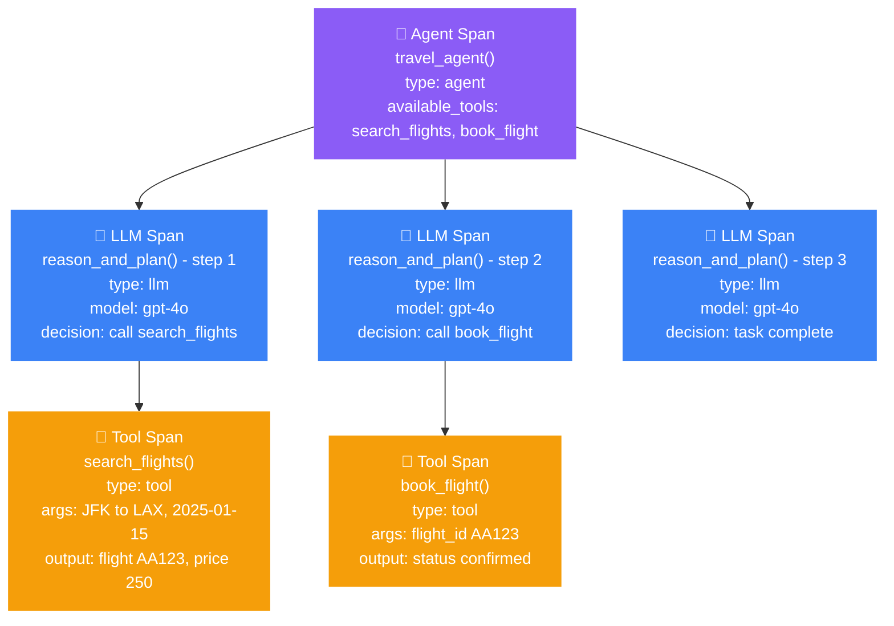

import { ASSETS } from "@site/src/assets";

**Agentic tracing** is the practice of tracking the non-deterministic execution paths of AI agents to monitor their reasoning steps, tool usage, and sub-agent handoffs. Unlike standard LLM applications where the execution path is linear and predefined, agents operate in dynamic loops—deciding *what* to do next based on the results of their previous actions. To debug and evaluate an agent, you must map out its entire execution tree to see not just the final output, but the exact sequence of decisions that led there.

Tracing is therefore also the foundation for [trajectory-based evaluation](/docs/evaluation-trajectory-based-llm-evals). An LLM judge can inspect the complete ordered trace—plans, model decisions, tool calls, and handoffs—to determine whether the agent completed the task efficiently and followed its plan. This catches cases where two runs return similar final answers but take very different paths.

:::info
To accurately map an agent's execution tree, `deepeval` utilizes four specialized span types: `"agent"` (for the orchestration layer), `"llm"` (for inference and decision making), `"tool"` (for external API or function executions), and `"retriever"` (for any context fetching steps).
:::



## Common Pitfalls in AI Agents

When an agent fails to complete a user's goal, the final text response is rarely helpful for debugging. Because agents operate autonomously, you need span-level visibility to determine if the failure occurred in the reasoning layer (bad planning) or the action layer (bad tool execution).

### Silent Tool Failures

Agents rely heavily on external tools (APIs, databases, calculators) to interact with the world. Often, an API will return a `200 OK` status but provide an empty list, a fallback message, or an unexpected JSON schema. The tool didn't "crash," so the application doesn't throw an error, but the agent is left with useless data and often hallucinates to compensate.

Here are the key questions observability aims to solve regarding silent tool failures:

- **Did the tool return the expected schema?** If a weather API changes its response format, the agent might misinterpret the data.
- **Did the agent pass the correct arguments?** The model might hallucinate a `flight_id` or format a date incorrectly when calling the tool.

### Reasoning Loops

Because agents execute in a `while` loop until a goal is met, a confused agent can become a massive liability. If an agent receives a confusing tool output, it might decide to call the exact same tool with the exact same arguments over and over again, draining your token limits and severely spiking latency.

Here are the key questions observability aims to solve regarding reasoning loops:

- **How many LLM inference calls did the agent make?** A simple task should not require 15 inference steps.
- **Is the agent looping endlessly?** You must be able to see if the agent is stuck retrying the same failed tool call instead of trying an alternative approach.

## Instrumenting Your Agent

To trace an agent, you decorate the different layers of your system with `@observe`, specifying the corresponding `type`. `deepeval` automatically infers the parent-child relationships based on the call stack, building the execution tree for you.

### The Agent Span

The root function that orchestrates the reasoning loop should be decorated with `type="agent"`. This span accepts two unique optional parameters: `available_tools` (a list of tools the agent is allowed to use) and `agent_handoffs` (a list of other agents it can delegate to).

```python
from deepeval.tracing import observe

@observe(
    type="agent", 
    available_tools=[...],
    agent_handoffs=["hotel_booking_agent"]
)
def travel_agent(user_request: str) -> str:
    # Orchestration logic goes here...
    pass
```

### Tool Spans

Every external function the agent can call — an API, a database query, a calculator — should be decorated with `type="tool"`. You can optionally provide a `description` that is logged with the span and automatically propagated to the parent LLM span's `tools_called` attribute.

```python title="agent.py"
from deepeval.tracing import observe

@observe(type="tool", description="Search for available flights between two cities")
def search_flights(origin: str, destination: str, date: str) -> list:
    return [{"flight_id": "123", "price": 450}]

@observe(type="tool", description="Book a selected flight by its ID")
def book_flight(flight_id: str) -> dict:
    return {"status": "confirmed", "booking_ref": "AB123"}
```

:::tip
`deepeval` automatically infers `tools_called` on the parent LLM span from any `type="tool"` child spans. You do not need to set this manually — just decorate your tool functions and the wiring happens for you.
:::

### LLM Spans

The function that makes the actual inference call to your LLM — where the agent *decides* what to do next — should be decorated with `type="llm"`. If you have configured auto-patching via `trace_manager.configure(openai_client=client)`, the model name and token counts are captured automatically.

```python title="agent.py"
from deepeval.tracing import observe

@observe(type="llm")
def reason_and_plan(messages: list) -> str:
    response = client.chat.completions.create(model="gpt-4o", messages=messages)
    return response.choices[0].message.content
```

## A Complete Single-Agent Example

Here is a fully instrumented travel agent combining all span types from the sections above:
```python title="agent.py"
from deepeval.tracing import observe, update_current_trace, update_current_span
from deepeval.test_case import ToolCall

@observe(type="tool", description="Search for available flights")
def search_flights(origin: str, destination: str, date: str) -> list:
    # Your API call here
    return [{"flight_id": "AA123", "price": 450}]

@observe(type="tool", description="Book a flight by ID")
def book_flight(flight_id: str) -> dict:
    # Your booking API call here
    return {"status": "confirmed", "ref": "XKCD99"}

@observe(type="llm")
def reason_and_plan(messages: list) -> str:
    response = client.chat.completions.create(model="gpt-4o", messages=messages)
    return response.choices[0].message.content

@observe(
    type="agent",
    available_tools=["search_flights", "book_flight"],
    metric_collection="agent-task-completion-metrics",
)
def travel_agent(user_request: str) -> str:
    update_current_trace(
        tags=["travel-booking"],
        metadata={"agent_version": "v3.1"}
    )
    messages = [{"role": "user", "content": user_request}]
    while True:
        decision = reason_and_plan(messages)
        if "search_flights" in decision:
            results = search_flights("JFK", "LAX", "2025-01-15")
            messages.append({"role": "tool", "content": str(results)})
        elif "book_flight" in decision:
            confirmation = book_flight("AA123")
            messages.append({"role": "tool", "content": str(confirmation)})
        else:
            return decision
```

When `travel_agent()` runs, `deepeval` builds the full execution tree: the `agent` span at the root, each `reason_and_plan()` call as an `llm` child span, and each tool call as a `tool` grandchild span. The `metric_collection` on the agent span triggers asynchronous task-completion evaluation in Confident AI after each execution, with zero latency added to the live agent.

## Accessing Raw Agent Traces Locally

If you are not using Confident AI, agent traces are still captured in memory and accessible as plain Python dictionaries. This is especially useful for agents because the full execution tree — every reasoning step, tool argument, and tool output — is nested within a single trace dictionary that you can inspect, log, or forward to your own storage.
```python title="agent.py"
from deepeval.tracing import trace_manager

# Run your agent
travel_agent("Book me a flight from JFK to LAX on January 15th")

# Retrieve all captured traces as dictionaries
traces = trace_manager.get_all_traces_dict()

for trace in traces:
    print(f"Agent input: {trace.get('input')}")
    print(f"Agent output: {trace.get('output')}")
    
    # Inspect every span in the execution tree
    for span_type in ["agentSpans", "llmSpans", "toolSpans"]:
        for span in trace.get(span_type, []):
            print(f"  [{span_type}] {span.get('name')}: {span.get('input')} → {span.get('output')}")
```

Iterating over `"llmSpans"` and `"toolSpans"` in the raw dictionary lets you verify exactly what arguments each tool received and what it returned — without a UI, without a platform, purely in code.

:::tip
Use `trace_manager.clear_traces()` between test runs in long-lived scripts to avoid accumulating traces from previous executions in memory.
:::

## Multi-Agent Systems

When building complex systems, developers often use a multi-agent architecture where a primary coordinator agent delegates tasks to specialized sub-agents. `deepeval` tracks these delegations natively. Because `@observe` uses `ContextVar` to track the call stack, when one agent function calls another, the spans automatically nest correctly.

You can declare these relationships upfront using the `agent_handoffs` parameter.

```python title="multi_agent.py"
from deepeval.tracing import observe

@observe(
    type="agent",
    available_tools=[...],
    agent_handoffs=[]
)
def hotel_agent(user_request: str) -> str:
    # Sub-agent logic
    pass

@observe(
    type="agent",
    available_tools=[...],
    agent_handoffs=["hotel_agent"]
)
def travel_coordinator(user_request: str) -> str:
    # Coordinator logic
    flight_result = search_flights("JFK", "LAX", "2024-12-01")
    
    # Sub-agent handoff — automatically becomes a child span
    hotel_result = hotel_agent("Need a hotel in LAX for Dec 1st")
    
    return f"Flight: {flight_result}, Hotel: {hotel_result}"
```

In Confident AI, `hotel_agent` will appear as a child span of `travel_coordinator`. The platform renders this as a nested graph, showing exactly which sub-agent handled which part of the overarching task.

:::note
The `agent_handoffs` parameter is a static declaration of what handoffs are *possible* within your architecture. The actual handoffs that occur during runtime are captured dynamically by the span tree itself.
:::

## Tracking Tool Usage for Evaluation

To evaluate an agent's reasoning, you must compare what the agent *actually did* against what it *should have done*.

`deepeval` handles the first part automatically: any time a `type="tool"` span executes inside an `type="llm"` span, `deepeval` infers the connection and automatically populates the `tools_called` attribute on the LLM span.

To provide the ground truth for evaluation, you must supply the `expected_tools`. You do this by calling `update_current_span()` from within the LLM inference function.

```python title="agent.py"
from deepeval.tracing import observe, update_current_span
from deepeval.test_case import ToolCall

@observe(type="llm")
def reason_and_plan(messages: list, expected_tool_calls: list = None) -> str:
    response = client.chat.completions.create(model="gpt-4o", messages=messages)
    
    # Provide ground truth for component-level evaluation
    if expected_tool_calls:
        update_current_span(expected_tools=expected_tool_calls)
        
    return response.choices[0].message.content
```

By providing `expected_tools`, metrics like the `ToolCorrectnessMetric` can calculate exact precision and recall scores for the agent's tool selection process.

## Attaching Evaluations

Agent architectures support three complementary evaluation scopes:

- **End-to-end black-box evaluation** scores only the application's observable input and final output.
- **Trajectory-based evaluation** scores the complete ordered trace as one unit, including plans, model decisions, tool calls, and handoffs.
- **Component-level evaluation** scores one step or span, such as an LLM's tool selection.

Use all three when both the result and the path matter. Trajectory metrics consume the complete trace, while component metrics attach to the specific spans they inspect.

### Evaluating Locally During Development

During development, attach component metrics directly to `@observe` using the `metrics` parameter. These metrics run synchronously when the function completes, giving you immediate per-span results in your terminal — no Confident AI connection needed.
```python title="agent.py"
from deepeval.tracing import observe
from deepeval.metrics import ToolCorrectnessMetric

tool_correctness = ToolCorrectnessMetric(threshold=0.8)

# Component-level: evaluate tool selection on each reasoning step
@observe(type="llm", metrics=[tool_correctness])
def reason_and_plan(messages: list) -> str:
    response = client.chat.completions.create(model="gpt-4o", messages=messages)
    return response.choices[0].message.content
```

For local trajectory evaluation, pass trace-level metrics to `evals_iterator()` and invoke the traced agent once per golden:

```python title="evaluate_agent.py"
from deepeval.metrics import (
    TaskCompletionMetric,
    StepEfficiencyMetric,
    PlanAdherenceMetric,
)

metrics = [
    TaskCompletionMetric(),
    StepEfficiencyMetric(),
    PlanAdherenceMetric(),
]

for golden in dataset.evals_iterator(metrics=metrics):
    travel_agent(golden.input)
```

:::note
The `metrics` parameter runs LLM-as-a-judge evaluations synchronously and will add latency to your agent's execution. Use this exclusively during development and testing. For production, switch to `metric_collection` as shown in the sections below. It requires Confident AI so ensure you ran the `deepeval login` command and have a valid API key configured.
:::

### Component-Level (One LLM Span)

Attach a metric collection to the `type="llm"` span to evaluate the isolated reasoning steps. This allows you to catch when an agent chooses the wrong tool or hallucinates arguments, even if it eventually fumbles its way to a correct final answer.

```python
@observe(type="llm", metric_collection="tool-correctness-metrics")
def reason_and_plan(messages: list) -> str:
    ...
```

### Trajectory-Based (The Complete Ordered Trace)

Evaluate the root `type="agent"` trace as a complete ordered trajectory. `TaskCompletionMetric` inspects the steps and their results to determine whether the task was achieved, while `StepEfficiencyMetric` checks whether those ordered steps were necessary and efficient. `PlanAdherenceMetric` can additionally compare the executed path with the agent's plan.

```python
@observe(
    type="agent",
    available_tools=[...],
    metric_collection="agent-trajectory-metrics"
)
def travel_agent(user_request: str) -> str:
    ...
```

In local dataset evaluations, use the `evals_iterator()` pattern above so the trajectory metrics receive the complete trace. In production, a trajectory metric collection on the root agent evaluates the completed trace asynchronously.

### End-to-End Black-Box (Input and Output)

End-to-end evaluation deliberately ignores the internal spans and scores only the input and final output. Use it for output quality criteria that do not depend on how the agent arrived at the answer. See [end-to-end evaluation](/docs/evaluation-end-to-end-llm-evals) for the black-box workflow.

Here is a summary of how to map your metric collections:

| Scope                    | What the metric sees                                  | Example Metrics                                                          |
| ------------------------ | ----------------------------------------------------- | ------------------------------------------------------------------------ |
| **End-to-end black-box** | Application input and final output                    | `AnswerRelevancyMetric`, custom `GEval`                                  |
| **Trajectory-based**     | Complete ordered trace                                | `TaskCompletionMetric`, `StepEfficiencyMetric`, `PlanAdherenceMetric`    |
| **Component-level**      | One LLM span and its tool calls or arguments          | `ToolCorrectnessMetric`, `ArgumentCorrectnessMetric`                     |

All three scopes can be active on the same run. A single execution might use `ToolCorrectnessMetric` on each LLM span, trajectory metrics on the complete trace, and an output-quality metric on the black-box result. This matters because an agent can make a bad tool selection in step 3, recover by step 5, and still complete the task; only the combined view explains both the result and the route taken.

:::tip
For a comprehensive breakdown of the formulas and use cases for these metrics, read the [AI Agent Evaluation Metrics guide](/guides/guides-ai-agent-evaluation-metrics).
:::

## Framework Integrations

If you're building your agent with an existing framework — LlamaIndex, LangGraph, CrewAI, Pydantic AI, or the OpenAI Agents SDK — deepeval provides native integrations that automatically instrument your pipeline with agent, LLM, and tool spans. No manual `@observe` decorators are needed.

<Tabs items={["LlamaIndex", "LangGraph", "CrewAI", "Pydantic AI", "OpenAI Agents"]}>
<Tab value="LlamaIndex">

Call `instrument_llama_index` once before creating your agent. deepeval hooks into LlamaIndex's event system and automatically captures every LLM reasoning step and tool execution as structured spans.

```python title="main.py" showLineNumbers
import asyncio
import llama_index.core.instrumentation as instrument

from llama_index.llms.openai import OpenAI
from llama_index.core.agent import FunctionAgent

from deepeval.integrations.llama_index import instrument_llama_index

# One-line setup: auto-instruments all agent, LLM, and tool spans
instrument_llama_index(instrument.get_dispatcher())


def get_weather(city: str) -> str:
    """Get the current weather in a city."""
    return f"It's always sunny in {city}!"


agent = FunctionAgent(
    tools=[get_weather],
    llm=OpenAI(model="gpt-4o-mini"),
    system_prompt="You are a helpful assistant.",
)


async def run():
    return await agent.run("What's the weather in Paris?")


asyncio.run(run())
```

</Tab>
<Tab value="LangGraph">

Wire a `StateGraph` with `ToolNode` for tool execution, then pass a `CallbackHandler` in the `config` when invoking it. deepeval intercepts chain, LLM, and tool events, building the full agent span tree automatically.

```python title="main.py" showLineNumbers
from langchain.chat_models import init_chat_model
from langgraph.graph import StateGraph, MessagesState, START, END
from langgraph.prebuilt import ToolNode, tools_condition

from deepeval.integrations.langchain import CallbackHandler


def get_weather(city: str) -> str:
    """Returns the weather in a city."""
    return f"It's always sunny in {city}!"


llm = init_chat_model("openai:gpt-4o-mini").bind_tools([get_weather])


def chatbot(state: MessagesState):
    return {"messages": [llm.invoke(state["messages"])]}


graph = (
    StateGraph(MessagesState)
    .add_node(chatbot)
    .add_node("tools", ToolNode([get_weather]))
    .add_edge(START, "chatbot")
    .add_conditional_edges("chatbot", tools_condition)
    .add_edge("tools", "chatbot")
    .compile()
)

# Pass CallbackHandler as config — all node, LLM, and tool spans are captured automatically
result = graph.invoke(
    {"messages": [{"role": "user", "content": "What's the weather in Paris?"}]},
    config={"callbacks": [CallbackHandler()]},
)
print(result)
```

</Tab>
<Tab value="CrewAI">

Call `instrument_crewai` once before defining your crew. deepeval registers a CrewAI event listener that captures crew orchestration, agent execution, LLM calls, and tool invocations as a nested span tree.

```python title="main.py" showLineNumbers
from crewai import Task, Crew, Agent
from crewai.tools import tool

from deepeval.integrations.crewai import instrument_crewai

# One-line setup: auto-instruments all CrewAI spans
instrument_crewai()


@tool
def get_weather(city: str) -> str:
    """Fetch weather data for a given city."""
    return f"It's always sunny in {city}!"


agent = Agent(
    role="Weather Reporter",
    goal="Provide accurate weather information.",
    backstory="An experienced meteorologist.",
    tools=[get_weather],
)

task = Task(
    description="Get the current weather for {city}.",
    expected_output="A brief weather report.",
    agent=agent,
)

crew = Crew(agents=[agent], tasks=[task])

# All execution spans are captured automatically
crew.kickoff({"city": "Paris"})
```

</Tab>
<Tab value="Pydantic AI">

Pass a `ConfidentInstrumentationSettings` instance to your agent's `instrument` parameter. deepeval exports all spans via OpenTelemetry to Confident AI automatically on every agent run.

```python title="main.py" showLineNumbers
from pydantic_ai import Agent

from deepeval.integrations.pydantic_ai import ConfidentInstrumentationSettings

agent = Agent(
    "openai:gpt-4o-mini",
    instructions="You are a helpful travel assistant.",
    instrument=ConfidentInstrumentationSettings(),
)

# All agent, LLM, and tool spans are exported automatically
result = agent.run_sync("Book me a flight from JFK to LAX.")
print(result.output)
```

</Tab>
<Tab value="OpenAI Agents">

Register `DeepEvalTracingProcessor` once globally. deepeval then intercepts every trace emitted by the OpenAI Agents SDK, mapping agent runs, LLM calls, and function tool calls into deepeval spans.

```python title="main.py" showLineNumbers
from agents import Runner, add_trace_processor

from deepeval.openai_agents import Agent, DeepEvalTracingProcessor

# One-line setup: register the tracing processor globally
add_trace_processor(DeepEvalTracingProcessor())

travel_agent = Agent(
    name="Travel Agent",
    instructions="You are a helpful travel assistant.",
)

# All agent spans are captured automatically
result = Runner.run_sync(travel_agent, "Book me a flight from JFK to LAX.")
print(result.final_output)
```

</Tab>
</Tabs>

:::note
The integrations shown here are minimal tracing examples. For full options — including attaching evaluation metrics to specific spans, running component-level evals, and setting up production `metric_collection`s — see the dedicated integration docs for [LlamaIndex](/integrations/llamaindex), [LangGraph](/integrations/langgraph), [CrewAI](/integrations/crewai), [Pydantic AI](/integrations/pydanticai), and [OpenAI Agents](/integrations/openai-agents).
:::

## Agentic Observability In Production

When you deploy autonomous agents to production, relying on standard text logs to debug a failed task or an infinite loop is nearly impossible. You need a visual representation of the execution tree and asynchronous evaluation to catch regressions without degrading the user experience.

Confident AI renders the complex parent-child span relationships of your agents into an interactive graph, allowing you to trace exactly how an agent reasoned and what tools it called.

<Steps>
<Step>
### Create agentic metric collections


Log in to Confident AI and create metric collections tailored to your evaluation scope. For example, create a trajectory collection containing `TaskCompletionMetric`, `StepEfficiencyMetric`, and `PlanAdherenceMetric`, plus a component-level collection containing `ToolCorrectnessMetric` or `ArgumentCorrectnessMetric`. Keep tool and argument metrics on LLM spans, where they can inspect an individual decision.

<VideoDisplayer
  src={ASSETS.metricsCreateCollection}
  confidentUrl="/docs/llm-tracing/evaluations"
  label="Create agentic metric collections on Confident AI"
  description="Group agentic metrics to score tool use and task completion automatically."
/>

</Step>
<Step>
### Attach collections to your spans


In your production code, attach the appropriate collection names to your `@observe` decorators. 

```python
@observe(type="agent", metric_collection="agent-trajectory-metrics")
def travel_coordinator(user_request: str):
    ...
```

When the trace is sent to Confident AI, the trajectory collection evaluates the complete ordered execution tree asynchronously, ensuring your live agent experiences zero added latency. Attach a separate component collection to `type="llm"` spans when you also need per-step tool or argument checks.

</Step>
<Step>
### Debug with the Agent Trace Graph


Use Confident AI's trace visualization to inspect runaway loops, silent tool failures, and sub-agent handoffs. You can click into any individual tool span to see the exact arguments passed and the JSON schema returned by your external APIs.

<VideoDisplayer
  src={ASSETS.tracingTraces}
  confidentUrl="/docs/llm-tracing/evaluations"
  label="Track agent execution paths and metrics on Confident AI"
  description="Follow each agent run step-by-step with metric scores attached."
/>

</Step>
</Steps>

## Conclusion

In this guide, you learned how to instrument complex AI agents to capture their non-deterministic execution paths, reasoning steps, and tool usage:

  - **`type="agent"`** defines the orchestrator and tracks `available_tools` and `agent_handoffs`.
  - **`type="llm"`** captures the inference and decision-making steps.
  - **`type="tool"`** captures external executions, automatically propagating to the parent's `tools_called` attribute.
  - **`expected_tools`** provides the ground truth required to accurately evaluate an agent's tool selection process.
  - **Trajectory-based evaluation** scores the complete ordered trace with metrics such as `TaskCompletionMetric`, `StepEfficiencyMetric`, and `PlanAdherenceMetric`.
  - **`metrics=[...]` on an LLM `@observe` span** runs component metrics such as `ToolCorrectnessMetric` locally during development.
  - **`trace_manager.get_all_traces_dict()`** gives you raw access to the full execution tree — every reasoning step, tool argument, and tool output — as a Python dictionary for local inspection and logging.

:::info[Development vs Production]

- **Development** — Attach `metrics=[tool_correctness]` to your LLM span for component checks, and pass trajectory metrics to `evals_iterator()` to score the complete ordered trace. Use `trace_manager.get_all_traces_dict()` to inspect the execution tree without an external dependency.
- **Production** — Export traces to Confident AI to visually debug execution graphs. Use an asynchronous trajectory metric collection on the root agent and component collections on LLM spans to monitor the complete path and individual tool decisions without blocking execution.

:::

## FAQs

<FAQs
  qas={[
    {
      question: "What is agentic tracing?",
      answer: (
        <>
          Agentic tracing is the practice of capturing the non-deterministic
          execution path of an AI agent—every reasoning step, tool call, and
          handoff—as a structured tree. In DeepEval, this is done by
          decorating your code with <code>@observe</code>, which automatically
          builds the execution tree.
        </>
      ),
    },
    {
      question: "How is agent tracing different from RAG tracing?",
      answer:
        "RAG tracing typically captures a linear pipeline (retrieve → generate). Agent tracing captures dynamic loops where the agent iteratively calls tools and re-plans, producing a tree with multiple LLM and tool spans per request.",
    },
    {
      question: "Which span types should I use for AI agents?",
      answer: (
        <>
          Use <code>type="agent"</code> for the orchestrator,{" "}
          <code>type="llm"</code> for inference and decision making,{" "}
          <code>type="tool"</code> for external function or API executions,
          and <code>type="retriever"</code> for any context-fetching steps.
          DeepEval builds the parent-child tree from your call stack
          automatically.
        </>
      ),
    },
    {
      question: "How do I trace tool calls in DeepEval?",
      answer: (
        <>
          Decorate each tool function with <code>@observe(type="tool")</code>.
          DeepEval captures the arguments, return value, and latency, and
          automatically propagates the call to the parent span's{" "}
          <code>tools_called</code> attribute so agent metrics can read it.
        </>
      ),
    },
    {
      question: "Can I run metrics on individual agent spans during development?",
      answer: (
        <>
          Yes. Pass <code>metrics=[...]</code> to <code>@observe</code>{" "}
          directly. For example, attach <code>ToolCorrectnessMetric</code> to
          the LLM span to evaluate tool selection at the component level, and{" "}
          pass <code>TaskCompletionMetric</code>,{" "}
          <code>StepEfficiencyMetric</code>, or{" "}
          <code>PlanAdherenceMetric</code> to <code>evals_iterator()</code> for
          trajectory-based evaluation of the complete trace.
        </>
      ),
    },
    {
      question: "How do I detect reasoning loops or runaway agents?",
      answer: (
        <>
          Look for repeated tool calls with identical arguments inside the
          same trace, or an unusually high number of LLM inference spans for a
          simple task. Tracing surfaces these patterns visually—either by
          inspecting the raw trace dictionary locally or via{" "}
          <a href="https://confident-ai.com">Confident AI</a>'s trace
          explorer.
        </>
      ),
    },
    {
      question: "How do I run agentic evaluation in production?",
      answer: (
        <>
          Define a metric collection on{" "}
          <a href="https://confident-ai.com">Confident AI</a> and pass{" "}
          <code>metric_collection</code> to your <code>@observe</code>{" "}
          decorators. Put trajectory metrics in the root agent's collection and
          tool or argument metrics in an LLM-span collection. Traces are
          exported asynchronously and evaluated without blocking your live
          agent.
        </>
      ),
    },
  ]}
/>

## Next Steps And Additional Resources

Now that your agent is fully instrumented, you can establish a robust evaluation pipeline to measure its autonomous performance over time:

1.  **Evaluate Complete Trajectories** — Follow the [trajectory-based evaluation guide](/docs/evaluation-trajectory-based-llm-evals) to score ordered agent traces.
2.  **Review Agent Metrics** — Understand the exact formulas for trajectory and component metrics in the [AI Agent Evaluation Metrics guide](/guides/guides-ai-agent-evaluation-metrics)
3.  **Read the Evaluation Workflow** — See how these metrics fit into the broader testing lifecycle in the [AI Agent Evaluation guide](/guides/guides-ai-agent-evaluation)
4.  **Curate Golden Datasets** — Export failing agent traces from production into your development testing bench using [Evaluation Datasets](/docs/evaluation-datasets)
5.  **Join the community** — Have questions? Join the [DeepEval Discord](https://discord.com/invite/a3K9c8GRGt)—we're happy to help\!

**Congratulations 🎉!** You now have the knowledge to instrument any AI agent—from single-loop scripts to complex multi-agent systems—with full span-level observability.
