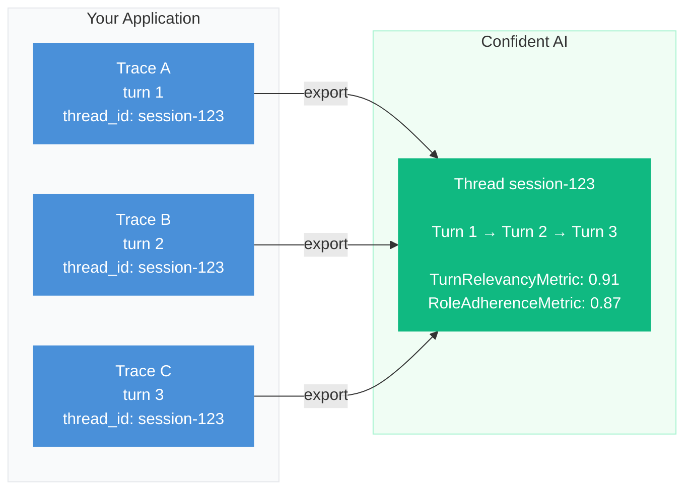

import { ASSETS } from '@site/src/assets';

**Multi-turn tracing** is the practice of tracking user state, context retention, and conversational drift across multiple interactions over time. Unlike single-turn applications where each request is isolated and independent, conversational agents (like chatbots or support assistants) consist of multiple related turns that must be stitched together to form a complete narrative. By linking individual executions, you can monitor how your application handles long-term memory and behavioral consistency.

:::info
A **trace** represents a single back-and-forth interaction (one user message and one assistant response). A **thread** (or session) is the historical sequence of those traces grouped together by a shared `thread_id`.
:::

## Common Pitfalls in Multi-Turn Systems

Multi-turn systems fail in ways that single-turn systems do not. An LLM might provide a perfect response in isolation but fail entirely when viewed in the context of a five-turn conversation. Without thread-level observability, these gradual failures are invisible.

### Context Amnesia

As a conversation grows, the accumulated history consumes more of the context window. To prevent token limits from being breached, developers often truncate or summarize older messages. If implemented poorly, the model forgets critical constraints established early in the conversation.

Here are the key questions observability aims to solve regarding context amnesia:

- **Is the context window overflowing?** If the history array becomes too large, the LLM will truncate the system prompt or drop the most recent user messages.
- **Does the model retain the user's initial constraints?** If a user asks for "vegetarian options" in turn 1, the model should not suggest a steakhouse in turn 4.

### Topic Drift

Long conversations naturally wander. However, task-oriented bots (like a customer support agent) have specific boundaries and personas to maintain. Over time, the model may let the user hijack the conversation or drop its assigned persona in favor of being universally helpful.

Here are the key questions observability aims to solve regarding topic drift:

- **Is the agent maintaining its assigned persona?** The model must consistently act as the intended agent (e.g., a bank teller) rather than reverting to a generic AI assistant.
- **Is the user hijacking the conversation?** The model should steer the conversation back to the intended domain rather than fulfilling off-topic requests.

## How Multi-Turn Tracing Works

The mental model for multi-turn tracing in `deepeval` is built on a simple premise: **trace individual turns, then group them by ID.**

There is no "start conversation" or "end conversation" API in `deepeval`. Instead, every time a user sends a message, your application executes its logic, and `deepeval` automatically captures that execution as a standard trace. To stitch these disparate traces together into a single conversation, you simply tag each trace with the same `thread_id`.

1. **Turn 1** → Trace A (`thread_id="session-123"`)
2. **Turn 2** → Trace B (`thread_id="session-123"`)
3. **Turn 3** → Trace C (`thread_id="session-123"`)



When these traces are exported, Confident AI automatically groups all traces sharing `"session-123"` into a single **Thread**. This allows you to evaluate the quality of the entire sequence rather than just evaluating Trace C in isolation.

:::note
The `thread_id` is a user-defined string. You can use a database primary key, a UUID, or a combination of `user_id` and a timestamp—as long as it remains consistent across all turns of the same conversation.
:::

## Instrumenting Conversation Turns

To track a session, you must pass a `thread_id` to the `update_current_trace()` function inside the root function of your conversational turn.

Because `deepeval` does not manage conversational state, your application must continue to handle retrieving and storing the chat history. Tracing simply records the execution—you manage the logic. You pass that history into your decorated functions as normal.

```python title="chatbot.py"
from deepeval.tracing import observe, update_current_trace

conversations = {}

@observe(type="llm")
async def generate_reply(history: list, user_message: str) -> str:
    messages = history + [{"role": "user", "content": user_message}]
    response = await async_client.chat.completions.create(
        model="gpt-4o",
        messages=messages
    )
    return response.choices[0].message.content

@observe
async def handle_turn(user_message: str, thread_id: str, user_id: str) -> str:
    update_current_trace(
        thread_id=thread_id,
        user_id=user_id,  # Links the thread to a specific user on Confident AI
    )
    history = conversations.get(thread_id, [])
    response = await generate_reply(history, user_message)
    conversations[thread_id] = history + [
        {"role": "user", "content": user_message},
        {"role": "assistant", "content": response}
    ]
    return response
```

:::tip
Generate your `thread_id` once at the start of a new user session (for example, using `str(uuid.uuid4())`) and persist it in your database alongside the user's conversation history.
:::

## Tracking Per-Turn Context

If your chatbot uses Retrieval-Augmented Generation (RAG), the retrieved documents will likely change with every turn. Multi-turn RAG metrics need to know exactly which documents were retrieved for which specific turn to accurately calculate hallucination and relevancy scores.

You must attach the `retrieval_context` to a retriever span during the turn using `update_current_span()`.

```python title="chatbot.py"
from deepeval.tracing import observe, update_current_span

@observe(type="retriever")
async def retrieve_context(user_message: str) -> list:
    # Simulated database search
    docs = ["DeepEval threads group traces by thread_id."]

    # Attach the context to this specific turn's retriever span
    update_current_span(retrieval_context=docs)

    return docs
```

## Tagging and Filtering Threads

In production, you will accumulate thousands of conversational threads. To efficiently identify failing sessions or compare specific cohorts of users, you should attach `tags` and `metadata` to each trace.

`tags` appear as filterable labels in Confident AI's Thread Explorer. `metadata` is a free-form dictionary useful for versioning, A/B test flags, or any dimension you want to slice by later.

```python title="chatbot.py"
@observe
async def handle_turn(user_message: str, thread_id: str, user_id: str) -> str:
    update_current_trace(
        thread_id=thread_id,
        user_id=user_id,
        tags=["customer-support", "billing"],
        metadata={
            "turn_number": len(conversations.get(thread_id, [])) + 1,
            "model_version": "v2.1",
            "user_plan": "enterprise"
        }
    )
    # ... rest of logic
```

:::tip
Use `tags` for broad categorization (product area, agent type) and `metadata` for precise, queryable values (model version, A/B variant, session tier). Both are available in raw trace dictionaries locally and are searchable in Confident AI's Thread Explorer in production.
:::

## Framework Integrations

If you're using LangGraph, Pydantic AI, CrewAI, or LlamaIndex to build your conversational application, deepeval's native integrations support `thread_id` directly — no manual `update_current_trace()` calls needed. Pass the same `thread_id` on every turn and deepeval automatically groups those traces into a single thread on Confident AI.

<Tabs items={["LangGraph", "Pydantic AI", "CrewAI", "LlamaIndex"]}>
<Tab value="LangGraph">

Pass `thread_id` directly to `CallbackHandler`. Every invocation using the same `thread_id` is automatically linked into a single conversational thread in Confident AI.

```python title="chatbot.py" showLineNumbers
from langgraph.prebuilt import create_react_agent

from deepeval.integrations.langchain import CallbackHandler

agent = create_react_agent(
    model="openai:gpt-4o-mini",
    prompt="You are a helpful customer support assistant.",
)

thread_id = "session-123"

# Turn 1 — start a new thread
agent.invoke(
    {"messages": [{"role": "user", "content": "Hi, my name is Alice."}]},
    config={"callbacks": [CallbackHandler(thread_id=thread_id)]},
)

# Turn 2 — same thread_id stitches this trace to Turn 1
agent.invoke(
    {"messages": [
        {"role": "user", "content": "Hi, my name is Alice."},
        {"role": "assistant", "content": "Hi Alice! How can I help you today?"},
        {"role": "user", "content": "What's my name?"},
    ]},
    config={"callbacks": [CallbackHandler(thread_id=thread_id)]},
)
```

</Tab>
<Tab value="Pydantic AI">

Pass `thread_id` to `ConfidentInstrumentationSettings` when constructing your agent. Every `run_sync` or `run` call on that agent instance is tagged with the same thread and grouped accordingly.

```python title="chatbot.py" showLineNumbers
from pydantic_ai import Agent

from deepeval.integrations.pydantic_ai import ConfidentInstrumentationSettings

thread_id = "session-123"

agent = Agent(
    "openai:gpt-4o-mini",
    instructions="You are a helpful customer support assistant.",
    instrument=ConfidentInstrumentationSettings(thread_id=thread_id),
)

# Turn 1 — start a new thread
result1 = agent.run_sync("Hi, my name is Alice.")

# Turn 2 — same thread_id on the settings stitches this trace to Turn 1
result2 = agent.run_sync("What's my name?")
```

</Tab>
<Tab value="CrewAI">

Wrap each `crew.kickoff()` call in a `trace()` context manager with the same `thread_id`. deepeval tags each resulting trace with the thread and Confident AI groups them into a session.

```python title="chatbot.py" showLineNumbers
from crewai import Task, Crew, Agent

from deepeval.integrations.crewai import instrument_crewai
from deepeval.tracing import trace

instrument_crewai()

# ... agent, task, and crew setup ...

thread_id = "session-123"

# Turn 1 — start a new thread
with trace(thread_id=thread_id):
    crew.kickoff({"message": "Hi, my name is Alice."})

# Turn 2 — same thread_id stitches this trace to Turn 1
with trace(thread_id=thread_id):
    crew.kickoff({"message": "What's my name?"})
```

</Tab>
<Tab value="LlamaIndex">

Wrap each `agent.run()` call in a `trace()` context manager with the same `thread_id`. deepeval attaches the thread ID to each resulting trace, and Confident AI groups them into a session.

```python title="chatbot.py" showLineNumbers
import asyncio
import llama_index.core.instrumentation as instrument

from llama_index.llms.openai import OpenAI
from llama_index.core.agent import FunctionAgent

from deepeval.integrations.llama_index import instrument_llama_index
from deepeval.tracing import trace

instrument_llama_index(instrument.get_dispatcher())

agent = FunctionAgent(
    tools=[],
    llm=OpenAI(model="gpt-4o-mini"),
    system_prompt="You are a helpful customer support assistant.",
)

thread_id = "session-123"


async def run(message: str):
    # Wrap each turn in a trace() context with the same thread_id
    with trace(thread_id=thread_id):
        return await agent.run(message)


# Turn 1 — start a new thread
asyncio.run(run("Hi, my name is Alice."))

# Turn 2 — same thread_id stitches this trace to Turn 1
asyncio.run(run("What's my name?"))
```

</Tab>
</Tabs>

:::note
The integrations shown here focus on thread stitching. For full options — including attaching multi-turn metric collections, adding tags and metadata, and monitoring threads in Confident AI — see the dedicated integration docs for [LangGraph](/integrations/langgraph), [Pydantic AI](/integrations/pydanticai), [CrewAI](/integrations/crewai), and [LlamaIndex](/integrations/llamaindex).
:::

## Multi-Turn Observability In Production

In production, running multi-turn LLM judges locally will block your application's response stream and degrade the user experience. You must offload conversational evaluation to an asynchronous system.

Confident AI natively handles multi-turn observability through its Thread Explorer, allowing you to reconstruct, visualize, and evaluate entire conversational sessions without adding latency to your live application.

<Steps>
<Step>
### Create a multi-turn metric collection


Log in to Confident AI and create a metric collection containing your desired multi-turn metrics, such as the `KnowledgeRetentionMetric`, `TurnRelevancyMetric`, or `RoleAdherenceMetric`.

<VideoDisplayer
  src={ASSETS.metricsCreateCollection}
  confidentUrl="/docs/llm-tracing/evaluations"
  label="Create a Multi-Turn Metric Collection on Confident AI"
/>

</Step>
<Step>
### Attach the collection to your trace


In your application code, reference the metric collection by name in `update_current_trace()`. When each trace is exported, Confident AI identifies the `thread_id`, reconstructs the full thread, and evaluates it against your specified metrics asynchronously.

```python
@observe
async def handle_turn(user_message: str, thread_id: str) -> str:
    update_current_trace(
        thread_id=thread_id,
        metric_collection="multi-turn-metrics",
    )
    # ... rest of logic
```

When the trace is sent to Confident AI, the platform automatically identifies the `thread_id` and evaluates the entire thread against your specified metrics.

</Step>
<Step>
### Monitor conversational drift


Use the Thread Explorer on Confident AI to review the aggregated multi-turn scores. You can replay entire user sessions turn-by-turn to pinpoint exactly where the model drifted off-topic or forgot user constraints.

<VideoDisplayer
  src={ASSETS.tracingThreads}
  confidentUrl="/docs/llm-tracing/evaluations"
  label="Track and replay conversational threads on Confident AI"
/>

</Step>
</Steps>

### Triggering Evaluation On-Demand

In addition to attaching a `metric_collection` that runs automatically on every new trace, you can also trigger evaluation for a specific thread at any point using `evaluate_thread()`. This is useful when you want to evaluate a thread after it has fully completed rather than evaluating incrementally turn by turn.

```python title="chatbot.py"
from deepeval.tracing import evaluate_thread

# Trigger evaluation for a specific thread by its ID
evaluate_thread(thread_id="session-123", metric_collection="my-thread-metrics")
```

Confident AI will reconstruct the full thread from all traces sharing `"session-123"` and run the metric collection passed in `evaluate_thread` method asynchronously. This is particularly useful for support or sales workflows where a conversation has a clear end state — you wait until the session closes, then evaluate the whole thing in one shot rather than after each individual turn.

:::note
`evaluate_thread()` requires a Confident AI connection. Make sure you have run `deepeval login` before calling it.
:::

## Conclusion

In this guide, you learned how to stitch individual traces together to monitor the long-term health and behavioral consistency of conversational agents:

- **`update_current_trace(thread_id=...)`** groups isolated traces into a unified historical session.
- **State Management** remains your responsibility; `deepeval` observes the execution but does not store the conversation memory locally.
- **`update_current_span(retrieval_context=...)`** attaches context to specific turns, enabling multi-turn RAG evaluations.

:::info[Development vs Production]

- **Development** — Focus on ensuring your application properly propagates the `thread_id` and custom context across turns. Verify that traces are grouping correctly in the dashboard.
- **Production** — Export threads to Confident AI and rely on asynchronous `metric_collection`s to continuously evaluate conversational quality without blocking your application.

:::

## FAQs

<FAQs
  qas={[
    {
      question: "What is multi-turn tracing?",
      answer:
        "Multi-turn tracing is the practice of grouping per-turn traces into a single conversational thread so you can monitor context retention, role adherence, and topic drift across an entire user session.",
    },
    {
      question: "What's the difference between a trace and a thread in DeepEval?",
      answer: (
        <>
          A trace is one back-and-forth interaction (one user message and one
          assistant response). A thread is the historical sequence of those
          traces grouped together by a shared <code>thread_id</code>—the
          production equivalent of a <code>ConversationalTestCase</code>.
        </>
      ),
    },
    {
      question: "How do I stitch traces into a multi-turn thread?",
      answer: (
        <>
          Tag each per-turn trace with the same <code>thread_id</code> using{" "}
          <code>update_current_trace(thread_id=...)</code>. DeepEval and{" "}
          <a href="https://confident-ai.com">Confident AI</a> use this ID to
          reconstruct the full conversation from isolated traces.
        </>
      ),
    },
    {
      question: "Where does conversation memory live?",
      answer:
        "Memory management remains your responsibility—DeepEval observes execution but doesn't store conversation state for you. Pass the conversation history to your model however your application normally does, and DeepEval will trace each call.",
    },
    {
      question: "How do I attach retrieval_context to specific turns?",
      answer: (
        <>
          Use <code>update_current_span(retrieval_context=...)</code> inside
          the retriever step of that turn. This makes multi-turn RAG metrics
          like <code>TurnFaithfulnessMetric</code> work without extra wiring.
        </>
      ),
    },
    {
      question: "How do I evaluate a complete thread on demand?",
      answer: (
        <>
          Call <code>evaluate_thread(thread_id=..., metric_collection=...)</code>{" "}
          after the conversation ends.{" "}
          <a href="https://confident-ai.com">Confident AI</a> reconstructs the
          full thread from all traces sharing that ID and runs the metric
          collection asynchronously—useful for support or sales workflows that
          have a clear end state.
        </>
      ),
    },
    {
      question: "Can I monitor multi-turn quality continuously?",
      answer: (
        <>
          Yes. Attach a multi-turn <code>metric_collection</code> via{" "}
          <code>update_current_trace</code> and{" "}
          <a href="https://confident-ai.com">Confident AI</a> evaluates every
          thread asynchronously. Use the Thread Explorer to replay sessions
          turn-by-turn and pinpoint where drift or memory failures occurred.
        </>
      ),
    },
  ]}
/>

## Next Steps And Additional Resources

Now that your conversational agent is instrumented, you can begin automating your multi-turn evaluation pipeline and curating high-quality datasets:

1. **Simulate Conversations** — Learn how to generate hundreds of test conversations automatically in the [Multi-Turn Simulation guide](/guides/guides-multi-turn-simulation)
2. **Review Multi-Turn Metrics** — Understand the specific formulas for conversation evaluation in the [Multi-Turn Evaluation Metrics guide](/guides/guides-multi-turn-evaluation-metrics)
3. **Curate Golden Datasets** — Export failing production threads into your testing bench using [Evaluation Datasets](/docs/evaluation-datasets)
4. **Join the community** — Have questions? Join the [DeepEval Discord](https://discord.com/invite/a3K9c8GRGt)—we're happy to help!

**Congratulations 🎉!** You now have the knowledge to instrument any multi-turn LLM application with production-grade tracing.
