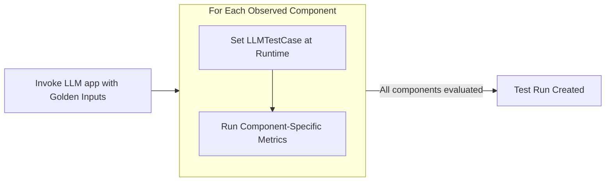

import Tabs from "@theme/Tabs";
import TabItem from "@theme/TabItem";
import { Timeline, TimelineItem } from "@site/src/components/Timeline";
import VideoDisplayer from "@site/src/components/VideoDisplayer";

Component-level evaluation assess individual units of [LLM interaction](/docs/evaluation-test-cases#what-is-an-llm-interaction) between **internal components** such as retrievers, tool calls, LLM generations, or even agents interacting with other agents, rather than treating the LLM app as a black box.


Component-level evaluation is currently only supported for single-turn evals.

<details>
<summary><strong>When should you run Component-Level evaluations?</strong></summary>

In [end-to-end evaluation](/docs/evaluation-end-to-end-llm-evals), your LLM application is treated as a black-box and evaluation is encapsulated by the overall system inputs and outputs in the form of an `LLMTestCase`.

If your application has nested components or a structure that a simple `LLMTestCase` can't easily handle, component-level evaluation allows you to **apply different metrics to different components in your LLM application.**

Common use cases that are suitable for component-level evaluation include (not inclusive):

- Chatbots/conversational agents
- Autonomous agents
- Text-SQL
- Code generation
- etc.

The trend you'll notice is use cases that are more complex in architecture are more suited for component-level evaluation.

</details>

## How Does It Work?

Once your LLM application is decorated with `@observe`, you'll be able to provide it as an `observed_callback` and invoke it with `Golden`s to create a list of test cases within your `@observe` decorated spans. These test cases are then evaluated using the respective `metrics` to create a **test run**.

<div style={{ textAlign: "center", margin: "2rem 0" }}>



</div>

<Tabs>

<TabItem value="traces" label="Evals on Traces">

Evals on traces are [end-to-end evaluations](/docs/evaluation-end-to-end-llm-evals), where a single LLM interaction is being evaluated.

<VideoDisplayer
  src="https://confident-docs.s3.us-east-1.amazonaws.com/llm-tracing:traces.mp4"
  confidentUrl="/docs/llm-tracing/introduction"
  label="Learn how to setup LLM tracing for Confident AI"
/>

</TabItem>

<TabItem value="spans" label="Evals on Spans">

Spans make up a trace and evals on spans represents [component-level evaluations](/docs/evaluation-component-level-llm-evals), where individual components in your LLM app are being evaluated.

<VideoDisplayer
  src="https://confident-docs.s3.us-east-1.amazonaws.com/llm-tracing:spans.mp4"
  confidentUrl="/docs/llm-tracing/introduction"
  label="Learn how to setup LLM tracing for Confident AI"
/>

</TabItem>

</Tabs>

:::tip
Component-level evaluations generates LLM traces, which are only visible on Confident AI. To view them, login [here](https://app.confident-ai.com) or run:

```
deepeval login
```

:::

## Setup Test Environment

<Timeline>
<TimelineItem title="Setup LLM Tracing and metrics">

For component-level testing you need to setup LLM tracing to you application. You can learn about [how to setup LLM tracing here](/docs/evaluation-llm-tracing).

```python title="somewhere.py" showLineNumbers {12,20}
from typing import List
from openai import OpenAI

from deepeval.tracing import observe, update_current_span
from deepeval.test_case import LLMTestCase
from deepeval.metrics import AnswerRelevancyMetric

def your_llm_app(input: str):
    def retriever(input: str):
        return ["Hardcoded", "text", "chunks", "from", "vectordb"]

    @observe(metrics=[AnswerRelevancyMetric()])
    def generator(input: str, retrieved_chunks: List[str]):
        res = OpenAI().chat.completions.create(
            model="gpt-4o",
            messages=[{"role": "user", "content": "\n\n".join(retrieved_chunks) + "\n\nQuestion: " + input}]
        ).choices[0].message.content

        # Create test case at runtime
        update_current_span(test_case=LLMTestCase(input=input, actual_output=res))

        return res

    return generator(input, retriever(input))


print(your_llm_app("How are you?"))
```

In the example above, we:

- Deocrated different functions in our application with `@observe`, which allows `deepeval` to map out how components relate to one another.
- Supplied the `AnswerRelevancyMetric` to `metrics` in the `generator`, which tells `deepeval` that component should be evaluated
- Constructed test cases at runtime using `update_current_span`

You can learn more about LLM tracing in [this section.](/docs/evaluation-llm-tracing)

<details>
<summary>What is LLM tracing?</summary>

The process of adding the `@observe` decorating in your app is known as **tracing**, which you can learn about in the [tracing section](/docs/evaluation-llm-tracing).

An `@observe` decorator creates a **span**, and the overall collection of spans is called a **trace**.

As you'll see in the example below, tracing with `deepeval`'s `@observe` means we don't have to return variables such as the `retrieval_context` in awkward places just to create end-to-end `LLMTestCase`s, [as previously seen in end-to-end evaluation](/docs/evaluation-end-to-end-llm-evals#setup-your-testing-environment)

</details>

</TimelineItem>
<TimelineItem title="Create a dataset">

[Datasets](/docs/evaluation-datasets) in `deepeval` allow you to store [`Golden`](/docs/evaluation-datasets#what-are-goldens)s, which are like a precursors to test cases. They allow you to create test case dynamically during evaluation time by calling your LLM application. Here's how you can create goldens:

<Tabs groupId="single-multi-turns">
<TabItem label="Single-Turn" value="single-turn">

```python
from deepeval.dataset import Golden

goldens=[
    Golden(input="What is your name?"),
    Golden(input="Choose a number between 1 to 100"),
]
```

</TabItem>
<TabItem label="Multi-Turn" value="multi-turn">

```python
from deepeval.dataset import ConversationalGolden

goldens = [
    ConversationalGolden(
        scenario="Andy Byron wants to purchase a VIP ticket to a Coldplay concert.",
        expected_outcome="Successful purchase of a ticket.",
        user_description="Andy Byron is the CEO of Astronomer.",
    )
]
```

</TabItem>
</Tabs>

You can also generate synthetic goldens automatically using the `Synthesizer`. Learn more [here](/docs/synthesizer-introduction). You can now use these goldens to create an evaluation dataset that can be stored and loaded them anytime.

<Tabs>
<TabItem value="confident-ai" label="Confident AI">

```python
from deepeval.dataset import EvaluationDataset

dataset = EvaluationDataset(goldens)
dataset.push(alias="My dataset")
```

</TabItem>
<TabItem value="csv" label="Locally as CSV">

```python
from deepeval.dataset import EvaluationDataset

dataset = EvaluationDataset(goldens)
dataset.save_as(
    file_type="csv",
    directory="./example"
)
```

</TabItem>
<TabItem value="json" label="Locally as JSON">

```python
from deepeval.dataset import EvaluationDataset

dataset = EvaluationDataset(goldens)
dataset.save_as(
    file_type="json",
    directory="./example"
)
```

</TabItem>
</Tabs>

✅ Done. You can now use this dataset anywhere to run your evaluations automatically by looping over them and generating test cases.

</TimelineItem>
</Timeline>

## Run Component-Level Evals

You can use the dataset you just created and invoke your `@observe` decorated LLM application within the loop of `evals_iterator()` to run component-level evals.

<Timeline>
<TimelineItem title="Load your dataset">

`deepeval` offers support for loading datasets stored in JSON files, CSV files, and hugging face datasets into an `EvaluationDataset` as either test cases or goldens.

<Tabs>
<TabItem value="confident-ai" label="Confident AI">

```python
from deepeval.dataset import EvaluationDataset

dataset = EvaluationDataset()
dataset.pull(alias="My Evals Dataset")
```

</TabItem>
<TabItem value="csv" label="From CSV">

```python
from deepeval.dataset import EvaluationDataset

dataset = EvaluationDataset()

dataset.add_goldens_from_csv_file(
    # file_path is the absolute path to your .csv file
    file_path="example.csv",
    input_col_name="query"
)
```

</TabItem>
<TabItem value="json" label="From JSON">

```python
from deepeval.dataset import EvaluationDataset

dataset = EvaluationDataset()

dataset.add_goldens_from_json_file(
    # file_path is the absolute path to your .json file
    file_path="example.json",
    input_key_name="query"
)
```

</TabItem>
</Tabs>

You can [learn more about loading datasets here](/docs/evaluation-datasets#load-dataset).

</TimelineItem>
<TimelineItem title="Run evals using evals iterator">

You can use the dataset's `evals_iterator` to run component-level evals by simply calling your LLM app within the loop for all goldens.

```python title="main.py"
from somewhere import your_llm_app # Replace with your LLM app
from deepeval.dataset import EvaluationDataset

dataset = EvaluationDataset()
dataset.pull(alias="My Evals Dataset")

for golden in dataset.evals_iterator():
    # Invoke your LLM app
    your_llm_app(golden.input)
```

There are **SIX** optional parameters when using the `evals_iterator()`:

- [Optional] `metrics`: a list of `BaseMetric` that allows you to run end-to-end evals for your traces.
- [Optional] `identifier`: a string that allows you to better identify your test run on Confident AI.
- [Optional] `async_config`: an instance of type `AsyncConfig` that allows you to [customize the degree concurrency](/docs/evaluation-flags-and-configs#async-configs) during evaluation. Defaulted to the default `AsyncConfig` values.
- [Optional] `display_config`:an instance of type `DisplayConfig` that allows you to [customize what is displayed](/docs/evaluation-flags-and-configs#display-configs) to the console during evaluation. Defaulted to the default `DisplayConfig` values.
- [Optional] `error_config`: an instance of type `ErrorConfig` that allows you to [customize how to handle errors](/docs/evaluation-flags-and-configs#error-configs) during evaluation. Defaulted to the default `ErrorConfig` values.
- [Optional] `cache_config`: an instance of type `CacheConfig` that allows you to [customize the caching behavior](/docs/evaluation-flags-and-configs#cache-configs) during evaluation. Defaulted to the default `CacheConfig` values.

</TimelineItem>
</Timeline>

:::tip
We highly recommend setting up [Confident AI](https://app.confident-ai.com) with your `deepeval` evaluations to observe your spans and traces evals in a nice intuitive UI like this:

<VideoDisplayer
  src="https://confident-docs.s3.us-east-1.amazonaws.com/llm-tracing:spans.mp4"
  confidentUrl="/docs/llm-tracing/introduction"
  label="Span-Level Evals in Production"
/>
:::

If you want to run component-level evaluations in CI/CD piplines, [click here](/docs/evaluation-unit-testing-in-ci-cd#component-level-evals-in-cicd).
