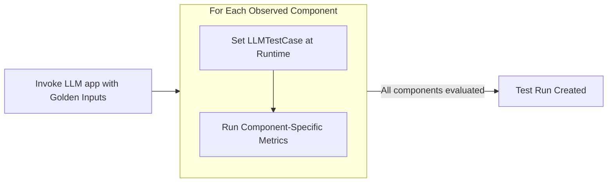

import Tabs from "@theme/Tabs";
import TabItem from "@theme/TabItem";

Component-level evaluation assess individual units of [LLM interaction](/docs/evaluation-test-cases#what-is-an-llm-interaction) between **internal components** such as retrievers, tool calls, LLM generations, or even agents interacting with other agents, rather than treating the LLM app as a black box.

:::note
In [end-to-end evaluation](/docs/evaluation-end-to-end-llm-evals), your LLM application is treated as a black-box and evaluation is encapsulated by the overall system inputs and outputs in the form of an `LLMTestCase`.
:::

If your application has nested components or a structure that a simple `LLMTestCase` can't easily handle, component-level evaluation allows you to **apply different metrics to different components in your LLM application.**


:::info
You would still be creating `LLMTestCase`s, but this time for individual components at runtime instead of the overall system.
:::

Common use cases that are suitable for component-level evaluation include (not inclusive):

- Chatbots/conversational agents
- Autonomous agents
- Text-SQL
- Code generation
- etc.

The trend you'll notice is use cases that are more complex in architecture are more suited for component-level evaluation.

## Prerequisites

### Select metrics

Unlike end-to-end evaluation, you will need to select a set of appropriate metrics **for each component you want to evaluate**, and ensure the `LLMTestCase`s that you create in that component contains all the necessary parameters.

You should first read the [metrics section](/docs/metrics-introduction) to understand which metrics are suitable for which components, but alternatively you can also [join our discord to ask us directly.](https://discord.com/invite/a3K9c8GRGt)

:::info
In component-level evaluation, there are more metrics to select as there are more individual components to evaluate.
:::

### Setup LLM application

Unlike end-to-end evaluation, where setting up your LLM application requires rewriting some parts of your code to return certain variables for testing, component-level testing is as simple as adding an `@observe` decorator to apply different metrics at different component scopes.

:::danger YOU MUST KNOW
The process of adding the `@observe` decorating in your app is known as **tracing**, which we will learn how to setup fully in the [next section](/docs/evaluation-llm-tracing).

If you're worried about how tracing via `@observe` can affect your application, [click here.](/docs/evaluation-llm-tracing#dont-be-worried-about-tracing)
:::

An `@observe` decorator creates a **span**, and the overall collection of spans is called a **trace**. We'll trace this example LLM application to demonstrate how to run component-level evaluations using `deepeval` in two lines of code:

```python title="somewhere.py" showLineNumbers {14,25}
from typing import List
from openai import OpenAI

from deepeval.tracing import observe, update_current_span
from deepeval.test_case import LLMTestCase
from deepeval.metrics import AnswerRelevancyMetric

client = OpenAI()

def your_llm_app(input: str):
    def retriever(input: str):
        return ["Hardcoded text chunks from your vector database"]

    @observe(metrics=[AnswerRelevancyMetric()])
    def generator(input: str, retrieved_chunks: List[str]):
        res = client.chat.completions.create(
            model="gpt-4o",
            messages=[
                {"role": "system", "content": "Use the provided context to answer the question."},
                {"role": "user", "content": "\n\n".join(retrieved_chunks) + "\n\nQuestion: " + input}
            ]
        ).choices[0].message.content

        # Create test case at runtime
        update_current_span(test_case=LLMTestCase(input=input, actual_output=res))

        return res

    return generator(input, retriever(input))


print(your_llm_app("How are you?"))
```

If you compare this implementation to the [previous one in end-to-end evaluation](/docs/evaluation-end-to-end-llm-evals#setup-llm-application), you'll notice that tracing with `deepeval`'s `@observe` means we don't have to return variables such as the `retrieval_context` in awkward places just to create end-to-end `LLMTestCase`s.

:::caution
At this point, you can either pause and [learn how to setup LLM tracing in the next section](/docs/evaluation-llm-tracing) before continuing, or finish this section before moving onto tracing.
:::

## Run Component-Level Evals

Once your LLM application is decorated with `@observe`, you'll be able to provide it as an `observed_callback` and invoked it with `Golden`s to create a list of test cases within your `@observe` decorated spans. These test cases are then evaluated using the respective `metrics` to create a **test run**.

<div style={{ textAlign: "center", margin: "2rem 0" }}>



</div>

You can run component=level LLM evaluations in either:

- **CI/CD pipelines** using `deepeval test run`, or
- **Python scripts** using the `evaluate()` function or
- **Python scripts** using the `dataset` iterator

All 3 methods give you exactly the same functionality, and integrates 100% with Confident AI for [sharable testing reports on the cloud.](https://documentation.confident-ai.com/docs/llm-evaluation/evaluation-features/testing-reports)

### Use `dataset` iterator in Python scripts

To use the `dataset` iterator for component-level testing, supply your dataset alias or a list of `Golden`s to the iterator, then invoke your `@observe` decorated LLM application within the loop.

<Tabs>

<TabItem value="async" label="Asynchronous">

```python title="main.py"
from somewhere import your_async_llm_app # Replace with your async LLM app
from deepeval import dataset, test_run

for golden in dataset(alias="Your Dataset Name"):
    # Create task to invoke your async LLM app
    task = asyncio.create_task(your_async_llm_app(golden.input))
    test_run.append(task)
```

</TabItem>

<TabItem value="sync" label="Synchronous">

```python title="main.py"
from somewhere import your_llm_app # Replace with your LLM app
from deepeval import dataset

for golden in dataset(alias="Your Dataset Name"):
    # Invoke your LLM app
    your_llm_app(golden.input)
```

</TabItem>

</Tabs>

There are **SEVEN** optional parameters when calling the `dataset` iterator for **COMPONENT-LEVEL** evaluation:

- [Optional] `alias`: the alias of the dataset you wish to use as inputs to your LLM application.
- [Optional] `goldens`: a list of `Golden`s that you wish to use as inputs to your LLM application. Must be supplied if `alias` is not provided.
- [Optional] `identifier`: a string that allows you to better identify your test run on Confident AI.
- [Optional] `async_config`: an instance of type `AsyncConfig` that allows you to [customize the degree concurrency](/docs/evaluation-flags-and-configs#async-configs) during evaluation. Defaulted to the default `AsyncConfig` values.
- [Optional] `display_config`:an instance of type `DisplayConfig` that allows you to [customize what is displayed](/docs/evaluation-flags-and-configs#display-configs) to the console during evaluation. Defaulted to the default `DisplayConfig` values.
- [Optional] `error_config`: an instance of type `ErrorConfig` that allows you to [customize how to handle errors](/docs/evaluation-flags-and-configs#error-configs) during evaluation. Defaulted to the default `ErrorConfig` values.
- [Optional] `cache_config`: an instance of type `CacheConfig` that allows you to [customize the caching behavior](/docs/evaluation-flags-and-configs#cache-configs) during evaluation. Defaulted to the default `CacheConfig` values.

### Use `evaluate()` in Python scripts

To use `evaluate()` for component-level testing, supply a list of `Golden`s instead of `LLMTestCase`s, and an `observed_callback` which is the `@observe` decorated LLM application you wish to run evals on.

```python title="main.py"
from somewhere import your_llm_app # Replace with your LLM app

from deepeval.dataset import Golden
from deepeval import evaluate

# Goldens from your dataset
goldens = [Golden(input="...")]

# Evaluate with `observed_callback`
evaluate(goldens=goldens, observed_callback=your_llm_app)
```

There are **TWO** mandatory and **FIVE** optional parameters when calling the `evaluate()` function for **COMPONENT-LEVEL** evaluation:

- `goldens`: a list of `Golden`s that you wish to invoke your `observed_callback` with.
- `observed_callback`: a function callback that is your `@observe` decorated LLM application. There must be **AT LEAST ONE** metric within one of the `metrics` in your `@observe` decorated LLM application.
- [Optional] `identifier`: a string that allows you to better identify your test run on Confident AI.
- [Optional] `async_config`: an instance of type `AsyncConfig` that allows you to [customize the degree concurrency](/docs/evaluation-flags-and-configs#async-configs) during evaluation. Defaulted to the default `AsyncConfig` values.
- [Optional] `display_config`:an instance of type `DisplayConfig` that allows you to [customize what is displayed](/docs/evaluation-flags-and-configs#display-configs) to the console during evaluation. Defaulted to the default `DisplayConfig` values.
- [Optional] `error_config`: an instance of type `ErrorConfig` that allows you to [customize how to handle errors](/docs/evaluation-flags-and-configs#error-configs) during evaluation. Defaulted to the default `ErrorConfig` values.
- [Optional] `cache_config`: an instance of type `CacheConfig` that allows you to [customize the caching behavior](/docs/evaluation-flags-and-configs#cache-configs) during evaluation. Defaulted to the default `CacheConfig` values.

:::tip
You'll notice that unlike end-to-end evaluation, there is no declaration of `metrics` because those are defined in `@observe` in the `metrics` parameter, and there are no creation of `LLMTestCase`s because it is handled at runtime by `update_current_span` in your LLM app.
:::

### Use `deepeval test run` in CI/CD pipelines

`deepeval` allows you to run evaluations as if you're using Pytest via our Pytest integration.

```python title="test_llm_app.py" showLineNumbers {10}
from somewhere import your_llm_app # Replace with your LLM app
import pytest
from deepeval.dataset import Golden
from deepeval import assert_test

# Goldens from your dataset
goldens = [Golden(input="...")]

# Loop through goldens using pytest
@pytest.mark.parametrize("golden", goldens)
def test_llm_app(golden: Golden):
    assert_test(golden=golden, observed_callback=your_llm_app)
```

:::info
Similar to the `evaluate()` function, `assert_test()` for component-level evaluation does not need:

- Declaration of `metrics` because those are defined at the span level in the `metrics` parameter.
- Creation of `LLMTestCase`s because it is handled at runtime by `update_current_span` in your LLM app.

:::

Finally, don't forget to run the test file in the CLI:

```bash
deepeval test run test_llm_app.py
```

There are **TWO** mandatory and **ONE** optional parameter when calling the `assert_test()` function for **COMPONENT-LEVEL** evaluation:

- `golden`: the `Golden` that you wish to invoke your `observed_callback` with.
- `observed_callback`: a function callback that is your `@observe` decorated LLM application. There must be **AT LEAST ONE** metric within one of the `metrics` in your `@observe` decorated LLM application.
- [Optional] `run_async`: a boolean which when set to `True`, enables concurrent evaluation of all metrics in `@observe`. Defaulted to `True`.

[Click here](/docs/evaluation-flags-and-configs#flags-for-deepeval-test-run) to learn about different optional flags available to `deepeval test run` to customize asynchronous behaviors, error handling, etc.
