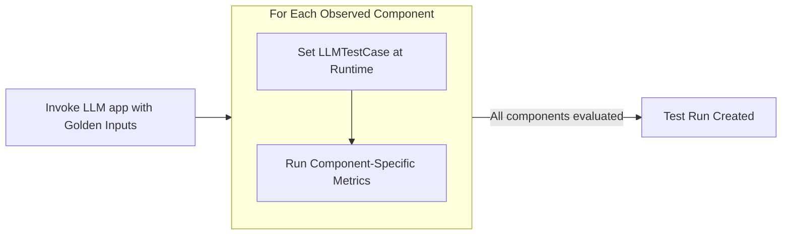

import Tabs from "@theme/Tabs";
import TabItem from "@theme/TabItem";
import { Timeline, TimelineItem } from "@site/src/components/Timeline";
import VideoDisplayer from "@site/src/components/VideoDisplayer";

Component-level evaluation assess individual units of [LLM interaction](/docs/evaluation-test-cases#what-is-an-llm-interaction) between **internal components** such as retrievers, tool calls, LLM generations, or even agents interacting with other agents, rather than treating the LLM app as a black box.


:::tip
Component-level evaluations generates LLM traces, which are only visible on Confident AI. To view them, login [here](https://app.confident-ai.com) or run:

```
deepeval login
```
:::

## What Are Component-Level Evals

Once your LLM application is decorated with `@observe`, you'll be able to provide it as an `observed_callback` and invoke it with `Golden`s to create a list of test cases within your `@observe` decorated spans. These test cases are then evaluated using the respective `metrics` to create a **test run**.

<div style={{ textAlign: "center", margin: "2rem 0" }}>



</div>

:::note
Component-level evaluation is currently not supported for multi-turn test cases.
:::

<Tabs>

<TabItem value="traces" label="Evals on Traces">

Evals on traces are [end-to-end evaluations](/docs/evaluation-end-to-end-llm-evals), where a single LLM interaction is being evaluated.

<VideoDisplayer
  src="https://confident-docs.s3.us-east-1.amazonaws.com/llm-tracing:traces.mp4"
  confidentUrl="/docs/llm-tracing/introduction"
  label="Learn how to setup LLM tracing for Confident AI"
/>

</TabItem>

<TabItem value="spans" label="Evals on Spans">

Spans make up a trace and evals on spans represents [component-level evaluations](/docs/evaluation-component-level-llm-evals), where individual components in your LLM app are being evaluated.

<VideoDisplayer
  src="https://confident-docs.s3.us-east-1.amazonaws.com/llm-tracing:spans.mp4"
  confidentUrl="/docs/llm-tracing/introduction"
  label="Learn how to setup LLM tracing for Confident AI"
/>

</TabItem>

</Tabs>

<details>
<summary><strong>When should you run Component-Level evaluations?</strong></summary>

In [end-to-end evaluation](/docs/evaluation-end-to-end-llm-evals), your LLM application is treated as a black-box and evaluation is encapsulated by the overall system inputs and outputs in the form of an `LLMTestCase`.

If your application has nested components or a structure that a simple `LLMTestCase` can't easily handle, component-level evaluation allows you to **apply different metrics to different components in your LLM application.**

Common use cases that are suitable for component-level evaluation include (not inclusive):

- Chatbots/conversational agents
- Autonomous agents
- Text-SQL
- Code generation
- etc.

The trend you'll notice is use cases that are more complex in architecture are more suited for component-level evaluation.

</details>

## Setup Your Test Environment

<Timeline>
<TimelineItem title="Setup LLM Tracing">

For component-level testing you need to setup LLM tracing to you application. You can learn about [how to setup LLM tracing here](/docs/evaluation-llm-tracing).

<details>
<summary><strong>What is Tracing?</strong></summary>

The process of adding the `@observe` decorating in your app is known as **tracing**, which you can learn about in the [tracing section](/docs/evaluation-llm-tracing).

An `@observe` decorator creates a **span**, and the overall collection of spans is called a **trace**.

As you'll see in the example below, tracing with `deepeval`'s `@observe` means we don't have to return variables such as the `retrieval_context` in awkward places just to create end-to-end `LLMTestCase`s, [as previously seen in end-to-end evaluation](/docs/evaluation-end-to-end-llm-evals#setup-your-testing-environment)

</details>

We'll trace this example LLM application to demonstrate how to run component-level evaluations in two lines of code:

```python title="somewhere.py" {4,14,25}
from typing import List
from openai import OpenAI

from deepeval.tracing import observe, update_current_span
from deepeval.test_case import LLMTestCase
from deepeval.metrics import AnswerRelevancyMetric

client = OpenAI()

def your_llm_app(input: str):
    def retriever(input: str):
        return ["Hardcoded text chunks from your vector database"]

    @observe(metrics=[AnswerRelevancyMetric()])
    def generator(input: str, retrieved_chunks: List[str]):
        res = client.chat.completions.create(
            model="gpt-4o",
            messages=[
                {"role": "system", "content": "Use the provided context to answer the question."},
                {"role": "user", "content": "\n\n".join(retrieved_chunks) + "\n\nQuestion: " + input}
            ]
        ).choices[0].message.content

        # Create test case at runtime
        update_current_span(test_case=LLMTestCase(input=input, actual_output=res))

        return res

    return generator(input, retriever(input))


print(your_llm_app("How are you?"))
```

</TimelineItem>
<TimelineItem title="Select metrics">

You should first read the [metrics section](/docs/metrics-introduction) to understand which metrics are suitable for which components, but alternatively you can also [join our discord to ask us directly.](https://discord.com/invite/a3K9c8GRGt)

You can just supply your selected metrics in the [`@observe`](/docs/evaluation-llm-tracing#observe) decorator to run component level evals.

</TimelineItem>
<TimelineItem title="Create Goldens">

A [`Golden`](/docs/evaluation-datasets#what-are-goldens) represents a more flexible alternative to test cases in `deepeval`. Unlike test cases, goldens only require an `input` and can be stored in datasets. You can use the goldens from datasets to generate test cases dynamically during run-time.

```python
from deepeval.dataset import Golden

goldens=[
    Golden(input="What is your name?"),
    Golden(input="Choose a number between 1 to 100"),
    ...
]
```

Often times, manually creating these goldens can be a taxing task during evaluation process. You can use `deepeval`'s `Synthesizer` to automatically generate your goldens. Click here to [learn more about the `Synthesizer`]((/docs/synthesizer-introduction)).

</TimelineItem>
<TimelineItem title="Create a dataset">

You can use the above goldens to create an evaluation dataset. A dataset allows you to use your goldens to generate test cases and run evaluations at runtime.


Here's an example of how you can create and store your datasets using `deepeval`:

<Tabs>
<TabItem value="confident-ai" label="Confident AI">

```python
from deepeval.dataset import EvaluationDataset

dataset = EvaluationDataset(goldens)
dataset.push(alias="My dataset")
```

</TabItem>
<TabItem value="locally" label="Locally as CSV or JSON">

```python
from deepeval.dataset import EvaluationDataset

dataset = EvaluationDataset(goldens)
dataset.save_as(
    file_type="csv", 
    directory="./deepeval-test-dataset"
)
```

</TabItem>
</Tabs>

You can learn more about [datasets here](/docs/evaluation-datasets).

</TimelineItem>
</Timeline>

You now have traces, metrics and datasets that you use to run component level evals. Here's how you can run component-level evals using this data:

## Running Component-Level Evals

You can use the dataset you just created and invoke your `@observe` decorated LLM application within the loop of `evals_iterator()` to run component-level evals.

<Timeline>
<TimelineItem title="Load your dataset">

`deepeval` offers support for loading datasets stored in JSON files, CSV files, and hugging face datasets into an `EvaluationDataset` as either test cases or goldens.

<Tabs>
<TabItem value="confident-ai" label="Confident AI">

```python
from deepeval.dataset import EvaluationDataset

dataset = EvaluationDataset()
dataset.pull(alias="My Evals Dataset")
```

</TabItem>

<TabItem value="from-json" label="From JSON">

```python
from deepeval.dataset import EvaluationDataset

dataset = EvaluationDataset()

dataset.add_goldens_from_json_file(
    # file_path is the absolute path to you .json file
    file_path="example.json",
    input_key_name="query"
)
```
</TabItem>

<TabItem value="from-csv" label="From CSV">

```python
from deepeval.dataset import EvaluationDataset

dataset = EvaluationDataset()

dataset.add_goldens_from_csv_file(
    # file_path is the absolute path to you .csv file
    file_path="example.csv",
    input_col_name="query"
)
```

</TabItem>
</Tabs>

You can [learn more about loading datasets here](/docs/evaluation-datasets#load-dataset).

</TimelineItem>
<TimelineItem title="Run evals using evals iterator">

You can use the dataset's `evals_iterator` to run component-level evals by simply calling your LLM app within the loop for all goldens.

```python title="main.py"
from somewhere import your_llm_app # Replace with your LLM app
from deepeval.dataset import EvaluationDataset

dataset = EvaluationDataset()
dataset.pull(alias="My Evals Dataset")

for golden in dataset.evals_iterator():
    # Invoke your LLM app
    your_llm_app(golden.input)
```

There are **SIX** optional parameters when using the `evals_iterator()`:

- [Optional] `metrics`: a list of `BaseMetric` that allows you to run end-to-end evals for your traces.
- [Optional] `identifier`: a string that allows you to better identify your test run on Confident AI.
- [Optional] `async_config`: an instance of type `AsyncConfig` that allows you to [customize the degree concurrency](/docs/evaluation-flags-and-configs#async-configs) during evaluation. Defaulted to the default `AsyncConfig` values.
- [Optional] `display_config`:an instance of type `DisplayConfig` that allows you to [customize what is displayed](/docs/evaluation-flags-and-configs#display-configs) to the console during evaluation. Defaulted to the default `DisplayConfig` values.
- [Optional] `error_config`: an instance of type `ErrorConfig` that allows you to [customize how to handle errors](/docs/evaluation-flags-and-configs#error-configs) during evaluation. Defaulted to the default `ErrorConfig` values.
- [Optional] `cache_config`: an instance of type `CacheConfig` that allows you to [customize the caching behavior](/docs/evaluation-flags-and-configs#cache-configs) during evaluation. Defaulted to the default `CacheConfig` values.

</TimelineItem>
</Timeline>

:::tip
We highly recommend setting up [Confident AI](https://app.confident-ai.com) with your `deepeval` evaluations to observe your spans and traces evals in a nice intuitive UI like this:

<VideoDisplayer
  src="https://confident-docs.s3.us-east-1.amazonaws.com/llm-tracing:spans.mp4"
  confidentUrl="/docs/llm-tracing/introduction"
  label="Span-Level Evals in Production"
/>
:::

If you want to run component-level evaluations in CI/CD piplines, [click here](/docs/evaluation-unit-testing-in-ci-cd#component-level-evals-in-cicd).