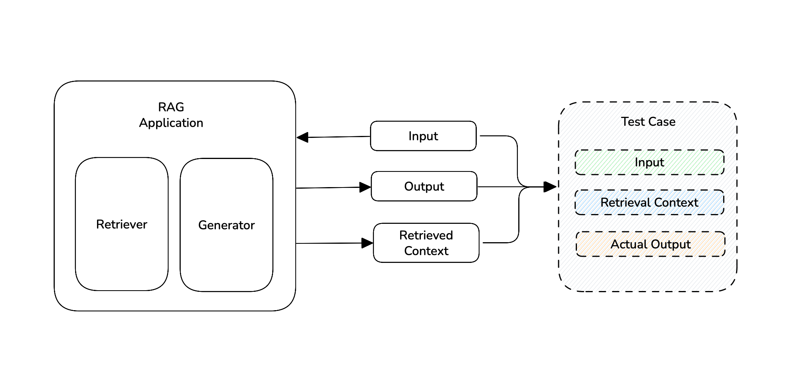
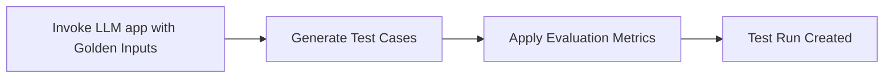

import Tabs from "@theme/Tabs";
import TabItem from "@theme/TabItem";
import { Timeline, TimelineItem } from "@site/src/components/Timeline";
import VideoDisplayer from "@site/src/components/VideoDisplayer";

End-to-end evaluation assesses the "observable" inputs and outputs of your LLM application - it is what users see, and treats your LLM application as a black-box.



:::tip
To get a more intuitive and fully sharable [LLM test report](https://documentation.confident-ai.com/docs/llm-evaluation/evaluation-features/testing-reports) login to Confident AI [here](https://app.confident-ai.com) or run the following in your terminal:

```bash
deepeval login
```
:::

## What Are End-to-End Evals

Running an end-to-end LLM evaluation creates a **test run** — a collection of test cases that benchmarks your LLM application at a specific point in time. You would typically:

- Loop through a list of `Golden`s
- Invoke your LLM app with each golden’s `input`
- Generate a set of test cases ready for evaluation

<div style={{ textAlign: "center", margin: "2rem 0" }}>



</div>

You can run end-to-end LLM evaluations in either:

- **Python scripts** using the `evaluate()` function, or
- **CI/CD pipelines** using `deepeval test run`

Both gives you exactly the same functionality, and integrates 100% with Confident AI for [sharable testing reports on the cloud.](http://documentation.confident-ai.com/docs/llm-evaluation/evaluation-features/testing-reports)

<details>
<summary><strong>When should you run End-to-End evaluations?</strong></summary>

For simple LLM applications like basic RAG pipelines with "flat" architectures
that can be represented by a single <code>LLMTestCase</code>, end-to-end
evaluation is ideal. Common use cases that are suitable for end-to-end
evaluation include (not inclusive):

- RAG QA
- PDF extraction
- Writing assitants
- Summarization
- etc.

You'll notice that use cases with simplier architectures are more suited for end-to-end evaluation. However, if your system is an extremely complex agentic workflow, you might also find end-to-end evaluation more suitable as you'll might conclude that that component-level evaluation gives you too much noise in its evaluation results.

Most of what you saw in DeepEval's <a href="/docs/getting-started">quickstart</a> is end-to-end evaluation!

</details>

## Setup Your Testing Environment

<Timeline>
<TimelineItem title="Select metrics">

When it comes to selecting metrics for your application, we recommend choosing no more than 5 metrics, comprising of:

- (2 - 3) **Generic metrics** for your application type. (_e.g. Agents, RAG, Chabot_)
- (1 - 2) **Custom metrics** for your specific use case.

You can read our [metrics section](/docs/metrics-introduction) to learn about the 40+ metrics we offer.  Or come to [our discord](https://discord.com/invite/a3K9c8GRGt) and get some tailored recommendations from our team.

</TimelineItem>
<TimelineItem title="Setup LLM application">

You'll need to setup your LLM application to return the test case parameters required by the metrics you've chosen. Alternatively, [setup LLM tracing](/docs/evaluation-llm-tracing) to avoid making changes to your LLM app.

<details>
  <summary>Guidelines to set up your LLM application</summary>

You'll need to make sure your application returns all fields required by your selected metrics, in order to create a valid end-to-end `LLMTestCase`. For example, if you’re using `AnswerRelevancyMetric` and `FaithfulnessMetric`, your application must return:

- `input`
- `actual_output`
- `retrieval_context`

because both metrics require `input` and `actual_output`, and `FaithfulnessMetric` also requires `retrieval_context`.

If you cannot make changes to your LLM app, you should <a href="/docs/evaluation-llm-tracing">set up tracing</a>, which also allows you to run and debug end-to-end evaluations on Confident AI.

</details>

We'll be using this LLM application in this example which has a simple, "flat" RAG architecture to demonstrate how to run end-to-end evaluations on it using `deepeval`:

```python title="rag_agent.py" {18}
from typing import List

def your_llm_app(input: str):
    tools = []

    def retriever(input: str):
        # Your retriever logic
        return ["Your top k retrieved texts in a list"]

    def generator(input: str, retrieved_chunks: List[str]):
        # Your generator logic
        # Add tools (if any)
        return "The final answer from your generator in a string"

    retrieved_context = retriever(input)
    answer = generator(input, retrieved_context)

    return answer, retrieved_context, tools

print(your_llm_app("How are you?"))
```

</TimelineItem>

</Timeline>

## Use `evaluate()` in Python scripts

<Timeline>
<TimelineItem title="Create a dataset">

A dataset can only be created with a list of goldens. `Golden`s represent a more flexible alternative to test cases in the `deepeval`, and **it is the preferred way to initialize a dataset using goldens**. Unlike test cases, `Golden`s:

- Don't require an `actual_output` when created
- Store expected results like `expected_output` and `expected_tools`
- Serve as templates before becoming fully-formed test cases

```python
from deepeval.dataset import EvaluationDataset, Golden

goldens=[
    Golden(input="What is your name?"),
    Golden(input="Choose a number between 1 to 100"),
    ...
]

dataset = EvaluationDataset(goldens)
dataset.push(alias="Your Dataset Name")
```
</TimelineItem>
<TimelineItem title="Run evals using dataset's goldens">

`deepeval` offers an `evaluate()` function that allows you to evaluate end-to-end LLM interactions through a list of test cases and metrics. Each test case will be evaluated by each and every metric you define in `metrics`, and a test case passes only if all `metrics` passes.

<Tabs>
<TabItem value="python" label="Python">

```python title="main.py" {14}
from rag_agent import your_llm_app # Replace with your LLM app

from deepeval.dataset import EvaluationDataset, Golden
from deepeval.test_case import LLMTestCase
from deepeval.metrics import AnswerRelevancyMetric
from deepeval import evaluate

dataset = EvaluationDataset(goldens=[Golden(input="...")])

# Create test cases from goldens
for golden in dataset.goldens:
    res, text_chunks = your_llm_app(golden.input)
    test_case = LLMTestCase(input=golden.input, actual_output=res, retrieval_context=text_chunks)
    dataset.add_test_case(test_case)

# Evaluate end-to-end
evaluate(
    test_cases=dataset.test_case, 
    metrics=[AnswerRelevancyMetric()],
    hyperparameters={
        model="gpt-4.1",
        system_prompt="..."
    }
)
```

</TabItem>
<TabItem value="openai" label="OpenAI">

```python title="main.py" showLineNumbers {1,18}
from deepeval.openai import OpenAI # import OpenAI from deepeval instead

from deepeval.dataset import EvaluationDataset, Golden
from deepeval.test_case import LLMTestCase
from deepeval.metrics import AnswerRelevancyMetric

dataset = EvaluationDataset(goldens=[Golden(input="...")])
client = OpenAI()

# Loop through dataset
for golden in dataset.evals_iterator():
    client.chat.completions.create(
        model="gpt-4o",
        messages=[
            {"role": "system", "content": "You are a helpful assistant."},
            {"role": "user", "content": golden.input}
        ],
        metrics=[AnswerRelevancyMetric()]
    )
```

</TabItem>
</Tabs>

There are **TWO** mandatory and **SIX** optional parameters when calling the `evaluate()` function for **END-TO-END** evaluation:

- `test_cases`: a list of `LLMTestCase`s **OR** `ConversationalTestCase`s, or an `EvaluationDataset`. You cannot evaluate `LLMTestCase`/`MLLMTestCase`s and `ConversationalTestCase`s in the same test run.
- `metrics`: a list of metrics of type `BaseMetric`.
- [Optional] `hyperparameters`: a dict of type `dict[str, Union[str, int, float]]`. You can log any arbitrary hyperparameter associated with this test run to pick the best hyperparameters for your LLM application on Confident AI.
- [Optional] `identifier`: a string that allows you to better identify your test run on Confident AI.
- [Optional] `async_config`: an instance of type `AsyncConfig` that allows you to [customize the degree of concurrency](/docs/evaluation-flags-and-configs#async-configs) during evaluation. Defaulted to the default `AsyncConfig` values.
- [Optional] `display_config`:an instance of type `DisplayConfig` that allows you to [customize what is displayed](/docs/evaluation-flags-and-configs#display-configs) to the console during evaluation. Defaulted to the default `DisplayConfig` values.
- [Optional] `error_config`: an instance of type `ErrorConfig` that allows you to [customize how to handle errors](/docs/evaluation-flags-and-configs#error-configs) during evaluation. Defaulted to the default `ErrorConfig` values.
- [Optional] `cache_config`: an instance of type `CacheConfig` that allows you to [customize the caching behavior](/docs/evaluation-flags-and-configs#cache-configs) during evaluation. Defaulted to the default `CacheConfig` values.

This is exactly the same as `assert_test()` in `deepeval test run`, but in a difference interface.

</TimelineItem>
</Timeline>

## Use `deepeval test run` in CI/CD pipelines


<Timeline>
<TimelineItem title="Pull your dataset">

```python
from deepeval.dataset import EvaluationDataset

dataset = EvaluationDataset()
dataset.pull(alias="Your Dataset Name") # replace with your alias
```

You can use this dataset to iterate over goldens.

</TimelineItem>
<TimelineItem title="Create your pytest file">

```python title="test_llm_app.py" showLineNumbers {14}
from somewhere import your_llm_app # Replace with your LLM app
import pytest

from deepeval.dataset import Golden
from deepeval.test_case import LLMTestCase
from deepeval import assert_test

# Loop through goldens using pytest

@pytest.mark.parametrize("golden",dataset.goldens)
def test_llm_app(golden: Golden):
    res, text_chunks = your_llm_app(golden.input)
    test_case = LLMTestCase(input=golden.input, actual_output=res, retrieval_context=text_chunks)
    assert_test(test_case=test_case, metrics=[AnswerRelevancyMetric()])
```

Then, run the following command in your CLI:

```bash
deepeval test run test_llm_app.py
```

There are **TWO** mandatory and **ONE** optional parameter when calling the `assert_test()` function for **END-TO-END** evaluation:

- `test_case`: an `LLMTestCase`.
- `metrics`: a list of metrics of type `BaseMetric`.
- [Optional] `run_async`: a boolean which when set to `True`, enables concurrent evaluation of all metrics in `@observe`. Defaulted to `True`.


</TimelineItem>
<TimelineItem title="Create a YAML file to test on every push">

You just need to create a YAML file now to test your LLM app on every change you make.

```yaml {32-33}
name: LLM App DeepEval Tests

on:
  push:
    branches: [main]
  pull_request:
    branches: [main]

jobs:
  test:
    runs-on: ubuntu-latest
    steps:
      - name: Checkout Code
        uses: actions/checkout@v2

      - name: Set up Python
        uses: actions/setup-python@v4
        with:
          python-version: "3.10"

      - name: Install Poetry
        run: |
          curl -sSL https://install.python-poetry.org | python3 -
          echo "$HOME/.local/bin" >> $GITHUB_PATH

      - name: Install Dependencies
        run: poetry install --no-root

      - name: Run DeepEval Unit Tests
        env:
          OPENAI_API_KEY: ${{ secrets.OPENAI_API_KEY }}
          CONFIDENT_API_KEY: ${{ secrets.CONFIDENT_API_KEY }}
        run: poetry run deepeval test run test_llm_app.py
```
</TimelineItem>
</Timeline>

:::caution
The usual `pytest` command would still work but is highly not recommended. `deepeval test run` adds a range of functionalities on top of Pytest for unit-testing LLMs, which is enabled by [8+ optional flags](/docs/evaluation-flags-and-configs#flags-for-deepeval-test-run). Users typically include `deepeval test run` as a command in their `.yaml` files for pre-deployment checks in CI/CD pipelines ([example here](https://documentation.confident-ai.com/docs/llm-evaluation/evaluation-features/unit-testing-in-cicd)).
:::

[Click here](/docs/evaluation-flags-and-configs#flags-for-deepeval-test-run) to learn about different optional flags available to `deepeval test run` to customize asynchronous behaviors, error handling, etc.

:::tip
We highly recommend setting up [Confident AI](https://app.confident-ai.com) with your `deepeval` evaluations to get professional test reports and observe trends of your LLM application's performance overtime like this:

<VideoDisplayer
  src="https://confident-docs.s3.us-east-1.amazonaws.com/llm-tracing:traces.mp4"
  confidentUrl="/docs/llm-tracing/introduction"
  label="Trace-Level Evals in Production"
/>

You can [login to Confident AI here](https://app.confident-ai.com) or run:

```bash
deepeval login
```

**It's free to get started.** (_No credit card required!_)
:::