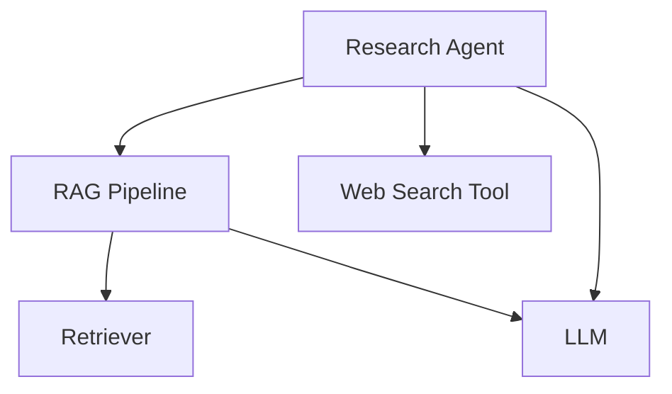

import VideoDisplayer from "@site/src/components/VideoDisplayer";

`deepeval` offers an `@observe` decorator for you to apply metrics at any point in your LLM app to evaluate any [LLM interaction](/docs/evaluation-test-cases#what-is-an-llm-interaction), no matter how complex they may be. Tracing is required for component-level evaluation, but we recommend everyone to set it up even if you're running end-to-end evaluations, as it provides full visibility for debugging internal components.

<VideoDisplayer
  src="https://confident-docs.s3.us-east-1.amazonaws.com/observability:llm-tracing.mp4"
  confidentUrl="/docs/llm-tracing/introduction"
  label="Learn how to setup LLM tracing for Confident AI"
/>

Each component above can be grouped into its own **span**, which is an arbitrary scope that you can define anywhere to suit your evaluation and debugging needs. A complete execution of your LLM application creates a **trace**, which contains one or more spans.

:::note
If you're concerned about how tracing could affect your codebase, [click here](/docs/evaluation-llm-tracing#dont-be-worried-about-tracing) to learn how we've designed `deepeval`'s tracing to not affect it at all.
:::

Tracing in `deepeval` has these benefits:

- **Component-level metrics**: Attach `LLMTestCase`s to agents, tools, retrievers, or LLMs to run targeted metrics like answer relevancy or context precision without refactoring.

- **Create test cases at runtime**: Different components may depend on the outputs of other components, instead of a static dataset `LLMTestCase`s to be set dynamically at runtime as data flows through the system.

- **Component-level debugging**: Trace evaluation across spans to inspect failures at tool calls, intermediate LLM outputs, or retrieved contexts.nt components are interacting with one another for each evaluated test case.

## Why Tracing?

Apart from tracing being mandatory for component-level evaluation, tracing solves these problems that you might have already experienced for end-to-end evaluation:

- **Awkward code changes:** You often need to expose or return internal variables across many layers just to capture `LLMTestCase` parameters for evaluation.

- **Limited visibility:** It's hard to debug individual components (e.g., retrieval, re-ranking, reasoning), and you might end up indexing evaluation results by the name of the component you wish to unit-test.

## Don't Be Worried About Tracing

`deepeval`'s tracing is **non-intrusive**, requires **minimal code change** and **doesn't add latency** to your LLM application. It also:

- **Uses concepts you already know**: Tracing a component in your LLM app takes on average 3 lines of code, which uses the same `LLMTestCase`s and [metrics](/docs/metrics-introduction) that you're already familiar with.

- **Does not affect production code**: If you're worried that tracing will affect your LLM calls in production, it won't. This is because the `@observe` decorators that you add for tracing is only invoked if called explicitly during evaluation.

- **Non-opinionated**: `deepeval` does not care what you consider a "component" - in fact a component can be anything, at any scope, as long as you're able to set your `LLMTestCase` within that scope for evaluation.

Tracing only runs when you want it to run, and takes 3 lines of code:

```python showLineNumbers {3,8,15}
from deepeval.test_case import LLMTestCase
from deepeval.metrics import AnswerRelevancyMetric
from deepeval.tracing import observe, update_current_span
from openai import OpenAI

client = OpenAI()

@observe(metrics=[AnswerRelevancyMetric()])
def complete(query: str):
    response = client.chat.completions.create(
        model="gpt-4o",
        messages=[{"role": "user", "content": query}]
    ).choices[0].message.content

    update_current_span(test_case=LLMTestCase(input=query, output=response))
    return response
```

:::tip
Each metric in `metrics` is evaluated using exactly the same algorithm, require the same `LLMTestCase` parameters, and with the same configurations, as you would expect when running evaluations without tracing.
:::

## Decorate A Component

Here are two terminologies you need to know when setting up tracing:

- **Trace:** The overall execution flow of your LLM application, contains multiple spans
- **Span:** Individual components or units of work within your application (e.g., LLM calls, tool executions, retrievals)

A span can contain many child spans, forming a tree structure—just like how different components of your LLM application interact. You apply metrics at the span level to evaluate specific components, because each span represents a component of your application.

### Using `@observe` decorator

The `@observe` decorator creates spans, and a call to your LLM application decorated by one or more `@observe` decorators create a trace with many spans. This is how you would use `@observe`:

```python showLineNumbers {8}
from deepeval.test_case import LLMTestCase
from deepeval.metrics import AnswerRelevancyMetric
from deepeval.tracing import observe, update_current_span
from openai import OpenAI

client = OpenAI()

@observe(metrics=[AnswerRelevancyMetric()])
def complete(query: str):
  response = client.chat.completions.create(model="gpt-4o", messages=[{"role": "user", "content": query}]).choices[0].message.content

  update_current_span(
    test_case=LLMTestCase(input=query, output=response)
  )
  return response
```

There are **ZERO** mandatory and **THREE** optional parameters when using the `@observe` decorator:

- [Optional] `metrics`: A list of strings specifying the names of the `BaseMetric` you wish to run upon tracing in `deepeval`. Defaulted to `None`.
- [Optional] `type`: The type of span. Anything other than `"llm"`, `"retriever"`, `"tool"`, and `"agent"` is a custom span type.
- [Optional] `name`: A string specifying how this custom span is displayed on Confident AI. Defaulted to the name of the decorated function.

Although the `metrics` parameter is optional, to run a component-level evaluation you **MUST**:

- Supply a list of `metrics`
- Call `update_current_span` and pass in an `LLMTestCase` at runtime to evaluate the LLM interaction in the current span

If you simply decorate your LLM application with `@observe` and don't supply any arguments, nothing will happen at all.

:::info
The `metrics` parameter is optional because some users might want to use tracing only for the [debugging UI on Confident AI](https://documentation.confident-ai.com/docs/llm-tracing/introduction), which is also possibler when running end-to-end evaluations.
:::

## Full Example

In this example, going to evaluate the `"RAG Pipeline"` component in our `"Research Agent"` using the `ContextualRelevancyMetric` by setting up tracing in `deepeval` with the `@observe` decorator:

<div style={{textAlign: 'center', margin: "2rem 0"}}>



</div>

:::note
This is the same example we used in the [test cases section](/docs/evaluation-test-cases#what-is-an-llm-interaction)
:::

Assuming the code implementation of this LLM agent, the codeblock below shows it only took an additional **SEVEN LINES OF CODE** to setup tracing:

```python title="tracing_example.py" showLineNumbers {18,22-24,28,35-37,41}
from typing import List

from deepeval.test_case import LLMTestCase
from deepeval.tracing import (
    observe,
    update_current_span,
    ContextualRelevancyMetric,
)

def web_search(query: str) -> str:
    return "Fake search results for: " + query


def retrieve_documents(query: str) -> List[str]:
    return ["Document 1: Hardcoded text chunks from your vector DB"]


@observe(metrics=[AnswerRelevancyMetric()])
def generate_response(input: str) -> str:
    response = "Generated response based on the prompt: " + input

    update_current_span(
        test_case=LLMTestCase(input=input, actual_output=response)
    )
    return response


@observe(name="RAG Pipeline", metrics=[ContextualRelevancyMetric()])
def rag_pipeline(query: str) -> str:
    # Calls retriever and llm
    docs = retrieve_documents(query)
    context = "\n".join(docs)
    response = generate_response(f"Context: {context}\nQuery: {query}")

    update_current_span(
        test_case=LLMTestCase(input=query, actual_output=response, retrieval_context=docs)
    )
    return response


@observe(type="agent")
def research_agent(query: str) -> str:
    # Calls RAG pipeline
    initial_response = rag_pipeline(query)

    # Use web search tool on the results
    search_results = web_search(initial_response)

    # Generate final response incorporating both RAG and search results
    final_response = generate_response(
        f"Initial response: {initial_response}\n"
        f"Additional search results: {search_results}\n"
        f"Query: {query}"
    )
    return final_response
```

Then, simply use the `evaluate()` function (or `assert_test()` with `deepeval test run`):

```python
from deepeval.dataset import Golden
from deepeval import evaluate
...

# Create golden instead of test case
golden = Golden(input="What's the weather like in SF?")

# Run evaluation
evaluate(goldens=[golden], observed_callback=research_agent)
```

Notice that without tracing, creating evaluation-ready `LLMTestCase`s is complicated because you have to bubble the input and returned output values for your `"RAG Pipeline"` component up to the surface for evaluation.

## Disclaimers

:::note
LLM tracing in `deepeval` offers fully functionality for component-level evaluation, but when used alongside Confident AI, it enables more advanced features like end-to-end debugging.
:::

Throughout this documentation, you may notice references to features we didn't cover in detail (such as span `type`s, `name`s, etc.). These additional features are fully addressed in [Confident AI's documentation on LLM tracing](https://documentation.confident-ai.com/docs/llm-tracing/introduction), which we recommend reading if you're interested in setting up an advanced LLM evaluation & observability suite.

<VideoDisplayer
  src="https://confident-docs.s3.us-east-1.amazonaws.com/observability:llm-tracing.mp4"
  confidentUrl="/docs/llm-tracing/introduction"
  label="Learn how to setup LLM tracing for Confident AI"
/>

### Span `type`s

For simplicity, we always recommend **custom spans** unless needed otherwise, since `metrics` only care about the scope of the span, and supplying a specified `type` is most **useful only when using Confident AI**. To summarize:

- Specifying a span `span` (like `"llm"`) allows you to supply additional parameters in the `@observe` signature (e.g., the `model` used).
- This information becomes extremely useful for analysis and visualization if you're using `deepeval` together with **Confident AI** (highly recommended).
- Otherwise, for local evaluation purposes, span `type` makes **no difference** — evaluation still works the same way.

To learn more about the different spans `type`s, or to run LLM evaluations with tracing with an UI for visualization and debugging, visiting the [official Confident AI docs on LLM tracing.](https://documentation.confident-ai.com/docs/llm-tracing/introduction)

### Verbose logs

If you run your `@observe` decorated LLM application outside of `evaluate()` or `assert_test()`, you will see logs appearing in your console. These logs are intended for debugging and help users using Confident AI alongside `deepeval` verify that their LLM application is correctly set up for monitoring during development.

If you're not using Confident AI, you can safely ignore these logs — they won't affect anything, introduce any latency, block any process, etc. To disable them entirely, set the following environment variables:

```bash
CONFIDENT_TRACE_VERBOSE="NO"
CONFIDENT_TRACE_FLUSH="NO"
```

If you're using Confident AI, you may still want to set these environment variables in production once you've verified LLM tracing is working correctly for you.
