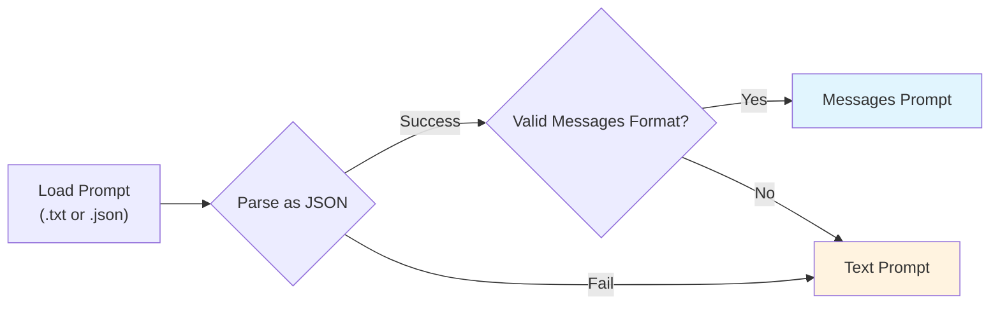

import VideoDisplayer from "@site/src/components/VideoDisplayer";
import Tabs from "@theme/Tabs";
import TabItem from "@theme/TabItem";
import { Timeline, TimelineItem } from "@site/src/components/Timeline";

You can load existing prompts locally from `.txt` or `.json` files, or pull them from [Confident AI](https://www.confident-ai.com). When loading prompts locally, `deepeval` automatically attempts to parse the prompt as a list of messages, regardless of the file extension. If parsing succeeds, then the prompt is a messages prompt. If parsing fails, the entire file content is treated as a text prompt.



## Loading Prompts

<Tabs>

<TabItem value="from-json" label="From JSON">

Use the `load` method to load the prompt from your `.json` file.

```python title="main.py" showLineNumbers={true}
from deepeval.prompt import Prompt

prompt = Prompt(alias="First Prompt")
prompt.load(file_path="example.json")
```

<details>
  <summary>Click to see <code>example.json</code></summary>

```json title="example.json"
{
  "messages": [
    {
      "role": "system",
      "content": "You are a helpful assistant."
    }
  ]
}
```

</details>

</TabItem>

<TabItem value="from-txt" label="From TXT">

Use the `load` method to load the prompt from your `.txt` file.

```python title="main.py" showLineNumbers={true}
from deepeval.prompt import Prompt

prompt = Prompt(alias="First Prompt")
prompt.load(file_path="example.txt")
```

<details>
  <summary>Click to see <code>example.txt</code></summary>

```txt title="example.txt"
You are a helpful assistant.
```

</details>

</TabItem>

<TabItem value="confident-ai" label="Confident AI">

You can pull your prompts from Confident AI (deepeval cloud) in 2 lines of code.

```python title="main.py" showLineNumbers={true}
from deepeval.prompt import Prompt

prompt = Prompt(alias="First Prompt")
prompt.pull(version="00.00.01")
```

</TabItem>

</Tabs>

:::note
`deepeval` allows you to manage prompts locally and load them from `.txt` or `.json` files. If you're looking for a centralized prompt management, non-technical domain experts can **create, edit, version, and pull** prompts on [Confident AI](https://www.confident-ai.com).
:::

### Model Settings

You can also associate model settings with a prompt. These settings will also be logged when the prompt is logged during evaluation.

```python title="main.py" showLineNumbers={true}
...

prompt.update(
    model="gpt-3.5-turbo",
    max_tokens=100,
    temperature=0.7
)
```

There are **NINE** model settings you can associate with a prompt:

- `model`: The string specifying the model to use for generation.
- `temperature`: A float between 0.0 and 2.0 specifying the randomness of the generated response.
- `top_p`: A float between 0.0 and 1.0 specifying the nucleus sampling parameter.
- `frequency_penalty`: A float between -2.0 and 2.0 specifying the frequency penalty.
- `presence_penalty`: A float between -2.0 and 2.0 specifying the presence penalty.
- `max_tokens`: An integer specifying the maximum number of tokens to generate.
- `verbosity`: A `Verbosity` enum specifying the response detail level.
- `reasoning_effort`: An `ReasoningEffort` enum specifying the thinking depth for reasoning models.
- `stop_sequences`: A list of strings specifying custom stop tokens.

### Output Settings

In addition to model settings, you can also associate output settings with a prompt.

```python title="main.py" showLineNumbers={true}
from deepeval.prompt import OutputType
from pydantic import BaseModel
...

class Output(BaseModel):
    name: str
    age: int
    city: str

prompt.update(output_type=OutputType.JSON, output_schema=Output)
```

There are **TWO** output settings you can associate with a prompt:

- `output_type`: The string specifying the model to use for generation.
- `output_schema`: The schema of type `BaseModel` of the output, if `output_type` is `OutputType.SCHEMA`.

## Logging Prompts in End-to-End Evals

To log a prompt when running end-to-end evals, simply pass the `Prompt` object to the `prompt` parameter or alternatively supply it in the `hyperparameters` dictionary for any key.

:::caution
Make sure the prompt is loaded or pulled before passing it to the `evaluate` function. Otherwise, the prompt will not be logged.
:::

<Tabs>
<TabItem value="prompt" label="Prompt">

Simply supply the `Prompt` object to the `prompt` parameter to associate it with the test run.

```python title="main.py" showLineNumbers={true}
from deepeval import evaluate
from deepeval.prompt import Prompt

prompt = Prompt(alias="First Prompt")
prompt.load(file_path="example.json")

evaluate(..., prompt=prompt)
```

</TabItem>
<TabItem value="hyperparameters" label="Hyperparameters">

Supplying the `prompt` in `hyperparameters` allows you to log any additional information associated with a test run, in addition to the prompt.

```python title="main.py" showLineNumbers={true}
from deepeval import evaluate
from deepeval.prompt import Prompt

prompt = Prompt(alias="First Prompt")
prompt.load(file_path="example.json")

evaluate(..., hyperparameters={"prompt": prompt})
```

</TabItem>
</Tabs>

## Logging Prompts in Component-level Evals

To log a prompt when running component-level evals, you can use the `update_llm_span` function to update the llm span with the prompt as you're setting up your LLM app.

```python title="main.py" showLineNumbers={true} {17,25}
from typing import List
from openai import OpenAI

from deepeval.tracing import observe, update_current_span, update_llm_span
from deepeval.test_case import LLMTestCase
from deepeval.metrics import AnswerRelevancyMetric
from deepeval.prompt import Prompt

prompt = Prompt(alias="First Prompt")

def your_llm_app(input: str):
    def retriever(input: str):
        return ["Hardcoded", "text", "chunks", "from", "vectordb"]

    @observe(type="llm", metrics=[AnswerRelevancyMetric()])
    def generator(input: str, retrieved_chunks: List[str]):
        system_message = prompt.load(file_path="example.json")
        res = OpenAI().chat.completions.create(
            model="gpt-4o",
            messages=system_message + [{"role": "user", "content": "\n\n".join(retrieved_chunks) + "\n\nQuestion: " + input}]
        ).choices[0].message.content

        # Create test case at runtime
        update_current_span(test_case=LLMTestCase(input=input, actual_output=res))
        update_llm_span(prompt=prompt)

        return res

    return generator(input, retriever(input))
```

Altneratively, you can also pass the prompt to the `evals_iterator` when running component-level evals.

<Tabs>
<TabItem value="prompt" label="Prompt">

```python title="main.py" showLineNumbers={true} {17,25}
from deepeval.dataset import EvaluationDataset
...

for golden in dataset.evals_iterator(prompt=prompt):
your_llm_app(golden.input)
```

</TabItem>
<TabItem value="hyperparameters" label="Hyperparameters">

```python title="main.py" showLineNumbers={true} {17,25}
from deepeval.dataset import EvaluationDataset
...

for golden in dataset.evals_iterator(hyperparameters={"prompt": prompt}):
your_llm_app(golden.input)
```

</TabItem>
</Tabs>
