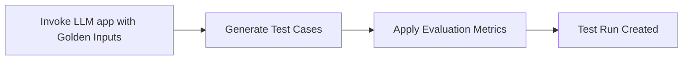
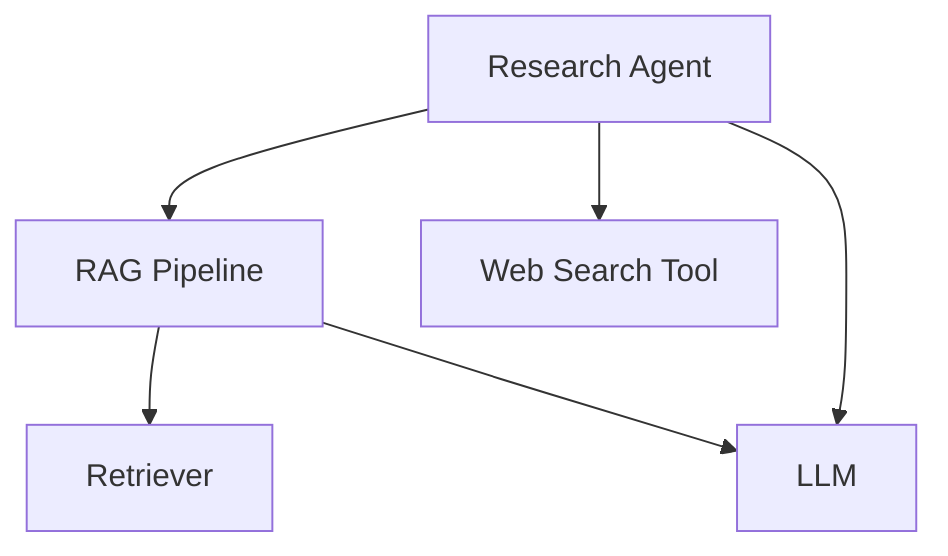

## Quick Summary

Running an LLM evaluation creates a **test run** — a collection of test cases that benchmarks your LLM application at a specific point in time. Typically, you loop through a list of `Golden`s, invoke your LLM app with each golden’s `input`, and generate a set of test cases ready for evaluation. Once the evaluation metrics have been applied to your test cases, you get a completed test run.

<div style={{ textAlign: "center", margin: "2rem 0" }}>



</div>

:::note
If you're logged into Confident AI, you'll also receive a fully sharable [LLM testing report](https://documentation.confident-ai.com/llm-evaluation/testing-reports) on the cloud.
:::

There are **FOUR** ways you can run LLM-evals in `deepeval`:

- Using `deepeval test run` in CI/CD Pipelines:

  - With Tracing
  - Without Tracing

- Using the `evaluate()` function:

  - With Tracing
  - Without Tracing

For simple LLM applications like basic RAG pipelines with "flat" architectures, tracing might be an overkill. However, if your application already has nested components or a structure that a simple `LLMTestCase` can't easily handle, we recommend setting up tracing in `deepeval` to **apply different metrics to different components in your LLM application.**


Setting up tracing lets you evaluate different parts of your app without needing to rewrite your codebase or manually pass intermediate variables just to create `LLMTestCase`s, and it solves these common issues you may have already encountered:

- **Manual code changes:** You often need to expose or modify internal variables across many layers just to capture outputs for evaluation.

- **Limited visibility:** It's hard to measure individual components (e.g., retrieval, re-ranking, reasoning) without tightly coupling evaluation logic into your code, and you might end up indexing evaluation results by the name of the component you wish to unit-test.

:::tip
Tracing in `deepeval` also does not affect production code, unless you wish to also run online evaluations in real-time and monitor your LLM app on Confident AI.
:::

## Setup Tracing (highly recommended)

`deepeval` offers an `@observe` decorator for you to apply metrics at any point in your LLM app to evaluate any [LLM interaction](/docs/evaluation-test-cases#what-is-an-llm-interaction), no matter how complex they may be, and we recommend everyone to do it. Tracing in `deepeval` has these benefits:

- **Apply metrics flexibly across components**: Tracing lets you attach `LLMTestCase`s at any level—whether system-wide or deep inside a nested flow—so you can run targeted metrics on specific components without restructuring your code.

- **Does not affect production code**: If you're worried that tracing will affect your LLM calls in productioin, it won't. This is because you can simply disable all `@observe` functionality in `deepeval`.

- **Evaluate complex systems easily**: Modern LLM apps span retrieval, tool use, and orchestration across different parts of your system. Tracing captures outputs from anywhere in your code without manual wiring.

- **Quick and seamless integration**:

  - No major code changes required
  - No new concepts to learn
  - Setup takes about 3 minutes

Creating an `LLMTestCase` for a nested component through tracing is as simple as using the `@observe` decorator:

```python showLineNumbers {5,10}
from deepeval.metrics import AnswerRelevancyMetric
from deepeval.test_case import LLMTestCase
from deepeval.tracing import observe, update_current_span_test_case

@observe(metrics=[AnswerRelevancyMetric()])
def complete(query: str):
    response = openai.ChatCompletion.create(model="gpt-4o", messages=[{"role": "user", "content": query}]).choices[0].message["content"]

    update_current_span_test_case(
        test_case=LLMTestCase(input=query, output=response)
    )
    return response
```

:::info
Each metric in `metrics` is evaluated using exactly the same algorithm, require the same `LLMTestCase` parameters, and with the same configurations, as you would expect when running evaluations without tracing.
:::

There are two terminologies you need to know before setting up tracing:

- **Trace:** The overall execution flow of your LLM application
- **Span:** Individual components or units of work within your application (e.g., LLM calls, tool executions, retrievals)

A span can contain many child spans, forming a tree structure—just like how different components of your LLM application interact. As you'll see in the next section, you apply metrics at the span level to evaluate specific components, because each span represents a component of your application.

### Using the `@observe` Decorator

The `@observe` decorator creates spans, and a call to your LLM application decorated by the `@observe` decorator creates a trace with many spans. This is how you would use `@observe`:

```python showLineNumbers {5}
from deepeval.test_case import LLMTestCase
from deepeval.metrics import AnswerRelevancyMetric
from deepeval.tracing import observe, update_current_span_test_case

@observe(metrics=[AnswerRelevancyMetric()])
def complete(query: str):
  response = openai.ChatCompletion.create(model="gpt-4o", messages=[{"role": "user", "content": query}]).choices[0].message["content"]

  update_current_span_test_case(
    test_case=LLMTestCase(input=query, output=response)
  )
  return response
```

There are **ZERO** mandatory and **THREE** optional parameters when using the `@observe` decorator:

- [Optional] `type`: The type of span. Anything other than `"llm"`, `"retriever"`, `"tool"`, and `"agent"` is a custom span type.
- [Optional] `name`: A string specifying how this custom span is displayed on Confident AI. Defaulted to the name of the decorated function.
- [Optional] `metrics`: A list of strings specifying the names of the `BaseMetric` you wish to run upon tracing in `deepeval`. Defaulted to `None`.

Although the `metrics` parameter is optional, to run an evaluation you **MUST**:

- Supply a list of `metrics`
- Call `update_current_span_test_case` to create an `LLMTestCase` to evaluate the LLM interaction in the current span

If you simply decorate your LLM application with `@observe` and don't supply any arguments, nothing will happen at all. The `metrics` parameter is optional because some users might want to use tracing only for the [debugging UI on Confident AI](https://documentation.confident-ai.com/llm-observability/llm-tracing), and not necessarily run evaluations on individual components.

:::note

For simplicity, we always recommend **custom spans** unless needed otherwise, since `metrics` only care about the scope of the span, and supplying a specified `type` is most **useful only when using Confident AI**. To summarize:

- Specifying a span `span` (like `"llm"`) allows you to supply additional parameters in the `@observe` signature (e.g., the `model` used).
- This information becomes extremely useful for analysis and visualization if you're using `deepeval` together with **Confident AI** (highly recommended).
- Otherwise, for local evaluation purposes, span `type` makes **no difference** — evaluation still works the same way.

To learn more about the different spans `type`s, or to run LLM evaluations with tracing with an UI for visualization and debugging, visitng the [official Confident AI docs on LLM tracing.](https://documentation.confident-ai.com/llm-observability/llm-tracing)

:::

### Full Example

In this example, going to evaluate the `"RAG Pipeline"` component in our `"Research Agent"` using the `ContextualRelevancyMetric` by setting up tracing in `deepeval` with the `@observe` decorator:

<div style={{textAlign: 'center', margin: "2rem 0"}}>



</div>

:::note
This is the same example we used in the [test cases section](/docs/evaluation-test-cases#what-is-an-llm-interaction)
:::

Assuming the code implementation of this LLM agent, the codeblock below shows it only took an additional **SEVEN LINES OF CODE** to setup tracing:

```python title="tracing_example.py" showLineNumbers {25-27,34-36,40}
from typing import List

from deepeval.test_case import LLMTestCase
from deepeval.tracing import (
    observe,
    update_current_span_test_case,
    ContextualRelevancyMetric,
)

def web_search(query: str) -> str:
    # <--Include implementation to search web here-->
    return "Latest search results for: " + query


def retrieve_documents(query: str) -> List[str]:
    # <--Include implementation to fetch from vector database here-->
    return ["Document 1: This is relevant information about the query."]


def generate_response(input: str) -> str:
    # <--Include format prompts and call your LLM provider here-->
    return "Generated response based on the prompt: " + input


@observe(
    type="custom", name="RAG Pipeline", metrics=[ContextualRelevancyMetric()]
)
def rag_pipeline(query: str) -> str:
    # Calls retriever and llm
    docs = retrieve_documents(query)
    context = "\n".join(docs)
    response = generate_response(f"Context: {context}\nQuery: {query}")

    update_current_span_test_case(
        test_case=LLMTestCase(input=query, actual_output=response, retrieval_context=docs)
    )
    return response


@observe(type="agent")
def research_agent(query: str) -> str:
    # Calls RAG pipeline
    initial_response = rag_pipeline(query)

    # Use web search tool on the results
    search_results = web_search(initial_response)

    # Generate final response incorporating both RAG and search results
    final_response = generate_response(
        f"Initial response: {initial_response}\n"
        f"Additional search results: {search_results}\n"
        f"Query: {query}"
    )
    return final_response
```

Then, simply use the `evaluate()` function (or `assert_test()` with `deepeval test run`):

```python
from deepeval.dataset import Golden
from deepeval import evaluate
...

# Create golden instead of test case
golden = Golden(input="What's the weather like in SF?")

# Run evaluation
evaluate(goldens[golden], traceable_callback=research_agent)
```

Notice that without tracing, creating evaluation-ready `LLMTestCase`s is complicated because you have to bubble the input and returned output values for your `"RAG Pipeline"` component up to the surface for evaluation.

## Using `deepeval test run` In CI/CD Pipelines

`deepeval` allows you to run evaluations as if you're using Pytest via our Pytest integration. Instead of running the usual `pytest test_file.py` command, you would instead use `deepeval test run test_file.py`, which creates a **test run** - a collection of evaluated test cases.

```bash
deepeval test run test_llm.py
```

This command adds a range of functionalities on top of Pytest for unit-testing LLMs, which is enabled by 8+ optional flags. You can learn about all the different flags `deepeval test run` offers in [more detail below](/docs/evaluation-running-llm-evals#flags-for-deepeval-test-run). Users typically include `deepeval test run` as a command in their `.yaml` files for pre-deployment checks in CI/CD pipelines ([example here](https://documentation.confident-ai.com/llm-evaluation/unit-testing-in-cicd)).

### With Tracing

If you haven't already, [setup tracing using the guide above](/docs/evaluation-running-llm-evals#setup-tracing-highly-recommended), and use the `assert_test()` function inside a `test_file.py` file:

```python title="test_llm_app.py"
from deepeval.dataset import Golden
from deepeval import assert_test
...

goldens = [Golden(input="...")]

@pytest.mark.parametrize(
    "golden",
    goldens,
)
def test_llm_app(golden: Golden):
    # Replace 'traceable_callback' with your LLM app
    assert_test(golden=golden, traceable_callback=research_agent)
```

Two things to note:

- `@pytest.mark.parametrize` allows you to loop through a list of objects in Pytest.
- There is no declaration of `metrics` because those are defined at the span level in the `metrics` parameter.

Finally, don't forget to run the test file in the CLI:

```bash
deepeval test run test_llm_app.py
```

There are **TWO** mandatory and **ONE** optional parameter when calling the `assert_test()` function **WITH** tracing:

- `golden`: the `Golden` that you wish to invoke your `traceable_callback` with.
- `traceable_callback`: a function callback that is your `@observe` decorated LLM application. There must be **AT LEAST ONE** metric within one of the `metrics` in your `@observe` decorated LLM application.
- [Optional] `run_async`: a boolean which when set to `True`, enables concurrent evaluation of all metrics in `@observe`. Defaulted to `True`.

When `assert_test()` calls, what happens is your `traceable_callback` is first called using the provided `golden` to invoke your LLM application to create a list of test cases within your `@observe` decorated spans. These test cases are then evaluated using the respective `metrics` as you would noramlly expect. An execution of `assert_test()` in this case passes only if all `@observe` decorated `metrics` passes.

### Without Tracing

If your LLM application has a simplier architecture, you can use `deepeval test run` without tracing:

```python test_llm_app.py
from deepeval.dataset import Golden
from deepeval.test_case import LLMTestCase
from deepeval import assert_test
...

goldens = [Golden(input="...")]

@pytest.mark.parametrize(
    "golden",
    goldens,
)
def test_llm_app(golden: Golden):
    # Replace 'research_agent' with your LLM app
    test_case = LLMTestCase(input=golden.input, actual_output=research_agent(golden.input))
    assert_test(test_case=test_case, metrics=[AnswerRelevancyMetric()])
```

```bash
deepeval test run test_llm_app.py
```

There are **TWO** mandatory and **ONE** optional parameter when calling the `assert_test()` function **WITHOUT** tracing:

- `test_case`: an `LLMTestCase`.
- `metrics`: a list of metrics of type `BaseMetric`.
- [Optional] `run_async`: a boolean which when set to `True`, enables concurrent evaluation of all metrics in `@observe`. Defaulted to `True`.

:::tip

If you're logged into Confident AI, you'll also receive a fully sharable [LLM testing report](https://documentation.confident-ai.com/llm-evaluation/testing-reports) on the cloud. Run this in the CLI:

```bash
deepeval login
```

:::

### Flags for `deepeval test run`:

#### Parallelization

Evaluate each test case in parallel by providing a number to the `-n` flag to specify how many processes to use.

```
deepeval test run test_example.py -n 4
```

#### Cache

Provide the `-c` flag (with no arguments) to read from the local `deepeval` cache instead of re-evaluating test cases on the same metrics.

```
deepeval test run test_example.py -c
```

:::info
This is extremely useful if you're running large amounts of test cases. For example, lets say you're running 1000 test cases using `deepeval test run`, but you encounter an error on the 999th test case. The cache functionality would allow you to skip all the previously evaluated 999 test cases, and just evaluate the remaining one.
:::

#### Ignore Errors

The `-i` flag (with no arguments) allows you to ignore errors for metrics executions during a test run. An example of where this is helpful is if you're using a custom LLM and often find it generating invalid JSONs that will stop the execution of the entire test run.

```
deepeval test run test_example.py -i
```

:::tip
You can combine differnet flags, such as the `-i`, `-c`, and `-n` flag to execute any uncached test cases in parallel while ignoring any errors along the way:

```python
deepeval test run test_example.py -i -c -n 2
```

:::

#### Verbose Mode

The `-v` flag (with no arguments) allows you to turn on [`verbose_mode` for all metrics](/docs/metrics-introduction#debugging-a-metric) ran using `deepeval test run`. Not supplying the `-v` flag will default each metric's `verbose_mode` to its value at instantiation.

```python
deepeval test run test_example.py -v
```

:::note
When a metric's `verbose_mode` is `True`, it prints the intermediate steps used to calculate said metric to the console during evaluation.
:::

#### Skip Test Cases

The `-s` flag (with no arguments) allows you to skip metric executions where the test case has missing//insufficient parameters (such as `retrieval_context`) that is required for evaluation. An example of where this is helpful is if you're using a metric such as the `ContextualPrecisionMetric` but don't want to apply it when the `retrieval_context` is `None`.

```
deepeval test run test_example.py -s
```

#### Identifier

The `-id` flag followed by a string allows you to name test runs and better identify them on [Confident AI](https://confident-ai.com). An example of where this is helpful is if you're running automated deployment pipelines, have deployment IDs, or just want a way to identify which test run is which for comparison purposes.

```
deepeval test run test_example.py -id "My Latest Test Run"
```

#### Display Mode

The `-d` flag followed by a string of "all", "passing", or "failing" allows you to display only certain test cases in the terminal. For example, you can display "failing" only if you only care about the failing test cases.

```
deepeval test run test_example.py -d "failing"
```

#### Repeats

Repeat each test case by providing a number to the `-r` flag to specify how many times to rerun each test case.

```
deepeval test run test_example.py -r 2
```

#### Hooks

`deepeval`'s Pytest integration allosw you to run custom code at the end of each evaluation via the `@deepeval.on_test_run_end` decorator:

```python title="test_example.py"
...

@deepeval.on_test_run_end
def function_to_be_called_after_test_run():
    print("Test finished!")
```

## Using The `evaluate()` Function

`deepeval` also offers an `evaluate()` function as an alternative to `deepeval test run` but without the need for Pytest or the CLI.

### With Tracing

If you haven't already, learn how to [setup tracing](/docs/evaluation-running-llm-evals#setup-tracing-highly-recommended) to understand this example:

```python title="main.py"
from deepeval.dataset import Golden
from deepeval.test_case import LLMTestCase
from deepeval.metrics import AnswerRelevancyMetric
from deepeval import evaluate
...

# Goldens from your dataset
goldens = [Golden(input="...")]

# Evaluate with `traceable_callback`
evaluate(goldens=goldens, traceable_callback=research_agent)
```

There are **TWO** mandatory and **FIVE** optional parameters when calling the `evaluate()` function:

- `golden`: a list of `Golden`s that you wish to invoke your `traceable_callback` with.
- `traceable_callback`: a function callback that is your `@observe` decorated LLM application. There must be **AT LEAST ONE** metric within one of the `metrics` in your `@observe` decorated LLM application.
- [Optional] `identifier`: a string that allows you to better identify your test run on Confident AI.
- [Optional] `async_config`: an instance of type `AsyncConfig` that allows you to [customize the degree concurrency](/docs/evaluation-running-llm-evals#async-configs) during evaluation. Defaulted to the default `AsyncConfig` values.
- [Optional] `display_config`:an instance of type `DisplayConfig` that allows you to [customize what is displayed](/docs/evaluation-running-llm-evals#display-configs) to the console during evaluation. Defaulted to the default `DisplayConfig` values.
- [Optional] `error_config`: an instance of type `ErrorConfig` that allows you to [customize how to handle errors](/docs/evaluation-running-llm-evals#error-configs) during evaluation. Defaulted to the default `ErrorConfig` values.
- [Optional] `cache_config`: an instance of type `CacheConfig` that allows you to [customize the caching behavior](/docs/evaluation-running-llm-evals#cache-configs) during evaluation. Defaulted to the default `CacheConfig` values.

This is exactly the same as `assert_test()` in `deepeval test run`, but in a difference interface. A test case passes only if all `metrics` within each `@observe` decorated function passes.

### Without Tracing

```python title="main.py"
from deepeval.dataset import Golden
from deepeval.test_case import LLMTestCase
from deepeval.metrics import AnswerRelevancyMetric
from deepeval import evaluate

goldens = [Golden(input="...")]

# Create test cases from goldens
test_case = []
for golden in goldens:
    test_case = LLMTestCase(
        input=golden.input,
        actual_output=research_agent(input),
    )
    test_cases.append(test_case)

# Evaluate without tracing
evaluate(test_cases=test_cases, metrics=[AnswerRelevancyMetric()])
```

There are **TWO** mandatory and **SIX** optional parameters when calling the `evaluate()` function:

- `test_cases`: a list of `LLMTestCase`s **OR** `ConversationalTestCase`s, or an `EvaluationDataset`. You cannot evaluate `LLMTestCase`/`MLLMTestCase`s and `ConversationalTestCase`s in the same test run.
- `metrics`: a list of metrics of type `BaseMetric`.
- [Optional] `hyperparameters`: a dict of type `dict[str, Union[str, int, float]]`. You can log any arbitrary hyperparameter associated with this test run to pick the best hyperparameters for your LLM application on Confident AI.
- [Optional] `identifier`: a string that allows you to better identify your test run on Confident AI.
- [Optional] `async_config`: an instance of type `AsyncConfig` that allows you to [customize the degree concurrency](/docs/evaluation-running-llm-evals#async-configs) during evaluation. Defaulted to the default `AsyncConfig` values.
- [Optional] `display_config`:an instance of type `DisplayConfig` that allows you to [customize what is displayed](/docs/evaluation-running-llm-evals#display-configs) to the console during evaluation. Defaulted to the default `DisplayConfig` values.
- [Optional] `error_config`: an instance of type `ErrorConfig` that allows you to [customize how to handle errors](/docs/evaluation-running-llm-evals#error-configs) during evaluation. Defaulted to the default `ErrorConfig` values.
- [Optional] `cache_config`: an instance of type `CacheConfig` that allows you to [customize the caching behavior](/docs/evaluation-running-llm-evals#cache-configs) during evaluation. Defaulted to the default `CacheConfig` values.

This is exactly the same as `assert_test()` in `deepeval test run`, but in a difference interface. A test case passes only if all `metrics` for each test case passes.

### Configs for `evaluate()`

Unlike `deepeval test run` where flags are used, behaviors for the `evaluate()` function is controlled by "configs" (short for configuration) because there simply is too many of them to be included as individual parameters.

#### Async Configs

The `AsyncConfig` controlls how concurrently `metrics`, `traceable_callback`, and `test_cases` will be evaluated during `evaluate()`.

```python
from deepeval.evaluate import AsyncConfig
from deepeval import evaluate

evaluate(async_config=AsyncConfig(), ...)
```

There are **THREE** optional parameters when creating an `AsyncConfig`:

- [Optional] `run_async`: a boolean which when set to `True`, enables concurrent evaluation of test cases **AND** metrics. Defaulted to `True`.
- [Optional] `throttle_value`: an integer that determines how long (in seconds) to throttle the evaluation of each test case. You can increase this value if your evaluation model is running into rate limit errors. Defaulted to 0.
- [Optional] `max_concurrent`: an integer that determines the maximum number of test cases that can be ran in parallel at any point in time. You can decrease this value if your evaluation model is running into rate limit errors. Defaulted to `20`.

The `throttle_value` and `max_concurrent` parameter is only used when `run_async` is set to `True`. A combination of a `throttle_value` and `max_concurrent` is the best way to handle rate limiting errors, either in your LLM judge or LLM application, when running evaluations.

#### Display Configs

The `DisplayConfig` controlls how results and intermediate execution steps are displayed during `evaluate()`.

```python
from deepeval.evaluate import DisplayConfig
from deepeval import evaluate

evaluate(display_config=DisplayConfig(), ...)
```

There are **FOUR** optional parameters when creating an `DisplayConfig`:

- [Optional] `verbose_mode`: a optional boolean which when **IS NOT** `None`, overrides each [metric's `verbose_mode` value](/docs/metrics-introduction#debugging-a-metric). Defaulted to `None`.
- [Optional] `display`: a str of either `"all"`, `"failing"` or `"passing"`, which allows you to selectively decide which type of test cases to display as the final result. Defaulted to `"all"`.
- [Optional] `show_indicator`: a boolean which when set to `True`, shows the evaluation progress indicator for each individual metric. Defaulted to `True`.
- [Optional] `print_results`: a boolean which when set to `True`, prints the result of each evaluation. Defaulted to `True`.

#### Error Configs

The `ErrorConfig` controlls how error is handled in `evaluate()`.

```python
from deepeval.evaluate import ErrorConfig
from deepeval import evaluate

evaluate(error_config=ErrorConfig(), ...)
```

There are **TWO** optional parameters when creating an `ErrorConfig`:

- [Optional] `skip_on_missing_params`: a boolean which when set to `True`, skips all metric executions for test cases with missing parameters. Defaulted to `False`.
- [Optional] `ignore_errors`: a boolean which when set to `True`, ignores all exceptions raised during metrics execution for each test case. Defaulted to `False`.

If both `skip_on_missing_params` and `ignore_errors` are set to `True`, `skip_on_missing_params` takes precedence. This means that if a metric is missing required test case parameters, it will be skipped (and the result will be missing) rather than appearing as an ignored error in the final test run.

#### Cache Configs

The `CacheConfig` controlls the caching behavior of `evaluate()`.

```python
from deepeval.evaluate import CacheConfig
from deepeval import evaluate

evaluate(cache_config=CacheConfig(), ...)
```

There are **TWO** optional parameters when creating an `CacheConfig`:

- [Optional] `use_cache`: a boolean which when set to `True`, uses cached test run results instead. Defaulted to `False`.
- [Optional] `write_cache`: a boolean which when set to `True`, uses writes test run results to **DISK**. Defaulted to `True`.

The `write_cache` parameter writes to disk and so you should disable it if that is causing any errors in your enviornment.
