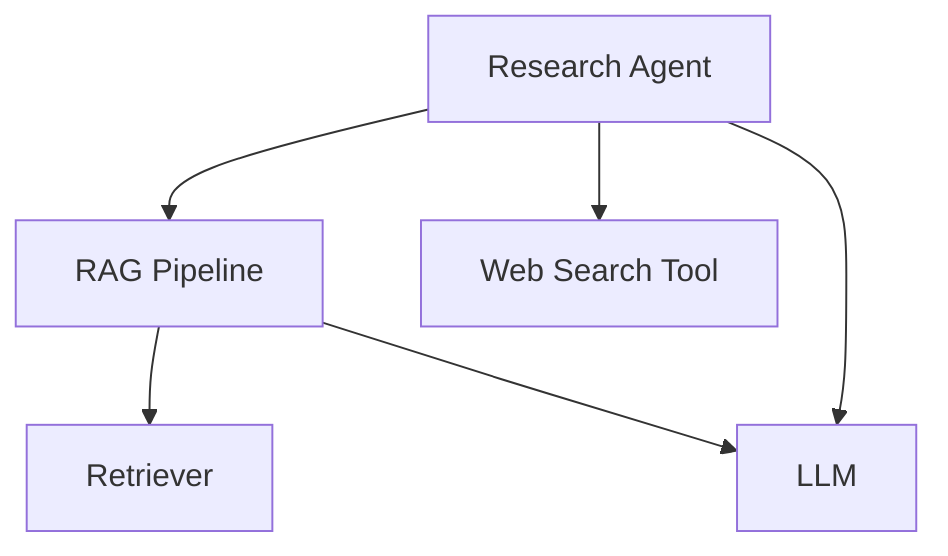
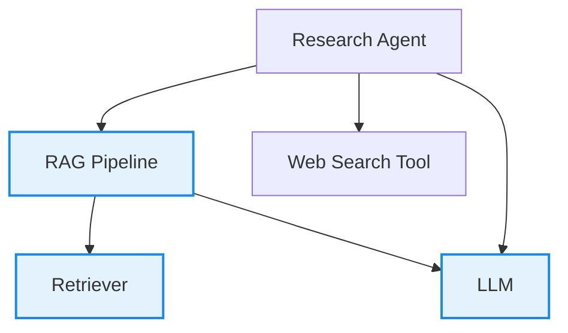
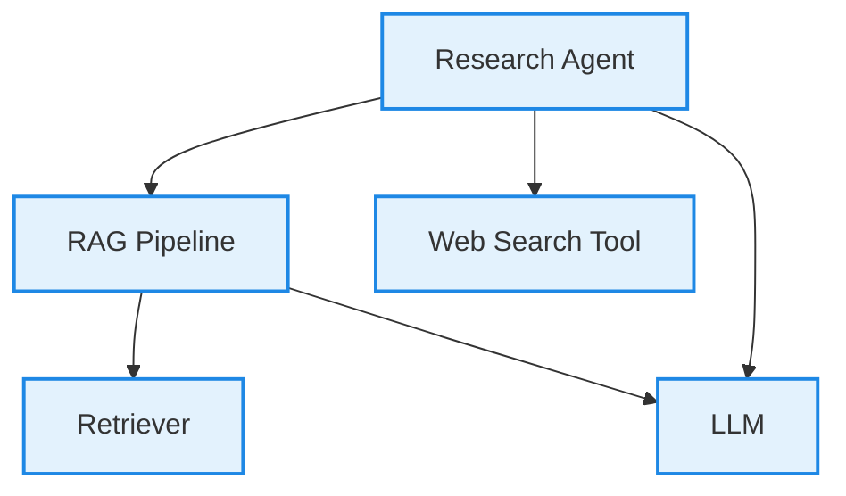

<head>
  <link
    rel="canonical"
    href="https://deepeval.com/docs/evaluation-test-cases"
  />
</head>

## Quick Summary

A **single-turn test case** is a blueprint provided by `deepeval` to unit test LLM outputs, and **represents a single, atomic unit of interaction** with your LLM app. There are two types of single-turn test cases in `deepeval`: `LLMTestCase` and `MLLMTestCase`.

:::caution
Throughout this documentation, you should assume the term 'test case' refers to an `LLMTestCase` instead of `MLLMImage` or `ConversationalTestCase`.
:::

An `LLMTestCase` is the most prominent type of test case in `deepeval`. It has **NINE** parameters:

- `input`
- `actual_output`
- [Optional] `expected_output`
- [Optional] `context`
- [Optional] `retrieval_context`
- [Optional] `tools_called`
- [Optional] `expected_tools`
- [Optional] `token_cost`
- [Optional] `completion_time`

Here's an example implementation of an `LLMTestCase`:

```python title="main.py"
from deepeval.test_case import LLMTestCase, ToolCall

test_case = LLMTestCase(
    input="What if these shoes don't fit?",
    expected_output="You're eligible for a 30 day refund at no extra cost.",
    actual_output="We offer a 30-day full refund at no extra cost.",
    context=["All customers are eligible for a 30 day full refund at no extra cost."],
    retrieval_context=["Only shoes can be refunded."],
    tools_called=[ToolCall(name="WebSearch")]
)
```

:::info
Since `deepeval` is an LLM evaluation framework, the ** `input` and `actual_output` are always mandatory.** However, this does not mean they are necessarily used for evaluation, and you can also add additional parameters such as the `tools_called` for each `LLMTestCase`.

<video width="100%" autoPlay loop muted playsInlines>
  <source
    src="https://deepeval-docs.s3.us-east-1.amazonaws.com/test-case-tools-called.mp4"
    type="video/mp4"
  />
</video>

To get your own sharable testing report with `deepeval`, [sign up to Confident AI](https://app.confident-ai.com), or run `deepeval login` in the CLI:

```bash
deepeval login
```

:::

## What Is An LLM "Interaction"?

An **LLM interaction** is any **discrete exchange** of information between **components of your LLM system** — from a full user request to a single internal step. The scope of interaction is arbitrary and is entirely up to you.

:::note
Since an `LLMTestCase` represents a single, atomic unit of interaction in your LLM app, it is important to understand what this means.
:::

Let’s take this LLM system as an example:

<div style={{textAlign: 'center', margin: "2rem 0"}}>



</div>

There are different ways you scope an interaction:

- **Agent-Level:** The entire process initiated by the agent, including the RAG pipeline and web search tool usage

- **RAG Pipeline:** Just the RAG flow — retriever + LLM

  - **Retriever:** Only test whether relevant documents are being retrieved
  - **LLM:** Focus purely on how well the LLM generates text from the input/context

An interaction is where you want to define your `LLMTestCase`. For example, when using RAG-specific metrics like `AnswerRelevancyMetric`, `FaithfulnessMetric`, or `ContextualRelevancyMetric`, the interaction is best scoped at the RAG pipeline level.

In this case:

- `input` should be the user question or text to embed

- `retrieval_context` should be the retrieved documents from the retriever

- `actual_output` should be the final response generated by the LLM

<div style={{textAlign: 'center', margin: "2rem 0"}}>



</div>

If you would want to evaluate using the `ToolCorrectnessMetric` however, you'll need to create an `LLMTestCase` at the **Agent-Level**, and supply the `tools_called` parameter instead:

<div style={{textAlign: 'center', margin: "2rem 0"}}>



</div>

We'll go through the requirements for an `LLMTestCase` before showing how to create an `LLMTestCase` for an interaction.

:::tip
For users starting out, scoping the interaction as the overall LLM application will be the easiest way to run evals.
:::

## LLM Test Case

An `LLMTestCase` in `deepeval` can be used to unit test interactions within your LLM application (which can just be an LLM itself), which includes use cases such as RAG and LLM agents (for individual components, agents within agents, or the agent altogether). It contains the necessary information (`tools_called` for agents, `retrieval_context` for RAG, etc.) to evaluate your LLM application for a given `input`.


An `LLMTestCase` is used for both end-to-end and component-level evaluation:

- [End-to-end:](/docs/evaluation-end-to-end-llm-evals) An `LLMTestCase` represents the inputs and outputs of your "black-box" LLM application

- [Component-level:](/docs/evaluation-component-level-llm-evals) Many `LLMTestCase`s represents many interactions in different components

**Different metrics will require a different combination of `LLMTestCase` parameters, but they all require an `input` and `actual_output`** - regardless of whether they are used for evaluation for not. For example, you won't need `expected_output`, `context`, `tools_called`, and `expected_tools` if you're just measuring answer relevancy, but if you're evaluating hallucination you'll have to provide `context` in order for `deepeval` to know what the **ground truth** is.

With the exception of conversational metrics, which are metrics to evaluate conversations instead of individual LLM responses, you can use any LLM evaluation metric `deepeval` offers to evaluate an `LLMTestCase`.

:::note
You cannot use conversational metrics to evaluate an `LLMTestCase`. Conveniently, most metrics in `deepeval` are non-conversational.
:::

Keep reading to learn which parameters in an `LLMTestCase` are required to evaluate different aspects of an LLM applications - ranging from pure LLMs, RAG pipelines, and even LLM agents.

### Input

The `input` mimics a user interacting with your LLM application. The input is the direct input to your prompt template, and so **SHOULD NOT CONTAIN** your prompt template.

```python
from deepeval.test_case import LLMTestCase

test_case = LLMTestCase(
    input="Why did the chicken cross the road?",
    # Replace this with your actual LLM application
    actual_output="Quite frankly, I don't want to know..."
)
```

:::tip

Not all `input`s should include your prompt template, as this is determined by the metric you're using. Furthermore, the `input` should **NEVER** be a json version of the list of messages you are passing into your LLM.

If you're logged into Confident AI, you can associate hyperparameters such as prompt templates with each test run to easily figure out which prompt template gives the best `actual_output`s for a given `input`:

```bash
deepeval login
```

```python title="test_file.py"
import deepeval
from deepeval import assert_test
from deepeval.test_case import LLMTestCase
from deepeval.metrics import AnswerRelevancyMetric

def test_llm():
    test_case = LLMTestCase(input="...", actual_output="...")
    answer_relevancy_metric = AnswerRelevancyMetric()
    assert_test(test_case, [answer_relevancy_metric])

# You should aim to make these values dynamic
@deepeval.log_hyperparameters(model="gpt-4.1", prompt_template="...")
def hyperparameters():
    # You can also return an empty dict {} if there's no additional parameters to log
    return {
        "temperature": 1,
        "chunk size": 500
    }
```

```bash
deepeval test run test_file.py
```

:::

### Actual Output

The `actual_output` is simply what your LLM application returns for a given input. This is what your users are going to interact with. Typically, you would import your LLM application (or parts of it) into your test file, and invoke it at runtime to get the actual output.

```python
# A hypothetical LLM application example
import chatbot

input = "Why did the chicken cross the road?"

test_case = LLMTestCase(
    input=input,
    actual_output=chatbot.run(input)
)
```

:::note
You may also choose to evaluate with precomputed `actual_output`s, instead of generating `actual_output`s at evaluation time.
:::

### Expected Output

The `expected_output` is literally what you would want the ideal output to be. Note that this parameter is **optional** depending on the metric you want to evaluate.

The expected output doesn't have to exactly match the actual output in order for your test case to pass since `deepeval` uses a variety of methods to evaluate non-deterministic LLM outputs. We'll go into more details [in the metrics section.](/docs/metrics-introduction)

```python
# A hypothetical LLM application example
import chatbot

input = "Why did the chicken cross the road?"

test_case = LLMTestCase(
    input=input,
    actual_output=chatbot.run(input),
    expected_output="To get to the other side!"
)
```

### Context

The `context` is an **optional** parameter that represents additional data received by your LLM application as supplementary sources of golden truth. You can view it as the ideal segment of your knowledge base relevant to a specific input. Context allows your LLM to generate customized outputs that are outside the scope of the data it was trained on.

In RAG applications, contextual information is typically stored in your selected vector database, which is represented by `retrieval_context` in an `LLMTestCase` and is not to be confused with `context`. Conversely, for a fine-tuning use case, this data is usually found in training datasets used to fine-tune your model. Providing the appropriate contextual information when constructing your evaluation dataset is one of the most challenging part of evaluating LLMs, since data in your knowledge base can constantly be changing.

Unlike other parameters, a context accepts a list of strings.

```python
# A hypothetical LLM application example
import chatbot

input = "Why did the chicken cross the road?"

test_case = LLMTestCase(
    input=input,
    actual_output=chatbot.run(input),
    expected_output="To get to the other side!",
    context=["The chicken wanted to cross the road."]
)
```

:::note
Often times people confuse `expected_output` with `context` since due to their similar level of factual accuracy. However, while both are (or should be) factually correct, `expected_output` also takes aspects like tone and linguistic patterns into account, whereas context is strictly factual.
:::

### Retrieval Context

The `retrieval_context` is an **optional** parameter that represents your RAG pipeline's retrieval results at runtime. By providing `retrieval_context`, you can determine how well your retriever is performing using `context` as a benchmark.

```python
# A hypothetical LLM application example
import chatbot

input = "Why did the chicken cross the road?"

test_case = LLMTestCase(
    input=input,
    actual_output=chatbot.run(input),
    expected_output="To get to the other side!",
    context=["The chicken wanted to cross the road."],
    retrieval_context=["The chicken liked the other side of the road better"]
)
```

:::note
Remember, `context` is the ideal retrieval results for a given input and typically come from your evaluation dataset, whereas `retrieval_context` is your LLM application's actual retrieval results. So, while they might look similar at times, they are not the same.
:::

### Tools Called

The `tools_called` parameter is an **optional** parameter that represents the tools your LLM agent actually invoked during execution. By providing `tools_called`, you can evaluate how effectively your LLM agent utilized the tools available to it.

:::note
The `tools_called` parameter accepts a list of `ToolCall` objects.
:::

```python
class ToolCall(BaseModel):
    name: str
    description: Optional[str] = None
    reasoning: Optional[str] = None
    output: Optional[Any] = None
    input_parameters: Optional[Dict[str, Any]] = None
```

A `ToolCall` object accepts 1 mandatory and 4 optional parameters:

- `name`: a string representing the **name** of the tool.
- [Optional] `description`: a string describing the **tool's purpose**.
- [Optional] `reasoning`: A string explaining the **agent's reasoning** to use the tool.
- [Optional] `output`: The tool's **output**, which can be of any data type.
- [Optional] `input_parameters`: A dictionary with string keys representing the **input parameters** (and respective values) passed into the tool function.

```python
# A hypothetical LLM application example
import chatbot

test_case = LLMTestCase(
    input="Why did the chicken cross the road?",
    actual_output=chatbot.run(input),
    # Replace this with the tools that were actually used
    tools_called=[
        ToolCall(
            name="Calculator Tool",
            description="A tool that calculates mathematical equations or expressions.",
            input={"user_input": "2+3"},
            output=5
        ),
        ToolCall(
            name="WebSearch Tool",
            reasoning="Knowledge base does not detail why the chicken crossed the road.",
            input={"search_query": "Why did the chicken crossed the road?"},
            output="Because it wanted to, duh."
        )
    ]
)
```

:::info
`tools_called` and `expected_tools` are LLM test case parameters that are utilized only in **agentic evaluation metrics**. These parameters allow you to assess the [tool usage correctness](/docs/metrics-tool-correctness) of your LLM application and ensure that it meets the expected tool usage standards.
:::

### Expected Tools

The `expected_tools` parameter is an **optional** parameter that represents the tools that ideally should have been used to generate the output. By providing `expected_tools`, you can assess whether your LLM application used the tools you anticipated for optimal performance.

```python
# A hypothetical LLM application example
import chatbot

input = "Why did the chicken cross the road?"

test_case = LLMTestCase(
    input=input,
    actual_output=chatbot.run(input),
    # Replace this with the tools that were actually used
    tools_called=[
        ToolCall(
            name="Calculator Tool",
            description="A tool that calculates mathematical equations or expressions.",
            input={"user_input": "2+3"},
            output=5
        ),
        ToolCall(
            name="WebSearch Tool",
            reasoning="Knowledge base does not detail why the chicken crossed the road.",
            input={"search_query": "Why did the chicken crossed the road?"},
            output="Because it wanted to, duh."
        )
    ]
    expected_tools=[
        ToolCall(
            name="WebSearch Tool",
            reasoning="Knowledge base does not detail why the chicken crossed the road.",
            input={"search_query": "Why did the chicken crossed the road?"},
            output="Because it needed to escape from the hungry humans."
        )
    ]
)
```

### Token cost

The `token_cost` is an **optional** parameter and is of type float that allows you to log the cost of a particular LLM interaction for a particular `LLMTestCase`. No metrics use this parameter by default, and it is most useful for either:

1. Building custom metrics that relies on `token_cost`
2. Logging `token_cost` on Confident AI

```python
from deepeval.test_case import LLMTestCase

test_case = LLMTestCase(token_cost=1.32, ...)
```

### Completion Time

The `completion_time` is an **optional** parameter and is similar to the `token_cost` is of type float that allows you to log the time in **SECONDS** it took for a LLM interaction for a particular `LLMTestCase` to complete. No metrics use this parameter by default, and it is most useful for either:

1. Building custom metrics that relies on `completion_time`
2. Logging `completion_time` on Confident AI

```python
from deepeval.test_case import LLMTestCase

test_case = LLMTestCase(completion_time=7.53, ...)
```

## MLLM Test Case

An `MLLMTestCase` in deepeval is designed to unit test outputs from MLLM (Multimodal Large Language Model) applications. Unlike an `LLMTestCase`, which only handles textual parameters, an `MLLMTestCase` accepts both text and image inputs and outputs. This is particularly useful for evaluating tasks such as text-to-image generation or MLLM-driven image editing.

:::caution
You may only evaluate `MLLMTestCase`s using multimodal metrics such as `VIEScore`.
:::

```python
from deepeval.test_case import MLLMTestCase, MLLMImage

mllm_test_case = MLLMTestCase(
    # Replace this with your user input
    input=["Change the color of the shoes to blue.", MLLMImage(url="./shoes.png", local=True)]
    # Replace this with your actual MLLM application
    actual_output=["The original image of red shoes now shows the shoes in blue.", MLLMImage(url="https://shoe-images.com/edited-shoes", local=False)]
)
```

### Input

The `input` mimics a user interacting with your MLLM application. Like an `LLMTestCase` input, an `MLLMTestCase` input is the direct input to your prompt template, and so **SHOULD NOT CONTAIN** your prompt template.

```python
from deepeval.test_case import MLLMTestCase, MLLMImage

mllm_test_case = MLLMTestCase(
    input=["Change the color of the shoes to blue.", MLLMImage(url="./shoes.png", local=True)]
)
```

:::info
The `input` parameter accepts a list of strings and `MLLMImage`s, which is a class specific `deepeval`. The `MLLMImage` class accepts an image path and automatically sets the `local` attribute to `true` or `false` depending on whether the image is locally stored or hosted online. By default, `local` is set to `false`.

```python
from deepeval.test_case import MLLMImage

# Example of using the MLLMImage class
image_input = MLLMImage(image_path="path/to/image.jpg")

# image_input.local will automatically be set to `true` if the image is local
# and `false` if the image is hosted online.
```

:::

### Actual Output

The actual_output is simply what your MLLM application returns for a given input. Similarly, it also accepts a list of strings and `MLLMImage`s.

```python
from deepeval.test_case import MLLMTestCase, MLLMImage

mllm_test_case = MLLMTestCase(
    input=["Change the color of the shoes to blue.", MLLMImage(url="./shoes.png", local=True)],
    actual_output=["The original image of red shoes now shows the shoes in blue.", MLLMImage(url="https://shoe-images.com/edited-shoes", local=False)]
)
```

## Assert A Test Case

Before we begin going through the final sections, we highly recommend you to login to [Confident AI](https://confident-ai.com) (the platform powering deepeval) via the CLI. This way, you can keep track of all evaluation results generated each time you execute `deepeval test run`.

```
deepeval login
```

Similar to Pytest, `deepeval` allows you to assert any test case you create by calling the `assert_test` function by running `deepeval test run` via the CLI.

**A test case passes only if all metrics passes.** Depending on the metric, a combination of `input`, `actual_output`, `expected_output`, `context`, and `retrieval_context` is used to ascertain whether their criterion have been met.

```python title="test_assert_example.py"
# A hypothetical LLM application example
import chatbot
import deepeval
from deepeval import assert_test
from deepeval.metrics import HallucinationMetric
from deepeval.test_case import LLMTestCase

def test_assert_example():
    input = "Why did the chicken cross the road?"
    test_case = LLMTestCase(
        input=input,
        actual_output=chatbot.run(input),
        context=["The chicken wanted to cross the road."],
    )
    metric = HallucinationMetric(threshold=0.7)
    assert_test(test_case, metrics=[metric])


# Optionally log hyperparameters to pick the best hyperparameter for your LLM application
# using Confident AI. (run `deepeval login` in the CLI to login)
@deepeval.log_hyperparameters(model="gpt-4", prompt_template="...")
def hyperparameters():
    # Return a dict to log additional hyperparameters.
    # You can also return an empty dict {} if there's no additional parameters to log
    return {
        "temperature": 1,
        "chunk size": 500
    }
```

There are **TWO** mandatory and **ONE** optional parameter when calling the `assert_test()` function:

- `test_case`: an `LLMTestCase`
- `metrics`: a list of metrics of type `BaseMetric`
- [Optional] `run_async`: a boolean which when set to `True`, enables concurrent evaluation of all metrics. Defaulted to `True`.

You can find the full documentation on `deepeval test run`, for both [end-to-end](/docs/evaluation-end-to-end-llm-evals#use-deepeval-test-run-in-cicd-pipelines) and [component-level](/docs/evaluation-component-level-llm-evals#use-deepeval-test-run-in-cicd-pipelines) evaluation by clicking on their respective links.

:::info
The `run_async` parameter overrides the `async_mode` property of all metrics being evaluated. The `async_mode` property, as you'll learn later in the [metrics section](/docs/metrics-introduction), determines whether each metric can execute asynchronously.
:::

To execute the test cases, run `deepeval test run` via the CLI, which uses `deepeval`'s Pytest integration under the hood to execute these tests. You can also include an optional `-n` flag follow by a number (that determines the number of processes that will be used) to run tests in parallel.

```bash
deepeval test run test_assert_example.py -n 4
```

You can include the `deepeval test run` command as a step in a `.yaml` file in your CI/CD workflows to run pre-deployment checks on your LLM application.

## Evaluate Test Cases in Bulk

Lastly, `deepeval` offers an `evaluate` function to evaluate multiple test cases at once, which similar to `assert_test` but without the need for Pytest or the CLI.

```python
# A hypothetical LLM application example
import chatbot
from deepeval import evaluate
from deepeval.metrics import HallucinationMetric
from deepeval.test_case import LLMTestCase

test_case = LLMTestCase(
    input=input,
    actual_output=chatbot.run(input),
    context=["The chicken wanted to cross the road."],
)

metric = HallucinationMetric(threshold=0.7)
evaluate([test_case], [metric])
```

There are **TWO** mandatory and **SIX** optional parameters when calling the `evaluate()` function:

- `test_cases`: a list of `LLMTestCase`s **OR** `ConversationalTestCase`s, or an `EvaluationDataset`. You cannot evaluate `LLMTestCase`/`MLLMTestCase`s and `ConversationalTestCase`s in the same test run.
- `metrics`: a list of metrics of type `BaseMetric`.
- [Optional] `hyperparameters`: a dict of type `dict[str, Union[str, int, float]]`. You can log any arbitrary hyperparameter associated with this test run to pick the best hyperparameters for your LLM application on Confident AI.
- [Optional] `identifier`: a string that allows you to better identify your test run on Confident AI.
- [Optional] `async_config`: an instance of type `AsyncConfig` that allows you to [customize the degree concurrency](/docs/evaluation-flags-and-configs#async-configs) during evaluation. Defaulted to the default `AsyncConfig` values.
- [Optional] `display_config`:an instance of type `DisplayConfig` that allows you to [customize what is displayed](/docs/evaluation-flags-and-configs#display-configs) to the console during evaluation. Defaulted to the default `DisplayConfig` values.
- [Optional] `error_config`: an instance of type `ErrorConfig` that allows you to [customize how to handle errors](/docs/evaluation-flags-and-configs#error-configs) during evaluation. Defaulted to the default `ErrorConfig` values.
- [Optional] `cache_config`: an instance of type `CacheConfig` that allows you to [customize the caching behavior](/docs/evaluation-flags-and-configs#cache-configs) during evaluation. Defaulted to the default `CacheConfig` values.

You can find the full documentation on `evaluate()`, for both [end-to-end](/docs/evaluation-end-to-end-llm-evals#use-evaluate-in-python-scripts) and [component-level](/docs/evaluation-component-level-llm-evals#use-evaluate-in-python-scripts) evaluation by clicking on their respective links.

:::tip DID YOU KNOW?
Similar to `assert_test`, `evaluate` allows you to log and view test results and the hyperparameters associated with each on Confident AI.

```bash
deepeval login
```

```python
from deepeval import evaluate
...

evaluate(
    test_cases=[test_case],
    metrics=[metric],
    hyperparameters={"model": "gpt-4.1", "prompt template": "..."}
)
```

For more examples of `evaluate`, visit the [datasets section](/docs/evaluation-datasets).
:::

## Labeling Test Cases for Confident AI

### Name

If you're using Confident AI, the optional `name` parameter allows you to provide a string identifier to label `LLMTestCase`s and `ConversationalTestCase`s for you to easily search and filter for on Confident AI. This is particularly useful if you're importing test cases from an external datasource.

```python
from deepeval.test_case import LLMTestCase, ConversationalTestCase

test_case = LLMTestCase(name="my-external-unique-id", ...)
convo_test_case = ConversationalTestCase(name="my-external-unique-id", ...)
```

### Tags

Alternatively, you can also tag test cases for filtering and searching on Confident AI:

```python
from deepeval.test_case import LLMTestCase

test_case = LLMTestCase(tags=["Topic 1", "Topic 3"], ...)
```
